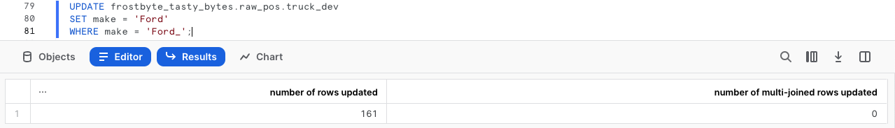
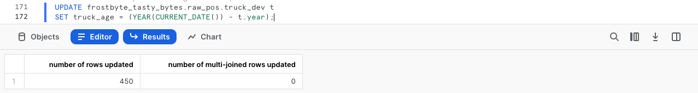

author: Jacob Kranzler
id: tasty_bytes_zero_to_snowflake_transformation_it
summary: Quickstart Tasty Bytes - Da zero a Snowflake - Trasformazione
categories: Tasty-Bytes, Getting-Started, Featured
environments: web
status: Published 
feedback link: https://github.com/Snowflake-Labs/sfguides/issues
tags: Getting Started, Data Engineering, Data Warehouse, it  


# Tasty Bytes - Da zero a Snowflake - Trasformazione
<!-- ------------------------ -->

## Trasformazione in Snowflake
Duration: 1 

### Panoramica
Questo quickstart Powered by Tasty Bytes - Da zero a Snowflake è dedicato alla trasformazione.

In questo quickstart esamineremo un’ampia gamma di funzionalità di Snowflake, tra cui Zero-Copy Cloning e Time Travel, per soddisfare un requisito aziendale di Tasty Bytes.

### Prerequisiti
- Prima di iniziare, assicurati di avere completato il [**quickstart Introduzione a Tasty Bytes**](/guide/tasty_bytes_introduction_it/index.html), che spiega nei dettagli come configurare un account di prova e implementare l’ambiente base di Tasty Bytes necessario per completare questo quickstart.

### Cosa imparerai
- Come clonare una tabella
- Come utilizzare la cache dei set di risultati di Snowflake
- Come aggiungere una colonna a una tabella
- Come aggiornare i dati in una colonna
- Come utilizzare Time Travel
- Come fare lo swap, il drop e l’undrop di una tabella

### Cosa realizzerai
- Comprensione di importanti funzionalità di trasformazione di Snowflake 
- Un clone di sviluppo di una tabella di produzione
- Una nuova colonna in una tabella con le età calcolate dei food truck in anni


## Creare un foglio di lavoro e copiare il codice SQL
Duration: 1

### Panoramica
In questo quickstart seguiremo la storia del cliente Tasty Bytes attraverso un foglio di lavoro SQL di Snowsight, utilizzando questa pagina come guida completa di commenti aggiuntivi, immagini e link alla documentazione.

In questa sezione vedremo nei dettagli come accedere a Snowflake, creare un nuovo foglio di lavoro, rinominarlo, copiare da GitHub il codice SQL che utilizzeremo in questo quickstart e incollarlo nel foglio di lavoro.

### Passaggio 1 - Accedere a Snowflake tramite URL
- Apri una finestra del browser e inserisci l’URL del tuo account Snowflake 

### Passaggio 2 - Effettuare l’accesso a Snowflake
- Accedi al tuo account Snowflake.
    - 

### Passaggio 3 - Accedere ai fogli di lavoro
- Fai clic sulla scheda Worksheets nella barra di navigazione sulla sinistra.
    - 

### Passaggio 4 - Creare un foglio di lavoro
- Nella scheda Worksheets, fai clic sul pulsante “+” nell’angolo superiore destro di Snowsight e scegli “SQL Worksheet”
    - 

### Passaggio 5 - Rinominare un foglio di lavoro
- Rinomina il foglio di lavoro facendo clic sul nome generato automaticamente (data e ora) e inserendo “Tasty Bytes - Transformation”
    - 

### Passaggio 6 - Accedere al codice SQL di questo quickstart in GitHub
- Fai clic sul pulsante qui sotto, che ti porterà al file SQL di Tasty Bytes archiviato su GitHub. <button>[tb_zts_transformation](https://github.com/Snowflake-Labs/sf-samples/blob/main/samples/tasty_bytes/tb_zts_transformation.sql)</button>

### Passaggio 7 - Copiare la configurazione SQL da GitHub
- In GitHub, vai sul lato destro e fai clic su “Copy raw contents”. Tutto il codice SQL necessario verrà copiato nei tuoi Appunti.
    - 

### Passaggio 8 - Incollare la configurazione SQL da GitHub nel tuo foglio di lavoro Snowflake
- Torna a Snowsight e al foglio di lavoro che hai appena creato e incolla (*CMD + V per Mac o CTRL + V per Windows*) il codice che abbiamo appena copiato da GitHub.

### Passaggio 9 - Fai clic su Next -->

## Clonare istantaneamente una tabella di produzione per lo sviluppo
Duration: 1

### Panoramica
Nel quadro dell’analisi della flotta di food truck di Tasty Bytes, il nostro sviluppatore è stato incaricato di aggiungere alla tabella dei furgoni una colonna calcolata con l’età dei veicoli. 
 
Come tutti gli sviluppatori competenti, sappiamo che non possiamo lavorare su una tabella di produzione, quindi per prima cosa dobbiamo creare un ambiente di sviluppo che riproduca quello di produzione.

### Passaggio 1 - Creare un clone dell’ambiente di produzione
Grazie all’architettura unica di Snowflake, possiamo creare istantaneamente uno snapshot della tabella `raw_pos.truck` di produzione utilizzando la funzionalità [CLONE](https://docs.snowflake.com/en/sql-reference/sql/create-clone) e chiamarlo `raw_pos.truck_dev`.

Ora eseguiamo la prossima serie di query per impostare il contesto del nostro ruolo `tasty_dev` e creare il clone della tabella; nota che non abbiamo bisogno di impostare il contesto del warehouse, poiché la clonazione non lo richiede.

``` 
USE ROLE tasty_dev;

CREATE OR REPLACE TABLE frostbyte_tasty_bytes.raw_pos.truck_dev 
    CLONE frostbyte_tasty_bytes.raw_pos.truck; 
``` 


> aside positive
**Zero-Copy Cloning**: crea una copia di un database, di uno schema o di una tabella. Al momento della creazione del clone viene creato uno snapshot dei dati contenuti nell’oggetto sorgente, che viene messo a disposizione dell’oggetto clonato. L’oggetto clonato è scrivibile ed è indipendente dalla sorgente del clone. In altri termini, le modifiche apportate all’oggetto sorgente non si riflettono sull’oggetto clone e viceversa. 
>

### Passaggio 2 - Fai clic su Next -->

## Testare la cache dei set di risultati di Snowflake
Duration: 1

### Panoramica
Con il nostro clone Zero-Copy istantaneamente disponibile, possiamo iniziare a utilizzarlo per sviluppare senza temere ripercussioni sull’ambiente di produzione. Tuttavia, prima di apportare qualsiasi modifica, eseguiamo alcune semplici query sul clone per testare la cache dei set di risultati di Snowflake.

### Passaggio 1 - Eseguire query sulla tabella clonata
Ora che vogliamo interrogare la tabella, dovremo usare il warehouse `tasty_dev_wh`. 

Eseguiamo le prossime due query con la seconda istruzione, che produce un set di risultati composto dai food truck con i rispettivi anni di produzione, marchi e modelli, assicurandoci di usare [ORDER BY](https://docs.snowflake.com/en/sql-reference/constructs/order-by) per ordinare i risultati in base alla colonna `truck_id`.

``` 
USE WAREHOUSE tasty_dev_wh;

SELECT 
    t.truck_id, 
    t.year, 
    t.make, 
    t.model 
FROM frostbyte_tasty_bytes.raw_pos.truck_dev t 
ORDER BY t.truck_id; 
```


### Passaggio 2 - Ripetere la query
Per testare la [cache dei set di risultati](https://docs.snowflake.com/en/user-guide/querying-persisted-results) di Snowflake, la nostra prossima query sarà identica a quella appena eseguita. Tuttavia, questa volta accederemo anche a Query Profile per evidenziare il fatto che ha restituito i risultati istantaneamente, poiché provenivano dalla cache dei set di risultati.

Dopo avere eseguito la query riportata sotto, segui i passaggi nella schermata in figura per accedere a [Query Profile](https://docs.snowflake.com/en/user-guide/ui-query-profile). Da Query Profile vedremo un singolo nodo con l’indicazione `QUERY RESULT REUSE`.

```
SELECT
    t.truck_id,
    t.year,
    t.make,
    t.model
FROM frostbyte_tasty_bytes.raw_pos.truck_dev t
ORDER BY t.truck_id;
```

 

>aside positive
Se un utente ripete una query che è già stata eseguita e i dati nelle tabelle non sono cambiati dall’ultima esecuzione della query, il risultato della query è lo stesso. Invece di eseguire nuovamente la query, Snowflake restituisce semplicemente lo stesso risultato fornito in precedenza. 
>         
>Questo può ridurre notevolmente il tempo necessario per le query, poiché Snowflake evita di eseguire nuovamente la query e recupera invece il risultato direttamente dalla cache.
>

### Passaggio 3 - Fai clic su Next -->

## Aggiornare i dati e calcolare l’età dei food truck
Duration: 1

### Panoramica
In base all’output ottenuto sopra, per prima cosa dobbiamo correggere l’errore di battitura nei record Ford_ che abbiamo visto nella colonna `make`. Poi potremo iniziare a lavorare sul calcolo che ci fornirà l’età di ogni furgone.

### Passaggio 1 - Aggiornare i valori errati in una colonna
Per iniziare questa sezione, correggiamo l’errore di battitura eseguendo la prossima query, che utilizza [UPDATE](https://docs.snowflake.com/en/sql-reference/sql/update) per modificare le righe in `truck_dev` quando ([WHERE](https://docs.snowflake.com/en/sql-reference/constructs/where)) la marca è uguale a Ford_.

```
UPDATE frostbyte_tasty_bytes.raw_pos.truck_dev 
SET make = 'Ford' 
WHERE make = 'Ford_';
```



### Passaggio 2 - Creare il calcolo dell’età
Ora che abbiamo corretto l’errore di battitura, possiamo calcolare l’età in anni dei furgoni della nostra flotta. Esegui la prossima query, dove utilizzeremo [YEAR](https://docs.snowflake.com/en/sql-reference/functions/year) e [CURRENT_DATE](https://docs.snowflake.com/en/sql-reference/functions/current_date) per calcolare questo valore.

```
SELECT
    t.truck_id,
    t.year,
    t.make,
    t.model,
    (YEAR(CURRENT_DATE()) - t.year) AS truck_age_year
FROM frostbyte_tasty_bytes.raw_pos.truck_dev t;
```


### Passaggio 3 - Fai clic su Next -->

## Aggiungere una colonna e aggiornarla
Duration: 1

### Panoramica
Ora che abbiamo completato il calcolo dell’età dei furgoni in anni, aggiungiamo una nuova colonna alla tabella clonata per supportarlo e quindi aggiorniamo la colonna per riflettere i valori calcolati.

### Passaggio 1 - Aggiungere una colonna a una tabella
Per iniziare, esegui la prossima query che utilizza [ALTER TABLE… ADD COLUMN](https://docs.snowflake.com/en/sql-reference/sql/alter-table-column) per creare una colonna `truck_age` vuota del [tipo di dati NUMBER](https://docs.snowflake.com/en/sql-reference/data-types-numeric) nella tabella `truck_dev`. 

Questa query fornirà un risultato `Statement executed successfully`.

```
ALTER TABLE frostbyte_tasty_bytes.raw_pos.truck_dev
    ADD COLUMN truck_age NUMBER(4);
```

### Passaggio 2 - Aggiungere valori calcolati alla colonna
Dopo avere creato la colonna, possiamo avviare la prossima query che aggiornerà ([UPDATE](https://docs.snowflake.com/en/sql-reference/sql/update)) la nuova colonna `truck_age` vuota utilizzando il calcolo dell’età del furgone che abbiamo creato nella sezione precedente. 
```
UPDATE frostbyte_tasty_bytes.raw_pos.truck_dev t
    SET truck_age = (YEAR(CURRENT_DATE()) / t.year);
``` 


### Passaggio 3 - Eseguire una query sulla nuova colonna
Dopo avere aggiornato i dati, eseguiamo una query rapida sulla tabella per vedere i risultati nella nuova colonna `truck_age`. 
```
SELECT
    t.truck_id,
    t.year,
    t.truck_age
FROM frostbyte_tasty_bytes.raw_pos.truck_dev t;
``` 


**Ahi ahi!** Per fortuna siamo sviluppatori intelligenti e non abbiamo rischiato di fare una cosa di questo genere in produzione. 

Evidentemente abbiamo sbagliato il calcolo di `truck_age` inserendo una divisione al posto di una sottrazione. Dovremo risolvere questo problema nella prossima sezione.

### Passaggio 4 - Fai clic su Next -->

## Utilizzare Time Travel per il disaster recovery dei dati
Duration: 1

### Panoramica
Anche se abbiamo fatto un errore, Snowflake offre molte funzionalità che possono aiutarci a salvare la situazione. In questo processo utilizzeremo Query History, le variabili SQL e Time Travel per ripristinare la tabella `truck_dev` allo stato in cui si trovava prima di quell’istruzione pdate errata.

>aside positive 
Snowflake Time Travel consente di accedere ai dati storici (ossia dati che sono stati modificati o cancellati) in qualsiasi momento entro un periodo definito.
>

### Passaggio 1 - Utilizzare Query History
Per iniziare il processo di ripristino, esegui la prossima query, che utilizza la funzione [QUERY_HISTORY](https://docs.snowflake.com/en/sql-reference/functions/query_history) di Snowflake per recuperare un elenco di tutte le istruzioni di aggiornamento che abbiamo eseguito sulla tabella `truck_dev`.
 ```
SELECT 
    query_id,
    query_text,
    user_name,
    query_type,
    start_time
FROM TABLE(frostbyte_tasty_bytes.information_schema.query_history())
WHERE 1=1
    AND query_type = 'UPDATE'
    AND query_text LIKE '%frostbyte_tasty_bytes.raw_pos.truck_dev%'
ORDER BY start_time DESC;
``` 


### Passaggio 2 - Impostare una variabile SQL
Come previsto, vediamo la correzione dell’errore di battitura e l’aggiornamento del calcolo errato, accompagnati dai rispettivi query_id univoci. Esegui la prossima query, che crea una variabile SQL `query_id` che utilizzeremo per ripristinare le modifiche mediante Time Travel nel prossimo passaggio. 

Dopo l’esecuzione riceverai un risultato `Statement executed successfully`. 
```
SET query_id = 
(
    SELECT TOP 1 query_id
    FROM TABLE(frostbyte_tasty_bytes.information_schema.query_history())
    WHERE 1=1
        AND query_type = 'UPDATE'
        AND query_text LIKE '%SET truck_age = (YEAR(CURRENT_DATE()) / t.year);'
    ORDER BY start_time DESC
);
```

### Passaggio 3 - Utilizzare Time Travel per ripristinare la tabella
Con la nostra query_id errata memorizzata come variabile, possiamo eseguire la prossima query, che utilizza Time Travel per sostituire la tabella `truck_dev` con la versione che esisteva prima ([BEFORE](https://docs.snowflake.com/en/sql-reference/constructs/at-before)) dell’istruzione query_id errata. 

``` 
CREATE OR REPLACE TABLE frostbyte_tasty_bytes.raw_pos.truck_dev 
    AS 
SELECT * FROM frostbyte_tasty_bytes.raw_pos.truck_dev 
BEFORE(STATEMENT => $query_id); 
``` 


Di seguito sono riportate le altre opzioni disponibili per le istruzioni Time Travel.
>aside positive
**AT:** la parola chiave AT indica che la richiesta include tutte le eventuali modifiche apportate da un’istruzione o una transazione con data e ora uguali al parametro specificato.
>
>**BEFORE:** la parola chiave BEFORE indica che la richiesta si riferisce a un punto immediatamente precedente al parametro specificato.
>
>**TIMESTAMP:** specifica una data e un’ora esatta da utilizzare per Time Travel.
>
>**OFFSET:** specifica la differenza in secondi dall’orario attuale da utilizzare per Time Travel.
>
>**STATEMENT:** specifica la query_id di un’istruzione da utilizzare come punto di riferimento per Time Travel.
>

### Passaggio 4 - Fai clic su Next -->

## Promuovere da sviluppo a produzione
Duration: 1

### Panoramica
Ora che la tabella `truck_dev` è tornata allo stato in cui si trovava prima della nostra istruzione di aggiornamento errata, possiamo assicurarci che la colonna venga aggiornata correttamente. Poi promuoveremo la tabella con il calcolo corretto in produzione per completare il compito che ci è stato assegnato.

### Passaggio 1 - Aggiungere i valori calcolati correttamente alla colonna
Utilizzando lo stesso processo di prima, esegui la prossima query, controllando attentamente di utilizzare la sottrazione invece della divisione.

```
UPDATE frostbyte_tasty_bytes.raw_pos.truck_dev t
SET truck_age = (YEAR(CURRENT_DATE()) - t.year);
```



### Passaggio 2 - Scambiare la tabella dall’ambiente di sviluppo a quello di produzione
Ora che abbiamo completato tutte le operazioni in `truck_dev`, esegui le prossime due query, in cui per prima cosa assumiamo il ruolo `sysadmin`, con privilegi più elevati. Come `sysadmin`, la seconda query utilizza [ALTER TABLE… SWAP WITH](https://docs.snowflake.com/en/sql-reference/sql/alter-table) per promuovere la tabella `truck_dev` a `truck` e viceversa.

Al termine riceverai il risultato `Statement executed successfully.`.

``` 
USE ROLE sysadmin;

ALTER TABLE frostbyte_tasty_bytes.raw_pos.truck_dev 
    SWAP WITH frostbyte_tasty_bytes.raw_pos.truck; 
```

### Passaggio 3 - Convalidare in produzione
Per verificare che il processo sia riuscito, diamo un’occhiata alla tabella di produzione `truck` per confermare che lo swap sia stato eseguito correttamente e che i risultati di `truck_age` siano validi.

``` 
SELECT 
    t.truck_id, 
    t.year, 
    t.truck_age 
FROM frostbyte_tasty_bytes.raw_pos.truck t 
WHERE t.make = 'Ford';
```


### Passaggio 4 - Fai clic su Next -->

## Fare il drop e l’undrop di tabelle
Duration: 1

### Panoramica
Possiamo dire ufficialmente che il nostro sviluppatore ha completato il compito che gli era stato assegnato. Ora che la colonna `truck_age` è stata creata e calcolata correttamente, il nostro `sysadmin` può eliminare la tabella superflua e consegnare il suo lavoro.

### Passaggio 1 - Fare il drop di una tabella
Per rimuovere la tabella dal database, esegui la prossima query, che utilizza [DROP TABLE](https://docs.snowflake.com/en/sql-reference/sql/drop-table).

```
DROP TABLE frostbyte_tasty_bytes.raw_pos.truck;
```


**Ahi ahi!** Quel set di risultati dimostra che anche il nostro `sysadmin` può fare errori. Abbiamo rimosso per errore la tabella di produzione `truck` e non la tabella di sviluppo `truck_dev`! Per fortuna, la funzionalità Time Travel di Snowflake può di nuovo venire in nostro aiuto.

### Passaggio 2 - Fare l’undrop di una tabella
Prima che altri sistemi possano risentirne, esegui al più presto la prossima query, che ripristinerà ([UNDROP](https://docs.snowflake.com/en/sql-reference/sql/undrop-table)) la tabella `truck` rimossa.

```
UNDROP TABLE frostbyte_tasty_bytes.raw_pos.truck;
```


### Passaggio 3 - Fare il drop della tabella giusta
Va bene, ora completiamo ufficialmente il lavoro eseguendo l’ultima query per fare il drop della tabella corretta `truck_dev`.

```
DROP TABLE frostbyte_tasty_bytes.raw_pos.truck_dev;
```


### Passaggio 4 - Fai clic su Next -->

## Conclusione e fasi successive
Duration: 1

### Conclusione
Ottimo lavoro! Hai completato il quickstart Tasty Bytes - Da zero a Snowflake - Trasformazione. 

In questo quickstart hai:
- Clonato una tabella
- Utilizzato la cache dei set di risultati di Snowflake
- Aggiunto una colonna a una tabella
- Aggiornato i dati in una colonna
- Utilizzato Time Travel per il disaster recovery dei dati
- Fatto lo swap, il drop e l’undrop di una tabella

Se desideri ripetere questo quickstart, usa gli script di ripristino alla fine del foglio di lavoro associato.

### Fasi successive
Per continuare il tuo percorso nel Data Cloud di Snowflake, visita il link qui sotto per vedere tutti gli altri quickstart Powered by Tasty Bytes disponibili.

- ### [Quickstart Powered by Tasty Bytes - Sommario](/guide/tasty_bytes_introduction_it/index.html#3)
