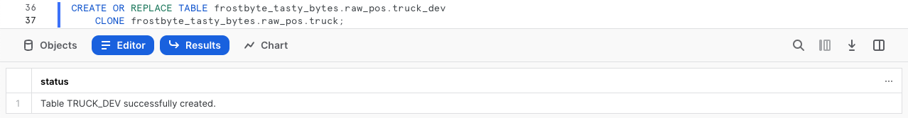
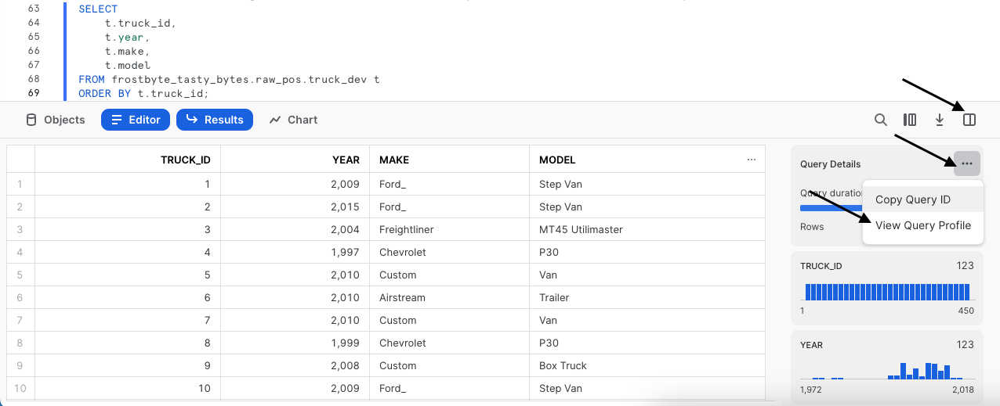
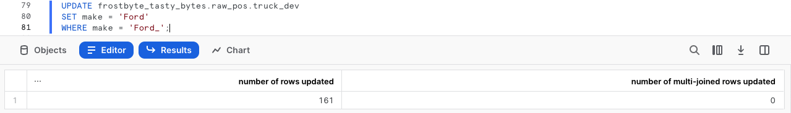
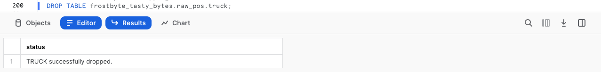

author: Jacob Kranzler
id: tasty_bytes_zero_to_snowflake_transformation_ja
summary: Tasty Bytes - ゼロからのSnowflake - 変換クイックスタート
categories: Tasty-Bytes, Getting-Started, Featured
environments: web
status: Published 
feedback link: https://github.com/Snowflake-Labs/sfguides/issues
tags: Getting Started, Data Engineering, Data Warehouse, ja

# Tasty Bytes - ゼロからのSnowflake - 変換
<!-- ------------------------ -->

## Snowflakeでの変換
Duration: 1


### 概要
Powered by Tasty Bytes - ゼロからのSnowflakeクイックスタートへようこそ。今回は変換を中心的に取り上げます。

このクイックスタートでは、Snowflakeのさまざまな機能をご紹介し、Tasty Bytesのビジネス要件を満たすゼロコピークローンやタイムトラベルなどの主要機能について詳しく説明します。

### 前提条件
- 開始する前に、本クイックスタートを完了するために必要なトライアルアカウントのセットアップとTasty Bytes基盤の展開について説明している[**Tasty Bytesの紹介クイックスタート**](https://quickstarts.snowflake.com/guide/tasty_bytes_introduction/index.html)を完了しておくようにしてください。

### 学習する内容
- テーブルのクローンを作成する方法
- Snowflakeの結果セットキャッシュを使用する方法
- テーブルに列を追加する方法
- 列のデータを更新する方法
- タイムトラベルを使用する方法
- テーブルをスワップ、ドロップ、アンドロップする方法

### 構築するもの
- 重要なSnowflake変換機能の理解
- 本番テーブルの開発テーブルクローン
- 計算されたキッチンカーの使用年数を格納する、テーブルの新しい列


## ワークシートの作成とSQLのコピー
Duration: 1

### 概要
このクイックスタートでは、Snowsight SQLワークシートを使ってTasty Bytesをテーマとしたストーリーを追っていきます。このページには、横に置いて活用できるよう、追加の解説、画像、ドキュメントリンクが掲載されています。

本セクションでは、Snowflakeへのログイン、新しいワークシートの作成、ワークシートの名前の変更、GitHubからのSQLのコピー、このクイックスタートで利用するSQLの貼り付けについて説明します。

### ステップ1 - URLでSnowflakeにアクセスする
- ブラウザウィンドウを開き、SnowflakeアカウントのURLを入力します

### ステップ2 - Snowflakeにログインする
- Snowflakeアカウントにログインします。
  - 


### ステップ3 - ワークシートに移動する
- 左側のナビゲーションバーにある「ワークシート」タブをクリックします。
  - 

### ステップ4 - ワークシートを作成する
- ワークシート内で、Snowsightの右上にある「+」ボタンをクリックし、「SQLワークシート」を選択します。
  - 

### ステップ5 - ワークシートの名前を変更する
- 自動生成されたタイムスタンプ名をクリックし、「Tasty Bytes - 変換」と入力してワークシートの名前を変更します。
  - 

### ステップ6 - GitHubでQuickstart SQLにアクセスする
- 下のボタンをクリックすると、GitHubでホストされているTasty BytesのSQLファイルに移動します。<button>[tb_zts_transformation](https://github.com/Snowflake-Labs/sf-samples/blob/main/samples/tasty_bytes/tb_zts_transformation.sql)</button>

### ステップ7 - GitHubからSetup SQLをコピーする
- GitHub内で右側に移動し、「未加工コンテンツをコピー」をクリックします。これで、必要なSQLがすべてクリップボードにコピーされます。
  - 

### ステップ8 - GitHubからSnowflakeワークシートにSetup SQLを貼り付ける
- Snowsightと新しく作成したワークシートに戻り、先ほどGitHubからコピーしたものを貼り付けます（*Macの場合はCMD + V、Windowsの場合はCTRL + V*）。

### ステップ9 - 「Next」をクリックする

## 開発用に本番テーブルのクローンを即座に作成する
Duration: 1

### 概要
Tasty Bytesのキッチンカーフリート分析の一環として、私たちの開発者は、計算されたキッチンカーの使用年数列をキッチンカーテーブルに追加するタスクを任されました。

優れた開発者である私たちは、本番テーブルに対して開発を行ってはならないということを認識しています。そのため、まず本番環境を模した開発環境を作成する必要があります。

### ステップ1 - 本番のクローンを作成する
Snowflakeの独自のアーキテクチャのおかげで、[CLONE](https://docs.snowflake.com/en/sql-reference/sql/create-clone)機能を使用して本番`raw_pos.truck`のスナップショットを即時に作成し、それを`raw_pos.truck_dev`と名づけることができます。

では、次の一連のクエリを実行し、`tasty_dev`ロールコンテキストを設定しテーブルクローンを作成しましょう。ここでは、クローン作成にウェアハウスコンテキストは必要ないため、ウェアハウスコンテキストの設定は必要ありません。

```
USE ROLE tasty_dev;

CREATE OR REPLACE TABLE frostbyte_tasty_bytes.raw_pos.truck_dev 
    CLONE frostbyte_tasty_bytes.raw_pos.truck;
```


> aside positive
> **ゼロコピークローン**：データベース、スキーマまたはテーブルのコピーを作成します。クローンの作成時にソースオブジェクトに存在するデータのスナップショットが取得され、クローンオブジェクトで利用できるようになります。
>クローンオブジェクトは書き込み可能であり、クローン元から独立しています。つまり、ソースオブジェクトまたはクローンオブジェクトのどちらかに加えられた変更は、もう一方のオブジェクトには反映されないということです。
>

### ステップ2 - 「Next」をクリックする

## Snowflakeのクエリ結果セットキャッシュのテスト
Duration: 1

### 概要
ゼロコピークローンが即時に利用できるため、本番環境に影響を与える不安なく、クローンに対して開発を開始できます。ただし、何らかの変更を加える前に、まず簡単なクエリを実行し、Snowflakeの結果セットキャッシュをテストしてみましょう。

### ステップ1 - クローンテーブルをクエリする
次に、テーブルをクエリするにあたり、`tasty_dev_wh`ウェアハウスを使用する必要があります。

次の2つのクエリを開始しましょう。2番目のステートメントでは、キッチンカー、その使用年数、メーカー、モデルを含む結果セットを生成し、`truck_id`列で[ORDER BY](https://docs.snowflake.com/en/sql-reference/constructs/order-by)を実行します。

```
USE WAREHOUSE tasty_dev_wh;

SELECT
    t.truck_id,
    t.year,
    t.make,
    t.model
FROM frostbyte_tasty_bytes.raw_pos.truck_dev t
ORDER BY t.truck_id;
```


### ステップ2 - クエリを再実行する
Snowflakeの[結果セットキャッシュ](https://docs.snowflake.com/en/user-guide/querying-persisted-results)をテストするために実行するクエリは、先ほど実行したものと同じです。しかし、ここではさらに一歩進んで、このクエリが結果セットキャッシュから結果が届くとすぐに結果を返したことを示すクエリプロファイルにアクセスします。

以下のクエリを実行した後、スクリーンショットの手順に従って[クエリプロファイル](https://docs.snowflake.com/en/user-guide/ui-query-profile)にアクセスします。クエリプロファイルを調べると、`QUERY RESULT REUSE`と書かれている単一のノードがあるのが分かります。

```
SELECT
    t.truck_id,
    t.year,
    t.make,
    t.model
FROM frostbyte_tasty_bytes.raw_pos.truck_dev t
ORDER BY t.truck_id;
```




>aside positive
> ユーザーが既に実行されたクエリを繰り返し、クエリが最後に実行されてからテーブル内のデータが変更されていない場合、クエリの結果は同じになります。Snowflakeは、クエリを再実行する代わりに、以前に返された結果と同じ結果を返します。
> 
> Snowflakeはクエリの実行をバイパスし、代わりにキャッシュから直接結果を取得するため、これによりクエリ時間を大幅に短縮できます。
>

### ステップ3 - 「Next」をクリックする

## データの更新とキッチンカーの使用年数の計算
Duration: 1

### 概要
上記の出力に基づき、まず`make`列に表示されたFord\_ recordsのタイプミスに対処する必要があります。その後、各キッチンカーの使用年数を算出する計算に取りかかることができます。

### ステップ1 - 列内の誤った値を更新する
このセクションを始めるにあたり、次のクエリを実行してタイプミスを修正していきましょう。ここでは、[UPDATE](https://docs.snowflake.com/en/sql-reference/sql/update)を使用して、[WHERE](https://docs.snowflake.com/en/sql-reference/constructs/where)でメーカーがFord_と一致する`truck_dev`の行を変更します。

```
UPDATE frostbyte_tasty_bytes.raw_pos.truck_dev 
SET make = 'Ford' 
WHERE make = 'Ford_';
```



### ステップ2 - 使用年数計算を構築する

タイプミスを修正したので、フリート内のキッチンカーの使用年数を計算できるようになりました。次のクエリを実行してください。ここでは、[YEAR](https://docs.snowflake.com/en/sql-reference/functions/year)と[CURRENT_DATE](https://docs.snowflake.com/en/sql-reference/functions/current_date)をこの計算に利用していきます。

```
SELECT
    t.truck_id,
    t.year,
    t.make,
    t.model,
    (YEAR(CURRENT_DATE()) - t.year) AS truck_age_year
FROM frostbyte_tasty_bytes.raw_pos.truck_dev t;
```


### ステップ3 - 「Next」をクリックする

## 列の追加と更新
Duration: 1

### 概要

キッチンカーの使用年数の計算がすべて終わりましたので、対応する新しい列をクローンテーブルに追加し、仕上げに列を更新して計算された値を反映させましょう。

### ステップ1 - 列をテーブルに追加する
まず、[ALTER TABLE...](https://docs.snowflake.com/en/sql-reference/sql/alter-table-column)を使用する次のクエリを実行してください。[](https://docs.snowflake.com/en/sql-reference/sql/alter-table-column)[ADD COLUMN](https://docs.snowflake.com/en/sql-reference/sql/alter-table-column)で、[データ型がNUMBER](https://docs.snowflake.com/en/sql-reference/data-types-numeric)の空の`truck_age`列を`truck_dev`テーブルに作成します。

このクエリで、`Statement executed successfully`の結果が得られます。

```
ALTER TABLE frostbyte_tasty_bytes.raw_pos.truck_dev
    ADD COLUMN truck_age NUMBER(4);
```

### ステップ2 - 計算値を列に追加する
列を追加したので、次のクエリを開始できるようになります。ここでは、前のセクションで構築したキッチンカーの使用年数計算を使用して新しい空の`truck_age`列を[UPDATE](https://docs.snowflake.com/en/sql-reference/sql/update)します。
```
UPDATE frostbyte_tasty_bytes.raw_pos.truck_dev t
    SET truck_age = (YEAR(CURRENT_DATE()) / t.year);
```


### ステップ 3 - 新しい列をクエリする
データの更新が成功したら、次にテーブルに対して簡単なクエリを実行し、`truck_age`列がどのように見えるか確認してみましょう。
```
SELECT
    t.truck_id,
    t.year,
    t.truck_age
FROM frostbyte_tasty_bytes.raw_pos.truck_dev t;
```


**大変です！** 私たちが優れた開発者であり、やみくもに本番環境でこれをしでかさなかったことに感謝しておきましょう。

`truck_age`の計算を間違えて、引き算ではなく割り算をしてしまったようです。  次のセクションでは、これを解決する必要があります。

### ステップ4 - 「Next」をクリックする

## タイムトラベルを利用したデータ災害からの回復
Duration: 1

### 概要
私たちはミスをしましたが、Snowflakeにはトラブル解消に役立つ多くの機能が備わっています。このプロセスでは、クエリ履歴、SQL変数、タイムトラベルを活用して、`truck_dev`テーブルを、誤った更新ステートメントを実行する前の状態に戻します。

>aside positive
> Snowflakeのタイムトラベル機能では、定義された期間内の任意の時点で履歴データ（変更または削除されたデータ）にアクセスできます。
>

### ステップ1 - クエリ履歴を活用する
リカバリプロセスを開始するにあたり、まず次のクエリを実行します。ここでは、Snowflake [QUERY_HISTORY](https://docs.snowflake.com/en/sql-reference/functions/query_history)関数を使用し、`truck_dev`テーブルで実行したすべての更新ステートメントのリストを取得します。
```
SELECT 
    query_id,
    query_text,
    user_name,
    query_type,
    start_time
FROM TABLE(frostbyte_tasty_bytes.information_schema.query_history())
WHERE 1=1
    AND query_type = 'UPDATE'
    AND query_text LIKE '%frostbyte_tasty_bytes.raw_pos.truck_dev%'
ORDER BY start_time DESC;
```


### ステップ2 - SQL変数を設定する
予想通り、タイプミスの修正と間違った計算の更新、およびそれらに関連する一意のquery_idが表示されます。次のクエリを実行してください。ここでは、`query_id` SQL変数を作成します。次のステップではその変数を使ってタイムトラベルで変更を元に戻します。

実行すると`Statement executed successfully`の結果が得られます。
```
SET query_id = 
(
    SELECT TOP 1 query_id
    FROM TABLE(frostbyte_tasty_bytes.information_schema.query_history())
    WHERE 1=1
        AND query_type = 'UPDATE'
        AND query_text LIKE '%SET truck_age = (YEAR(CURRENT_DATE()) / t.year);'
    ORDER BY start_time DESC
);
```

### ステップ3 - タイムトラベルを活用してテーブルを戻す
誤ったquery_idが変数として保存されているため、次のクエリを実行し、タイムトラベルを使用して`truck_dev`テーブルを誤ったquery_id文の[BEFORE](https://docs.snowflake.com/en/sql-reference/constructs/at-before)の状態に置き換えることができます。

```
CREATE OR REPLACE TABLE frostbyte_tasty_bytes.raw_pos.truck_dev
    AS 
SELECT * FROM frostbyte_tasty_bytes.raw_pos.truck_dev
BEFORE(STATEMENT => $query_id); 

```


利用できるその他のタイムトラベルステートメントのオプションについては、以下のリストを参照してください。
>aside positive
> **AT：** ATキーワードは、指定されたパラメータに等しいタイムスタンプを持つステートメント、またはトランザクションによる変更がリクエストに含まれることを指定します。
> 
> **BEFORE：** BEFOREキーワードは、リクエストが指定されたパラメータの直前のポイントを参照するように指定します。
> 
> **TIMESTAMP：** タイムトラベルに使用する正確な日付と時刻を指定します。
> 
> **OFFSET：** タイムトラベルに使用する現在時刻との差を秒単位で指定します。
> 
> **STATEMENT：** タイムトラベルの参照ポイントとして使用するステートメントのクエリIDを指定します。
>

### ステップ4 - 「Next」をクリックする

## 開発を本番に昇格
Duration: 1

### 概要
`truck_dev`テーブルを誤った更新ステートメントの前の状態に戻すことができたので、次に列を正しく更新することができます。ここから、正しい計算を行ったテーブルを本番に昇格させ、割り当てられたタスクを完了させます。

### ステップ1 - 正しく計算された値を列に追加する
前と同じプロセスを使って、次のクエリを実行し、割り算ではなく引き算を使っていることを再確認してください。

```
UPDATE frostbyte_tasty_bytes.raw_pos.truck_dev t
SET truck_age = (YEAR(CURRENT_DATE()) - t.year);
```


### ステップ2 - 開発テーブルを本番と入れ替える
`truck_dev`のすべてが完了したところで、次の2つのクエリを開始してください。ここではまず、より権限のある`sysadmin`ロールを引き受けます。`sysadmin`として、2つ目のクエリは[ALTER TABLE... SWAP WITH](https://docs.snowflake.com/en/sql-reference/sql/alter-table)を使用して、`truck_dev`テーブルを`truck`に昇格させ、その逆も実行します。

完了すると`Statement executed successfully.`の結果が得られます。

```
USE ROLE sysadmin;

ALTER TABLE frostbyte_tasty_bytes.raw_pos.truck_dev 
    SWAP WITH frostbyte_tasty_bytes.raw_pos.truck;
```

### ステップ3 - 本番を検証する
プロセスが成功したことを確認するために、本番の`truck`テーブルを確認し、入れ替えが成功し、`truck_age`の結果が有効であることを検証しましょう。

```
SELECT
    t.truck_id,
    t.year,
    t.truck_age
FROM frostbyte_tasty_bytes.raw_pos.truck t
WHERE t.make = 'Ford';

```


### ステップ4 - 「Next」をクリックする

## テーブルのドロップとドロップ解除
Duration: 1

### 概要

私たちの開発者は任せられたタスクを完了したと明言することができるでしょう。`truck_age`列が整備され、正しく計算されるようになったため、`sysadmin`が残りのテーブルをクリーンアップし、その日の作業を終えることができます。

### ステップ1 - テーブルをドロップする
データベースからテーブルを削除するために、[DROP TABLE](https://docs.snowflake.com/en/sql-reference/sql/drop-table)を利用する次のクエリを実行してください。

```
DROP TABLE frostbyte_tasty_bytes.raw_pos.truck;
```



**大変です！** この結果セットを見ると、`sysadmin`でさえも間違いを犯すということが分かります。誤って、開発の`truck_dev`ではなく本番の`truck`をドロップしてしまいました。ありがたいことに、ここでもSnowflakeのタイムトラベルが活躍します。

### ステップ2 - テーブルをドロップ解除する
システムに影響が出る前に次のクエリを急いで実行し、`truck`テーブルを[UNDROP](https://docs.snowflake.com/en/sql-reference/sql/undrop-table)しましょう。

```
UNDROP TABLE frostbyte_tasty_bytes.raw_pos.truck;
```


### ステップ3 - 正しいテーブルをドロップする
さて、最後に、締めくくりとして`truck_dev`を正しくドロップするクエリを実行しましょう。

```
DROP TABLE frostbyte_tasty_bytes.raw_pos.truck_dev;
```


### ステップ4 - 「Next」をクリックする

## まとめと次のステップ
Duration: 1

### まとめ
すばらしい出来です！これで、Tasty Bytes - ゼロからのSnowflake - 変換クイックスタートが無事完了しました。

これにより、次のことができるようになりました。

- テーブルのクローンを作成する
- Snowflakeの結果セットキャッシュを使用する
- テーブルに列を追加する
- 列のデータを更新する
- タイムトラベルを利用してデータ災害から回復する
- テーブルの入れ替え、ドロップ、およびドロップ解除を行う

このクイックスタートを再実行したい場合は、関連するワークシートの下部にあるリセットスクリプトを利用してください。

### 次のステップ

引き続きSnowflakeデータクラウドについて学習するには、以下のリンクから利用可能なその他すべてのPowered by Taste Bytes - クイックスタートをご覧ください。

- ### [Powered by Tasty Bytes - クイックスタート目次](https://quickstarts.snowflake.com/guide/tasty_bytes_introduction/index.html#3)