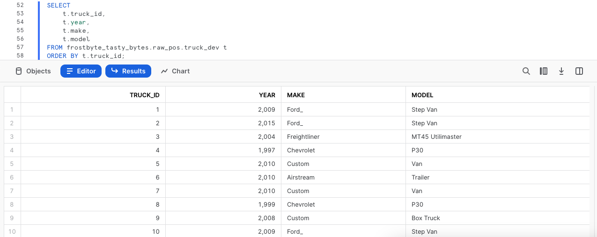
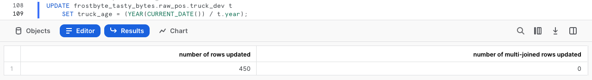
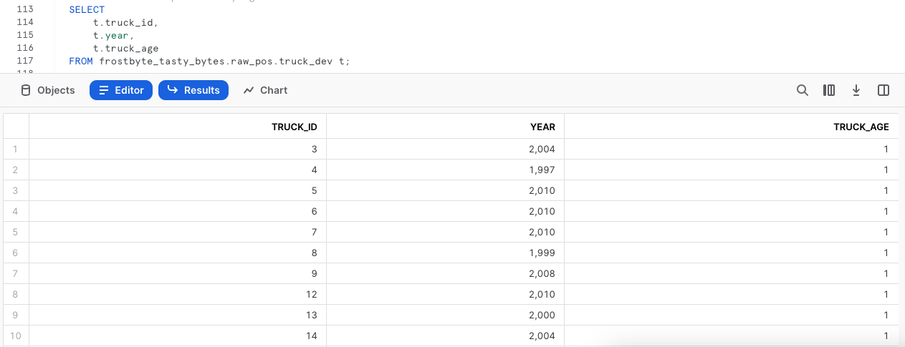
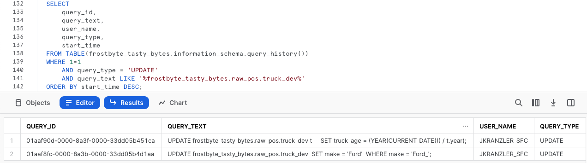
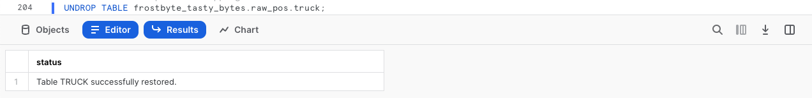
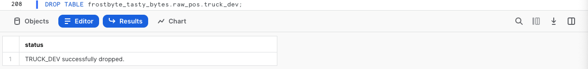

author: Jacob Kranzler
id: tasty_bytes_zero_to_snowflake_transformation_kr
summary: Tasty Bytes - Zero to Snowflake - Transformation Quickstart
categories: Tasty-Bytes, Getting-Started, Featured
environments: web
status: Published 
feedback link: https://github.com/Snowflake-Labs/sfguides/issues
tags: Getting Started, Data Engineering, Data Warehouse, kr

# Tasty Bytes - 제로부터 Snowflake까지 - 변환

<!-- ------------------------ -->
## Snowflake에서 변환

Duration: 1 

### 개요

변환을 집중적으로 다루는 Tasty Bytes 사용 - 제로부터 Snowflake까지 Quickstart에 오신 것을 환영합니다!

이 Quickstart에서는 Tasty Bytes 비즈니스 요구 사항을 충족하기 위해 제로 카피 클론 및 Time Travel과 같은 핵심 기능을 다루는 대규모 Snowflake 기능 세트를 안내하겠습니다.

### 사전 필요 조건 및 지식

- 시작하기 전에 평가판 계정 설정과 이 Quickstart를 완료하기 위해 필요한 Tasty Bytes 기초를 배포하는 것을 안내하는 [**Tasty Bytes 소개 Quickstart**](/guide/tasty_bytes_introduction_kr/index.html)를 완료하십시오.

### 알아볼 내용

- 테이블 복제하기
- Snowflake의 결과 세트 캐시 사용하기
- 테이블에 열 추가하기
- 열에 있는 데이터 업데이트하기
- Time Travel 사용하기
- 테이블 교체, 드롭 및 드롭 취소하기

### 구축할 것

- 중요한 Snowflake 변환 기능에 대한 이해
- 프로덕션 테이블의 개발 테이블 복제
- 계산된 푸드 트럭 나이(1년 단위)가 포함된 테이블의 새로운 열

## 워크시트 생성 및 SQL 복사

Duration: 1

### 개요

이 Quickstart에서는 Snowsight SQL 워크시트를 통해 테마가 Tasty Bytes인 스토리를 따라갈 것입니다. 이 페이지에는 추가 해설, 이미지 및 설명서 링크가 포함되어 있으며 나란히 사용할 수 있는 가이드입니다.

이 섹션은 Snowflake에 로그인하고, 새로운 워크시트를 생성하고, 워크시트의 이름을 바꾸고, SQL을 GitHub에서 복사하고, 이 Quickstart에서 활용할 SQL을 붙여넣는 방법을 안내합니다.

### 1단계 - URL을 통해 Snowflake에 액세스

- 브라우저 창을 열고 Snowflake 계정 URL을 입력합니다.

### 2단계 - Snowflake에 로그인

- Snowflake 계정에 로그인합니다.
  - 


### 3단계 - Worksheets로 이동

- 왼쪽 탐색 메뉴에 있는 Worksheets 탭을 클릭합니다.
  - 


### 4단계 - 워크시트 생성

- Worksheets 내에서 Snowsight 오른쪽 상단 모서리에 있는 ‘+’ 버튼을 클릭하고 ‘SQL Worksheet’를 선택합니다.
  - 


### 5단계 - 워크시트 이름 바꾸기

- 자동으로 생성된 Timestamp 이름을 클릭하고 ‘Tasty Bytes - Transformation’을 입력하여 워크시트의 이름을 바꿉니다.
  - 


### 6단계 - GitHub에서 Quickstart SQL에 액세스

- GitHub에서 호스팅된 Tasty Bytes SQL 파일과 연결된 아래 버튼을 클릭합니다. <button>[tb_zts_transformation](https://github.com/Snowflake-Labs/sf-samples/blob/main/samples/tasty_bytes/tb_zts_transformation.sql)</button>

### 7단계 - GitHub에서 설정 SQL 복사

- GitHub 내에서 오른쪽으로 이동하여 ‘Copy raw contents’를 클릭합니다. 이렇게 하면 모든 필수 SQL이 클립보드로 복사됩니다.
  - 


### 8단계 - 설정 SQL을 GitHub에서 Snowflake 워크시트로 붙여넣기

- Snowsight 및 새롭게 생성한 워크시트로 되돌아가 방금 GitHub에서 복사한 것을 붙여넣습니다(*Mac 바로 가기 키 CMD + V, Windows 바로 가기 키 CTRL + V*).

### 9단계 - 다음 클릭 -->

## 개발을 위해 즉각적으로 프로덕션 테이블 복제

Duration: 1

### 개요

Tasty Bytes 트럭 군단 분석의 일환으로 개발자는 트럭 테이블에 계산된 트럭 나이 열을 추가해야 합니다.

훌륭한 개발자이기에 프로덕션 테이블에 대해 개발할 수 없다는 사실을 알고 있습니다. 따라서 우선 프로덕션을 모방하는 개발 환경을 생성해야 합니다.

### 1단계 - 프로덕션 복제 생성

Snowflake의 고유한 아키텍처 덕분에 [CLONE](https://docs.snowflake.com/ko/sql-reference/sql/create-clone) 기능을 사용하여 `raw_pos.truck` 프로덕션의 스냅샷을 즉각적으로 생성하고 이름을 `raw_pos.truck_dev`로 설정할 수 있습니다.

이제 다음 쿼리 세트를 실행하여 `tasty_dev` 역할 콘텍스트를 설정하고 테이블 복제를 생성하겠습니다. 참고로 웨어하우스 콘텍스트는 복제에 필요하지 않기에 이를 설정하지 않아도 됩니다.

```
USE ROLE tasty_dev;

CREATE OR REPLACE TABLE frostbyte_tasty_bytes.raw_pos.truck_dev 
    CLONE frostbyte_tasty_bytes.raw_pos.truck;
```


> aside positive **제로 카피 클론**: 데이터베이스, 스키마 또는 테이블의 사본을 생성합니다. 소스 객체에 있는 데이터의 스냅샷은 복제가 생성되었고 이것이 복제된 객체에 제공되었을 때 찍습니다. 복제된 객체는 쓰기 가능하며 복제 소스와는 별도입니다. 따라서 소스 객체 또는 복제 객체에 적용된 변경 사항은 다른 객체에 포함되지 않습니다.

### 2단계 - 다음 클릭 -->

## Snowflake의 쿼리 결과 세트 캐시 테스트

Duration: 1

### 개요

즉각적으로 사용 가능한 제로 카피 클론을 통해 이제 프로덕션에 영향이 가는 것을 걱정하지 않고 이에 대한 개발을 시작할 수 있습니다. 하지만 변경 사항을 적용하기 전에 우선 이에 대해 몇몇 단순한 쿼리를 실행하고 Snowflake의 결과 세트 캐시를 테스트하겠습니다.

### 1단계 - 복제된 테이블 쿼리

이제 테이블을 쿼리하려면 `tasty_dev_wh` 웨어하우스를 사용해야 합니다.

트럭, 나이, 제조 및 모델로 구성되어 있는 결과 세트를 생성하는 두 번째 문이 포함된 다음 2개의 쿼리를 실행하고 `truck_id` 열에 대해 [ORDER BY](https://docs.snowflake.com/ko/sql-reference/constructs/order-by) 작업을 수행하겠습니다.

```
USE WAREHOUSE tasty_dev_wh;

SELECT
    t.truck_id,
    t.year,
    t.make,
    t.model
FROM frostbyte_tasty_bytes.raw_pos.truck_dev t
ORDER BY t.truck_id;
```



### 2단계 - 쿼리 재실행

Snowflake의 [결과 세트 캐시](https://docs.snowflake.com/ko/user-guide/querying-persisted-results)를 테스트하려면 다음으로 실행하는 쿼리는 방금 실한 쿼리와 같아야 합니다. 하지만 이제 한 단계 더 나아가 결과 세트 캐시가 결과를 제공함에 따라 이 쿼리가 즉각적으로 결과를 반환한 모습을 보여주는 쿼리 프로필에 액세스하겠습니다.

아래 쿼리를 실행한 후 [쿼리 프로필](https://docs.snowflake.com/ko/user-guide/ui-query-profile)에 액세스하기 위해 스크린샷의 단계를 따릅니다. 쿼리 프로필에서 `QUERY RESULT REUSE`를 알리는 단일 노드를 확인할 수 있습니다.

```
SELECT
    t.truck_id,
    t.year,
    t.make,
    t.model
FROM frostbyte_tasty_bytes.raw_pos.truck_dev t
ORDER BY t.truck_id;
```


> aside positive 사용자가 이미 실행된 쿼리를 반복하고 마지막으로 쿼리를 실행한 시점 이후로 테이블에 있는 데이터가 변경되지 않은 경우, 쿼리 결과는 동일합니다. Snowflake는 쿼리를 다시 실행하는 대신 이전에 반환된 결과와 동일한 결과를 반환합니다.
> 
> 이를 통해 Snowflake가 쿼리를 실행하지 않고 캐시에서 직접 해당 결과를 검색하므로 쿼리 시간을 상당히 단축할 수 있습니다.

### 3단계 - 다음 클릭 -->

## 데이터 업데이트 및 푸드 트럭 나이 계산

Duration: 1

### 개요

위 출력을 기반으로 우선 `make` 열에서 확인한 Ford\_ records에 있는 오타를 해결해야 합니다. 그런 다음 각 트럭의 나이를 제공하는 계산 작업을 시작할 수 있습니다.

### 1단계 - 열에서 잘못된 값 업데이트

이 섹션을 시작하기 위해 제조가 Ford_와 동일한 `truck_dev` [WHERE](https://docs.snowflake.com/ko/sql-reference/constructs/where)에서 행을 바꾸기 위해 [UPDATE](https://docs.snowflake.com/ko/sql-reference/sql/update)를 활용하는 다음 쿼리를 실행하여 오타를 수정하겠습니다.

```
UPDATE frostbyte_tasty_bytes.raw_pos.truck_dev 
SET make = 'Ford' 
WHERE make = 'Ford_';
```


### 2단계 - 나이 계산 구축

오타가 수정되었다면 이제 트럭 군단 내 트럭의 나이를 1년 단위로 계산할 수 있습니다. 이 계산을 돕기 위해 [YEAR](https://docs.snowflake.com/ko/sql-reference/functions/year) 및 [CURRENT_DATE](https://docs.snowflake.com/ko/sql-reference/functions/current_date)를 활용하는 다음 쿼리를 실행하십시오.

```
SELECT
    t.truck_id,
    t.year,
    t.make,
    t.model,
    (YEAR(CURRENT_DATE()) - t.year) AS truck_age_year
FROM frostbyte_tasty_bytes.raw_pos.truck_dev t;
```


### 3단계 - 다음 클릭 -->

## 열 추가 및 업데이트

Duration: 1

### 개요

1년 단위로 트럭 나이 계산을 완료했으면 이제 이를 지원하기 위해 새로운 열을 복제된 테이블에 추가하고 계산된 값이 반영되도록 열을 업데이트하며 마무리하겠습니다.

### 1단계 - 테이블에 열 추가

시작하려면 [ALTER TABLE...](https://docs.snowflake.com/ko/sql-reference/sql/alter-table-column)[ ](https://docs.snowflake.com/ko/sql-reference/sql/alter-table-column)[ADD COLUMN](https://docs.snowflake.com/ko/sql-reference/sql/alter-table-column)을 사용하는 다음 쿼리를 실행하여 비어 있는 [NUMBER 데이터 유형](https://docs.snowflake.com/ko/sql-reference/data-types-numeric)의 `truck_age` 열을 `truck_dev` 테이블에 생성하십시오.

이 쿼리는 `Statement executed successfully` 결과를 제공합니다.

```
ALTER TABLE frostbyte_tasty_bytes.raw_pos.truck_dev
    ADD COLUMN truck_age NUMBER(4);
```

### 2단계 - 계산된 값을 열에 추가

열을 사용하고 있다면 이전 섹션에서 구축한 트럭 나이 계산을 사용하여 새로운 비어 있는 `truck_age` 열에 대해 [UPDATE](https://docs.snowflake.com/ko/sql-reference/sql/update) 작업을 수행하는 다음 쿼리를 실행할 수 있습니다.

```
UPDATE frostbyte_tasty_bytes.raw_pos.truck_dev t
    SET truck_age = (YEAR(CURRENT_DATE()) / t.year);
```



### 3단계 - 새로운 열 쿼리

데이터를 성공적으로 업데이트한 후 이제 `truck_age` 열에서 결과를 확인하기 위해 테이블에 대해 빠른 쿼리를 실행하겠습니다.

```
SELECT
    t.truck_id,
    t.year,
    t.truck_age
FROM frostbyte_tasty_bytes.raw_pos.truck_dev t;
```



**이런!** 프로덕션에서 무턱대고 이러한 작업을 진행하지 않은 똑똑한 개발자라 다행입니다.

`truck_age` 계산에 문제가 있어 빼기 대신 나누기 작업을 수행한 것처럼 보입니다.  다음 섹션에서 이를 해결해야 합니다.

### 4단계 - 다음 클릭 -->

## 데이터 재해 복구를 위해 Time Travel 활용

Duration: 1

### 개요

실수를 하긴 했지만 Snowflake에는 문제를 해결하는 데 도움이 되는 다양한 기능이 있습니다. 진행할 프로세스는 쿼리 내역, SQL 변수 및 Time Travel을 활용하여 `truck_dev` 테이블을 잘못된 업데이트 문 이전 상태로 되돌립니다.

> aside positive Time Travel을 사용하면 정의된 기간 내 모든 시점의 과거 데이터(예: 변경 또는 삭제된 데이터)에 액세스할 수 있습니다.

### 1단계 - 쿼리 내역 활용

복구 프로세스를 시작하려면 Snowflake [QUERY_HISTORY](https://docs.snowflake.com/ko/sql-reference/functions/query_history) 함수를 사용하여 `truck_dev` 테이블에 적용한 모든 업데이트 문 목록을 검색하는 다음 쿼리를 실행합니다.

```
SELECT 
    query_id,
    query_text,
    user_name,
    query_type,
    start_time
FROM TABLE(frostbyte_tasty_bytes.information_schema.query_history())
WHERE 1=1
    AND query_type = 'UPDATE'
    AND query_text LIKE '%frostbyte_tasty_bytes.raw_pos.truck_dev%'
ORDER BY start_time DESC;
```



### 2단계 - SQL 변수 설정

예상했던 것처럼 오타 수정과 잘못된 계산 업데이트 및 관련된 고유한 query_id가 확인됩니다. 다음 단계에서 Time Travel을 통해 변경 사항을 되돌리기 위해 사용할 `query_id` SQL 변수를 생성하는 다음 쿼리를 실행하십시오.

실행 후 `Statement executed successfully` 결과가 전송됩니다.

```
SET query_id = 
(
    SELECT TOP 1 query_id
    FROM TABLE(frostbyte_tasty_bytes.information_schema.query_history())
    WHERE 1=1
        AND query_type = 'UPDATE'
        AND query_text LIKE '%SET truck_age = (YEAR(CURRENT_DATE()) / t.year);'
    ORDER BY start_time DESC
);
```

### 3단계 - 테이블을 되돌리기 위해 Time Travel 활용

변수로 저장된 잘못된 query_id로 Time Travel을 사용하여 잘못된 query_id 문의 [BEFORE](https://docs.snowflake.com/ko/sql-reference/constructs/at-before)와 같은 모습으로 `truck_dev` 테이블로 바꾸는 다음 쿼리를 실행할 수 있습니다.

```
CREATE OR REPLACE TABLE frostbyte_tasty_bytes.raw_pos.truck_dev
    AS 
SELECT * FROM frostbyte_tasty_bytes.raw_pos.truck_dev
BEFORE(STATEMENT => $query_id); 

```


다른 사용 가능한 Time Travel 문 옵션은 아래 목록을 참조하십시오.

> aside positive **AT:** AT 키워드는 지정된 매개변수와 동일한 타임스탬프를 갖는 문 또는 트랜잭션에 의해 수행된 모든 변경 사항을 요청이 포함하도록 지정합니다.
> 
> **BEFORE:** BEFORE 키워드는 요청이 지정된 매개변수 바로 앞의 지점을 참조하도록 지정합니다.
> 
> **TIMESTAMP:** Time Travel에 사용할 정확한 날짜와 시간을 지정합니다.
> 
> **OFFSET:** Time Travel에 사용하기 위한 현재 시간의 초 차이를 지정합니다.
> 
> **STATEMENT:** Time Travel의 기준점으로 사용할 문의 쿼리 ID를 지정합니다.

### 4단계 - 다음 클릭 -->

## 개발에서 프로덕션으로 승격

Duration: 1

### 개요

잘못된 업데이트 문 이전 상태로 되돌린 `truck_dev` 테이블로 이제 열이 올바르게 업데이트되었는지 확인할 수 있습니다. 그런 다음 할당된 작업을 완료하기 위해 올바른 계산이 포함된 테이블을 프로덕션으로 승격시키겠습니다.

### 1단계 - 올바르게 계산된 값을 열에 추가

이전과 동일한 프로세스를 사용하여 다음 쿼리를 실행해 나누기 대신 빼기를 사용하고 있는지 다시 확인하십시오.

```
UPDATE frostbyte_tasty_bytes.raw_pos.truck_dev t
SET truck_age = (YEAR(CURRENT_DATE()) - t.year);
```


### 2단계 - 개발 테이블을 프로덕션으로 교체

`truck_dev`에서 모든 것이 완료되면 우선 더 많은 권한이 있는 `sysadmin` 역할을 맡는 다음 2개의 쿼리를 실행하십시오. `sysadmin`으로서 두 번째 쿼리는 [ALTER TABLE...](https://docs.snowflake.com/ko/sql-reference/sql/alter-table)[ ](https://docs.snowflake.com/ko/sql-reference/sql/alter-table)[SWAP WITH](https://docs.snowflake.com/ko/sql-reference/sql/alter-table)를 활용하여 `truck_dev` 테이블을 `truck`으로 승격시킵니다. 반대 경우에도 마찬가지입니다.

완료되면 `Statement executed successfully.` 결과가 전송됩니다.

```
USE ROLE sysadmin;

ALTER TABLE frostbyte_tasty_bytes.raw_pos.truck_dev 
    SWAP WITH frostbyte_tasty_bytes.raw_pos.truck;
```

### 3단계 - 프로덕션 확인

프로세스가 성공적이었는지 확인하기 위해 이제 프로덕션 `truck` 테이블을 확인하겠습니다. 이렇게 하면 교체가 성공적이었으며 `truck_age` 결과가 유효한지 확인할 수 있습니다.

```
SELECT
    t.truck_id,
    t.year,
    t.truck_age
FROM frostbyte_tasty_bytes.raw_pos.truck t
WHERE t.make = 'Ford';

```


### 4단계 - 다음 클릭 -->

## 테이블 드롭 및 드롭 취소

Duration: 1

### 개요

공식적으로 개발자가 할당된 작업을 완료했다고 말할 수 있습니다. `truck_age` 열을 사용하고 있으며 올바르게 계산되었기에 `sysadmin`은 테이블에 남은 내용을 정리하고 작업을 마무리할 수 있습니다.

### 1단계 - 테이블 드롭

데이터베이스에서 테이블을 제거하려면 [DROP TABLE](https://docs.snowflake.com/ko/sql-reference/sql/drop-table)을 활용하는 다음 쿼리를 실행하십시오.

```
DROP TABLE frostbyte_tasty_bytes.raw_pos.truck;
```


**이런!!** 결과 세트에 따르면 `sysadmin`도 실수를 할 수 있습니다. 개발 `truck_dev`가 아니라 프로덕션 `truck`을 잘못 드롭했습니다. 다행히 Snowflake의 Time Travel이 다시 한번 도움을 줄 수 있습니다.

### 2단계 - 테이블 드롭 취소

시스템이 영향을 받아 `truck` 테이블에 대해 [UNDROP](https://docs.snowflake.com/ko/sql-reference/sql/undrop-table) 작업을 수행하기 전에 서둘러 다음 쿼리를 실행합니다.

```
UNDROP TABLE frostbyte_tasty_bytes.raw_pos.truck;
```



### 3단계 - 올바른 테이블 드롭

좋습니다. 이제 `truck_dev`를 올바르게 드롭하기 위해 최종 쿼리를 실행하여 공식적으로 작업을 끝내겠습니다.

```
DROP TABLE frostbyte_tasty_bytes.raw_pos.truck_dev;
```



### 4단계 - 다음 클릭 -->

## 종료 및 다음 단계

Duration: 1

### 결론

훌륭합니다! Tasty Bytes - 제로부터 Snowflake까지 - 변환 Quickstart를 성공적으로 완료하셨습니다.

이를 완료하면서 진행한 내용은 다음과 같습니다.

- 테이블 복제
- Snowflake의 결과 세트 캐시 사용
- 테이블에 열 추가
- 열에 있는 데이터 업데이트
- 데이터 재해 복구를 위해 Time Travel 활용
- 테이블 교체, 드롭 및 드롭 취소

이 Quickstart를 다시 실행하려면 관련 워크시트 하단에 있는 초기화 스크립트를 활용하십시오.

### 다음 단계

Snowflake 데이터 클라우드에서의 여정을 계속하려면 이제 아래 링크를 방문하여 사용 가능한 모든 Tasty Bytes 활용 - Quickstart를 확인하십시오.

- ### [Tasty Bytes 사용 - Quickstarts 목차](/guide/tasty_bytes_introduction_kr/index.html#3)
