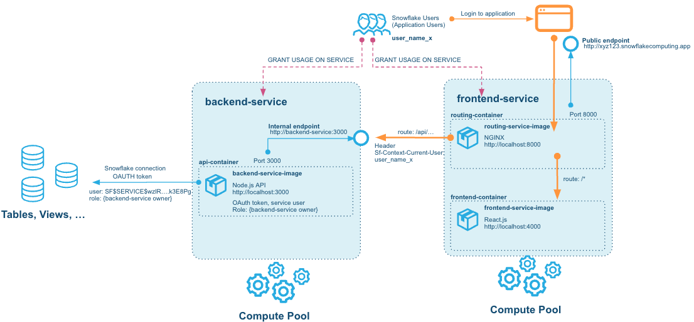
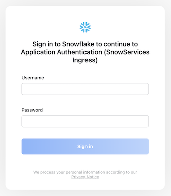
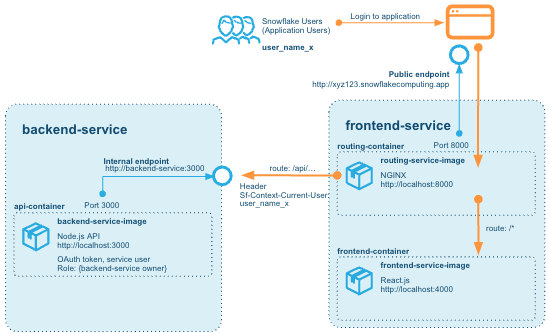
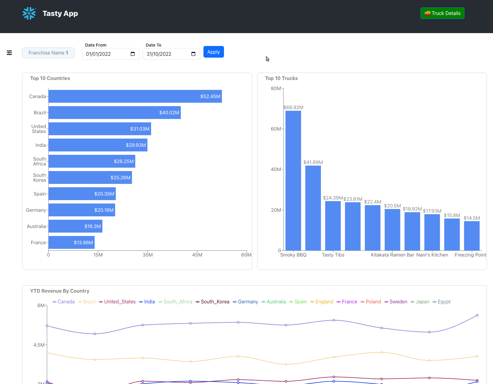

author: Fredrik Göransson, Allan Mitchell
id: build_a_data_app_and_run_it_on_Snowpark_container_services
summary: Build a Data App and run it on Snowpark Container Services
categories: Getting-Started
environments: web
status: Published 
feedback link: https://github.com/Snowflake-Labs/sfguides/issues
tags: Getting Started, Data Applications, API 


# Build a Data App and run it on Snowpark Container Services
<!-- ------------------------ -->
## Overview 
Duration: 1

Snowflake is a terrific platform on which to build data applications. The unique characteristics and cloud-based design allow for building applications that scale with data and workload. This tutorial will go through how to build and deploy both the Processing Layer and the User Interface Layer paired with Snowflake as the Persistence Layer.

Our example will be using a fictional food truck franchise website, Tasty Bytes. We will be building a graphical user interface with charts and graphs for franshisees to be able to examine sales data related to their franchise of food trucks. After logging in via a login page, each franchisee will have one page that will show metrics at the franchise level, and another that will show metrics around the food truck brands for that franchise.

The Processing and User Interface Layers will be built using Node.js. The dataset is a orders history for Tasty Bytes. 

The application itself will be built using containers and deployed to Snowflake.  Snowpark Container Services(SPCS) allows the running of containerized workloads directly within Snowflake, ensuring that data doesn’t need to be moved out of the Snowflake environment for processing. 

This lab builds directly on the same code and solution as the [Build a Data App with Snowflake](https://quickstarts.snowflake.com/guide/build_a_data_app_with_snowflake) quickstart, for in depth walk-through of the use case and the data, and how the application is built using Node Express and React you can review each step in that guide as well. 

### Prerequisites
- A Snowflake account, and familiarity with the Snowsight interface
- Privileges necessary to create a user, database, and warehouse in Snowflake
- Ability to install and run software on your computer
- Basic experience using git
- Intermediate knowledge of Node.js and React JS
- Intermediate knowledge of containerised applications

### What You’ll Learn 
- How to configure and build a custom API Powered by Snowflake, written in Node.js
- How to configure and build a custom frontend website to communicate with the API, written in React and Node.js
- How to deploy a containerised application to Snowpark Container Services
- How to run and test the frontend and API on your machine

### What You’ll Need 
- [VSCode](https://code.visualstudio.com/download) Installed
- [Docker Desktop](https://www.docker.com/products/docker-desktop/) Installed
- [Git](https://git-scm.com/book/en/v2/Getting-Started-Installing-Git) Installed
- [NodeJS](https://nodejs.org/en/download/) Installed
- [NPM](https://docs.npmjs.com/downloading-and-installing-node-js-and-npm) Installed

### What You’ll Build 
- API Powered by Snowflake built in Node.js
- React JS Web Application that connects to that API

> aside positive
> **Installing Using NVM**
> 
>  Node Version Manager provides the ability to have multiple versions of Node installed on your local environment.  This can be helpful so that you can complete this lab without impacting any existing Node setup that you have on your machine. 
> NVM can be found here: [https://github.com/nvm-sh/nvm](https://github.com/nvm-sh/nvm)
> 
> To run this lab you will want to utilize Node 18.16.0 which can be installed using the following command after NVM has been installed: `nvm install 18.16.0`

<!-- ------------------------ -->

## What we will build
Duration: 2

### Overview
Before we start building the solution, let's go through the different parts in the solution that we will build.



The solution consists of two services hosted on Snowpark Container Services:
- The backend service - which hosts the API built on Node Express
- The frontend service - which hosts the React based frontend, and a router service in NGINX that allows calls from the browser-based React frontend to be routed to the backend serivices also.

Without the router part of the frontend service, CORS would actually prevent the browser to talk to the backend service, even if we opened up a public endpoint for it. This is due to the fact that we cannot add our own headers to requests comming to the service endpoints - for security reasons Snowpark Container Services networking strips out any headers (but adds a few usefull ones that we will use for authentication later).

### Step 3 - Setting up the data

This first part of the quickstart will help you set up the data for the application. This is exactly the same as the data used for the quickstart [Build a Data App with Snowflake](https://quickstarts.snowflake.com/guide/build_a_data_app_with_snowflake), so if you have run through it you will be familiar with it.

> aside negative
> The sample data for the quickstart that we load will only cover the dates between 2022-01-01 to 2022-10-31. Don't be alarmed if a query on a data later or earlier than that returns an empty response

### Step 4 - Setup Snowflake and prepare Snowpark Container Services environement

In this step we set up the required primitives in Snwoflake to host and run serivces. Much of these steps are required for any SPCS solution and can be reused throughout other solutions.

Here we create the objects for
- Docker image repositories
- Compute pools that the serivces will be running on
- Users, roles and permissions needed to create and also to run and access the serivces

### Step 5 - Adapting the backend and frontend code

In this step we look at how the code for both the backend service and the frontend service needs to be adapted to take advantage of running in Snowpark Container Services.

Mainly it is the authentication model that benefits from changing. SPCS introduces a new ingress authentication to any public endpoint exposed, and we can use that to authenticate the users login in to the application.

The way that the backend connects to and authenticates itself to the rest of Snowflake when running inside a containerized service also changes. A pre-configured authentication token is supplied to services running on SPCS, and that can be used to connect to the data

### Step 6 - Building and containerizing the application

Once the code is updated we can build the container images and then push them to the Docker image repository we created earlier. Once the images are build and pushed they can be used to spin up the services

### Step 7 - Create the services and deploy the solution

We are now ready to create the serivces and spin them up. We here look at how to specify the service definitions and to to connect the services.

### Step 8 - Clean up

We tear down any resourse created throughout the labs.

<!-- ------------------------ -->

## Set up the Data
Duration: 5

### Overview
In this part of the lab we'll set up our Snowflake account, create database structures to house our data, create a Virtual Warehouse to use for data loading and finally load our Tasty Bytes Food Truck orders data into our ORDERS table and run a few queries to get familiar with the data.


### Step 3.1 Initial Snowflake Setup

For this part of the lab we will want to ensure we run all steps as the ACCOUNTADMIN role 
```sql
--change role to accountadmin
use role accountadmin;
```

First we can create a [Virtual Warehouse](https://docs.snowflake.com/en/user-guide/warehouses-overview) that can be used for data exploration and general querying in this lab.  We'll create this warehouse with a size of `Medium` which is right sized for that use case in this lab.  
```sql
--create a virtual warehouse for data exploration
create or replace warehouse query_wh with 
	warehouse_size = 'medium' 
	warehouse_type = 'standard' 
	auto_suspend = 300 
	auto_resume = true 
	min_cluster_count = 1 
	max_cluster_count = 1 
	scaling_policy = 'standard';
```

### Step 3.2 Load Data

Next we will create a database and schema that will house the tables that store our application data.
```sql
--create the application database and schema
create or replace database frostbyte_tasty_bytes;
create or replace schema app;
```

This DDL will create the structure for the ORDERS table which is the main source of data for our application in this lab. 
```sql
--create table structure for order data 
create or replace table orders (
	order_id number(38,0),
	truck_id number(38,0),
	order_ts timestamp_ntz(9),
	order_detail_id number(38,0),
	line_number number(38,0),
	truck_brand_name varchar(16777216),
	menu_type varchar(16777216),
	primary_city varchar(16777216),
	region varchar(16777216),
	country varchar(16777216),
	franchise_flag number(38,0),
	franchise_id number(38,0),
	franchisee_first_name varchar(16777216),
	franchisee_last_name varchar(16777216),
	location_id number(19,0),
	customer_id number(38,0),
	first_name varchar(16777216),
	last_name varchar(16777216),
	e_mail varchar(16777216),
	phone_number varchar(16777216),
	children_count varchar(16777216),
	gender varchar(16777216),
	marital_status varchar(16777216),
	menu_item_id number(38,0),
	menu_item_name varchar(16777216),
	quantity number(5,0),
	unit_price number(38,4),
	price number(38,4),
	order_amount number(38,4),
	order_tax_amount varchar(16777216),
	order_discount_amount varchar(16777216),
	order_total number(38,4)
);
```

For loading data into the ORDERS table we will create a new Virtual Warehouse sized as a `Large` to help us quickly ingest the data we have stored in an S3 bucket. 
```sql
--create a virtual warehouse for data loading
create or replace warehouse load_wh with 
	warehouse_size = 'large' 
	warehouse_type = 'standard' 
	auto_suspend = 300 
	auto_resume = true 
	min_cluster_count = 1 
	max_cluster_count = 1 
	scaling_policy = 'standard';
```
Next we have to create a [STAGE](https://docs.snowflake.com/en/user-guide/data-load-overview) which is a Snowflake object that points to a cloud storage location Snowflake can access to both ingest and query data.  In this lab the data is stored in a publically accessible AWS S3 bucket which we are referencing when creating the Stage object. 
```sql
--create stage for loading orders data
create or replace stage tasty_bytes_app_stage
	url = 's3://sfquickstarts/frostbyte_tastybytes/app/orders/';
```
Once we've created both the Virtual Warehouse we want to use for loading data and the Stage which points to where the data resides in cloud storage we can simply [COPY](https://docs.snowflake.com/en/sql-reference/sql/copy-into-table) the data from that Stage into our ORDERS table. 
```sql
--copy data into orders table using the load wh
 copy into orders from @tasty_bytes_app_stage;
```


### Step 3.3 Explore Data
Now that we've loaded our data into the ORDERS table we can run a few queries to get familiar with it - but first we will want to change the Virtual Warehouse we're using from the `LOAD_WH` back to the `QUERY_WH` created earlier in the lab. 
```sql
--change our Virtual Warehouse context to use our query_wh
 use warehouse query_wh;
```

To begin with we can simply look at a sample of the entire table.
```sql 
--simple query to look at 10 rows of data 
select * from orders limit 10;
```

Next we can see how many records we've loaded into the table.  Notice how quickly the query executes - this is due to Snowflake's unique architecture which enables a certain class of queries like this one to pull results from metadata instead of requiring compute to generate the result. 
```sql 
--query to count all records in the table
select count(*) from orders;
```

Finally we can run a more complex query to look at the total revenue by month where we will use a couple of [functions](https://docs.snowflake.com/en/sql-reference-functions) to parse the month number and name from the ORDER_TS column in the ORDERS table. 
```sql
--sales by month
select month(order_ts),monthname(order_ts), sum(price)
from orders 
group by month(order_ts), monthname(order_ts)
order by month(order_ts);
```
### Step 2.3 Further explore the Data

To understand and explore the data even more, you can look through the [Quickstart for Building a Data Application - Lab 2: Queries](https://quickstarts.snowflake.com/guide/build_a_data_app_with_snowflake/#2) that offers a number of steps to explore it.

If you already have done that, you can move directly to the next step in this guide. If not, you can continue below and explore the data further.

Our queries will be broken into two groups - `Franchise` queries and `Truck Brand` level queries.  For the sake of ease we will focus on the following Franchise, Truck Brand and Date Range for this part of the lab.

* Franchise:  `1`
* Truck Brand: `Guac 'n Roll`
* Date Range: `1/1/2023 - 3/31/2023`

### Setting Snowsight Context
To ensure the correct context is use for these queries we will set our database, schema and Virtual Warehouse using the following SQL:
```sql
--set query context
use database frostbyte_tasty_bytes;
use schema app;
use warehouse query_wh;
```

### Franchise Queries
To answer the business questions about how our overall Franchise business is doing we'll need create the three following queries.  All of the columns required for these exist in the ORDERS table and no joining of tables are required. 

1. Top 10 Countries Based on Revenue in a Time Window
2. Top 10 Truck Brands Based on Revenue in a Time Window
3. Year-to-Date Revenue, by Month, per Truck Brand

You can spend some time creating the queries for each of these and then check your answers against the provided queries below by expanding each section. 

<strong>Top 10 Countries Based on Revenue in a Time Window</strong>

```sql
    SELECT
        TOP 10 country,
        sum(price) AS revenue
    FROM
        app.orders
    WHERE
        date(order_ts) >= '2023-01-01'
        AND date(order_ts) <= '2023-03-31'
        AND franchise_id = 1
    GROUP BY
        country
    ORDER BY
        sum(price) desc;
```
<strong>Top 10 Truck Brands Based on Revenue in a Time Window</strong>

```sql
    SELECT
        TOP 10 truck_brand_name,
        sum(price) AS revenue
    FROM
        app.orders
    WHERE
        date(order_ts) >= '2023-01-01'
        AND date(order_ts) <= '2023-03-31'
        AND franchise_id = 1
    GROUP BY
        truck_brand_name
    ORDER BY
        sum(price) desc;
```
<strong>Year-to-Date Revenue, by Month, per Truck Brand</strong>

```sql
    SELECT
        country,
        month(order_ts) as date,
        sum(price) AS revenue
    FROM
        app.orders
    WHERE
         year(order_ts) = 2023
        AND franchise_id = 1
    GROUP BY
        country,
        month(order_ts)
    ORDER BY
        sum(price) desc;
```

### Truck Brand Queries
To answer the business questions about how our overall Franchise business is doing we'll need create the three following queries.  All of the columns required for these exist in the ORDERS table and no joining of tables are required. 

1. Total Sales by Day-of-Week
2. Top Selling Items
3. Top Selling items by Day-of-Week
4. 

You can spend some time creating the queries for each of these and then check your answers against the provided queries below by expanding each section. 

<strong>Top 10 Countries Based on Revenue in a Time Window</strong>

```sql
    SELECT
        TOP 10 country,
        sum(price) AS revenue
    FROM
        app.orders
    WHERE
        date(order_ts) >= '2023-01-01'
        AND date(order_ts) <= '2023-03-31'
        AND franchise_id = 1
    GROUP BY
        country
    ORDER BY
        sum(price) desc;
```
<strong>Top 10 Truck Brands Based on Revenue in a Time Window</strong>

```sql
    SELECT
        TOP 10 truck_brand_name,
        sum(price) AS revenue
    FROM
        app.orders
    WHERE
        date(order_ts) >= '2023-01-01'
        AND date(order_ts) <= '2023-03-31'
        AND franchise_id = 1
    GROUP BY
        truck_brand_name
    ORDER BY
        sum(price) desc;
```
<strong>Total Sales by City and Day-of-Week</strong>

```sql
    SELECT
        country,
        month(order_ts) as date,
        sum(price) AS revenue
    FROM
        app.orders
    WHERE
         year(order_ts) = 2023
        AND franchise_id = 1
    GROUP BY
        country,
        month(order_ts)
    ORDER BY
        sum(price) desc;
```

<!-- ------------------------ -->

## Setup Snowflake
Duration: 10

### Overview
Now that we've created our database, loaded data and developed the queries needed to answer our business questions the last step before getting into application code is setting up the necessary objects so that the application can connect to Snowflake securely and query data on its own Virtual Warehouse. We will also set up the objects required to create and run services. The objects we will look at are:

- [Compute Pools](https://docs.snowflake.com/developer-guide/snowpark-container-services/working-with-compute-pool) that are responsible for providing compute to the services once they run.
- [Image Repositories](https://docs.snowflake.com/developer-guide/snowpark-container-services/working-with-registry-repository) that can hold docker images used by the services we create
- [Serivices Ingress Security Integration](https://docs.snowflake.com/en/developer-guide/snowpark-container-services/working-with-services?utm_source=legacy&utm_medium=serp&utm_term=snowservices_ingress#ingress-using-a-service-from-outside-snowflake)

### Step 4.1 Creating roles, permissions and virtual warehouse for running the application

Much like we created separate Virtual Warehouses for exploring and loading data, we will create one specifically for our service to use when executing queries on Snowflake.

We start by creating a role that can be responsible for administering the setup of the services and everyting else. There are a number of permissions that can be granted, and in a production build environment, these permissions may instead be granted to different roles with different responsiblities.

```sql
USE DATABASE frostbyte_tasty_bytes;
USE SCHEMA APP;

CREATE ROLE tasty_app_admin_role;

GRANT ALL ON DATABASE frostbyte_tasty_bytes TO ROLE tasty_app_admin_role;
GRANT ALL ON SCHEMA frostbyte_tasty_bytes.app TO ROLE tasty_app_admin_role;
GRANT SELECT ON ALL TABLES IN SCHEMA frostbyte_tasty_bytes.app TO ROLE tasty_app_admin_role;
GRANT SELECT ON FUTURE TABLES IN SCHEMA frostbyte_tasty_bytes.app TO ROLE tasty_app_admin_role;
```

We can now create a Virtual Warehouse that the application will use to execute queries.
```sql
CREATE OR REPLACE WAREHOUSE tasty_app_warehouse WITH
WAREHOUSE_SIZE='X-SMALL'
AUTO_SUSPEND = 180
AUTO_RESUME = true
INITIALLY_SUSPENDED=false;

GRANT ALL ON WAREHOUSE tasty_app_warehouse TO ROLE tasty_app_admin_role;
```

### Step 4.2 Creating Compute Pools for service to run on

The Compute Pools are used to run the serivices. We can create different pools for different purposes. In this example we create two different pools to run the serivces, one for the backend and one for the frontend. We could technicaly allow both services to use the same Compute Pool, in fact for this demo it would work very well, but in many scenarios the scaling requirements for the frontend and a backend may be different. Here we can see that the backend is given a pool of compute nodes that is slightly more scaled up than the nodes for the compute pool used for the frontend. There are multiple options for choosing the right instance family for a Compute Pool [Create Compute Pool](https://docs.snowflake.com/sql-reference/sql/create-compute-pool). This would be even more relevant if the backend needed to do some more compute heavy work, even to the point where it needed to have GPU enabled nodes.
```sql
CREATE COMPUTE POOL tasty_app_backend_compute_pool
MIN_NODES = 1
MAX_NODES = 1
INSTANCE_FAMILY = CPU_X64_S;

GRANT USAGE ON COMPUTE POOL tasty_app_backend_compute_pool TO ROLE tasty_app_admin_role;
GRANT MONITOR ON COMPUTE POOL tasty_app_backend_compute_pool TO ROLE tasty_app_admin_role;

CREATE COMPUTE POOL tasty_app_frontend_compute_pool
MIN_NODES = 1
MAX_NODES = 1
INSTANCE_FAMILY = CPU_X64_XS;

GRANT USAGE ON COMPUTE POOL tasty_app_frontend_compute_pool TO ROLE tasty_app_admin_role;
GRANT MONITOR ON COMPUTE POOL tasty_app_frontend_compute_pool TO ROLE tasty_app_admin_role;
```

### Step 4.3 Create security integration for public web access

To allow external connections to public endpoints we will create for each service later, we add a `SECURITY INTEGRATION` that is dedicated to authentication of users coming from the public web. [Ingress: Using a service from outside Snowflake](https://docs.snowflake.com/en/developer-guide/snowpark-container-services/working-with-services?utm_source=legacy&utm_medium=serp&utm_term=snowservices_ingress#ingress-using-a-service-from-outside-snowflake)
```sql
-- Create security integration
CREATE SECURITY INTEGRATION "Application Authentication"
  TYPE=oauth
  OAUTH_CLIENT=snowservices_ingress
  ENABLED=true;

GRANT OWNERSHIP ON INTEGRATION "Application Authentication"
TO ROLE tasty_app_admin_role REVOKE CURRENT GRANTS;
```

The `tasty_app_admin_role` role must also be given the permission to bind service endpoints for services.
```sql 
GRANT BIND SERVICE ENDPOINT ON ACCOUNT TO ROLE tasty_app_admin_role;
```

### Step 4.4 Set up docker image repositories and stage for service specifications

We can now ensure that the current user can use the admin role.
```sql 
SET sql = ('GRANT ROLE tasty_app_admin_role TO USER ' || CURRENT_USER() || '');
EXECUTE IMMEDIATE $sql;
USE ROLE tasty_app_admin_role;
```

Here we create the [`IMAGE REPOSITORY`](https://docs.snowflake.com/developer-guide/snowpark-container-services/working-with-registry-repository) to hold images for services.
```sql
-- Create image repository  
CREATE OR REPLACE IMAGE REPOSITORY tasty_app_repository;
-- Show the repo we just created
SHOW IMAGE REPOSITORIES;
-- List images in repo (can be called later to verify that images have been pushed to the repo)
call system$registry_list_images('/frostbyte_tasty_bytes/app/tasty_app_repository');
```

We can also create a stage to hold service specification files, although for this guide we will provide the specifications inline with the service creation. 
```sql
-- Create a stage to hold service specification files
CREATE STAGE tasty_app_stage DIRECTORY = ( ENABLE = true );
```


### Step 4.5 Create external users role and users for the external access

In order to allow the application users to access the application we can create dedicated `USERS` for each user. In the guide [Build a Data App with Snowflake](https://quickstarts.snowflake.com/guide/build_a_data_app_with_snowflake) users were actually stored in a `USERS` table that was created, where hashed passwords were stored and could be used to check the login from the frontend. Create that table by running the following SQL:

```sql
-- Create Users table for the Website
create or replace table users (
	user_id number(38,0) autoincrement,
	user_name varchar(16777216) not null,
	hashed_password varchar(16777216),
	franchise_id number(38,0),
	password_date timestamp_ntz(9),
	status boolean,
	unique (user_name)
);

 -- Add Franchisee logins 
insert into users
    values
    (1,'user1','$2b$10$v0IoU/pokkiM13e.eayf1u3DkgtIBMGO1uRO2O.mlb2K2cLztV5vy',1,current_timestamp,TRUE), 
    (2,'user2','$2b$10$e2TXM/kLlazbH1xl31SeOe6RTyfL3E9mE8sZZsU33AE52rO.u44JC',120,current_timestamp,TRUE),
    (3,'user3','$2b$10$WX4e1LAC.rAabBJV58RuKerEK4T/U4htgXrmedTa5oiGCWIRHwe0e',271,current_timestamp,TRUE);
```


In this guide, we will create those users as actual Snowflake Users and give them a role that is allowed to access the services we later create. This allows us to utilize the OAuth sign-in we created earlier to authenticate users.

We can create the users like this:
```sql
USE ROLE ACCOUNTADMIN;
CREATE ROLE tasty_app_ext_role;

CREATE USER IF NOT EXISTS user1 PASSWORD='password1' MUST_CHANGE_PASSWORD=TRUE DEFAULT_ROLE=tasty_app_ext_role;
GRANT ROLE tasty_app_ext_role TO USER user1;
```

Not that we force the user to change the password on the first login here. When testing it you can choose to set `MUST_CHANGE_PASSWORD=FALSE`, but in a real scenario these passwords should be changed on first login.

Just for reference, the users that were created in the earlier database set up lab are the following:

| User name | Hashed password | Franchise id | Plaintext password |
| ------- | --------- | --------------- | ------------ |
| user1	| $2b$10$3/teX....iH7NI1SjoTjhi74a	| 1	| password1 |
| user2	| $2b$10$9wdGi....U8qeK/nX3c9HV8VW	| 120	| password120 |
| user3	| $2b$10$CNZif....IXZFepwrGtZbGqIO	| 271	| password271 |

We can create all the users this way:
```sql
CREATE USER IF NOT EXISTS user2 PASSWORD='password120' MUST_CHANGE_PASSWORD=TRUE DEFAULT_ROLE=tasty_app_ext_role;
GRANT ROLE tasty_app_ext_role TO USER user2;

CREATE USER IF NOT EXISTS user3 PASSWORD='password270' MUST_CHANGE_PASSWORD=TRUE DEFAULT_ROLE=tasty_app_ext_role;
GRANT ROLE tasty_app_ext_role TO USER user3;
```

<!-- ------------------------ -->

## Adapting the backend code
Duration: 5

### Overview
We now look at the code for the backend and frontend to adapt it to run in Snowpark Container Services.

The code for this lab is hosted on GitHub. Start by cloning the repository into a separate folder. Note that we are cloning a specific branch `spcs` here that contains the code adapted for this guide.
```bash
git clone --branch spcs https://github.com/Snowflake-Labs/sfguide-tasty-bytes-zero-to-app zero-to-app-spcs
```

Change directory to the `zero-to-app-spcs/` directory that is created in the clone above. You should now have a directory with a `/src` subdirectory that contains `/backend` and `/frontend` directories. 

### The backend service
Let's start with looking at the backend code. Open a terminal and go to the `/src/backend` directory.

First ensure that you have Docker installed on you environment:
```bash
docker --version
-- Docker version 24.0.6, build ed223bc
```

For local testing, we can then let the backend connect to the Snowflake account using credentials we supply in the environment variables. Copy the `.env.example` file to `.env` and fill out the details for your account there:
```bash
SNOWFLAKE_ACCOUNT={INSERT_ACCOUNT_NAME_HERE}
SNOWFLAKE_USERNAME={INSERT_USER_NAME_HERE}
SNOWFLAKE_PASSWORD={INSERT_PASSWORD_HERE}
SNOWFLAKE_ROLE=TASTY_APP_ADMIN_ROLE
SNOWFLAKE_WAREHOUSE=TASTY_APP_WAREHOUSE
SNOWFLAKE_DATABASE=frostbyte_tasty_bytes
SNOWFLAKE_SCHEMA=app

ACCESS_TOKEN_SECRET={INSERT A RANDOM STRING HERE}
REFRESH_TOKEN_SECRET={INSERT A RANDOM STRING HERE}

PORT=3000

CLIENT_VALIDATION=Dev 
```

There is a `docker-compose.yaml` file in this folder that we will use to spin up a local service using this environment:
```bash
docker compose up
```

Try to access the API by calling the endpoint now:
```bash
curl http://localhost:3000/franchise/1
```

This should return the following JSON response:
```json
{
   "TRUCK_BRAND_NAMES":[
      "The Mac Shack",
      "Smoky BBQ",
      "Freezing Point",
      "Guac n' Roll",
      "The Mega Melt",
      "Plant Palace",
      "Tasty Tibs",
      "Nani's Kitchen",
      "Better Off Bread",
      "Peking Truck",
      "Kitakata Ramen Bar",
      "Cheeky Greek",
      "Le Coin des Crêpes",
      "Revenge of the Curds",
      "Not the Wurst Hot Dogs"
   ],
   "START_DATE":"2022-01-01 08:00:01.000",
   "END_DATE":"2022-10-31 22:59:29.000"
}
```

### Authenticating and authorizing service users

Currently there is no authentication of the user calling this endpoint. We will change that to take advantage of the mechanism built into Snowflake Container Services.

In the earlier guide [Build a Data App with Snowflake](https://quickstarts.snowflake.com/guide/build_a_data_app_with_snowflake) authentication was implemented using JWT tokens, where the client frontend called a login endpoint and provider user name and password, and the service looked that up in the database (the `USERS` table that is also created for this lab.) and then supplied the client with an accesstoken that could be passed along with future calls to the API. With SPCS this will not work because the environment strips any request headers from calls to the public endpoints as they are routed to the service, meaning we cannot evaluate a Bearer Authentication token in calls from the client to the backend. Remember, with a React application, the frontend is running directly as javascript in the client's browser, even if the code is served from the frontend service, so calls to the API are comming from the end users' browsers, not from the internal service hosting the frontend.

> aside positive
>
> While React.js mainly relies on Client-Side Rendering, other frontend frameworks may rely on Server-Side Rendering, which changes this a little bit. CSR is very lightweight and makes it easy for the frontend service to serve static content to the end users, so for this solution it works well.

What Snowpark Container Services offers is a different authentication model. Any user accessing the public endpoints for the services, needs to log in with a `USER` to the Snowflake interface. 



In this example, one of the users we created in the earlier steps (`user1`, `user2`, `user3`,...) is users. Once the user is authenticated, Snowpark Container Services adds that user name as a special header `Sf-Context-Current-User` to any request to the public endpoints. Since the environment strips away any other headers, there is no risk that the client can tamper with the value of this either, so from the perspective of the backend service, we can trust that the value in that header represents the user that authenticated with Snowflake.

The request headers reaching the service endpoint will look something like this for a normal call:

```bash
host: 'backend-service:3000'
referer: 'https://randomlygeneratedendpointname.snowflakecomputing.app/login'
content-type: 'application/json'
user-agent: 'Mozilla/5.0 (Macintosh; Intel Mac OS X 10_15_7) AppleWebKit/537.36 (KHTML, like Gecko) Chrome/120.0.0.0 Safari/537.36'
accept: '*/*'
'sf-context-current-user': 'USER1'
...
...
```

With this we can then look up that user and ensure that they have access to the application.

Go to the code for `auth.js`, it contains code to validate this header and look up the user in the database, in order to check it's assciation with a franchise. The following code does that:

```js
function lookupUser(user_name) {
    return new Promise(async function (result, error) {
        snowflake.getConnection().then(conn =>
            conn.execute({
                sqlText: sql_queries.verify_user,
                binds: [user_name],
                complete: (err, stmt, rows) => {
                    if (err) {
                        error({result: false, message: 'Unable to lookup user', error:err});
                    } else {
                        if (rows.length == 0) {
                            result({message: 'User does not exist'});
                        } else {
                            user_row = rows[0]
                            user_name = user_row.USER_NAME;
                            franchise_id = user_row.FRANCHISE_ID;
                            hashed_password = user_row.HASHED_PASSWORD;
                            data = {result: true, validation: 'Snowflake', user_name: user_name, franchise_id: franchise_id, hashed_password: hashed_password };
                            result(data);
                        }
                    }
                },
            }));
    });
}

...

function validateSnowflakeHeader(req, res, next) {

    if (!req.headers['sf-context-current-user']) {
        console.warn('Validation mode is Snowflake but sf-context-current-user header is missing - user is not validated');
        res.status(422).send("Incorrect data");
        return
    }

    const login_user = req.headers['sf-context-current-user']
    console.log('sf-context-current-user: ' + login_user);
    lookupUser(login_user).then(result => {
        if (result.result === true){
            console.log('Authorizing user ' + result.user_name + ' for franchise: ' + result.franchise_id);
            req.user = { validation: 'Snowflake', user: result.user_name, franchise: result.franchise_id };
            next();
        } else {
            console.warn('User does not exist: ' + login_user);
            res.status(401).json('Invalid user or password');
            return
        }
    }, error => {
        console.error(error.message, error.error);
        res.status(500).json({ error: error.message });
        return
    });
};
```

Comparing this to the code that validates a JWT access token it is similar, but we here also have to look up the user in a database call, because unlike the JWT we cannot securely pass any additional information (like the `franchise_id` in the toke), the only value we can trust here is the user header, since it is securely set by the SPCS environment and cannot be tampered with by a javascript client. The rest of the code in that file is supporting the authentication using other methods, but this is the only one that will be used in this guide and when we deploy the services to Snowflake.

Also review the file `/routes/login.js` that introduces a new endpoint `/authorize` that responds with an accesstoken containing the `user id` and `franchise id` when called with a header of `Sf-Context-Current-User`. This can be used by the frontend later on to check what franchise to set in the UI. Note that this endpoint also returns a JWT token, but we are only using that format to keep the code in the frontend as similar to the original code as possible, we are not using the JWT access token for future authorization of calls from the frontend to the backend.

This endpoint is similar to the code in `auth.js` for validating a user.
```js
router.get("/authorize", async (req, res) => {

    console.log('Authorize with request headers:')
    if (!req.headers['sf-context-current-user']) {
        res.status(422).send("Incorrect data");
        return
    }

    const login_user = req.headers['sf-context-current-user']
    console.log(`Authorizing user ${login_user} from context header`);
    auth.lookupUser(login_user).then(result => {
        if (result.result === true) {            
            console.log('Authorizing user ' + result.user_name + ' for franchise: ' + result.franchise_id);
            const accessToken = auth.generateAccessToken({ user: result.user_name, franchise: result.franchise_id, preauthorized: true });
            const refreshToken = auth.generateRefreshToken({ user: result.user_name, franchise: result.franchise_id, preauthorized: true });
            res.status(200).json({ accessToken: accessToken, refreshToken: refreshToken });
            return
        } else {
            console.warn('User does not exist: ' + login_user);
            res.status(401).json('Invalid user or password');
            return
        }
    }, error => {
        console.error(error.message, error.error);
        res.status(500).json({ error: error.message });
        return
    });
});
```

With this we test run the application locally and simulate the SPCS environment. Change the `.env` file to use Snowflake authentication instead:

```bash
CLIENT_VALIDATION=Snowflake
```

Restart the service running by pressing `CTRL+c` in the terminal where you started the docker service. Restart it again with `docker compose up` again. Once running you should now see the output:

```bash
backend-backend_service-1  | Starting up Node Express, build version 00013
backend-backend_service-1  | Server running on port 3000
backend-backend_service-1  | Environment: development
backend-backend_service-1  | CORS origin allowed: http://localhost:4000
backend-backend_service-1  | Client validation: Snowflake
backend-backend_service-1  | Using warehouse: TASTY_APP_WAREHOUSE
backend-backend_service-1  | Using role: TASTY_APP_ADMIN_ROLE
```

Calling one of the endpoints now results in a `HTTP 422` response and no data. If we provide a header that looks like the SPCS authentication header it now uses that to validate the user:

```bash
curl --header "Sf-Context-Current-User:user1"  http://localhost:3000/franchise/1
```

This now responds with a the expected `HTTP 200` response:
```json
{
   "TRUCK_BRAND_NAMES":["The Mac Shack","Smoky BBQ","Freezing Point","Guac n' Roll","The Mega Melt","Plant Palace","Tasty Tibs","Nani's Kitchen","Better Off Bread","Peking Truck","Kitakata Ramen Bar","Cheeky Greek","Le Coin des Crêpes","Revenge of the Curds","Not the Wurst Hot Dogs"
   ],
   "START_DATE":"2022-01-01 08:00:01.000",
   "END_DATE":"2022-10-31 22:59:29.000"
}
```

You can now terminate the service with `CTRL+c` and we can then destroy the local Docker service and images we just used for testing:

```bash
docker rm backend-backend_service-1
docker image rm backend-backend_service
```

### Connecting to Snowflake data

With this update, we can now look at how the backend service can access the data in the Snowflake tables and views. In the self hosted version of of the code (as in the [Build a Data App with Snowflake](https://quickstarts.snowflake.com/guide/build_a_data_app_with_snowflake)) we use a key pair authentication schema to connect the service to Snowflake. For a service running on Snowpark Container Services, we can benefit from the service already running on Snowflake and we can use a provided and pre-loaded authentication model based on OAuth. This is available for every service running on SPCS.

Open the file `connect.js` and look at how the code is sending the options for the connection to Snowflake:

```js
    const options = {
        database: process.env.SNOWFLAKE_DATABASE,
        schema: process.env.SNOWFLAKE_SCHEMA,
        warehouse: process.env.SNOWFLAKE_WAREHOUSE,
    };

    if (fs.existsSync('/snowflake/session/token')) {
        options.token = fs.readFileSync('/snowflake/session/token', 'ascii');
        options.authenticator = "OAUTH";
        options.account = process.env.SNOWFLAKE_ACCOUNT;
        options.accessUrl = 'https://' + process.env.SNOWFLAKE_HOST;
    } else {
        options.account = process.env.SNOWFLAKE_ACCOUNT;
        options.username = process.env.SNOWFLAKE_USERNAME;
        options.role = process.env.SNOWFLAKE_ROLE;
        options.password = process.env.SNOWFLAKE_PASSWORD;
    };
```

When the service is running on SPCS, the file located at `/snowflake/session/token` will contain an OAuth token that is pre-validated for accessing Snowflake. This means we don't need to supply user and password for the connection. This token is authenticated for a temporary user that is given the same role as the `OWNER` for the Service being called. This is an important detail, as the service will be connecting as the very role that created it (here it will be `tasty_app_admin_role`), so think of it as a service account type of user that is connecting. This is analoguous to how the original solutuion worked, but in there we created a dedicated user that the service connected as.

Once connected, the rest of the backend code is working the same, regardless if it is running in the SPCS environment or somewhere else, like a local testing enviroinment.


<!-- ------------------------ -->

## Adapting the frontend code
Duration: 3

### Overview
The frontend now also needs to be updated to take advantage of the changes and for us to be able to run it on SPCS.

There are two areas that needs to be updated here to run in the new environment:

- Authentication - by placing the service behind a public endpoint that forces users to login, it no longer makes sense to keep the login form in the client, the required authentication is already captured by the Snowflake OAuth login form
- Routing from client to the backend API, we can no longer directly control the CORS directives for the services, and calls from the client are actually made directly from the users' browsers.

The routing is something that changes somewhat significantly from the original solution. Instead of adding a CORS directive to the backend (e.g. allowing calls from another origin), we introduce a router service that takes calls from the public enpoint and _routes_ them to either the frontend service, or the backend service, allowing us to maintain a single public endpoint.

> aside negative
>
> The frontend service and backend service are here hosted as two separate services, with a router bundled together with the frontend. For this simple application that may not be a necessary requirement to fulfill, but in a more complex and demanding application, it would be a good approach to separate the frontend and backend as they would have different non-functional requirements.

The router ensures that calls made to routes starting with `/api` are forwarded to the `backend-service`, whereas any other calls `/*` are routed to the frontend container running in the same service as the router:


### Step 6.1 Building the router

The router is a simple service based on [*NGINX*](https://www.nginx.com/). The code is very simple and serves a NGINX server that is given a configuration that defines the different routes, open `/src/frontend/router/nginx.conf.template`:

```yaml
events {
  worker_connections  1024;
}
http {
  server {
    listen 8000;
    listen [::]:8000;
    server_name localhost;

    location / {
      proxy_pass  http://$FRONTEND_SERVICE/;
    }

    location /api {
        rewrite     /api/(.*) /$1  break;
        proxy_pass  http://$BACKEND_SERVICE/;
    }

    location /test {
        add_header Content-Type text/html;

        return 200 '<html><body><h1>This is the router testpage</h1><li>Sf-Context-Current-User: $http_sf_context_current_user</li><li>Host: $http_host</li><li>Frontend Server: $FRONTEND_SERVICE</li><li>Backend Server: $BACKEND_SERVICE</li></body></html>';
    }
  } 
}
```

There are three routes in here, `/`, `/api` `/test`. The last one simply outputs debug information and can help to understand that the setup is correct (it should be removed when not testing out the services).

The `/api` route means that anything prefixed with that get rewritten to remove the "`/api`" part and then passed forwrad to the backend service URL. For all other calls they should be forwarded directly to the frontend service URL (which should be running on the same service as the router, in a different container).

The `$FRONTEND_SERVICE` and `$BACKEND_SERVICE` variables allows us to dynamically replace these values when the Docker image is being used. If we look at the Dockerfile:

```bash
FROM nginx:alpine

ARG required FRONTEND_SERVICE
ARG required BACKEND_SERVICE

RUN apk update && apk add bash

EXPOSE 8000

COPY nginx.conf.template /nginx.conf.template

CMD ["/bin/sh" , "-c" , "envsubst '$FRONTEND_SERVICE $BACKEND_SERVICE' < /nginx.conf.template > /etc/nginx/nginx.conf && exec nginx -g 'daemon off;'"]
```

The last line substitutes these variables for values taken from the `environment` it is running in, before copying the contents into the `nginx.conf` file and starting up the server.

### Step 6.2 Updating the frontend code

The frontend code itself needs fewer changes to adapt to the new environment. Primarily here we are looking at removing the actual login form and user management in favor of using the built in login capability.



> aside negative
>
> The original React code is actually built on older in package dependencies. In order to keep this guide as similar to the original guide no changes to the React framework have been introduced, only minor changes are done as part of this guide. There are many ways to update the general React code to later standards, but this guide will focus on the core parts of connecting the services,

In a commonly shared file `Utils.js` we can provide some methods that will help check how to communicate with the backend and to verify if the login button should be visible. 

```js
export function enableLogin() {
    if (clientValidation === 'JWT') {
        return true;
    } else if (clientValidation === 'Snowflake') {
        return false;
    }
    console.log(` - Login disabled`);
    return false;
}

export function isLoggedIn(state) {
    if (clientValidation === 'JWT') {
        if (state){
            return (state.accessToken != null);
        }
    } else if (clientValidation === 'Snowflake') {
        if (state){
            return (state.accessToken != null);
        }
    } else if (clientValidation === 'Dev') {
        if (state){
            return (state.franchise != null);
        }
    }
    return false;
}
```

We can then use these functions to decide if the Login button should be visible or not:

E.g. in `Home.js`, the logout button is conditionally shown using the above function:
```html
            <div className='home-header'>
                <Image src='bug-sno-R-blue.png' className='homeLogo' />
                <h1 className="homeTitle"> Tasty App</h1>

                <Button className='backBtn' onClick={gotoDetails}>  🚚 Truck Details</Button>
                { enableLogin() &&
                    <Button className='home-logoutBtn' onClick={logout}>⎋ Logout</Button>
                }
            </div>
```

And in the `App.js` routing we can use the same functions to conditionally route the user depending on if they are logged in or not.

```js
function App() {

  const LoginWrapper = () => {
    const location = useLocation();
    return isLoggedIn(location.state) ? <Outlet /> : <Navigate to="/login" replace />;
  };

  return (
    // Routing for the App.
    <BrowserRouter>
      <Routes>
        <Route path="/login" element={ <Login />  } />
        <Route element={<LoginWrapper />}>
          <Route path="/" element={ <Home /> } />
          <Route path="/home" element={ <Home /> } />
          <Route path="/details" element={ <Details /> } />
        </Route>
      </Routes>
    </BrowserRouter>
  );
}
```

Finally we add a call in `Login.js` to check the `/authenticate` endpoint of the backend.

```js
const clientValidation = process.env.REACT_APP_CLIENT_VALIDATION;

...

    function checkAuthentication() {
        if (clientValidation === 'JWT') {
            //console.log(` - Validation enabled`);
        } else if (clientValidation === 'Snowflake') {
            console.log(`Checking client validation ${clientValidation} - Checking authorize endpoint of API`);
            const requestOptions = {
                method: 'GET',
                headers: { 'Content-Type': 'application/json', 'Sf-Context-Current-User': 'user1' }
            };
            fetch(backendURL + '/authorize', requestOptions)
                .then((result) => {
                    if (result.ok) {
                        result.json()
                            .then((data) => {
                                const token = decodeToken(data.accessToken);
                                data.franchise = token.franchise;
                                navigate("/", { state: data });
                            });
                    } else {
                        console.warn('Current user is not authorized to use the application');
                    }

                });
        } else {
            console.warn(`Checking client validation ${clientValidation} - Validation disabled - hard coding franchise "1"`);
            const data = { franchise: 1 };
            navigate("/", { state: data });
        }
        return false;

    };
```

When the `/login` page shows, this call is run and if the result it that a user context is returned then it navigates to the default route `/`. This all ensures that the same code runs both in the SPCS environment and in another hosting environment. By setting the `ENVIRONMENT` variable `REACT_APP_CLIENT_VALIDATION` to `Snowflake` when deploying this we ensure the method is called and evaluated.

Remember, the `/authorize` endpoint of the backend service should return a JWT access token containing the user name and franchise when called from an authenticated context in SPCS, like the following result:
```json
{
    "accessToken": "eyJhbGc....goa_RUCl85NeM",
    "refreshToken": "eyJhbGc.....VR5fnViRksNI"
}
```

And when decoded, that token should look something like this:
```json
{
  "user": "user1",
  "franchise": 1,
  "preauthorized": true,
  "iat": 1705924945,
  "exp": 1705946545
}
```

Throughout the `Home.js` and `Details.js` we then update all call to the backend to use the common helper function from `Utils.js` to call the backend, like this:
```js
const url = `${backendURL}/franchise/${franchise}/trucks?start=${fromDate}&end=${toDate}`;
fetch(url, getRequestOptions(location.state))
    .then((result) => result.json())
        .then((data) => {
            setTop10Trucks(data)
            let t = [];

            for (let i=0; i<data.length; i++) {
                t.push(data[i].TRUCK_BRAND_NAME);
            }
            setTrucks(t);
    })
```

With those changes, the code should be ready to be Dockerized and then deployed in Snowpark Container Services.

<!-- ------------------------ -->

## Containerize the Application
Duration: 5

No we can prepare the services for deployment, and we will do that by building Docker container images for each service to deploy.

Ensure that you have Docker installed on you environment:

```bash
docker --version
-- Docker version 24.0.6, build ed223bc
```

### 7.1 Defining Dockerfiles for services

Each service that we will spin up consists of one or more containers, and each container is build on a Docker image. 

Let's start with the Dockerfile for the backend service. In the `/backend/Dockerfile` we are exposing the port this service is exposed on. By putting it in as a variable `${PORT}` we can set it through the service definition.
```bash
FROM node:18

ARG PORT

WORKDIR /src/app
COPY package.json /src/app/package.json

RUN npm install

ENV PORT=${PORT}
EXPOSE ${PORT}

COPY . /src/app

CMD ["npm", "run", "serve"]
```

Ensure that there is a `.env` file there that will be picked up by the Docker build. It should look like this:
```bash
SNOWFLAKE_WAREHOUSE=TASTY_APP_WAREHOUSE
SNOWFLAKE_DATABASE=FROSTBUTE_TASTY_BYTES
SNOWFLAKE_SCHEMA=APP

ACCESS_TOKEN_SECRET={INSERT A RANDOM STRING HERE}
REFRESH_TOKEN_SECRET={INSERT A RANDOM STRING HERE}

PORT=3000

CLIENT_VALIDATION=Snowflake 
```

The frontend service will contain two containers, so we will have two Dockerfiles, one for each image we are building.

The frontend itself is here `/frontend/frontend/Dockerfile`:
```bash
FROM node:latest

ARG FRONTEND_SERVICE_PORT
ARG REACT_APP_BACKEND_SERVICE_URL

WORKDIR /src/
COPY package.json /src/package.json

RUN npm install

ENV REACT_APP_BACKEND_SERVICE_URL=${REACT_APP_BACKEND_SERVICE_URL}

ENV PORT=${FRONTEND_SERVICE_PORT}
EXPOSE ${FRONTEND_SERVICE_PORT}

COPY ./src /src/src
COPY ./public /src/public

CMD ["npm", "start"]
```
Here we also allow the service to expose a port that is set through an environment variable `${FRONTEND_SERVICE_PORT}`. Additionally we inject the actual URL to the backend, i.e. what is the URL that the frontend is calling when connecting to the backend service, is also a variable `${REACT_APP_BACKEND_SERVICE_URL}`.

The router that accompanies the frontend is built from a simple Dockerfile, `/frontend/router/Dockerfile`:
```bash
FROM nginx:alpine

ARG required FRONTEND_SERVICE
ARG required BACKEND_SERVICE

RUN apk update && apk add bash

EXPOSE 8000

COPY nginx.conf.template /nginx.conf.template

CMD ["/bin/sh" , "-c" , "envsubst '$FRONTEND_SERVICE $BACKEND_SERVICE' < /nginx.conf.template > /etc/nginx/nginx.conf && exec nginx -g 'daemon off;'"]
```
The last line is where the `$FRONTEND_SERVICE` and `$BACKEND_SERVICE` variables are replaced into the configuration for the NGINX server.

### 7.2 Login to the repo

We need to connect our local Docker to the remote [Image repository](https://docs.snowflake.com/developer-guide/snowpark-container-services/working-with-registry-repository) that we created in Step 4. Start by grabbing the url for the repository by running the following SQL:

```sql
USE DATABASE FROSTBYTE_TASTY_BYTES;
USE SCHEMA APP;
USE ROLE tasty_app_admin_role;

SHOW IMAGE REPOSITORIES;
```
Now copy the value from the `repository_url` for the row for `TASTY_APP_REPOSITORY` (there should only be one row). The URL should look something like this:
```bash
<ACCOUNT_NAME>.registry.snowflakecomputing.com/frostbyte_tasty_bytes/app/tasty_app_repository
```

Open up a terminal now and enter:
```bash
export repo_url=<insert repo url here>
```

The user then you will use to login to this Docker image repository should be a user that is granted the role `tasty_app_admin_role`:
```bash
# Snowflake user name
export admin_user= <your user name>
# login to the repo.  You'll need thisfor the push later.
docker login ${repo_url} --username ${admin_user}
```
Type in the password for that user when prompted.
```bash
Password: 
Login Succeeded
```

With this, you can now push Docker images to this repository.

### 6.2 Build and push up the image

When building and pushing an image to the repo, we do a number of steps to ensure we build the image locally, tag it and then push it to the remote repository. Here is how the backend service is build in the `./build-all.sh` file:

```bash
export image_name=backend_service_image
docker image rm ${image_name}:${tag}
docker build --rm --platform linux/amd64 -t ${image_name}:${tag} ./backend
docker image rm ${repo_url}/${image_name}:${tag}
docker tag ${image_name}:${tag} ${repo_url}/${image_name}:${tag}
docker push ${repo_url}/${image_name}:${tag}
echo ${repo_url}/${image_name}:${tag}
```

Note here that we are specifying to build the image directly for the `linux/amd64` architecture, this is needed for running it on the nodes in the compute pool for Snowpark Container Services. This may not be an image that can then be run on your local system, depending on the CPU architecture on that. It is important that we build it using this flag, otherwise it will not run on SPCS.

We can now build and push all images to the Snowflake repository, from `/src` run:
```bash
./build-all.sh 
```

Once that finishes, you can verify in a Snowflake worksheet that the images have been pushed to the repository:
```sql
call system$registry_list_images('/frostbyte_tasty_bytes/app/tasty_app_repository');
```

The output should be similar to this:
```json
{
   "images":[
      "backend_service_image",
      "frontend_service_image",
      "router_service_image"
   ]
}
```

<!-- ------------------------ -->

## Create the Services
Duration: 5

The services can now be created in Snowflake. Go back to Snowflake and open a worksheet. Enter the following to create the backend service. The `CREATE SERVICE` command creates a new service.

```sql
USE DATABASE FROSTBYTE_TASTY_BYTES;
USE SCHEMA APP;
USE ROLE tasty_app_admin_role;

CREATE SERVICE backend_service
  IN COMPUTE POOL tasty_app_backend_compute_pool
  FROM SPECIFICATION $$
spec:
  container:
  - name: backend
    image: /frostbyte_tasty_bytes/app/tasty_app_repository/backend_service_image:tutorial
    env:
      PORT: 3000
      ACCESS_TOKEN_SECRET: {INSERT A RANDOM STRING HERE}
      REFRESH_TOKEN_SECRET: {INSERT ANOTHER RANDOM STRING HERE}
      CLIENT_VALIDATION: Snowflake
  endpoint:
  - name: apiendpoint
    port: 3000
    public: true
$$
  MIN_INSTANCES=1
  MAX_INSTANCES=1
;
GRANT USAGE ON SERVICE backend_service TO ROLE tasty_app_ext_role;
```
This creates the backend service using the image `backend_service_image:tutorial` that we should now have pushed to the repository. Note how we can suppy overriding environment variables to the services.

We also set this service to use the `tasty_app_backend_compute_pool` as the [COMPUTE POOL](https://docs.snowflake.com/en/developer-guide/snowpark-container-services/working-with-compute-pool) to run the service on. At the end we can set the scaling behavior of this service in the pool. In order to test this service we don't need any additional scaling setup here, but in a real scenario we may want to increase the number of instances available in case the load on the service goes up.

Lastly we call `GRANT USAGE ON SERVICE` to allow the `tasty_app_ext_role` role and users with that role granted to access the service.

We can then call `SHOW SERVICES` to look at the services created. In order to check the status of the newly created service we can call:
```sql
SELECT SYSTEM$GET_SERVICE_STATUS('backend_service'); 
```
Which will return the status of the service. After a few moments the service should report status `READY` and that it is running:

```json
[
   {
      "status":"READY",
      "message":"Running",
      "containerName":"backend",
      "instanceId":"0",
      "serviceName":"BACKEND_SERVICE",
      "image":"<ACCOUNT_NAME>.registry.snowflakecomputing.com/frostbyte_tasty_bytes/app/tasty_app_repository/backend_service_image:tutorial",
      "restartCount":0,
      "startTime":"<CREATE TIME>"
   }
]
```

We can also look directly at the [logs from the service itself](https://docs.snowflake.com/en/developer-guide/snowpark-container-services/working-with-services#accessing-local-container-logs), anything that is written to the standard logging can be retrieved from the service logs:
```sql
CALL SYSTEM$GET_SERVICE_LOGS('backend_service', '0', 'backend', 50);
```

Should show a log looking like this:
```bash
> serve
> node app.js

Starting up Node Express, build version 00014
Server running on port 3000
Environment: development
Client validation: Snowflake
Using warehouse: tasty_app_warehouse
Using role: TASTY_APP_ADMIN_ROLE
```

The frontend service can now be created in a similar fashion. The difference here is that it will contain two different containers, we are using both the image for the router and the frontend React app inside the same service.

```sql
CREATE SERVICE frontend_service
  IN COMPUTE POOL tasty_app_frontend_compute_pool
  FROM SPECIFICATION $$
spec:
  container:
  - name: frontend
    image: /frostbyte_tasty_bytes/app/tasty_app_repository/frontend_service_image:tutorial
    env:    
      PORT: 4000
      FRONTEND_SERVICE_PORT: 4000
      REACT_APP_BACKEND_SERVICE_URL: /api
      REACT_APP_CLIENT_VALIDATION: Snowflake
  - name: router
    image: /frostbyte_tasty_bytes/app/tasty_app_repository/router_service_image:tutorial
    env:
      FRONTEND_SERVICE: localhost:4000
      BACKEND_SERVICE: backend-service:3000
  endpoint:
  - name: routerendpoint
    port: 8000
    public: true
$$
  MIN_INSTANCES=1
  MAX_INSTANCES=1
;
GRANT USAGE ON SERVICE frontend_service TO ROLE tasty_app_ext_role;
```

In the same way we can here check the status of the service and read the logs. Note that there are two logs to read, one for each container in the service.
```sql
SELECT SYSTEM$GET_SERVICE_STATUS('frontend_service'); 
CALL SYSTEM$GET_SERVICE_LOGS('frontend_service', '0', 'frontend', 50);
CALL SYSTEM$GET_SERVICE_LOGS('frontend_service', '0', 'router', 50);
```

The log for the `frontend` container in the `frontend_service` should look something like this:
```bash
> tasty_app@0.1.0 start
> react-scripts start
  
Compiled successfully!

You can now view tasty_app in the browser.

  Local:            http://localhost:4000
  On Your Network:  http://10.244.2.15:4000
```

We are now finally ready to test the application in a browser. In order to do that we need the public endpoint exposed by the frontend_service. Call `SHOW ENDPOINTS` to retrieve that:

```sql
SHOW ENDPOINTS IN SERVICE frontend_service;
```

The `ingress_url` in the response is the public endpoint URL, it should look simlar to this, the first part is randomly generated for each enpoint and service:

```bash
<RANDOM>-<ACCOUNT NAME>.snowflakecomputing.app
```

Now open up that URL in a browser. You will be prompted for a login, and here we can choose any on the users created earlier. You can use `user1` with password `password1`. Note that you will be forced to change this on first login.


Once logged in, the application loads the authorization status, and then redirects the user to the loged in `Home` page. After a few moments the data is loaded also and the charts for the current franchsise (Franchise 1, if you logged in with user1) is shown. 


<!-- ------------------------ -->

## Clean up resources
Duration: 1

Once we have tested the application we can tear down any resources that we have created. The following resouces should be removed:

- Services
- Compute Pools
- Warehouses
- Image Repositories
- Database and Schema
- Secuity Integration (NOTE: this may be used by other services, you can only have one active per ACCOUNT)
- Roles
- Users
- Local Docker images

Open a worksheet in Snowflake and run the following SQL:

```sql
USE DATABASE FROSTBYTE_TASTY_BYTES;
USE SCHEMA APP;
USE ROLE tasty_app_admin_role;

-- Delete services
SHOW SERVICE;
DROP SERVICE BACKEND_SERVICE;
DROP SERVICE FRONTEND_SERVICE;

-- Delete compute pools
SHOW COMPUTE POOLS;
USE ROLE ACCOUNTADMIN;
DROP COMPUTE POOL TASTY_APP_BACKEND_COMPUTE_POOL;
DROP COMPUTE POOL TASTY_APP_FRONTEND_COMPUTE_POOL;

-- Delete warehouses
SHOW WAREHOUSES;
DROP WAREHOUSE LOAD_WH;
DROP WAREHOUSE QUERY_WH;
DROP WAREHOUSE TASTY_APP_WAREHOUSE;

-- Delete the Image repository
USE ROLE tasty_app_admin_role;
SHOW IMAGE REPOSITORIES;
DROP IMAGE REPOSITORY TASTY_APP_REPOSITORY;

-- Delete the database
USE ROLE ACCOUNTADMIN;
SHOW DATABASES;
DROP DATABASE FROSTBYTE_TASTY_BYTES;

-- Delete the OAuth security integration
USE ROLE tasty_app_admin_role;
SHOW SECURITY INTEGRATIONS;
DROP SECURITY INTEGRATION "Application Authentication";

-- Delete the roles
USE ROLE ACCOUNTADMIN;
SHOW ROLES;
DROP ROLE TASTY_APP_ADMIN_ROLE;
DROP ROLE TASTY_APP_EXT_ROLE;

-- Delete the users
SHOW USERS;
DROP USER USER1;
DROP USER USER2;
DROP USER USER3;
```

From a terminal, we can now also remove the built images:
```bash
docker image prune --all
```

> aside negative
>
> Warning, the above removes _all_ unused Docker images. If you have other Docker images that you don't want to remove, then manually remove the images created in this guide using `docker image rm <IMAGE NAME>`.

Good work! You have now successfully built, depoloyed and run a data application on Snowpark Container Services.
<!-- ------------------------ -->
