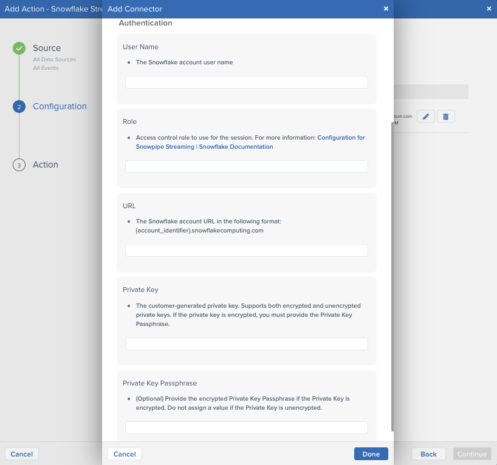
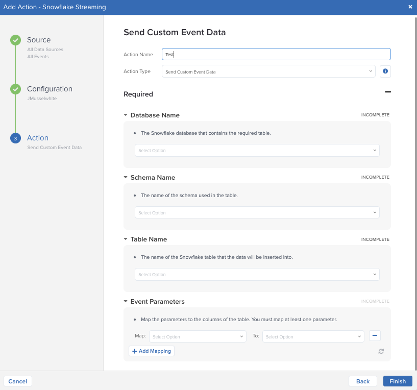
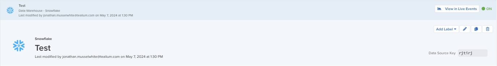
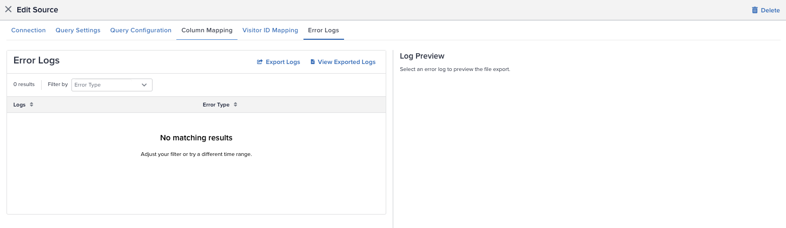

author: jmusselwhite-tealium
id: tealium-snowflake-integration
categories: snowflake-site:taxonomy/solution-center/certification/quickstart, snowflake-site:taxonomy/solution-center/certification/partner-solution, snowflake-site:taxonomy/solution-center/includes/architecture, snowflake-site:taxonomy/product/platform
language: en
summary: This tutorial reviews the process for configuring inbound and outbound Snowflake integrations within Tealium Customer Data Hub 
environments: web
status: Published 
feedback link: https://github.com/Snowflake-Labs/sfguides/issues


# Collect and Activate Customer Data Using Tealium and Snowpipe Streaming

<!-- ------------------------ -->
## Overview 


### Introduction
This quickstart guide will review the configuration of the Snowflake Data Source and Snowflake Streaming connectors within Tealium. Tealium's Customer Data Hub acts as a high quality data source and a real-time activation engine for Snowflake. Use Tealium to capture and send low latency customer interaction data to Snowflake for further analysis or to inform AI initiatives, and automate real-time data activation using Snowflake data across Tealium’s 1300+ integration marketplace.

#### Send Data to Snowflake
- Create a staging table in Snowflake to land the data
- In Tealium, configure the Snowflake Streaming connector
- Process the data from the staging table to the appropriate tables in Snowflake

#### Activate Data from Snowflake
- Identify or create a table or view of data in Snowflake that you want to activate in Tealium
- In Tealium configure the data source by establishing a connection to Snowflake, creating a query to capture only the data needed, map the event and visitor data to appropriate Tealium data attributes
- Once the connection is established, data is ingested in near real-time (as fast as 2 seconds) and is activated based on business rules 


### What You'll Need

- Tealium Customer Data Hub (EventStream and/or AudienceStream) account
- [Snowflake account](https://signup.snowflake.com/?utm_source=snowflake-devrel&utm_medium=developer-guides&utm_cta=developer-guides)
  - Appropriate privileges (covered individually in next steps)

### What You’ll Learn 

1. How to configure a Snowflake Streaming connector within Tealium
2. How to setup a Snowflake Data Source within Tealium
3. How to prepare your Snowflake account for integration

### What you will build

- Snowflake Streaming connector in Tealium to stream data into Snowflake
- Snowflake Data Source in Tealium to capture data from Snowflake


<!-- ------------------------ -->

## Snowflake Streaming Connector

### How It Works
The Snowflake Streaming connector leverages the powerful Snowflake Snowpipe Streaming feature to enable near real-time importing of event and visitor data directly into Snowflake staging tables, enabling immediate availability for processing and analytics with data latency under 10 seconds. Send either the entire dataset or specific attributes to the staging table, ensuring customizable data integration tailored to business needs.

Using Snowpipe Streaming creates a streamlined pathway to enhance data accessibility and analytical capabilities within Snowflake while decreasing latency and costs. By removing third party integrations and using the Snowpipe Streaming serverless compute model, the Snowflake Streaming connector provides a cost effective, secure connection.

The Snowflake Streaming connector enables you to unlock a number of use cases, including:

- **Identity**: Populate and activate identity graphs using cleansed, normalized, real-time identity data.
- **Insights**: Improve and activate differentiated intelligence with rich, high quality, integrated data.
- **AI**: Inform and activate AI initiatives with a real-time data layer.
- **Consent**: Ensure insights and activation always respect customer privacy and preferences.

#### Staging Tables
The staging table in Snowflake that is intended to receive data from Tealium must contain specific columns depending on the selected connector action.

When using either **Send Entire Event Data** or **Send Entire Visitor Data** actions, the staging table must have a **VARIANT** column to receive the dataset and a column to receive the timestamp. The timestamp column must support the the timestamp data format that is sent.

When using either **Send Custom Event Data** or **Send Custom Visitor Data**, the staging table must have a column for each data type. Each data attribute must be assigned to a column. Ensure that each attribute is an accepted Snowflake data type and that the column is formatted properly to receive this data type. To map a timestamp, a separate timestamp column must be added.

For more information, see [Snowflake: Supported Java data types](https://docs.snowflake.com/en/user-guide/data-load-snowpipe-streaming-overview#supported-java-data-types).

#### Data Types
The following table summarizes the data types supported by the Snowflake Streaming connector.

| **Snowflake Data Type** | **Supported**        |
| ----------------------- | -------------------- |
| Numeric data types      | Yes |
| String and binary data types | Yes |
| Logical data types | Yes |
| Date and time data types | Yes |
| Arrays | Yes |
| Object | Yes |
| Variant | Yes |
| Vector | No |
| Geography | No |
| Geometry | No |

#### Table and column configurations
The connector does not support the following table or column configurations

- Columns with collations
- **TRANSIENT** or **TEMPORARY** tables
- Tables with **AUTOINCREMENT** or **IDENTITY** column settings
- A default column value that is not **NULL**

#### IP Addresses to Allow
Snowflake has strict rules about which systems it accepts requests from. You will need to add the [Tealium IP addresses](https://docs.tealium.com/server-side/administration/ip-allow-list/) to your Snowflake allow list.

> **_NOTE:_** You must add the **us-west-1** along with the server-side profile region to your allowlist. If you do not add these addresses to your allowlist, you will see errors when you try to fetch column data.

### Best Practices
We recommend the following Snowflake table configurations for the Snowflake Streaming connector.

- 1 event feed per table
- 1 audience per table

> **_NOTE:_** Concurrent writing of tables by more than one feed or audience may result in performance errors.

<!-- ------------------------ -->

## Configuring a Snowflake Streaming Connector

Within the Tealium Customer Data Hub, navigate to either the EventStream or AudienceStream Connector Marketplace and add a new connector. For more information and instructions on how to add a connector, see [About Connectors](https://docs.tealium.com/server-side/connectors/about/).

After adding the connector, configure the following settings:

- **Username**
  - The Snowflake account username
  - Must either have **OWNERSHIP** or **INSERT** privileges to the Snowflake table that is receiving the data.
- **Role**
  - Access control role to use for the session
- **URL**
  - The Snowflake account URL in the following format: **<account_identifier>.snowflakecomputing.com**
- **Private Key**
  - The customer-generated private key. Supports both encrypted and unencrypted versions. For instructions on generating the Snowflake private key, see [Snowflake > Key-pair authentication and key-pair rotation](https://docs.snowflake.com/en/user-guide/key-pair-auth#generate-the-private-key)



#### Key-pair Generation
To complete the connector authentication, use the following steps to alter the username with the public key details in Snowflake.

1. Generate a public key in Snowflake. For information, see [Generate a Public Key](https://docs.snowflake.com/en/user-guide/key-pair-auth#generate-a-public-key)
2. Assign the public key to the **username** that is being used with the connector by using an **ALTER USER** command in Snowflake. *Note* Only owners with **ACCOUNTADMIN** privileges can alter a user.
3. Run the query to update the user with the new public key

#### Key-pair Generation Example

Within your preferred Command Line Interface (CLI), generate the RSA 2048 key through openssl.
````
## Generate your private key
openssl genrsa 2048 | openssl pkcs8 -topk8 -inform PEM -out rsa_key.p8 -nocrypt

## Generate your public key
openssl rsa -in rsa_key.p8 -pubout -out rsa_key.pub

````
Store your private and public key (public is located in **rsa_key.pub**, private is located in **rsa_key.p8**). The private key will be used in the Snowflake Streaming connector configuration and the public key will be assigned to the username in Snowflake. To make changes to the USER, you must have ACCOUNTADMIN privileges. Make sure that all line breaks have been removed from the public key. In Snowflake, run the following command to alter the user, making sure to put the appropriate values in for **username** and **public_key**.
````
alter user <username> set rsa_public.key=<public_key>;
````

### Actions
The Snowflake Streaming connector within Tealium has two different actions for the event and visitor data sets: *Send Entire Dataset* or *Send Custom Data*. 

All connector actions require the following parameters:

| **Parameter** | **Description** |
| ------------- | --------------- |
| Database Name | The Snowflake database that contains the required table |
| Schema Name | The name of the schema used in the table | 
| Table Name | The name of the staging table you want to land the data into |



After inputing the above values, a drop-down menu with the available columns will become available to map your data. When sending the entire dataset, you will need to assign which column the data will be recorded under. This column must be a **VARIANT** type column in Snowflake. A new row will be created in the staging table for each event with the dataset available under the selected column as an object.

In addition to selecting where to record the datasets, the timestamp column needs to be identified. Because staging tables cannot increment, Tealium generates a timestamp for when the data is sent to Snowflake and inputs that value into this timestamp column. If the default Tealium timestamp is not desirable, the optional **Timestamp Attribute** format selection can be configured to the appropriate format. For more information on supported timestamp types: see [Snowflake: Supported Java data types](https://docs.snowflake.com/en/user-guide/data-load-snowpipe-streaming-overview#supported-java-data-types).

If the Snowflake Streaming connector is being setup within Tealium's AudienceStream, an additional configuration feature called **Include Current Visit Data** is included. When enabled, the dataset will include both the visitor data and current visit data.

#### Custom Data
Tealium provides the ability to select custom data attributes to send into Snowflake, providing greater control over your transferred data. When these actions are chosen, the configuration changes slightly to include the mapping of data attributes to columns in the Snowflake staging table. As previously mentioned, the staging table will require separate columns to be created for each data attribute, including a timestamp column. Once a data attribute is mapped, another attribute cannot be mapped to that column.

#### User and Staging Table Creation Example
The following code snippet will create a new role that will be used to create and gain access to write to the staging table. It is recommended that a separate User is created with limited access to only the staging table for the Tealium connector. The staging table created has two columns, one to map the timestamp and the other to land the data object.

```sql
USE ROLE SECURITYADMIN;
CREATE USER SVC_TEALIUM DEFAULT_ROLE = TEALIUM_RL;
CREATE ROLE TEALIUM_RL;
GRANT ROLE TEALIUM_RL TO USER SVC_TEALIUM;
GRANT ROLE TEALIUM_RL TO ROLE SYSADMIN;

-- Public Key Assignment
-- *Note: Create RSA key-pair first
ALTER USER SVC_TEALIUM SET RSA_PUBLIC_KEY='<publickey>';

-- Database, Schema, and Table Creation
USE ROLE SYSADMIN;
CREATE DATABASE TEALIUM;
GRANT OWNERSHIP ON DATABASE TEALIUM TO ROLE TEALIUM_RL;

USE ROLE TEALIUM_RL;
CREATE SCHEMA EVENT_STREAM;
CREATE SCHEMA AUDIENCE_STREAM;

-- Create raw event tables
CREATE TABLE EVENT_STREAM.RAW_EVENT
(
	EVENT_JSON VARIANT,
	LOAD_TS TIMESTAMP_TZ
);

CREATE TABLE AUDIENCE_STREAM.AUDIENCE_EVENT
(
	VISITOR_JSON VARIANT,
	LOAD_TS TIMESTAMP_TZ
);

-- Repeat for any structured table for specific events as needed
```

### Save the Configuration
After the connector is configured and before data can be sent, the changes must be saved to your Tealium instance. In the upper right-hand corner of your Tealium page, click on the orange **Save/Publish** button.

<!-- ------------------------ -->

## Snowflake Data Source

### How It Works
Use the Snowflake data source to import bulk data from a Snowflake table or view at near real-time speeds. After you import your data, transform and map it to Tealium attributes and build better audiences for targeted activation.

To get started, create one Snowflake data source per Snowflake table or view and customize the query mode and SQL **WHERE** clause for your data set. Then map your database columns to Tealium attributes. Each imported row from a Snowflake source is processed as an event in Tealium.

### Rate Limits
Imports from Snowflake are typically limited to 50 events per second per account, but may vary. Standard attribute size limits still apply. For more information, see [About attributes > Size limits](https://docs.tealium.com/server-side/attributes/about/#size-limits)

The Snowflake data source fetches data at a maximum of 1,000 rows at a time.

### Snowflake Tables
Each Snowflake data source supports importing data from one Snowflake table or view. To import data from multiple Snowflake tables, create a view in Snowflake and select the view in the data source configuration. For more information about views in [Snowflake, see Snowflake: Overview of Views](https://docs.snowflake.com/en/user-guide/views-introduction).

### Data Types
The Snowflake data source supports all Snowflake data types. To ensure data is imported correctly, map the Snowflake data types according to the following guidelines:

| **Snowflake** | **Tealium** |
| ------------- | ----------- |
| Numeric data types | Number attributes |
| String and binary data types | String attributes |
| Logical data types | Boolean attributes |
| Date and time data types | Date attributes |
| Arrays | Array of strings, array of numbers, array of Booelans |
| Object, variant, geography, geometry, and vector data types | String attributes |

For more information about Snowflake data types, see [Snowflake: Summary of Data Types](https://docs.snowflake.com/en/sql-reference/intro-summary-data-types).

### Events
In the default Tealium [data collection order of operations](https://docs.tealium.com/server-side/getting-started/order-of-operations/), events from a Snowflake data source are processed before the **Event received** step and do not change the order of operations.

Snowflake data source events are sent to EventStream and AudienceStream in the same way as events from other data sources with the following important exceptions:

- **Browser-specific attributes**: Browser-specific attributes, such as user agent, are not populated.
- **Enrichments**: Enrichments on preloaded attributes in AudienceStream are not run, except for the First visit attribute.
- **Functions**: Data transformation functions are not run.
- **Single-page visits**: Incoming events are exempt from the single-page visit/visitors criteria. Single-page visits and visitors from other data sources are not persisted in AudienceStream. For more information, see [How are single-page visits processed in AudienceStream?](https://support.tealiumiq.com/en/support/solutions/articles/36000363388-how-are-single-page-visits-processed-in-audiencestream-) (requires Tealium login).
- **Visit length**: A visit started by a Snowflake data source event lasts for 60 seconds.
- **Visitor ID mapping**: If you map an AudienceStream visitor ID attribute in your Snowflake data source configuration, the visitor ID is set directly to the value of the column you choose and no additional enrichment is needed.

### Configuration

#### Query Modes
The Snowflake data source supports three query modes to let you control how data is imported from your Snowflake table or view:

- **Timestamp + Incrementing**: (*Recommended*) Tealium imports new or modified rows based on a timestamp column and an auto-increment column. In this mode, rows with a newer timestamp than the previous import and a larger auto-increment value than the last imported row are imported. This is the most reliable mode to ensure that all rows are imported as expected.
- **Timestamp**: Tealium imports new or modified rows based on a timestamp column. In this mode, rows with a newer timestamp than the previous import are imported. Use this mode if your table has a timestamp column that gets set or updated on every update.
- **Incrementing**: Tealium imports rows based on an auto-increment column. In this mode, rows with a larger auto-increment value than the last imported row are imported. This will not detect modifications or deletions of existing rows. Use this mode if you only have an auto-increment column and do not have a timestamp column.

The Snowflake data source does not support bulk query modes.

#### Query Mode Example
The following example shows how batch processing of rows and query modes work together. In the following table, **modification_time** is the timestamp column and **customer_id** is the incrementing column.

| **customer_id** | **modification_time** | **customer_segment** |
| --------------- | --------------------- | -------------------- |
| 1 | 01Apr 13:00 | A |
| 2 | 01Apr 13:00 | B |
| ... | ... | ... |
| 1000 | 01Apr 13:00 | D |
| 1001 | 01Apr 13:00 | E |
| 1002 | 02Apr 14:00 | A |

The Snowflake data source fetches data 1,000 rows at a time and marks the maximum value of the timestamp and/or incrementing column(s) from the batch of data.

- Using **Timestamp + Incrementing** mode: The data source fetches rows 1-1000. The next time the data source fetches the data, it will look for rows where either
````
modification_time is 01Apr 13:00 and the customer_id is greater than 1000
````
or
````
modification_time is greater than 01Apr 13:00
````
- Using **Timestamp** mode (**modification_time** in the example): The data source will fetch rows 1-1000 and mark the maximum timestamp of **01Apr 13:00**. The next time the data source fetches the data, it will look for a timestamp greater than **01Apr 13:00**. In this case, row 1001 would be skipped because it has the same timestamp value but was fetched in different batch of data.
Using **Incrementing** mode: The data source will fetch rows 1-1000 and mark the maximum auto-increment value of **1000**, but rows with new data and an updated timestamp column would not be processed. Only newly added rows that further increment the incrementing column (customer_id in the example) would be processed.

#### SQL Query
In the Snowflake data source **Query Configuration**, select the columns you want to import into Tealium. To add additional conditions for processing, use the SQL **WHERE** clause. This option adds a **WHERE** statement to your query. **WHERE** statements support basic SQL syntax.

> **_Note_**: The **WHERE** clause does not support subqueries from multiple tables. To import data from multiple Snowflake tables, create a view in Snowflake and select the view in the data source configuration. For more information, see [Snowflake: Overview of Views](https://docs.snowflake.com/en/user-guide/views-introduction).

#### Column Mapping
The column mapping configuration determines the event attributes that correspond to each column in the Snowflake table.

Column names are often different from the attribute names in the Customer Data Hub, so this mapping ensures that the data is imported properly. For example, a table might have a column named **postalCode**, but the matching event attribute is named **customer_zip**, so you need a mapping to associate them.

For information about mapping Snowflake data types to Tealium data types, see the [Data Types](https://docs.tealium.com/early-access/snowflake-data-source/about/#data-types) section.

#### Visitor ID Mapping
To ensure your imported data is stitched with other sources, such as web, mobile, or HTTP API, ensure that every row in the Snowflake table has a column with a unique visitor ID. You can then map the visitor ID column and corresponding event attribute to a visitor ID attribute (a unique attribute type for visitor identification in AudienceStream). The value in the mapped event attribute is assigned to the **tealium_visitor_id** attribute and matched directly to any existing visitor profiles.

For more information about Visitor ID Mapping in AudienceStream, see [Visitor Identification using Tealium Data Sources](https://docs.tealium.com/server-side/data-sources/visitor-identification/).

### IP Addresses to Allow
If your Snowflake account has strict rules about which systems it accepts requests from, add the [Tealium IP addresses](https://docs.tealium.com/server-side/administration/ip-allow-list/) to your Snowflake allow list.


<!-- ------------------------ -->

## Configuring a Snowflake Data Source

Take the following steps to pull up the Snowflake data source and begin the configuration process:
1. In Tealium, go to **Sources > Data Sources**
2. Click **+Add Data Source**
3. Under **Categories**, click **Data Warehouse** and select **Snowflake**
4. In the **Name** field, enter a unique name for the data source related to your use case
5. Click **Continue**

### Establish a Snowflake Connection
The Snowflake data source lets you create connections to Snowflake that you can reuse in other Snowflake data sources.

#### Necessary Information
Ensure you have the following Snowflake account information before you get started:
- Account identifier
  - To determine the format of your account identifier, navigate to your Snowflake workspace and copy the unique account URL. For example, if your Snowflake account URL is **xy12345.us-east-2.aws.snowflakecomputing.com/console#/internal/worksheet** use the **xy12345.us-east-2.aws.snowflakecomputing.com** portion as your account identifier. For more information, see [Snowflake: Account identifiers](https://docs.snowflake.com/en/user-guide/admin-account-identifier).
- Connection warehouse
- Database name
- Database schema
- Connection role
- Snowflake username and password

#### Configuration Steps

1. In the **Connection Configuration** screen, confirm the name of the data source.
2. Select an existing connection configuration from the drop-down list or create a new connection by clicking the + icon. To create a new connection, enter the following account details on the **New Snowflake Connection Configuration** screen:
  - **Snowflake Connection Configuration Name**: Provide a name for the reusable connection configuration.
  - **Account Identifier**: The Snowflake account identifier without the **http://** prefix in the following format:
    - Using a Snowflake account name: **ACCOUNT_NAME.snowflakecomputing.com**
    - Using a Snowflake account locator in region: **ACCOUNT_LOCATOR.CLOUD_REGION_ID.CLOUD.snowflakecomputing.com**
  - **Connection Warehouse**: The name of the Snowflake warehouse to use for this connection.
  - **Database Name**: The name of the Snowflake database to connect to.
  - **Database Schema**: The name of the Snowflake database schema to connect to.
  - **Connection Role**: The role assigned to the user in Snowflake. This role must have USAGE privileges. For more information, see [Snowflake: Custom roles](https://docs.snowflake.com/en/user-guide/security-access-control-overview#custom-roles) and [Snowflake: Access control privileges](https://docs.snowflake.com/en/user-guide/security-access-control-privileges).
  - **Username** and **Password**: The username and password used to connect to your Snowflake database, schema, warehouse, and table or view.
3. Click **Save**.
4. In the **Connection Configuration** screen, enter your Snowflake account password and then click **Establish Connection**.
5. After you successfully connect to Snowflake, select the data source table from the **Table Selection** drop-down list. To import data from multiple Snowflake tables, create a view in Snowflake and select it from the drop-down list. For more information, see [Snowflake: Overview of Views](https://docs.snowflake.com/en/user-guide/views-introduction).
6. Toggle on **Enable Processing** if you want the Snowflake data source to begin processing immediately.
7. Click **Next**.

### Select Query Setting
In the **Query Settings** screen, select the appropriate query mode for your Snowflake table or view.

When you select **Timestamp** or **Incrementing**, you must list the name of one column to use to detect either new and modified rows or new rows only. If you select **Timestamp + Incrementing** you must list two columns, a timestamp column and a strictly incrementing column, to detect new and modified rows.

For more information, see [About Snowflake data source > Query settings](https://docs.tealium.com/early-access/snowflake-data-source/about/#query-settings).

When you are done, click **Next**.

### Configure the SQL Query
1. In the **Query > Select Columns** section, select the table or view columns to import to Tealium. To change the Snowflake table or view, click **Back** to return to Step 1: Establish a Snowflake connection.
2. (Optional) To add custom conditions or additional filters, include a SQL **WHERE** clause.
  - The **WHERE** clause does not support subqueries from multiple tables. To import data from multiple Snowflake tables, create a view in Snowflake and select the view in the data source configuration. For more information, see [Snowflake: Overview of Views](https://docs.snowflake.com/en/user-guide/views-introduction).
3. Click **Test Query** to validate your SQL query and preview the results.
4. Click **Next**.

#### Example SQL for Querying a Data Table with Fake Data
```sql
SELECT 
    ID, 
    TIMESTAMP, 
    CUSTOMER_ID, 
    CAST(DATE_OF_BIRTH AS VARCHAR) AS DATE_OF_BIRTH_STRING, 
    ADDRESS_1, 
    ADDRESS_2, 
    CITY, 
    STATE, 
    COUNTRY, 
    ZIP_CODE
FROM 
    customers
WHERE 
    ID >= 4;
```

### Map Columns
Use the column mapping table to map pre-configured column labels to event attributes or manually enter the column labels for mapping. Each row from Snowflake is processed as an event. Columns not mapped to an event attribute are ignored.

For each column label, select the corresponding event attribute from the drop-down list.

When you are done, click **Continue**.

### Map Visitor ID Attributes
To use your Snowflake data with AudienceStream, map your data to visitor ID attributes. Select the mapped event attribute that represents a visitor ID and map it to the corresponding visitor ID attribute.

> **Visitor ID Mapping in AudienceStream** is enabled by default. Disabling visitor ID mapping may cause errors in visitor stitching. For more information, see [Visitor Identification using Tealium Data Sources](https://docs.tealium.com/server-side/data-sources/visitor-identification/).

When you are done, click **Next**.

### Summary
In this final step, view the summary, make any needed corrections, and then save and publish your profile. To edit your configuration, click **Back** to return to the step where you want to make changes.

1. View the event attribute and visitor ID mappings.
2. Click **Create** to create the data source and exit the configuration screen. The new data source is now listed in the **Data Sources** dashboard.
3. Click **Save/Publish** to save and publish your changes.

To check the status of import activity, navigate to the **Data Sources** dashboard and expand the data source.

### Edit a Snowflake Data Source
To change a Snowflake data source, navigate to the **Data Sources** dashboard and click the edit icon next to the configuration you want to change. From the **Edit Connection** screen, you can edit Snowflake connection, query, and mapping configurations.



### Error Logs

To view the error logs, complete the following steps in Tealium:
1. From the **Data Sources** dashboard, expand the Snowflake data source you want to view.
2. Under **Errors**, click **Error Logs** or click the edit icon and select the **Error Logs** tab.
3. Select the error log you want to view and preview or export the log.



#### Export Logs
You can export logs for the following time ranges:
- Last 30 minutes
- Last hour
- Last 4 hours
- Custom time range

To reduce file sizes, exports are limited to a time range of 4 hours or shorter. Complete the following steps to export logs:

1. From the **Error Logs** tab, click **Export Logs**
2. Select a time range or select **Customer** to choose the start and end date and time
3. Select the error type(s) to incldue in the log
4. Click **Request Export**

There is a short delay while the logs are processed. You can view your exported logs from the past six days by navigating to **Error Logs>View Exported Logs**. Logs are stored for 30 days.


<!-- ------------------------ -->

## Conclusion and Resources

### What You Learned
- How to configure Tealium's Snowflake Streaming connector in EventStream and AudienceStream
- How to create a Snowflake Data Source in Tealium to ingest data

### Conclusion

In this guide, you learned how to successfully configure a Snowflake Data Source and Snowflake Streaming connectors within Tealium, enhancing your ability to leverage real-time customer data. These integrations enables you to efficiently capture, process, and activate low-latency data, optimizing your analysis and AI initiatives while leveraging Tealium’s extensive integration marketplace.

Reach out to your account representatives to learn more about unlocking the full potential of your data with Tealium and Snowflake! 

### Resources
- [Snowflake Streaming Connector](https://docs.tealium.com/server-side-connectors/snowflake-streaming-connector/)
- [Snowflake Data Source](https://docs.tealium.com/early-access/snowflake-data-source/about/)
- [Tealium + Snowflake Better Together](https://tealium.com/technology-partner/better-together-tealium-snowflake/)

- [Download Reference Architecture](/content/dam/snowflake-site/developers/2024/10/Tealium-Ref-Architecture-1.pdf)
- [Read the blog](https://medium.com/snowflake/how-tealiums-real-time-customer-data-capabilities-make-your-snowflake-data-more-complete-230863562a0e)
- [Watch the Demo](https://youtu.be/VxmAdu6y1X0?list=TLGGSkiCxM9-jScyMDA5MjAyNQ)
