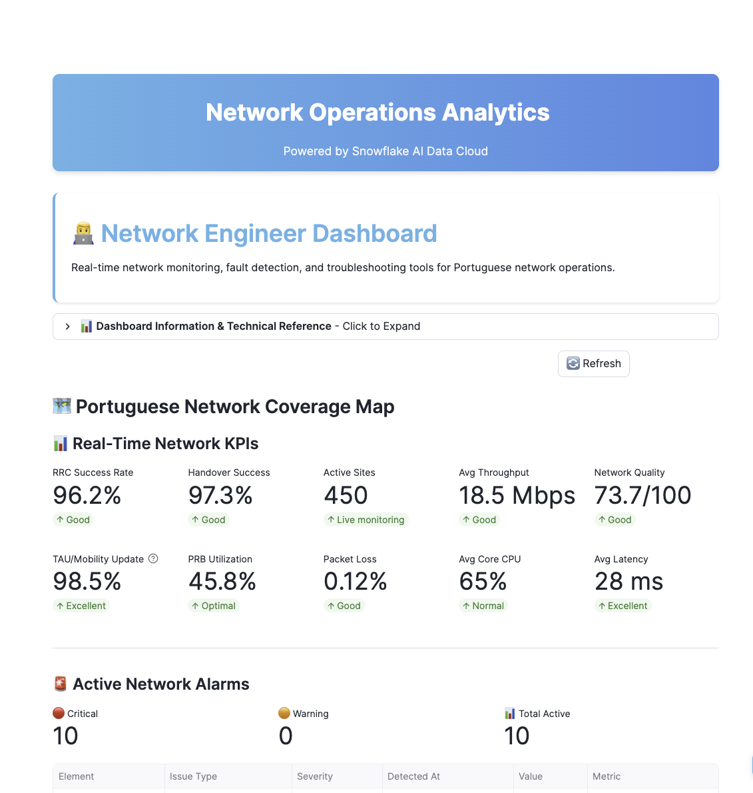
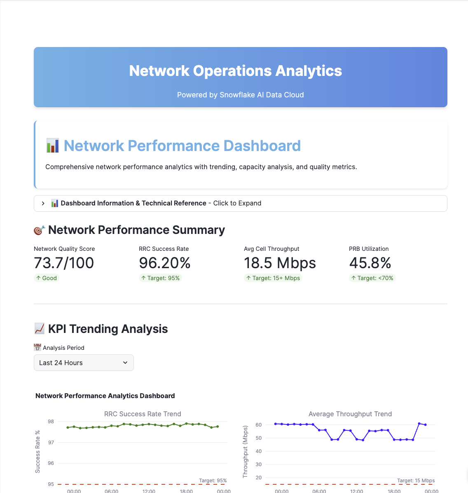
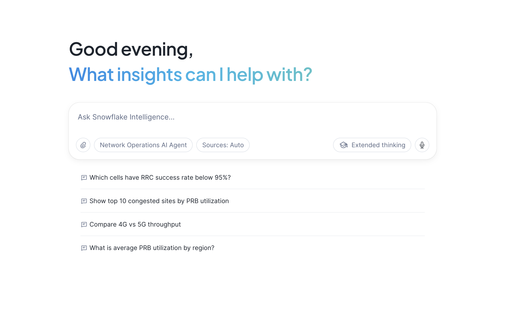

author: Sreedhar Rao, Pedro Jose, Siddharth Pandit, Joviane Bellegarde
id: telecom-network-ops-intelligence
summary: Build an end-to-end telecom network operations solution with 4 persona dashboards, 3D visualization, and Snowflake Intelligence for natural language queries
categories: snowflake-site:taxonomy/solution-center/certification/quickstart, snowflake-site:taxonomy/solution-center/certification/certified-solution, snowflake-site:taxonomy/industry/telecommunications, snowflake-site:taxonomy/product/ai, snowflake-site:taxonomy/snowflake-feature/streamlit-in-snowflake, snowflake-site:taxonomy/snowflake-feature/cortex-ai
environments: web
language: en
status: Published
feedback link: https://github.com/Snowflake-Labs/sfguides/issues
tags: Getting Started, Telecom, Network Operations, Streamlit, Snowflake Intelligence, Cortex, Semantic View, 5G, 4G
fork repo link: https://github.com/Snowflake-Labs/sfguide-telecom-network-operations-analytics

# End-to-End Telecom Network Operations Reporting and Analytics

## Overview

Telecom network operations teams face the challenge of monitoring thousands of network elements across RAN, Transport, and Core infrastructure while meeting stringent SLA requirements. This guide demonstrates how to build a comprehensive network operations solution using **Snowflake Intelligence** and **Streamlit in Snowflake**.

In this Guide, you will build a complete network operations platform that:
- Monitors 450+ cell sites across 4G and 5G networks
- Provides role-based dashboards for 4 key personas
- Enables natural language queries via Snowflake Intelligence
- Visualizes network topology with 3D mapping

### What You Will Build
- Multi-persona Streamlit dashboard (Network Engineer, Analyst, Manager, Executive)
- Real-time KPI monitoring for RAN, Transport, and Core networks
- 3D network visualization with PyDeck
- Snowflake Intelligence Agent for natural language queries
- Semantic View for structured data access

### What You Will Learn
- How to deploy Streamlit applications in Snowflake
- How to create Semantic Views for natural language queries
- How to configure Snowflake Intelligence Agents
- How to visualize geospatial data with PyDeck
- How to build role-based analytics dashboards

### Prerequisites
- A Snowflake account with ACCOUNTADMIN privileges
- Go to the <a href="https://signup.snowflake.com/?utm_source=snowflake-devrel&utm_medium=developer-guides&utm_cta=developer-guides" target="_blank">Snowflake</a> sign-up page and register for a free account
- Basic familiarity with SQL and Python

<!-- ------------------------ -->
## Architecture Overview

### Solution Architecture

The Network Operations solution provides end-to-end visibility across telecom infrastructure:

**Data Layer:**
- **RAN_4G / RAN_5G**: Radio Access Network metrics (eNodeB, gNodeB)
- **CORE_4G / CORE_5G**: Core network elements (MME, SGW, PGW, AMF, SMF, UPF)
- **TRANSPORT**: Backhaul and fronthaul device performance
- **ANALYTICS**: Aggregated facts and dimension tables

**Application Layer:**
- **Streamlit Dashboard**: 4 persona-specific views
- **Snowflake Intelligence Agent**: Natural language interface
- **Semantic View**: Structured query definitions

### Key Personas

| Persona | Focus Area | Key Metrics |
|---------|------------|-------------|
| **Network Engineer** | Real-time troubleshooting | MTTD, MTTR, Alarms |
| **Network Performance** | Capacity planning | PRB Utilization, Throughput |
| **Network Manager** | SLA management | Success Rates, Coverage |
| **Executive** | Business impact | Revenue at Risk, Churn |

### Data Model

The solution includes approximately 600,000 performance records across:
- 450 cell sites in Portugal (Lisboa, Porto, Braga, Coimbra, Faro)
- September 2025 time period
- 15-minute measurement intervals

<!-- ------------------------ -->
## Setup Snowflake Environment

In this step, you'll create all the Snowflake objects needed for the Network Operations solution.

### Step 1: Create Database Objects

1. In Snowsight, click **Projects**, then **Workspaces** in the left navigation, or <a href="https://app.snowflake.com/_deeplink/#/workspaces?utm_source=quickstart&utm_medium=quickstart&utm_campaign=-us-en-all&utm_content=app-network-operations-reporting-analytics-snowflake-intelligence" target="_blank">click here</a> to go there directly
2. Click `+ Add new` to create a new Workspace
3. Click **SQL File** to create a new SQL file
4. Copy the setup script from <a href="https://github.com/Snowflake-Labs/sfguide-telecom-network-operations-analytics/blob/main/scripts/setup.sql" target="_blank">setup.sql</a> and paste it into your SQL file

### Step 2: Run Infrastructure Setup

Run the setup script to create:
- **Database**: **NETWORK_OPERATIONS** with 7 schemas (RAN_4G, RAN_5G, CORE_4G, CORE_5G, TRANSPORT, ANALYTICS, STAGING)
- **Warehouses**: **NETWORK_OPS_WH** for queries, **NETWORK_OPS_BUILD_WH** for data loading
- **GitHub External Access Integration**: For automatic data loading from GitHub
- **Stages**: **CSV_DATA** for data files, **STREAMLIT_STAGE** for app deployment
- **Tables**: Dimension and fact tables for network data

<!-- ------------------------ -->
## Load Data

The setup script automatically loads all data from GitHub using an External Access Integration. No manual file downloads required!

### Step 1: Data Loading

The script creates a **LOAD_DATA_FROM_GITHUB()** procedure that:
1. Connects to GitHub using the External Access Integration
2. Downloads all 13 CSV files directly from the repository
3. Loads data into the appropriate tables

### Step 2: Verify Data Load

After running the setup script, verify the record counts:

| TABLE_NAME | RECORD_COUNT |
|------------|--------------|
| DIM_CELL_SITE | 450 |
| DIM_NETWORK_ELEMENT | 480 |
| FACT_RAN_PERFORMANCE | 604,800 |
| FACT_CORE_PERFORMANCE | 13,440 |

<!-- ------------------------ -->
## Deploy Streamlit Application

The setup script also automatically downloads and deploys the Streamlit application from GitHub!

### Step 1: Streamlit Deployment

The script creates a **LOAD_STREAMLIT_FROM_GITHUB()** procedure that:
1. Downloads **streamlit_app.py** and **environment.yml** from GitHub
2. Uploads them to the **STREAMLIT_STAGE**
3. Creates the **NETWORK_OPS_DASHBOARD** Streamlit application

### Step 2: Launch the Dashboard

In Snowsight, click **Projects**, then **Streamlit** in the left navigation and select **NETWORK_OPS_DASHBOARD**, or <a href="https://app.snowflake.com/_deeplink/#/streamlit-apps/NETWORK_OPERATIONS.ANALYTICS.NETWORK_OPS_DASHBOARD" target="_blank">click here</a> to go there directly.

<!-- ------------------------ -->
## Explore the Dashboards

### Network Engineer View

The Network Engineer dashboard focuses on real-time troubleshooting:

**Key Features:**
- **Active Alarms**: Real-time alarm monitoring with severity levels
- **MTTD/MTTR Metrics**: Mean Time to Detect and Mean Time to Resolve
- **Cell Site Map**: 3D visualization of network topology
- **Drill-down Analysis**: Click any site for detailed metrics

### Network Performance View

The Network Performance dashboard focuses on capacity planning:

**Key Features:**
- **PRB Utilization Trends**: Physical Resource Block usage over time
- **Throughput Analysis**: Uplink/Downlink performance
- **Capacity Forecasting**: Predictive capacity trends
- **Comparative Analysis**: Site-to-site performance comparison

### Network Manager View

The Network Manager dashboard focuses on SLA management:

**Key Features:**
- **SLA Compliance**: Real-time SLA tracking
- **Team Performance**: Issue resolution metrics
- **Coverage Analysis**: Network coverage gaps
- **Executive Summary**: High-level operational status

### Executive View

The Executive dashboard focuses on business impact:

**Key Features:**
- **Revenue at Risk**: Financial impact of network issues
- **Churn Indicators**: Customer experience metrics
- **Strategic KPIs**: High-level performance indicators
- **Trend Analysis**: Month-over-month comparisons

<!-- ------------------------ -->
## Snowflake Intelligence

In Snowsight, click **AI & ML**, then **Snowflake Intelligence** in the left navigation.

The setup script automatically creates the Semantic View and Snowflake Intelligence Agent:

**Semantic View** (**NETWORK_SEMANTIC_VIEW**)::
- Table definitions for DIM_CELL_SITE and FACT_RAN_PERFORMANCE
- Column descriptions for natural language understanding
- Relationships between dimension and fact tables
- Verified queries for common analysis patterns

**Snowflake Intelligence Agent** (**NETWORK_OPERATIONS_AGENT**)::
- Uses Snowflake's default orchestration model for natural language understanding
- System prompt configured for telecom domain expertise
- Semantic View tool for data access

### Test the Agent

Try these persona-specific queries:

### Network Engineer (NOC/Field)

**1. RRC Success Rate Troubleshooting**

Identify cells falling below the 95% RRC success rate target.

**`Which cells have RRC success below 95% right now?`**

**2. Critical Capacity Alerts**

Find sites with PRB utilization above 85% (critical threshold).

**`Show me the top 10 sites with critical PRB utilization above 85%`**

**3. 5G Session Issues**

Identify 5G cells with PDU session establishment problems.

**`Which 5G cells in Lisboa have PDU session issues?`**

### Network Performance

**1. Technology Comparison**

Compare average throughput between 4G and 5G across regions.

**`Compare average throughput between 4G and 5G by region`**

**2. Regional Trend Analysis**

Analyze PRB utilization trends to predict capacity needs.

**`What is the PRB utilization trend for Porto this week?`**

**3. Congestion Risk Assessment**

Identify regions with the highest congestion risk based on utilization patterns.

**`Which regions have the highest congestion risk?`**

### Network Manager (Operations)

**1. SLA Compliance Overview**

Monitor how many sites are currently below SLA targets.

**`How many sites are currently below SLA targets?`**

**2. Capacity Planning Data**

Review availability metrics by city to inform capacity planning.

**`Show availability metrics by city for capacity planning`**

**3. Regional Priority Assessment**

Determine which region has the most sites needing attention.

**`Which region has the most sites needing attention?`**

### Executive (C-Level)

**1. Network Health Overview**

Get a high-level view of overall network health across Portugal.

**`What is our overall network health across Portugal?`**

**2. 5G Investment ROI**

Compare 5G vs 4G performance to validate technology investment.

**`Show 5G vs 4G performance summary for board reporting`**

**3. Investment Prioritization**

Identify which regions should be prioritized for network investment.

**`Which regions should be prioritized for investment?`**

<!-- ------------------------ -->
## Cleanup

To remove all resources created by this guide:

1. Open your **[setup.sql](https://github.com/Snowflake-Labs/sfguide-telecom-network-operations-analytics/blob/main/setup.sql)** Workspace (the same one you used during setup)
2. Scroll to the **TEARDOWN SCRIPT** section at the bottom
3. **Uncomment** the DROP statements
4. **Run** the teardown commands

The teardown script will remove the agent, Streamlit app, database, warehouses, and all other objects created by this guide.

<!-- ------------------------ -->
## Conclusion and Resources

Congratulations! You have successfully built a comprehensive telecom network operations solution with Snowflake Intelligence.

### What You Learned
- How to structure telecom network data in Snowflake
- How to deploy multi-persona Streamlit dashboards
- How to create Semantic Views for natural language access
- How to configure Snowflake Intelligence Agents
- How to visualize geospatial network data

### Business Value

| Persona | Key Benefit | Estimated Value |
|---------|-------------|-----------------|
| Network Engineer | 40% faster issue detection | €230K-275K/year |
| Network Performance | Proactive capacity planning | €1.2M/year |
| Network Manager | SLA protection | €870K/year |
| Executive | Reduced churn | €9.9M/year |

### Related Resources

**Snowflake Documentation:**
- <a href="https://docs.snowflake.com/en/user-guide/snowflake-intelligence/overview" target="_blank">Snowflake Intelligence</a>
- <a href="https://docs.snowflake.com/en/developer-guide/streamlit/about-streamlit" target="_blank">Streamlit in Snowflake</a>
