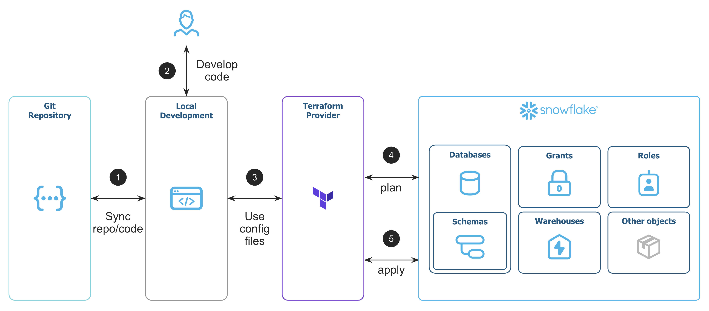

summary: Learn how to manage Snowflake using Terraform 
id: terraforming-snowflake
categories: snowflake-site:taxonomy/solution-center/certification/quickstart, snowflake-site:taxonomy/product/platform
language: en
environments: web
status: Published
feedback link: https://github.com/Snowflake-Labs/sfguides/issues
authors: Brad Culberson, Scott Winkler, François Vienneau Binette


# Terraforming Snowflake

## Overview

> 
> ⚠️ **Disclaimer**: You may have already been using the Provider in one of it's legacy version developed by the open source community. Major reworks came with v1.0.0 at the end of 2024, bringing us closer to the official and generally available v2.0.0 release. Not every Snowflake objects are available through the Provider, it's a work in progress. Refer to the [official documentation](https://registry.terraform.io/providers/snowflakedb/snowflake/latest/docs) and check out the [project roadmap](https://github.com/snowflakedb/terraform-provider-snowflake/blob/main/ROADMAP.md) for more information.

> 
> 
>  **Tip** – This tutorial will work with the Provider version v1.0.0 and over.

[Terraform](https://www.terraform.io/) is an open-source Infrastructure as Code (IaC) tool created by HashiCorp. It is a declarative Infrastructure as Code tool, meaning instead of writing step-by-step imperative instructions like with SQL, JavaScript or Python, you can declare what you want using a YAML like syntax. Terraform is also stateful, meaning it keeps track of your current state, and compares it with your desired state. A reconciliation process between the two states generates a plan that Terraform can execute to create new resources, or update/delete existing resources. This plan is implemented as an acyclic graph, and is what allows Terraform to understand and handle dependencies between resources. Using Terraform is a great way to manage account level Snowflake resources like Warehouses, Databases, Schemas, Tables, and Roles/Grants, among many other use cases.  

A Terraform provider is available for [Snowflake](https://registry.terraform.io/providers/snowflakedb/snowflake/latest/docs), that allows Terraform to communicate and integrate with Snowflake.

Example Terraform use-cases:
 - Set up storage in your cloud provider and add it to Snowflake as an external stage
 - Add storage and connect it to Snowpipe
 - Create a service user and push the key into the secrets manager of your choice, or rotate keys
 - Create database objects objects such as schemas, streams, tasks, views, etc.
 - Define roles, grant privileges to these roles, and assign to users

Many Snowflake customers use Terraform to comply with security controls, maintain consistency, and support similar engineering workflows for infrastructure at scale.

This tutorial demonstrates how you can use Terraform to manage your Snowflake configurations in an automated and source-controlled way. We show you how to install and use Terraform to create and manage your Snowflake environment, including how to create a database, schema, warehouse, multiple roles, and a service user.  

 This introductory tutorial does _not_ cover specific cloud providers or how to integrate Terraform into specific CI/CD tools. Those topics may be covered in future labs.

### Prerequisites
- Familiarity with Git, Snowflake, and Snowflake objects
- `ACCOUNTADMIN` role access to a Snowflake account

### What You’ll Learn
- Basic Terraform usage
- How to create users, roles, databases, schemas, and warehouses in Terraform
- How to manage objects from code/source control

### What You’ll Need
- A Snowflake account - create a [trial account](https://signup.snowflake.com/?utm_source=snowflake-devrel&utm_medium=developer-guides&utm_cta=developer-guides) if needed
- A [GitHub](https://github.com/) account
- A [Git](https://github.com/git-guides/install-git) command-line client
- A text editor of your choice
- [Terraform](https://developer.hashicorp.com/terraform/install) installed on your machine

### What You’ll Build
- A repository containing a Terraform project that manages Snowflake account objects through code

In practice, the workflow looks like this:

1. Create GitHub repository to version control the code
2. Develop Terraform code to manage Snowflake objects
3. Setup config files and initialize the Terraform Provider
4. Plan the changes on Snowflake
5. Apply the changes to Snowflake

  

## Create a New Repository

Let's create a new repository to store your Terraform project code. We use the repository name `sfguide-terraform-sample` in this lab. 

Run the following commands if you use the git command-line client replacing `YOUR_GITHUB_USERNAME` with your username:

```Shell
$ mkdir sfguide-terraform-sample && cd sfguide-terraform-sample
$ echo "# sfguide-terraform-sample" >> README.md
$ git init
$ git add README.md
$ git commit -m "first commit"
$ git branch -M main
$ git remote add origin git@github.com:YOUR_GITHUB_USERNAME/sfguide-terraform-sample.git
$ git push -u origin main
```

> 
> 
>  **Tip** – If the commands don't work, verify that you can connect to GitHub using your SSH key, and that your git config is correct for your account.

You now have an empty repo that we will use in subsequent steps to Terraform your Snowflake account.

## Create a Service User for Terraform

We will now create a service user separate from your own user. A [service-type](https://docs.snowflake.com/en/user-guide/admin-user-management#types-of-users) user authenticate with Snowflake without a login and password but only with a key-pair approach. No need for password or MFA. This is also how most CI/CD pipelines run Terraform.

### Create an RSA key for Authentication

This creates the private and public keys we use to authenticate the service account we will use for Terraform.

```Shell
$ cd ~/.ssh
$ openssl genrsa 2048 | openssl pkcs8 -topk8 -inform PEM -out snowflake_tf_snow_key.p8 -nocrypt
$ openssl rsa -in snowflake_tf_snow_key.p8 -pubout -out snowflake_tf_snow_key.pub
```

### Create the User in Snowflake

Log in to the Snowflake console and create the [service user](https://docs.snowflake.com/en/user-guide/admin-user-management#label-user-management-types) by running the following command as the `ACCOUNTADMIN` role.

But first:
1. Copy the text contents of the `~/.ssh/snowflake_tf_snow_key.pub` file, including the `PUBLIC KEY` header and the `PUBLIC KEY` footer.
2. Paste all the content of your public key over the `<RSA_PUBLIC_KEY_HERE>` label (shown below).

Execute the following SQL statements to create the service user (SVC) and grant it access to the `SYSADMIN` and `SECURITYADMIN` roles needed for account management.

```SQL
USE ROLE ACCOUNTADMIN;

CREATE USER TERRAFORM_SVC
    TYPE = SERVICE
    COMMENT = "Service user for Terraforming Snowflake"
    RSA_PUBLIC_KEY = "<RSA_PUBLIC_KEY_HERE>";

GRANT ROLE SYSADMIN TO USER TERRAFORM_SVC;
GRANT ROLE SECURITYADMIN TO USER TERRAFORM_SVC;
```


> 
> 
>  We grant the user `SYSADMIN` and `SECURITYADMIN` privileges to keep the lab simple. An important security best practice, however, is to limit all user accounts to least-privilege access. In a production environment, the public key should also be secured with a secrets management solution like HashiCorp Vault, Azure Key Vault, AWS Secrets Manager, etc.

## Setup Terraform Authentication

We need to pass provider information to Terraform so it can authenticate as the user on our Snowflake account.

But first, run the following to find `YOUR_SNOWFLAKE_ACCOUNT`. Refer to the [account identifiers documentation](https://docs.snowflake.com/en/user-guide/admin-account-identifier#format-1-preferred-account-name-in-your-organization) for more information.

```SQL
SELECT LOWER(current_organization_name()) as your_org_name, LOWER(current_account_name()) as your_account_name;
```

With this information, copy the content of the following block to a new file we'll call `main.tf`.

- Replace the `your_org_name` and `your_account_name` with your own
- Update the `private_key` file path if you've created it somewhere else

```
terraform {
  required_providers {
    snowflake = {
      source = "snowflakedb/snowflake"
    }
  }
}

locals {
  organization_name = "your_org_name"
  account_name      = "your_account_name"
  private_key_path  = "~/.ssh/snowflake_tf_snow_key.p8"
}

provider "snowflake" {
    organization_name = local.organization_name
    account_name      = local.account_name
    user              = "TERRAFORM_SVC"
    role              = "SYSADMIN"
    authenticator     = "SNOWFLAKE_JWT"
    private_key       = file(local.private_key_path)
}
```

The Snowflake Provider will use the information we provided to securely authenticate with your Snowflake account as the service user.

## Declaring Resources

In the the same `main.tf` file, let's add two configurations for the database and the warehouse that we want Terraform to create.

Copy the contents of the following block at the end of your `main.tf` file, following the provider information:

```
resource "snowflake_database" "tf_db" {
  name         = "TF_DEMO_DB"
  is_transient = false
}

resource "snowflake_warehouse" "tf_warehouse" {
  name                      = "TF_DEMO_WH"
  warehouse_type            = "STANDARD"
  warehouse_size            = "XSMALL"
  max_cluster_count         = 1
  min_cluster_count         = 1
  auto_suspend              = 60
  auto_resume               = true
  enable_query_acceleration = false
  initially_suspended       = true
}
```

This is all the code needed to create these resources: a database and a XS virtual warehouse.

> 
> 
>  **Tip** – You can split objects creation in as many `.tf` files as necessary, no need to keep everything in `main.tf`. Split them in a way that makes logical sense for your own use.

Snowflake objects creation, or _resources_ in Terraform terms, all follow the same pattern. In the case of the database we just defined:

- `snowflake_database` is the type of the resource. In this case, a Snowflake database.
- `tf_db` is the resource name. You can name your resource whatever you want but we suggest to make it descriptive and unique. It will be used by Terraform to identify the resource when referencing it.
- `TF_DEMO_DB` is the name you want to give to your Snowflake object, how it will appear in Snowflake. 
- `is_transient` is a paramter specific to this resource.


Always consult the [documentation](https://registry.terraform.io/providers/snowflakedb/snowflake/latest/docs) when you're creating new resources. 

## Preparing the Project to Run

To set up the project to run Terraform, you first need to initialize the project.

Run the following from a terminal in your project folder:

```Shell
$ terraform init
```

The dependencies needed to run Terraform are downloaded to your computer.

In this demo, we use a local backend for Terraform, which means that state file are stored locally on the machine running Terraform. Because Terraform state files are required to calculate all changes, it's critical that you do not lose this file (`*.tfstate`, and `*.tfstate.*` for older state files), or Terraform will lose track of what resources it is managing. For any kind of multi-tenancy or automation workflows, it is highly recommended to use [remote backends](https://developer.hashicorp.com/terraform/language/backend/remote), which is outside the scope of this lab.

The `.terraform` folder is where all provider and modules dependencies are downloaded. There is nothing important in this folder and it is safe to delete. You should add this folder, and the Terraform state files (since you do not want to be checking in sensitive information into your version control system) to `.gitignore`.

Create a file named `.gitignore` in your project root, then add the following text to the file, and save it:

```plaintext
*.terraform*
*.tfstate
*.tfstate.*
```

## Commit changes to source control

Run the following to check in your files for future change tracking:

```Shell
$ git checkout -b dbwh
$ git add .
$ git commit -m "Add Config, Database and Warehouse"
$ git push origin HEAD
```

Next, you can log in to GitHub and create a pull request.

In many production systems, a GitHub commit triggers a CI/CD job, which creates a plan that engineers can review. If the changes are desired, the pull request is merged. After the merge, a CI/CD job kicks off and applies the changes made in the main branch.

To manage different environments (dev/test/prod), you can configure the Terraform code with different [input variables](https://developer.hashicorp.com/terraform/language/values/variables) and deploy to either the same Snowflake account, or different Snowflake accounts. 

Your specific workflow will depend on your requirements, including your compliance needs, your other workflows, and your environment and account topology.

For this lab, you can simulate the proposed CI/CD job and do a plan to see what Terraform wants to change. During the Terraform plan, Terraform performs a diff calculation to compare the desired state with the previous/current state from the state file to determine the actions that need to be done.

From a terminal in your project folder, run:

```Shell
$ terraform plan
```

The Provider will send multiple `SHOW` commands to Snowflake to compare what is present in your infrastructure what have been defined in the Terraform configuration file(s).

## Running Terraform

Now that you have reviewed the plan, we simulate the next step of the CI/CD job by applying those changes to your account.

1. From a terminal  in your project folder, run:

    ```Shell
    $ terraform apply
    ```
2. Terraform regenerates the execution plan (unless you supply an optional path to the `plan.out` file) and applies the needed changes after you manually confirm them. In this case, Terraform will create two new resources, and have no other changes.

3. Log in to your Snowflake account and verify that Terraform created the database and the warehouse.

## Changing and Adding Resources

The syntax to add new resources is very similar to the database and warehouse you already created. By now you have learned almost everything you need to know to create and update resources in Snowflake. The Provider also lets you add resources but also modify your existing resources. 

Let's create and modify new objects:

- We need to modify the size of the warehouse we already created.
- All databases need a schema to store tables, let's add one.
- We'll create a new role and a new user that will use this role.
- The role needs to be granted privileges on the objects we created.

You'll see that most of this is what you would expect. The only new part is creating the private key. Because the Terraform TLS private key generator doesn't export the public key in a format that the Terraform provider can consume, some string manipulations are needed.

1. In the `main.tf` file, change the warehouse size from `XSMALL` to `SMALL`:

```
resource "snowflake_warehouse" "tf_warehouse" {
  name                      = "TF_DEMO_WH"
  warehouse_type            = "STANDARD"
  warehouse_size            = "SMALL"
  max_cluster_count         = 1
  min_cluster_count         = 1
  auto_suspend              = 60
  auto_resume               = true
  enable_query_acceleration = false
  initially_suspended       = true
}
```

2. In the same file, add the following resource to create a schema:

```
# Create a new schema in the DB
resource "snowflake_schema" "tf_db_tf_schema" {
  name                = "TF_DEMO_SC"
  database            = snowflake_database.tf_db.name
  with_managed_access = false
}
```

3. Still in `main.tf`, add the following resources to create a role, a user, and grant the role to the user:

```
# New provider that will use USERADMIN to create users, roles, and grants
provider "snowflake" {
    organization_name = local.organization_name
    account_name      = local.account_name
    user              = "TERRAFORM_SVC"
    role              = "USERADMIN"
    alias             = "useradmin"
    authenticator     = "SNOWFLAKE_JWT"
    private_key       = file(local.private_key_path)
}

# Create a new role using USERADMIN
resource "snowflake_account_role" "tf_role" {
    provider          = snowflake.useradmin
    name              = "TF_DEMO_ROLE"
    comment           = "My Terraform role"
}

# Grant the new role to SYSADMIN (best practice)
resource "snowflake_grant_account_role" "grant_tf_role_to_sysadmin" {
    provider         = snowflake.useradmin
    role_name        = snowflake_account_role.tf_role.name
    parent_role_name = "SYSADMIN"
}

# Create a key for the new user
resource "tls_private_key" "svc_key" {
    algorithm = "RSA"
    rsa_bits  = 2048
}

# Create a new user
resource "snowflake_user" "tf_user" {
    provider          = snowflake.useradmin
    name              = "TF_DEMO_USER"
    default_warehouse = snowflake_warehouse.tf_warehouse.name
    default_role      = snowflake_account_role.tf_role.name
    default_namespace = "${snowflake_database.tf_db.name}.${snowflake_schema.tf_db_tf_schema.fully_qualified_name}"
    rsa_public_key    = substr(tls_private_key.svc_key.public_key_pem, 27, 398)
}

# Grant the new role to the new user
resource "snowflake_grant_account_role" "grants" {
    provider          = snowflake.useradmin
    role_name         = snowflake_account_role.tf_role.name
    user_name         = snowflake_user.tf_user.name
}
```

4. Lastly, always in `main.tf`, let's give our new role some privileges:

```
# Grant usage on the database
resource "snowflake_grant_privileges_to_account_role" "grant_usage_tf_db_to_tf_role" {
    provider          = snowflake.useradmin
    privileges        = ["USAGE"]
    account_role_name = snowflake_account_role.tf_role.name
    on_account_object {
        object_type = "DATABASE"
        object_name = snowflake_database.tf_db.name
  }
}

# Grant usage on the schema
resource "snowflake_grant_privileges_to_account_role" "grant_usage_tf_db_tf_schema_to_tf_role" {
    provider          = snowflake.useradmin
    privileges        = ["USAGE"]
    account_role_name = snowflake_account_role.tf_role.name
    on_schema {
        schema_name = snowflake_schema.tf_db_tf_schema.fully_qualified_name
  }
}

# Grant select on all tables in the schema (even if the schema is empty)
resource "snowflake_grant_privileges_to_account_role" "grant_all_tables" {
    provider          = snowflake.useradmin
    privileges        = ["SELECT"]
    account_role_name = snowflake_account_role.tf_role.name
    on_schema_object {
        all {
            object_type_plural = "TABLES"
            in_schema          = snowflake_schema.tf_db_tf_schema.fully_qualified_name
    }
  }
}

# Grant select on the future tables in the schema
resource "snowflake_grant_privileges_to_account_role" "grant_future_tables" {
    provider          = snowflake.useradmin
    privileges        = ["SELECT"]
    account_role_name = snowflake_account_role.tf_role.name
    on_schema_object {
        future {
            object_type_plural = "TABLES"
            in_schema          = snowflake_schema.tf_db_tf_schema.fully_qualified_name
    }
  }
}
```

> 
> 
> **Tip** – When referencing other objects in the definition of a resource, it's recommend to use the fully qualified name (FQN). 
> - In the case of an account-level object, such as a database, a role, etc., it would look like `snowflake_database.<database_name>.name` where `<database_name>` is the resource name of your database.
> - In the case of a database and a schema-level object, such as a schema, a stage, a view, etc., it would look like `snowflake_schema.<schema_name>.fully_qualified_name` where `<schema_name>` is the resource name of your schema.

> Make sure you use the name of the resource and not the actual database name or you may encounter issues. Using the FQN will help Terraform identify the resources and create them in order. Check out the [identifiers guide](https://registry.terraform.io/providers/snowflakedb/snowflake/latest/docs/guides/identifiers_rework_design_decisions#new-computed-fully-qualified-name-field-in-resources) for more info.

5. To get the public and private key information for the application, use Terraform [output values](https://www.terraform.io/docs/language/values/outputs.html).

Add the following resources to a new file named `outputs.tf`

```
output "snowflake_svc_public_key" {
    value     = tls_private_key.svc_key.public_key_pem
}

output "snowflake_svc_private_key" {
    value     = tls_private_key.svc_key.private_key_pem
    sensitive = true
}
```

6. Run `terraform plan` to validate all your new code. 

The output will list all the actions Terraform would perform when applying the changes. Review them to make sure the appropriate activities will happen.

> 
> 
>  You will need to run `terraform init -upgrade` in order to use `tls_private_key` resource. Running the command will install [hashicorp/tls](https://registry.terraform.io/providers/hashicorp/tls/latest).

## Commit Changes to Source Control

Let's check in our files for future change tracking:

```Shell
$ git checkout -b feat/objects-and-service-user
$ git add main.tf
$ git add outputs.tf
$ git commit -m "Create Service User, Role, Schema, Grants"
$ git push origin HEAD
```

You can log in to Github to create the pull request and merge the changes. Pull Requests allow for process controls for reviews and the centralized git repo can automatically event CI/CD workflows as desired.

## Apply and Verify the Changes

To simulate the CI/CD pipeline, we can apply the changes to conform the desired state with the stored state.

1. From a shell in your project folder (with your Account Information in environment) run:

  ```Shell
  $ terraform apply
  ```

2. Accept the changes if they look appropriate.
3. Log in to the console to see all the changes complete.

Because all changes are stored in source control and applied by CI/CD, you can get a [history](https://github.com/Snowflake-Labs/sfguide-terraform-sample/commits/main/main.tf) of all your environment changes. You can put compliance controls into place and limit authorization to directly manage the environments to fewer users. This also makes it easy to bring up new environments that are identical to others in a timely manner without managing SQL scripts.

## Cleanup

You're almost done with the demo. We have one thing left to do: clean up your account.

### Destroy all the Terraform Managed Resources

1. From a terminal in your project folder, run:

  ```Shell
  $ terraform destroy
  ```

2. Accept the changes if they look appropriate.
3. Log into the console to verify that all the objects are destroyed. The database, schema, warehouse, role, and the user objects created by Terraform will be automatically deleted.

### Drop the Snowflake User

In Snowflake, run:

```SQL
DROP USER TERRAFORM_SVC;
```

## Conclusion

If you are new to Terraform, there's still a lot to learn. We suggest researching [remote state](https://developer.hashicorp.com/terraform/language/state/remote), [input variables](https://developer.hashicorp.com/terraform/language/values/variables), and [building modules](https://developer.hashicorp.com/terraform/language/modules/develop). This will empower you to build and manage your Snowflake environment(s) through a simple declarative language.

The Terraform provider for Snowflake is an open-source project. If you need Terraform to manage a resource that has not yet been created in the [provider](https://registry.terraform.io/providers/snowflakedb/snowflake/latest), we welcome contributions! We also welcome submitting issues and feedback to the [Github Project](https://github.com/snowflakedb/terraform-provider-snowflake) to help improve the Terraform provider project and overall experience.

### Next steps

* You will need to decide how you will run your Terraform changes. In this demo, you ran Terraform on your local computer, but that is rarely done in a production environment. Best practices will have CI/CD pipelines that automate all workflows responsible for changing shared environments. CI/CD pipelines provide better gates for changing those environments, and they produce an audit trail in source control so that you can review the history of an environment.

* You will want to make the decision about how you isolate your environments and projects, whether via namespacing/RBAC or via multiple accounts. Changing this later is difficult as most modules and CI/CD infrastructure will need to be heavily modified for the alternative approach.

* You may also need to evaluate other tools to complete your infrastructure management. Terraform is a powerful tool for managing many resources in Snowflake, but it has limitations. It's a project that is still being developed, as is the Snowflake platform.

Other tools are available to manage things like data migrations and table schema changes. We often see Terraform paired with one of the following to meet all customer requirements.
- [dbt](https://www.getdbt.com/)
- [schemachange](https://github.com/Snowflake-Labs/schemachange)
- [Flyway](https://flywaydb.org/)


If you had any issues with this project you can pull [a working version](https://github.com/Snowflake-Labs/sfguide-terraform-sample) directly from Github.

### What we've covered
- Getting started with Terraform
- Setting up a new project
- Adding a new database, warehouse, schema, user, role, and grants
- Cleaning up by destroying all the resources we've created
