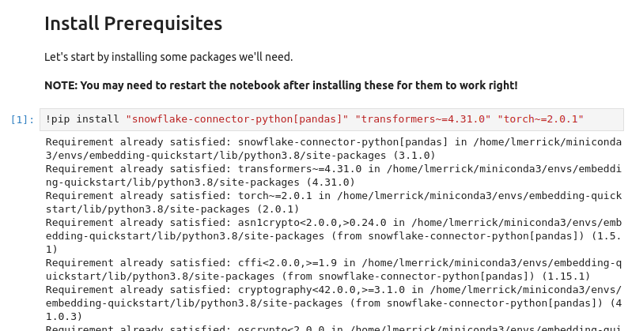
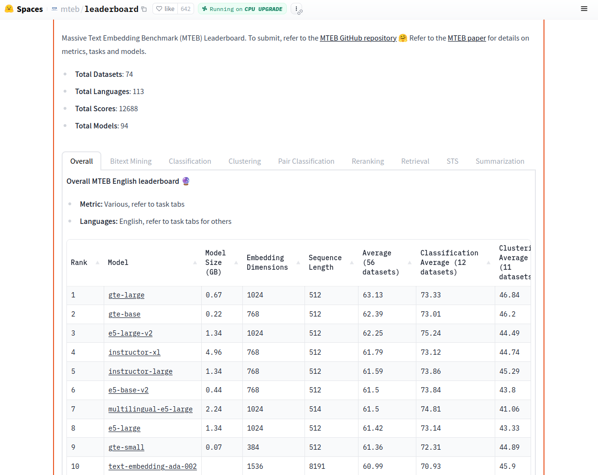
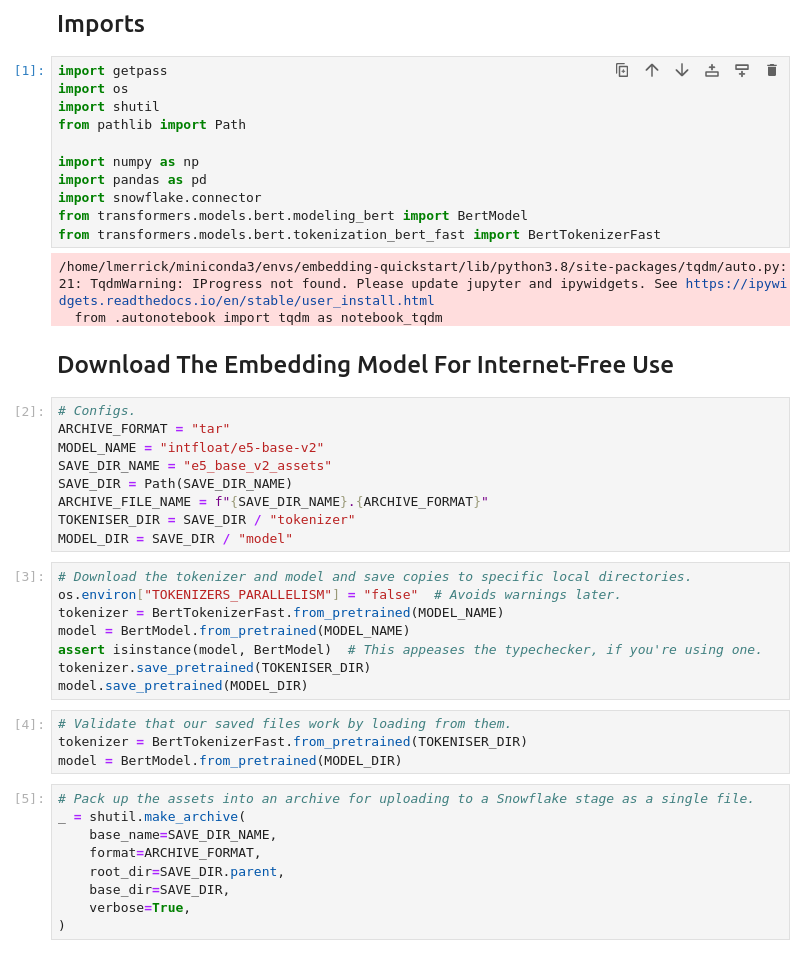
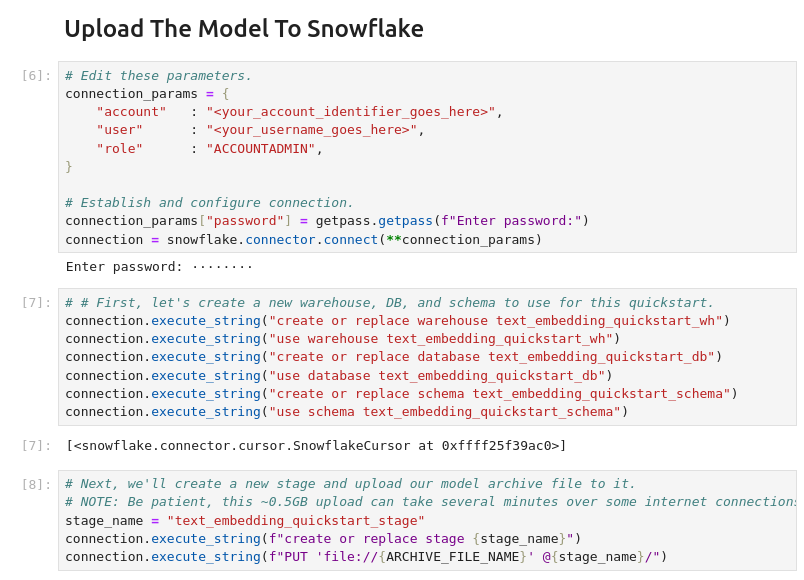
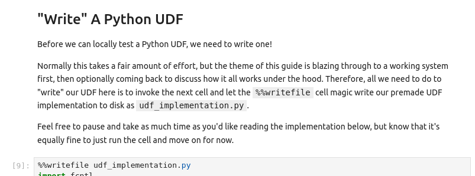
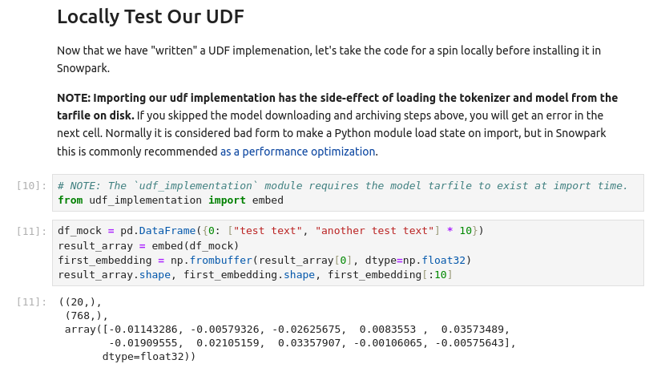
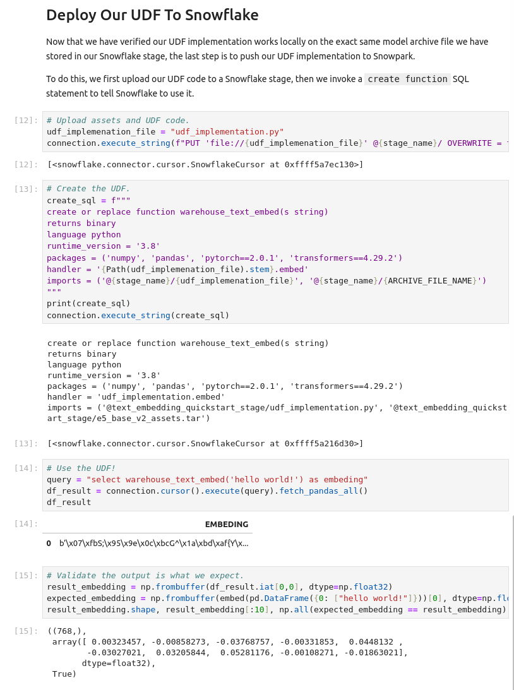
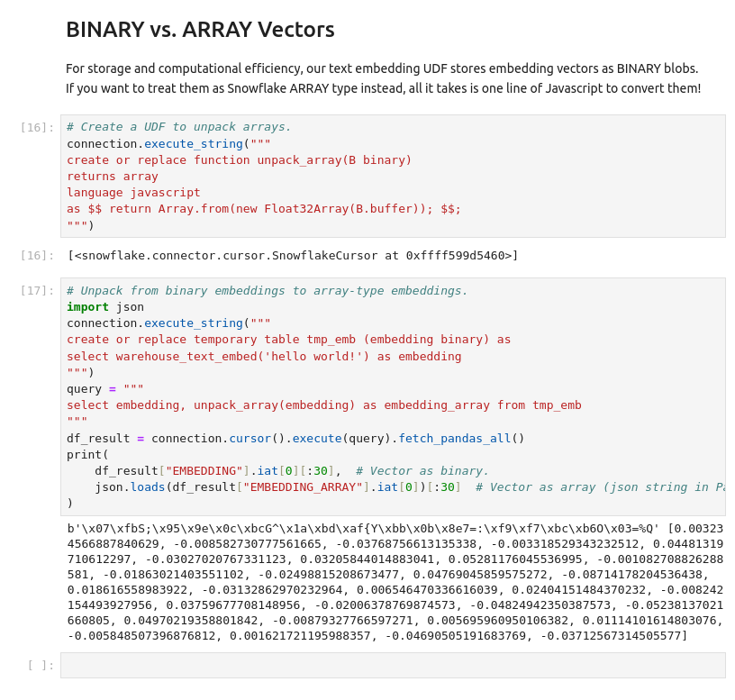

author: Luke Merrick (lukemerrick.com)
id: text_embedding_as_snowpark_python_udf
summary: Text Embedding As A Snowpark Python UDF
categories: data-science-&-ml
environments: web
status: Published
feedback link: https://github.com/Snowflake-Labs/sfguides/issues
tags: Snowpark Python, Machine Learning, Data Science, NLP 

# Text Embedding As A Snowpark Python UDF
<!-- ------------------------ -->
## Overview

Duration: 10

This first half of this guide blazes through the setup of a premade UDF so you can start playing with text embedding in Snowflake as quickly as possible!

For those who are interested in exploring a little deeper how everything works, stick around for the second half, which discusses how to make your own variant of the UDF coverd in the first half of the guide.

### Prerequisites

- Familiarity with Snowpark Python UDFs
  - The [Snowpark Developer Guide for Python](https://docs.snowflake.com/en/developer-guide/snowpark/python/index) serves as an excellent overview and reference for all things Snowpark Python
  - If you want a holistic bootcamp, consider spending an hour or two with the [Getting Started with Data Engineering and ML using Snowpark for Python Quickstart](https://quickstarts.snowflake.com/guide/getting_started_with_dataengineering_ml_using_snowpark_python/index.html#0)
- Familiarity with running Jupyter notebooks
  - Before proceeding, make sure you've got Python 3.8+ and Jupyter Lab installed in a Python environment that you feel comfortable installing more Python packages into.
- A conceptual grasp of text embedding
  - There is no need to follow ever word of technical descriptions like the [*Sentence embedding* Wikipedia article](https://en.wikipedia.org/wiki/Sentence_embedding), but you will get the most out of this guide if you are able to follow along plain-language material like [OpenAI documentation on Embeddings](https://platform.openai.com/docs/guides/embeddings)

### What You’ll Learn

You will learn how to install a premade text embedding Python UDF into your Snowflake environment, and (optionally) get some tips on creating your own text embedding UDFs.

### What You’ll Need

- A Snowflake account with [Anaconda Packages enabled by ORGADMIN](https://docs.snowflake.com/en/developer-guide/udf/python/udf-python-packages.html#using-third-party-packages-from-anaconda).
  - If you do not have a Snowflake account, or your account does not have Anaconda Packages enabled, you can register for a [free trial account](https://signup.snowflake.com/).
- A Snowflake account login with ACCOUNTADMIN role.
  - If you do not have this role in your environment, you may register for a free trial.
  - Alternatively, it is possible to
    1. Use a different role that has the ability to create database, schema, tables, stages, and user-defined functions.
    2. Use an existing database and schema in which you are able to create the aforementioned objects.
- Python 3.8+ with [Jupyter Lab](https://jupyter.org/) installed.

<!-- ------------------------ -->
## Part One: Loading A Text Embedding Model Into Snowflake

### Follow Along In Jupyter

Remember how we said you'd need a Python 3.8+ installation with Jupyter Lab installed in it? Well, now it's time to use it! Fire up Jupyter Lab, download a copy of the [notebook for this quickstart from GitHub](https://github.com/Snowflake-Labs/sfquickstarts/blob/master/site/sfguides/src/text_embedding_as_snowpark_python_udf/assets/notebook.ipynb) and pop it open.

Go ahead and start by installing the prerequisites.



### A Note About Our Embedding Model


In this guide, we will be using the [`base` size of the E5 text embedding model series (version 2)](https://huggingface.co/intfloat/e5-base-v2), which was dominating the [Massive Text Embedding Benchmark (MTEB)](https://github.com/embeddings-benchmark/mteb) leaderboard until the Alibaba DAMO Academy released the [GTE series](https://huggingface.co/thenlper/gte-large) in late July 2023. Although GTE slightly edges out E5 on the leaderboard, we see in the August 04, 2023 screenshot below above that both series of models compete favorably with OpenAI's proprietary Ada 002 model and can be considered state-of-the-art text embedding systems.




### Uploading Model Weights To Snowflake.

For security reasons, Snowpark Python UDFs are not generally permitted to access the internet. This means that even if you want to use a [publicly-available text embedding model from Huggingface](https://huggingface.co/models?pipeline_tag=sentence-similarity&sort=trending), you will need to store a copy of your model weights in a Snowflake stage.

#### Downloading The Model Weights From Huggingface

Go ahead and download the E5-base-v2 model from Hugginface and save it to a tarfile on disk by running the first few cells of the notebook.



#### Uploading The Model Weights

Now that we have the weights downloaded, we can upload them to a Snowflake stage via the Python connector. The next block of cells in the notebook establishes a connection to Snowflake, sets up a new warehouse, database, schema, and stage for this quickstart, and uploads the model weights to our new stage. Go ahead and run those cells now -- and maybe take a coffee break, too, becuse the upload can take several minutes unless your internet connection is particularly snappy.



### Implementing A UDF To Run The Model

In the second half of this quickstart we'll revisit how to implement your own UDF for running a text embedding model as a Snowpark Python UDF, but for now let's just use the premade UDF baked into the notebook. Simply run the cell with the `%%writefile` magic to write the UDF implementation to disk.



To make sure this UDF implementation runs as expected, go ahead and execute the next block of cells.




### Install The UDF And Run Text Embedding Via SQL!

We're almost ready to run text embedding directly on Snowflake warehouse compute. All that's left is to upload our UDF implementation file and define the UDF via a `create function` SQL query. Run the last couple cells to make this happen!




### A Note On Storing Vectors As BINARY Vs. ARRAY

For storage and computational efficiency, our text embedding UDF stores embedding vectors as BINARY blobs constructed by concatenating all of the 32-bit floating point numbers in the vector together in order. While this is how numerical computing libraries like Numpy and Pytorch "see" vectors, sometimes it may be useful to take a more JSON-like perspective and treat your embedding vectors as a Snowflake ARRAY.

To accomplish this, we could modify our UDF to make it always return an ARRAY, but for greater flexibility we can instead add a new Snowpark UDF to enable a conversion from our BINARY form to ARRAY form. In fact, all it takes is one line of Python to make this possible!


Feel free to give it a shot by running the last couple cells of the notebook.




<!-- ------------------------ -->
## Interlude: A Reminder To Clean Up
Duration: 1

If you don't plan to use the warehouse, database, schema, stage, or UDFs we've defined in this Quickstart, now might be a good time to do some deletion. Below are the SQL commands to wipe out everything we've built so far.

> aside positive
> 
>  If you're excited to do part two, it might be handy to hold off on deleting our files and instead come back to this interlude section later when you're sure you don't want any of the files/UDFs/etc.

```sql
drop database text_embedding_quickstart_db;
drop warehouse text_embedding_quickstart_wh;
```


<!-- ------------------------ -->
## Part Two: Tips For Building Your Own Text Embedding UDF
Duration: 0

I promised that after rushing to get something up and running in part one, I would come back with a part two to help you craft your own text embedding UDFs. While the source code example from part one is probably the most useful reference I can provide, I'll use this section to explain some "tricks of the trade" from the implementation.
### Saving Yourself From Unprotected File Access In A Parallel Universe

Apologies for the pun, but in a Snowflake warehouse, your Python Snowflake UDF lives in a *parallel universe*. At any moment during a query, the warehouse may be invoking multiple copies of your UDF on the same machine, and as a result, we need to make sure to avoid concurrency-related bugs like unprotected file access.

This is not actually as hard as it might sound. The official [developer guide offers a great example](https://docs.snowflake.com/en/developer-guide/udf/python/udf-python-examples#unzipping-a-staged-file) of using file-based locking to ensure that even if two or more copies of your code are running at the same time, only one messes with your files at a time. In our UDF example, this translates to these lines:

``` python
class FileLock:
    def __enter__(self):
        self._lock = threading.Lock()
        self._lock.acquire()
        self._fd = open("/tmp/lockfile.LOCK", "w+")
        fcntl.lockf(self._fd, fcntl.LOCK_EX)

    def __exit__(self, type, value, traceback):
        self._fd.close()
        self._lock.release()


def _load_assets(archive_path: Path) -> Tuple[BertTokenizerFast, BertModel]:
    # Config.
    tmp = Path("/tmp")
    extracted_dir = tmp / SAVE_DIR_NAME
    tokenizer_dir = extracted_dir / "tokenizer"
    model_dir = extracted_dir / "model"

    # Extract and load, with a lock placed for concurrency sanity.
    with FileLock():
        assert archive_path.exists(), f"{archive_path} not found!"
        shutil.unpack_archive(archive_path, tmp)
        assert tokenizer_dir.exists(), "failed to extract tokenizer dir"
        assert model_dir.exists(), "failed to extract model dir"
        tokenizer = BertTokenizerFast.from_pretrained(
            tokenizer_dir, local_files_only=True
        )
        model = BertModel.from_pretrained(model_dir, local_files_only=True)
    assert isinstance(model, BertModel)  # Appease typechecker.
    return tokenizer, model
```

### Using Conservative Batch Sizes To Avoid Memory Problems And Timeouts

When you want to run a Python function on your laptop, you can generally run just one copy of the function at a time with no timeout. In Snowpark, on the other hand, the official developer guide [recommends writing single-threaded UDF handlers](https://docs.snowflake.com/en/developer-guide/udf/python/udf-python-designing#write-single-threaded-udf-handlers), since the warehouse handles query parallelization for you. Additionally, (at least at the time of writing) vectorized Python UDFs have a [180-second timeout per invocation](https://docs.snowflake.com/en/developer-guide/udf/python/udf-python-batch#setting-a-target-batch-size). While these aspects of Snowpark's design make life better for a lot of queries (faster execution and limited hanging), they can cause some unexpected problems as well.

Recall that the PyTorch library powering our text embedding UDF is optimized to use all available CPU cores, regardless of how many copies of it are being run at the same time. While this should accelerate execution, it is also a violation of the single-threaded handler recommendation I mentioned earlier, and in parallelized query execution this can potentially trigger CPU contention, slowing down individual UDF handler invocations and risking timeout issues that you woudln't otherwise expect.

Remember, too, that our UDF handler includes code to load a sizeable chunk of model weights from disk to memory, so automatic query parallelization can potentially lead to more memory pressure than expected if it involves multiple copies of the model being loaded into memory concurrently. If you do hit memory issues, a [Snowpark optimized warehouse](https://docs.snowflake.com/en/user-guide/warehouses-snowpark-optimized) may offer a quick fix, but we can also do our part in our handler implementation to conserve RAM by keeping batches small.

Okay, that's a lot of information on *why* we should limit batch size to avoid timeouts and minimize memory impact. Let's now talk about *how* to implement these limits.

To start, it's a good idea to limit how many input can be put into a single batch of UDF inputs. For example, a batch size of 32 will give the UDF over five seconds on average to embed each input before hitting the 180 second timeout.

To do this, we can simply set the `_sf_max_batch_size` attribute of our handler function.

``` python
embed._sf_max_batch_size = 32  # type: ignore
```

> aside positive
>
> If you have a really slow model and want to limit to batch size of one, you could also switch out to a non-vectorized UDF.

We may also want to separately limit how many inputs from that batch are actually pushed through the model at a time. Doing so won't help us avoid timeouts any better, but it should reduce our memory usage, since the internal neural network activation values produced by running text embedding models tend to be far larger than the input strings themselves. We can accomplish this internal limitation by implimenting minibatching within the UDF itself.

Here is the internal minibatching implementation from my UDF implementation.

``` python
    # Do internal batching according to the `batch_size` constant.
    input_iter = iter(inputs)
    batched_iter = iter(lambda: list(itertools.islice(input_iter, MAX_BATCH_SIZE)), [])

    # Run the embedding.
    # Note: We're byte-packing our float32 embedding vectors into binary scalars
    # so that we have a scalar output compatible with Snowflake BINARY type.
    i = 0
    result = np.ndarray(shape=len(inputs), dtype=EMBEDDING_AS_BYTES_DTYPE)
    for batch in batched_iter:
        n_in_batch = len(batch)
        embedding_matrix = _embed_batch(tokenizer=tokenizer, model=model, texts=batch)
        result[i : i + n_in_batch] = _byte_pack_embedding_matrix_rows(embedding_matrix)
        i = i + n_in_batch

    return result
```

### Over To You!

With the above pointers and the original code as a starting point, you are now well equipped to try implementing your own text embedding UDF! Consider trying to package up a different model like the brand-new and leaderboard-topping [GTE-large](https://huggingface.co/thenlper/gte-large). Or maybe even experiment with a homegrown model, a different UDF implementation, or something else. Whatever you choose, I wish you the best of luck!

<!-- ------------------------ -->
## Conclusion
Duration: 1

Congratulations, you've made it all the way through! I hope this guide has helped kickstart your journey to securely applying text embedding on your data without anything having to leave the warehouse.
