author: Bill Back (billdback-ts)
id: thoughtspot-agents
language: en
summary: An introduction to using ThoughtSpot agents to go from Snowflake data to an embedded agentic application.
categories: snowflake-site:taxonomy/solution-center/certification/quickstart
environments: web
status: Published
feedback link: https://github.com/Snowflake-Labs/sfguides/issues
fork repo link: [ThoughtSpot Agents](https://github.com/billdback-ts/sfquickstarts)

# Using ThoughtSpot Agents with Snowflake

<!-- ------------------------ -->

## Overview

<!-- ------------------------ -->

This guide shows you how to use ThoughtSpot agents to create a semantic model, generate analytics liveboards, perform agentic BI, and create custom applications with embedded ThoughtSpot.

This guide was developed using ThoughtSpot v26.6, so you may see variations with other versions.

### Prerequisites

- While familiarity with ThoughtSpot and software development is helpful, it's not required.

### What You'll Learn

- How to use SpotterModel to create semantic models.
- How to use SpotterViz to create powerful analytics dashboards.
- How to use Spotter to perform advanced analytics via a smart chat interface.
- How to use SpotterCode to quickly and easily embed ThoughtSpot into an application.

### What You'll Need

- A ThoughtSpot account with developer access. You can use a [trial account](https://www.thoughtspot.com/trial)
- A Snowflake account and credentials if you want to do this QuickStart with your own data. If not, you can use sample data, but won't be able to do the exercise for SpotterModel.
- An IDE or development environment that supports MCP servers, such as Cursor, VS Code, or Claude Code.

### What You'll Build

- A semantic model against your own data in Snowflake.
- A ThoughtSpot liveboard on a particular topic.
- Use Spotter to perform analytics.
- An embedded application that uses the ThoughtSpot APIs and Embedded SDK.

<!-- ------------------------ -->

## Setup

Before beginning you'll need a ThoughtSpot account with developer access. You may also need administrator access if security settings are needed. If you aren't currently a ThoughtSpot customer, you can create a [trial account](https://thoughtspot.com/trial). This will allow you to be both an administrator and developer.

Enable SpotterModel and SpotterViz if they aren't already enabled.

For the coding exercise using SpotterCode, you'll want an IDE or CLI with SpotterCode enabled. See the [instructions](https://developers.thoughtspot.com/docs/SpotterCode) for configuring SpotterCode with common IDEs, such as VS Code and Claude Code.

You should also clone the [starter code](https://github.com/thoughtspot/ts-snowflake-summit-2026) from GitHub. You can optionally fork the repository, but it's not required.

## SpotterModel

[SpotterModel](https://www.thoughtspot.com/product/agents/spottermodel) is ThoughtSpot's agent for creating governed semantic models for analysis. It lets you go from a data connection in Snowflake to a model ready for users and agents to analyze your data.


### Create a connection to Snowflake

Before using SpotterModel, you need to create a connection to Snowflake. See the [ThoughtSpot documentation](https://docs.thoughtspot.com/cloud/latest/connections-snowflake) for details. Create the connection and select the tables you want to use for analytics. The following image shows a Banking connection with tables for savings, credit cards, and checking, along with customer and account information.

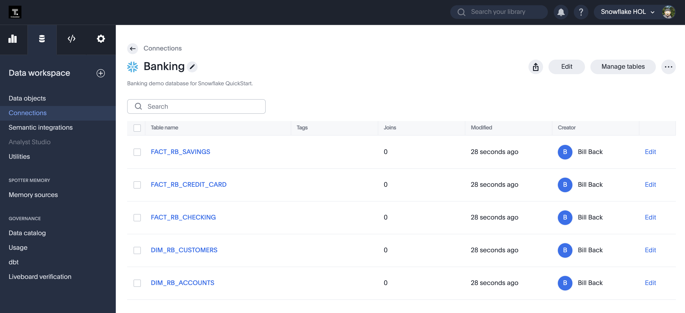

### Create a model with SpotterModel

#### Create an empty model with your connection

Now that you have your connection, create a new model. From the Data Workspace, select the (+) and then select `Model`.

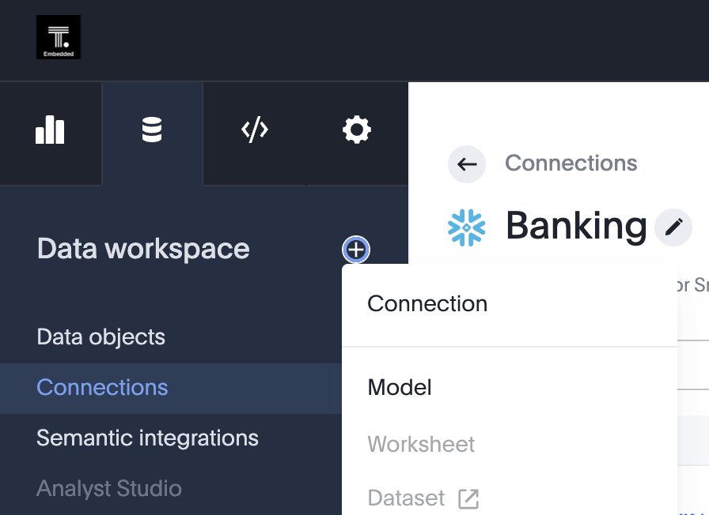

Select Build `your own model` from the options and click `Next`.

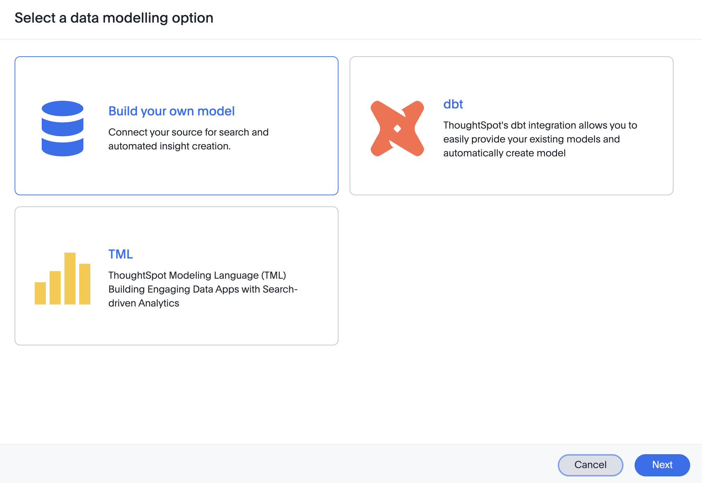

Now select the connection you created and want to use.

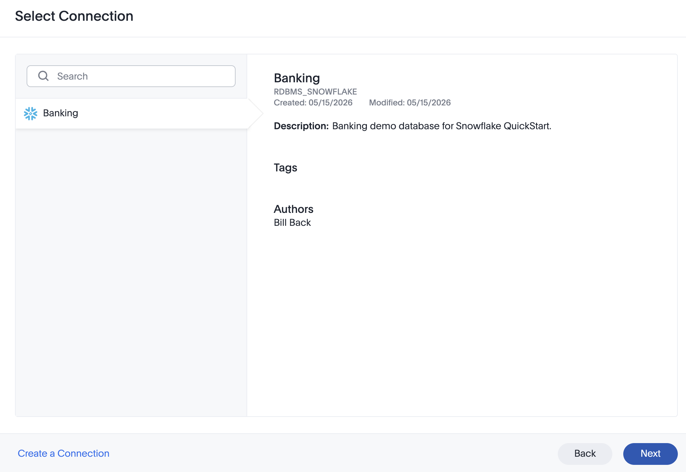

You should now see the data model editor similar to the one below.

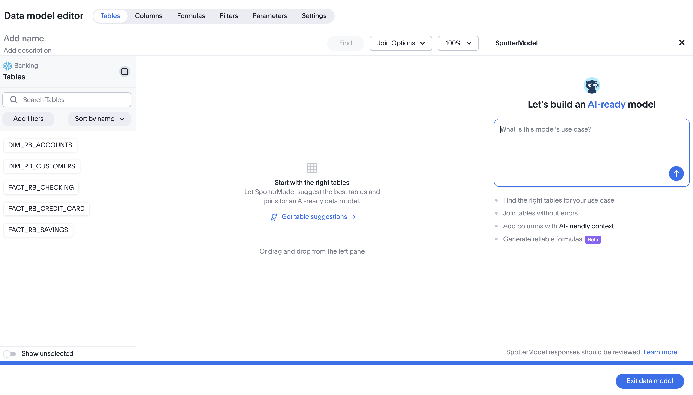

#### Use SpotterModel to create the model

SpotterModel lets you create a model using only prompts. In the text box on the left, enter a description of the model's use case. The more detail you provide, the better. At minimum, describe the users, the types of data you want, and ideally a few example questions. For example, the banking model uses this prompt:

```
I'm a banking analyst for a bank and want to do analysis of our customers to understand them and identify additional products and services.  For example, I want to be able to ask about customer with total balances in savings, credit cards, and checking to segment users for potential account upgrades.
```

SpotterModel will show its progress as it works. When prompted, select the fact tables you want to use. Then click the `Find Supporting Tables` button to find dimension tables. Select the tables you want. You can also drag a table to the canvas or explicitly tell SpotterModel to add it.

After you have all the tables you want, select `Find Joins` to add joins between them. Select the joins you want to add. You can also add joins manually, changing the direction and cardinality. The following image shows the banking model.

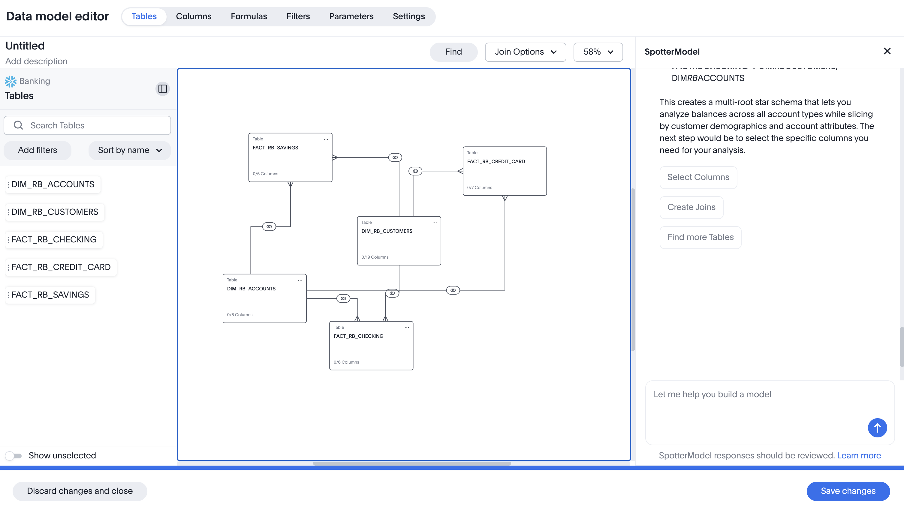

Now that you have the fact and dimension tables, click the `Find Columns` button. SpotterModel selects attributes and measures based on your initial description — which is why a detailed description matters. Once SpotterModel shows the columns, select the ones you want and click `Add to canvas`.

By default, column names and descriptions aren't very helpful. You can edit them manually, but that means clicking each cell and typing in a value. Instead, let SpotterModel do the work. At minimum, rename the columns, add better descriptions, and add synonyms (alternative search terms). Enter the following prompt:

```
Change the column names and descriptions to be more helpful for users when searching.  Also add synonyms to the columns so users can use similar terms.
```

You should see updated names, descriptions, and synonyms.

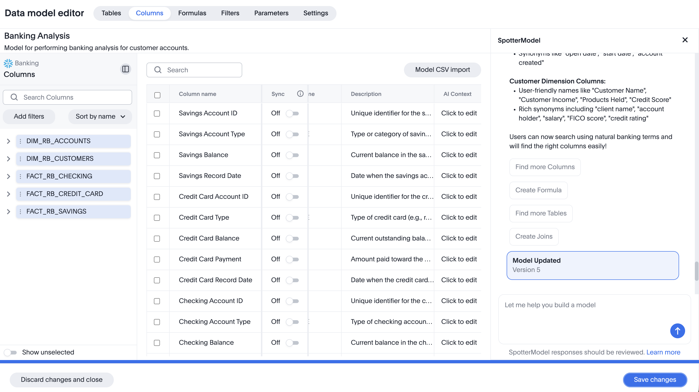

As you make changes, you'll see a `Model Updated` notice after each update. SpotterModel lets you undo changes if you don't like the results.

Save the model now that you have a working version. Give it a descriptive name and description so users and agents know what it's useful for.

SpotterModel can do much more than this. For example, currency values in the model show as plain numbers by default. Use the following prompt to format them as currency:

`Set the columns that contain currency values to USD. These are columns with names like Balance, Payment, etc.`

You can also create formulas and parameters, etc. Feel free to experiment.

Save the changes and exit the data model. By default, the model isn't enabled for Spotter. To enable it, select the ... menu in the upper right corner and click `Enable Spotter`.

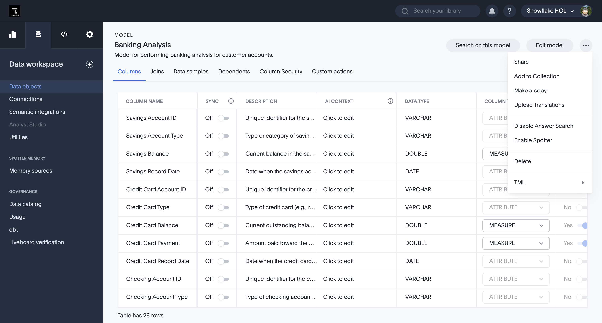

You'll see options to enhance the model. At minimum, select `Enable indexing` and choose columns to index. This lets Spotter and search recommend values to improve results. The other options improve data cleanliness but aren't required.

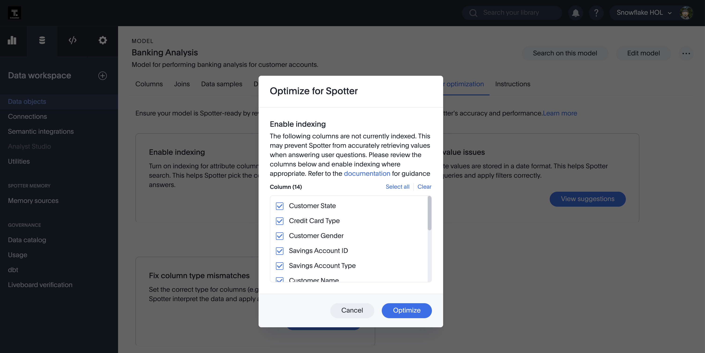

Now that we have a Spotter-enabled model we can create some content with SpotterViz and Spotter.

## SpotterViz

[SpotterViz](https://www.thoughtspot.com/product/agents/spotterviz) takes you from business questions to a fully styled dashboard, ready to share and use for repeat analysis.

From the Insights tab, select the (+) button and the Create Liveboard option to create a new Liveboard.

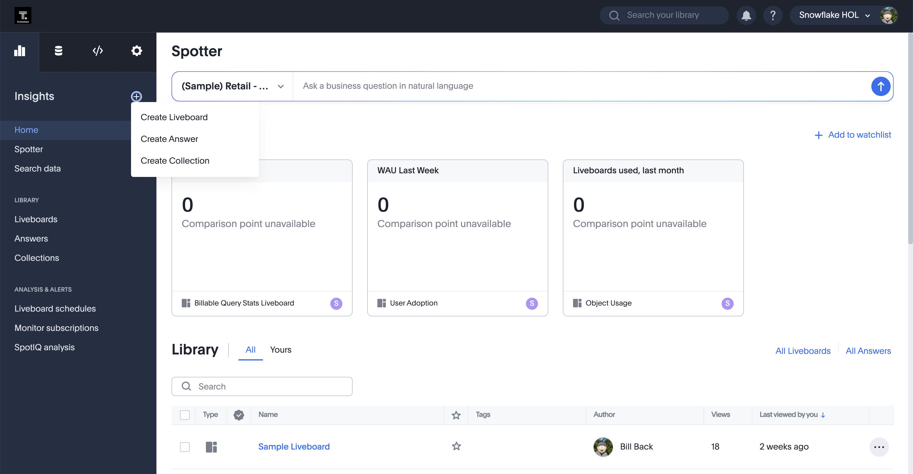

Give the liveboard a meaningful name and description so others know what it does. You can optionally make it discoverable, which means others can find it in search. You can leave this box checked.

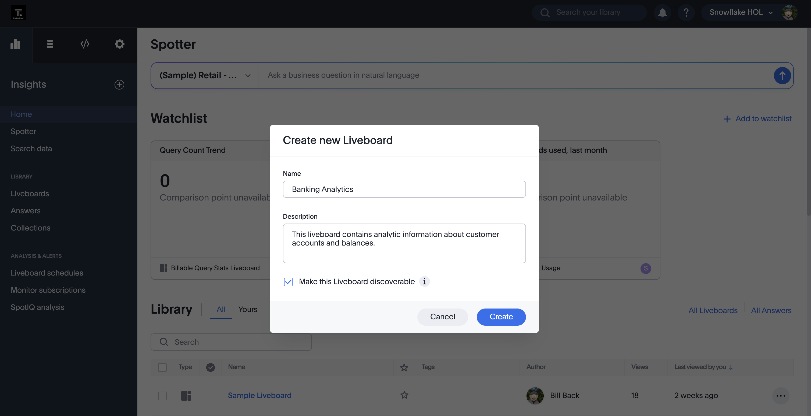

You will get a new, empty liveboard in edit mode with SpotterViz open and ready to help.

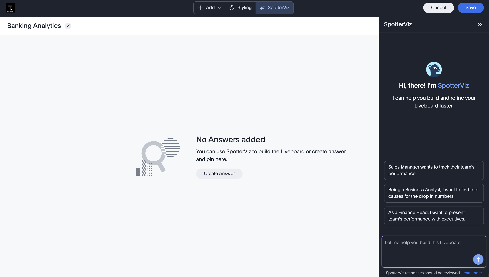

In the prompt for SpotterViz, give a detailed description of what you want to create. You can instruct it to create notes, charts, tabs, and styles — all in one step or across multiple steps. You can tweak the results at any time. Use a prompt like the following, adapted for your data.

```
I want to create a liveboard that let's me analyze banking data about customer accounts.  I want to do analysis based on customer metrics and account metrics.  Include all types of accounts and balances.  I want to separate out the customers and accounts into different tabs.  Add filters for any geographic regions and customer genders.  For each tab add a note to describe the tab.  I want to use best practices for liveboards, so include useful KPIs at the top and then more detailed charts going down the page.  Group related content together.

I want to set a nice style using darker blues.
```

Wait and watch SpotterViz work. It will first recommend a data source — this is why a good name and description matter. Confirm the model, then let SpotterViz create the content. You'll see messages as it creates tabs, visualizations, and more.

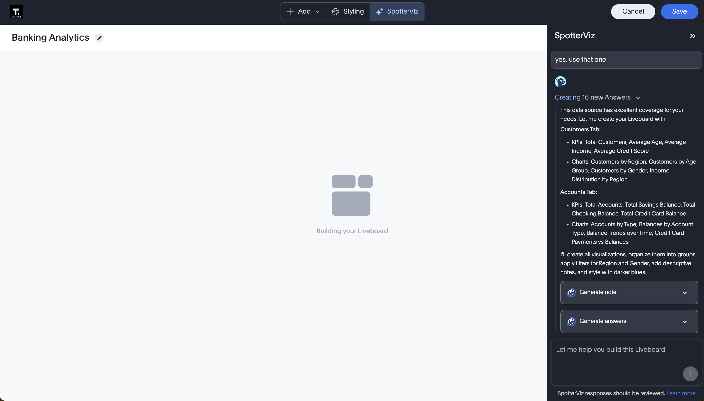

If you get any errors you can tell SpotterViz to try again.

This entire process can take a few minutes, but you should eventually get a liveboard. Save the liveboard. You can always go back in and edit the liveboard further using SpotterViz or manually edit content.

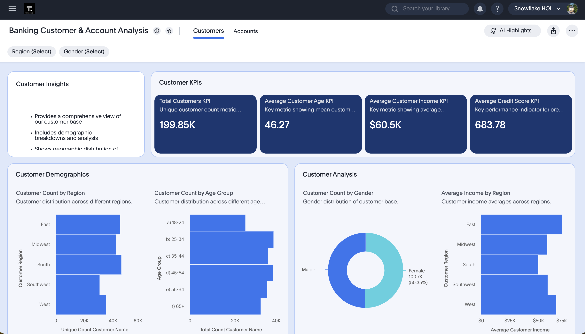

Now that we have some static content, let's use Spotter to analyze the data interactively.

## Spotter

[Spotter](http://thoughtspot.com/product/agents/spotter) is an AI analyst for all users. Users can ask questions about their data — including "why" questions — and get detailed answers and analysis. Spotter also connects to other data sources and systems for mashups and can push results to applications like Salesforce and Slack.

From the Insights tab, select `Spotter`. Then select the data source by clicking the button with the data source name. Spotter also has an Auto Mode that picks the appropriate model based on your question. For this exercise, select the model you created earlier. You should see an empty Spotter interface with the model selected, as shown below. The model in this example is the Banking Analysis model.

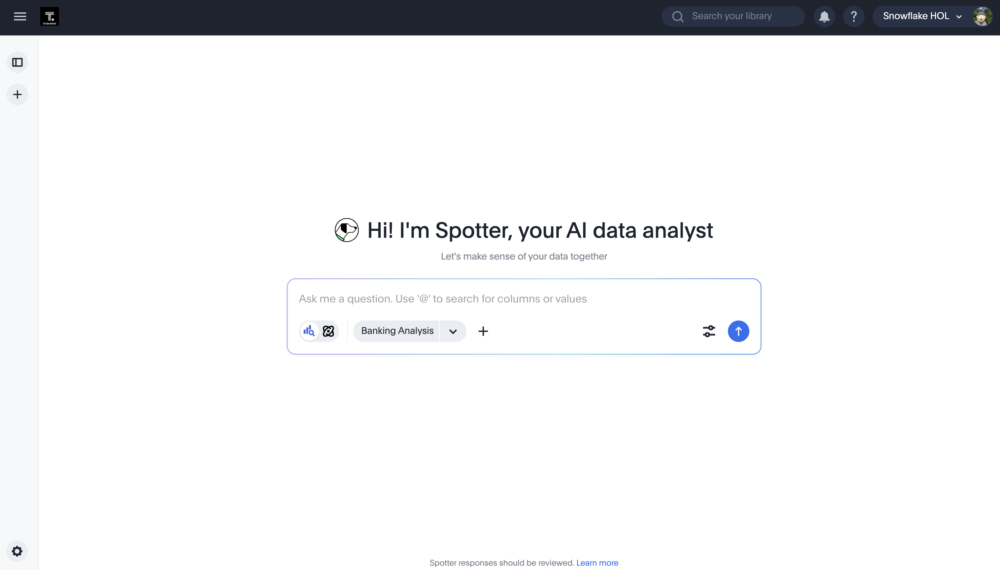

If you're not familiar with the data set, ask Spotter to describe it. Enter the following prompt and let Spotter respond:

```
Tell me about this data source and the types of analysis I can do and the questions I can ask.
```

After Spotter reviews the data set, it will describe the different data sources, metrics, dimensions, types of analysis, and example questions.

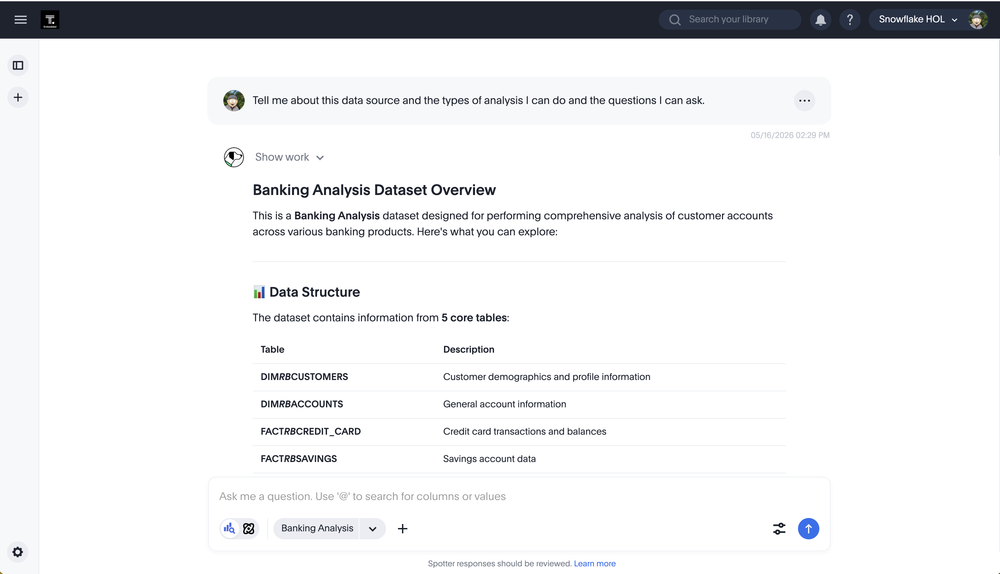

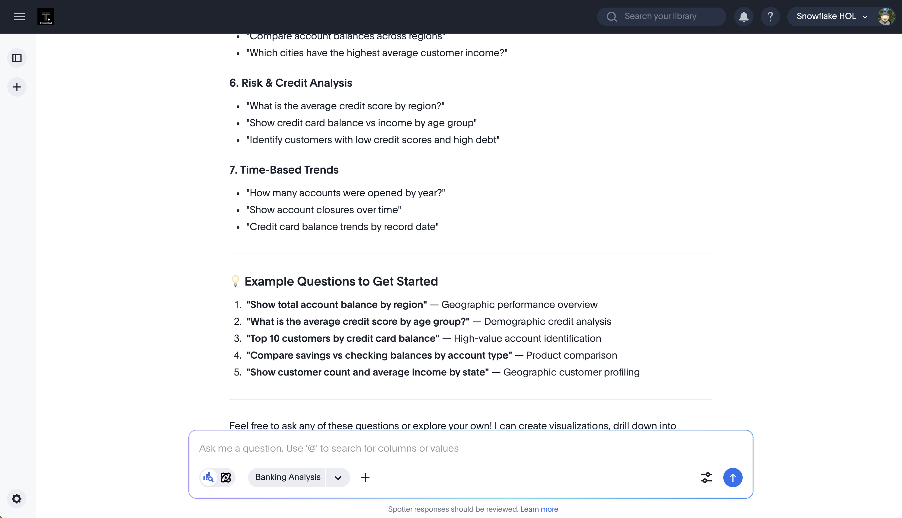

Now ask a question. The example below uses credit scores by age group and state. Ask something appropriate for your data.

`Show me the average credit scores by age group and state.`

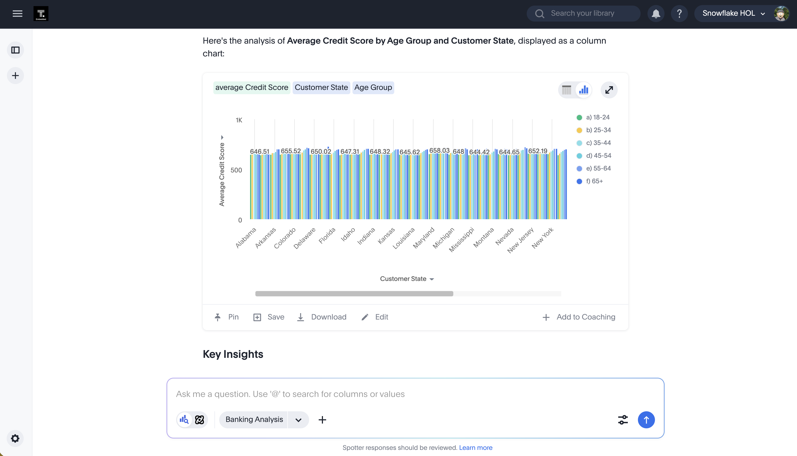

The result is interesting, but the full data set is hard to read. You can interact directly with the visualization to drill down and filter. Let's refine the question to focus on western states and adults 55 and older.

`Filter the data by the states in the west region and limit to customers 55 years old and older.`

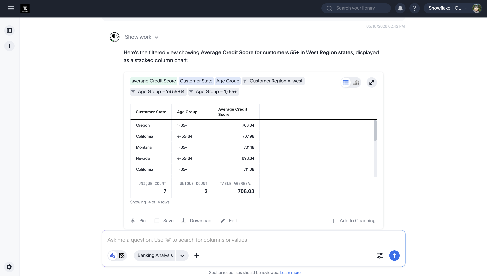

Review the insights returned by Spotter.

Spotter also lets you work with external data sources and send results to applications like Slack or Teams. Click the manage connections icon in the bottom right (next to the arrow button) and verify that Web Search is enabled. Enable it if it's not.

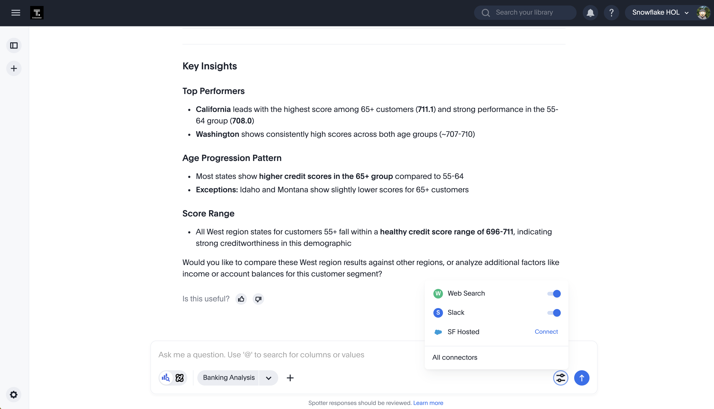

In this case, let's find out what the average retirement balance is for the states we just filtered by using the web connection.

`Compare the credit scores for the filtered data with a web search of the average retirement income for the customer groups and identify opportunities to provide products.`

You'll likely need to allow Spotter to search the web — this is a security confirmation for external connectors. You should get a response that combines the web search with your filtered data.

Depending on what Spotter finds and your data you should get analysis and recommendations.

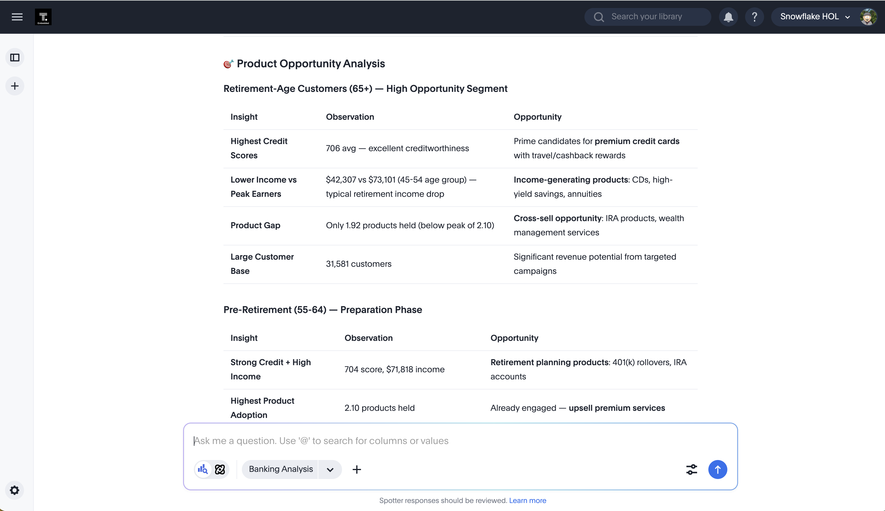

Now that we have a working model, a liveboard, and Spotter, we'll embed them all into our own web application using SpotterCode.

## SpotterCode

[SpotterCode](https://www.thoughtspot.com/product/agents/spottercode) lets you add ThoughtSpot to your own applications using chat prompts. SpotterCode knows the SDKs, APIs, and developer examples, making it easy to generate correct embed code quickly.

In this section, you'll build an application using SpotterCode. You need to have completed the following:

- Downloaded the starter code from GitHub: `git clone https://github.com/thoughtspot/ts-snowflake-summit-2026`. You can also just use your own application if you want.
- A code editor with SpotterCode configured. See the [documentation](https://developers.thoughtspot.com/docs/SpotterCode) on how to configure it with various IDEs. All examples in this guide use VS Code with Claude Code.

You will also need a browser with third-party cookies allowed. These examples use Chrome.

After downloading (and unzipping if needed), go into the directory and run:

$ `npm install`
$ `npm run dev`

The app will start and display its URL.

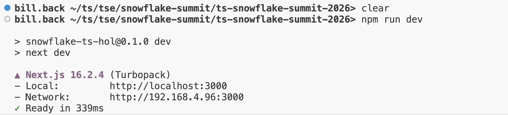

If you navigate to the page, you should see something like the following:

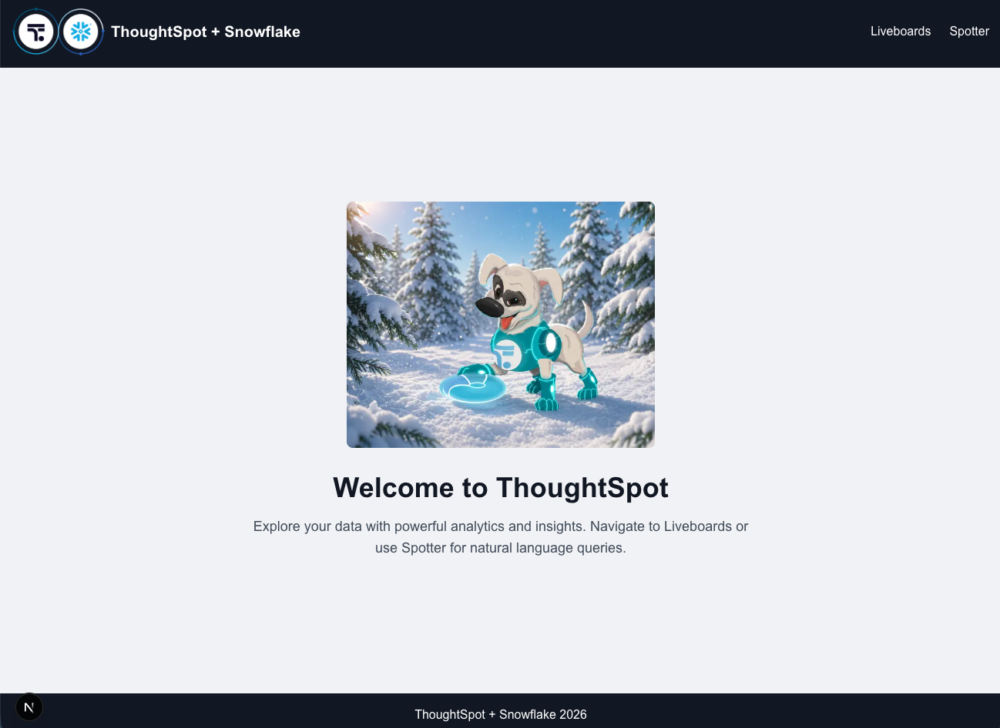

We're going to build this app in four steps:

1. Initialize the ThoughtSpot SDK to communicate with ThoughtSpot.
2. Do an API call for liveboards and allow users to select one they can embed.
3. Embed Spotter.
4. Set custom styles for the embedded content.

### Initialize the SDK

The ThoughtSpot Visual Embed SDK provides all the classes and components you need to embed ThoughtSpot. Enter the following prompt, replacing the URL with your ThoughtSpot URL:

```
I want to embed ThoughtSpot into this application.  I'm going to connect to https://<your-ts>.thoughtspot.cloud/ and use no authentication (i.e. pick it up via cookies). Set up the initialization so it will happen before any embedding.
```

This prompt does two things. First, it tells SpotterCode which ThoughtSpot URL to connect to. Second, it disables authentication. While ThoughtSpot supports SSO via SAML and OIDC as well as token-based auth, you can skip that setup for this exercise. If you aren't already logged in, you'll see a login screen the first time you access ThoughtSpot content.

The prompt also tells SpotterCode to initialize the SDK before any embedded content loads. You can add details about coding standards or structure you want to enforce.

As the agent runs, it may prompt for permissions. Accept them to allow changes. You should see it install the Visual Embed SDK via npm, review the code, and add or modify files. For example, it may create a `ThoughtSpotProvider` that calls `init` and wrap the children in the `layout.tsx` file to ensure `init` runs before any content loads.

Refresh the page to verify there are no issues. If you see an error about a `Mixpanel` token, you can safely ignore it.

### Embed liveboards

Now that we've initialized the SDK, we can start embedding content. Let's start with liveboards. Run the following prompt:

```
When the user selects the liveboards option, I want to go to the liveboards page and see the liveboards I have available as cards with the title and description.  Use the metadata search API for the list. Then, when I click on a liveboard, I want to go to the specific liveboard (use slugs for bookmarking). Disable the ability to download or view TML. And I want to make sure I have two-column layout enabled as well as the masterpieces mode. Make sure the liveboard takes all the available space between the header and footer.
```

This prompt asks for the liveboards page to show tiles for all available liveboards so the user can click one to view it. It includes styling instructions to make the liveboard fill the available space and disables TML access, which removes those items from the liveboard menu. The SDK lets you control not just what content appears but also what actions users can take.

This step can take several minutes as the coding agent and SpotterCode work out the structure, API call, and embed logic. You should see new folders for liveboard navigation and updates to the liveboard page. When complete, click the `Liveboards` link in the header. Your liveboards will vary from the example below.

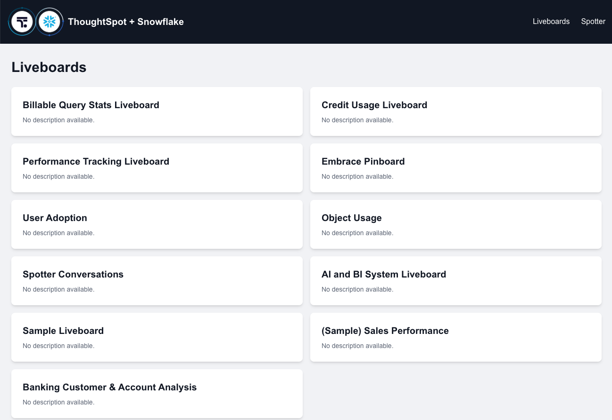

If you click on the liveboard you created earlier, you should see it show up in the UI.

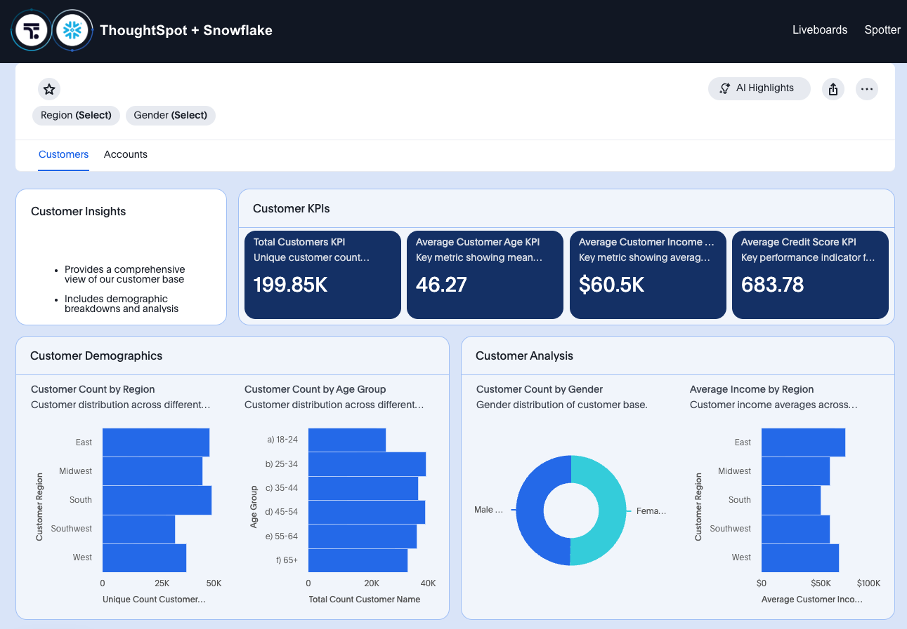

Now let's embed Spotter.

### Embed Spotter

The Spotter embed is simpler — you just embed Spotter with no additional navigation. Enter a prompt like the following:

```
When the user selects Spotter, I want to go to the embedded Spotter.  Use auto mode for the model selection.
```

Auto mode means Spotter chooses the model based on the user's question.

After the agent finishes, click the `Spotter` link in the UI. You should see Spotter embedded with Auto mode. If you ask a question relevant to your data, Spotter will find the right model automatically. If you have multiple similar models, Spotter may ask you to choose one.

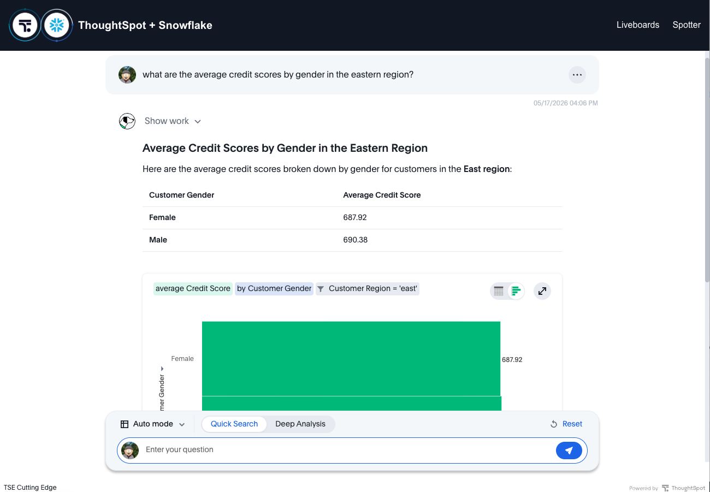

Now that we have all the content, let's add a custom style.

### Set custom styles

ThoughtSpot lets you add custom styling to embedded content to match your application's look. You can change fonts, button shape, color, and text, and even swap out icons. Changing icons requires a specific format — see the documentation for details.

Go back to your embedded liveboard to see what it looks like. Then enter the following prompt (changing colors if desired):

```
I want to use a light theme using blues for all of my embedded ThoughtSpot content including a dark blue for the buttons. Make the buttons square.  Also rename "AI Highlights" to be "Agent Analysis".
```

After the agent finishes, navigate back to the liveboard to see the updates. You should see changes in the liveboard's appearance.

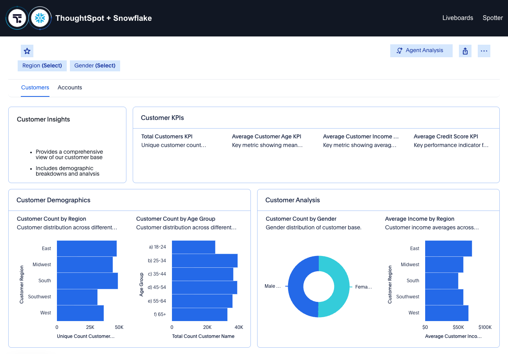

You can experiment with the styles or use the Theme Builder shown in the Developer tab of the UI to modify the styles further.

<!-- ------------------------ -->

### What You Learned

At this point you should have successfully learned the following:

- How to create a model using SpotterModel
- How to create a liveboard using SpotterViz
- How to do analytics using Spotter
- How to embed ThoughtSpot into an application using SpotterCode

### Related Resources

- Find out more about the ThoughtSpot Platform: https://docs.thoughtspot.com/cloud/latest
- Learn how to use ThoughtSpot Embedded's developer tools, APIs, and SDKs: https://developers.thoughtspot.com/docs/
- Sign up for free ThoughtSpot Embedded training: https://training.thoughtspot.com/path/thoughtspot-embedded
