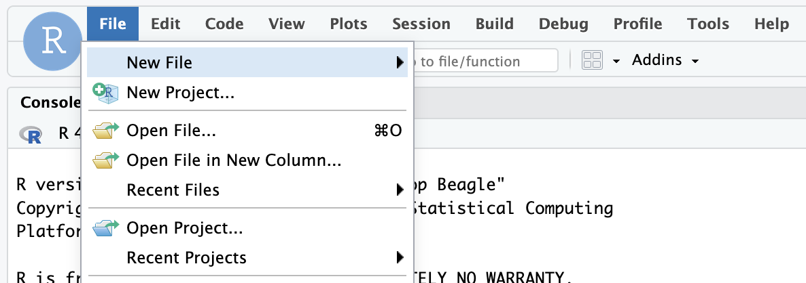
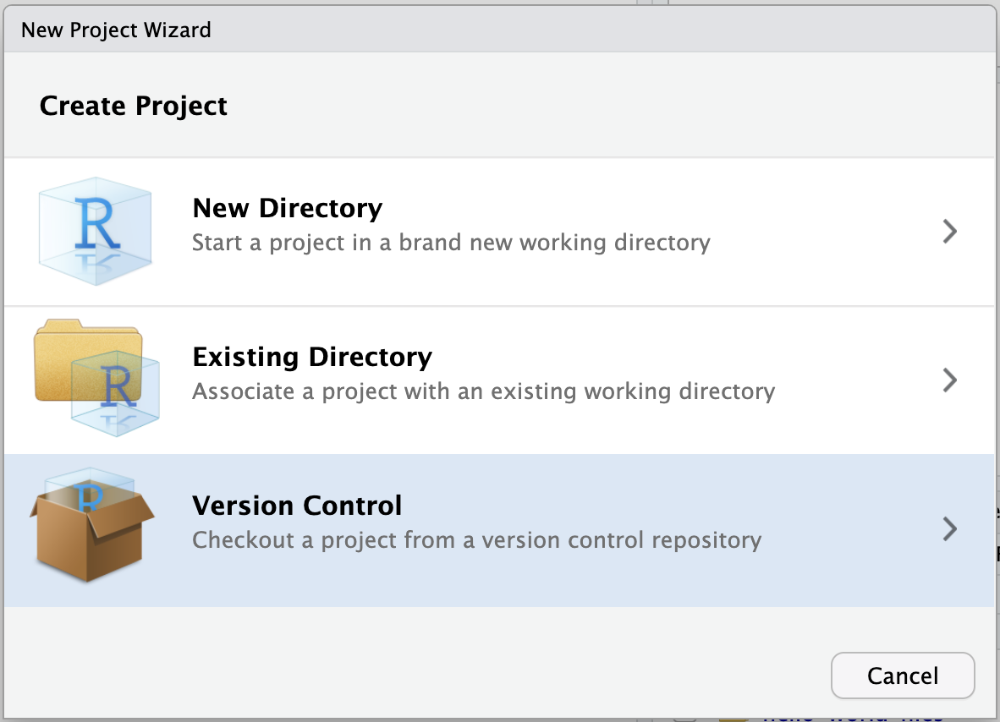
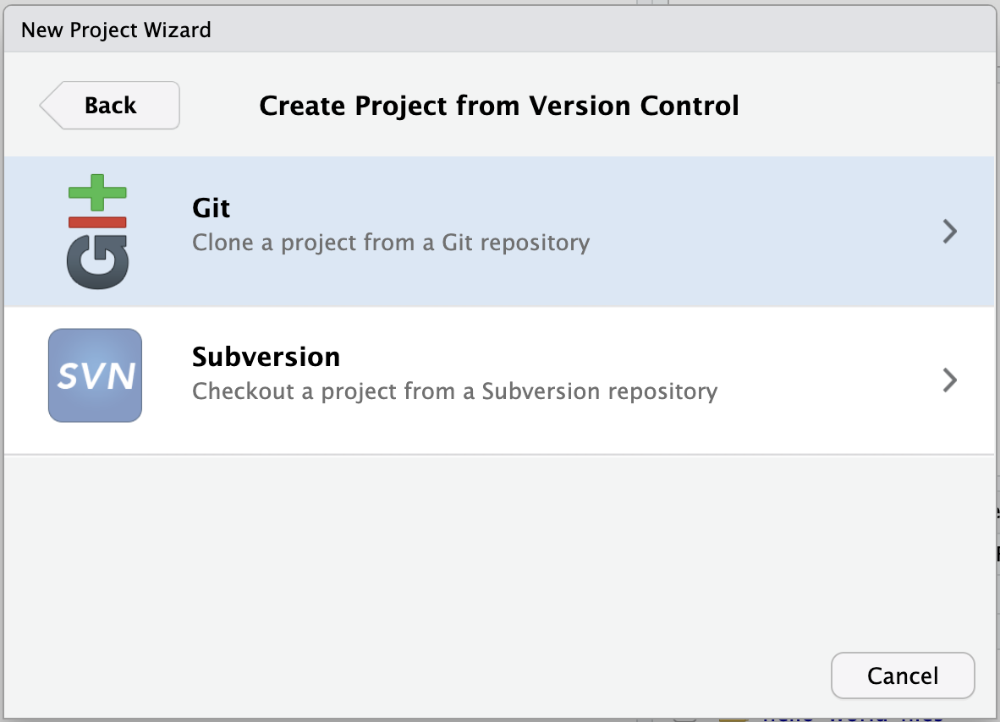

author: Sara Altman
id: tidymodel-prediction-workflows-inside-snowflake-with-orbital
categories: snowflake-site:taxonomy/solution-center/certification/quickstart, snowflake-site:taxonomy/product/analytics
language: en
summary: Tidymodel Prediction Workflows Inside Snowflake with Orbital 
environments: web
status: Published
feedback link: https://github.com/Snowflake-Labs/sfguides/issues

#  Tidymodel Prediction Workflows Inside Snowflake with Orbital

## Overview

This Quickstart will demonstrate how to run model predictions inside Snowflake
using the [orbital R package](https://orbital.tidymodels.org/) and the [Snowflake Native Posit Workbench App](https://app.snowflake.com/marketplace/listing/GZTSZMCB69/posit-pbc-posit-workbench?search=posit+pbc).

With the orbital package, you can:

1. Speed up model predictions by running them directly in a database like Snowflake.
2. Easily share your models with others by storing predictions in a Snowflake table or view.

We'll use loan data from [LendingClub](https://www.lendingclub.com/) to build an
example model in this Quickstart.

### What You Will Build

- An RStudio Pro IDE environment to use within Snowflake.
- An R Script that builds a model workflow using the tidymodels framework, then
transforms that workflow into Snowflake SQL with orbital.
- A table or view of model predictions, ready to share with others.

You can follow along with this Quickstart guide,
or look at the materials provided in the accompanying repository:
<https://github.com/posit-dev/snowflake-posit-quickstart-orbital>.

### What You Will Learn

- How to create a tidymodels workflow that bundles pre-processing and modeling steps.
- How to transform that workflow into Snowflake SQL with orbital.
- How to run model predictions on Snowflake using orbital.
- How to create Snowflake views to store and share model predictions.

### Pre-requisites

- Familiarity with R
- Familiarity with modeling in R with the [tidymodels framework](https://www.tidymodels.org/)
- The ability to launch Posit Workbench from [Snowflake Native Applications](https://docs.posit.co/ide/server-pro/integration/snowflake/native-app/). This can be provided by an administrator with the `accountadmin` role.
- A Snowflake account with an `accountadmin` role or role that allows you to:
  - Create databases, schemas and tables
  - Create stages
  - Load data from S3
- Access to [Posit Connect](https://posit.co/products/enterprise/connect/)

## Setup

Before we begin there are a few components we need to prepare. We need to:

- Add the Lending Club data to Snowflake
- Launch the Posit Workbench Native App
- Create an RStudio Pro IDE session
- Install necessary R Packages

### Add the Lending Club Data to Snowflake

For this analysis, we'll use loan data from [LendingClub](https://www.lendingclub.com/). We've made the data available in an [S3 bucket](s3://sfquickstarts/sfguide_posit_snowflake_mlops/).

The data contains information for about 2.3 million loans from the Southern US states.

#### Add Data

In Snowsight, click `Create` > `SQL Worksheet`. Copy [this SQL code](https://github.com/posit-dev/snowflake-posit-quickstart-orbital/blob/main/setup.sql) and paste it
into the worksheet. Run the code to create the database and table you'll need for
this Quickstart.


> You may need to change the role granted usage from `SYSADMIN` to your desired
> role.

#### Confirm Data

After running the code, you should be able to see the Lending Club data in Snowsight.

Navigate to `Data` > `Databases` and select the database where you added the data (e.g., `LENDING_CLUB`).
Expand the database, schema, and tables until you see the `LOAN_DATA` table.


### Launch Posit Workbench

We can now start the modeling process with the data using the [Posit Workbench Native App](https://app.snowflake.com/marketplace/listing/GZTSZMCB69/posit-pbc-posit-workbench?search=posit+pbc).
The Posit Workbench Native App allows users to develop in their preferred IDE in
Posit Workbench with their Snowflake data, all while adhering to Snowflake's
security and governance protocols.

#### Step 1: Navigate to Apps

In your Snowflake account, go to `Data Products` > `Apps` to open the Native Apps collection. If Posit Workbench is not already installed, click `Get`. Please note that the Native App must be [installed and configured ](https://docs.posit.co/ide/server-pro/integration/snowflake/native-app/install.html) by an administrator. Installation and configuration also require a valid license file from Posit.


#### Step 2: Open the Posit Workbench Native App

Once Posit Workbench is installed, click on the app under `Installed Apps`. If you do not see the Posit Workbench app listed, ask your Snowflake account administrator for access to the app.


After clicking on the app, you will see a page with configuration instructions and a blue `Launch app` button.


Click on `Launch app` to launch the app. You may be prompted to first login to Snowflake using your regular credentials or authentication method.

### Create an RStudio Pro Session

Posit Workbench provides several IDEs, such as RStudio Pro, JupyterLab, and VS Code. For this Quickstart, we will use RStudio Pro.

#### Step 1: New Session

Within Posit Workbench, click `New Session` to launch a new session.


#### Step 2: Select an IDE

When prompted, select RStudio Pro.


#### Step 3: Log into your Snowflake account

Next, connect to your Snowflake account from within Posit Workbench.
Under `Session Credentials`, click the button with the Snowflake icon to sign in to Snowflake.
Follow the sign in prompts.


When you're successfully signed in to Snowflake, the Snowflake button will turn blue
and there will be a check mark in the upper-left corner.


#### Step 4: Launch the RStudio Pro IDE

Click `Start Session` to launch the RStudio Pro IDE.

Once everything is ready,
you will be able to work with your Snowflake data
in the familiar RStudio Pro IDE. Since the IDE is provided by the Posit Workbench Native App,
your entire analysis will run securely within Snowflake.


#### Step 5: Access the Quickstart Materials

This Quickstart will walk you through the code contained in <https://github.com/posit-dev/snowflake-posit-quickstart-orbital/blob/main/fit_and_deploy.R>. To follow along,
open the file in your RStudio Pro IDE. There are two ways to do this:

1. **Simple copy-and-paste** Go to File > New File > R Script and then copy the contents of [fit_and_deploy.R](https://github.com/posit-dev/snowflake-posit-quickstart-orbital/blob/main/fit_and_deploy.R) into your new file.
2. **Starting a new project linked to the GitHub repo.** To do this:

    1.  Go to `File` > `New Project` in the RStudio IDE menu bar.

    

    2.  Select Version Control in the New Project Wizard

    

    3.  Select Git

    

    4.  Paste the [URL](https://github.com/posit-dev/snowflake-posit-quickstart-orbital) of the GitHub repo and click Create Project

    

    RStudio will clone a local copy of the materials on GitHub. You can use the Files pane in the bottom right-hand corner of the IDE to navigate to `quarto.qmd`. Click on the file to open it.


>
> SSH authentication is not available in Snowpark Container Services, so when creating projects from Git, you may need to authenticate Git operations over HTTPS, using a username and password or a personal access token.


### Install R Packages

Now that we're in a familiar R environment, we need to install the necessary packages.
We'll use the [tidymodels](https://www.tidymodels.org/) ecosystem of packages, as well as a few others.

```r
install.packages(
  c(
    "odbc",
    "DBI",
    "dbplyr",
    "dplyr",
    "glue",
    "arrow",
    "stringr",
    "tidymodels",
    "vetiver",
    "rsconnect",
    "pins",
    "orbital",
    "tidypredict",
    "ggplot2"
  )
)
```

After we install the packages, we load them.

```r
library(odbc)
library(DBI)
library(dbplyr)
library(dplyr)
library(glue)
library(arrow)
library(stringr)
library(tidymodels)
library(vetiver)
library(rsconnect)
library(pins)
library(orbital)
library(tidypredict)
library(ggplot2)
```

## Access and Prepare Data with R

Before starting the modeling process, we need to connect to our database and load
the loan data.

We'll use the DBI and odbc R packages to connect to the database. We'll then use dplyr and dbplyr to query the data with R without having to write raw SQL. To learn more, see [Analyze Data with R using Posit Workbench and Snowflake](/en/developers/guides/analyze-data-with-r-using-posit-workbench-and-snowflake/).

### Connect with DBI

First, we use `DBI::dbConnect()` to connect to Snowflake. We'll also need a driver
provided by the odbc package. The `warehouse`, `database`, and `schema` arguments
specify our desired Snowflake warehouse, database, and schema.

```r
con <- dbConnect(
  odbc::snowflake(),
  warehouse = "DEFAULT_WH",
  database = "LENDING_CLUB",
  schema = "ML"
)
```

>
> You may need to change `warehouse`, `database`, and `schema` to match your environment.

`con` now stores our Snowflake connection.

Once connected, we can view available databases, schemas, and tables in the RStudio IDE Connections pane. Click on the database icon to the right of a database to see its schemas. Click on the schema icon to the right of a schema to see its tables. Click the table icon to preview the table.


### Create and Manipulate a `tbl`

Once we build a connection, we can use `dplyr::tbl()` to create `tbl`s. A tbl is an R object that represents a table or view accessed through a connection.


```r
con |> tbl("LOAN_DATA")
```

We can also use dbplyr to translate typical dplyr verbs into SQL. To prepare our
`tbl` for modeling, we'll extract the year and month information from the `ISSUE_D`
column.

```r
lendingclub_dat <-
  con |>
  tbl("LOAN_DATA") |>
  mutate(
    ISSUE_YEAR = as.integer(str_sub(ISSUE_D, start = 5)),
    ISSUE_MONTH = as.integer(
      case_match(
        str_sub(ISSUE_D, end = 3),
        "Jan" ~ 1,
        "Feb" ~ 2,
        "Mar" ~ 3,
        "Apr" ~ 4,
        "May" ~ 5,
        "Jun" ~ 6,
        "Jul" ~ 7,
        "Aug" ~ 8,
        "Sep" ~ 9,
        "Oct" ~ 10,
        "Nov" ~ 11,
        "Dec" ~ 12
      )
    )
  )
```

We don't want to fit our model on all 2.3 million rows, so we'll filter to a single
year and then sample 5,000 rows.

```r
lendingclub_sample <-
  lendingclub_dat |>
  filter(ISSUE_YEAR == 2016) |>
  slice_sample(n = 5000)
```

Our ultimate goal is to create a model that predicts loan interest rates (the `INT_RATE`
column). To prepare our data for modeling, we'll first select a few columns of interest
(loan term, credit utilization, credit open-to-buy, and all utilization),
convert `INT_RATE` to a numeric variable, and remove missing values.

> Typically, we'd find our columns of interest with exploratory data analysis techniques,
> but for the purposes of this Quickstart, we've skipped this step.

```r
lendingclub_prep <-
  lendingclub_sample |>
  select(INT_RATE, TERM, BC_UTIL, BC_OPEN_TO_BUY, ALL_UTIL) |>
  mutate(INT_RATE = as.numeric(str_remove(INT_RATE, "%"))) |>
  filter(!if_any(everything(), is.na)) |>
  collect()
```

`collect()` executes a query and returns the _entire_ result as a tibble, so `lendingclub_prep` now contains our entire filtered sample.

## Create Model with tidymodels

### Create a Workflow

Next, we'll create a tidymodels workflow. Workflows bundle pre-processing, modeling, and post-processing steps. Learn more about workflows [here](https://workflows.tidymodels.org/).

The first step is to specify our model formula and pre-processing steps using the
[recipes package](https://recipes.tidymodels.org/).

```r
# Pre-processing
lendingclub_rec <-
  recipe(INT_RATE ~ ., data = lendingclub_prep) |>
  step_mutate(TERM = (TERM == "60 months")) |>
  step_mutate(across(!TERM, as.numeric)) |>
  step_normalize(all_numeric_predictors()) |>
  step_impute_mean(all_of(c("BC_OPEN_TO_BUY", "BC_UTIL"))) |>
  step_filter(!if_any(everything(), is.na))
```

Our recipe `lendingclub_rec` defines our model formula: we'll use all the other variables in the dataset
to predict the interest rate. We also perform a few pre-processing steps, including
turning `TERM` into a logical, normalizing all numeric predictors, and removing
missing values.

Next, we define the type of model we want to fit: a linear model. `linear_reg()`
is from the [parsnip package](https://parsnip.tidymodels.org/).

```r
lendingclub_lr <- linear_reg()
```

Now, we can create our workflow, adding our linear model and pre-processing recipe.

```r
lendingclub_wf <-
  workflow() |>
  add_model(lendingclub_lr) |>
  add_recipe(lendingclub_rec)
```

Our workflow object now looks like this:

```r
lendingclub_wf
```

```
══ Workflow ═══════════════════════════════════════════════════════════════════════════════════════════════════════
Preprocessor: Recipe
Model: linear_reg()

── Preprocessor ───────────────────────────────────────────────────────────────────────────────────────────────────
5 Recipe Steps

• step_mutate()
• step_mutate()
• step_normalize()
• step_impute_mean()
• step_filter()

── Model ──────────────────────────────────────────────────────────────────────────────────────────────────────────
Linear Regression Model Specification (regression)

Computational engine: lm
```

Notice that it includes our pre-processing steps and model specification.

### Fit Model and Compute Metrics

Now that we have our workflow object `lendingclub_wf`, we can use it to fit our model.

```r
lendingclub_fit <-
  lendingclub_wf |>
  fit(data = lendingclub_prep)
```

To understand how well our model performs, we define a metric set using `yardstick::metric_set()`
and then compute those metrics for `lendingclub_fit`.

```r
lendingclub_metric_set <- metric_set(rmse, mae, rsq)

lendingclub_metrics <-
  lendingclub_fit |>
  augment(lendingclub_prep) |>
  lendingclub_metric_set(truth = INT_RATE, estimate = .pred)
```

`lendingclub_metrics` looks like this:

```
# A tibble: 3 × 3
  .metric .estimator .estimate
  <chr>   <chr>          <dbl>
1 rmse    standard       4.38
2 mae     standard       3.43
3 rsq     standard       0.233
```

### Version Model with vetiver

The [vetiver](https://rstudio.github.io/vetiver-r/) package provides tools to version, share,
deploy, and monitor models.

We'll use vetiver to version and write our fitted model to a [pin](https://pins.rstudio.com/) on [Posit Connect](https://posit.co/products/enterprise/connect/).
This will allow us to identify which version of our model is active and track
performance against other models over time.

First, we need to connect to a Posit Connect board.

```r
board <- board_connect()
```

>
> To run `rsconnect::board_connect()`, you'll first need to authenticate. To authenticate,
> navigate to `Tools` > `Global Options` > `Publishing` > `Connect` and follow the instructions.

Then, we create a vetiver model with `vetiver_model()`, supplying the function with our
fitted model, model name, and metadata containing our metrics.

```r
model_name <- "interest_rate_prediction"
v <-
  vetiver_model(
    lendingclub_fit,
    model_name,
    metadata = list(metrics = lendingclub_metrics)
  )
```

`vetiver_pin_write()` writes the vetiver model to Posit Connect as a pin.

```r
board |> vetiver_pin_write(v)
```

>
> If you run into a namespacing error in Connect, or a permissioning error in Snowflake, that
> may mean someone has already run this code with the same `model_name`. You'll need to pick
> a different value.

We can use `pin_versions()` to return all the different versions of this model.

```r
model_versions <-
  board |>
  pin_versions(glue("{board$account}/{model_name}"))
```

>
> Unless you've done this Quickstart multiple times, you'll probably only have
> one model version.

Let's grab the active version of the model. We'll use this later when interacting
with Snowflake.

```r
model_version <-
  model_versions |>
  filter(active) |>
  pull(version)
```

At this point, we've:

1. Fit a model
2. Evaluated that model
3. Versioned the model with vetiver
4. Stored the model as a pin on Posit Connect

Now, we're ready to deploy the model with orbital and Snowflake.

## Create predictions

The [orbital package](https://orbital.tidymodels.org/) allows you to run tidymodels workflow predictions inside
databases, including Snowflake, substantially speeding up the prediction process.

To do so, orbital converts tidymodels workflows into SQL that can run on Snowflake.
You can then either use that SQL to run the predictions of that model or deploy the
model directly to Snowflake as a view.

### Convert Workflow to orbital

Let's convert our tidymodels object into an orbital object with `orbital()`.

```r
orbital_obj <- orbital(lendingclub_fit)
orbital_obj
```

```
── orbital Object ─────────────────────────────────────────────────────────────────────────────────────────────────
• TERM = (TERM == "60 months")
• BC_UTIL = (BC_UTIL - 58.37713) / 27.86179
• BC_OPEN_TO_BUY = (BC_OPEN_TO_BUY - 10906.02) / 16427.05
• ALL_UTIL = (ALL_UTIL - 60.11253) / 20.41787
• BC_OPEN_TO_BUY = dplyr::if_else(is.na(BC_OPEN_TO_BUY), 2.678412e-17, BC_OPEN_TO_BUY)
• BC_UTIL = dplyr::if_else(is.na(BC_UTIL), 2.691542e-17, BC_UTIL)
• .pred = 11.96049 + (ifelse(TERM == "TRUE", 1, 0) * 4.308234) + (BC_UTIL * 0.1679237) + (BC_OPEN_TO_BUY * - ...
───────────────────────────────────────────────────────────────────────────────────────────────────────────────────
7 equations in total.
```

If you want to see the SQL statement generated by the model, run `orbital_sql()`.

```r
sql_predictor <- orbital_sql(orbital_obj, con)
sql_predictor
```

```
<SQL> ("TERM" = '60 months') AS TERM
<SQL> ("BC_UTIL" - 58.3771301356001) / 27.8617927834219 AS BC_UTIL
<SQL> ("BC_OPEN_TO_BUY" - 10906.0174053835) / 16427.0528247826 AS BC_OPEN_TO_BUY
<SQL> ("ALL_UTIL" - 60.1125278283748) / 20.4178686256935 AS ALL_UTIL
<SQL> CASE WHEN (("BC_OPEN_TO_BUY" IS NULL)) THEN 2.67841164255808e-17 WHEN NOT (("BC_OPEN_TO_BUY" IS NULL)) THEN "BC_OPEN_TO_BUY" END AS BC_OPEN_TO_BUY
<SQL> CASE WHEN (("BC_UTIL" IS NULL)) THEN 2.69154231610625e-17 WHEN NOT (("BC_UTIL" IS NULL)) THEN "BC_UTIL" END AS BC_UTIL
<SQL> (((11.9604886671368 + (CASE WHEN ("TERM" = 'TRUE') THEN 1.0 WHEN NOT ("TERM" = 'TRUE') THEN 0.0 END * 4.30823403045859)) + ("BC_UTIL" * 0.167923700948935)) + ("BC_OPEN_TO_BUY" * -0.892522593408621)) + ("ALL_UTIL" * 0.684415441909473) AS .pred
```

Notice that you can see all the pre-processing steps and model prediction steps.

### Run predictions in Snowflake

Now that we've converted our tidymodels workflow object to SQL with orbital, we can
run model predictions inside Snowflake.

Calling `predict()` with our orbital object will run the SQL code we saw above directly
in Snowflake.

```r
start_time <- Sys.time()
preds <-
  predict(orbital_obj, lendingclub_dat) |>
  compute(name = "LENDING_CLUB_PREDICTIONS_TEMP")

end_time <- Sys.time()

preds
```

```
# Source:   SQL [?? x 1]
# Database: Snowflake 8.44.2[@Snowflake/LENDING_CLUB]
   .pred
   <dbl>
 1  13.6
 2  17.0
 3  12.5
 4  13.6
 5  11.9
 6  16.8
 7  12.3
 8  11.3
 9  14.0
10  13.5
# ℹ more rows
# ℹ Use `print(n = ...)` to see more rows
```

>
> We've also used `dplyr::compute()` to force the query to compute—without `compute()`,
> `predict()` would only be evaluated lazily. `compute()` saves the results to a temporary table.
> The `Sys.time()` calls will help us determine how fast orbital computed our predictions.

To figure out how much orbital sped up our process, let's see how many predictions
we computed:

```r
preds |> count()
```

```
# Source:   SQL [1 x 1]
# Database: Snowflake 8.44.2[@Snowflake/LENDING_CLUB]
        n
    <dbl>
1 2260702
```

as well as how much time elapsed:

```r
end_time - start_time
```

```
Time difference of 3.027164 secs
```

2,260,702 predictions in just 3.02 seconds—thanks to Snowflake and orbital!

## Deploy Model

Next, we'll deploy our model so others can use it. We have a couple of options.

One option is to write the predictions back to Snowflake as a permanent table by
setting `temporary = FALSE` in `compute()`:

```r
preds <-
  predict(orbital_obj, lendingclub_dat) |>
  compute(name = "LENDING_CLUB_PREDICTIONS", temporary = FALSE)
```

Another is to write our model prediction function as a [view](https://docs.snowflake.com/en/user-guide/views-introduction).

>
> A view allows query results to be accessed like a table. The query will execute
> anytime the view is called, and will run on any new data that has been added to the table.


To create this view, we first need to construct the SQL query that we want to store in the view.

```r
view_sql <-
  lendingclub_dat |>
  mutate(!!!orbital_inline(orbital_obj)) |>
  select(any_of(c("ID", ".pred"))) |>
  remote_query()
```

`orbital_inline()` allows us to use our orbital object in a dplyr pipeline. We can
then use `select()` to select just the columns we need for our predictions view:
`ID` (to identify the rows) and `.pred` (which contains the predictions).

`dbplyr::remote_query()` converts our dplyr pipeline back into SQL. Let's take
a look at the result.

```r
view_sql
```

```
<SQL> SELECT
  "ID",
  (((11.8433051541854 + (CASE WHEN ("TERM" = 'TRUE') THEN 1.0 WHEN NOT ("TERM" = 'TRUE') THEN 0.0 END * 4.38875098270329)) + ("BC_UTIL" * -0.083097744438186)) + ("BC_OPEN_TO_BUY" * -0.894697830285346)) + ("ALL_UTIL" * 0.743982590927869) AS ".pred"
FROM (
  SELECT
    "ID",
    "MEMBER_ID",
    "LOAN_AMNT",
    ...
    "ACC_OPEN_PAST_24MTHS",
    "AVG_CUR_BAL",
    CASE WHEN (("BC_OPEN_TO_BUY" IS NULL)) THEN 2.4581101886311e-17 WHEN NOT (("BC_OPEN_TO_BUY" IS NULL)) THEN "BC_OPEN_TO_BUY" END AS "BC_OPEN_TO_BUY",
    CASE WHEN (("BC_UTIL" IS NULL)) THEN 9.95071097045741e-17 WHEN NOT (("BC_UTIL" IS NULL)) THEN "BC_UTIL" END AS "BC_UTIL",
    "CHARGEOFF_WITHIN_12_MTHS",
    "DELINQ_AMNT",
    "MO_SIN_OLD_IL_ACCT",
    "MO_SIN_OLD_REV_TL_OP",
    "MO_SIN_RCNT_REV_TL_OP",
    ...
    "ISSUE_MONTH"
  FROM (
    SELECT
      "ID",
      "MEMBER_ID",
      "LOAN_AMNT",
      "FUNDED_AMNT",
      "FUNDED_AMNT_INV",
      ...
      "SETTLEMENT_TERM",
      "ISSUE_YEAR",
      "ISSUE_MONTH"
    FROM (
      SELECT
        "LOAN_DATA".*,
        CAST(SUBSTR("ISSUE_D", 5) AS INT) AS "ISSUE_YEAR",
        CAST(CASE
WHEN (SUBSTR("ISSUE_D", 1, 3) IN ('Jan')) THEN 1.0
...
WHEN (SUBSTR("ISSUE_D", 1, 3) IN ('Dec')) THEN 12.0
END AS INT) AS "ISSUE_MONTH"
      FROM "LOAN_DATA"
    ) "q01"
  ) "q01"
) "q01"
```


> We've abbreviated the query here for brevity.

This SQL query uses our model to compute a predicted value for each loan in the `LOAN_DATA`
table. It creates a table with two columns, `ID` and `.PRED`, which are all we need
when creating a table of predictions. Later, if someone wants to use our prediction table,
they can use the `ID` column to join the predictions back to the loan data.

Now, we'll take this SQL and create a view. First, we create a name for our view
by glueing together the model name and version.

```r
versioned_view_name <- glue("{model_name}_v{model_version}")
```

Then, we use `glue_sql()` to combine the SQL needed to create a view with
our model prediction SQL from above.

```r
snowflake_view_statement <-
  glue_sql(
    "CREATE OR REPLACE VIEW {`versioned_view_name`} AS ",
    view_sql,
    .con = con
  )
```

Finally, we execute this complete SQL query with `DBI::dbExecute()`.

```r
con |>
  DBI::dbExecute(snowflake_view_statement)
```

```
[1] 0
```

> `dbExecute()` returned `0` because it returns the number of rows changed. We
> created a new view, so we changed `0` rows.

Our view is now in Snowflake and ready to use!

### Create a Latest View

So far, we've only created one view for our one model version. But what if you have
multiple views corresponding to multiple versions of your model? It would be helpful
to have a view that always corresponds to the latest version of the model. Let's make
that view.

First, we'll make a name for this new view.

```r
main_view_name <- glue::glue("{model_name}_latest")
```

Then, we again use `glue_sql()` and `dbExecute()` to create the view.

```r
main_view_statement <- glue::glue_sql(
  "CREATE OR REPLACE VIEW {`main_view_name`} AS ",
  "SELECT * FROM {`versioned_view_name`}",
  .con = con
)

con |>
  DBI::dbExecute(main_view_statement)
```

We can take a look at this view using `tbl()` and `collect()` to pull the view into
R.

```r
con |>
  tbl(main_view_name) |>
  head(100) |>
  collect()
```

```
# A tibble: 100 × 2
   ID        .pred
   <chr>     <dbl>
 1 142212962 16.7
 2 142529846 12.4
 3 141649517 13.7
 4 141671381 13.1
 5 141449070 16.9
 6 142661219 11.6
 7 142647391 15.9
 8 142646325  8.37
 9 142211815  9.98
10 142661174 11.1
# ℹ 90 more rows
# ℹ Use `print(n = ...)` to see more rows
```

Now, we have a table of predictions we can share with others in our organization
through Snowflake. They can use our view no matter what tools they're using to interact
with Snowflake, including Snowsight, as shown below.


## Refitting Models with Posit Connect

As new data comes in over time, it is useful to refit our model.
We can refit periodically, monitor performance, and store the best-performing
version on Posit Connect. We won't cover this in detail here,
but we've put together sample code for the process in [this Quarto document](https://github.com/posit-dev/snowflake-posit-quickstart-orbital/blob/main/refit.qmd).

[This blog post](https://posit.co/blog/running-tidymodel-prediction-workflows-inside-databases/) also covers the process.

## Conclusion and Resources

### Conclusion

In this Quickstart, you learned how to use orbital and tidymodels to build, deploy, and run predictions directly in Snowflake. By combining the power of Snowflake with the flexibility of R, you can efficiently scale your modeling workflows and share results as views, all within a secure environment.

### What You Learned

- How to use the Posit Workbench Native App to interact with Snowflake from the RStudio IDE.
- How to create a tidymodels workflow with the recipes and workflows packages.
- How to use vetiver to version models and store them as pins on Posit Connect.
- How to use orbital package to convert tidymodels workflows into SQL and run predictions directly inside Snowflake.
- How to deploy predictions as Snowflake views.

### Resources

- [Source Code on GitHub](https://github.com/posit-dev/snowflake-posit-quickstart-orbital)
- [More about Posit Workbench](https://posit.co/products/enterprise/workbench/)
- [orbital package for running tidymodels workflows inside databases](https://orbital.tidymodels.org/index.html)
- [tidymodels framework of packages for modeling](https://www.tidymodels.org/)
