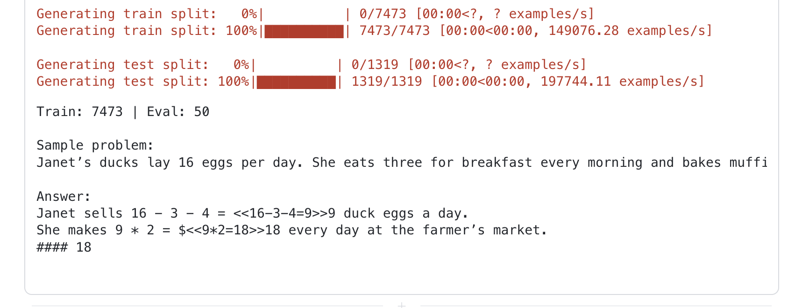
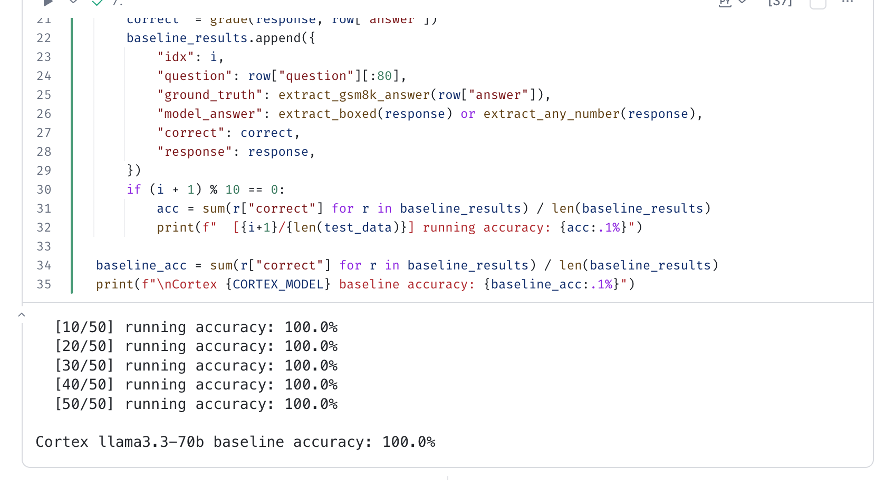
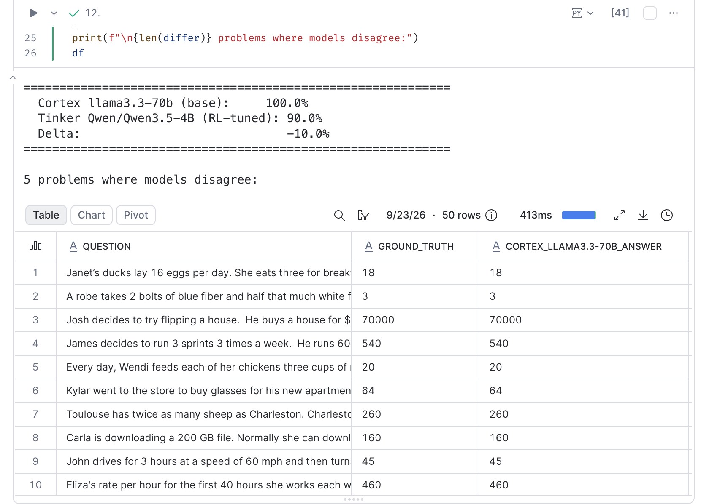
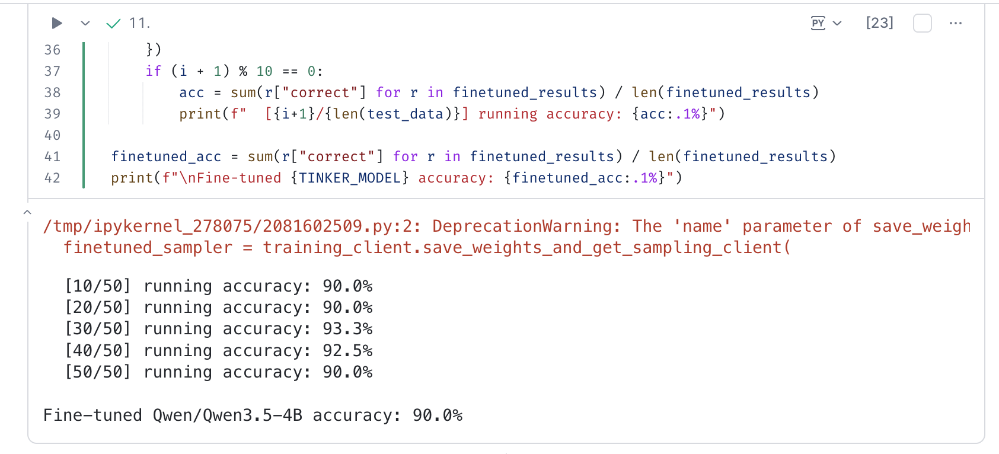
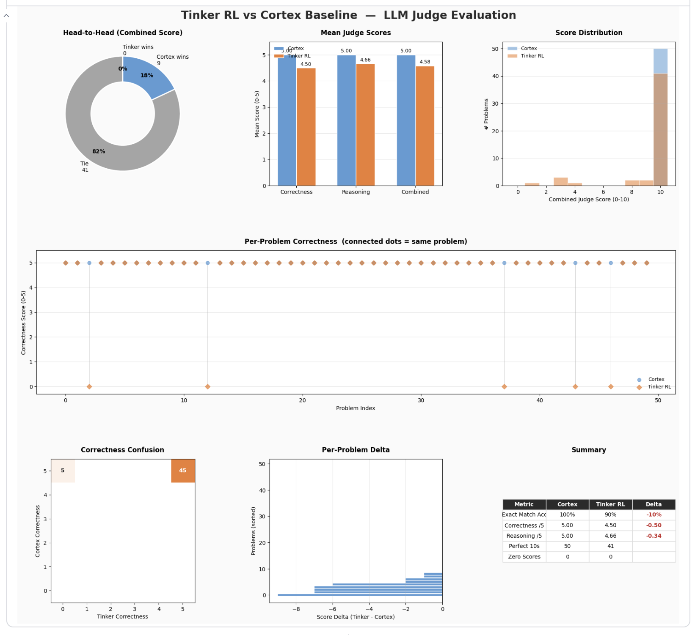
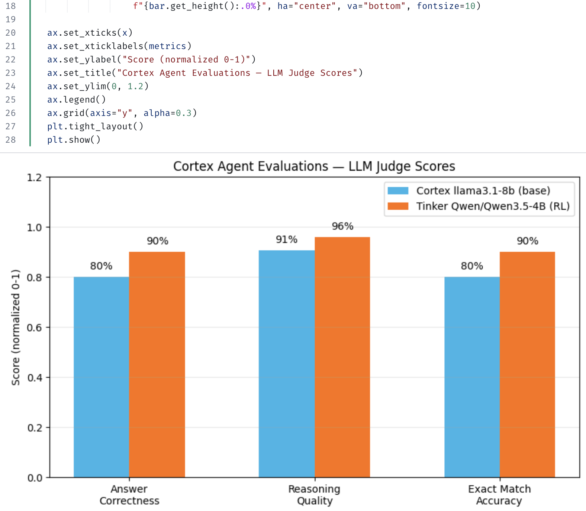
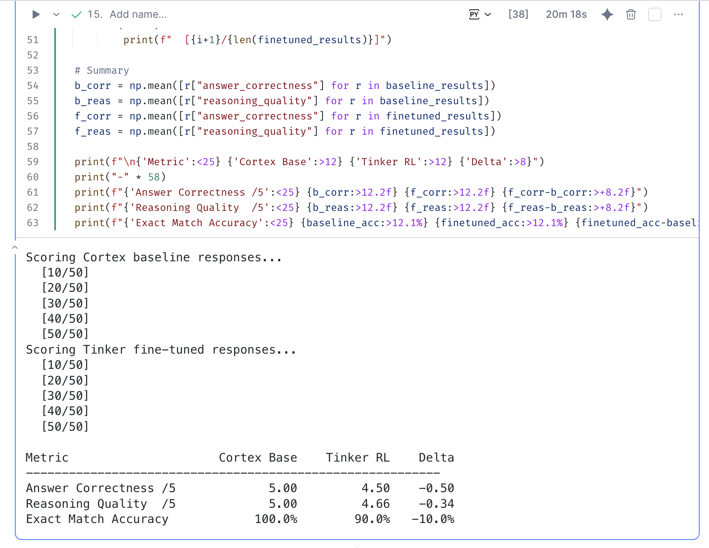

author: Priya Joseph
id: tinker-accel
categories: snowflake-site:taxonomy/solution-center/certification/quickstart, snowflake-site:taxonomy/product/ai, snowflake-site:taxonomy/snowflake-feature/cortex-llm-functions
summary: Fine-tune a small language model with reinforcement learning using Tinker and compare it against a Cortex baseline on GSM8K grade-school math reasoning.
environments: web
status: Published
feedback link: https://github.com/Snowflake-Labs/sfquickstarts/issues
language: en

# Tinker RL Fine-Tuning on GSM8K Math
<!-- ------------------------ -->
## Overview
Duration: 3

This quickstart demonstrates **reinforcement learning fine-tuning** of a small language model (`Qwen/Qwen3.5-4B`) using [Tinker](https://tinker.ai/) and compares it against a Cortex `llama3.3-70b` baseline on the GSM8K grade-school math benchmark.

**Key question:** Can targeted RL training close the gap between a 4B-parameter model and a 70B general-purpose model on math reasoning?

| Component | Details |
|---|---|
| **Fine-tuned model** | Qwen/Qwen3.5-4B via Tinker GRPO |
| **Baseline model** | Cortex llama3.3-70b |
| **Benchmark** | GSM8K (50 eval problems) |
| **Judge** | Cortex mistral-large2 |

### What You'll Learn

- Establish a Cortex `llama3.3-70b` baseline on 50 GSM8K problems.
- Fine-tune `Qwen3.5-4B` with a Tinker GRPO RL training loop using GSM8K training data.
- Evaluate model responses with an LLM-as-Judge pipeline using Cortex `mistral-large2`.
- Compare results in a multi-panel dashboard and persist them to Snowflake tables.

### Prerequisites

- An active Snowflake account with Cortex enabled.
- A [Tinker API key](https://tinker.ai/).
- A Snowflake notebook environment with an active Snowpark session and `tinker-cookbook`, `datasets`, `snowflake-snowpark-python`, and `snowflake-ml-python` available.
- Access to an existing `CORTEX_CODE` database and permission to create the tutorial tables and stage in `CORTEX_CODE.PUBLIC`.

Use a sandbox for this tutorial. The result-writing steps overwrite tables with the same names; do not use names that contain data you need to retain.

<!-- ------------------------ -->
## Setup
Duration: 5

Install dependencies and configure hyperparameters.

```python
!pip install tinker-cookbook datasets --quiet
!pip install tinker
```

```python
import os, re, json, time, logging
from concurrent.futures import Future
import pandas as pd
import numpy as np
import datasets
import tinker
import torch
from tinker import types
from tinker.types.tensor_data import TensorData
from tinker_cookbook import model_info, renderers
from tinker_cookbook.tokenizer_utils import get_tokenizer
from snowflake.snowpark.context import get_active_session
import snowflake.cortex as cortex

session = get_active_session()
print("Connected to Snowflake")
```

Set your Tinker API key and experiment configuration:

```python
os.environ["TINKER_API_KEY"] = "<YOUR_TINKER_API_KEY>"

TINKER_MODEL  = "Qwen/Qwen3.5-4B"
LORA_RANK     = 32
LEARNING_RATE = 1e-4
GROUP_SIZE    = 4     # rollouts per problem
BATCH_SIZE    = 100   # problems per batch
TRAIN_STEPS   = 10    # batches to train
MAX_TOKENS    = 256

CORTEX_MODEL  = "llama3.3-70b"
```

<!-- ------------------------ -->
## Load GSM8K Dataset
Duration: 3

Load the [GSM8K](https://huggingface.co/datasets/openai/gsm8k) grade-school math benchmark. We use the full training split for RL and 50 held-out test problems for evaluation.



```python
ds = datasets.load_dataset("openai/gsm8k", "main")
train_data = ds["train"]
test_data  = ds["test"].select(range(50))

print(f"Train: {len(train_data)} | Eval: {len(test_data)}")
print(f"\nSample problem:\n{test_data[0]['question']}")
print(f"\nAnswer:\n{test_data[0]['answer']}")
```

### Grading Utilities

Helper functions to extract and compare numerical answers. Supports `\boxed{}` format, `####` GSM8K format, and fallback to last-number extraction.

```python
def extract_gsm8k_answer(answer_text):
    match = re.search(r"####\s*(.+)", answer_text)
    return match.group(1).strip().replace(",", "") if match else ""

def extract_boxed(text):
    match = re.search(r"\\boxed\{([^}]+)\}", text)
    return match.group(1).strip().replace(",", "") if match else ""

def extract_any_number(text):
    numbers = re.findall(r"-?[\d,]+\.?\d*", text)
    return numbers[-1].replace(",", "") if numbers else ""

def grade(response, ground_truth):
    gt   = extract_gsm8k_answer(ground_truth)
    pred = extract_boxed(response) or extract_any_number(response)
    try:
        return abs(float(pred) - float(gt)) < 1e-3
    except (ValueError, TypeError):
        return pred.strip() == gt.strip()

assert extract_gsm8k_answer("some work\n#### 42") == "42"
assert extract_boxed("The answer is \\boxed{42}") == "42"
print("Grading utilities ready")
```

<!-- ------------------------ -->
## Cortex Baseline
Duration: 10

Run the Cortex `llama3.3-70b` model on 50 GSM8K eval problems to establish a baseline accuracy before fine-tuning.



```python
MATH_SYSTEM_PROMPT = (
    "Solve the math problem step by step. "
    "Put your final numerical answer inside \\boxed{}."
)

def cortex_baseline(question):
    prompt  = f"{MATH_SYSTEM_PROMPT}\n\nQuestion: {question}"
    return cortex.complete(CORTEX_MODEL, prompt, session=session, stream=False)

baseline_results = []
for i, row in enumerate(test_data):
    response = cortex_baseline(row["question"])
    correct  = grade(response, row["answer"])
    baseline_results.append({
        "idx": i, "question": row["question"][:80],
        "ground_truth": extract_gsm8k_answer(row["answer"]),
        "model_answer": extract_boxed(response) or extract_any_number(response),
        "correct": correct, "response": response,
    })
    if (i + 1) % 10 == 0:
        acc = sum(r["correct"] for r in baseline_results) / len(baseline_results)
        print(f"  [{i+1}/{len(test_data)}] running accuracy: {acc:.1%}")

baseline_acc = sum(r["correct"] for r in baseline_results) / len(baseline_results)
print(f"\nCortex {CORTEX_MODEL} baseline accuracy: {baseline_acc:.1%}")
```

<!-- ------------------------ -->
## Tinker RL Fine-Tuning
Duration: 20

Create a Tinker training client and run GRPO (Group Relative Policy Optimization) on GSM8K training problems. For each batch, the model generates `GROUP_SIZE` rollouts per problem. Correct answers receive reward `1.0`, wrong answers `0.0`. Advantages are computed relative to the group mean and the model is updated via importance-sampled policy gradients.



### Initialize Tinker Client

```python
service_client  = tinker.ServiceClient()
training_client = service_client.create_lora_training_client(
    base_model=TINKER_MODEL, rank=LORA_RANK
)
tokenizer     = get_tokenizer(TINKER_MODEL)
renderer_name = model_info.get_recommended_renderer_name(TINKER_MODEL)
renderer      = renderers.get_renderer(renderer_name, tokenizer)

sampling_params = tinker.types.SamplingParams(
    max_tokens=MAX_TOKENS, stop=renderer.get_stop_sequences(),
)
adam_params = types.AdamParams(
    learning_rate=LEARNING_RATE, beta1=0.9, beta2=0.95, eps=1e-8
)
print(f"Tinker client ready — {TINKER_MODEL}, LoRA rank {LORA_RANK}")
```

### RL Training Loop


```python
CONVO_PREFIX    = [{"role": "system", "content": MATH_SYSTEM_PROMPT}]
QUESTION_SUFFIX = "\nPlease reason step by step and put your final answer in \\boxed{}."
train_metrics   = []

for step in range(TRAIN_STEPS):
    t0    = time.time()
    start = step * BATCH_SIZE
    batch = train_data.select(range(start, min(start + BATCH_SIZE, len(train_data))))
    sampling_client = training_client.save_weights_and_get_sampling_client()

    futures, prompts = [], []
    for question in batch["question"]:
        convo = [*CONVO_PREFIX, {"role": "user", "content": question + QUESTION_SUFFIX}]
        mi    = renderer.build_generation_prompt(convo)
        futures.append(sampling_client.sample(prompt=mi, num_samples=GROUP_SIZE, sampling_params=sampling_params))
        prompts.append(mi)

    datums, rewards_per_problem = [], []
    for future, prompt, answer in zip(futures, prompts, batch["answer"]):
        result   = future.result()
        rewards_g, tokens_g, logprobs_g = [], [], []
        for seq in result.sequences:
            tokens_g.append(seq.tokens); logprobs_g.append(seq.logprobs)
            parsed_msg, _ = renderer.parse_response(seq.tokens)
            content = renderers.get_text_content(parsed_msg)
            gt, pred = extract_gsm8k_answer(answer), extract_boxed(content) or extract_any_number(content)
            try:    reward = 1.0 if abs(float(pred) - float(gt)) < 1e-3 else 0.0
            except: reward = 0.0
            rewards_g.append(reward)

        mean_reward = sum(rewards_g) / len(rewards_g)
        advantages  = [r - mean_reward for r in rewards_g]
        rewards_per_problem.append(mean_reward)
        if all(a == 0.0 for a in advantages): continue

        ob_len = prompt.length - 1
        for toks, lps, adv in zip(tokens_g, logprobs_g, advantages):
            mi = prompt.append(types.EncodedTextChunk(tokens=toks[:-1]))
            datums.append(types.Datum(
                model_input=mi,
                loss_fn_inputs={
                    "target_tokens": TensorData.from_torch(torch.tensor([0]*ob_len + toks)),
                    "logprobs":      TensorData.from_torch(torch.tensor([0.0]*ob_len + lps)),
                    "advantages":    TensorData.from_torch(torch.tensor([0.0]*ob_len + [adv]*(mi.length-ob_len))),
                },
            ))

    if datums:
        training_client.forward_backward(datums, loss_fn="importance_sampling").result()
        training_client.optim_step(adam_params).result()

    batch_reward = sum(rewards_per_problem) / len(rewards_per_problem)
    elapsed      = time.time() - t0
    train_metrics.append({"step": step, "reward": batch_reward, "time_s": elapsed})
    print(f"Step {step:3d} | reward {batch_reward:.3f} | datums {len(datums):4d} | {elapsed:.1f}s")

print("\nTraining complete")
```

### Evaluate Fine-tuned Model



```python
finetuned_sampler = training_client.save_weights_and_get_sampling_client(name="math-rl-finetuned")

eval_futures = []
for row in test_data:
    convo = [*CONVO_PREFIX, {"role": "user", "content": row["question"] + QUESTION_SUFFIX}]
    mi    = renderer.build_generation_prompt(convo)
    eval_futures.append((finetuned_sampler.sample(prompt=mi, num_samples=1, sampling_params=sampling_params), row))

finetuned_results = []
for i, (future, row) in enumerate(eval_futures):
    seq = future.result().sequences[0]
    parsed_msg, _ = renderer.parse_response(seq.tokens)
    response = renderers.get_text_content(parsed_msg)
    finetuned_results.append({
        "idx": i, "question": row["question"][:80],
        "ground_truth": extract_gsm8k_answer(row["answer"]),
        "model_answer": extract_boxed(response) or extract_any_number(response),
        "correct": grade(response, row["answer"]), "response": response,
    })
    if (i + 1) % 10 == 0:
        acc = sum(r["correct"] for r in finetuned_results) / len(finetuned_results)
        print(f"  [{i+1}/{len(test_data)}] running accuracy: {acc:.1%}")

finetuned_acc = sum(r["correct"] for r in finetuned_results) / len(finetuned_results)
print(f"\nFine-tuned {TINKER_MODEL} accuracy: {finetuned_acc:.1%}")
```

<!-- ------------------------ -->
## Compare Results
Duration: 5

Build a side-by-side comparison DataFrame, visualize accuracy, and persist to Snowflake.



```python
comparison = [
    {
        "question": b["question"], "ground_truth": b["ground_truth"],
        f"cortex_{CORTEX_MODEL}_answer": b["model_answer"],
        f"cortex_{CORTEX_MODEL}_correct": b["correct"],
        "tinker_finetuned_answer": f["model_answer"],
        "tinker_finetuned_correct": f["correct"],
    }
    for b, f in zip(baseline_results, finetuned_results)
]
df = pd.DataFrame(comparison)

print(f"  Cortex {CORTEX_MODEL} (base):     {baseline_acc:.1%}")
print(f"  Tinker {TINKER_MODEL} (RL-tuned): {finetuned_acc:.1%}")
print(f"  Delta:                             {finetuned_acc - baseline_acc:+.1%}")

session.sql("USE DATABASE CORTEX_CODE").collect()
session.sql("CREATE SCHEMA IF NOT EXISTS CORTEX_CODE.PUBLIC").collect()
session.sql("USE SCHEMA CORTEX_CODE.PUBLIC").collect()
session.create_dataframe(df).write.mode("overwrite").save_as_table("TINKER_VS_CORTEX_MATH_EVAL")
print("Results saved to CORTEX_CODE.PUBLIC.TINKER_VS_CORTEX_MATH_EVAL")
```

<!-- ------------------------ -->
## LLM-as-Judge Evaluation
Duration: 10

Use Cortex `mistral-large2` as an impartial judge to score both models on **answer correctness** (0–5) and **reasoning quality** (0–5) for every problem.



```python
JUDGE_MODEL  = "mistral-large2"
JUDGE_PROMPT = """You are an expert math evaluator. Score the model response.

**Question:** {question}
**Ground Truth Answer:** {ground_truth}
**Model Response:** {response}

Score on two dimensions (0-5 each):
1. **answer_correctness**: Does the final numerical answer match ground truth? 5=exact match, 3=close, 0=wrong
2. **reasoning_quality**: Is the step-by-step reasoning clear, correct, complete? 5=excellent, 0=absent

Return ONLY valid JSON:
{{"answer_correctness": <int>, "reasoning_quality": <int>, "reasoning": "<one sentence>"}}"""

def llm_judge(question, ground_truth, response):
    prompt  = JUDGE_PROMPT.format(question=question, ground_truth=ground_truth, response=response)
    raw = cortex.complete(JUDGE_MODEL, prompt, session=session, stream=False)
    try:
        return json.loads(raw.strip())
    except json.JSONDecodeError:
        match = re.search(r'\{[^}]+\}', raw)
        return json.loads(match.group()) if match else {"answer_correctness": 0, "reasoning_quality": 0, "reasoning": "parse_error"}

for i, r in enumerate(baseline_results):
    r.update(llm_judge(r["question"], r["ground_truth"], r["response"]))
    if (i + 1) % 10 == 0: print(f"  Cortex [{i+1}]")

for i, r in enumerate(finetuned_results):
    r.update(llm_judge(r["question"], r["ground_truth"], r["response"]))
    if (i + 1) % 10 == 0: print(f"  Tinker [{i+1}]")

b_corr = np.mean([r["answer_correctness"] for r in baseline_results])
b_reas = np.mean([r["reasoning_quality"]   for r in baseline_results])
f_corr = np.mean([r["answer_correctness"] for r in finetuned_results])
f_reas = np.mean([r["reasoning_quality"]   for r in finetuned_results])

print(f"{'Metric':<25} {'Cortex Base':>12} {'Tinker RL':>12} {'Delta':>8}")
print(f"{'Answer Correctness /5':<25} {b_corr:>12.2f} {f_corr:>12.2f} {f_corr-b_corr:>+8.2f}")
print(f"{'Reasoning Quality  /5':<25} {b_reas:>12.2f} {f_reas:>12.2f} {f_reas-b_reas:>+8.2f}")
print(f"{'Exact Match Accuracy':<25} {baseline_acc:>12.1%} {finetuned_acc:>12.1%} {finetuned_acc-baseline_acc:>+8.1%}")
```

Stage an eval config for `EXECUTE_AI_EVALUATION` against a deployed Cortex Agent:

```python
eval_config_yaml = """
version: "1.0"
agent:
  name: "<YOUR_DB>.<YOUR_SCHEMA>.<YOUR_MATH_AGENT>"
  type: "cortex agent"
dataset:
  table: "MATH_EVAL_GROUND_TRUTH"
  input_column: "INPUT_QUERY"
  ground_truth_column: "GROUND_TRUTH"
metrics:
  - name: "answer_correctness"
    type: "builtin"
  - name: "logical_consistency"
    type: "builtin"
  - name: "math_reasoning"
    type: "custom"
    prompt: |
      Evaluate the mathematical reasoning in the agent response.
      Check: (1) correct arithmetic, (2) logical step progression,
      (3) final answer matches work shown, (4) no skipped steps.
      Score 1-5 where 5 is flawless reasoning.
    score_range: [1, 5]
""".strip()

session.sql("CREATE STAGE IF NOT EXISTS EVAL_CONFIGS ENCRYPTION = (TYPE = 'SNOWFLAKE_SSE')").collect()
import tempfile
with tempfile.NamedTemporaryFile(mode="w", suffix=".yaml", delete=False) as f:
    f.write(eval_config_yaml); tmp_path = f.name
session.file.put(f"file://{tmp_path}", "@EVAL_CONFIGS", auto_compress=False, overwrite=True)
os.unlink(tmp_path)
print("Staged at @EVAL_CONFIGS/")
```

<!-- ------------------------ -->
## Save Results & Judge Dashboard
Duration: 5

Persist LLM judge scores to Snowflake and render the seven-panel comparison dashboard.



```python
judge_comparison = [
    {
        "QUESTION": b["question"], "GROUND_TRUTH": b["ground_truth"],
        "CORTEX_ANSWER": b["model_answer"], "CORTEX_CORRECT": b["correct"],
        "CORTEX_JUDGE_CORRECTNESS": b.get("answer_correctness", 0),
        "CORTEX_JUDGE_REASONING": b.get("reasoning_quality", 0),
        "TINKER_ANSWER": f["model_answer"], "TINKER_CORRECT": f["correct"],
        "TINKER_JUDGE_CORRECTNESS": f.get("answer_correctness", 0),
        "TINKER_JUDGE_REASONING": f.get("reasoning_quality", 0),
    }
    for b, f in zip(baseline_results, finetuned_results)
]
judge_df = session.create_dataframe(pd.DataFrame(judge_comparison))
judge_df.write.mode("overwrite").save_as_table("TINKER_VS_CORTEX_JUDGE_SCORES")
print("LLM judge scores saved to TINKER_VS_CORTEX_JUDGE_SCORES")
```

The final notebook cell renders a **seven-panel dashboard**:

1. **Head-to-head donut** — Tinker wins / ties / Cortex wins by combined judge score.
2. **Mean judge scores** — grouped bars for correctness, reasoning, and combined.
3. **Score distribution** — overlapping histograms of combined 0–10 scores.
4. **Per-problem correctness** — paired dot plot, each problem's scores connected.
5. **Correctness confusion heatmap** — counts of (Cortex, Tinker) score pairs.
6. **Per-problem delta** — sorted horizontal bar (Tinker − Cortex per problem).
7. **Summary stats table** — exact match accuracy, mean scores, perfect 10s, zero scores.

<!-- ------------------------ -->
## Cleanup
Duration: 2

After saving any results you want to retain, run the following SQL in a worksheet **only for objects created for this tutorial**. Dropping the stage also removes all files stored in it. If `EVAL_CONFIGS` already existed or is shared, do not drop it; remove only the configuration file uploaded during your run.

```sql
DROP TABLE IF EXISTS CORTEX_CODE.PUBLIC.TINKER_VS_CORTEX_MATH_EVAL;
DROP TABLE IF EXISTS CORTEX_CODE.PUBLIC.TINKER_VS_CORTEX_JUDGE_SCORES;
DROP TABLE IF EXISTS CORTEX_CODE.PUBLIC.MATH_EVAL_GROUND_TRUTH;
DROP STAGE IF EXISTS CORTEX_CODE.PUBLIC.EVAL_CONFIGS;
```

`MATH_EVAL_GROUND_TRUTH` is created by the notebook's optional Cortex AI Evaluation Setup section; `IF EXISTS` handles runs that skipped it.

Keep the existing `CORTEX_CODE` database and shared `PUBLIC` schema. Only if you created `CORTEX_CODE.PUBLIC` solely for this tutorial and it is now empty, optionally remove it using `RESTRICT`, which refuses to drop a nonempty schema:

```sql
DROP SCHEMA IF EXISTS CORTEX_CODE.PUBLIC RESTRICT;
```

These commands do not remove Tinker checkpoints or other Tinker resources. Review and remove any saved training artifacts you no longer need through Tinker, and stop the notebook runtime when you are finished.

<!-- ------------------------ -->
## Conclusion
Duration: 2

### What You Learned

- Established a Cortex `llama3.3-70b` baseline on 50 GSM8K grade-school math problems.
- Fine-tuned `Qwen/Qwen3.5-4B` with GRPO reinforcement learning using Tinker for 10 configured training steps.
- Evaluated both models with an LLM-as-Judge pipeline powered by Cortex `mistral-large2`.
- Persisted comparison results to Snowflake and rendered a seven-panel judge dashboard.

### Resources

- [Tinker](https://tinker.ai/)
- [GSM8K dataset](https://huggingface.co/datasets/openai/gsm8k)
- [Cortex Python completion API](https://docs.snowflake.com/en/developer-guide/snowpark-ml/reference/latest/api/cortex/snowflake.cortex.complete)
- [Companion notebook](tinker-accel.ipynb)
