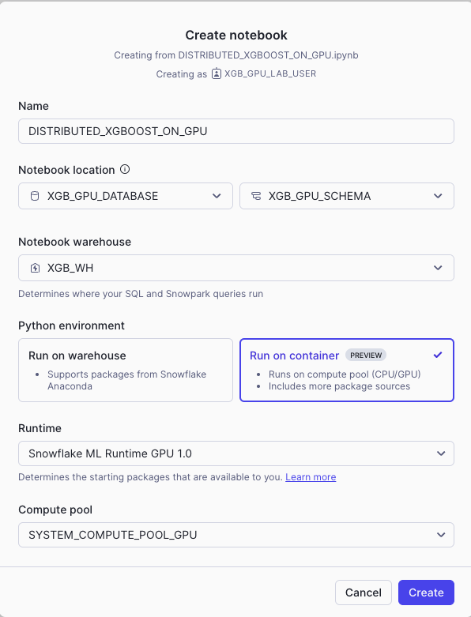
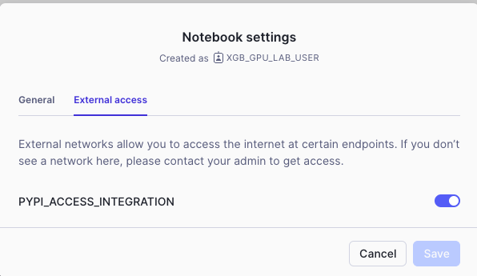
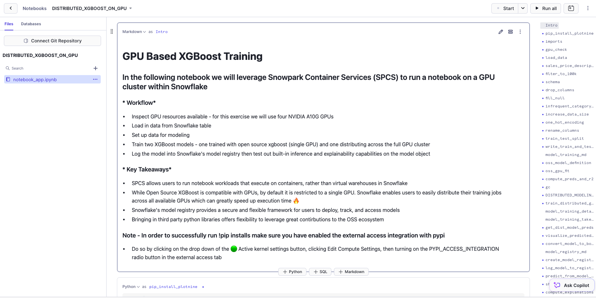

author: Charlie Hammond
id: train-an-xgboost-model-with-gpus-using-snowflake-notebooks
categories: snowflake-site:taxonomy/solution-center/certification/quickstart, snowflake-site:taxonomy/solution-center/certification/certified-solution, snowflake-site:taxonomy/solution-center/includes/architecture, snowflake-site:taxonomy/product/ai, snowflake-site:taxonomy/product/platform
language: en
summary: This is a sample Snowflake Guide 
environments: web
status: Published 
feedback link: https://github.com/Snowflake-Labs/sfguides/issues
fork repo link: https://github.com/Snowflake-Labs/sfguide-train-xgboost-model-using-gpus-using-snowflake-notebooks


# Train an XGBoost Model with GPUs using Snowflake Notebooks
<!-- ------------------------ -->
## Overview 

In this quickstart, we'll explore how to easily harness the power of containers to build models at scale in [Snowflake ML](/en/data-cloud/snowflake-ml/) using GPUs from [Snowflake Notebooks in the Container Runtime](https://docs.snowflake.com/en/user-guide/ui-snowsight/notebooks-on-spcs) in the Container Runtime (Public Preview). Specifically, we'll train an XGBoost model and walk through a workflow that involves inspecting GPU resources, loading data from a Snowflake table, and setting up that data for modeling. In the notebook, we will train two XGBoost models—one trained with open source xgboost (single GPU) and one distributing across the full GPU cluster. Finally, we'll log the model to Snowflake's model registry then test out built-in inference and explainability capabilities on the model object.

This exercise will illustrate how Snowflake Notebooks lets you quickly tap into the GPU compute power you need to scalably build ML models using any open-source Python framework of choice. 

### Prerequisites
- A Snowflake Account. Sign up for a [30-day free trial](https://signup.snowflake.com/?utm_source=snowflake-devrel&utm_medium=developer-guides&utm_cta=developer-guides) account, if required. 
- Foundational knowledge of Data Science workflows
- For an intro to Snowflake Notebooks on Container Runtime, try this [quickstart](/en/developers/guides/notebook-container-runtime/) first

### What You Will Learn 
- Use Snowflake Notebooks with GPUs to speed up model training jobs with distributed processing
- Build using a set of pre-installed ML packages or pip install any of your favorite open-source package 
- Run ML workloads at scale without any data movement

### What You’ll Need 
- A [Snowflake](https://app.snowflake.com/) Account

### What You’ll Build 
- An XGBoost model training on GPUs within Snowflake notebooks

<!-- ------------------------ -->
## Setup Your Account

Complete the following steps to setup your account:
- Navigate to Worksheets, click "+" in the top-right corner to create a new Worksheet, and choose "SQL Worksheet".
- Paste and the following SQL in the worksheet 
- Adjust <YOUR_USER> to your user
- Run all commands to create Snowflake objects

```sql
ALTER SESSION SET query_tag = '{"origin":"sf_sit-is", "name":"notebook_pack_xgboost_on_gpu", "version":{"major":1, "minor":0}, "attributes":{"is_quickstart":1, "source":"sql"}}';
USE ROLE ACCOUNTADMIN;

-- Using ACCOUNTADMIN, create a new role for this exercise and grant to applicable users
CREATE OR REPLACE ROLE XGB_GPU_LAB_USER;
GRANT ROLE XGB_GPU_LAB_USER to USER <YOUR_USER>;

-- create our virtual warehouse
CREATE OR REPLACE WAREHOUSE XGB_WH AUTO_SUSPEND = 60;

GRANT ALL ON WAREHOUSE XGB_WH TO ROLE XGB_GPU_LAB_USER;

-- use our XGB_WH virtual warehouse 
USE WAREHOUSE XGB_WH;

-- Next create a new database and schema,
CREATE OR REPLACE DATABASE XGB_GPU_DATABASE;
CREATE OR REPLACE SCHEMA XGB_GPU_SCHEMA;

-- create external stage with the csv format to stage the dataset
CREATE STAGE IF NOT EXISTS XGB_GPU_DATABASE.XGB_GPU_SCHEMA.VEHICLES
    URL = 's3://sfquickstarts/misc/demos/vehicles.csv';

-- Load data from stage into a snowflake table
CREATE OR REPLACE TABLE "XGB_GPU_DATABASE"."XGB_GPU_SCHEMA"."VEHICLES_TABLE" ( id NUMBER(38, 0) , url VARCHAR , region VARCHAR , region_url VARCHAR , price NUMBER(38, 0) , year NUMBER(38, 0) , manufacturer VARCHAR , model VARCHAR , condition VARCHAR , cylinders VARCHAR , fuel VARCHAR , odometer NUMBER(38, 0) , title_status VARCHAR , transmission VARCHAR , VIN VARCHAR , drive VARCHAR , size VARCHAR , type VARCHAR , paint_color VARCHAR , image_url VARCHAR , description VARCHAR , county VARCHAR , state VARCHAR , lat NUMBER(38, 6) , long NUMBER(38, 6) , posting_date VARCHAR ); 

CREATE OR REPLACE TEMP FILE FORMAT "XGB_GPU_DATABASE"."XGB_GPU_SCHEMA"."s3_csv_file_format"
	TYPE=CSV
    SKIP_HEADER=1
    FIELD_DELIMITER=','
    TRIM_SPACE=TRUE
    FIELD_OPTIONALLY_ENCLOSED_BY='"'
    REPLACE_INVALID_CHARACTERS=TRUE
    DATE_FORMAT=AUTO
    TIME_FORMAT=AUTO
    TIMESTAMP_FORMAT=AUTO; 

COPY INTO "XGB_GPU_DATABASE"."XGB_GPU_SCHEMA"."VEHICLES_TABLE" 
FROM (SELECT $1, $2, $3, $4, $5, $6, $7, $8, $9, $10, $11, $12, $13, $14, $15, $16, $17, $18, $19, $20, $21, $22, $23, $24, $25, $26
	FROM '@"XGB_GPU_DATABASE"."XGB_GPU_SCHEMA"."VEHICLES"') 
FILE_FORMAT = '"XGB_GPU_DATABASE"."XGB_GPU_SCHEMA"."s3_csv_file_format"' 
ON_ERROR=CONTINUE;

-- Create network rule and external access integration for pypi to allow users to pip install python packages within notebooks (on container runtimes)
CREATE OR REPLACE NETWORK RULE XGB_GPU_DATABASE.XGB_GPU_SCHEMA.pypi_network_rule
  MODE = EGRESS
  TYPE = HOST_PORT
  VALUE_LIST = ('pypi.org', 'pypi.python.org', 'pythonhosted.org',  'files.pythonhosted.org');

CREATE OR REPLACE EXTERNAL ACCESS INTEGRATION pypi_access_integration
  ALLOWED_NETWORK_RULES = (pypi_network_rule)
  ENABLED = true;

Grant USAGE ON INTEGRATION pypi_access_integration to ROLE XGB_GPU_LAB_USER;

-- Create compute pool to leverage multiple GPUs (see docs - https://docs.snowflake.com/en/developer-guide/snowpark-container-services/working-with-compute-pool)
CREATE COMPUTE POOL IF NOT EXISTS GPU_NV_M_compute_pool
    MIN_NODES = 1
    MAX_NODES = 1
    INSTANCE_FAMILY = GPU_NV_M;

-- Grant usage of compute pool to newly created role
GRANT USAGE ON COMPUTE POOL GPU_NV_M_compute_pool to ROLE XGB_GPU_LAB_USER;

-- Grant ownership of database and schema to newly created role
GRANT OWNERSHIP ON DATABASE XGB_GPU_DATABASE TO ROLE XGB_GPU_LAB_USER COPY CURRENT GRANTS;
GRANT OWNERSHIP ON ALL SCHEMAS IN DATABASE XGB_GPU_DATABASE  TO ROLE XGB_GPU_LAB_USER COPY CURRENT GRANTS;
GRANT ALL ON TABLE "XGB_GPU_DATABASE"."XGB_GPU_SCHEMA"."VEHICLES_TABLE" TO ROLE XGB_GPU_LAB_USER;

--SETUP IS NOW COMPLETE
```

<!-- ------------------------ -->
## Run the Notebook

- Download the notebook from this [link](https://github.com/Snowflake-Labs/sfguide-train-xgboost-model-using-gpus-using-snowflake-notebooks/blob/main/notebooks/0_start_here.ipynb)
- Change role to XGB_GPU_LAB_USER
- Navigate to Projects > Notebooks in Snowsight
- Click Import .ipynb from the + Notebook dropdown
- Create a new notebok with the following settings
  - Notebook Location: XGB_GPU_DATABASE, XGB_GPU_SCHEMA
  - Run On Container
  - Snowflake ML Runtime GPU 1.0
  - GPU_NV_M_compute_pool



- Click the three dots in the top right > Notebook Settings
- Enable the PYPI_ACCESS_INTEGRATION



- Run cells in the notebook!



<!-- ------------------------ -->
## Conclusion And Resources

### Conclusion

In this quickstart, we demonstrated how to use Snowflake Notebooks in the Container Runtime to efficiently train an XGBoost model with GPUs. By walking through the process of inspecting GPU resources, loading data from a Snowflake table, and setting up that data for modeling, we successfully trained and compared two XGBoost models—one using a single GPU and the other on a GPU cluster. The results underscored the significant efficiency gains GPUs can offer, along with the flexibility Container Runtime provides by enabling containerized notebook execution and the ability to integrate third-party Python libraries seamlessly. We also took a look at Snowflake's Model Registry and how that can be leveraged in machine learning workflows. 

Ready to accelerate your ML workflows in [Snowflake ML](/en/data-cloud/snowflake-ml/)? Dive deeper into Container Runtime and start leveraging GPUs for faster, more flexible model training!

### What You Learned
- How to use Container Runtime to run ML workloads directly from Snowflake Notebooks
- GPUs can greatly speed up model training jobs
- How to bring in third party python libraries to leverage great contributions to the OSS ecosystem

### Related Resources
- [Snowflake Notebooks on Container Runtime Docs](https://docs.snowflake.com/en/LIMITEDACCESS/snowsight-notebooks/ui-snowsight-notebooks-runtime)
- [Snowflake ML Webpage](/en/data-cloud/snowflake-ml/)

### Related Quickstarts
  - Intro:
    - [Getting Started with Snowflake Notebooks on Container Runtime](/en/developers/guides/notebook-container-runtime/)
  - Advanced:
    - [Defect Detection Using Distributed PyTorch With Snowflake Notebooks](/en/developers/guides/defect-detection-using-distributed-pytorch-with-snowflake-notebooks/)
    - [Scale Embeddings with Snowflake Notebooks on Container Runtime](/en/developers/guides/scale-embeddings-with-snowflake-notebooks-on-container-runtime/)
    - [Getting Started with Running Distributed PyTorch Models on Snowflake](/en/developers/guides/getting-started-with-running-distributed-pytorch-models-on-snowflake/)
    - [Fork Repo on GitHub](https://github.com/Snowflake-Labs/sfguide-train-xgboost-model-using-gpus-using-snowflake-notebooks/blob/main/notebooks/0_start_here.ipynb?_fsi=EwgOAmF4&_fsi=EwgOAmF4&_fsi=EwgOAmF4)
    - [Download Reference Architecture](/content/dam/snowflake-site/developers/2025/harness-gpus-in-snowflake-notebooks-to-train-an-xgboost-model.pdf)
    - [Read Engineering Blog](/en/engineering-blog/machine-learning-container-runtime/)
    - [Watch the Demo](https://youtu.be/MD5aP0uEAps?list=TLGGjL9LjRsTO-AyNDA5MjAyNQ)
