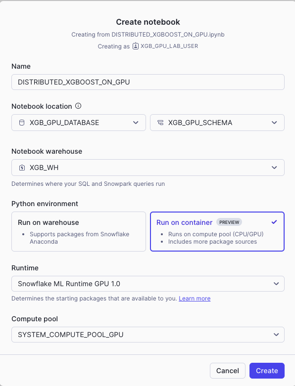
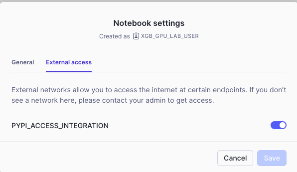

author: Charlie Hammond
id: train-xgboost-with-gpus
summary: This is a sample Snowflake Guide
categories: data-science, data-science-&-ml, Getting-Started, Notebooks
environments: web
status: Published 
feedback link: https://github.com/Snowflake-Labs/sfguides/issues
tags: Getting Started, Data Science

# Train XGBoost using GPUs
<!-- ------------------------ -->
## Overview 
Duration: 1

In this quickstart, we'll explore how to harness the power of [Snowpark Container Services (SPCS)](https://docs.snowflake.com/en/LIMITEDACCESS/snowsight-notebooks/ui-snowsight-notebooks-runtime) using GPUs to execute a [notebook](https://docs.snowflake.com/en/user-guide/ui-snowsight/notebooks) directly within Snowflake. Specifically, we'll train an XGBoost model and walk through a workflow that involves inspecting GPU resources, loading data from a Snowflake table, and setting up that data for modeling. In the notebook, we will train two XGBoost models—one on CPUs and the other using a GPU cluster—and then compare their runtimes and results. 

This exercise will highlight the efficiency gains possible with GPUs, the flexibility SPCS offers by enabling notebook execution on containers, and the added advantage of integrating third-party Python libraries to tap into the broader open-source ecosystem.

### Prerequisites
- Access to a Snowflake account with Accountadmin. 
- Access to run Notebooks in Snowflake
- Foundational knowledge of Data Science workflows

### What You Will Learn 
- How to use SPCS to run notebook workloads that execute on containers, rather than virtual warehouses in Snowflake
- GPUs can greatly speed up model training jobs
- How to bring in third party python libraries to leverage great contirbutions to the OSS ecosystem

### What You’ll Need 
- A [Snowflake](https://app.snowflake.com/) Account

### What You’ll Build 
- An XGBoost model training on GPUs within Snowflake notebooks

<!-- ------------------------ -->
## Setup Your Account
Duration: 2

Complete the following steps to setup your account:
- Navigate to Worksheets, click "+" in the top-right corner to create a new Worksheet, and choose "SQL Worksheet".
- Paste and the following SQL in the worksheet 
- Adjust <YOUR_USER> to your user
- Run all commands to create Snowflake objects

```sql
USE ROLE ACCOUNTADMIN;

-- Using ACCOUNTADMIN, create a new role for this exercise and grant to applicable users
CREATE OR REPLACE ROLE XGB_GPU_LAB_USER;
GRANT ROLE XGB_GPU_LAB_USER to USER chammond_sfc;

-- create our virtual warehouse
CREATE OR REPLACE WAREHOUSE XGB_WH AUTO_SUSPEND = 60;

GRANT ALL ON WAREHOUSE XGB_WH TO ROLE XGB_GPU_LAB_USER;

-- use our XGB_WH virtual warehouse 
USE WAREHOUSE XGB_WH;

-- Next create a new database and schema,
CREATE OR REPLACE DATABASE XGB_GPU_DATABASE;
CREATE OR REPLACE SCHEMA XGB_GPU_SCHEMA;

-- create external stage with the csv format to stage the dataset
CREATE STAGE IF NOT EXISTS XGB_GPU_DATABASE.XGB_GPU_SCHEMA.VEHICLES
    URL = 's3://sfquickstarts/misc/demos/vehicles.csv';

-- Load data from stage into a snowflake table
CREATE OR REPLACE TABLE "XGB_GPU_DATABASE"."XGB_GPU_SCHEMA"."VEHICLES_TABLE" ( id NUMBER(38, 0) , url VARCHAR , region VARCHAR , region_url VARCHAR , price NUMBER(38, 0) , year NUMBER(38, 0) , manufacturer VARCHAR , model VARCHAR , condition VARCHAR , cylinders VARCHAR , fuel VARCHAR , odometer NUMBER(38, 0) , title_status VARCHAR , transmission VARCHAR , VIN VARCHAR , drive VARCHAR , size VARCHAR , type VARCHAR , paint_color VARCHAR , image_url VARCHAR , description VARCHAR , county VARCHAR , state VARCHAR , lat NUMBER(38, 6) , long NUMBER(38, 6) , posting_date VARCHAR ); 

CREATE OR REPLACE TEMP FILE FORMAT "XGB_GPU_DATABASE"."XGB_GPU_SCHEMA"."s3_csv_file_format"
	TYPE=CSV
    SKIP_HEADER=1
    FIELD_DELIMITER=','
    TRIM_SPACE=TRUE
    FIELD_OPTIONALLY_ENCLOSED_BY='"'
    REPLACE_INVALID_CHARACTERS=TRUE
    DATE_FORMAT=AUTO
    TIME_FORMAT=AUTO
    TIMESTAMP_FORMAT=AUTO; 

COPY INTO "XGB_GPU_DATABASE"."XGB_GPU_SCHEMA"."VEHICLES_TABLE" 
FROM (SELECT $1, $2, $3, $4, $5, $6, $7, $8, $9, $10, $11, $12, $13, $14, $15, $16, $17, $18, $19, $20, $21, $22, $23, $24, $25, $26
	FROM '@"XGB_GPU_DATABASE"."XGB_GPU_SCHEMA"."VEHICLES"') 
FILE_FORMAT = '"XGB_GPU_DATABASE"."XGB_GPU_SCHEMA"."s3_csv_file_format"' 
ON_ERROR=CONTINUE;

-- Create network rule and external access integration for pypi to allow users to pip install python packages within notebooks (on container runtimes)
CREATE OR REPLACE NETWORK RULE XGB_GPU_DATABASE.XGB_GPU_SCHEMA.pypi_network_rule
  MODE = EGRESS
  TYPE = HOST_PORT
  VALUE_LIST = ('pypi.org', 'pypi.python.org', 'pythonhosted.org',  'files.pythonhosted.org');

CREATE OR REPLACE EXTERNAL ACCESS INTEGRATION pypi_access_integration
  ALLOWED_NETWORK_RULES = (pypi_network_rule)
  ENABLED = true;

Grant USAGE ON INTEGRATION pypi_access_integration to ROLE XGB_GPU_LAB_USER;

-- Create compute pool to leverage multiple GPUs (see docs - https://docs.snowflake.com/en/developer-guide/snowpark-container-services/working-with-compute-pool)
CREATE COMPUTE POOL IF NOT EXISTS GPU_NV_M_compute_pool
    MIN_NODES = 1
    MAX_NODES = 1
    INSTANCE_FAMILY = GPU_NV_M;

-- Grant usage of compute pool to newly created role
GRANT USAGE ON COMPUTE POOL GPU_NV_M_compute_pool to ROLE XGB_GPU_LAB_USER;

-- Grant ownership of database and schema to newly created role
GRANT OWNERSHIP ON DATABASE XGB_GPU_DATABASE TO ROLE XGB_GPU_LAB_USER COPY CURRENT GRANTS;
GRANT OWNERSHIP ON ALL SCHEMAS IN DATABASE XGB_GPU_DATABASE  TO ROLE XGB_GPU_LAB_USER COPY CURRENT GRANTS;

--SETUP IS NOW COMPLETE
```

<!-- ------------------------ -->
## Run the Notebook
Duration: 30

- Download the notebook from this link
- Change role to XGB_GPU_LAB_USER
- Navigate to Projects > Notebooks in Snowsight
- Click Import .ipynb from the + Notebook dropdown
- Create a new notebok with the following settings
  - Notebook Location: XGB_GPU_DATABASE, XGB_GPU_SCHEMA
  - Run On Container
  - Snowflake ML Runtime GPU 1.0
  - GPU_NV_M_compute_pool



- Click the three dots in the top right > Notebook Settings
- Enable the PYPI_ACCESS_INTEGRATION



- Run cells in the notebook!


<!-- ------------------------ -->
## Conclusion And Resources
Duration: 1

### Conclusion

In this quickstart, we demonstrated the power of Snowpark Container Services (SPCS) in leveraging GPUs to efficiently train an XGBoost model directly within a Snowflake notebook. By walking through the process of inspecting GPU resources, loading data from a Snowflake table, and setting up that data for modeling, we successfully trained and compared two XGBoost models—one using CPUs and the other on a GPU cluster. The results underscored the significant efficiency gains GPUs can offer, along with the flexibility SPCS provides by enabling containerized notebook execution and the ability to integrate third-party Python libraries seamlessly.

Ready to accelerate your ML workflows? Dive deeper into Snowpark Container Services and start leveraging GPUs for faster, more flexible model training!

### What You Learned
- How to use SPCS to run notebook workloads that execute on containers, rather than virtual warehouses in Snowflake
- GPUs can greatly speed up model training jobs
- How to bring in third party python libraries to leverage great contirbutions to the OSS ecosystem

### Related Resources
- [Snowflake Notebooks](https://docs.snowflake.com/en/user-guide/ui-snowsight/notebooks)
- [Snowpark Services Container Runtime](https://docs.snowflake.com/en/LIMITEDACCESS/snowsight-notebooks/ui-snowsight-notebooks-runtime)
