author: Alex Engelmann
id: transform_your_data_with_coalesce
summary: Accelerate Transformations with Coalesce and Snowflake
categories: Getting Started
environments: web
status: draft 
feedback link: mailto:support@coalesce.io
tags: Getting Started, Data Science, Data Engineering
authors: Alex Engelmann
analytics account: G-YVPMNNXCNY 
<!-- check this with Jordan -->
# Accelerate Transformations with Coalesce and Snowflake
<!-- ------------------------ -->
## Overview 
Duration: 3

Coalesce is a best-of-breed Data Transformation tool for Snowflake.  With Coalesce, you build a directed acyclic graph (DAG) of "nodes" that can then be run on a scheduled basis, producing tested, up-to-date datasets that can then be consumed by the rest of your business.

The Coalesce product is built around the concept of "metadata" - column and table level information that describes the structure and transformations inside your data warehouse. This metadata makes both designing and deploying data warehouses easier, especially at enterprise scale.

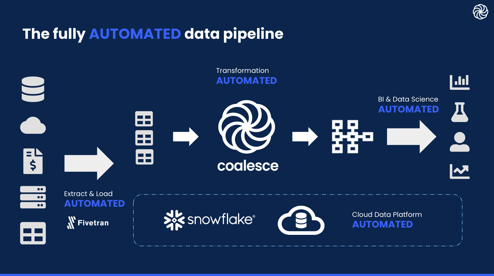

This guide will help you quickly get started with Coalesce, connecting your database and creating a small data mart for a hypothetical sales team.  Using the Snowflake sample database, we will be implementing a Dimension node to track historical changes of their customers and a Fact node to record order transactions.

### Prerequisites

- Familiarity with SQL and Snowflake
- Basic understanding of dimensional modeling

### What You’ll Learn 

- How to use Coalesce to build a basic data transformation pipeline

### What You’ll Need 

- If you haven't yet signed up for a Coalesce account, you can do so [here](https://coalesce.io/start-free/).
- Make sure you're using Google's Chrome browser, as other browsers are not officially supported.
- Have your Snowflake login information handy. Don’t have a Snowflake account yet or not ready to connect your company’s Snowflake to Coalesce? Sign up for a free trial [here](https://signup.snowflake.com/) and use Snowflake’s provided sample data.

### What You’ll Build 

- A small data mart containing dimension and fact tables using native Snowflake SQL

<!-- ------------------------ -->
## Initial Setup
Duration: 2

### Interface Overview

When you first sign in and choose your **Workspace** you'll be presented with the **Build** interface.  This is where you'll spend most of your time creating nodes, building a graph with them, and transforming your data.  The other interface is the **Deploy** interface, which will be used to push your pipeline to other environments (QA, Production, etc.), including your graph and other metadata.  

Positive : Note that on a brand new account, the **Problem Scanner** will show a few action items.  You can disregard those as most will be resolved by the end of this guide.

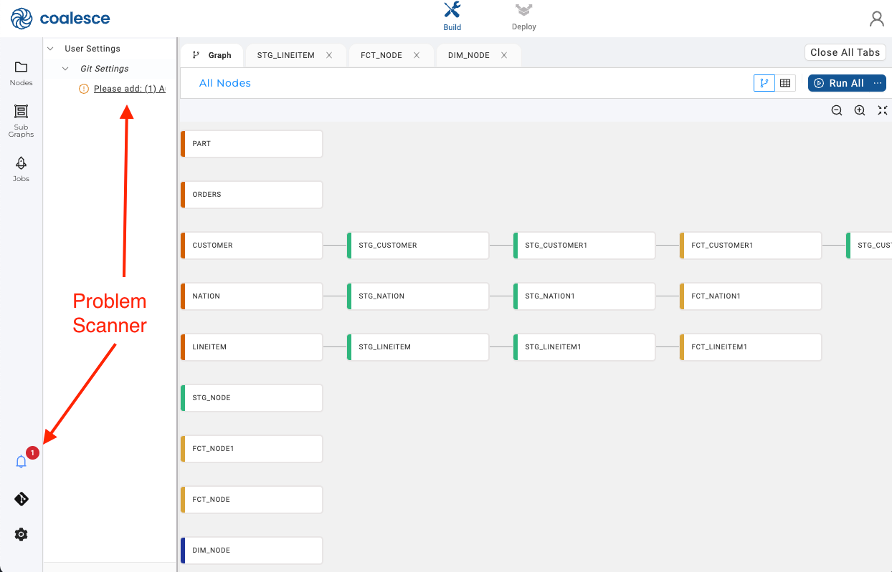
<!-- TODO Will update this once we release 4.1 -->

### Connect to Snowflake

1. Click on **Build Settings**, which is represented by a cogwheel icon toward the bottom left

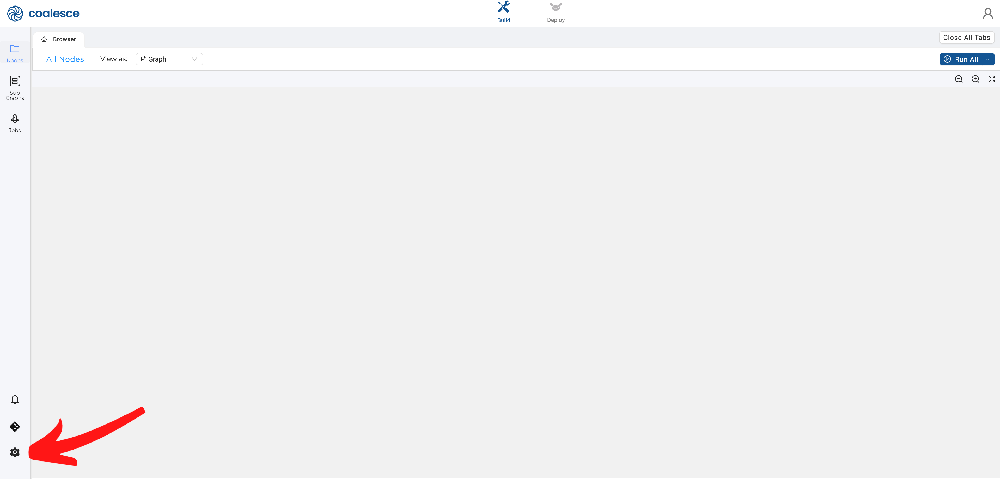

2. Go to **Development Workspaces** and edit your current **Workspace** by clicking the pencil icon to the right of it.

3. From the **Edit Workspace** screen → **Settings** → **Account** → Add your Snowflake URL

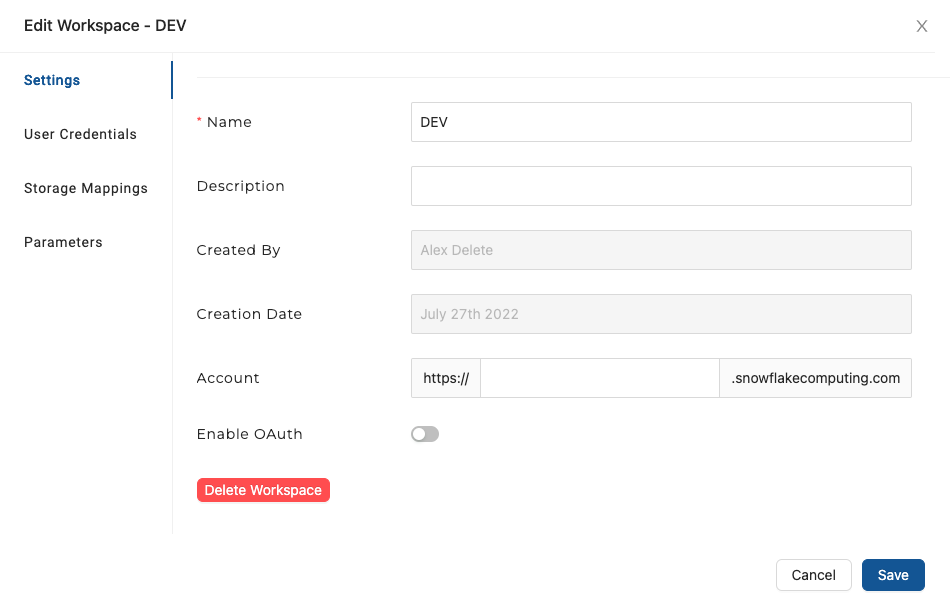

4. From the **Edit Workspace** screen → **User Credentials** and fill out the form with your Snowflake login
5. Click **Test Connection** to ensure your credentials work as expected
6. Click **Save**

You've now connected Coalesce to your Snowflake instance!
### Configure Storage Locations & Workspace

A storage location is a logical name you provide to represent a database and schema (in Snowflake) and you will need them to make use of the **Workspace** you configured earlier.

1. Go to **Build Settings** → **Storage Locations** and click on **New Storage Location** to create a new location
2. You can name this anything you'd like, but as this will be your data target, naming it TARGET or DESTINATION makes sense.  Also make sure to set it as the default **Storage Location**.
3.  Edit your **Workspace** → **Storage Mappings**
4.  From here enter the actual databases and schemas that will correspond to each **Storage Location**.  For this guide we will be using Snowflake's sample schema TPCH_SF1 as our data source.  Feel free to use any schema you'd like as the target for the transformed data.

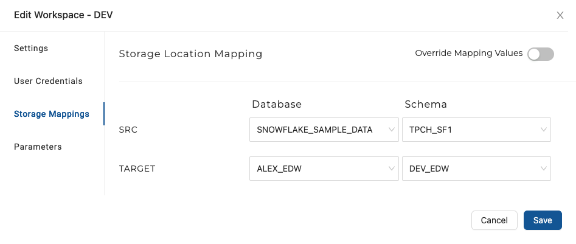

<!-- ------------------------ -->
## Add Data Sources
Duration: 2

Now it's time to add **Sources** to the graph.  The graph node view is where you'll configure **Nodes** that will transform your data.  Below is an example of a graph with several nodes -

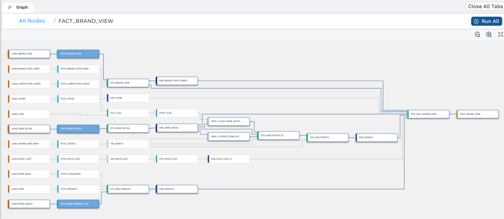

To add **Source Nodes** take the following steps:

1. Expand **Nodes** from the **Left Sidebar** (if not already open)

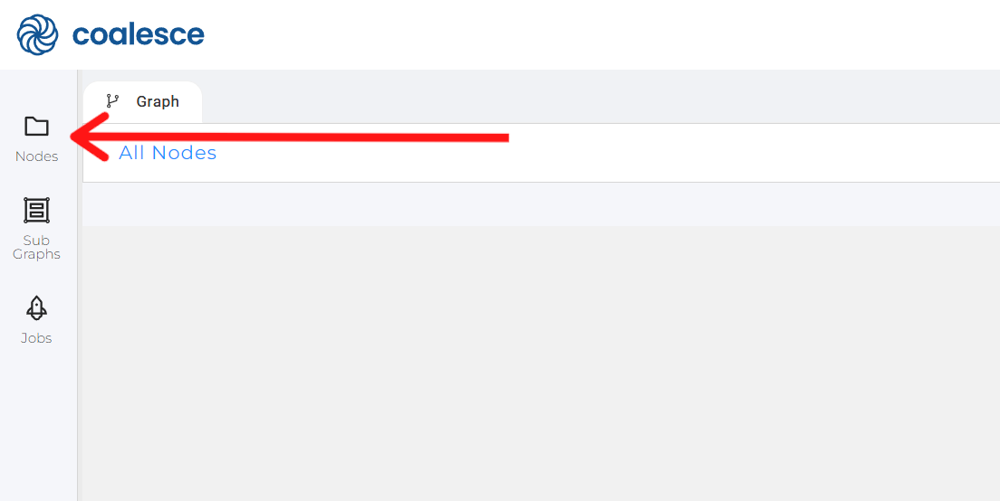

2. Click on the **+** sign → **Add Sources**

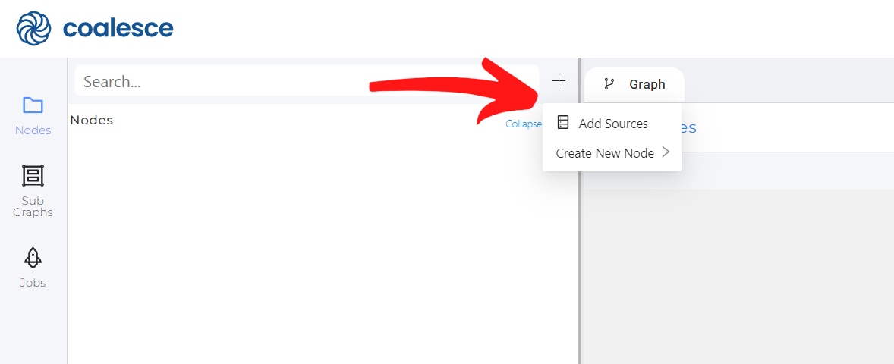

3. Choose your source tables on the left and click **Add Sources** on the bottom right to add the sources to your pipeline

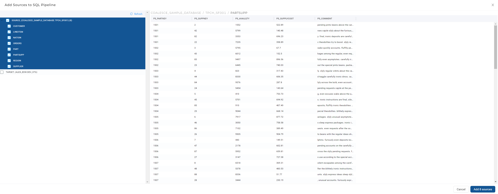

4.  You'll now see your graph populated with some **Source Nodes**

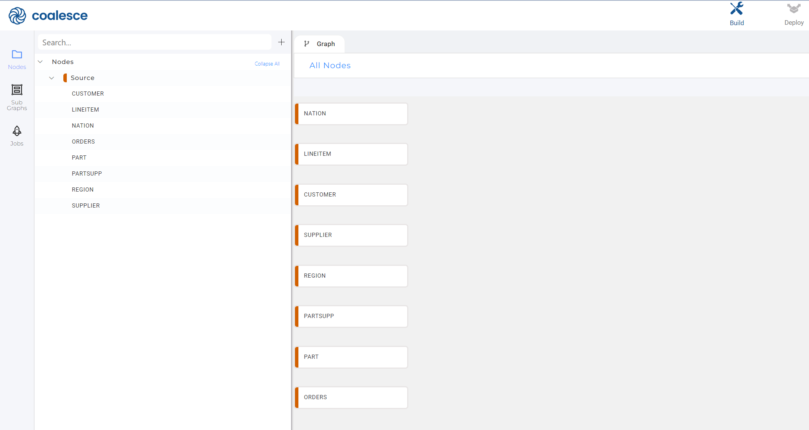

<!-- ------------------------ -->
## Make a Stage Node
Duration: 2

Now that you have a few **Source Nodes** on your graph, it's time to add a **Stage Node**.  **Stage Nodes** are intermediate nodes in the graph where you prepare the data by applying business logic.

1.  Add one or more **Stage Nodes** by right clicking your `Nation` **Source Node** → **Add Node** → **Stage Node**.  Note that you can select multiple **Source Nodes** by Shift+clicking them and then add multiple **Stage Nodes** simultaneously.
2.  Double click on the **Stage Node** or right-click → **Edit** to open up the **Node Editor**
3.  Open **Node Properties** on the right and change the **Location** to the Target you configured earlier.

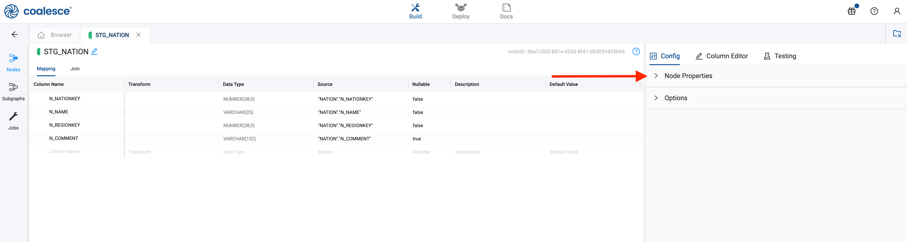

4.  Click **Create** to create a table in Snowflake
5.  Click **Run** to populate the table.  Note that you haven't transformed the data yet!
6.  Edit the **Transform** field in the **Mapping** grid by double clicking in the transform field of the `N_NAME` column.  Try a simple transform like `LOWER()` and the name of your column, or you can use the syntax `LOWER({{SRC}})`
7.  Click **Run** again to transform the data

Positive
: Any [Snowflake SQL transform](https://docs.snowflake.com/en/sql-reference-functions.html) can be used to transform your data.

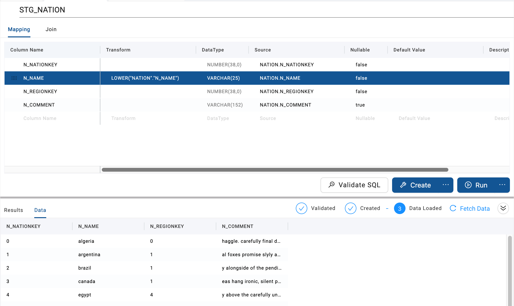

8. You'll see a preview of your transformed data in the lower half of the screen, but feel free to take a peek in your Snowflake database to confirm.

Congratulations!  You've connected your database and applied a basic transformation to your data.

<!-- ------------------------ -->
## Create a Dimension Table
Duration: 2

Now let's create a simple slowly changing dimension (type 2) — an industry standard for tracking historical data by creating multiple records for a given natural key.

1. Create a new **Stage Node** from the CUSTOMER **Source Node**
2. Go into this new node to **Create** and **Run**
3. Return to the main graph and create a Dimension node from the `STG_CUSTOMER` node.  By default, Coalesce creates a Type 1 Dimension.  In this guide we will be making a Type 2 Dimension to track historical data of a column.
4. 
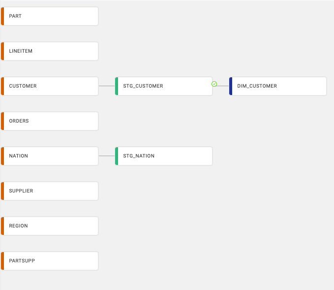

4. Go into the new `DIM_CUSTOMER` node
5. Open up **Options** on the right side
6. Choose `C_CUSTKEY` as a business key by selecting it and clicking the arrow to move it to the right

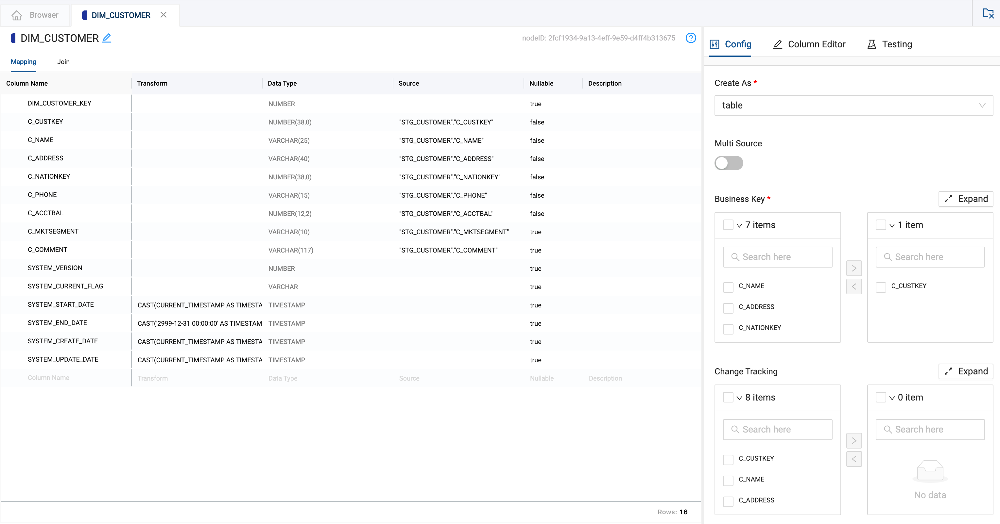

7.  Scroll down the options pane to **Change Tracking** and select columns `C_ADDRESS` and `C_PHONE`, clicking the arrow to move them to the right
8. Now **Create** and **Run** the `DIM_CUSTOMER` node

Positive
: In the **Dimension Node**, if no **Change Tracking** columns are selected, the node will act as a Type 1 Dimension.  If **Change Tracking** columns are selected, it will act as a Type 2.

You have now finished creating a Type 2 Dimension table.  Next we will make a Fact Table.

<!-- ------------------------ -->

## Create a Fact Table
Duration: 1

Now let's create a fact table.

1. Create a new **Stage Node** from the `ORDERS` **Source Node**
2. Open the new `STG_ORDERS` node and delete all the columns except for `O_ORDERKEY`, `O_CUSTKEY`, and `O_TOTALPRICE`
3. Select the `DIM_CUSTOMER` node on the left side, then select `DIM_CUSTOMER_KEY` and drag it into your `STG_ORDERS` mapping grid

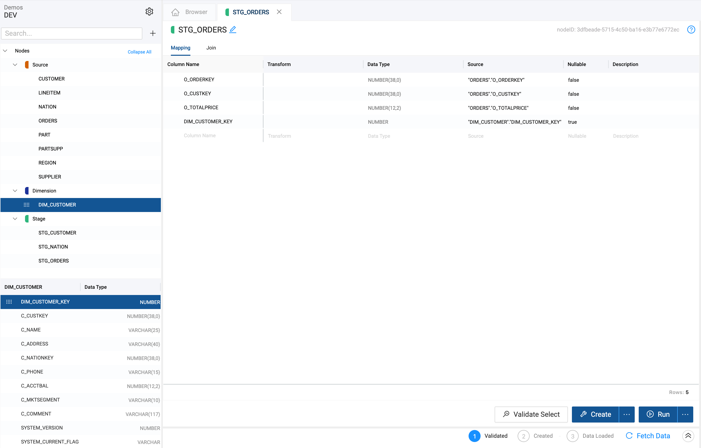

4. Go to **Join** in `STG_ORDERS`
5. Delete the existing text
6. Click **Generate Join** and then **Copy to Editor**
7.  Replace the `/*COLUMN*/` text with `O_CUSTKEY`
8.  **Create** and **Run** the `STG_ORDERS` node
9. Create a **Fact Node** from `STG_ORDERS`
10. Open the new `FCT_ORDERS` node
11. Open **Options** → Business Key → add `O_ORDERKEY`
12. **Create** and **Run** the `FCT_ORDERS` node

You have now made a fact table!  You can run this query in Snowflake (adjusting your schema and databases from `MY_DB` and `MY_SCHEMA` to the ones in your environment) to confirm.

```sql
select DIM.C_NAME CUSTOMER_NAME,
sum(FCT.O_TOTALPRICE) TOTAL_PRICE
from "MY_DB"."MY_SCHEMA"."FCT_ORDERS" FCT
inner join "MY_DB"."MY_SCHEMA"."DIM_CUSTOMER" DIM
on FCT.DIM_CUSTOMER_KEY = DIM.DIM_CUSTOMER_KEY
group by DIM.C_NAME;
```

## Conclusion
Duration: 1

Now that you've finished the Quick Start Guide, you're familiar with the general use case for Coalesce.  Coalesce is a robust transformation tool and can be used to automate the majority of your SQL workflows.  If you'd like to meet with one of our experts and discuss your use case and potential fit, you can request a demo by filling out [this form](https://coalesce.io/request-demo/).

If you're comfortable and want more, you can try [using other node types](https://docs.coalesce.io/docs/out-of-the-box-nodes), backup your work using our [git integration](https://docs.coalesce.io/docs/git-version-control), or try [deploying your pipeline](https://docs.coalesce.io/docs/overview-of-the-deploy-interface) to an environment.

### What we've covered
- Connecting Coalesce to Snowflake
- Adding data sources
- Transforming data with a Stage Node
- Creating Dimension and Fact Tables