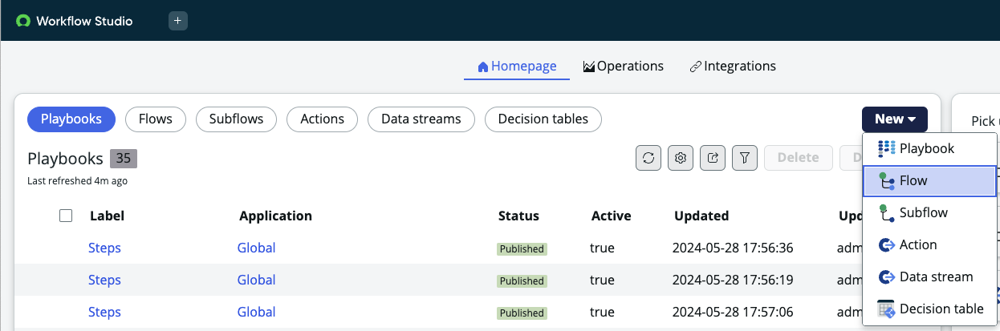
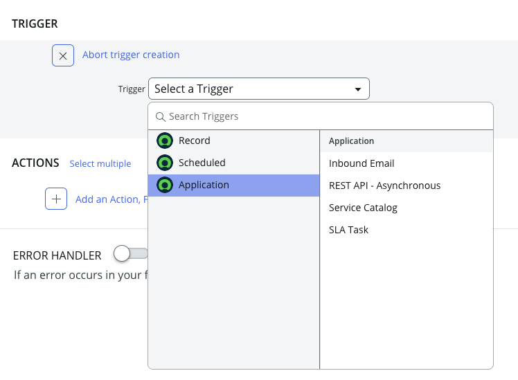
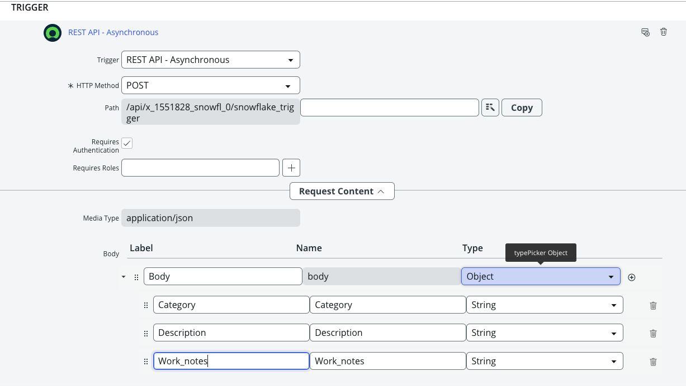
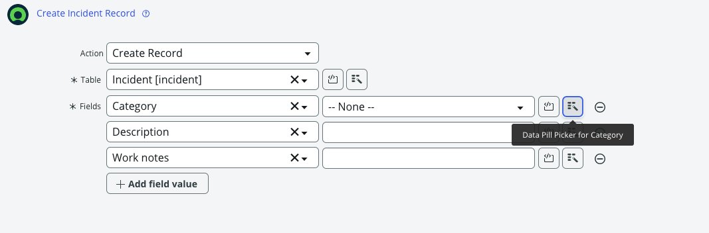
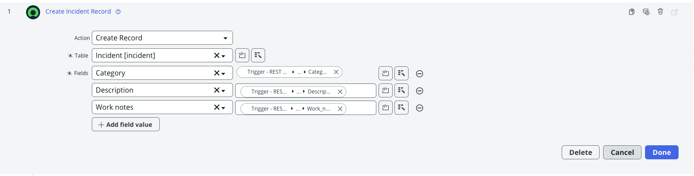

author: 
id: trigger-servicenow-worflow-from-snowflake
summary: Trigger-servicenow-worflow-from-snowflake
categories: Getting-Started
environments: web
status: Published 
feedback link: https://github.com/Snowflake-Labs/sfguides/issues
tags: Getting Started, Data Science, Data Engineering, Twitter 

# Trigger ServiceNow workflow from Snowflake
<!-- ------------------------ -->
## Overview 
Duration: 1

ServiceNow Workflows automate business processes by defining a series of tasks, approvals, and conditions within the platform. They help streamline IT service management (ITSM), HR, customer service, and other enterprise functions by reducing manual effort and enforcing consistency. Worflows can be triggered manually or automatically based on certains events. In this guide you will learn how to automatically trigger ServiceNow Workflows from Snowflake. 

 

It is important to include on the first page of your guide the following sections: Prerequisites, What you'll learn, What you'll need, and What you'll build. Remember, part of the purpose of a Snowflake Guide is that the reader will have **built** something by the end of the tutorial; this means that actual code needs to be included (not just pseudo-code).

The rest of this Snowflake Guide explains the steps of writing your own guide. 

### Prerequisites
- Familiarity with SQL and REST API

### What You’ll Learn 
- how to create a ServiceNow workflow  
- how to define a REST input for the workflow 
- how to securely connect to the ServiceNow Instance from Snowflake
- how to trigger the workflow from Snowflake   


### What You’ll Need 
- A [Snowflake](https://signup.snowflake.com/?utm_cta=quickstarts_) Account 
- A [ServiceNow](https://developer.servicenow.com/dev.do) Personal Developer Instance. 
- In order to create a trigger of type REST API you will need to enable Integration Hub Enterprise Pack Plugin as per this [link](https://developer.servicenow.com/dev.do#!/learn/learning-plans/washingtondc/servicenow_application_developer/app_store_learnv2_rest_washingtondc_exercise_activate_integrationhub)

### What You’ll Build 
- A procedure to trigger workflow in ServiceNow from Snowflake   


### How can you use the solution  
- Customers can seamlessly take action in ServiceNow based on insights from Snowflake.
- For example,
  1. Teams can aggregate infosec data from tools like Bugcrowd, classify CVEs in Snowflake, and automatically create ServiceNow incidents for critical vulnerabilities.
  2. Additionally, Snowflake Cortex ML models can predict component failures based on machine data and create service requests in ServiceNow.   


<!-- ------------------------ -->
## Metadata Configuration
Duration: 2

It is important to set the correct metadata for your Snowflake Guide. The metadata contains all the information required for listing and publishing your guide and includes the following:


- **summary**: This is a sample Snowflake Guide 
  - This should be a short, 1 sentence description of your guide. This will be visible on the main landing page. 
- **id**: sample 
  - make sure to match the id here with the name of the file, all one word.
- **categories**: data-science 
  - You can have multiple categories, but the first one listed is used for the icon.
- **environments**: web 
  - `web` is default. If this will be published for a specific event or  conference, include it here.
- **status**: Published
  - (`Draft`, `Published`, `Deprecated`, `Hidden`) to indicate the progress and whether the sfguide is ready to be published. `Hidden` implies the sfguide is for restricted use, should be available only by direct URL, and should not appear on the main landing page.
- **feedback link**: https://github.com/Snowflake-Labs/sfguides/issues
- **tags**: Getting Started, Data Science, Twitter 
  - Add relevant  tags to make your sfguide easily found and SEO friendly.
- **authors**: Daniel Myers 
  - Indicate the author(s) of this specific sfguide.

---

You can see the source metadata for this guide you are reading now, on [the github repo](https://raw.githubusercontent.com/Snowflake-Labs/sfguides/master/site/sfguides/sample.md).


<!-- ------------------------ -->

## Creating a Step
Duration: 2

A single sfguide consists of multiple steps. These steps are defined in Markdown using Header 2 tag `##`. 

```markdown

## Create the ServiceNow Workflow   
Duration: 3

A  serviceNow workflow consists of a trigger and action. The trigger is used to start the workflow and action defines what the workflow does. In our sample tutorial we will be creating a trigger with an inbound REST request and the action will be creation of an incident record. Let's start with defining a ServiceNow workflow.

1. Go to your  ServiceNow Personal Developer Instance -> All -> Workflow Studio -> Homepage 

2. Select New -> Flow. Define a name for the flow "snowflake-demo". Leave the rest as default. 



3. Select a trigger for the flow. Go to Application -> REST API - Asynchronous 



Select the HTTP Method as "POST" 

Check the box "Requires Authentication" so that only authenticated users can trigger the workflow. 

Go to Body of Request Content and create three new variable 

Category - This will be the category for the incident record 
Description - This will be the description for the incident record 
Work_notes - This will be the work notes section for the incident record

You can optinally add headers section and roles for the REST Request but we will skip that for this tutorial. 

Hit "Done". 

Eventually your Trigger definition should look like this 


## Create the Workflow Action    
Duration: 2

Now that we have defined the trigger the next step is to define action for the workflow (create incident record). 
Select Action-> Create Record -> Table (incident)

Add three fields corresponding to the three inputs we defined in the inbound REST Request 
Category, Description & Work notes

For the values of these fields we will use the Data Pill Picker for each field. 


Go to data Pill Picker -> Trigger - REST API - Asynchronous -> Request Body ->  Field Name

Once you complete this for all three fields your action definition will look like this.  


Hit Done. This completes our workflow definition in ServiceNow. 
The next step will be to create the UDF in Snowflake to call this workflow. 

## Step 3 Title
Duration: 3

All the content for the step goes here.

## Step 4 Title
Duration: 1

All the content for the step goes here.
```

To indicate how long each step will take, set the `Duration` under the step title (i.e. `##`) to an integer. The integers refer to minutes. If you set `Duration: 4` then a particular step will take 4 minutes to complete. 

The total sfguide completion time is calculated automatically for you and will be displayed on the landing page. 

<!-- ------------------------ -->
## Code Snippets, Info Boxes, and Tables
Duration: 2

Look at the [markdown source for this sfguide](https://raw.githubusercontent.com/Snowflake-Labs/sfguides/master/site/sfguides/sample.md) to see how to use markdown to generate code snippets, info boxes, and download buttons. 

### JavaScript
```javascript
{ 
  key1: "string", 
  key2: integer,
  key3: "string"
}
```

### Java
```java
for (statement 1; statement 2; statement 3) {
  // code block to be executed
}
```

### Info Boxes
> aside positive
> 
>  This will appear in a positive info box.


> aside negative
> 
>  This will appear in a negative info box.

### Buttons
<button>

  [This is a download button](link.com)
</button>

### Tables
<table>
    <thead>
        <tr>
            <th colspan="2"> **The table header** </th>
        </tr>
    </thead>
    <tbody>
        <tr>
            <td>The table body</td>
            <td>with two columns</td>
        </tr>
    </tbody>
</table>

### Hyperlinking
[Youtube - Halsey Playlists](https://www.youtube.com/user/iamhalsey/playlists)

<!-- ------------------------ -->
## Images, Videos, and Surveys, and iFrames
Duration: 2

Look at the [markdown source for this guide](https://raw.githubusercontent.com/Snowflake-Labs/sfguides/master/site/sfguides/sample.md) to see how to use markdown to generate these elements. 

### Images


### Videos
Videos from youtube can be directly embedded:
<video id="KmeiFXrZucE"></video>

### Inline Surveys
<form>
  <name>How do you rate yourself as a user of Snowflake?</name>
  <input type="radio" value="Beginner">
  <input type="radio" value="Intermediate">
  <input type="radio" value="Advanced">
</form>

### Embed an iframe


<!-- ------------------------ -->
## Conclusion And Resources
Duration: 1

At the end of your Snowflake Guide, always have a clear call to action (CTA). This CTA could be a link to the docs pages, links to videos on youtube, a GitHub repo link, etc. 

If you want to learn more about Snowflake Guide formatting, checkout the official documentation here: [Formatting Guide](https://github.com/googlecodelabs/tools/blob/master/FORMAT-GUIDE.md)

### What You Learned
- creating steps and setting duration
- adding code snippets
- embedding images, videos, and surveys
- importing other markdown files

### Related Resources
- <link to github code repo>
- <link to documentation>
