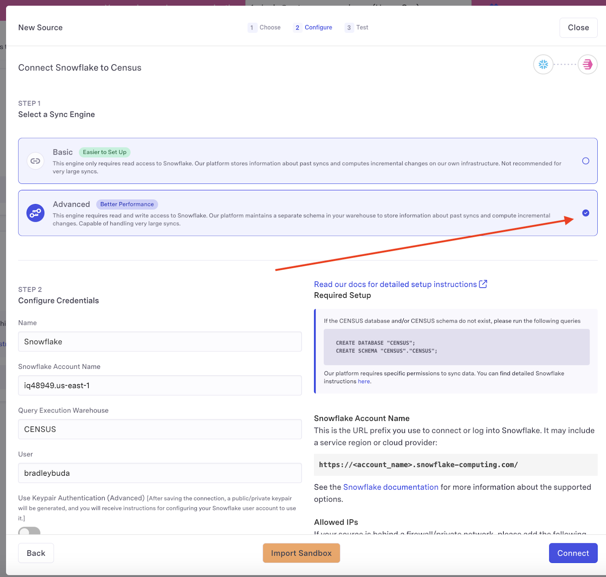
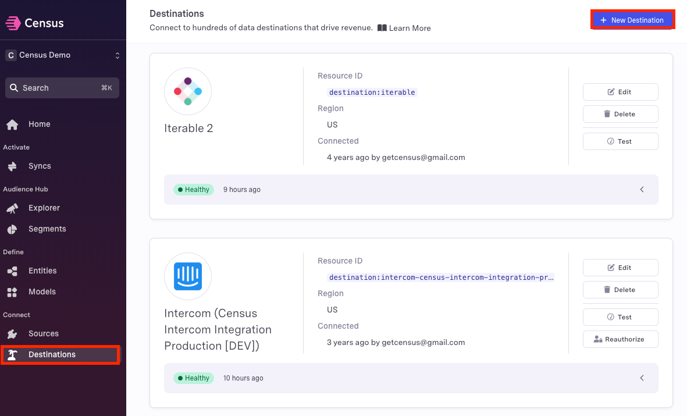
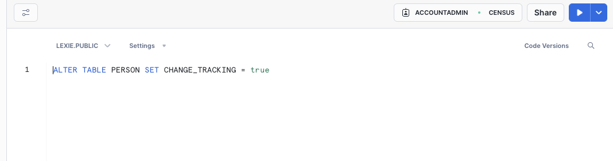
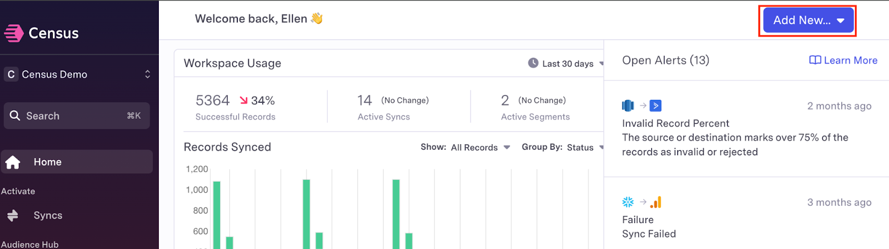
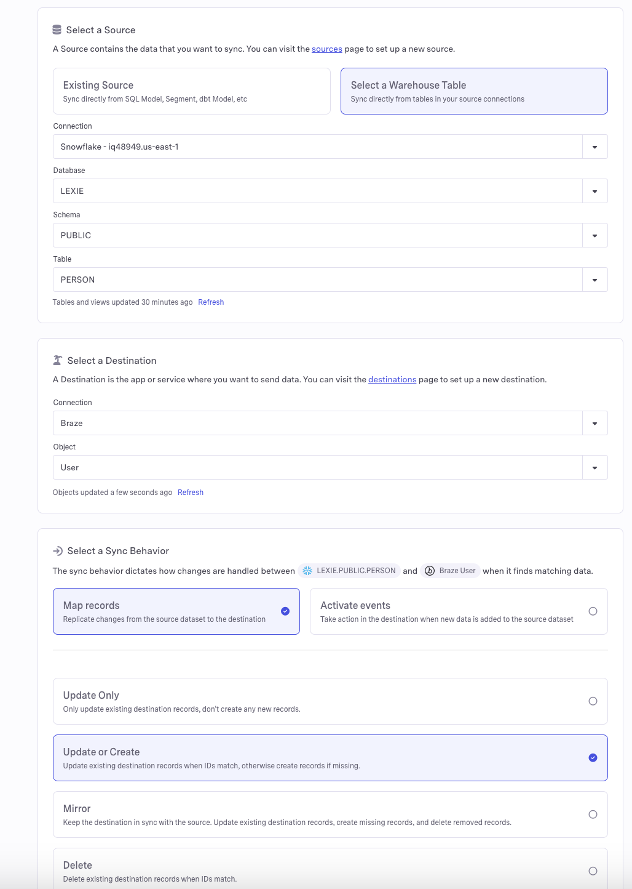
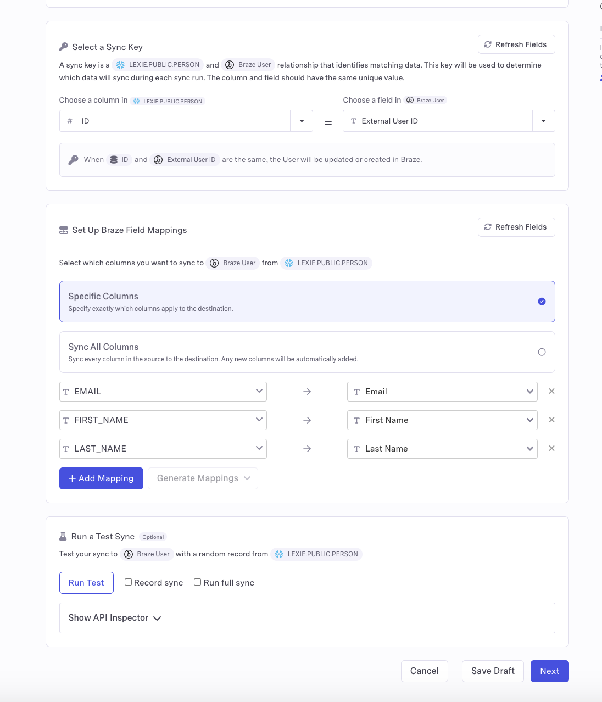
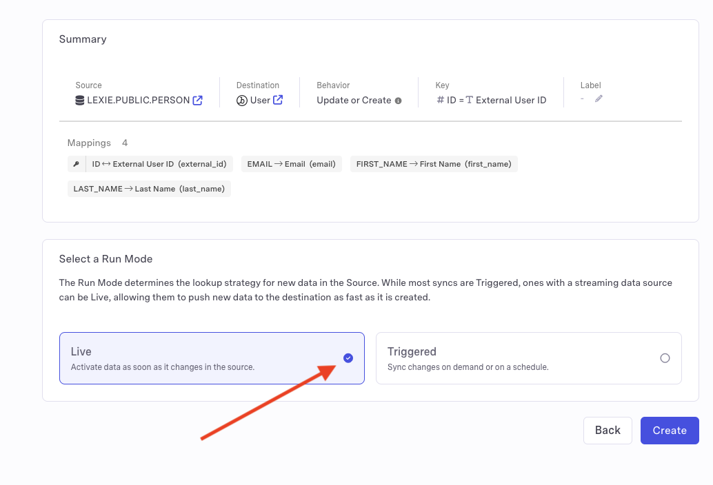
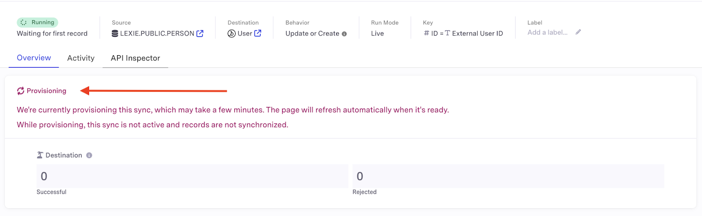
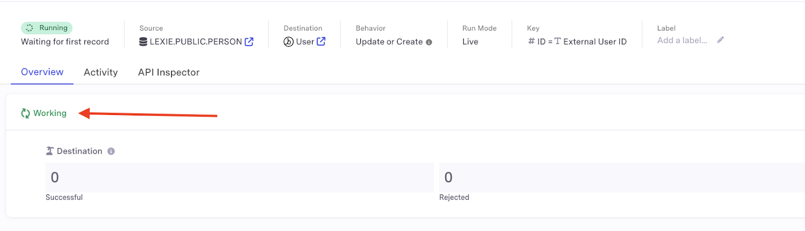
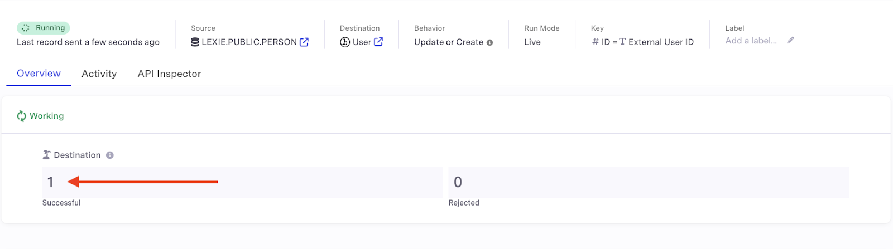

author: Census
id: triggering-real-time-notifications-using-dynamic-tables-and-census-live-syncs
categories: snowflake-site:taxonomy/solution-center/certification/quickstart, snowflake-site:taxonomy/solution-center/certification/partner-solution, snowflake-site:taxonomy/solution-center/includes/architecture, snowflake-site:taxonomy/product/data-engineering
language: en
summary: In this guide, you will learn how to set up a live sync between Census and Snowflake to move data to your activation platforms in real time. 
environments: web
status: Published 
feedback link: https://github.com/Snowflake-Labs/sfguides/issues


# A Guide to Triggering Real-Time Notifications Using Dynamic Tables and Census Live Syncs

## Overview

In this guide, you will learn how to set up a live sync between Census and Snowflake to move data to your activation platforms in real time.

### What You Will Build
- A working live sync between Snowflake and an activation platform via Census.

### What You Will Learn
- How to ensure your Snowflake account is ready for live syncs
- How to prepare your destination within Census
- How to create a table within Snowflake
- How to create a sync within Census and configure the live sync option
- How to verify your live sync is functioning properly

### Prerequisites
- A Census workspace with a Snowflake advanced engine connection
- A [Snowflake workspace](https://signup.snowflake.com/?utm_source=snowflake-devrel&utm_medium=developer-guides&utm_cta=developer-guides)
- An account with at least one [Census destination platform](https://www.getcensus.com/integrations?search=&integration-type=Destination&category=). If you don’t have an existing Census account, you can start a trial [here](https://app.getcensus.com/?_gl=1*mlyah6*_gcl_aw*R0NMLjE3MjQzMzg5MzkuQ2owS0NRand3NXUyQmhEZUFSSXNBTEJ1TG5QS3htaThKS216NlBpZlFoRTNDSGd5QmZoR21qN3lqRFU0ZmZ4NzlkdndLaU1MdzVDOFFINGFBbWVxRUFMd193Y0I.*_gcl_au*MTQzNDczNzM2LjE3MjIyMjQ2NDg.). If you don’t have access to your activation apps, we recommend Google Sheets as a beginner destination. 
- **Either:** pre-existing connections between Census, Snowflake and your destination platform, OR the credentials to add connections between Census, Snowflake and your destination platform

## Introduction To Live Syncs With Census

Live syncs allow Census+Snowflake users to leverage real-time insights in their activation platforms by building low-latency data flows without incurring the cost of running high-frequency queries.

Live syncs will work with native and dynamic tables within Snowflake. They are not compatible with views or full refresh dynamic tables. Census live syncs require Snowflake advanced engine connections to run properly.

Snowflake permissions are complex and there are many ways to configure access for Census. The script below is known to work correctly and follows [Snowflake's best practices](https://docs.snowflake.com/en/user-guide/security-access-control-configure.html#creating-read-only-roles) for creating read-only roles in a role hierarchy:

```sql
-- Create a role for the census user
CREATE ROLE CENSUS_ROLE;

-- Ensure the sysadmin role inherits any privileges the census role is granted. Note that this does not grant sysadmin privileges to the census role
GRANT ROLE CENSUS_ROLE TO ROLE SYSADMIN;

-- Create a warehouse for the census role, optimizing for cost over performance
CREATE WAREHOUSE CENSUS_WAREHOUSE WITH WAREHOUSE_SIZE = XSMALL AUTO_SUSPEND = 60 AUTO_RESUME = TRUE INITIALLY_SUSPENDED = FALSE;
GRANT USAGE ON WAREHOUSE CENSUS_WAREHOUSE TO ROLE CENSUS_ROLE;
GRANT OPERATE ON WAREHOUSE CENSUS_WAREHOUSE TO ROLE CENSUS_ROLE;
GRANT MONITOR ON WAREHOUSE CENSUS_WAREHOUSE TO ROLE CENSUS_ROLE;

-- Create the census user
-- Do not set DEFAULT_WORKSPACE, this will impact which tables are visible to Census
CREATE USER CENSUS WITH DEFAULT_ROLE = CENSUS_ROLE DEFAULT_WAREHOUSE = CENSUS_WAREHOUSE PASSWORD = '<strong, unique password>';
GRANT ROLE CENSUS_ROLE TO USER CENSUS;

-- Let the census user read the data you want to sync
-- This database and schema must have a different name than CENSUS
GRANT USAGE ON DATABASE "<your database>" TO ROLE CENSUS_ROLE;
GRANT USAGE ON SCHEMA "<your database>"."<your schema>" TO ROLE CENSUS_ROLE;
GRANT SELECT ON ALL TABLES IN SCHEMA "<your database>"."<your schema>" TO ROLE CENSUS_ROLE;
GRANT SELECT ON FUTURE TABLES IN SCHEMA "<your database>"."<your schema>" TO ROLE CENSUS_ROLE;
GRANT SELECT ON ALL VIEWS IN SCHEMA "<your database>"."<your schema>" TO ROLE CENSUS_ROLE;
GRANT SELECT ON FUTURE VIEWS IN SCHEMA "<your database>"."<your schema>" TO ROLE CENSUS_ROLE;
GRANT USAGE ON ALL FUNCTIONS IN SCHEMA "<your database>"."<your schema>" TO ROLE CENSUS_ROLE;
GRANT USAGE ON FUTURE FUNCTIONS IN SCHEMA "<your database>"."<your schema>" TO ROLE CENSUS_ROLE;

-- Required for Advanced Sync Engine, not required for Basic Sync Engine:
--  Create a private bookkeeping database where Census can store sync state,
--  perform faster unloads, and keep Warehouse Writeback logs

CREATE DATABASE "CENSUS";
GRANT ALL PRIVILEGES ON DATABASE "CENSUS" TO ROLE CENSUS_ROLE;
-- If you want to explicitly grant the required permissions instead of using GRANT ALL you can use the following command
--GRANT USAGE, CREATE TABLE, CREATE VIEW,MODIFY, MONITOR ON DATABASE "CENSUS"."CENSUS" TO ROLE CENSUS_ROLE

CREATE SCHEMA "CENSUS"."CENSUS";
GRANT ALL PRIVILEGES ON SCHEMA "CENSUS"."CENSUS" TO ROLE CENSUS_ROLE;
-- If you want to explicitly grant the required permissions instead of using GRANT ALL you can use the following command
--GRANT CREATE TABLE, CREATE VIEW, MODIFY, MONITOR, CREATE STAGE  ON SCHEMA "CENSUS"."CENSUS" TO ROLE CENSUS_ROLE

GRANT CREATE STAGE ON SCHEMA "CENSUS"."CENSUS" TO ROLE CENSUS_ROLE;
```

## Configure a New Connection in Census

1. Visit the Sources section on Census, and press New Source, selecting Snowflake from the list. Select **Advanced sync engine**.
   

   
2. Census will ask you to provide the **following**:
   
   - **Snowflake Account Name**
     
     This is the URL prefix you use to connect or log into Snowflake. It may include a service region or cloud provider: `https://<account_name>.snowflake-computing.com/`

     See the [Snowflake documentation](https://docs.snowflake.com/en/user-guide/jdbc-configure.html#connection-parameters) for more information about the supported options.

   - **Query Execution Warehouse** - this should match the warehouse you've created in the above instructions - for example `CENSUS_WAREHOUSE`
   - **User** - the user you use to log into Snowflake
   - **Database Name** (optional) - default database to log into
   - **Schema Name** (optional) - default schema to log into
   - **Authentication** - Select keypair as the authentication method. After saving the connection, Census will generate a public/private keypair and provide instructions for configuring your Snowflake user account to use it.
3. Once you provide the required information, click **Connect** to finish the connection to Snowflake.
4. After the connection is saved, go ahead and press the **Test** button. This will validate that you've completed the above steps correctly. Once you've got a checkmark for all four steps, you're good to go!

## Configure at least one destination within Census

Within Census, navigate to the Destinations menu and select **+ New Destination**



Then, select the platform you wish to connect.


Each platform will have a slightly different process for configuring the connection on the destination side. Find your connection [here](https://docs.getcensus.com/destinations/overview) for detailed instructions. Here are some of our more popular connectors:
- [Braze](https://docs.getcensus.com/destinations/available-destinations/braze)
- [Marketo](https://docs.getcensus.com/destinations/available-destinations/marketo)
- [Drift](https://docs.getcensus.com/destinations/available-destinations/drift)
- [Google Ads](https://docs.getcensus.com/destinations/available-destinations/google-ads)
- [Google Sheets](https://docs.getcensus.com/sources/available-sources/google-sheets#create-a-google-sheets-connection)

> 
>
> Send, replace, and upload and swap mirror destinations are not supported by Live Syncs.

## Create a table

Tables can be either standard Snowflake tables or Dynamic Tables.

### (Optional) Creating a Dynamic Table
Dynamic Tables are specifically optimized for low-latency transformations and can simplify data engineering pipelines as data is loaded into Snowflake. Read more about Dynamic Tables [here](/blog/dynamic-tables-delivering-declarative-streaming-data-pipelines/). 


### Creating and Simulating a Live Sync on a table. 

Ensure change tracking is enabled on your table.



Insert the data you wish to sync into your table. 


## Create a Sync within Census

1. Navigate to the **Add New…** menu and select **Sync**.



2. Select your Snowflake table as the source and your chosen app as the destination.
3. Select a sync behavior. The simplest options are **map records** and **update or create**, but you may modify these as needed.



4. Select your sync keys and field mappings. These will allow your apps to identify the correct data within the Snowflake table. 



5. You may optionally choose to test your sync to ensure a working connection and verify the data that will be updated. This is particularly useful for SaaS apps that have fees associated with updating data, as it allows you to preview the volume of data to be changed.
6. Select **Live** as the run mode. And click **Create**.



7. Your sync may take a few minutes to provision. Wait until this process is complete before proceeding further.


   
8. When a sync shows “working” status, it’s ready to receive data. 


   
9. Verify that the sync was successful by checking the “destination” header after adding data to your source table - the number of successfully synced records should now read 1.



> 
> 
> Selecting “Map records” as a sync behavior will keep records in sync between the source and destination, while selecting “Activate events” can be used to trigger actions in the destination when new records are added to the source.

## Conclusion and Resources

Congratulations! You have successfully created a live sync between Snowflake and your activation platform via Census. You are now fully prepared to begin activating the data in your Snowflake tables in real time. 

### What You Learned
- Preparing your Snowflake account to be ready for live syncs
- Configuring your destination within Census
- Creating a table within Snowflake
- Configure your live sync within Census
- Verify your live sync is functioning properly

### Resources
- [Census Live Syncs documentation](https://docs.getcensus.com/basics/live-syncs)
- [Census Snowflake source documentation](https://docs.getcensus.com/sources/available-sources/snowflake)
- [Reference Architecture](/content/dam/snowflake-site/developers/2024/10/Snowflake-Census-Reference-Architecture.pdf)
- [Read the Blog](https://medium.com/snowflake/a-developers-guide-to-activating-snowflake-data-with-census-929add207129)
- [Watch the Demo](https://youtu.be/G_qHyY-95lU?si=L8l1lSQaBeYaFkOf)
  
