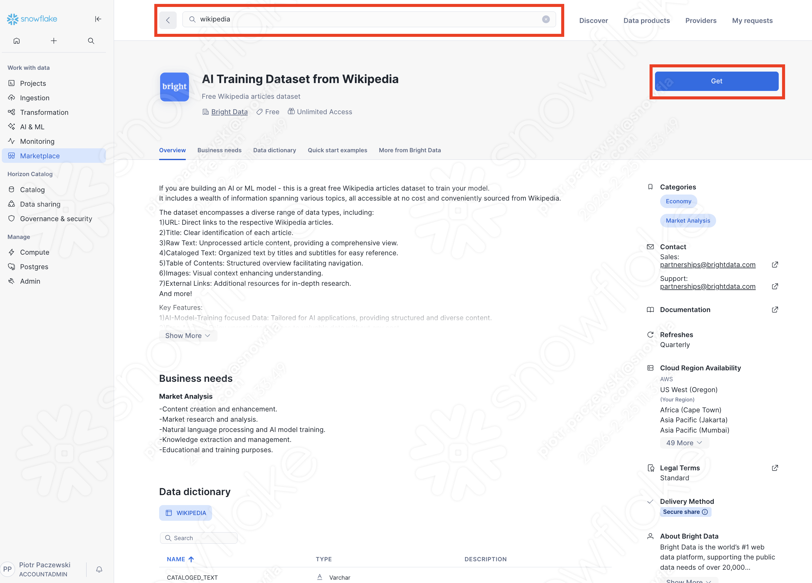

author: Lucas Galan, Piotr Paczewski
id: using-cortex-batch-search
language: en
summary: Learn to use Cortex Batch Search over a Cortex Search Service for processing large amounts of queries
categories: snowflake-site:taxonomy/solution-center/certification/quickstart, snowflake-site:taxonomy/product/ai, snowflake-site:taxonomy/snowflake-feature/unstructured-data-analysis , snowflake-site:taxonomy/snowflake-feature/cortex-search
environments: web
status: Published
feedback link: https://github.com/Snowflake-Labs/sfguides/issues

# Using Cortex Batch Search to query a Cortex Search Service to tackle batch of queries
<!-- ------------------------ -->
## Overview 


**Understand how and when to use Cortex Batch Search to tackle offline, high-throughput workloads over large sets of queries**

This guide walks you step-by-step through creating a **Cortex Search Service** and a query payload. We then run parallel queries on the service at scale, showing that for large amounts of queries, the time taken is impacted significantly by consecutive searches. Finally, we use **Cortex Batch Search** to tackle the entire search in a matter of seconds. We also show how this solution can scale up to thousands of searches without significant impact on the time to process. 

At a high level:
-   A Cortex Search is for interactive, low latency user-facing search (RAG chatbots, search bars)
-   Batch Cortex Search is for offline, high-throughput workloads over large sets of queries (entity resolution, catalog mapping)
-   Both use the same underlying Cortex Search service and index, no need to create a separate objects to use batch.

### Prerequisites

**What You'll Need**:

-   A Snowflake account
-   An ACCOUNTADMIN role or a custom role with sufficient privileges
-   A dataset to search through (we provide step by step guide to using a free dataset from Snowflake marketplace)

### What You'll Learn

-   How to set up a **Cortex Search Service** over a marketplace dataset
-   How to run linear queries using Cortex Search Service
-   The limitations of running multiple queries over a Cortex Search Service
-   How to utilise **Cortex Batch Search** to tackle queries at scale

### What You'll Build

-   A marketplace integration to download wikipedia entries
-   A **Cortex Search Service** over a table of 100K articles
-   A simple synthetic query generator
-   A way to deploy **Cortex Batch Search** to quickly tackle large volumes of queries

<!-- ------------------------ -->
## What is Cortex Batch Search?

The Batch Cortex Search function is a table function that allows you to submit a batch of queries to a Cortex Search Service. It is intended for offline use-cases with high throughput requirements, such as entity resolution, deduplication, or clustering tasks.

Jobs submitted to a Cortex Search Service with the CORTEX_SEARCH_BATCH function leverage additional compute resources to provide a significantly higher level of throughput (queries per second) than the interactive (Python, REST or, SEARCH_PREVIEW) API search query surfaces.

> **_NOTE:_** The throughput of the batch search function may vary depending on the amount of data indexed in the queried Cortex Search Service and the complexity of the search queries. Users are encouraged to run the function on a small number of queries to measure the throughput for their specific workload. In general, queries to larger services with more filter conditions see lower throughput.

> The throughput of the batch search function (the number of search queries processed per second) is not influenced by the size of the warehouse used to query it.

> The batch search function is not optimized for quickly processing a small number of search queries. For sub-second latency on a small number of queries, it is suggested to use the interactive (Python, REST or, SEARCH_PREVIEW) API search query surfaces.

> A single Cortex Search Service can be queried in interactive and batch mode concurrently without any degradation to interactive query performance or throughput. Separate compute resources are used to serve interactive and batch queries.

> There is no limit to the number of concurrent batch queries that can be run at a given time on a given service.  

<!-- ------------------------ -->
## Getting Data
> **_NOTE:_** Skip this if you already have a table with data you wish to use for this demo.  

You can use whatever data you have in Snowflake for this tutorial, but we want to make sure we have something at least minimally large to showcase the capabilities. For this tutorial, we will be using some of the data found for free on **Snowflake Marketplace**. 

In your Snowsight account, navigate to Marketplace and search for Wikipedia data. Click 'Get'.


You can also import the data set programatically, but please note the global listing name (GZT0Z4C8RF3FT) might be subject to change:

```sql
USE ROLE ACCOUNTADMIN;

CALL SYSTEM$ACCEPT_LEGAL_TERMS('DATA_EXCHANGE_LISTING', 'GZT0Z4C8RF3FT');
CREATE DATABASE IF NOT EXISTS AI_TRAINING_DATASET_FROM_WIKIPEDIA
FROM LISTING 'GZT0Z4C8RF3FT';
```

Let's begin by opening a SQL worksheet. Before we do anything else, let's set up our environment. This will ensure that all our work is tidy and we can easily clean everything up afterwards:

```sql
USE ROLE ACCOUNTADMIN;
--Make a Database and use it
CREATE DATABASE IF NOT EXISTS BATCH_DEMO;
USE DATABASE BATCH_DEMO;
--Make a Warehouse and use it
CREATE WAREHOUSE IF NOT EXISTS BATCH_SEARCH_WH WITH WAREHOUSE_SIZE = 'SMALL' AUTO_SUSPEND = 300 AUTO_RESUME = TRUE;
USE WAREHOUSE BATCH_SEARCH_WH;
--Make a Schema and use it
CREATE SCHEMA IF NOT EXISTS BATCH_TEST;
USE SCHEMA BATCH_TEST;
```

Then, from the data we've downloaded, we want to build a smaller dataset, let's say 100K articles, to test batch search against.

```sql
--make a copy of 100k lines from the data
CREATE OR REPLACE TABLE wikipedia_articles AS
SELECT 
    URL,
    TITLE,
    RAW_TEXT,
    TABLE_OF_CONTENTS,
    SEE_ALSO
FROM AI_TRAINING_DATASET_FROM_WIKIPEDIA.PUBLIC.WIKIPEDIA
LIMIT 100000;
```
Feel free to take a look at the structure. You will see that there is a main column called RAW_TEXT which has the entire article in it.

```sql
-- Verify row count
SELECT COUNT(*) AS row_count FROM wikipedia_articles;

-- Preview sample data
SELECT TITLE, LEFT(RAW_TEXT, 200) AS text_preview 
FROM wikipedia_articles 
LIMIT 5;
```

<!-- ------------------------ -->
## Setting Up a Cortex Search Service
Now that we have data we can set up a Cortex Search Service over the top of RAW_TEXT, this will create an vector over the column and allow for extremely fast retrieval over the unstructured text. The service takes a while to create the first time, but once it's been created it is very fast to query.
> **_NOTE:_** This will take around 8 minutes. If you want something faster, simply reduce the table wikipedia_articles to a smaller amount of data, such as 50k. 

```sql
--create a cortex search service
CREATE OR REPLACE CORTEX SEARCH SERVICE wikipedia_search_service
ON RAW_TEXT
ATTRIBUTES TITLE
WAREHOUSE = BATCH_SEARCH_WH
TARGET_LAG = '1 hour'
AS
SELECT 
    TITLE,
    RAW_TEXT
FROM wikipedia_articles;
```

Once the service has been created, we can test it. Run a quick search to verify it's working. A single result is a little hard to parse as JSON, so we wrap the whole thing into a table. We can now search for anything we'd like and return the pages (within our subset) that most closely match the results.


```sql
-- Single search against the Cortex Search service
SELECT SNOWFLAKE.CORTEX.SEARCH_PREVIEW(
    'BATCH_DEMO.BATCH_TEST.WIKIPEDIA_SEARCH_SERVICE',
    '{
        "query": "machine learning artificial intelligence",
         "columns": ["TITLE", "RAW_TEXT"],
        "limit": 5
    }'
) AS search_result;

-- A single result is a little hard to parse as JSON. We can wrap SEARCH_PREVIEW result into a table.
SELECT
    r.value:TITLE::VARCHAR AS title,
    r.value:RAW_TEXT::VARCHAR AS raw_text
FROM TABLE(FLATTEN(
    input => PARSE_JSON(
        SNOWFLAKE.CORTEX.SEARCH_PREVIEW(
            'BATCH_DEMO.BATCH_TEST.WIKIPEDIA_SEARCH_SERVICE',
            '{
                "query": "machine learning artificial intelligence",
                "columns": ["TITLE", "RAW_TEXT"],
                "limit": 5
            }'
        )
    ):results
)) AS r;
```

This type of search is extremely efficient, and Cortex Search can quickly return results even for extremely large datasets. It is even faster when used directly via Snowflake Python API or REST API, but for now let's look at the SQL for demonstration purposes. In case if we want to run multiple searches using SEARCH_PREVIEW function:

```sql
-- Example: 10 searches using UNION ALL (more efficient syntax is via Python API, Rest API)
SELECT 'quantum physics' AS query, PARSE_JSON(SNOWFLAKE.CORTEX.SEARCH_PREVIEW(
    'BATCH_DEMO.BATCH_TEST.WIKIPEDIA_SEARCH_SERVICE',
    '{"query": "quantum physics", "columns": ["TITLE"], "limit": 1}'
)):results[0]:TITLE::VARCHAR AS top_result
UNION ALL
SELECT 'world war history', PARSE_JSON(SNOWFLAKE.CORTEX.SEARCH_PREVIEW(
    'BATCH_DEMO.BATCH_TEST.WIKIPEDIA_SEARCH_SERVICE',
    '{"query": "world war history", "columns": ["TITLE"], "limit": 1}'
)):results[0]:TITLE::VARCHAR
UNION ALL
SELECT 'climate change', PARSE_JSON(SNOWFLAKE.CORTEX.SEARCH_PREVIEW(
    'BATCH_DEMO.BATCH_TEST.WIKIPEDIA_SEARCH_SERVICE',
    '{"query": "climate change", "columns": ["TITLE"], "limit": 1}'
)):results[0]:TITLE::VARCHAR
UNION ALL
SELECT 'solar system', PARSE_JSON(SNOWFLAKE.CORTEX.SEARCH_PREVIEW(
    'BATCH_DEMO.BATCH_TEST.WIKIPEDIA_SEARCH_SERVICE',
    '{"query": "solar system", "columns": ["TITLE"], "limit": 1}'
)):results[0]:TITLE::VARCHAR
UNION ALL
SELECT 'ancient rome', PARSE_JSON(SNOWFLAKE.CORTEX.SEARCH_PREVIEW(
    'BATCH_DEMO.BATCH_TEST.WIKIPEDIA_SEARCH_SERVICE',
    '{"query": "ancient rome", "columns": ["TITLE"], "limit": 1}'
)):results[0]:TITLE::VARCHAR
UNION ALL
SELECT 'machine learning', PARSE_JSON(SNOWFLAKE.CORTEX.SEARCH_PREVIEW(
    'BATCH_DEMO.BATCH_TEST.WIKIPEDIA_SEARCH_SERVICE',
    '{"query": "machine learning", "columns": ["TITLE"], "limit": 1}'
)):results[0]:TITLE::VARCHAR
UNION ALL
SELECT 'french revolution', PARSE_JSON(SNOWFLAKE.CORTEX.SEARCH_PREVIEW(
    'BATCH_DEMO.BATCH_TEST.WIKIPEDIA_SEARCH_SERVICE',
    '{"query": "french revolution", "columns": ["TITLE"], "limit": 1}'
)):results[0]:TITLE::VARCHAR
UNION ALL
SELECT 'deep ocean', PARSE_JSON(SNOWFLAKE.CORTEX.SEARCH_PREVIEW(
    'BATCH_DEMO.BATCH_TEST.WIKIPEDIA_SEARCH_SERVICE',
    '{"query": "deep ocean", "columns": ["TITLE"], "limit": 1}'
)):results[0]:TITLE::VARCHAR
UNION ALL
SELECT 'renewable energy', PARSE_JSON(SNOWFLAKE.CORTEX.SEARCH_PREVIEW(
    'BATCH_DEMO.BATCH_TEST.WIKIPEDIA_SEARCH_SERVICE',
    '{"query": "renewable energy", "columns": ["TITLE"], "limit": 1}'
)):results[0]:TITLE::VARCHAR
UNION ALL
SELECT 'human brain', PARSE_JSON(SNOWFLAKE.CORTEX.SEARCH_PREVIEW(
    'BATCH_DEMO.BATCH_TEST.WIKIPEDIA_SEARCH_SERVICE',
    '{"query": "human brain", "columns": ["TITLE"], "limit": 1}'
)):results[0]:TITLE::VARCHAR;
```

It also starts to take longer and longer. So how can we leverage the power of the Cortex Search Service over multiple search queries?

<!-- ------------------------ -->
## Batch Search to the Rescue
Cortex Batch Search allows us to do just this, it's clean, elegant and easy to deploy. It allows us to push a much larger volume of searches and execute them as a batch. First, let's create a table with the previous searches in it. 

```sql
-- First, create a table with our 10 search terms
CREATE OR REPLACE TABLE ten_searches (query_text VARCHAR);
INSERT INTO ten_searches VALUES 
    ('quantum physics'),
    ('world war history'),
    ('climate change'),
    ('solar system'),
    ('ancient rome'),
    ('machine learning'),
    ('french revolution'),
    ('deep ocean'),
    ('renewable energy'),
    ('human brain');
```

Then, we run Cortex Batch Search over the table. You can see this is significantly simpler to execute. 

> **_TIP:_** The throughput of `CORTEX_SEARCH_BATCH` is not influenced by the size of the warehouse used to query it. A small warehouse works just as well as a large one for batch search operations.

```sql
-- Now batch search all 10 in ONE call
SELECT
    q.query_text,
    s.TITLE AS matched_title
FROM ten_searches AS q,
LATERAL CORTEX_SEARCH_BATCH(
    service_name => 'BATCH_DEMO.BATCH_TEST.WIKIPEDIA_SEARCH_SERVICE',
    query => q.query_text,
    columns => ['TITLE', 'RAW_TEXT'],
    limit => 1
) AS s;
```

That's it! But this is just the tip of the iceberg — we can run 1000 searches with virtually no impact on the time taken!

```sql
-- Create a table of 1000 diverse search queries from Wikipedia titles
CREATE OR REPLACE TABLE thousand_searches AS
SELECT DISTINCT TITLE AS query_text
FROM wikipedia_articles
ORDER BY RANDOM()
LIMIT 1000;

-- Verify
SELECT COUNT(*) AS total_queries FROM thousand_searches;

-- Run batch search on all 1000 queries (returns up to 5000 results: 1000 queries x 5 results each)
SELECT
    q.query_text,
    s.TITLE AS matched_title,
    s.METADATA$RANK AS rank
FROM thousand_searches AS q,
LATERAL CORTEX_SEARCH_BATCH(
    service_name => 'BATCH_DEMO.BATCH_TEST.WIKIPEDIA_SEARCH_SERVICE',
    query => q.query_text,
    columns => ['TITLE', 'RAW_TEXT'],
    limit => 5
) AS s;
```

Cortex Batch Search is easy to implement, but extremely powerful. 

> **_TIP:_** You can run interactive and batch queries concurrently on the same Cortex Search Service without any degradation to interactive query performance. Separate compute resources are used to serve each type.

<!-- ------------------------ -->
## Cleanup
Now that you know how to use Cortex Batch Search, let's delete everything and make sure we leave everything as it was!

```sql
-- Set context
USE ROLE ACCOUNTADMIN;

-- Drop database
DROP DATABASE IF EXISTS BATCH_DEMO;

-- Drop warehouse 
DROP WAREHOUSE IF EXISTS BATCH_SEARCH_WH;

-- Unsubscribe from the Wikipedia Marketplace listing
DROP DATABASE IF EXISTS AI_TRAINING_DATASET_FROM_WIKIPEDIA;
```

<!-- ------------------------ -->
## Conclusion And Resources

### What You Learned

- How to create a **Cortex Search Service** over a Snowflake Marketplace dataset
- How to use **Cortex Batch Search** (`CORTEX_SEARCH_BATCH`) to process large volumes of queries efficiently
- That batch search scales to thousands of queries with minimal impact on processing time

### Related Resources

- [Cortex Search Reference](https://docs.snowflake.com/en/user-guide/snowflake-cortex/cortex-search/cortex-search-overview)
- [Cortex Search Batch Reference](https://docs.snowflake.com/en/LIMITEDACCESS/cortex-search/batch-cortex-search)