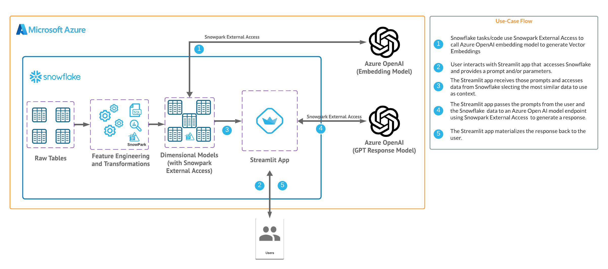
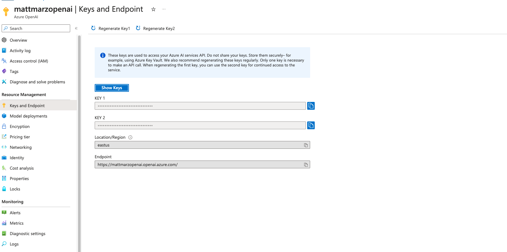
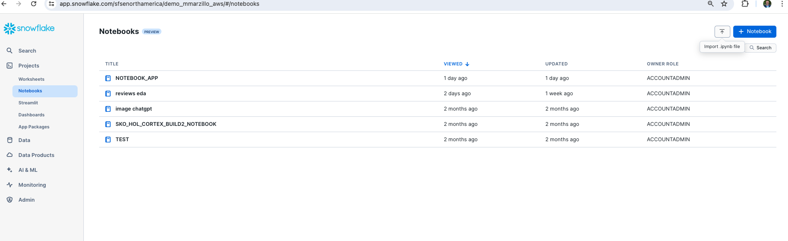
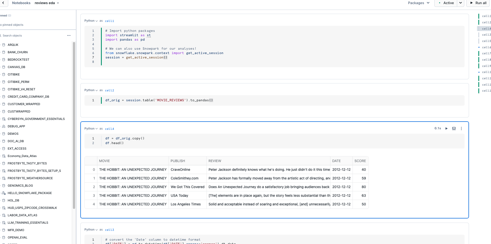
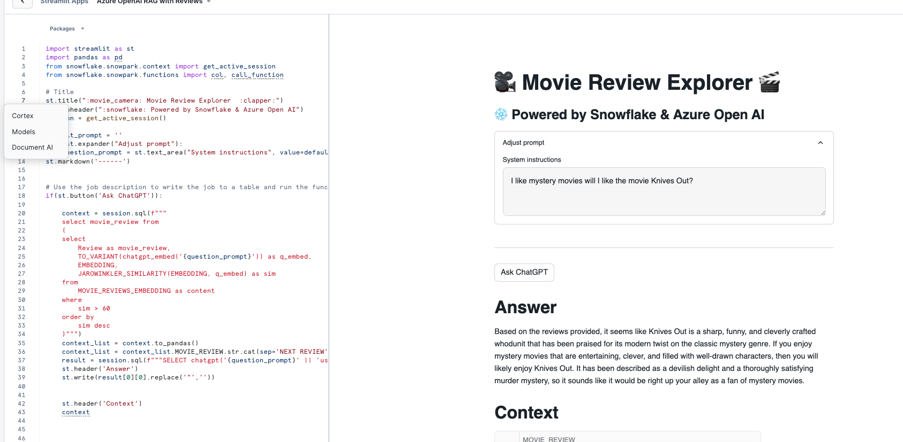

id: using-snowflake-and-azure-openai-for-a-rag-workflow
categories: snowflake-site:taxonomy/solution-center/certification/quickstart, snowflake-site:taxonomy/product/ai
language: en
summary: Using Snowflake with Azure OpenAI to build a RAG workflow 
environments: web
status: Published
authors: Matt Marzillo
feedback link: <https://github.com/Snowflake-Labs/sfguides/issues>

# Using Snowflake with Azure OpenAI to build a RAG workflow
<!-- ------------------------ -->
## Overview


In this quickstart we will build a Streamlit application that leverages Snowpark External Access in Snowflake with Azure OpenAI that will generate a response from leveraging context from Snowflake data.

In summary this is what you will do:
- Set up environments in both Snowflake and Azure.
- Create functions that leverage Snowpark External Access to make a calls to Open AI.
- Store embeddings in Snowflake.
- Create a Streamlit app that leverages the above functions to generate responses using data from Snowflake and prompts.

### What is Generative AI and RAG?

Generative AI is a category of artificial intelligence techniques that enable machines to create new, original content, such as text, images, or music, by learning from existing data. These models, often based on neural networks, generate content by understanding patterns and structures in the training data and then producing novel examples that resemble what they have learned. Generative AI has applications in various fields, including natural language processing, computer vision, and creative arts.

Retrieval Augmentation Generation (RAG) model combines the best of retrieval-based and generative systems for natural language processing tasks. When presented with a prompt, the RAG system first retrieves a set of relevant documents or text snippets from a large corpus of information leveraging vector embeddings. These documents serve as context and support for the generative component of the model. Then, using this additional information, the generative component (an LLM) synthesizes the retrieved information to generate a coherent, informed response or output. This workflow effectively augments the generative model's ability to provide accurate, context-rich, and detailed answers by grounding its responses in concrete retrieved data, enhancing the overall quality and reliability of the information produced. RAG models are particularly useful for complex question answering, where providing accurate and detailed responses is crucial.

### What is Azure OpenAI?
Azure OpenAI is a cloud-based service provided by Microsoft that integrates OpenAI's powerful language models, including GPT-4, into the Azure platform, enabling developers and businesses to build and deploy AI applications with advanced natural language processing capabilities. This collaboration offers high scalability, enterprise-grade security, and compliance features, making it suitable for a wide range of applications, from chatbots to complex data analysis. Users can access Azure's robust infrastructure and tools to train, fine-tune, and manage AI models efficiently. Azure OpenAI simplifies the process of implementing AI solutions while providing the flexibility to customize them according to specific organizational needs.

### What is Snowflake?
Snowflake is a cloud-based data warehousing solution that allows businesses to store and analyze large volumes of data efficiently. It separates storage and compute functionalities, enabling users to scale resources independently and pay only for what they use. Snowflake supports a wide range of data workloads, including data warehousing, data lakes, and data engineering, and offers robust data sharing capabilities across different cloud platforms.

### What is Streamlit?
Streamlit is a Python library that makes it easy to create and share custom web apps for machine learning and data science. In just a few minutes you can build and deploy powerful data apps.

### Pre-requisites
- Familiarity with [Snowflake](/en/developers/guides/getting-started-with-snowflake/) and a Snowflake account
with Access to [Streamlit](https://streamlit.io/) in your Snowflake account.
- [Azure Account](https://azure.microsoft.com) with Azure OpenAI or a stand alone OpenAI service.
- Familiarity with the Python programming language.

### What you’ll build
We will build an efficient architecture all within Snowflake that will access product urls and images in Snowflake and pass that data to a an OpenAI model to generate a recommendation . The architecture will look like this



### Use Case

This use case will leverage movie reviews and we will build a Streamlit app that uses those reviews to answer questions and provide recommendations. More details on the dataset are [here](https://github.com/Azure/azure-openai-samples/tree/main/use_cases/archive/movie_reviews)

<!-- ------------------------ -->
## Azure / Open AI Environment


For this quickstart you can either leverage a Azure OpenAI service or a stand alone OpenAI resource. Depending on timing and your organizations Azure subscription you may be better off utilizing a personal/trial OpenAI service that comes with a nominal cost for the sake of this lab. You will have to navigate to platform.openai.com/api-keys and create a new secret key as it looks below. Make note of the model name and key as you will need this to generate a response. 


If you have access to completion gpt models and embedding models in Azure you can follow the instructions [here](https://learn.microsoft.com/en-us/azure/ai-services/openai/gpt-v-quickstart?tabs=image%2Ccommand-line&pivots=programming-language-studio) to deploy both models in Azure. (at the time of publishing this quickstart we will be using the text-embedding-3-small model and the gpt-3.5-turbo model). Make note of the deployment name for the image model that you deployed.

Head back to the Azure portal and find the Azure Open AI service then click on "Keys and Endpoint" make note of the key and Endpoint as you will need this to generate a response.



<!-- ------------------------ -->
## Snowflake Environment


Open a SQL Worksheet (from the Projects tab) in the Snowflake UI and Copy and paste the below code into your Snowflake worksheet, this will create a table with the movie reviews and the related fields. For the sake of the quickstart we are using the ACCOUNTADMIN role, but in practice you will likely want to use a different, organization specific role.


```sql
--create database and warehouse
use role accountadmin;
CREATE OR REPLACE WAREHOUSE HOL_WH WITH WAREHOUSE_SIZE='X-SMALL';
CREATE OR REPLACE DATABASE REVIEWS_DB;

--create stage
USE DATABASE REVIEWS_DB;
CREATE OR REPLACE STAGE REVIEWS_STAGE
URL='s3://hol-qs-bucket/'
FILE_FORMAT = (TYPE = 'csv');
list @REVIEWS_STAGE;

--create loan_one table
CREATE OR REPLACE TABLE MOVIE_REVIEWS
  (MOVIE STRING,
   PUBLISH STRING,
   REVIEW STRING,
   Date DATE,
   SCORE INT);

COPY INTO MOVIE_REVIEWS FROM @REVIEWS_STAGE/rottentomatoes-400k.csv
FILE_FORMAT = (TYPE = 'CSV' FIELD_OPTIONALLY_ENCLOSED_BY = '"' ESCAPE_UNENCLOSED_FIELD = '\\' SKIP_HEADER = 1) ON_ERROR = 'CONTINUE';

select top 10 * from MOVIE_REVIEWS;
```
<!-- ------------------------ -->
## Exploratory Analysis 


You can download the notebook [here](https://github.com/Snowflake-Labs/sfguide-using-snowflake-and-azure-openai-for-rag-workflow/blob/main/notebook_app.ipynb) and utilize this in Snowflake notebooks to explore the data that was loaded to Snowflake.

You can do this by navigating to "Projects" from the Snowflake UI, selecting "Notebooks" and click the upload button in the top right and uploading the notebook you just downloaded.



You will be able to run through the code to explore the data that we just loaded. If there are any errors related to package requirements you can make those updates using the package install functionality in Snowflake Notebooks.



<!-- ------------------------ -->
## Snowpark External Access to call OpenAI


Now we will work through the below code in a new Snowflake SQL worksheet. This code creates several objects that allows Snowflake to access OpenAI via two functions, one called CHATGPT() and CHATGPT_EMBED() that leverage a network rule and a Snowpark External Access object that allows Snowflake to securely make requests to OpenAI (or any other external service).

You will have to replace the value of the endpoint and the token for the OpenAI service that you are using. Additionally, you may need to replace the name of the model near the bottom of the code that maps to the model/deployment name that you are using.

The last two lines of code here create a new table that adds a field for the embeddings.

```sql
use role ACCOUNTADMIN;
use database REVIEWS_DB;
use warehouse HOL_WH;

CREATE OR REPLACE NETWORK RULE CHATGPT_NETWORK_RULE
    MODE = EGRESS
    TYPE = HOST_PORT
    VALUE_LIST = ('<endpoint>'); --will be 'api.openai.com' if using openai

CREATE OR REPLACE SECRET CHATGPT_API_KEY
    TYPE = GENERIC_STRING
    SECRET_STRING='<openai token>';      

CREATE OR REPLACE EXTERNAL ACCESS INTEGRATION OPENAI_INTEGRATION
    ALLOWED_NETWORK_RULES = (CHATGPT_NETWORK_RULE)
    ALLOWED_AUTHENTICATION_SECRETS = (CHATGPT_API_KEY)
    ENABLED=TRUE;

--Create function for embeddings with azure openai
CREATE OR REPLACE FUNCTION CHATGPT_EMBED(text STRING)
returns array
language python
runtime_version=3.8
handler = 'ask_CHATGPT_EMBED'
external_access_integrations=(OPENAI_INTEGRATION)
packages = ('openai')
SECRETS = ('cred' = chatgpt_api_key )
as
$$
import _snowflake
from openai import OpenAI
client = OpenAI(
    api_key=_snowflake.get_generic_secret_string("cred") )
def ask_CHATGPT_EMBED(text):
    return client.embeddings.create(input = text, model="text-embedding-3-small").data[0].embedding
$$;

--Create function for completion function with Azure OpenAI
CREATE OR REPLACE FUNCTION CHATGPT(prompt STRING)
returns string
language python
runtime_version=3.8
handler = 'ask_CHATGPT'
external_access_integrations=(OPENAI_INTEGRATION)
packages = ('openai')
SECRETS = ('cred' = chatgpt_api_key )
as
$$
import _snowflake
from openai import OpenAI
client = OpenAI(
    api_key=_snowflake.get_generic_secret_string("cred") )
def ask_CHATGPT(prompt):
    response = client.chat.completions.create(
    model="gpt-3.5-turbo",
    messages=[{"role": "system", "content": f"{prompt}"}])
    return response.choices[0].message.content
$$;

-- Create table with embeddings from Azure OpenAI
CREATE OR REPLACE TABLE MOVIE_REVIEWS_EMBEDDING AS 
SELECT *, TO_VARIANT(CHATGPT_EMBED(REVIEW)) AS EMBEDDING FROM MOVIE_REVIEWS_WC;
```

<!-- ------------------------ -->
## Build Streamlit App - With data in Snowflake 


Now that we have our OpenAI functions, let’s build our App.

Go back to the main account view by clicking ‘<- Worksheets’ and then select ‘Streamlit’.

Make sure that you’re still using the ‘ACCOUNTADMIN’ role and then create a new Streamlit app, which should open the app editor directly. You can access this app from the Streamlit view, but make sure to use the same role and that the app is in the same REVIEWS_DB database where the embeddings table is located. You can name the app whatever you would like, something like "Movie Reviews" is appropriate.

Once the app is created paste the below code into the app code and click 'Run' in order to create the Streamlit App!

```python
import streamlit as st
import pandas as pd
from snowflake.snowpark.context import get_active_session
from snowflake.snowpark.functions import col, call_function

# Title
st.title(":movie_camera: Movie Review Explorer 	:clapper:")
st.subheader(":snowflake: Powered by Snowflake & Azure Open AI")
session = get_active_session()

default_prompt = ''
with st.expander("Adjust prompt"):
    question_prompt = st.text_area("System instructions", value=default_prompt).replace("'","")
st.markdown('------') 


# Use the job description to write the job to a table and run the function against it:
if(st.button('Ask ChatGPT')):


    context = session.sql(f"""
    select movie_review from
    (
    select 
        Review as movie_review,
        CAST(chatgpt_embed('{question_prompt}')AS VECTOR(FLOAT, 1536)) as q_embed,
        EMBEDDING,
        VECTOR_COSINE_SIMILARITY(EMBEDDING, q_embed) as sim
    from 
        MOVIE_REVIEWS_EMBEDDING as content
    where
        sim > 60
    order by 
        sim desc
    limit 3
    )""")

    
    context_list = context.to_pandas()
    context_list = context_list.MOVIE_REVIEW.str.cat(sep='NEXT REVIEW').replace("'", "")
    result = session.sql(f"""SELECT chatgpt('{question_prompt}' || 'using the following information as context' || '{context_list}')""").collect()
    st.header('Answer')
    st.write(result[0][0].replace('"','')) 


    st.header('Context')
    context
```

Once you have the app created you can adjust the prompt in the app and change the image selected in order to generate more tailored responses. 

Important to note that the VECTOR_COSINE_SIMILARITY() function is being used here to calculate distance, but other distance functions are available in Snowflake.

<!-- ------------------------ -->
## Conclusion  And Resources


Congratulations! You've successfully built your first Streamlit App with OpenAI for a RAG workload! After setting up our Azure and Snowflake and environments we built two primary things: UDFs that utilize Snowpark External Access to make a call to an OpenAI model and a Streamlit app that leverages that function to make a simple and useful app that can be shared within an organization. With these two, easy to build, Snowflake features we expect customers to see value quickly when using Snowflake and OpenAI!



### What You Learned

- How to set up a Snowflake and Azure / OpenAI environment to integrate the two platforms.
- How to build a Snowpark External Access integration to call OpenAI.
- How to build a Streamlit app that calls OpenAI leveraging tabular and image data from Snowflake.
- How to build your first Generative AI App with image data in Snowflake!


### Related resources 
- [RBAC with External Services](https://www.youtube.com/watch?v=fALb8SosA_U)

- [Prompting](https://github.com/VILA-Lab/ATLAS/blob/main/data/README.md)

- [Streamlit](https://streamlit.io/)

- [Azure OpenAI](https://azure.microsoft.com/en-us/products/ai-services/openai-service)

If you have any questions, reach out to your Snowflake account team!
