author: Becky O’Connor
id: using-snowflake-cortex-and-streamlit-with-geospatial-data
categories: snowflake-site:taxonomy/solution-center/certification/quickstart, snowflake-site:taxonomy/product/analytics, snowflake-site:taxonomy/snowflake-feature/unstructured-data-analysis
language: en
summary: This is a sample Snowflake Guide 
environments: web
status: Published 
feedback link: https://github.com/Snowflake-Labs/sfguides/issues

# Using Snowflake Cortex And Streamlit With Geospatial Data
<!-- ------------------------ -->
## Overview 

Analyzing Location specific data in order to make decisions often requires 'niche' techniques which are often worked on by 'geography' experts.   In snowflake, everyone can be an expert in any location in which they need to understand - whether it's points of interest, transport links or government boundaries - all is feasible using standard functionality available within Snowflake.  

Already, there are so many location specific datasets available within the **Snowflake Marketplace** which significantly reduces data ingestion and engineering time.  Getting access to these datasets are as simple as **Get Data**, where you will enjoy leveraging location specific features using either SQL Queries or Snowpark Dataframes.  And these result sets are then rendered easily using **Streamlit in Snowflake** dashboards.

**Snowflake Cortex LLMs** - are used to save the analyst, engineer or even BI developer time - which can help a multitude of tasks - from improving the readability of location tooltips, to the generation or synthetic data for testing purposes.


In this quickstart, we will be leveraging the the tools within Snowflake to:

  - **Visualise** the location of train stations within the north of england and understand where nearby restaurants are located

  - **Discover** where the locations of Large events are and where they may impact stations and Restaurants

  - **Understand** the weather conditions which might impact train stations
  - **Generate** 
  
    * A warning letter to the MP after discovering potential risk

    * Synthezised events events which might happen and will impact services

  - **Visualise**  the data using Streamlit


### Lab Flow
Here is a flow of what you will achieve if you complete all steps in the quickstart.  You will be reminded of where you are at key intervals.

  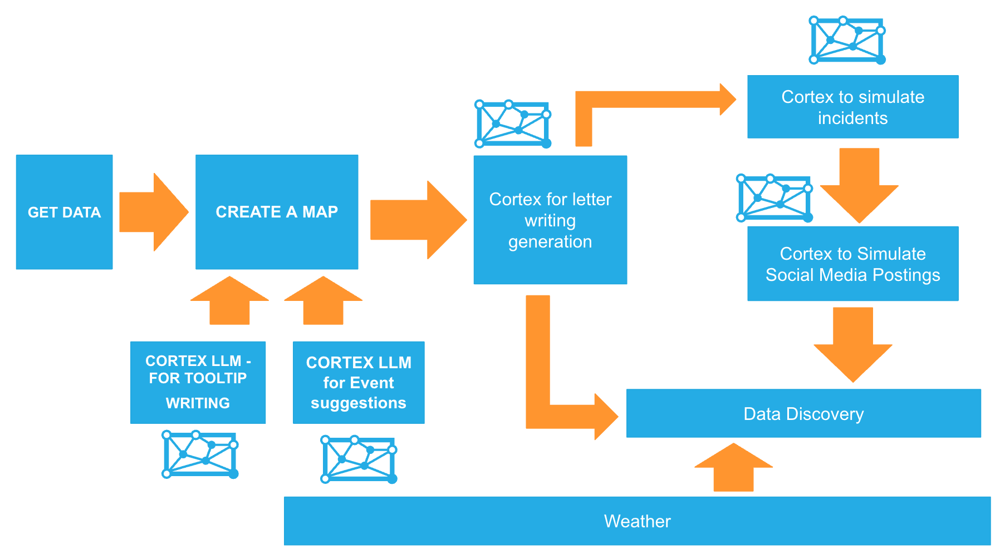


### Prerequisites
- A new free trial of Snowflake in **a region of you choice***.

 


**Note**:  All datasets for this dataset used are either frequently replicated or originate in AWS London.  If you choose an alternative location, you may need to wait 10 minutes for the replication process to finish.


### What You’ll Learn 

- An understanding of Geospatial data in Snowflake
- Using Cortex functions with Snowpark
- Creating a location centric application using Streamlit 
- An insight to UK centric Datasets such as
  - Places of Interest
  - Weather
  - Train Stations
- Using Notebooks and Streamlit to make discoveries and present findings 


### What You’ll Build 
- A streamlit apps and a notebook to visualise your results

<!-- ------------------------ -->
## Initial Setup

Open up a new SQL worksheet and run the following commands. To open up a new SQL worksheet, select Projects » Worksheets, then click the blue plus button and select SQL worksheet.

~~~sql
CREATE OR REPLACE DATABASE BUILD_UK;

CREATE OR REPLACE SCHEMA STREAMLITS;

CREATE OR REPLACE SCHEMA NOTEBOOKS;

CREATE OR REPLACE SCHEMA DATA;

CREATE OR REPLACE WAREHOUSE BUILD_UK_WAREHOUSE;

GRANT USAGE, OPERATE ON WAREHOUSE BUILD_UK_WAREHOUSE TO ROLE ACCOUNTADMIN;

GRANT USAGE ON DATABASE BUILD_UK TO ROLE ACCOUNTADMIN;

-------- use this paramater to try the LLMs using a region which does not currently support them.

ALTER ACCOUNT SET CORTEX_ENABLED_CROSS_REGION = 'ANY_REGION';

~~~


<!-- ------------------------ -->
## Snowflake Marketplace

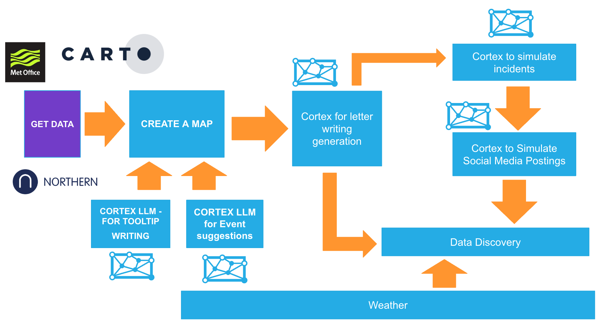
Once logged in go to the Snowflake Marketplace - this is under Data Products > Snowflake Marketplace


Search for Northern Trains Station Data


Press **Get** to get the data from the marketplace.  Do not change the database name.

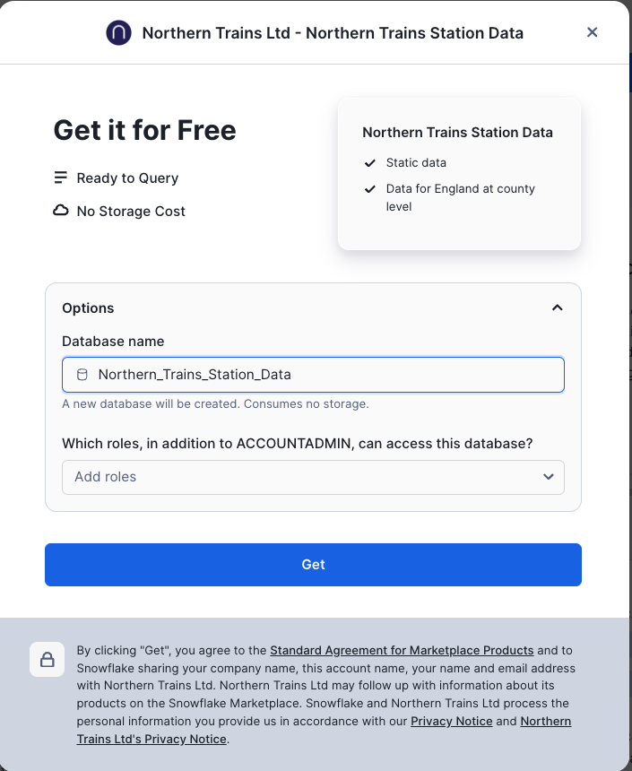

Search for Overture Maps - Places


Click on the following dataset then press **Get** Do not change the database name.

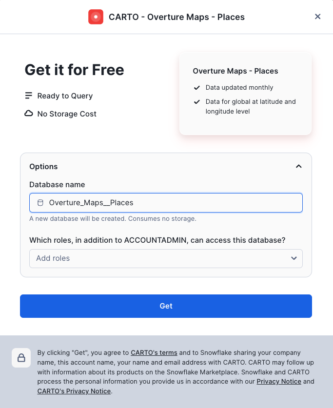


Search for the **Met office Weather Data**
- The exact name is **Postcode Sector Weather Forecasts**
- Press **Try for Free** - Keep the name as it is.  You will have 14 days of free weather data to try for 14 days.

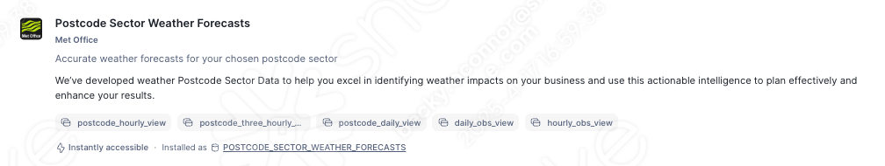

You will have access to the dataset for a period of **14 days**


## Create your First map Layer

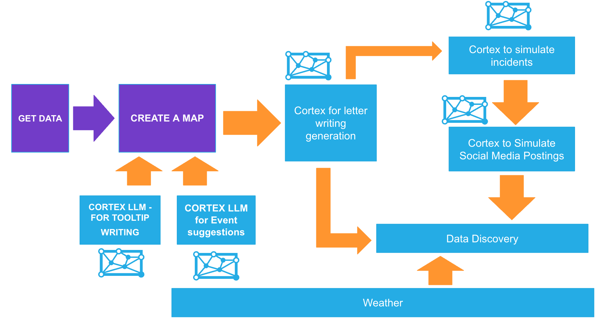

In Snowsight, go back to the home page and select **Projects** » **Notebooks**.

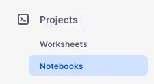
Observe the alternative actions - you can also import a notebook or create one from github repository  (if you have github connected to snowflake).

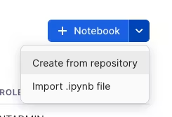

Today we will be creating a new notebook from scratch.

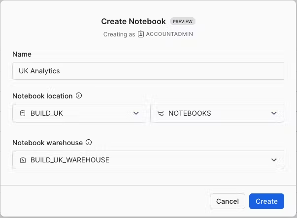

In **Notebook location**, select BUILD_UK from the list of available databases and NOTEBOOKS from the available schemas. All data within the notebook will be held inside the chosen database and schema and will sit inside an automatically generated stage. Select the BUILD_UK_WAREHOUSE and press **Create**.

---
**Note**

> If you wish, you can import the previously created notebook from the following location:

[notebook in Github](https://github.com/Snowflake-Labs/sfguide-using-snowflake-cortex-and-streamlit-with-geospatial-data/blob/main/Trains%20and%20Restaurants.ipynb)

> However, to experience the creation of the notebook yourself, carry on with the blank notebook, and copy/paste the code as we go along.


#### Creating your first Map

Once the notebook has loaded, Remove all cells in the notebook.  You should see something like this:

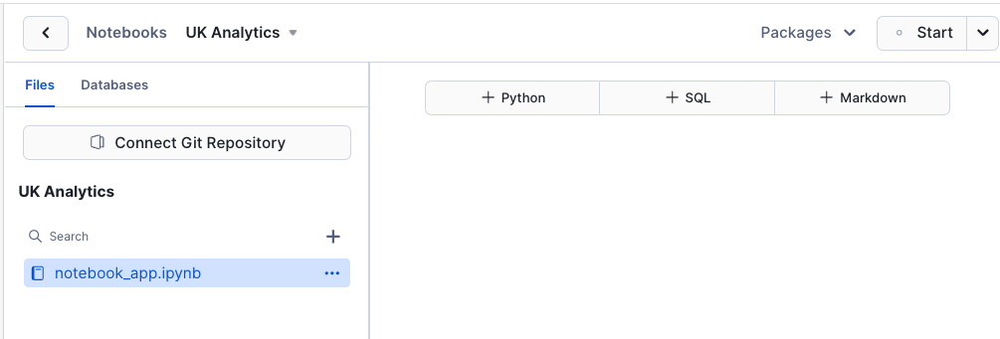

Before we start working in our notebook, we will add an additional package which is not installed as default.  This package is available within the Anaconda Snowflake channel and is easily accessible.

**Add the Pydeck package for visualising location data**

In the top menu, under Packages » Anaconda Packages, import pydeck.  You need this to render maps. 

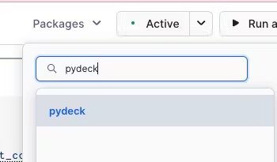

Now we have all the packages we need.  Lets start the notebook by pressing **Start** which is at the top right hand corner of the screen.

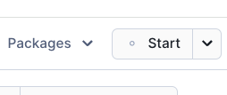

You will be using a variety of Snowflake functions to do some transformation tasks.  Some of the functions are built into the snowpark library (such as array_agg, parse_json), others we need to call using the **call_function** module.  **call_function** allows the user to leverage ANY Snowflake scalar function - you can use this for both built in as well as user defined functions.

All functions are held inside the **snowflake.snowpark.functions** module.

We will import the call_function, streamlit library, json, numpy, pandas and pydeck packages.  For pydeck, you will need to add the package as this is not installed by default.

Click on the + Python button to add a new Python cell.  On the top left hand corner of the screen, you can rename your cell from 'cell1' to something more meaningful.  This is useful for debugging purposes.

**Rename** cell1 to libraries by typing over the text 'cell1'.

Copy and paste the following code into the newly created cell.

```python
# Import python packages
import streamlit as st
from snowflake.snowpark.context import get_active_session
from snowflake.snowpark.functions import *
from snowflake.snowpark.types import *
import json
import pandas as pd
import numpy as np
import pydeck as pdk

# Write directly to the app
st.title("UK Analytics within the North of England :train:")
st.write(
    """This app shows key insight of places and events that may effect Northern Trains.
    """
)

# Get the current credentials
session = get_active_session()
```

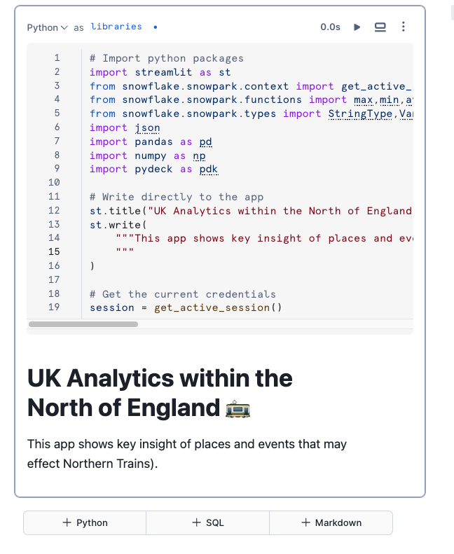

Add a new python cell by hovering over the bottom edge of the cell and select Python.


Rename the the cell to **n_trains_data**


We will firstly leverage the Northern Trains dataset to filter the carto overture maps places dataset.  We want to do this in order to get Points of interests that are relevant for the Northern Trains locality.  Joining by each Station Code would be resource hungry - plus we do not want to join by exact locations, only by roughly where all of the train stations are situated.


**Create a Boundary Box to filter the data based on Northern Trains**


We will be seeing where Northern Train stations are and will create a boundary box to filter all our data so it will be only within the boundaries of the train stations.  Firstly, lets find out where the stations are so we can effectively draw a boundary box around it. 


Copy and paste the code into the new python cell and run this notebook cell: 

```python

trains_latlon = session.table('NORTHERN_TRAINS_STATION_DATA.TESTING."StationLatLong"')

st.markdown('#### A dataframe which shows all the train stations')
st.dataframe(trains_latlon)
st.map(trains_latlon, latitude='Latitude', longitude='Longitude')

```

Below is an example of what you should see

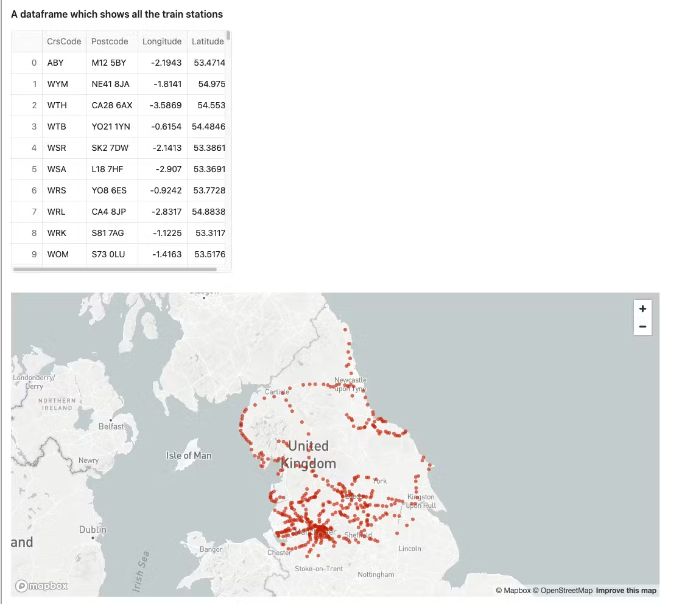

We have created a dataframe which is simply selecting the shared station table.  We have also leveraged Streamlit to create a title,  leveraged st.dataframe to display the snowpark dataframe in a clear way, and finally created a simple map using the streamlit [st.map](https://docs.streamlit.io/develop/api-reference/charts/st.map) function.  

st.map is useful for quickly generating simple maps by rendering latitude and longitude as points.  Pydeck however, has more sophisticated capabilities such as rendering lines, points, polygons and H3 indexes.  We will be leveraging the Pydeck library in the next step

<!-- ------------------------ -->
## Create a Boundary for filtering purposes


You previously loaded the places dataset from Carto Overture maps.  This dataset offers a comprehensive list of places of interest across the world such as restaurants, bars and schools.  We want to filter this dataset to only list places of interest that occur within the Northern Trains locality.  Creating a Boundary box is the easiest option.

Copy and Paste the following into a new cell and name the new cell **boundary_box**

```python
#create a point from the coordinates
envelope = trains_latlon.with_column('POINT',call_function('ST_MAKEPOINT',col('"Longitude"'),col('"Latitude"')))

#collect all the points into one row of data
envelope = envelope.select(call_function('ST_COLLECT',col('POINT')).alias('POINTS'))

#### convert from geography to geometry
envelope = envelope.select(to_geometry('POINTS').alias('POINTS'))


#create a rectangular shape which boarders the minimum possible size which covers all of the points
envelope = envelope.select(call_function('ST_ENVELOPE',col('POINTS')).alias('BOUNDARY'))

#convert back to geography
envelope = envelope.select(to_geography('BOUNDARY').alias('BOUNDARY'))
envelope.collect()[0][0]

```
You will see this has generated 5 sets of coordinates in order to draw the boundary box.  

>**FACT:** Every **valid** polygon will have the same last pair of coordinates as the first pair.   Lets visualise what this looks like using the library pydeck.  Although st.map is useful for simple quick visualisation of points, pydeck has the ability to visualise lines, points and polygons in 2D and 3D.  It also has layer options for lines, points, icons and H3 indexes.

https://deckgl.readthedocs.io/en/latest/

Add a new Python cell and name it **boundary_layer**.  Copy and paste the following:

```python
#find the centre point so the map will render from that location

centre = envelope.with_column('CENTROID',call_function('ST_CENTROID',col('BOUNDARY')))
centre = centre.with_column('LON',call_function('ST_X',col('CENTROID')))
centre = centre.with_column('LAT',call_function('ST_Y',col('CENTROID')))

#create LON and LAT variables

centrepd = centre.select('LON','LAT').to_pandas()
LON = centrepd.LON.iloc[0]
LAT = centrepd.LAT.iloc[0]

### transform the data in pandas so the pydeck visualisation tool can view it as a polygon

envelopepd = envelope.to_pandas()
envelopepd["coordinates"] = envelopepd["BOUNDARY"].apply(lambda row: json.loads(row)["coordinates"][0])


####visualise on a map

#### create a layer - this layer will visualise the rectangle

polygon_layer = pdk.Layer(
            "PolygonLayer",
            envelopepd,
            opacity=0.3,
            get_polygon="coordinates",
            filled=True,
            get_fill_color=[16, 14, 40],
            auto_highlight=True,
            pickable=False,
        )

 
#### render the map 
    
st.pydeck_chart(pdk.Deck(
    map_style=None,
    initial_view_state=pdk.ViewState(
        latitude=LAT,
        longitude=LON,
        zoom=5,
        height=400
        ),
    
layers= [polygon_layer]

))
```

You will see that to render the map, we present the data in a format for pydeck to accurately read.  The final transformed dataset is a pandas dDataframe.  We specify the dataframe in a pydeck layer, then apply this layer to a streamlit pydeck chart.  If we want, we can use the same logic in order to create a streamlit app.  Snowflake Notebooks are great as you can render streamlit on the fly - without having to run the ‘app’ separately.


When you run the cell, the boundary box should look like this:

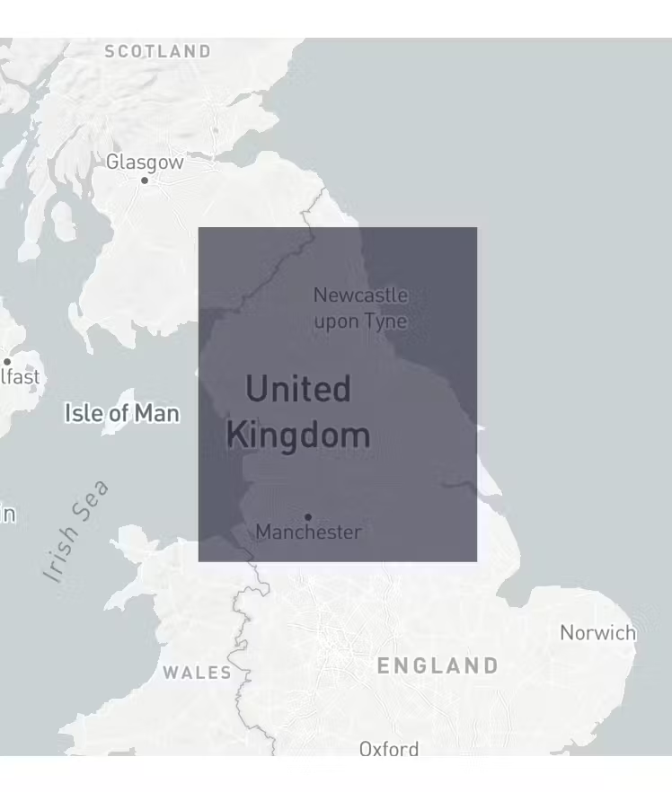

<!-- ------------------------ -->
## Filtering the data using the boundary box

Next, lets leverage and filter the overture maps so these will only consist of data within this area.  Overture maps consist of location data across the entire globe.

Create and preview the places dataframe - we are also filtering to only display places in the UK.

Copy and paste the python code into a new python cell.  Name the cell **places_dataset**

```python

places_1 = session.table('OVERTURE_MAPS__PLACES.CARTO.PLACE')
places_1 = places_1.filter(col('ADDRESSES')['list'][0]['element']['country'] =='GB')

places_1.limit(3)
```
When you run the cell, you will see there is a lot of semi structured data returned.  We will use snowflake’s native **semi structured** querying capability to take key elements out of the data which includes information concerning the location

In a new cell which you will name **places_refined**, paste the following and run the cell:

```python

places_2 = places_1.select(col('NAMES')['primary'].astype(StringType()).alias('NAME'),
                        col('PHONES')['list'][0]['element'].astype(StringType()).alias('PHONE'),
                      col('CATEGORIES')['primary'].astype(StringType()).alias('CATEGORY'),
                        col('CATEGORIES')['alternate']['list'][0]['element'].astype(StringType()).alias('ALTERNATE'),
                    col('websites')['list'][0]['element'].astype(StringType()).alias('WEBSITE'),
                      col('GEOMETRY'))
                        

places_2.limit(10)
```
This is what you should see.  The exact dataset set may ot be the same as the screenshot but will contain the same type of data.
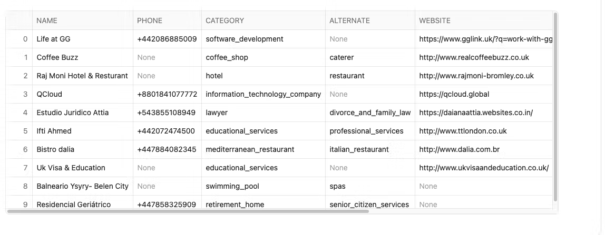

You will now filter the data to only view places which are categorised as **train_station**.

Copy and paste the code below into a new **python** cell.  Name the cell **places_filtered_boundary**

```python
places_3 = places_2.filter(col('CATEGORY') =='train_station')

places_3 = places_3.join(envelope,call_function('ST_WITHIN',places_3['GEOMETRY'],envelope['boundary']))
places_3 = places_3.with_column('LON',call_function('ST_X',col('GEOMETRY')))
places_3 = places_3.with_column('LAT',call_function('ST_Y',col('GEOMETRY')))
st.write(places_3)

```
We can view the points on a map easily by using st.map(places) but as pydeck has many more options such as different mark types, tool tips and layers we will create an additional pydeck layer which adds this data to the previously created data layer.  When you hover over in the boundary box you will see a tooltip containing the  alternate category as well as the place name.

Copy and paste the following into a new cell and name the cell **places_visualised**:

```python

placespd = places_3.to_pandas()
poi_l = pdk.Layer(
            'ScatterplotLayer',
            data=placespd,
            get_position='[LON, LAT]',
            get_color='[255,255,255]',
            get_radius=600,
            pickable=True)

#### render the map showing trainstations based on overture maps
    
st.pydeck_chart(pdk.Deck(
    map_style=None,
    initial_view_state=pdk.ViewState(
        latitude=LAT,
        longitude=LON,
        zoom=5,
        height=400
        ),
    
layers= [polygon_layer, poi_l], tooltip = {'text':"Place Name: {NAME}, alternate: {ALTERNATE}"}

))

```
- Go back to **places_filter_boundary** cell and modify the category in the filter from train_station to restaurant. 


- Select **Run all below**.  These steps will start from retreiving a fresh table from the marketplace table:

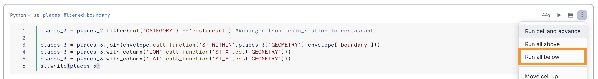

The results should look like this.

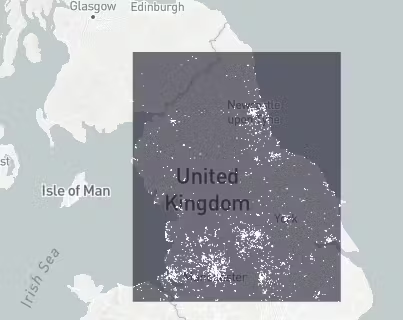

Now we have a map with all the restaurants within the Northern trains boundary.  Lets now compare this with another layer which shows the train stations provided by Northern Trains.  We have already loaded the train station locations into the notebook when we created the boundary box.  

Create a new cell and name it **trains_visualised**.  Copy and paste the following:

```python

trains_latlon_renamed = trains_latlon

trains_latlon_renamed = trains_latlon_renamed.with_column_renamed('"CrsCode"','NAME')
trains_latlon_renamed = trains_latlon_renamed.with_column_renamed('"Postcode"','ALTERNATE')
trains_latlon_renamed = trains_latlon_renamed.with_column_renamed('"Latitude"','LAT')
trains_latlon_renamed = trains_latlon_renamed.with_column_renamed('"Longitude"','LON')
trains_latlon_renamed_pd = trains_latlon_renamed.to_pandas()

nw_trains_l = pdk.Layer(
            'ScatterplotLayer',
            data=trains_latlon_renamed_pd,
            get_position='[LON, LAT]',
            get_color='[0,187,255]',
            get_radius=600,
            pickable=True)

#### render the map showing trainstations based on overture maps
    
st.pydeck_chart(pdk.Deck(
    map_style=None,
    initial_view_state=pdk.ViewState(
        latitude=LAT,
        longitude=LON,
        zoom=5,
        height=400
        ),
    
layers= [polygon_layer, poi_l, nw_trains_l], tooltip = {'text':"Place Name: {NAME}, alternate: {ALTERNATE}"}

))

```
We have now rendered a multi layer map which overlays restaurants and northern rail train stations.  Next, we will leverage Cortex to curate descriptive tooltips derived by station attributes.

<!-- ------------------------ -->
## Use Cortex to describe the Train Stations

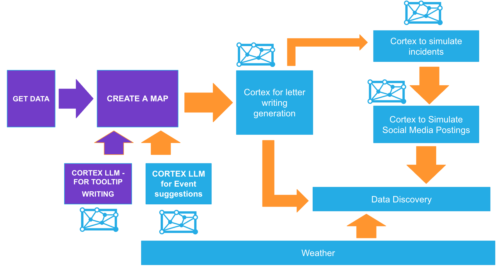
At the moment we only have very basic train station information.  Lets add more info from the shared dataset:

Copy and paste the following code into a new cell.  Name the cell **station_attributes**  

```python

further_train_info_1 = session.table('NORTHERN_TRAINS_STATION_DATA.TESTING."STATION ATTRIBUTES 2"')
further_train_info_1.limit(4)

```

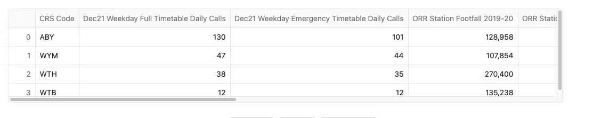

We have quite a bit of information, it would be great if we can  use Snowflake Cortex LLM to explain this data and then we could add the results to our tool tip!! Right now we only have the postcode in the tooltip.

Let's do that by creating a new cell.  Name the cell **cortex_tooltip**.  

Paste the following into the new cell and run. This takes around 1.5 minutes to complete as it will write a summary report for all 400 train stations.

```python

further_train_info_2= further_train_info_1.with_column('OBJECT',object_construct(lit('CRS Code'),
col('"CRS Code"'),
lit('Full Timetable Calls'),
col('"Dec21 Weekday Full Timetable Daily Calls"').astype(IntegerType()),
lit('Emergency Timetable Calls'),
col('"Dec21 Weekday Emergency Timetable Daily Calls"').astype(IntegerType()),
lit('Footfall'),
col( '"ORR Station Footfall 2020-21"').astype(IntegerType()),
lit('Parking'),
col('"Car Parking - Free/Chargeable"'),
lit('MP'),
col("MP"),
lit("Political Party"),
col('"Political Party"'),
lit('MP Email Address'),
col('"MP Email Address"'),                                                                             
lit('Car Parking Spaces'),
col('"Car Parking Spaces"').astype(IntegerType()),
lit('Staffed?'),
col('"Staffed?"'))).cache_result()

prompt = 'In less than 200 words, write a summary based on the following train station details.  \
The trainstations are based in the North of England. \
Only include Northern train station names in the description.'
prompt2 = 'write in the best way for it to describe a point on a map.'

further_train_info_2 = further_train_info_2.select('"CRS Code"',
        'MP',
        '"Political Party"', 
        '"MP Email Address"',
        call_function('snowflake.cortex.complete','mistral-large2',
            concat(lit(prompt),
            col('OBJECT').astype(StringType()),
            lit('prompt2'))).alias('ALTERNATE'))

further_train_info_2.write.mode('overwrite').save_as_table("DATA.TRAIN_STATION_INFORMATION")
station_info = session.table('DATA.TRAIN_STATION_INFORMATION')
station_info.limit(5)

```

While we wait for the train station tooltips to materialize add a **markdown cell** above the cell we have just created. Markdown is useful to help tell a data story within the notebook. Hover above the newly created cell which is currently running and press  **Markdown**.  Name the cell **cortex_description** and paste the following narrative:

```markdown


Below we are leveraging Mistral-large2 to produce meaningful tooltips relating to over **400** train stations which are managed by **Northern Trains**

```
Press the tick on the top right hand side of the cell to confirm the edit.


We used **call_function** to call Snowflake Cortex complete which returns a response that completes an input prompt. Snowflake Cortex runs LLMs that are fully hosted and managed by Snowflake, requiring no setup. In this example, we are using  Mistral-Large2, an open enterprise-grade LLM model fully managed by Snowflake.

You should get a new table that will look like this:

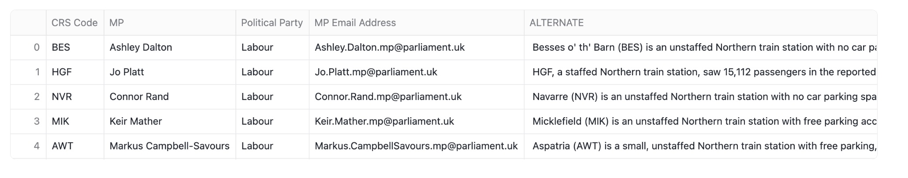

> **IMPORTANT** Comment out the write to table command to prevent the LLM being called every time you refresh the notebook.  We now have the data saved in a table so you do not need to run this model again.

```python

# further_train_info_2.write.mode('overwrite').\
# save_as_table("DATA.TRAIN_STATION_INFORMATION")

```

Ok, let's now revise the map.  Create a new python cell and name it **visualise_tooltip** Add the following code:

```python
trains_latlon_renamed = trains_latlon

trains_latlon_renamed = trains_latlon_renamed.with_column_renamed('"CrsCode"','NAME')
trains_latlon_renamed = trains_latlon_renamed.with_column_renamed('"Latitude"','LAT')
trains_latlon_renamed = trains_latlon_renamed.with_column_renamed('"Longitude"','LON')

station_info = session.table('DATA.TRAIN_STATION_INFORMATION')

trains_latlon_renamed = trains_latlon_renamed.join(station_info,station_info['"CRS Code"']==trains_latlon_renamed['NAME']).drop('"CRS Code"')
trains_latlon_renamed_pd = trains_latlon_renamed.to_pandas()

nw_trains_l = pdk.Layer(
            'ScatterplotLayer',
            data=trains_latlon_renamed_pd,
            get_position='[LON, LAT]',
            get_color='[0,187,2]',
            get_radius=600,
            pickable=True)

#### render the map showing trainstations based on overture maps

tooltip = {
   "html": """<b>Name:</b> {NAME} <br> <b>Alternate:</b> {ALTERNATE}""",
   "style": {
       "width":"50%",
        "backgroundColor": "steelblue",
        "color": "white",
       "text-wrap": "balance"
   }
}
    
st.pydeck_chart(pdk.Deck(
    map_style=None,
    initial_view_state=pdk.ViewState(
        latitude=LAT,
        longitude=LON,
        zoom=5,
        height=700
        ),
    
layers= [polygon_layer, poi_l, nw_trains_l], tooltip = tooltip

))
```

Hover over the map and checked the updated tool tips.

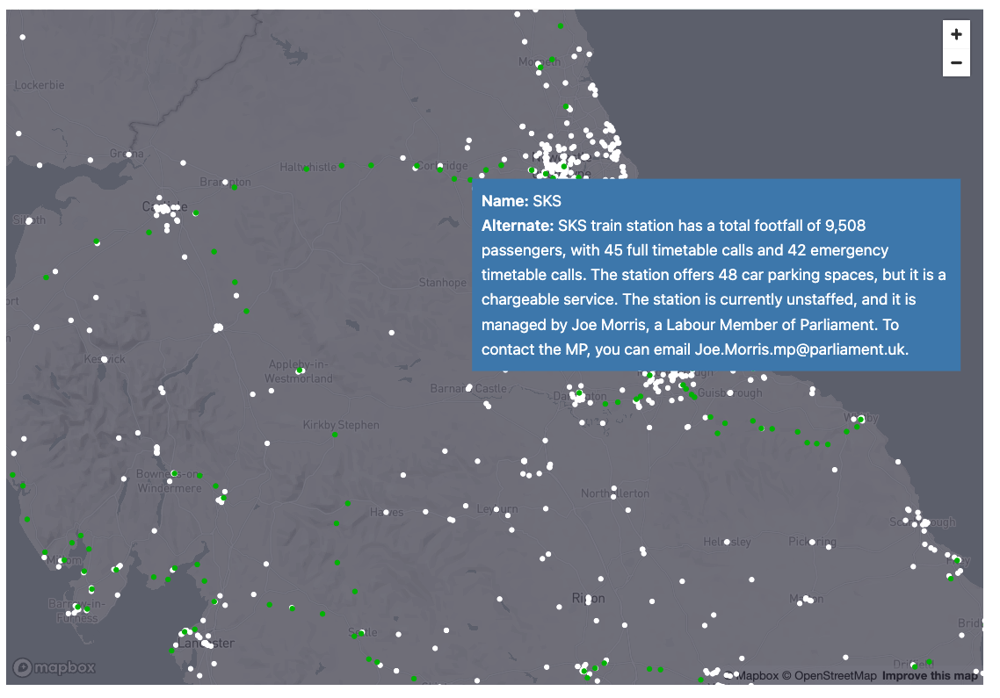

<!-- ------------------------ -->
## Use Cortex to list Key location events


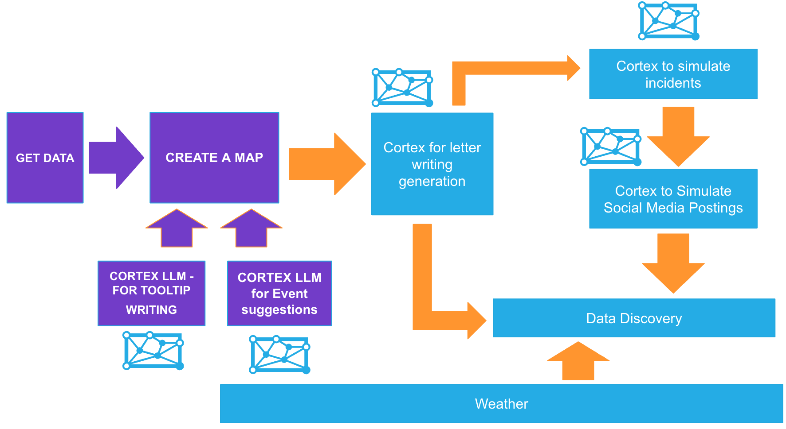
Any location may be impacted by key events.  Let's try and pinpoint out any key event happening in the north of England and how restaurants and train stations may be impacted by this.  We do not have specific event data for this, so in this case, we will leverage Snowflake Cortex to suggest events that may impact this area.  


Create the following in a new cell named **cortex_events**.  This will generate event data and saves the results in a new table.  

```python
json1 = '''{"DATE":"YYYY-MM-DD", "NAME":"event",DESCRIPTION:"describe what the event is" "CENTROID":{
  "coordinates": [
    0.000000<<<this needs to be longitude,
    0.000000<<<<this needs to be latitude
  ],
  "type": "Point"
},"COLOR":"Random bright and unique color in RGB presented in an array"}'''


prompt = f''' Retrieve 6 events within different cities of the north of england and will happen in 2024.  do not include commentary or notes retrive this in the following json format {json1}  '''
events_1 = session.create_dataframe([{'prompt':prompt}])

events_1 = events_1.select(call_function('SNOWFLAKE.CORTEX.COMPLETE','mistral-large2',prompt).alias('EVENT_DATA'))

events_1 = events_1.with_column('EVENT_DATA',replace(col('EVENT_DATA'),'''```json''',''))
events_1 = events_1.with_column('EVENT_DATA',replace(col('EVENT_DATA'),'''```''',''))

events_1.write.mode('overwrite').save_as_table("DATA.EVENTS_IN_THE_NORTH")
session.table('DATA.EVENTS_IN_THE_NORTH')
```

Again, we will utilise the semi-structured support in Snowflake to flatten the retrieved json to transpose a data frame in a table format

Copy and paste the code below into a new cell which you will rename as **events_normalised**:

```python

events_2 = session.table('DATA.EVENTS_IN_THE_NORTH')
events_2 = events_2.join_table_function('flatten',parse_json('EVENT_DATA')).select('VALUE')
events_2=events_2.with_column('NAME',col('VALUE')['NAME'].astype(StringType()))
events_2=events_2.with_column('DESCRIPTION',col('VALUE')['DESCRIPTION'].astype(StringType()))
events_2=events_2.with_column('CENTROID',to_geography(col('VALUE')['CENTROID']))
events_2=events_2.with_column('COLOR',col('VALUE')['COLOR'])
events_2=events_2.with_column('DATE',col('VALUE')['DATE'].astype(DateType())).drop('VALUE')
events_2

```

### Leveraging H3

We now have a list of events in a new table.  We would like to utilise this to understand the restaurants and train stations which may be impacted. H3 indexes are a way to bucket multiple points into a standardised grid.  H3 buckets points into hexagons.   Every hexagon at each resolution has a unique index. This index can also be used to join with other datasets which have also been indexed to the same standardised grid. We will do this later in the lab.


Create a new cell which you will name **h3index**.  Add the H3 Index at resolution 5 to the dataframe

```python

events_3=events_2.with_column('H3',call_function('H3_POINT_TO_CELL_STRING',col('CENTROID'),lit(5)))

events_3

```
You will see a new column called H3:

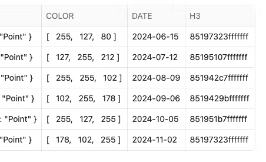

We will now add these events onto the map as another layer.  Add a new cell and name it **visualise_h3**.

```python

events = events_3.with_column('R',col('COLOR')[0])
events = events.with_column('G',col('COLOR')[1])
events = events.with_column('B',col('COLOR')[2])
events = events.with_column_renamed('DESCRIPTION','ALTERNATE')
eventspd = events.group_by('H3','NAME','ALTERNATE','R','G','B').count().to_pandas()

st.write(eventspd)

h3_events = pdk.Layer(
        "H3HexagonLayer",
        eventspd,
        pickable=True,
        stroked=True,
        filled=True,
        extruded=False,
        get_hexagon="H3",
        get_fill_color=["255-R","255-G","255-B"],
        line_width_min_pixels=2,
        opacity=0.4)

#### render the map showing trainstations based on overture maps

tooltip = {
   "html": """<b>Name:</b> {NAME} <br> <b>Alternate:</b> {ALTERNATE}""",
   "style": {
       "width":"50%",
        "backgroundColor": "steelblue",
        "color": "white",
       "text-wrap": "balance"
   }
}

st.pydeck_chart(pdk.Deck(
    map_style=None,
    initial_view_state=pdk.ViewState(
        latitude=LAT,
        longitude=LON,
        zoom=5,
        height=600
        ),
    
layers= [polygon_layer, poi_l, h3_events,nw_trains_l, ], tooltip = tooltip

))

```
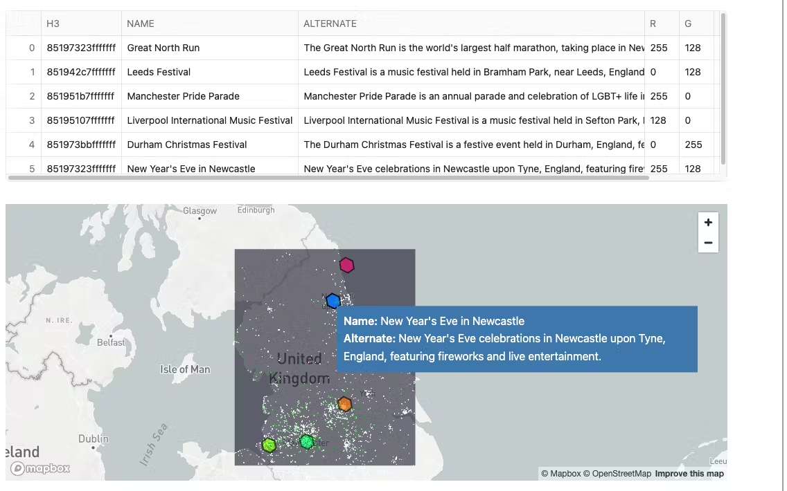


So we can see the train stations and restaurants that might be impacted by the events.  The events rendered may be different to what is shown in the screenshot.  Lets create a dataset that extracts only the impacted areas.

Join the Events data frame to The Train Stations Data frame.  Then, Join the Events Data frame to the Restaurants Data frame.


You may notice that there are  new  H3 columns for the restaurants and places of the same resolution as the events.  This naturally creates a key to join to.  There is also a new column which displays the distance away the restaurant is from the event.   This was created using a standard geospatial function.  Copy and paste the following into a new cell called **affected_by_events**

```python

trains_h3 = trains_latlon_renamed.with_column('H3',call_function('H3_LATLNG_TO_CELL_STRING',col('LAT'),col('LON'),lit(5)))
trains_h3 = trains_h3.join(events.select('H3',col('NAME').alias('EVENT_NAME'),'DATE'),'H3')

st.markdown('#### Affected Train Stations')
st.write(trains_h3.limit(1))
places_h3 = places_3.with_column('H3',call_function('H3_POINT_TO_CELL_STRING',col('GEOMETRY'),lit(5)))
places_h3 = places_h3.join(events.select('H3','CENTROID',col('NAME').alias('EVENT_NAME'),'DATE'),'H3')
places_h3 = places_h3.with_column('DISTANCE_FROM_EVENT',call_function('ST_DISTANCE',col('CENTROID'),col('GEOMETRY')))
places_h3 = places_h3.filter(col('DISTANCE_FROM_EVENT')< 3000)
places_h3 = places_h3.sort(col('DISTANCE_FROM_EVENT').asc())
st.markdown('#### Affected Restaurants')                             
st.write(places_h3.limit(10))

```

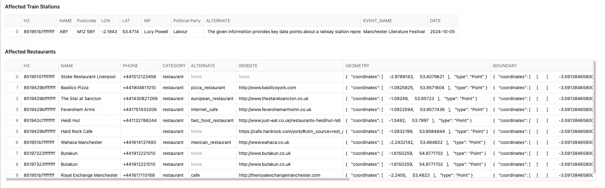

We now have all of this joined together - in the next step we will use an LLM to write a letter to each MP which details the concerns which may impact the events.

<!-- ------------------------ -->
## Use Cortex to write relevant correspondence

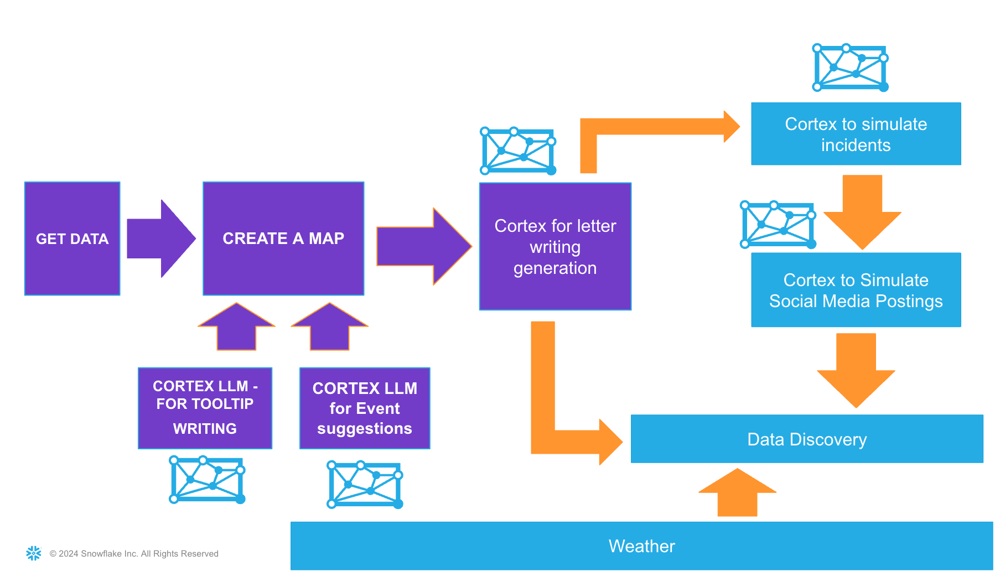

Now that we can see where the events impact stations and restaurants, let's  use an LLM to craft a letter to the MP to notify them of these effects.  To do this, we need to put all the information needed into objects to  easily pass them through the cortex function.

Create an object which links all affected restaurants to the respective MP.  We are also including the distance from the event for each restaurant.  

Create a new cell celled **letter_restaurants** and copy and paste the following code into the cell:

```python

object3 = trains_h3.select('H3','MP','"MP Email Address"').distinct()
object3 = places_h3.join(object3,'H3')  
object3 = object3.group_by('MP','"MP Email Address"').agg(array_agg(object_construct(lit('NAME'),
                                                                col('NAME'),
                                                                lit('DISTANCE_FROM_EVENT'),
                                                                round('DISTANCE_FROM_EVENT',5).astype(DecimalType(20,4)),
                                                                lit('PHONE'),
                                                                col('PHONE'),
                                                               lit('WEBSITE'),
                                                               col('WEBSITE'))).within_group('MP').alias('RESTAURANTS'))
object3


```

You will now create another object which links all the affected trains stations to the respective MP.  Copy and paste the following code into a new python cell called **letter_trains**

```python

object1 = trains_h3.group_by('MP').agg(array_agg(object_construct(lit('Train Station information'),col('ALTERNATE'))).within_group('MP').alias('TRAIN_STATIONS'))
object1

```
Create an object which links all affected events to the respective MP.  Create a new python cell called **letter_events** and paste the following code into it:

```python

object2 = trains_h3.select('MP','EVENT_NAME','DATE').distinct()
object2 = object2.group_by('MP').agg(array_agg(object_construct(lit('EVENT'),col('EVENT_NAME'),lit('DATE'),col('DATE'))).within_group('MP').alias('EVENTS'))
object2

```

you will now join all these objects together and persist the results in a table.  Create a new cell called **letter_object** and copy and paste the python below into it: 

```python

all_3 = object1.join(object2,'MP')
all_3 = all_3.join(object3,'MP')

all_3.write.mode('overwrite').save_as_table("DATA.EVENTS_AND_WHAT_IS_AFFECTED")
session.table('DATA.EVENTS_AND_WHAT_IS_AFFECTED')
```

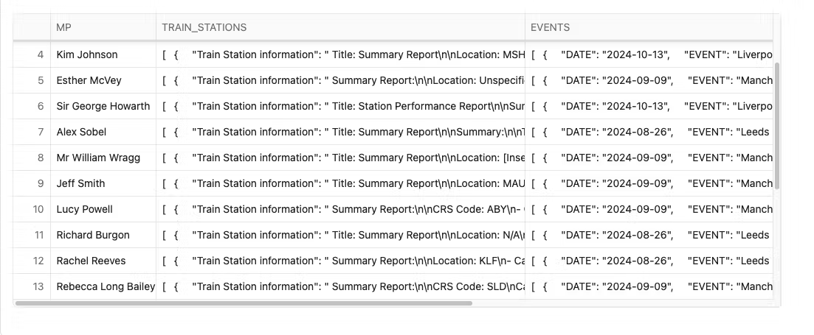

The results can include a large number of restaurants by MP, so let's only  refer to the first 8 restaurants for each MP letter based on distance from the event.  The array_slice method does just that.  Create a new Python cell called **filt_restaurant_obj** and paste the following python content into it:

```python
all_4 = session.table("DATA.EVENTS_AND_WHAT_IS_AFFECTED")
all_4 = all_4.select('MP','"MP Email Address"','TRAIN_STATIONS','EVENTS',
                     
array_slice(col('RESTAURANTS'),lit(0),lit(8)).alias('RESTAURANTS'))

          
all_4

```

Create a prompt for the LLM which pulls all this information together.  You may want to change who the letter is written to.  The prompt will encourage the letter to be written by Becky.


Copy the code below into a new python cell called **prompt_letter**

```python

col1,col2,col3, col4 = st.columns(4)

with col1:
    name = st.text_input('Name:','''Becky O'Connor''')
with col2:
    email = st.text_input('Email:','becky.oconnor@snowflake.com')
with col3:
    title = st.text_input('Title:','a concerned Citizen')
with col4:
    style = st.text_input('Style:','a worried resident')


prompt = concat(lit('Write an email addressed to this MP:'),
                lit('in the style of '),
                lit(style),
                col('MP'),
               lit('about these events: '),
               col('EVENTS').astype(StringType()),
               lit('effecting these stations: '),
               col('TRAIN_STATIONS').astype(StringType()),
                lit('And these Restaurants: '),
                col('RESTAURANTS').astype(StringType()),
               lit(f'''The letter is written by {name} - {email} - {title}'''))

st.info(f'''Letters will be generated from {name} - {email} - {title} in the style of {style}''')
```

Once you run the cell, change the prompts to reflect a sender of your choice.

Call the LLM with the prompt by copying the code below into a new cell. You may want to be creative and change who the letter is written by, or even ask Cortex to write it in the style of someone. The LLM we are using for this is Mixtral-8x7b as its good at writing letters.  Copy and paste the following in a new python cell called **cortex_letter**

```python

letters = all_4.select('MP','"MP Email Address"', call_function('SNOWFLAKE.CORTEX.COMPLETE','mixtral-8x7b',prompt).alias('LETTER'))
letters.write.mode('overwrite').save_as_table("DATA.LETTERS_TO_MP")

```

We have now saved our letters.  The next task is to view the letters by copying this code into a new python cell called **new_letters**:

```python
letters = session.table('DATA.LETTERS_TO_MP')
letters
```
The code below  allows the user to browse the letters with a slider and visualise a letter.Try it out by copying the code into a new python cell called **letter_reader**.

```python

letterspd = letters.to_pandas()
selected_letter = st.slider('Choose Letter:',0,letterspd.shape[0]-1,1)
st.markdown(f''' **Email**: {letterspd['MP Email Address'].iloc[selected_letter]}''')
st.write()
st.write(letterspd.LETTER.iloc[selected_letter])

```

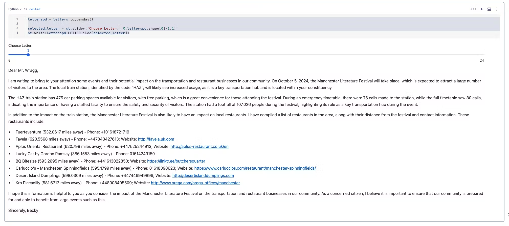

That's it. If you wish, you can download the completed python code from here by exporting it as .ipynb that could be used to import it into a new notebook. 

<!-- ------------------------ -->
## Generate Synthetic Incidents

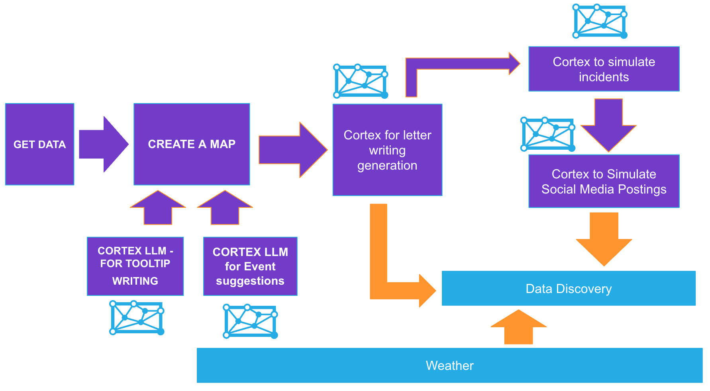

This streamlit application will generate events occurring during the time of the events, which will involve the train stations and the restaurants.  

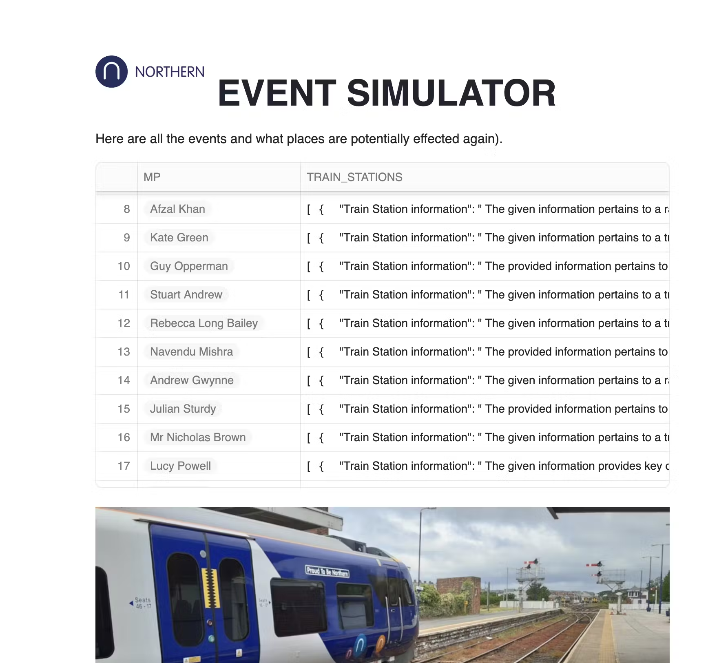

Go back to the home page and Navigate to Streamlit which is within the Projects Menu.

Add a new Streamlit App


Populate the prompts as suggested below.

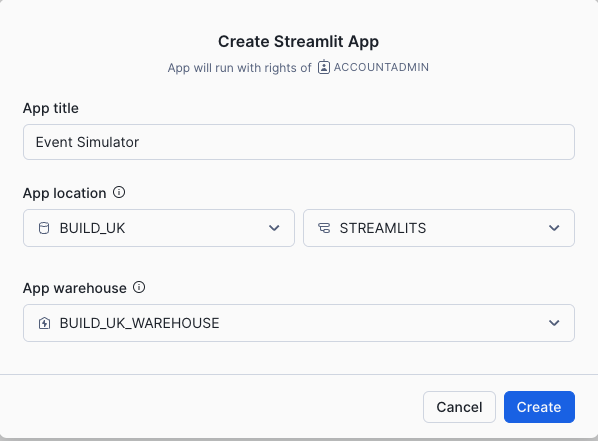


- Replace all the sample code with what is provided below:
- [The code is also found here](https://github.com/Snowflake-Labs/sfguide-using-snowflake-cortex-and-streamlit-with-geospatial-data/blob/main/sis001.py)

```python

# Import python packages
import streamlit as st
from snowflake.snowpark.context import get_active_session
from snowflake.snowpark.functions import col, call_function, lit,concat, parse_json,object_construct,replace
from snowflake.snowpark.types import StringType, FloatType, ArrayType, VariantType, DateType


# Write directly to the app


# Get the current credentials
session = get_active_session()

st.markdown(
    """
    <style>
    .heading{
        background-color: rgb(41, 181, 232);  /* light blue background */
        color: white;  /* white text */
        padding: 60px;  /* add padding around the content */
    }
    .tabheading{
        background-color: rgb(41, 181, 232);  /* light blue background */
        color: white;  /* white text */
        padding: 10px;  /* add padding around the content */
    }
    .veh1 {
        color: rgb(125, 68, 207);  /* purple */
    }
    .veh2 {
        color: rgb(212, 91, 144);  /* pink */
    }
    .veh3 {
        color: rgb(255, 159, 54);  /* orange */
    }
    .veh4 {
        padding: 10px;  /* add padding around the content */
        color: rgb(0,53,69);  /* midnight */
    }
    
    body {
        color: rgb(0,53,69);
    }
    
    div[role="tablist"] > div[aria-selected="true"] {
        background-color: rgb(41, 181, 232);
        color: rgb(0,53,69);  /* Change the text color if needed */
    }
    
    </style>
    """,
    unsafe_allow_html=True
)

col1,col2 = st.columns([0.2,0.8])


st.markdown('<h1 class="heading">EVENT SIMULATOR</h2>', unsafe_allow_html=True)
st.write(
    """<BR>Here are all the events and what places are potentially affected again.
    """,unsafe_allow_html=True
)


####Use a higher order filter to filter each array to only show restaurants that are no more than 250m from the event and include this in the LLM

events_what_affected = session.sql('SELECT MP, TRAIN_STATIONS,EVENTS,CASE WHEN ARRAY_SIZE(RESTAURANTS) >10 THEN FILTER(RESTAURANTS,i -> i:DISTANCE_FROM_EVENT <=250) ELSE RESTAURANTS END RESTAURANTS FROM DATA.EVENTS_AND_WHAT_IS_AFFECTED')
mps = events_what_affected.select('MP').to_pandas()

with st.expander("View Prompt Information"):
    st.dataframe(events_what_affected,column_config={
                                    'MP':st.column_config.ListColumn('MP',
                                     help='The current acting MP responsible for the area',
                                     width='medium')   
                                        }
              )

st.markdown('<h4 class="veh1">GENERATE SYNTHETIC EVENTS</h2>', unsafe_allow_html=True)
st.markdown(
    """ 
    Create synthetic events based on a mixture of Activity types. \
    The options are Overcrowding, Food Poisoning, Train Incidents and Fights. <BR><BR>\
    Once complete scrolL down to indidual incidents and wait for social media data to generate

    """,unsafe_allow_html=True)


    
st.image('https://cdn.prgloo.com/media/aad47116f9cc4c33b6f02e51fb8070f4.jpg?width=1200&height=400')


json_template = {"DATE":"01/01/2024",
                 "Location Details":"CRS Code of train station or Restaurant name and address",
                 "LOCATION":{"LAT":0,"LON":0},
                 "REPORTED_BY":"BECKY O'CONNOR","DESCRIPTION_OF_INCIDENTS":"generate unique ficticious incident details here"}

#st.write(json_template)

with st.form('Generate Events'):
    'Generate Synthetic Events based on the following:'
    col1,col2, col3,col4 = st.columns(4)
    with col1:
        model = st.selectbox('Choose Model',['mistral-large2'])
    with col2:
        mp = st.selectbox('Choose MP: ',mps)
    with col3:
        activity = st.selectbox('Choose Activity: ', ['Overcrowding','Food Poisoning','Train Incident','Fight'])
    with col4:
        event_count = st.number_input('How many events:',1,10,5)
    
    submitted = st.form_submit_button('Generate Reports')


if submitted:
    filtered_data = events_what_affected.filter(col('MP')==lit(mp))

    st.markdown('Filtered Objects')

    st.dataframe(filtered_data)

    filtered_data_pd = filtered_data.to_pandas()

    prompt = concat(lit('create'),
                    lit(event_count),
                    lit('synthetic incidents using this json template'),
                    lit(json_template).astype(StringType()), 
                    lit('involving'), 
                    lit(activity), 
                    lit('concerning one of these train stations:'), 
                    col('TRAIN_STATIONS').astype(StringType()), 
                    lit('populate the incident date as the same date as one of these events'),
                    col('EVENTS').astype(StringType()),
                    lit('.Each incident will have connection with the provided event, and will also involve'),
                    lit('one of the following restaurants:'), 
                    col('RESTAURANTS').astype(StringType()),
                    lit('.  Each Incident will be Reported By a synthetic and randomly generated full name'),
                    lit('populate the latitude and longitude as one json element using the provided json template'),
                   lit('Nest all the generated incidents in an single json object called incidents.  Do not include Note'), 
                    lit('RETURN ONLY THE JSON'))

    mistral = call_function('snowflake.cortex.complete',(lit(model),prompt))


    

    generated = filtered_data.with_column('generated_events',mistral)

    generated = generated.with_column('generated_events',replace(col('generated_events'),'''```json''',lit('')))
    generated = generated.with_column('generated_events',replace(col('generated_events'),'''```''',''))
    #st.write(generated)
    generated = generated.select('MP',parse_json('GENERATED_EVENTS').alias('GENERATED_EVENTS'))
    generated = generated.with_column('INCIDENT_TYPE',lit(activity))
    #st.write(generated)

    sql2 = '''create table if not exists DATA.INCIDENTS (MP VARCHAR(255),
            GENERATED_EVENTS VARIANT,
         INCIDENT_TYPE VARCHAR(255))'''
    
    session.sql(sql2).collect()
    generated.write.mode('append').save_as_table("DATA.INCIDENTS")

    

    st.markdown('<h4 class="veh1">NEW EVENTS</h2>', unsafe_allow_html=True)

    st.dataframe(generated)

st.markdown('<h4 class="veh1">GENERATED EVENTS</h2>', unsafe_allow_html=True)


try:
    
    incident_table = session.table('DATA.INCIDENTS')
    st.markdown('<h4 class="veh1">ALL GENERATED EVENTS</h2>', unsafe_allow_html=True)
    
    sql = 'DROP TABLE DATA.INCIDENTS'


    
    clear = st.button('clear incident table')
    
    if clear:
        session.sql(sql).collect()
    
    #st.dataframe(incident_table)

    flatten = incident_table.select('MP','INCIDENT_TYPE',parse_json('GENERATED_EVENTS').alias('JSON'))
    #st.write(flatten)
    flatten = flatten.join_table_function('FLATTEN',col('JSON')['incidents'])
    flatten = flatten.select('MP','INCIDENT_TYPE','VALUE')
    
    flatten = flatten.with_column('DESCRIPTION_OF_INCIDENTS',
                                  col('VALUE')['DESCRIPTION_OF_INCIDENTS'].astype(StringType()),
                                 )

    flatten = flatten.with_column('LAT',
                                  col('VALUE')['LOCATION']['LAT'].astype(FloatType()))
                                 
    flatten = flatten.with_column('LON',
                                  col('VALUE')['LOCATION']['LON'].astype(FloatType()))
                                 

    flatten = flatten.with_column('REPORTED_BY',
                                  col('VALUE')['REPORTED_BY'].astype(StringType()),
                                 )

    flatten = flatten.with_column('DATE',
                                  col('VALUE')['DATE'].astype(StringType()),
                                 ).drop('VALUE')
    
    
    
    st.write(flatten)
    
    
    


    st.divider()

    st.markdown('<h4 class="veh1">INDIVIDUAL INCIDENTS</h2>', unsafe_allow_html=True)
    MP = st.selectbox('Choose MP:',flatten.select('MP').distinct())
    flatten = flatten.filter(col('MP')==MP)
    
    map = flatten.select('LAT','LON')
    st.map(map)
    flattenpd = flatten.to_pandas()
    count = flattenpd.shape[0]
    record = st.slider('Choose Incident Record:',0,count-1,count-1)
    
    st.markdown('###### INCIDENT TYPE')
    st.write(flattenpd.INCIDENT_TYPE.iloc[record])
    st.markdown('###### REPORTED BY')
    st.write(flattenpd.REPORTED_BY.iloc[record])
    st.markdown('###### DATE OF INCIDENT')
    st.write(flattenpd.DATE.iloc[record])
    st.markdown('###### DESCRIPTION OF INCIDENT')
    st.write(flattenpd.DESCRIPTION_OF_INCIDENTS.iloc[record])

    st.divider()

    st.markdown('<h4 class="veh1">NEWLY GENERATED SOCIAL MEDIA</h2>', unsafe_allow_html=True)

    #### SOCIAL MEDIA DATA
    
    social_media = session.create_dataframe([0])
    json = '''{"date","YYYY-MM-DD","post","abcdefg","sentiment_score",0.2,"username","bob"}'''
    
    social_media = social_media.with_column('V',call_function('SNOWFLAKE.CORTEX.COMPLETE',model, 
    concat(lit('generate 4 random synthetic social media post concerning the follwing incident:'), 
    lit(f'''{flattenpd.DESCRIPTION_OF_INCIDENTS.iloc[record]}'''), 
    lit('Add a date, username and relevant emojis to each post.\
    Include emotion.  Return the results as a json object and include sentiment scores.')
           ,lit('use the following json template to structure the data'),lit(json))).astype(VariantType()))
    

    social_media = social_media.with_column('V',replace(col('V'),'''```json''',lit('')))
    social_media = social_media.with_column('V',replace(col('V'),'''```''',''))
    
    smedia = social_media.join_table_function('flatten',parse_json('V')).select('VALUE')
    smedia = smedia.select(object_construct(lit('INCIDENT_TYPE'),lit(flattenpd.INCIDENT_TYPE.iloc[record]),lit('MP'),lit(MP),lit('DATA'),col('VALUE')).alias('V'))
    smedia.write.mode('append').save_as_table('DATA.SOCIAL_MEDIA')
    smedia = smedia.with_column('"Date"',col('V')['DATA']['date'].astype(DateType()))
    smedia = smedia.with_column('"Post"',col('V')['DATA']['post'].astype(StringType()))
    smedia = smedia.with_column('"Sentiment"',col('V')['DATA']['sentiment_score'])
    smedia = smedia.with_column('"Username"',col('V')['DATA']['username'].astype(StringType()))
    smedia = smedia.with_column('"Incident Type"',col('V')['INCIDENT_TYPE'].astype(StringType()))
    smedia = smedia.with_column('"MP"',col('V')['MP'].astype(StringType()))
    st.dataframe(smedia)

    st.divider()
except:
    st.info('No Results Found')
    

    


try:
    st.markdown('<h4 class="veh1">ALL SOCIAL MEDIAL POSTINGS</h2>', unsafe_allow_html=True)
    smediaV = session.table('DATA.SOCIAL_MEDIA')
    smediaV = smediaV.with_column('"Date"',col('V')['DATA']['date'].astype(DateType()))
    smediaV = smediaV.with_column('"Post"',col('V')['DATA']['post'].astype(StringType()))
    smediaV = smediaV.with_column('"Sentiment"',col('V')['DATA']['sentiment_score'])
    smediaV = smediaV.with_column('"Username"',col('V')['DATA']['username'].astype(StringType()))
    smediaV = smediaV.with_column('"Incident Type"',col('V')['INCIDENT_TYPE'].astype(StringType()))
    smediaV = smediaV.with_column('"MP"',col('V')['MP'].astype(StringType()))
    smediaV.create_or_replace_view('DATA.V_SOCIAL_MEDIA')
    st.write(session.table('DATA.V_SOCIAL_MEDIA'))
except:
    st.info('No Results Found')

st.markdown('<h4 class="veh1">WHATS NEXT</h2>', unsafe_allow_html=True)

st.markdown(
    """
    Go to the **ANALYSE_GEO_WITH_CORTEX** notebook to see how Cortex Search can make sense of this generated Unstructured Text

    """,unsafe_allow_html=True)
    
         


```
### Running the App to generate data

Within the App, generate events for various mp's.   You can decide how many you would like to generate.  Once  you have selected what you would like to generate, press Generate Reports.  This will create Incidents relating to the MP.  They will also be in the context of the specified activity.

Once you have generated events, select each MP under the Individual incidents section.  This will generate synthetic social media posts for the incidents.

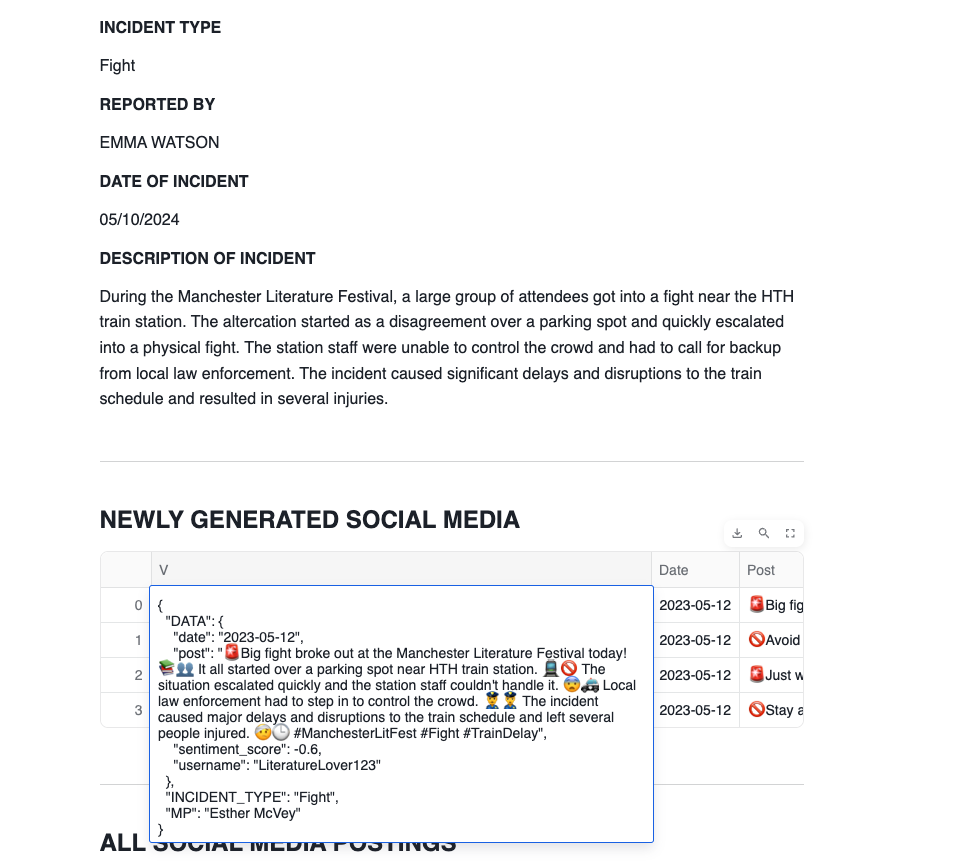

Finally we will create a Streamlit app which adds this additional information to a map.


<!-- ------------------------ -->
## Visualise the data 

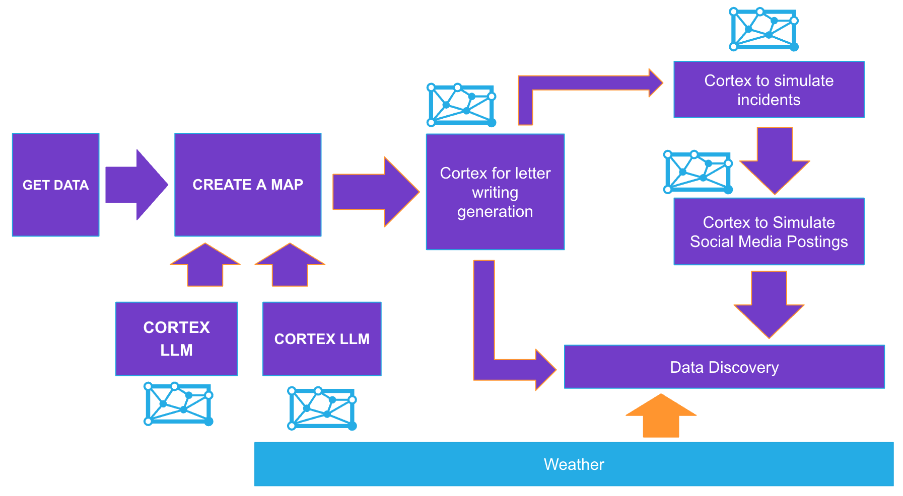

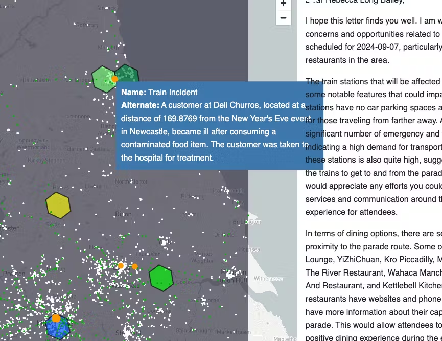

You will now be creating another streamlit app in order to visualise the results.

Below is sample code which takes what we have learnt to create a streamlit with all the places event, location and incident data that from the shared datasets as well as synthetic data.

You will need to install **pydeck**.  

- Go back to the home page and add a new streamlit application using the same database, schema and warehouse as the previous app.


- Go to packages and add **pydeck** to the streamlit app before you paste the app code.

    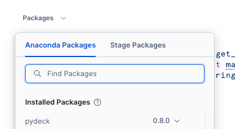

- After you have installed pydeck, delete the default contents of the newly created app
- Replace all the sample code with what is provided below:
- [The code is also found here](https://github.com/Snowflake-Labs/sfguide-using-snowflake-cortex-and-streamlit-with-geospatial-data/blob/main/sis002.py)

```python

import streamlit as st
from snowflake.snowpark.context import get_active_session
from snowflake.snowpark.functions import max,min,avg,call_function, split,substr,hour,concat,col,sqrt,lit,array_slice,array_agg,object_construct,parse_json, to_geography, to_array,to_date,round
from snowflake.snowpark.types import StringType,VariantType, DateType,FloatType, IntegerType,DecimalType
import json
import pandas as pd
import numpy as np
import pydeck as pdk
st.set_page_config(layout="wide")
# Write directly to the app
st.markdown('<h1 class="heading">VISUALISE LOCATION DATA</h2>', unsafe_allow_html=True)
st.write(
    """<BR> This app shows key insight of places and events that may effect Northern Trains).
    """,unsafe_allow_html=True)


# Get the current credentials
session = get_active_session()

st.markdown(
    """
    <style>
    .heading{
        background-color: rgb(41, 181, 232);  /* light blue background */
        color: white;  /* white text */
        padding: 60px;  /* add padding around the content */
    }
    .tabheading{
        background-color: rgb(41, 181, 232);  /* light blue background */
        color: white;  /* white text */
        padding: 10px;  /* add padding around the content */
    }
    .veh1 {
        color: rgb(125, 68, 207);  /* purple */
    }
    .veh2 {
        color: rgb(212, 91, 144);  /* pink */
    }
    .veh3 {
        color: rgb(255, 159, 54);  /* orange */
    }
    .veh4 {
        padding: 10px;  /* add padding around the content */
        color: rgb(0,53,69);  /* midnight */
    }
    
    body {
        color: rgb(0,53,69);
    }
    
    div[role="tablist"] > div[aria-selected="true"] {
        background-color: rgb(41, 181, 232);
        color: rgb(0,53,69);  /* Change the text color if needed */
    }
    
    </style>
    """,
    unsafe_allow_html=True
)

trains_latlon = session.table('NORTHERN_TRAINS_STATION_DATA.TESTING."StationLatLong"')


#create a point from the coordinates
envelope = trains_latlon.with_column('POINT',call_function('ST_MAKEPOINT',col('"Longitude"'),col('"Latitude"')))

#collect all the points into one row of data
envelope = envelope.select(call_function('ST_COLLECT',col('POINT')).alias('POINTS'))

#create a rectangular shape which boarders the minimum possible size which covers all of the points
envelope = envelope.select(call_function('ST_ENVELOPE',col('POINTS')).alias('BOUNDARY'))

#find the centre point so the map will render from that location

centre = envelope.with_column('CENTROID',call_function('ST_CENTROID',col('BOUNDARY')))
centre = centre.with_column('LON',call_function('ST_X',col('CENTROID')))
centre = centre.with_column('LAT',call_function('ST_Y',col('CENTROID')))

#create LON and LAT variables

centrepd = centre.select('LON','LAT').to_pandas()
LON = centrepd.LON.iloc[0]
LAT = centrepd.LAT.iloc[0]

### transform the data in pandas so the pydeck visualisation tool can view it as a polygon

envelopepd = envelope.to_pandas()
envelopepd["coordinates"] = envelopepd["BOUNDARY"].apply(lambda row: json.loads(row)["coordinates"][0])

places = session.table('OVERTURE_MAPS__PLACES.CARTO.PLACE')
places = places.filter(col('ADDRESSES')['list'][0]['element']['country'] =='GB')

places = places.select(col('NAMES')['primary'].astype(StringType()).alias('NAME'),
                        col('PHONES')['list'][0]['element'].astype(StringType()).alias('PHONE'),
                      col('CATEGORIES')['primary'].astype(StringType()).alias('CATEGORY'),
                        col('CATEGORIES')['alternate']['list'][0]['element'].astype(StringType()).alias('ALTERNATE'),
                    col('websites')['list'][0]['element'].astype(StringType()).alias('WEBSITE'),
                      col('GEOMETRY'))

places = places.filter(col('CATEGORY') =='restaurant')


places = places.join(envelope,call_function('ST_WITHIN',places['GEOMETRY'],envelope['boundary']))
places = places.with_column('LON',call_function('ST_X',col('GEOMETRY')))
places = places.with_column('LAT',call_function('ST_Y',col('GEOMETRY')))
placespd = places.to_pandas()


trains_latlon_renamed = trains_latlon

trains_latlon_renamed = trains_latlon_renamed.with_column_renamed('"CrsCode"','NAME')
trains_latlon_renamed = trains_latlon_renamed.with_column_renamed('"Latitude"','LAT')
trains_latlon_renamed = trains_latlon_renamed.with_column_renamed('"Longitude"','LON')

station_info = session.table('DATA.TRAIN_STATION_INFORMATION')

trains_latlon_renamed = trains_latlon_renamed.join(station_info,station_info['"CRS Code"']==trains_latlon_renamed['NAME']).drop('"CRS Code"')
trains_latlon_renamed_pd = trains_latlon_renamed.to_pandas()

events = session.table('DATA.EVENTS_IN_THE_NORTH')
events = events.join_table_function('flatten',parse_json('EVENT_DATA')).select('VALUE')
events=events.with_column('NAME',col('VALUE')['NAME'].astype(StringType()))
events=events.with_column('DESCRIPTION',col('VALUE')['DESCRIPTION'].astype(StringType()))
events=events.with_column('CENTROID',to_geography(col('VALUE')['CENTROID']))
events=events.with_column('COLOR',col('VALUE')['COLOR'])
events=events.with_column('DATE',col('VALUE')['DATE'].astype(DateType())).drop('VALUE')
events=events.with_column('H3',call_function('H3_POINT_TO_CELL_STRING',col('CENTROID'),lit(5)))

events = events.with_column('R',col('COLOR')[0])
events = events.with_column('G',col('COLOR')[1])
events = events.with_column('B',col('COLOR')[2])
events = events.with_column_renamed('DESCRIPTION','ALTERNATE')
eventspd = events.group_by('H3','NAME','ALTERNATE','R','G','B').count().to_pandas()

incident_table = session.table('DATA.INCIDENTS')
flatten = incident_table.select('MP','INCIDENT_TYPE',parse_json('GENERATED_EVENTS').alias('JSON'))
flatten = flatten.join_table_function('FLATTEN',col('JSON')['incidents'])
flatten = flatten.select('MP',col('INCIDENT_TYPE').alias('NAME'),'VALUE')
flatten = flatten.with_column('ALTERNATE',
                                  col('VALUE')['DESCRIPTION_OF_INCIDENTS'].astype(StringType()),
                                 )
flatten = flatten.with_column('LAT',
                                  col('VALUE')['LOCATION']['LAT'].astype(FloatType()))                           
flatten = flatten.with_column('LON',
                                  col('VALUE')['LOCATION']['LON'].astype(FloatType()))
flatten = flatten.with_column('REPORTED_BY',
                                  col('VALUE')['REPORTED_BY'].astype(StringType()),
                                 )
flatten = flatten.with_column('DATE',
                                  col('VALUE')['DATE'].astype(StringType()),
                                 ).drop('VALUE')
flattenpd = flatten.to_pandas()
####MAP LAYERS

polygon_layer = pdk.Layer(
            "PolygonLayer",
            envelopepd,
            opacity=0.3,
            get_polygon="coordinates",
            filled=True,
            get_fill_color=[16, 14, 40],
            auto_highlight=True,
            pickable=False,
        )


poi_l = pdk.Layer(
            'ScatterplotLayer',
            data=placespd,
            opacity=0.8,
            get_position='[LON, LAT]',
            get_color='[255,255,255]',
            radius_min_pixels=3,
            radius_max_pixels=6,
            pickable=True)


nw_trains_l = pdk.Layer(
            'ScatterplotLayer',
            data=trains_latlon_renamed_pd,
            get_position='[LON, LAT]',
            get_color='[41,181,232]',
            radius_min_pixels=3,
            radius_max_pixels=20,
            get_radius=4,
            pickable=True)

h3_events = pdk.Layer(
        "H3HexagonLayer",
        eventspd,
        pickable=True,
        stroked=True,
        filled=True,
        extruded=False,
        get_hexagon="H3",
        get_fill_color=["255-R","255-G","255-B"],
        line_width_min_pixels=2,
        opacity=0.3)


incidents_layer = pdk.Layer(
            'ScatterplotLayer',
            data=flattenpd,
            get_position='[LON, LAT]',
            get_color='[255,165,0]',
            get_radius=2000,
            pickable=True)

#### render the map showing trainstations based on overture maps

tooltip = {
   "html": """<b>Name:</b> {NAME} <br> <b>Alternate:</b> {ALTERNATE}""",
   "style": {
       "width":"50%",
        "backgroundColor": "steelblue",
        "color": "white",
       "text-wrap": "balance"
    }
    }
    
letters = session.table('DATA.LETTERS_TO_MP')
mps = letters.select('MP').distinct()
selected_mp = st.selectbox('Choose MP:',mps)
letterspd = letters.filter(col('MP')==lit(selected_mp)).to_pandas()
#st.write(letterspd.PROMPT.iloc[0])

st.divider()
col1,col2 = st.columns([0.5,0.5])

with col1:
    st.markdown('<h4 class="veh1">MAP OF EVENTS WITH STATIONS AND RESTAURANTS</h2>', unsafe_allow_html=True)
    st.pydeck_chart(pdk.Deck(
    map_style=None,
    initial_view_state=pdk.ViewState(
        latitude=LAT,
        longitude=LON,
        zoom=7,
        height=750
        ),
    
    layers= [polygon_layer, poi_l,nw_trains_l,h3_events,incidents_layer], tooltip = tooltip

    ))
    st.caption('Hover for more info')
with col2:
    st.markdown('<h4 class="veh1">LETTERS TO MP</h2>', unsafe_allow_html=True)
    st.write(letterspd.LETTER.iloc[0])
    st.divider()

social_media = session.table('DATA.V_SOCIAL_MEDIA').filter(col('MP')==selected_mp)

st.markdown('<h4 class="veh1">SOCIAL MEDIA</h2>', unsafe_allow_html=True)
st.table(social_media.drop('V'))

```
<!-- ------------------------ -->
## Use Cortex to Embed Generated Text and create a Search Service


During the lab we have produced quite a bit of unstructured data from social media posts, to incidents, through to letters.  Now lets use vector embedding functionality to make this information searchable.  This is really useful when you would like to use an LLM to answer questions but do not want to send the entire dataset as a large object - which could be quite expensive and also would take a long time to run.  For large text blocks, you may wish to 'chunk' the data first.  As the text in this scenario is relatively small - we will keep it as is.  Once you have explored the principles of how text searching works, you will create a Cortex Search Service.

Click here and download the notebook from GitHub

[**Vector_Embeddings.ipynb**](https://github.com/Snowflake-Labs/sfguide-using-snowflake-cortex-and-streamlit-with-geospatial-data/blob/main/Vector_Embeddings.ipynb)

Import as a new snowflake notebook.  Add it to the BUILD.UK.NOTEBOOKS schema and follow the instructions provided in the notebook.


<!-- ------------------------ -->
## Bringing in Met Office Weather
### Met office Weather

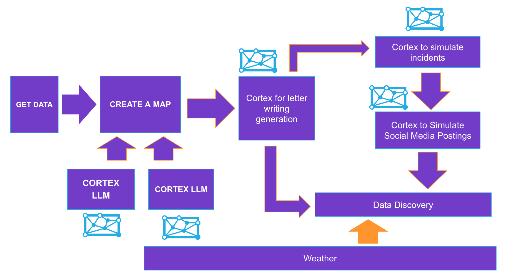
Now we will leverage the weather data to understand the weather forecasts for each Event.  This time we will import a notebook which has already been created.

- Go to the Home page and select Notebooks

- Download the following python notebook file

[**weather.ipynb**](https://github.com/Snowflake-Labs/sfguide-using-snowflake-cortex-and-streamlit-with-geospatial-data/blob/main/weather.ipynb)

- In the notebbook menu selection, select Import from .ipynb file and choose the downloaded file

    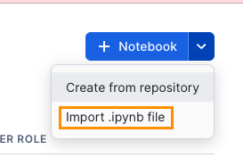


- Populate the fields with the following:

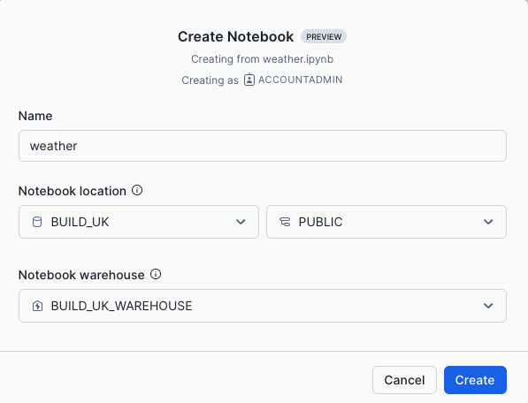

- Follow the instructions as per the imported notebook.  You will end up with a weather forecast for each of the different events.

    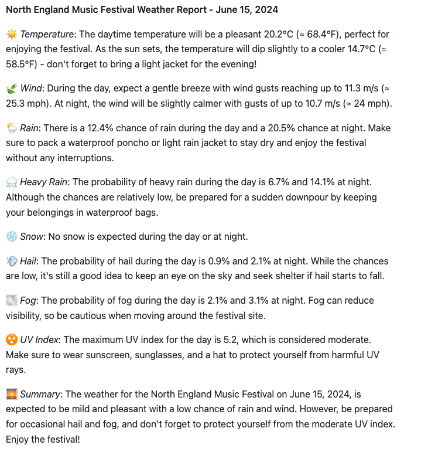


### Streamlit showing weather by Train Station

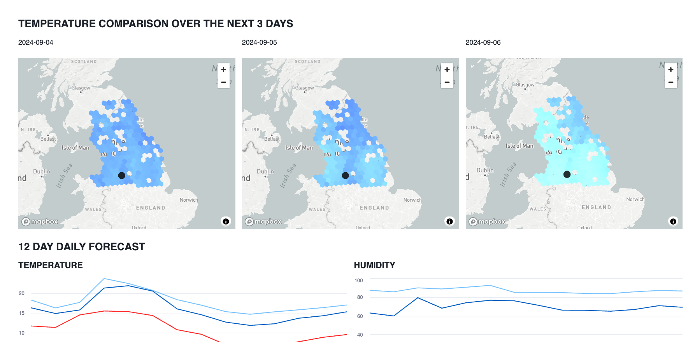

this is an example weather app which shows the weather forecast for each train station

- Copy and paste the code below into a new **streamlit app**

- NOTE: you will need to install the package **pydeck** from the packages menu.


```python

# Import python packages
import streamlit as st
from snowflake.snowpark.context import get_active_session
from snowflake.snowpark.functions import any_value,max,min,avg,call_function, split,substr,hour,concat,col,sqrt,lit,array_slice,array_agg,object_construct,parse_json, to_geography, to_array,to_date
from snowflake.snowpark.types import StringType,VariantType, DateType, IntegerType,DecimalType
import json
import pandas as pd
import numpy as np
import pydeck as pdk

st.set_page_config(layout="wide")

# Write directly to the app

col1,col2,col3 = st.columns([0.2,0.6,0.2])
with col1:
    st.image('https://cdn.prgloo.com/web/NorthernRail/NorthernNewLogo.png')

with col3:
    st.image('https://upload.wikimedia.org/wikipedia/en/thumb/f/f4/Met_Office.svg/1200px-Met_Office.svg.png')
st.title("Northern Trains Weather Data")

st.write(
    """This app shows the weather that may affect Northern Trains).
    """
)

# Get the current credentials
session = get_active_session()

#### add postcode sector to trains
trains_latlon = session.table('NORTHERN_TRAINS_STATION_DATA.TESTING."StationLatLong"')
trains_latlon = trains_latlon.with_column('POSTCODE_SPLIT',split(col('"Postcode"'),lit(' ')))
trains_latlon = trains_latlon.with_column('Postcode_outcode',col('POSTCODE_SPLIT')[0].astype(StringType()))
trains_latlon = trains_latlon.with_column('Postcode_inward_code',col('POSTCODE_SPLIT')[1].astype(StringType()))
trains_latlon = trains_latlon.with_column('Postcode_Sector',concat('POSTCODE_OUTCODE',lit('_'),substr(col('Postcode_inward_code'),1,1)))
trains_latlon = trains_latlon.drop('POSTCODE_SPLIT','POSTCODE_OUTCODE','POSTCODE_INWARD_CODE')


# Add hourly and daily weather for each train station

weather_hourly = session.table('POSTCODE_SECTOR_WEATHER_FORECASTS.PCSECT_FORECAST."postcode_hourly_view"')
weather_daily = session.table('POSTCODE_SECTOR_WEATHER_FORECASTS.PCSECT_FORECAST."postcode_daily_view"')

weather_hourly_max = weather_hourly.agg(max('"Issued_at"').alias('MAX'))
weather_hourly = weather_hourly.join(weather_hourly_max,weather_hourly_max['MAX']==weather_hourly['"Issued_at"']).drop('MAX')

weather_daily_max = weather_daily.agg(max('"Issued_at"').alias('MAX'))
weather_daily = weather_daily.join(weather_daily_max,weather_daily_max['MAX']==weather_daily['"Issued_at"']).drop('MAX')

weather_hourly = weather_hourly.join(trains_latlon,trains_latlon['POSTCODE_SECTOR']==weather_hourly['PC_SECT']).drop('PC_SECT')
weather_hourly = weather_hourly.with_column('VALIDITY_DATE',to_date('"Validity_date_and_time"'))

weather_daily_t = weather_daily.join(trains_latlon,trains_latlon['POSTCODE_SECTOR']==weather_daily['PC_SECT']).drop('PC_SECT')


#add h3 column to weather
weather_daily_h3 = weather_daily_t.with_column('H3',call_function('H3_LATLNG_TO_CELL_STRING',col('"Latitude"'),col('"Longitude"'),lit(5)))


#add northern trains boundary box
#create a point from the coordinates
envelope = trains_latlon.with_column('POINT',call_function('ST_MAKEPOINT',col('"Longitude"'),col('"Latitude"')))

#collect all the points into one row of data
envelope = envelope.select(call_function('ST_COLLECT',col('POINT')).alias('POINTS'))

#create a rectangular shape which boarders the minimum possible size which covers all of the points
envelope = envelope.select(call_function('ST_ENVELOPE',col('POINTS')).alias('BOUNDARY'))

# Create a centre point to position the maps
centre = envelope.with_column('CENTROID',call_function('ST_CENTROID',col('BOUNDARY')))
centre = centre.with_column('LON',call_function('ST_X',col('CENTROID')))
centre = centre.with_column('LAT',call_function('ST_Y',col('CENTROID')))


#create LON and LAT variables

centrepd = centre.select('LON','LAT').to_pandas()
LON = centrepd.LON.iloc[0]
LAT = centrepd.LAT.iloc[0]

# index the boundary with h3 res 5
boundary_h3 = envelope.with_column('H3',call_function('H3_COVERAGE_STRINGS',col('BOUNDARY'),lit(5))).join_table_function('flatten',col('H3')).select(col('VALUE').astype(StringType()).alias('H3'))


#### use the postcodes data set to add H3 to postcode sectors
postcodes = weather_daily.group_by('PC_SECT').agg(any_value('POINT').alias('POINT'))
postcodes = postcodes.with_column('H3',call_function('H3_POINT_TO_CELL_STRING',col('"POINT"'),lit(5)))
postcodes = postcodes.join(boundary_h3,boundary_h3['H3']==postcodes['H3'],lsuffix='L').drop('H3L')


### join weather data to the boundary
weather_boundary = boundary_h3.join(weather_daily_h3,weather_daily_h3['H3']==boundary_h3['H3'],lsuffix='L',type='right').drop('H3L')
weather_boundarypd = weather_boundary.select('H3','"Max_temperature_day"','"Max_feels_like_temperature_day"').to_pandas()


from snowflake.snowpark.functions import dateadd


##join weather to all postcode sectors


weather_daily_north = weather_daily.join(weather_daily_max,weather_daily_max['MAX']==weather_daily['"Issued_at"']).drop('MAX')
weather_daily_north = weather_daily_north.join(postcodes,postcodes['PC_SECT']==weather_daily_north['PC_SECT'])


station_filter = trains_latlon.select('"CrsCode"')
date_filter = weather_hourly.agg(max('VALIDITY_DATE').alias('MAX'),
                          min('VALIDITY_DATE').alias('MIN'))

date_filter = date_filter.with_column('MIN',dateadd('DAY',lit(1),col('MIN'))).to_pandas()

with st.form('select_data'):
    col1,col2, = st.columns([0.3,0.7])
    with col1:
        selected_station = st.selectbox('Select Station:',station_filter)
        selected_date = st.date_input('Select Date:',date_filter.MIN.iloc[0],date_filter.MIN.iloc[0],date_filter.MAX.iloc[0])
        model = 'reka-flash','mixtral-8x7b', 'gemma-7b','llama2-70b-chat'
        select_model = st.selectbox('Choose Model',model)
        run = st.form_submit_button('Run Dashboard')
    with col2:
        st.image('https://cdn.prgloo.com/media/aad47116f9cc4c33b6f02e51fb8070f4.jpg?width=1200&height=400')

if run:

    #st.write(weather_daily_north).limit(10)
    todaypd = weather_daily_t.filter((col('"Validity_date"')==selected_date)
                                     & (col('"CrsCode"')==selected_station)).to_pandas()
    st.write(todaypd)
    melt = pd.melt(todaypd)
    melt['variable'] = melt['variable'].astype("string")
    melt['value'] = melt['value'].astype("string")

    ##### create an object to feed into the LLM
    object = session.create_dataframe(melt)
    object = object.with_column('object',object_construct(col('"variable"'),col('"value"')))
    
    object = object.select(array_agg('OBJECT').alias('OBJECT'))

    

        ##### create an LLM prompt which includes the data object
    prompt = concat(lit('Summarise the weather report in 500 words using paragraphs for the date specified which includes relevant emojis to summarise the weather based on the following dataset'),
                    col('object').astype(StringType()),
                   lit('USE APPROPIATE MARKDOWN TO ENHANCE THE PRESENTATION. NO COMMENTS'))
    
    # construct the cortex.complete function - this will run based on the chosen model
    complete = call_function('snowflake.cortex.complete',lit(select_model),lit(prompt))
    
    object = object.select(complete)

    #### print the results
    st.write(object.collect()[0][0])

    st.divider()
    
    # dataframes for h3 maps

    weather_daily_north = weather_daily_north.select('H3',col('"Validity_date"').astype(StringType()).alias('DATE'),
                                                     '"Max_temperature_day"',
                                                     '"Max_feels_like_temperature_day"')
    
    weather_daily_north_0 = weather_daily_north.filter(col('"Validity_date"')== dateadd('day',lit(1),lit(selected_date)))
    weather_daily_north_1 = weather_daily_north.filter(col('"Validity_date"')== dateadd('day',lit(2),lit(selected_date)))
    weather_daily_north_2 = weather_daily_north.filter(col('"Validity_date"')== dateadd('day',lit(3),lit(selected_date)))


    ####
    weather_daily_northpd = weather_daily_north_0.to_pandas()
    weather_daily_northpd1 = weather_daily_north_1.to_pandas()
    weather_daily_northpd2 = weather_daily_north_2.to_pandas()

    

    #################CONSTRUCT THE MAP

    ### create a layer to cover the boundary with H3 Indexes

    st.markdown('#### TEMPERATURE COMPARISON OVER THE NEXT 3 DAYS')

    filtered_station = trains_latlon.filter(col('"CrsCode"')==selected_station)
    filtered_station_pd = filtered_station.to_pandas()

    #st.write(filtered_station)


    station = pdk.Layer(
            'ScatterplotLayer',
            data=filtered_station_pd,
            get_position='[Longitude,Latitude]',
            get_color='[0,0,0]',
            get_radius=2000,
            radius_scale=6,
            radius_min_pixels=1,
            opacity=0.6,
            radius_max_pixels=1000,
            filled=True,
            line_width_min_pixels=1,
            pickable=False)
    

    h3_coverage = pdk.Layer(
        "H3HexagonLayer",
        weather_daily_northpd,
        pickable=True,
        stroked=True,
        filled=True,
        extruded=False,
        get_hexagon="H3",
        get_fill_color=["0+Max_temperature_day*8","(255/100) * 0+Max_temperature_day*12","(255/100) * 200-Max_temperature_day*9"],
        line_width_min_pixels=0,
        opacity=0.9)

    h3_coverage_1 = pdk.Layer(
        "H3HexagonLayer",
        weather_daily_northpd1,
        pickable=True,
        stroked=True,
        filled=True,
        extruded=False,
        get_hexagon="H3",
        get_fill_color=["0+Max_temperature_day*8","(255/100) * 0+Max_temperature_day*12","(255/100) * 200-Max_temperature_day*9"],
        line_width_min_pixels=0,
        opacity=0.9)

    h3_coverage_2 = pdk.Layer(
        "H3HexagonLayer",
        weather_daily_northpd2,
        pickable=True,
        stroked=True,
        filled=True,
        extruded=False,
        get_hexagon="H3",
        get_fill_color=["0+Max_temperature_day*8","(255/100) * 0+Max_temperature_day*12","(255/100) * 200-Max_temperature_day*9"],
        line_width_min_pixels=0,
        opacity=0.9)


    #### render the map 


    col1,col2,col3 = st.columns(3)

    with col1:
        st.write(weather_daily_northpd.DATE.iloc[1])
        st.pydeck_chart(pdk.Deck(
        map_style=None,
        initial_view_state=pdk.ViewState(
        latitude=LAT,
        longitude=LON,
        zoom=5,
        height=400
        ),
    
        layers= [h3_coverage,station],tooltip = {'text':"Temperature: {Max_temperature_day}, Feels like: {Max_feels_like_temperature_day}"}

        ))

    with col2:
        st.write(weather_daily_northpd1.DATE.iloc[1])
        st.pydeck_chart(pdk.Deck(
        map_style=None,
        initial_view_state=pdk.ViewState(
            latitude=LAT,
            longitude=LON,
            zoom=5,
            height=400
            ),
    
        layers= [h3_coverage_1,station],tooltip = {'text':"Temperature: {Max_temperature_day}, Feels like: {Max_feels_like_temperature_day}"}

        ))

    with col3:
        st.write(weather_daily_northpd2.DATE.iloc[1])
        st.pydeck_chart(pdk.Deck(
        map_style=None,
        initial_view_state=pdk.ViewState(
        latitude=LAT,
        longitude=LON,
        zoom=5,
        height=400
            ),
    
        layers= [h3_coverage_2,station],tooltip = {'text':"Temperature: {Max_temperature_day}, Feels like: {Max_feels_like_temperature_day}"}

        ))


    
    weather_filter_hour = weather_hourly.filter(col('"CrsCode"') == selected_station)
    weather_filter_day = weather_daily_t.filter(col('"CrsCode"') == selected_station)

    weather_filter_hour = weather_filter_hour.filter(col('VALIDITY_DATE')==selected_date)
    #weather_filter_day = weather_filter_day.filter(col('"Validity_date"')==selected_date)
    weather_filter_hour = weather_filter_hour.with_column('HOUR',hour('"Validity_date_and_time"'))


    weather_filter_hour = weather_filter_hour.group_by('HOUR').agg(avg('"Feels_like_temperature"').alias('Feels Like'),
                                                              avg('"Screen_temperature"').alias('"Screen"'),
                                                               avg('"Screen_Dew_Point_Temperature"').alias('"Dew Point"'),
    avg('"UV_index"').alias(' '),                                                        avg('"Relative_humidity"').alias('"Relative"'),                                                        avg('"Wind_speed"').alias('"Speed"'),
    avg('"Wind_gust"').alias('"Gust"'),).to_pandas()

    #weather_filter_hour
    st.markdown('#### 12 DAY DAILY FORECAST')

    col1,col2 = st.columns(2)
    with col1:
        st.markdown('##### TEMPERATURE')
    #weather_filter_day

        st.line_chart(weather_filter_day.to_pandas(),x='Validity_date',y=['Max_temperature_day','Max_feels_like_temperature_day','Min_feels_like_temperature_night'])


    with col2:
        st.markdown('##### HUMIDITY')
    #weather_filter_day

        st.line_chart(weather_filter_day.to_pandas(),x='Validity_date',y=['Relative_humidity_Approx_Local_Midday','Relative_humidity_Approx_Local_Midnight'])

    st.divider()

    st.markdown('#### HOURLY VIEW')

    col1,col2 = st.columns(2)

    with col1:
        st.markdown('##### TEMPERATURE')
        st.line_chart(weather_filter_hour,x='HOUR',y=['Feels Like','Screen','Dew Point'])
    with col2:
        st.markdown('##### UV INDEX')
        st.bar_chart(weather_filter_hour,x='HOUR',y=[' '])

    with col1:
        st.markdown('##### WIND')
        st.line_chart(weather_filter_hour,x='HOUR',y=['Speed','Gust'])
    with col2:
        st.markdown('##### HUMIDITY')
        st.bar_chart(weather_filter_hour,x='HOUR',y=['Relative'])


```


<!-- ------------------------ -->
## Conclusion and Resources
### Conclusion

Snowflake provides powerful capabilities when you bring Cortex with Snowpark and Streamlit's visualization capabilities together.

### What You Learned

You will have learned the following:
 - How to use Snowflake Cortex to produce descriptive tooltips, create letters, suggest large events as well as produce synthetic data for simulating potential incidents that may occur.

- How to leverage snowpark data frames to wrangle shared datasets into meaningful dataframes

- How to utilise Pydeck to combine local information on a multi layered map.


### Related Resources

#### Datasources used in the lab

- [Overture Maps - Places](https://app.snowflake.com/marketplace/providers/GZT0ZKUCHE3/CARTO?dbName=OVERTURE_MAPS__PLACES)

- [Northern Trains](https://app.snowflake.com/marketplace/listing/GZTDZ2CEXT/northern-trains-ltd-northern-trains-station-data?search=northern)

- Met office **to follow**

#### Source code

- [Source Code on Github](https://github.com/Snowflake-Labs/sfguide-using-snowflake-cortex-and-streamlit-with-geospatial-data)

#### Further Related Material

- [Geospatial Functions](https://docs.snowflake.com/en/sql-reference/functions-geospatial)

- [H3 Indexing](https://h3geo.org/docs/)

- [Streamlit](https://streamlit.io/)

- [Pydeck](https://deckgl.readthedocs.io/en/latest/index.html#)

- [Getting started with Geospatial AI and ML using Snowflake Cortex](/en/developers/guides/geo-for-machine-learning/)

- [Build a Retrieval Augmented Generation (RAG) based LLM assistant using Streamlit and Snowflake Cortex](https://quickstarts.snowflake.com/guide/asking_questions_to_your_own_documents_with_snowflake_cortex/index.html#0)
