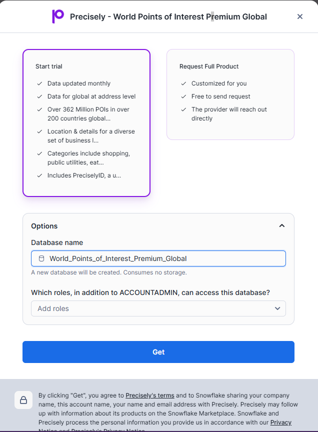
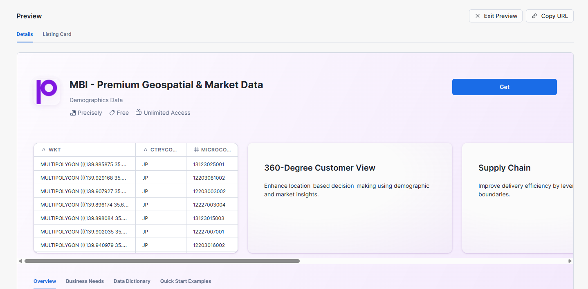
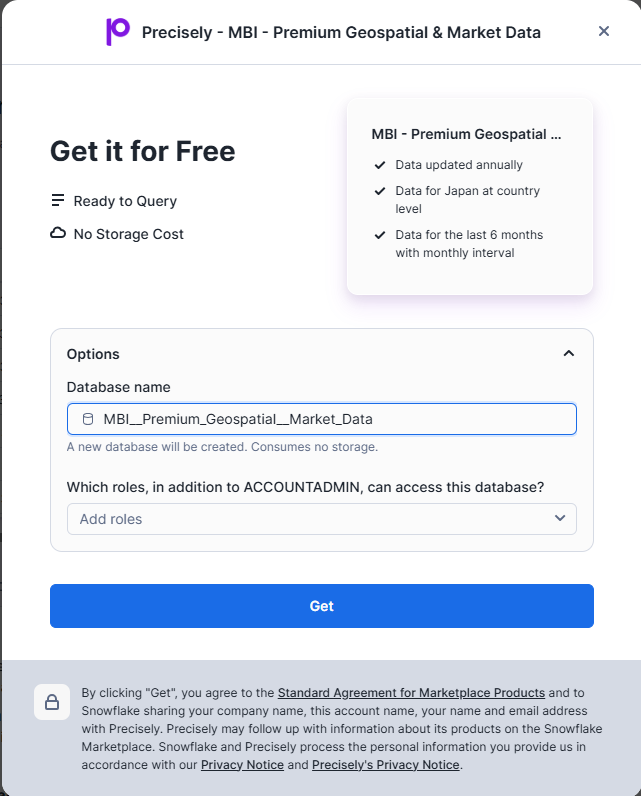
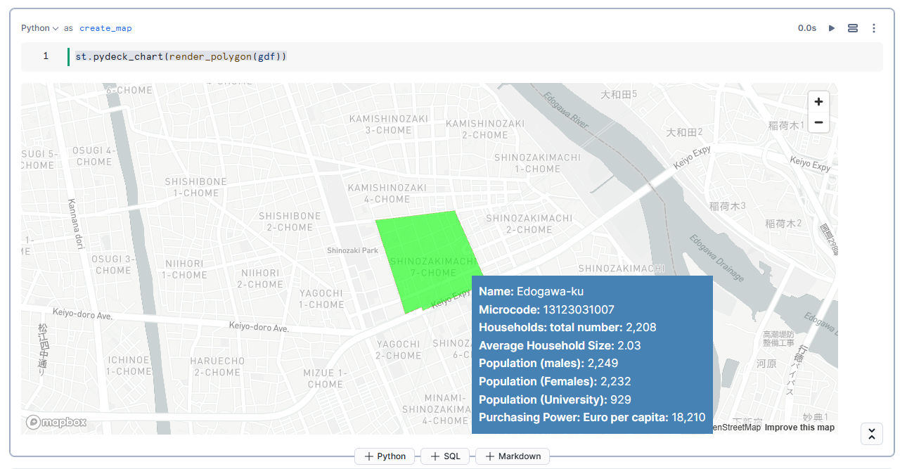
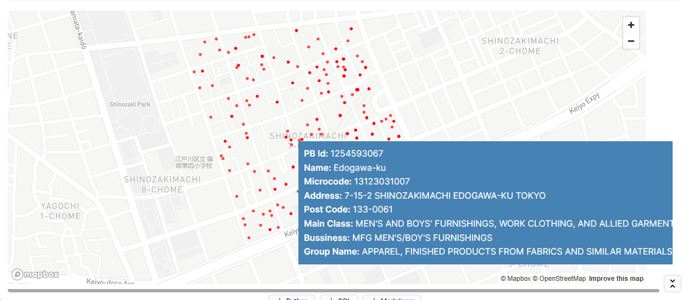
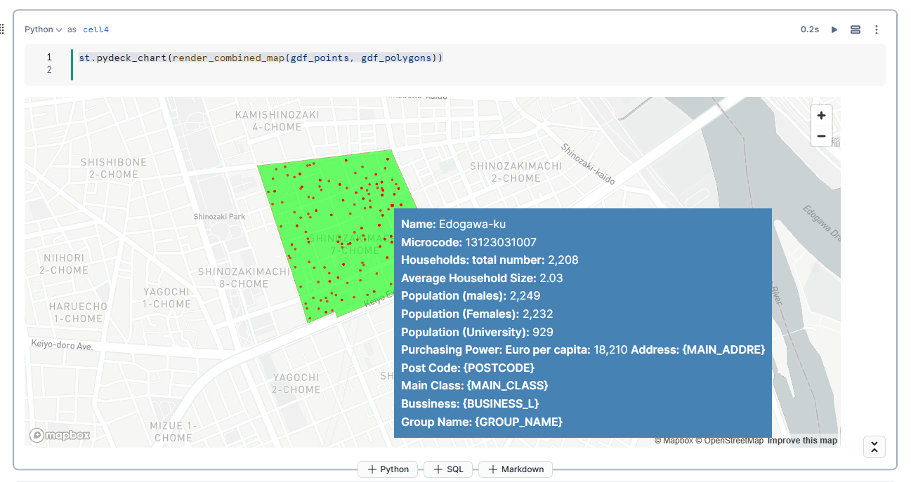

author: Mohammad Aslam Khan
id: using_precisely_enrich_data
summary: This is a sample Snowflake Guide
categories: Data-Sharing, Cortex
environments: web
status: Published
feedback link: https://github.com/Snowflake-Labs/sfguides/issues
tags: Geospatial, Advanced Analytics, Data Engineering,

# Geospatial Analysis of Precisely datasets using Snowflake Notebooks and Streamlit

<!-- ------------------------ -->

## Overview

Duration: 2

Analyzing location-specific data for decision-making often requires specialized techniques typically handled by geography experts. However, with **Snowflake**, anyone can analyze geographic data—whether it's regional demographics, city points, market data, or points of interest—using the platform’s built-in geospatial functionalities.

Numerous location-based datasets are available within the **Snowflake Marketplace**, significantly reducing the time needed for data ingestion and engineering. Accessing these datasets is as simple as selecting **Get Data**, allowing users to leverage geospatial insights via **SQL Queries** or **Snowpark DataFrames**. These result sets can then be visualized effortlessly using **Streamlit in Snowflake** dashboards.

### What You’ll Build

- A Snowflake Notebook to explore and process geospatial data(https://github.com/zaslamz/precisely-sfquickstart.git).
- A Streamlit app to visualize:
  - Demographic and market insights
  - Spatial relationships between regions and city points
  - Geographic points of interest based on spatial queries

### What You’ll Learn

In this quickstart, we will use Snowflake’s tools to:

- **Query and explore** sample datasets, including:
  - Regional demographic data
  - Points of Interest data
  - Market data samples
- **Integrate** geographic and market data by:
  - Joining region and market datasets on the `MICROCODE` field
  - Creating a new table (`mbi_demographics_jp`) that consolidates demographic and economic information
- **Enhance** geospatial data by:
  - Updating the `GEOM` column to store geographic point data using `ST_MakePoint` and `ST_GeogPoint`
  - Converting Well-Known Text (WKT) data into geometry format with SRID 4326 (WGS 84)
- **Perform spatial analysis** by:
  - Conducting spatial joins to identify points of interest (POI) within defined geographic regions
- **Visualize** insights using **Streamlit in Snowflake**.

### Prerequisites

- [Signup](https://signup.snowflake.com/) for free trial of Snowflake in **a region of your choice\***.


<!-- ------------------------ -->

## Snowflake Marketplace

Duration: 5

Once logged in go to the Snowflake Marketplace - this is under Data Products > Snowflake Marketplace


1. Search for World Points of Interest Premium Global


Press **Get** to get the data from the marketplace.



Leave the database name and the role option as default and then Press **Get** to install the database into your account.

2. Search for MBI - Premium Geospatial & Market Data



Click on the following dataset then press **Get**.



Leave the database name and the role option as default and then Press **Get** to install the database into your account.
You will have access to the dataset for a period of **30 days**

## Display Data on Map

Duration: 10

In Snowsight, go back to the home page and select **Projects** » **Notebooks**.


You can download the file(precisely_enrich.ipynb) from the Repository(https://github.com/zaslamz/precisely-sfquickstart.git).


Today we will be creating a new notebook from scratch.

In **Notebook location**, select SAMPLES_DB from the list of available databases and NOTEBOOKS from the available schemas. All data within the notebook will be held inside the chosen database and schema and will sit inside an automatically generated stage. Select the ENRICH_WH and press **Create**.

---

> However, to experience the creation of the notebook yourself, carry on with the blank notebook, and copy/paste the code as we go along.

### Creating First Map

Once the notebook has loaded, Remove all cells in the notebook. You should see something like this:


Before we start working in our notebook, we will add an additional package which is not installed as default. This package is available within the Anaconda Snowflake channel and is easily accessible.

**Add the Pydeck package for visualising location data**

In the top menu, under Packages » Anaconda Packages, import packages.


Now we have all the packages we need. Lets start the notebook by pressing **Start** which is at the top right hand corner of the screen.


You will be using a variety of Snowflake functions to do some transformation tasks. Some of the functions are built into the snowpark library (such as array_agg, parse_json), others we need to call using the **call_function** module. **call_function** allows the user to leverage ANY Snowflake scalar function - you can use this for both built in as well as user defined functions.

All functions are held inside the **snowflake.snowpark.functions** module.

We will import the call_function, streamlit library, json, numpy, pandas and pydeck packages. For pydeck, you will need to add the package as this is not installed by default.

Click on the + Python button to add a new Python cell. On the top left hand corner of the screen, you can rename your cell from 'cell1' to something more meaningful. This is useful for debugging purposes.

**Rename** cell1 to libraries by typing over the text 'cell1'.

Copy and paste the following code into the newly created cell.

```python
# Import python packages
import pandas as pd
import geopandas as gpd
from shapely import wkt
from shapely.geometry import Point
from IPython.display import display, IFrame
from snowflake.snowpark.context import get_active_session
import streamlit as st


# Get the current session
session = get_active_session()
```


Add a new python cell by hovering over the bottom edge of the cell and select Python.


Rename the the cell to **geometry_conversion_to_point**
This function will convert the lat long values to points.

Copy and paste the code into the new python cell and run this notebook cell:

```python
def create_geom(row):
    if 'WKT' in row.keys():
        return wkt.loads(row['WKT'])
    else:
        return Point(row['LONGITUDE'], row['LATITUDE'])
```

Add a new python cell by hovering over the bottom edge of the cell and select Python.


Rename the the cell to **data_filtering**
Here we will be filtering the data for one MICROCODE and then we will use helper function and then create a GeoDataFrame with the appropriate CRS.

Copy and paste the code into the new python cell and run this notebook cell:

```python
# Filtering the mbi polygon data to one MICROCODE
q = '''
        select * from MBI__PREMIUM_GEOSPATIAL__MARKET_DATA.PROMOTIONAL."mbi_demographics_jp"
        where MICROCODE = '13123031007'
    '''

# Execute the query (ensure session is defined and connected to Snowflake)
df = session.sql(q).to_pandas()

# Create geometry column using the helper function
df['GEOM'] = df.apply(create_geom, axis=1)

# Create a GeoDataFrame with the appropriate CRS
gdf = gpd.GeoDataFrame(df, geometry='GEOM', crs="EPSG:4326")
```

Add a new python cell by hovering over the bottom edge of the cell and select Python.


Rename the the cell to **geometry_conversion_to_polygon**
Extract coordinates from a geometry. If it's a Polygon, return its exterior coordinates in a list.
If it's a MultiPolygon, return a list of exterior coordinates for each polygon.

Copy and paste the code into the new python cell and run this notebook cell:

```python
def get_polygon_coords(geom):
    if geom.geom_type == 'Polygon':
        return [list(geom.exterior.coords)]
    elif geom.geom_type == 'MultiPolygon':
        return [list(p.exterior.coords) for p in geom.geoms]
    else:
```

Add a new python cell by hovering over the bottom edge of the cell and select Python.


Rename the the cell to **render_mbi_polygon_data_to_map**.
Create a DataFrame for the polygon layer by dropping the GEOM column. Extract polygon coordinates using the helper function. Create the PolygonLayer for pydeck. Re-project gdf to a projected CRS (EPSG:3857) for correct centroid calculation. Transform the centroids back to the geographic CRS (EPSG:4326). Calculate the mean latitude and longitude from the centroids. Return the pydeck.Deck for rendering.

This data is the one that we have created joining the boundary(polygon) and market data(attribute) on MICROCODE.

Copy and paste the code into the new python cell and run this notebook cell:

```python
import pydeck as pdk
def render_polygon(gdf):
    # Create a DataFrame for the polygon layer by dropping the GEOM column.
    df_poly = pd.DataFrame(gdf.drop(columns=['GEOM']))

    # Extract polygon coordinates using the helper function.
    df_poly['coordinates'] = gdf['GEOM'].apply(get_polygon_coords)

    # Create the PolygonLayer for pydeck.
    polygon_layer = pdk.Layer(
        'PolygonLayer',
        df_poly,
        get_polygon='coordinates',
        stroked=True,
        extruded=False,
        opacity=0.3,
        filled=True,
        get_fill_color=[0, 255, 0],
        get_line_color=[255, 0, 0],
        pickable=True
    )

    # Re-project gdf to a projected CRS (EPSG:3857) for correct centroid calculation.
    gdf_projected = gdf.to_crs(epsg=3857)
    centroids_projected = gdf_projected.centroid
    # Transform the centroids back to the geographic CRS (EPSG:4326).
    centroids = centroids_projected.to_crs(epsg=4326)

    # Calculate the mean latitude and longitude from the centroids.
    view_state = pdk.ViewState(
        latitude=centroids.y.mean(),
        longitude=centroids.x.mean(),
        zoom=14,
        bearing=0,
        pitch=0
    )

    # Define a tooltip for extra details on each point.
    tooltip = {
        'html': '''
                <b>Name:</b> {NAME}<br>
                <b>Microcode:</b> {MICROCODE}<br>
                <b>Households: total number:</b> {HH_T}<br>
                <b>Average Household Size:</b> {HH_SIZE}<br>
                <b>Population (males):</b> {MALE}<br>
                <b>Population (Females):</b> {FEMALE}<br>
                <b>Population (University):</b> {EDU_5}<br>
                <b>Purchasing Power: Euro per capita:</b> {PP_EURO} <b>

            ''',
        'style': {
            'backgroundColor': 'steelblue',
            'color': 'white'
        }
    }

    # Return the pydeck.Deck for rendering.
    return pdk.Deck(
        map_style='mapbox://styles/mapbox/light-v9',
        layers=[polygon_layer],
        initial_view_state=view_state,
        # Uncomment and customize the tooltip if needed:
        tooltip=tooltip
    )

```

Add a new python cell by hovering over the bottom edge of the cell and select Python.


Rename the the cell to **create_map**
Render the data on to map with base layer from mapbox.

Copy and paste the code into the new python cell and run this notebook cell:

```python
st.pydeck_chart(render_polygon(gdf))
```

Below is an example of what you should see on map



We have created a simple map using the streamlit [st.map](https://docs.streamlit.io/develop/api-reference/charts/st.map) function.

st.map is useful for quickly generating simple maps by rendering lines, points, polygons and H3 indexes. We will be leveraging the Pydeck library in the next step for creating points. pydeck has many more options such as different mark types, tool tips and layers we will create an additional pydeck layer which adds this data to the previously created data layer. When you hover over in the boundary box you will see a tooltip containing the attribute information of the data.

## Enriching MBI Data with POI

Duration: 5

Add a new python cell by hovering over the bottom edge of the cell and select Python.


Rename the the cell to **filter_poi_data**
Now we will be filtering the poi data for one MICROCODE and then we will use helper function and then create a GeoDataFrame with the appropriate CRS.

Copy and paste the code into the new python cell and run this notebook cell:

```python
q = '''
        select * from MBI__PREMIUM_GEOSPATIAL__MARKET_DATA.PROMOTIONAL."poi_jp"
        where MICROCODE = '13123031007'
    '''
# Execute the query (assuming 'session' is your active Snowflake session)
df = session.sql(q).to_pandas()

# Create a geometry column using the helper function.
df['GEOM'] = df.apply(create_geom, axis=1)

# Convert LATITUDE and LONGITUDE columns to float.
df['LATITUDE'] = df['LATITUDE'].astype(float)
df['LONGITUDE'] = df['LONGITUDE'].astype(float)

# Create a GeoDataFrame with the appropriate CRS.
gdf = gpd.GeoDataFrame(df, geometry='GEOM', crs="EPSG:4326")
```

Add a new python cell by hovering over the bottom edge of the cell and select Python.


Rename the the cell to **rendering_poi_data_on_map**.
Create a DataFrame for the polygon layer by dropping the GEOM column. Extract point coordinates using the helper function. Create the PointLayer for pydeck. Re-project gdf to a projected CRS (EPSG:3857) for correct centroid calculation. Transform the centroids back to the geographic CRS (EPSG:4326). Calculate the mean latitude and longitude from the centroids. Return the pydeck.Deck for rendering.

This data is the one that we have created joining the boundary(polygon) and market data(attribute) on MICROCODE.

Copy and paste the code into the new python cell and run this notebook cell:

```python
def render_points(gdf):
    # Set the initial view using the average of latitude and longitude.
    view_state = pdk.ViewState(
        latitude=gdf['LATITUDE'].mean(),
        longitude=gdf['LONGITUDE'].mean(),
        zoom=14,
        bearing=0,
    )

    # Define the ScatterplotLayer.
    layer = pdk.Layer(
        "ScatterplotLayer",
        gdf,
        get_position=["LONGITUDE", "LATITUDE"],
        get_color=[255, 0, 0, 200],
        get_radius=0.5,
        pickable=True,
        opacity=0.8,
        stroked=True,
        filled=True,
        radius_scale=6,
        radius_min_pixels=1,
        radius_max_pixels=100,
        line_width_min_pixels=1,
    )

    # Define a tooltip for extra details on each point.
    tooltip = {
        'html': '''
                <b>PB Id:</b> {PB_ID}<br>
                <b>Name:</b> {NAME}<br>
                <b>Microcode:</b> {MICROCODE}<br>
                <b>Address:</b> {MAIN_ADDRE}<br>
                <b>Post Code:</b> {POSTCODE}<br>
                <b>Main Class:</b> {MAIN_CLASS}<br>
                <b>Bussiness:</b> {BUSINESS_L}<br>
                <b>Group Name:</b> {GROUP_NAME}<br>

            ''',
        'style': {
            'backgroundColor': 'steelblue',
            'color': 'white'
        }
    }

    # Create and return the pydeck.Deck.
    deck = pdk.Deck(
        map_style='mapbox://styles/mapbox/light-v9',
        layers=[layer],
        initial_view_state=view_state,
        tooltip=tooltip
    )

    return deck

# Render the points on the map.
st.pydeck_chart(render_points(gdf))

```

Below is an example of what you should see on map



We have created a simple map using the streamlit [st.map](https://docs.streamlit.io/develop/api-reference/charts/st.map) function.

st.map is useful for quickly generating simple maps by rendering lines, points, polygons and H3 indexes. We will be leveraging the Pydeck library in the next step for creating points. pydeck has many more options such as different mark types, tool tips and layers we will create an additional pydeck layer which adds this data to the previously created data layer. When you hover over in the boundary box you will see a tooltip containing the attribute information of the data.

## Enrich MBI with POI

Duration: 5

Combining the demographics data from MBI with POI data can put us in a strong position to target where we can open a store. For example targeted stores(KFC) from POI data with an insight of purchasing power or monthly income from MBI will help us in making decesions on opening a store.

Add a new python cell by hovering over the bottom edge of the cell and select Python.


Rename the the cell to **filter_mbi_data**
Now we will be filtering the poi data for one MICROCODE and then we will use helper function and then create a GeoDataFrame with the appropriate CRS.

Copy and paste the code into the new python cell and run this notebook cell:

```python
q_poly = '''
        select * from MBI__PREMIUM_GEOSPATIAL__MARKET_DATA.PROMOTIONAL."mbi_demographics_jp"
        where MICROCODE = '13123031007'
    '''

df_poly = session.sql(q_poly).to_pandas()
# Assume df_poly already has the necessary columns (or a WKT column)
df_poly['GEOM'] = df_poly.apply(create_geom, axis=1)
# Create GeoDataFrame for polygons
gdf_polygons = gpd.GeoDataFrame(df_poly, geometry='GEOM', crs="EPSG:4326")
```

Add a new python cell by hovering over the bottom edge of the cell and select Python.


Rename the the cell to **filter_poi**
Now we will be filtering the poi data for one MICROCODE and then we will use helper function and then create a GeoDataFrame with the appropriate CRS.

Copy and paste the code into the new python cell and run this notebook cell:

```python
q_point = '''
        select * from MBI__PREMIUM_GEOSPATIAL__MARKET_DATA.PROMOTIONAL."poi_jp"
        where MICROCODE = '13123031007'
    '''

df_point = session.sql(q_point).to_pandas()
df_point['GEOM'] = df_point.apply(create_geom, axis=1)
# Convert LATITUDE and LONGITUDE to float, if needed
df_point['LATITUDE'] = df_point['LATITUDE'].astype(float)
df_point['LONGITUDE'] = df_point['LONGITUDE'].astype(float)
# Create GeoDataFrame for points
gdf_points = gpd.GeoDataFrame(df_point, geometry='GEOM', crs="EPSG:4326")
```

Add a new python cell by hovering over the bottom edge of the cell and select Python.


Rename the the cell to **rendering_both_layers_on_map**

Here we will be overlaying poi and mbi data to get a proper insight on the area.

```python
def render_combined_map(gdf_points, gdf_polygons):
    # ----- Polygon Layer -----
    # Prepare a DataFrame for the polygon layer.
    df_poly_layer = pd.DataFrame(gdf_polygons.drop(columns=['GEOM']))
    df_poly_layer['coordinates'] = gdf_polygons['GEOM'].apply(get_polygon_coords)

    polygon_layer = pdk.Layer(
        'PolygonLayer',
        df_poly_layer,
        get_polygon='coordinates',
        stroked=True,
        extruded=False,
        opacity=0.3,
        filled=True,
        get_fill_color=[0, 255, 0],
        get_line_color=[255, 0, 0],
        pickable=True
    )

    # ----- Point Layer -----
    point_layer = pdk.Layer(
        "ScatterplotLayer",
        gdf_points,
        get_position=["LONGITUDE", "LATITUDE"],
        get_color=[255, 0, 0, 200],
        get_radius=0.5,
        pickable=True,
        opacity=0.8,
        stroked=True,
        filled=True,
        radius_scale=6,
        radius_min_pixels=1,
        radius_max_pixels=100,
        line_width_min_pixels=1,
    )

    # ----- Combined View State -----
    # For the point layer, compute average latitude and longitude.
    point_lat = gdf_points['LATITUDE'].mean()
    point_lon = gdf_points['LONGITUDE'].mean()

    # For the polygon layer, compute centroids after reprojecting to a projected CRS.
    gdf_poly_proj = gdf_polygons.to_crs(epsg=3857)
    poly_centroids_proj = gdf_poly_proj.centroid
    poly_centroids = poly_centroids_proj.to_crs(epsg=4326)
    poly_lat = poly_centroids.y.mean()
    poly_lon = poly_centroids.x.mean()

    # Compute an overall center by averaging the two.
    combined_lat = (point_lat + poly_lat) / 2
    combined_lon = (point_lon + poly_lon) / 2

    view_state = pdk.ViewState(
        latitude=combined_lat,
        longitude=combined_lon,
        zoom=14,
        bearing=0,
        pitch=0
    )

    # Define a tooltip for extra details on each point.
    tooltip = {
        'html': '''
                <b>Name:</b> {NAME}<br>
                <b>Microcode:</b> {MICROCODE}<br>
                <b>Households: total number:</b> {HH_T}<br>
                <b>Average Household Size:</b> {HH_SIZE}<br>
                <b>Population (males):</b> {MALE}<br>
                <b>Population (Females):</b> {FEMALE}<br>
                <b>Population (University):</b> {EDU_5}<br>
                <b>Purchasing Power: Euro per capita:</b> {PP_EURO} <b>
                <b>Address:</b> {MAIN_ADDRE}<br>
                <b>Post Code:</b> {POSTCODE}<br>
                <b>Main Class:</b> {MAIN_CLASS}<br>
                <b>Bussiness:</b> {BUSINESS_L}<br>
                <b>Group Name:</b> {GROUP_NAME}<br>

            ''',
        'style': {
            'backgroundColor': 'steelblue',
            'color': 'white'
        }
    }

    # ----- Create the Combined Deck -----
    deck = pdk.Deck(
        map_style='mapbox://styles/mapbox/light-v9',
        layers=[polygon_layer, point_layer],
        initial_view_state=view_state,
        tooltip=tooltip
    )

    return deck

```

Add a new python cell by hovering over the bottom edge of the cell and select Python.


Rename the the cell to **display_data_on_map**

```python
    st.pydeck_chart(render_combined_map(gdf_points, gdf_polygons))
```

Below is an example of what you should see on map



We have created a simple map using the streamlit [st.map](https://docs.streamlit.io/develop/api-reference/charts/st.map) function.

st.map is useful for quickly generating simple maps by rendering lines, points, polygons and H3 indexes. We will be leveraging the Pydeck library in the next step for creating points. pydeck has many more options such as different mark types, tool tips and layers we will create an additional pydeck layer which adds this data to the previously created data layer. When you hover over in the boundary box you will see a tooltip containing the attribute information of the data.

## Conclusion and Resources

Duration: 5

### Conclusion

By completing this guide, you have successfully integrated and enriched geospatial data from Precisely using Snowflake’s geospatial functions, performed spatial joins to identify Points of Interest (POI), and created interactive visualizations with Streamlit and Pydeck within Snowflake. You also leveraged Snowflake’s powerful geospatial capabilities to conduct market and demographic analysis of MBI data. With these skills in hand, you're now well-equipped to extend your analysis further by incorporating additional datasets, developing more advanced spatial queries, and integrating AI/ML models using Snowflake Cortex

### What you Learned

• Integrated and enriched geospatial data from Precisely using Snowflake’s geospatial functions.

• Performed spatial joins to identify Points of Interest (POI).

• Created interactive visualizations using Streamlit and Pydeck in Snowflake.

• Leveraged Snowflake’s geospatial capabilities for market and demographic analysis of MBI data.

### Related Resources

#### Datasources Used

- [Points of Interest](https://app.snowflake.com/marketplace/listing/GZT0Z2BR4ACAV/precisely-world-points-of-interest-premium-global)
- [MBI](https://app.snowflake.com/precisely/precisely_snowflake_marketplace/#/data/provider-studio/provider/listing/MBI_PREMIUM_GEOSPATIAL_MARKET_DATA)

#### Source code

- [Source Code on Github](https://github.com/zaslamz/precisely-sfquickstart.git)

#### Further Related Material

- [Geospatial Functions](https://docs.snowflake.com/en/sql-reference/functions-geospatial)

- [Streamlit](https://streamlit.io/)

- [Pydeck](https://deckgl.readthedocs.io/en/latest/index.html#)

