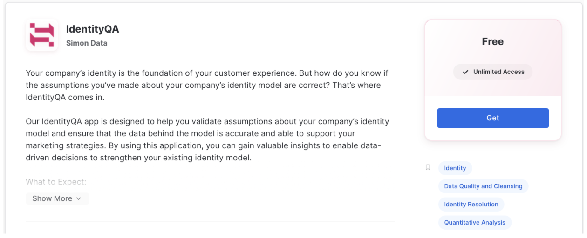
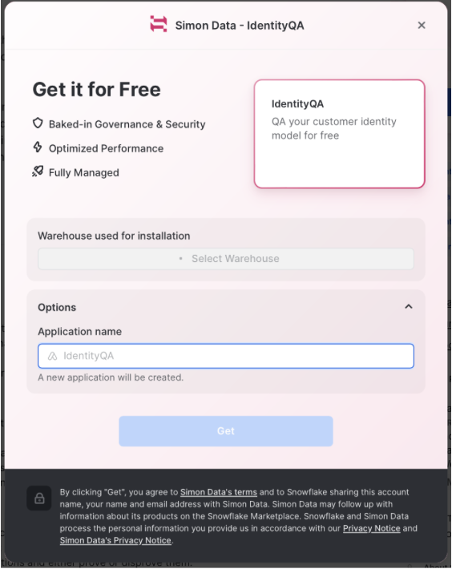

author: Emily
id: validate_your_customer_identity_model_with_identityqa
summary: Use IdentityQA to validate your customer identity model
categories: getting-started,data-warehouse,data-engineering
environments: web
status: Draft 
feedback link: https://github.com/Snowflake-Labs/sfguides/issues 
tags: Identity, Identity Model, Identity Modeling, Identity Resolution, Getting Started, Data Engineering Native Apps 

# Validate Your Customer Identity Model with IdentityQA

<!-- ------------------------ -->

## Overview 

Duration: 1

In this guide, we’ll be walking you through how to validate that the assumptions you’ve made about your identity model are correct using Simon Data’s Snowflake Native App, IdentityQA.  Let’s get going!


### Prerequisites

- A Snowflake account with an accessible warehouse, database, schema, and role

### What You’ll Need

- A Snowflake role with the ability to install Snowflake native apps & grant usage to the application (the ACCOUNTADMIN role works here)
- A basic understanding of your company’s identity model and the relationships between customer identifiers
- A single source table that contains at least two identifier columns to validate (e.g. user_id & email_address)

### What You'll Learn

- How to install & use a Snowflake native app
- Whether or not the assumptions you’ve made about your company’s identity model are true
    - For example: is your stable identifier truly unique?  Is user_id truly 1:1 with email_address?
- % of invalid email addresses & phone numbers in your identity table with examples of each for easy cleanup
- How to improve your identity model based on the native app’s findings

### What You'll Build

- A QA report on your company’s identity model that provides insights into how the model and/or underlying data can be improved to support better & more accurate marketing use cases

<!-- ------------------------ -->

## Application Architecture

Duration: 1

### Native App Overview
First, it’s important to understand how Snowflake native apps work and the benefits they provide from a security & privacy standpoint.

- Provider (in this case, Simon Data) creates an application package with manifest (metadata), setup script (SQL), and business logic (resource files).
- Provider publishes the application package as a listing on the Snowflake native app marketplace.
- Consumer (in this case, you) installs the application package from the listing in their own Snowflake account in order to create the application.

By default, the application has no permissions to do anything in your Snowflake account.  You must grant account- & object-level privileges to the application.  Once permission is granted, the app only has read-only access to the data within and will never make any changes or transformations to the data.  Once the app is run, the output is a set of tables in the application schema that you can query to see the results of the QA on your identity model.

<!-- ------------------------ -->

## App Setup

Duration: 3

### Install IdentityQA

In Snowflake, under **Marketplace**, search for Simon Data’s **_IdentityQA_** listing.  Click **Get** to request the application for your Snowflake account. 



You will be asked to select a warehouse to be used for installation and name the application.



In Snowflake, under **Data → Private Sharing**, install the **_IdentityQA_** listing. 

### Create the Application in Your Snowflake

Once installed, you'll have to change the name of the app to what you named it upon installation by running the following command in a worksheet:

```
CREATE APPLICATION <CHOSEN APP NAME>
  FROM APPLICATION PACKAGE IDQAAPP;
```

Expand the **APP** schema and see a number of **Procedures** that make up the IdentityQA app.  The rest of this guide will walk you through how to use those procedures.

### Grant Privileges
Before the app can run, however, you need to give it access to the correct database, schema, and table. Run the following commands:

```
GRANT USAGE ON DATABASE <YOUR_DATA_DB_NAME> to APPLICATION <CHOSEN APP NAME>;  
GRANT USAGE ON SCHEMA <YOUR_DATA_SCHEMA_NAME> to APPLICATION <CHOSEN APP NAME>;  
GRANT SELECT ON TABLE <YOUR_TABLE_NAME> TO APPLICATION <CHOSEN APP NAME>;

```

- **YOUR_DB_NAME** is the database name that contains your input table or view and will contain the IdentityQA output.
- **YOUR_SCHEMA_NAME** is the database schema from the last argument that contains your input table or view and will contain the IdentityQA output.
- **YOUR_TABLE_NAME** is the table/view that will serve as the input for the IdentityQA application.

<!-- ------------------------ -->

## Set Input Table

Duration: 3

In a worksheet, run the **SET_INPUT_TABLE** stored procedure, as follows. Be sure to include as many lines as you have identifiers in your source table.

```
CALL <CHOSEN APP NAME>.APP.SET_INPUT_TABLE('SOURCE_TABLE', [['<SOURCE_COLUMN>', '<IDENTIFIER_TYPE>', <IS_STABLE>],
                                                            ['<SOURCE_COLUMN>', '<IDENTIFIER_TYPE>', <IS_STABLE>],
                                                            ['<SOURCE_COLUMN>', '<IDENTIFIER_TYPE>', <IS_STABLE>]]);

```

- **SOURCE_TABLE** is the table name you specified when setting up and granting usage to the app. This should be fully qualified, meaning it should be formatted like: 'YOUR_DB_NAME.YOUR_SCHEMA_NAME.YOUR_TABLE_NAME'
- **SOURCE_COLUMN** is the column name that contains the identifier you are configuring.
- **IDENTIFIER_TYPE** defines the type of identifier in the previous argument.  Examples of supported identifier types are:
    - email
    - user_id
    - phone_number
    - custom_id

> aside negative
>
> [NOTE: email and/or phone_number identifiers must be included (and in this format) in order for some identifier valudations to run.]

- **IS_STABLE** is a boolean field that tells us whether or not the identifier should be stable. A stable identifier is one that is unique, is 1:1 with a single profile, and cannot be shared across profiles.
    - If the identifier you’re configuring is stable, put **TRUE** here. If it is not stable, put **FALSE**.

> aside negative
> 
> [NOTE: By definition, you can only have one stable identifier.]

### **EXAMPLE QUERY:**

```
CALL SIMONIDQA.APP.SET_INPUT_TABLE('SIMONDATA_TEST.PUBLIC.IDENTITY', [['EMAIL', 'EMAIL', TRUE],
                                                                      ['CLIENT_ID', 'CUSTOM_ID', FALSE],
                                                                      ['PHONE_NUMBER', 'PHONE_NUMBER', FALSE]]);

```

<!-- ------------------------ -->

## Set Constraints

Duration: 8 

Once you've configured your identifiers, you can set certain constraints (or assumptions) to validate. These constraints outline the relationships between two identifiers (i.e. 1:1 or 1:many) and identifier-specific limits (e.g. device_id can be shared across a maximum of 5 profiles).

### **SET_RELATIONSHIP_CONSTRAINT**

```
CALL <CHOSEN APP NAME>.APP.SET_RELATIONSHIP_CONSTRAINT('<RELATIONSHIP_TYPE>', '<IDENTIFIER_1>', '<IDENTIFIER_2>');
CALL <CHOSEN APP NAME>.APP.SET_RELATIONSHIP_CONSTRAINT('<RELATIONSHIP_TYPE>', '<IDENTIFIER_2>', '<IDENTIFIER_1>');

```

- **RELATIONSHIP_TYPE** is the relationship between the identifiers in the next two arguments.  **The only supported type today is ONE-TO-ONE.** 
- **IDENTIFIER_1** is the name of the first identifier for which you’re validating the relationship type.
- **IDENTIFIER_2** is the name of the second identifier for which you’re validating the relationship type.

> aside negative
> 
> [NOTE: If you want to check the 1:1 relationship going both ways, make sure you set two relationship constraints. If you only check the 1:1 relationship going one way (e.g. 1 user_id per email address only), you may get a false positive in the report. In this case, you would also want to check for 1 email address per user_id.]

#### **SET_RELATIONSHIP_CONSTRAINT EXAMPLE QUERY:**

The query below tells the application to validate whether or not **user_id** and **email** truly have a 1:1 relationship. If there are instances where the 1:1 relationship constraint is invalidated, the app flags them in the generated report.

```
CALL SIMONIDQA.APP.SET_RELATIONSHIP_CONSTRAINT('ONE-TO-ONE', 'USER_ID', 'EMAIL_ADDR');
CALL SIMONIDQA.APP.SET_RELATIONSHIP_CONSTRAINT('ONE-TO-ONE', 'EMAIL_ADDR', 'USER_ID');
```

### **SET_UNIQUE_CONSTRAINT**

This constraint checks for the uniqueness of the values for a particular identifier.

```
CALL <CHOSEN APP NAME>.APP.SET_UNIQUE_CONSTRAINT('<IDENTIFIER_NAME>');

```

- **IDENTIFIER_NAME** is the name of the identifier for which you want to check the uniqueness.

#### **SET_UNIQUE_CONSTRAINT EXAMPLE QUERY:**

```
CALL SIMONIDQA.APP.SET_UNIQUE_CONSTRAINT('EMAIL');
```
> aside negative
> 
> [NOTE: If you set a shared identifier limit, you should _not_ run a uniqueness check on your stable identifier or else you'll get a false negative.  This is because if a non-stable identifier can be shared across profiles, there are inherently going to be multiple rows for a single stable identifier in your input table.]

### **SET_SHARED_IDENTIFIER_LIMIT**

This constraint sets a maximum threshold for which a single identifier can be shared across different profiles. 

```
CALL <CHOSEN APP NAME>.APP.SET_SHARED_IDENTIFIER_LIMIT('<IDENTIFIER_NAME>', <THRESHOLD>);

```

- **IDENTIFIER_NAME** is the name of the identifier for which you want to set a maximum threshold.
- **THRESHOLD** is the maximum number of different profiles on which the IDENTIFIER_NAME in the previous argument can exist. This field should be an integer.

#### **SET_SHARED_IDENTIFIER_LIMIT EXAMPLE QUERY:**

A customer may have a landline that they share with everyone in the household. Let’s say the average number of people in a household is 3 and you believe your customer base tends to have landlines. You could set your shared identifier limit threshold to 3 to validate this assumption.

```
CALL SIMONIDQA.APP.SET_SHARED_IDENTIFIER_LIMIT('phone_number', 3);

```

<!-- ------------------------ -->

## Generate Report

Duration: 5 

### Manual Inspection

Run the following command to generate your IdentityQA report!

```
CALL <CHOSEN APP NAME>.APP.generate_report();
```

The output will be available in the following tables in the **REPORT** schema within the **SIMON_IDENTITY_QA** application as well as on the **Report** page in the Streamlit. To query the tables directly in the REPORT schema within the application, you can run the following:

```
-- RUN THIS QUERY TO PULL THE TABLE NAMES SPECIFIC TO YOUR IDENTIFIERS
SELECT * FROM <CHOSEN APP NAME>.REPORT.CARDINALITY_CHECK_TABLES
-- THEN RUN A SELECT * ON EACH OF THE TABLES GENERATED.  FOR EXAMPLE:
SELECT * FROM <CHOSEN APP NAME>.REPORT.CARDINALITY_CHECK_USER_ID_EMAIL

-- THE REST OF THESE QUERIES CAN BE RUN TO INSPECT OTHER RESULTS
SELECT * FROM <CHOSEN APP NAME>.REPORT.IDENTIFIER_VALIDATION
SELECT * FROM <CHOSEN APP NAME>.REPORT.INVALID_IDENTIFIERS
SELECT * FROM <CHOSEN APP NAME>.REPORT.RELATIONSHIP_CONSTRAINTS_CHECK
SELECT * FROM <CHOSEN APP NAME>.REPORT.SHARED_IDENTIFIER_LIMIT_CHECK
SELECT * FROM <CHOSEN APP NAME>.REPORT.UNIQUE_CONSTRAINTS_CHECK
```

### Streamlit Report

To view your report in Streamlit, return to the app & launch it in Streamlit. Steps below:

- If you're in a worksheet, click the **back arrow** in the top left corner of your screen to return to Snowsight.
- Click **Apps**. Make sure you're in the correct Snowflake role!
- Click the **SIMON_IDENTITY_QA** application to launch the Streamlit. The name of the app on this page should be what you named it upon installation.
- Select a warehouse in the upper righthand corner of the Streamlit if one is not chosen already.
- Your Streamlit will now load! It may take a little while depending on how many rows of data you ran through the application.
- Click on the **Report** page in the lefthand navigation of the Streamlit.

<!-- ------------------------ -->

## Interpreting the Report

Duration: 10 

This is an example input table that we used to generate the report shown in screenshots below.  


> aside negative
>
> [NOTE: Additional screenshots in this section are from the Streamlit report.]

The top of the report shows you the name of the input table you configured as well as the total number of rows in said input table.


### Constraint Checks

Next, the report will show pass/fail statuses on the constraints you configured.  

As you can see in the screenshot below, the **client_id** & **email** identifiers passed the 1:1 relationship check going one way but not the other.  This tells you that for every **client_id** there is only one **email**, but the app found instances where an **email** had more than one **client_id**.  Examples of these failures will be explored later.


Additionally, the shared identifier limit check failed on **phone_number**.  This means that the app discovered instances where a single **phone_number** appears on more than 3 profiles, which violates the assumption that **phone_number** is shared at most across 3 profiles at any given time.  

### Cardinality Checks

The next check is a high-cardinality test for each identifier in the input table compared to the stable identifier.  IdentityQA tests for cardinality because exceptionally high counts of any identifier per single stable identifier generally mean that there is an issue with the underlying data.  In the screenshot below, you can see that there are 10 profiles that have an abnormally high count of **client_ids** compared to the other 15 profiles in the sample.  This tells you that these emails may be fake, or maybe they’re emails used for testing purposes and should be excluded from marketing. 

Your next step here should be to dive into these email addresses and determine why they might have so many **client_ids** associated with them and if they’re valid profiles or not. 


### Identifier Validation

Next, the report shows **email** & **phone_number** validations.  You can see in this example that out of the ~1M total records in the input table, ~30K emails are considered invalid and ~80M phone numbers are considered invalid.  

> aside negative
> 
> [NOTE: “Invalid” in this case means that the email or phone number is missing one or more properties in order to be considered a “valid” identifier.  Example: emails with no “@” are flagged here, as well as phone numbers with letters in them or fewer/greater than 10 numbers.
> 
> **We are not testing whether or not these emails or phone numbers belong to real people rather than bots.]**


<!-- ------------------------ -->

## Conclusion & Resources

Duration: 1

Congratulations!  You’ve successfully QA’d your customer identity model using Simon Data’s Native Snowflake App, **IdentityQA**!  You now have the insight you need to be able to finetune & improve your identity model.  

### What You Learned

- How to install & use a Snowflake native app
- Whether or not the assumptions you’ve made about your company’s identity model are true
- % of invalid email addresses & phone numbers in your identity table with examples of each for easy cleanup
- How to improve your identity model based on the native app’s findings

### Related Resources

- [IdentityQA docs](https://docs.simondata.com/developers/docs/identityqa)
