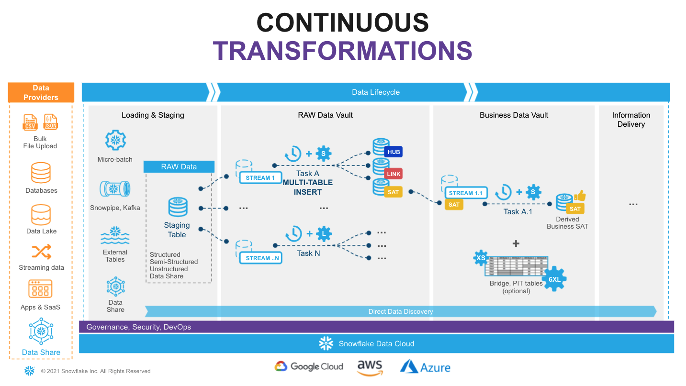
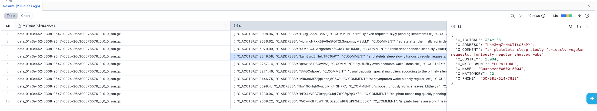
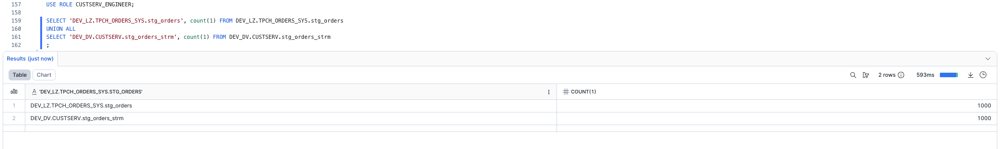
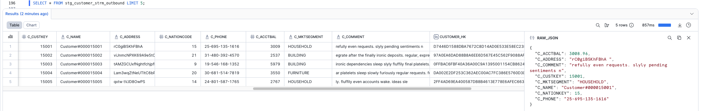
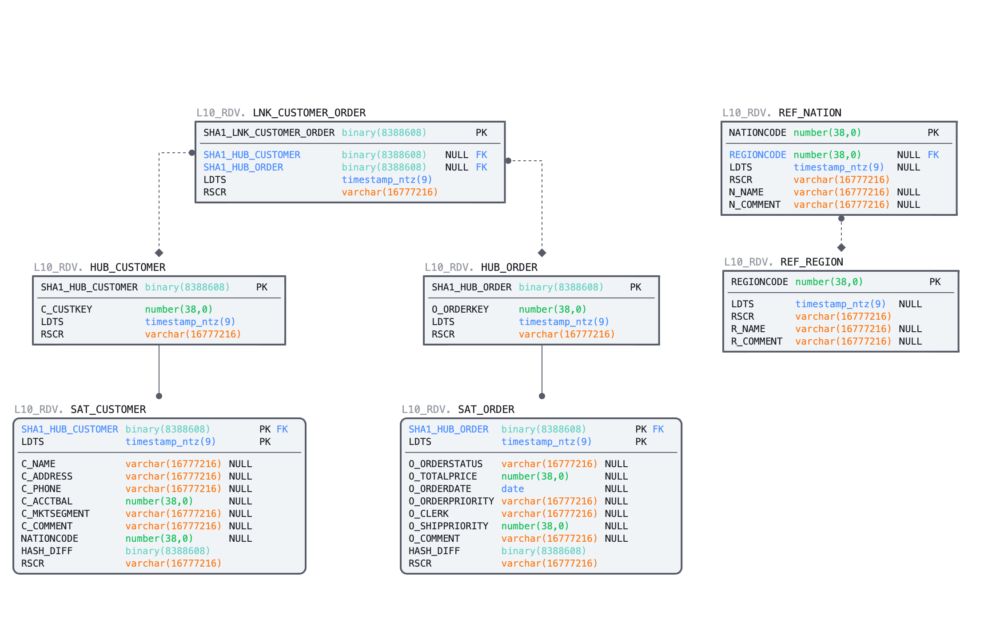
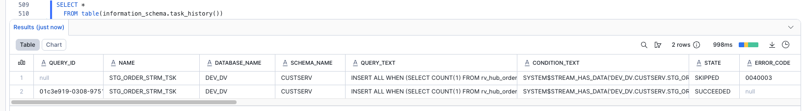
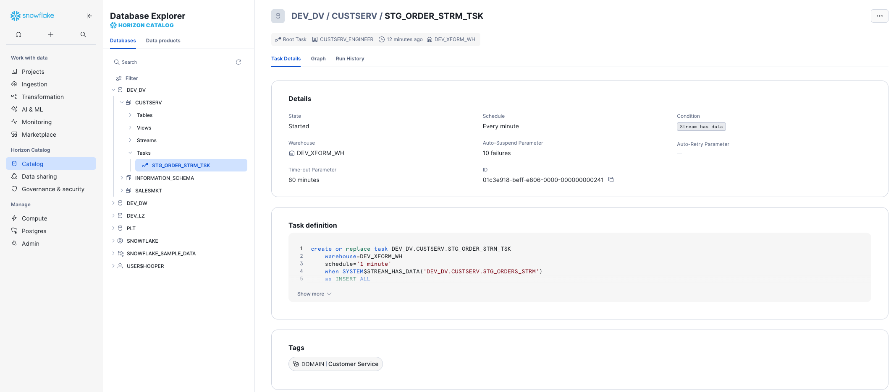
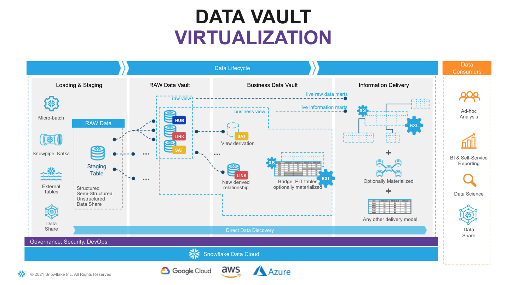
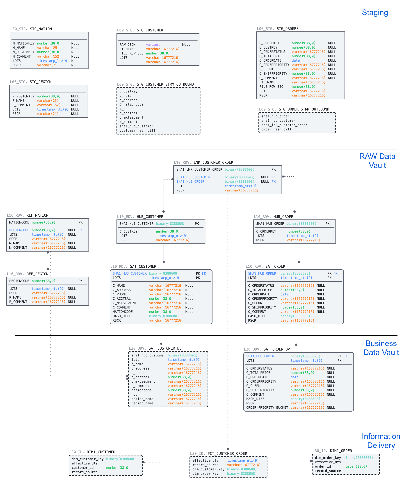

author: Paul Hooper
id: vhol-data-vault
categories: snowflake-site:taxonomy/solution-center/certification/quickstart, snowflake-site:taxonomy/product/data-engineering
language: en
summary: Building a Real-time Data Vault in Snowflake 
environments: web
status: Published 
feedback link: https://github.com/Snowflake-Labs/sfguides/issues

# Building a Real-Time Data Vault in Snowflake
<!-- ------------------------ -->
## Continuous Data

Today, with the ever-increasing availability and volume of data from many types of sources such as IoT, mobile devices, and weblogs, there is a growing need, and yes, demand, to go from batch load processes to streaming continuous real-time (RT) data. Businesses change at a rapid rate, becoming more competitive all the time. Those that can harness the value of their data faster to drive better decision making and better business outcomes will prevail.

One of the benefits of using the Data Vault system is that it was designed from inception not only to accept data loaded using traditional batch mode (which was the prevailing mode in the early 2000s when [Dan Linstedt](https://datavaultalliance.com/#about) introduced Data Vault) but also to easily accept data loading continuously in real or near-realtime (NRT). In the early 2000s, that was a nice-to-have aspect of the approach and meant the methodology was effectively future-proofed from that perspective. Still, few database systems had the capacity to support that kind of requirement. Today, RT or at least NRT loading is almost becoming a mandatory requirement for modern data platforms. Granted, not all loads or use cases need to be NRT, but most forward-thinking organizations need to onboard data for analytics in an NRT manner.

Those who have been using the Data Vault approach don’t need to change much other than figure out how to engineer their data pipeline to serve up data to the Data Vault in NRT. The data models don’t need to change; the reporting views don’t need to change; even the loading patterns don’t need to change. For those that aren’t using Data Vault already, if they have real-time loading requirements, this architecture and method might be worth considering.

### Data Vault on Snowflake

There have been numerous [blog posts](/blog/tips-for-optimizing-the-data-vault-architecture-on-snowflake/), user groups, and webinars over the years, discussing the best practices and customer success stories around implementing Data Vaults on Snowflake.  So the question now is how do you build a Data Vault on Snowflake that has real-time or near real-time continuous data streaming into it.

Luckily, streaming data is one of the [use-cases](/cloud-data-platform/) that Snowflake was built to support, so we have many features to help us achieve this goal. **This guide is an extended version of the [article](https://datavaultalliance.com/news/building-a-real-time-data-vault-in-snowflake/) posted on Data Vault Alliance website, now including practical steps to build an example of real-time Data Vault feed on Snowflake. Join us on simple-to-follow steps to see it in action.**

### Prerequisites
- A Snowflake account, set up using the [Defensible Analytics using Data Vault and Snowflake](https://www.snowflake.com/en/developers/guides/defensible-analytics-using-data-vault-and-snowflake/) guide. If you don't use this guide to set up your account, you'll need to alter the references to roles, databases, schemas, warehouses, and other Snowflake objects to work with your account.
- Familiarity with [Snowflake key concepts and architecture](https://docs.snowflake.com/en/user-guide/intro-key-concepts)
- Familiarity with [Data Vault methodology and architecture](https://datavaultalliance.com/#resources)

### What You’ll Learn
- How to use Data Vault modeling on Snowflake
- How to build basic objects and write ELT code for them
- How to leverage [Snowpipe](https://docs.snowflake.com/en/user-guide/data-load-snowpipe-intro.html) and [Continuous Data Pipelines](https://docs.snowflake.com/en/user-guide/data-pipelines.html) to automate data processing
- How to apply data virtualization to accelerate data access

### What You’ll Need 
- A Snowflake account -- we recommend starting with a [trial](https://trial.snowflake.com/) account

### What You’ll Build 
- Data Vault models on Snowflake, based on sample dataset 
- Data pipelines, leveraging streams, tasks and Snowpipe


<!-- ------------------------ -->
## Reference Architecture and Environment Setup

This is the target architecture. 

  

In the [Defensible Analytics using Data Vault and Snowflake](https://www.snowflake.com/en/developers/guides/defensible-analytics-using-data-vault-and-snowflake/) guide, we implement components of this architecture, which we'll use in this guide. If you haven't already executed the steps in that guide in your Snowflake account, you'll need to do that now, or change the examples given in this guide to accommodate your design.


<!-- ------------------------ -->
## Data Pipelines: Design

  

Snowflake supports multiple options for engineering data pipelines. In this post we are going to show one of the most efficient ways to implement incremental NRT integration leveraging Snowflake [Continuous Data Pipelines](https://docs.snowflake.com/en/user-guide/data-pipelines.html).  Let's take a look at the architecture diagram above to understand how it works. 

Snowflake has a special [stream](https://docs.snowflake.com/en/user-guide/streams.html) object that tracks all data changes on a table (inserts, updates, and deletes). This process is 100% automatic and unlike traditional databases will never impact the speed of data loading. The change log from a stream is automatically ‘consumed’ once there is a successfully completed DML operation using the stream object as a source. 

So, loading new data into a staging table, would immediately be reflected in a stream showing the [‘delta’](https://docs.snowflake.com/en/user-guide/streams.html#data-flow) that requires processing.

The second component we are going to use is [tasks](https://docs.snowflake.com/en/user-guide/tasks-intro.html). It is a Snowflake managed data processing unit that will wake up on a defined interval (e.g., every 1-2 min), check if there is any data in the associated stream and if so, will run SQL to push it to the Raw Data Vault objects. Tasks could be arranged in a [tree-like dependency graph](https://docs.snowflake.com/en/user-guide/tasks-intro.html#simple-tree-of-tasks), executing child tasks the moment the predecessor finished its part. 

Last but not least, following Data Vault 2.1 best practices for NRT data integration (to load data in parallel) we are going to use Snowflake’s [multi-table insert (MTI)](https://docs.snowflake.com/en/sql-reference/sql/insert-multi-table.html) inside tasks to populate multiple Raw Data Vault objects by a single DML command. (Alternatively you can create multiple streams & tasks from the same table in stage in order to populate each data vault object by its own asynchronous flow.) 

Next step, you assign tasks to one or many virtual warehouses. This means you always have enough [compute power](https://docs.snowflake.com/en/user-guide/warehouses-overview.html#warehouse-size) (XS to 6XL) to deal with any size workload, whilst the [multi-cluster virtual warehouse](https://docs.snowflake.com/en/user-guide/warehouses-multicluster.html#multi-cluster-warehouses) option will automatically scale-out and load balance all the tasks as you introduce more hubs, links and satellites to your vault. 

Talking about tasks, Snowflake just introduced another fantastic capability - serverless tasks. This enables you to rely on compute resources managed by Snowflake instead of user-managed virtual warehouses. These compute resources are automatically resized and scaled up and down by Snowflake as required by each workload. This feature will be out of scope for this guide, but serverless compute model could reduce compute costs, in some cases significantly, allowing you to process more data, faster with even less management. 

As your raw vault is updated, streams can then be used to propagate those changes to Business Vault objects (such as derived Sats, PITS, or Bridges, if needed) in the next layer. This setup can be repeated to move data through all the layers in small increments very quickly and efficiently. All the way until it is ready to be accessed by data consumers (if materialization of the data is required for performance). 

Following this approach will result in a hands-off production data pipeline that feeds your Data Vault architecture.

<!-- ------------------------ -->
## Build: Landing Zone, Sample Data and Staging for the Raw Vault

Every Snowflake account provides access to [sample data sets](https://docs.snowflake.com/en/user-guide/sample-data.html). You can find corresponding schemas in SNOWFLAKE_SAMPLE_DATA database in your object explorer.
For this guide we are going to use a subset of objects from [TPC-H](https://docs.snowflake.com/en/user-guide/sample-data-tpch.html) set, representing **customers** and their **orders**. We also going to take some reference data about **nations** and **regions**. 

| Dataset | System | Specific Source | Load Scenario | Mechanism |
|---------|-------------|--------|---------------|-----------|
| Nation | Static Reference | snowflake.sample_data.tpch_sf10.nation | one-off CTAS | SQL |
| Region | Static Reference | snowflake.sample_data.tpch_sf10.region | one-off CTAS | SQL |
| Customer | Customer System | snowflake.sample_data.tpch_sf10.customer | incremental JSON files | Snowpipe |
| Orders | Orders System | snowflake.sample_data.tpch_sf10.orders | incremental CSV files | Snowpipe |

> In the real world, we rarely have a singular source system with all our data. So, even though our sample dataset comes from a single Snowflake share, we'll act as if it comes from three different source systems, and simulate the customer detail comes in the form of a semi-structured raw JSON object.

### Step 1: LZ - Static Reference Data

Let's start with the static reference data, loading that with simple one-off CTAS (CREATE TABLE ... AS SELECT ...) statements. If you've just completed the [Defensible Analytics using Data Vault and Snowflake](https://www.snowflake.com/en/developers/guides/defensible-analytics-using-data-vault-and-snowflake/) guide, create a new SQL file in Workspaces named DVRealTime.sql.

> **Data Vault audit columns:** Every entity in this guide carries two mandatory audit columns. `ldts` (*Load Date Time Stamp*) is the immutable timestamp of when the row was loaded into the vault — set once on arrival and never changed, with meaning only to the data vault. This is not when the data originated, but when loaded in from the source. `rsrc` (*Record Source*) identifies the originating system or feed. Together they ensure every record is fully traceable: you can always answer *when* did this arrive and *where* did it come from, satisfying both auditability and compliance requirements.

```sql
-- LZ: Static Reference Data ---------------------------------------------------
USE ROLE DEV_LZ_INGEST;
USE WAREHOUSE DEV_INGEST_WH;
USE DATABASE DEV_LZ;
USE SCHEMA TPCH_REF;

CREATE OR REPLACE TABLE stg_nation 
AS 
SELECT src.*
     , CURRENT_TIMESTAMP()    ldts 
     , 'Static Reference'     rsrc 
  FROM snowflake_sample_data.tpch_sf10.nation src
;

CREATE OR REPLACE TABLE stg_region
AS 
SELECT src.*
     , CURRENT_TIMESTAMP()    ldts 
     , 'Static Reference'     rsrc 
  FROM snowflake_sample_data.tpch_sf10.region src
;
```

### Step 2: LZ - Raw Customer and Order Data

Next, let's create staging tables for our future data pipeline. This syntax should be very familiar with anyone working with databases before. It is ANSI SQL compliant DDL, with probably one key exception - for stg_customer we are going to load the full payload of JSON into raw_json column. For this, Snowflake has a special data type [VARIANT](https://docs.snowflake.com/en/sql-reference/data-types-semistructured.html). 

As we load data we'll also add some technical metadata, like the row number in a file. 

```sql
-- LZ: Customer System ---------------------------------------------------------
USE SCHEMA TPCH_CUSTOMER_SYS;

CREATE OR REPLACE TABLE stg_customer
(
  raw_json                VARIANT
, filename                STRING   NOT NULL
, file_row_seq            NUMBER   NOT NULL
, ldts                    STRING   NOT NULL
, rsrc                    STRING   NOT NULL
)
CHANGE_TRACKING = TRUE;

-- LZ: Orders System -----------------------------------------------------------
USE SCHEMA TPCH_ORDERS_SYS;

CREATE OR REPLACE TABLE stg_orders
(
  o_orderkey              NUMBER
, o_custkey               NUMBER  
, o_orderstatus           STRING
, o_totalprice            NUMBER  
, o_orderdate             DATE
, o_orderpriority         STRING
, o_clerk                 STRING
, o_shippriority          NUMBER
, o_comment               STRING
, filename                STRING   NOT NULL
, file_row_seq            NUMBER   NOT NULL
, ldts                    STRING   NOT NULL
, rsrc                    STRING   NOT NULL
)
CHANGE_TRACKING = TRUE;
```

### Step 3: DV - Tracking New Data to be loaded into the Raw Vault

The tables we just created are going to be used by Snowpipe to drip-feed the data as it is lands in the stage. In order to easily detect and incrementally process the new portion of data we'll create [streams](https://docs.snowflake.com/en/user-guide/streams.html) on these staging tables. These streams are part of the mechanism used to load data into the Enterprise Memory Zone's Raw Vault, not into the Landing Zone, so we place them accordingly.

```sql
--- DV: Tracking Customer Changes ----------------------------------------------
USE ROLE SALESMKT_ENGINEER;
USE WAREHOUSE ENGINEERING_WH;
USE DATABASE DEV_DV;
USE SCHEMA SALESMKT;

CREATE OR REPLACE STREAM stg_customer_strm ON TABLE DEV_LZ.TPCH_CUSTOMER_SYS.stg_customer;

-- DV: Tracking Orders Changes ------------------------------------------------
USE ROLE CUSTSERV_ENGINEER;
USE SCHEMA CUSTSERV;

CREATE OR REPLACE STREAM stg_orders_strm ON TABLE DEV_LZ.TPCH_ORDERS_SYS.stg_orders;
```

> Note the use of two different roles here. You are effectively acting as a data engineer for two domains. Domains are not teams. A single person can have multiple functional roles, which are like "wearing different hats." In a real-world scenario, we're likely working with subject matter experts and getting approval from leaders specific to either the Sales & Marketing domain (perhaps the CRO, or VP of Sales), or the Customer Service domain (perhaps the CCO, or VP of Customer Success). The process is similar, but the specific people are often different.

### Step 4: LZ - Simulating New Data into the Landing Zone

Next we'll produce some sample data. And for the sake of simplicity we'll take a bit of a shortcut here, generating data by unloading subset of data from our TPCH sample dataset into files. Then we'll use Snowpipe to load it back into our Landing Zone, simulating the streaming feed.

Let's start by creating two stages for each data class type, orders and customer. In real-life scenarios these could be internal or external stages, or these feeds could be sourced via the [Snowflake Connector for Kafka](https://docs.snowflake.com/en/user-guide/kafka-connector/index), using high-performance [Snowpipe Streaming](https://docs.snowflake.com/en/user-guide/snowpipe-streaming/data-load-snowpipe-streaming-overview). The world is your oyster. 

```sql
-- LZ: Simulating Customer System Data -----------------------------------------
USE ROLE DEV_LZ_INGEST;
USE WAREHOUSE DEV_INGEST_WH;
USE DATABASE DEV_LZ;
USE SCHEMA TPCH_CUSTOMER_SYS;

CREATE OR REPLACE STAGE customer_data FILE_FORMAT = (TYPE = JSON);

-- LZ: Simulating Orders System Data -------------------------------------------
USE SCHEMA TPCH_ORDERS_SYS;

CREATE OR REPLACE STAGE orders_data   FILE_FORMAT = (TYPE = CSV );
```

Next we'll generate and unload sample data. There are couple of things going on.

First, we are using [object_construct](https://docs.snowflake.com/en/sql-reference/functions/object_construct.html) as a quick way to create a object/document from all columns and subset of rows for **customer** data and offload it into customer_data stage. **Orders** data would be extracted into compressed CSV files. There are many additonal options in the [COPY INTO stage](https://docs.snowflake.com/en/sql-reference/sql/copy-into-location.html) construct that would fit most requirements, but in this case we are using INCLUDE_QUERY_ID to make it easier to generate new incremental files, as we are going to run these commands over and over again, without a need to deal with file overriding. 

```sql
-- LZ: Simulating Customer System Data -----------------------------------------
USE SCHEMA TPCH_CUSTOMER_SYS;

COPY INTO @customer_data 
FROM
(SELECT object_construct(*)
  FROM snowflake_sample_data.tpch_sf10.customer limit 10
) 
INCLUDE_QUERY_ID=TRUE;

-- LZ: Simulating Orders System Data -------------------------------------------
USE SCHEMA TPCH_ORDERS_SYS;

COPY INTO @orders_data 
FROM
(SELECT *
  FROM snowflake_sample_data.tpch_sf10.orders limit 1000
) 
INCLUDE_QUERY_ID=TRUE;
```

You can now run the following to validate that the JSON object data is now stored in files:

```sql
-- LZ: Inspecting Customer System Data -----------------------------------------
USE SCHEMA TPCH_CUSTOMER_SYS;

LIST @customer_data;

SELECT METADATA$FILENAME,$1 FROM @customer_data; 
```


Next, we are going to setup Snowpipe to load data from files in a stage into staging tables. 

In this guide, for better transparency we are going to trigger Snowpipe explicitly to scan for new files, but in real projects you will likely going to enable AUTO_INGEST, connecting it with your cloud storage events (like AWS SNS) and process new files automatically. 

```sql
-- LZ: Simulating Orders System Data -------------------------------------------
USE SCHEMA TPCH_ORDERS_SYS;

CREATE OR REPLACE PIPE stg_orders_pp 
AS 
COPY INTO stg_orders 
FROM
(
SELECT $1,$2,$3,$4,$5,$6,$7,$8,$9 
     , metadata$filename
     , metadata$file_row_number
     , CURRENT_TIMESTAMP()
     , 'Orders System'
  FROM @orders_data
);

ALTER PIPE DEV_LZ.TPCH_ORDERS_SYS.stg_orders_pp REFRESH;

-- LZ: Simulating Customer System Data -----------------------------------------
USE SCHEMA TPCH_CUSTOMER_SYS;

CREATE OR REPLACE PIPE stg_customer_pp 
--AUTO_INGEST = TRUE
--aws_sns_topic = 'arn:aws:sns:mybucketdetails'
AS 
COPY INTO stg_customer
FROM 
(
SELECT $1
     , metadata$filename
     , metadata$file_row_number
     , CURRENT_TIMESTAMP()
     , 'Customers System'
  FROM @customer_data
);

ALTER PIPE DEV_LZ.TPCH_CUSTOMER_SYS.stg_customer_pp REFRESH;
```

Once this done, you should see data is appearing in the target tables and the stream on these tables.
As you would notice, number of rows in a stream is exactly the same as in the base table. This is because we didn't process/consumed the delta of that stream yet. Stay tuned! 

```sql
-- DV: Inspecting Streams ------------------------------------------------------
USE ROLE SALESMKT_ENGINEER;
USE WAREHOUSE ENGINEERING_WH;

SELECT 'DEV_LZ.TPCH_CUSTOMER_SYS.stg_customer', count(1) FROM DEV_LZ.TPCH_CUSTOMER_SYS.stg_customer
UNION ALL
SELECT 'DEV_DV.SALESMKT.stg_customer_strm', count(1) FROM DEV_DV.SALESMKT.stg_customer_strm
;

USE ROLE CUSTSERV_ENGINEER;

SELECT 'DEV_LZ.TPCH_ORDERS_SYS.stg_orders', count(1) FROM DEV_LZ.TPCH_ORDERS_SYS.stg_orders
UNION ALL
SELECT 'DEV_DV.CUSTSERV.stg_orders_strm', count(1) FROM DEV_DV.CUSTSERV.stg_orders_strm
;
```


### Step 5: DV - Preparing to Load the Raw Vault

Finally, now that we established the basics and new data is knocking at our door (stream), let's see how we can derive some of the business keys for the Data Vault entities we are going to model. In this example, we'll model it as a view on top of the stream that should allow us to perform data parsing (raw_json -> columns) and business_key, hash_diff derivation on the fly.

Another thing to notice here is the use of SHA1_BINARY as hashing function. There are many articles on choosing between MD5/SHA1(2)/other hash functions, so we won't focus on this. For this lab, we are going to use fairly common SHA1 and its BINARY version from Snowflake arsenal of functions that use less bytes to encode value than STRING. Note that our chosen delimiter is '^', '-1' represents our required null keys or missing descriptive data, '_hk' indicates a hash key, and '_hd' indicates a hash diff. While Data Vault 2.1 does not standardized specific hashing algorithms or naming conventions, is does state they must be applied consistently across the implementation.

After creating the views, be sure to take a good look at the sample output.

```sql
-- DV: Hard Business Rules and Hashing - Customer ------------------------------
USE ROLE SALESMKT_ENGINEER;
USE WAREHOUSE ENGINEERING_WH;
USE DATABASE DEV_DV;
USE SCHEMA SALESMKT;

CREATE OR REPLACE VIEW stg_customer_strm_outbound AS 
SELECT src.*
     , raw_json:C_CUSTKEY::NUMBER           c_custkey
     , raw_json:C_NAME::STRING              c_name
     , raw_json:C_ADDRESS::STRING           c_address
     , raw_json:C_NATIONKEY::NUMBER         C_nationcode
     , raw_json:C_PHONE::STRING             c_phone
     , raw_json:C_ACCTBAL::NUMBER           c_acctbal
     , raw_json:C_MKTSEGMENT::STRING        c_mktsegment
     , raw_json:C_COMMENT::STRING           c_comment     
--------------------------------------------------------------------
-- derived hashes
--------------------------------------------------------------------
     , SHA1_BINARY(UPPER(TRIM(NVL(c_custkey,'-1'))))  AS  customer_hk
     , SHA1_BINARY(UPPER(ARRAY_TO_STRING(ARRAY_CONSTRUCT( 
                                              NVL(TRIM(c_name)       ,'-1')
                                            , NVL(TRIM(c_address)    ,'-1')              
                                            , NVL(TRIM(c_nationcode) ,'-1')                 
                                            , NVL(TRIM(c_phone)      ,'-1')            
                                            , NVL(TRIM(c_acctbal)    ,'-1')               
                                            , NVL(TRIM(c_mktsegment) ,'-1')                 
                                            , NVL(TRIM(c_comment)    ,'-1')               
                                            ), '^')))  AS customer_hd
  FROM stg_customer_strm src
;

SELECT * FROM stg_customer_strm_outbound LIMIT 5;

-- DV: Hard Business Rules and Hashing - Orders --------------------------------
USE ROLE CUSTSERV_ENGINEER;
USE SCHEMA DEV_DV.CUSTSERV;

CREATE OR REPLACE VIEW stg_order_strm_outbound AS 
SELECT src.*
--------------------------------------------------------------------
-- derived hashes
--------------------------------------------------------------------
     , SHA1_BINARY(UPPER(TRIM(o_orderkey)))                        AS order_hk
     , SHA1_BINARY(UPPER(TRIM(o_custkey)))                         AS customer_hk
     , SHA1_BINARY(UPPER(ARRAY_TO_STRING(ARRAY_CONSTRUCT( NVL(TRIM(o_orderkey)       ,'-1')
                                                        , NVL(TRIM(o_custkey)        ,'-1')
                                                        ), '^')))  AS customer_order_hk
     , SHA1_BINARY(UPPER(ARRAY_TO_STRING(ARRAY_CONSTRUCT( NVL(TRIM(o_orderstatus)    , '-1')         
                                                        , NVL(TRIM(o_totalprice)     , '-1')        
                                                        , NVL(TRIM(o_orderdate)      , '-1')       
                                                        , NVL(TRIM(o_orderpriority)  , '-1')           
                                                        , NVL(TRIM(o_clerk)          , '-1')    
                                                        , NVL(TRIM(o_shippriority)   , '-1')          
                                                        , NVL(TRIM(o_comment)        , '-1')      
                                                        ), '^')))  AS order_hd     
  FROM DEV_DV.CUSTSERV.stg_orders_strm src
;

SELECT * FROM stg_order_strm_outbound LIMIT 5;
```



Does the output look good? Well done! We've built our staging/inbound pipeline, ready to accommodate streaming data with defined business keys, hash keys, and hash diffs that we are going to use in our Raw Data Vault. Let's move on to the next step!


<!-- ------------------------ -->
## Build: Data Vault - Raw Vault

In this section, we will start building structures and pipelines for the **Raw Vault**.

Here is the ERD of the objects we are going to deploy using the script below:


### Step 1: Raw Vault Tables

We'll start with DDL for the Hubs, Links and Satellites. As you can expect, this guide won't go into detail on the data vault modelling process. For certified training in DV2.1, We highly recommend working with experts & partners from Data Vault Alliance. Note that while we'll identify primary and foreign keys, remember that Snowflake does not enforce constraints.

```sql
-- DV: Raw Vault - Sales & Marketing -------------------------------------------
USE ROLE SALESMKT_ENGINEER;
USE WAREHOUSE ENGINEERING_WH;
USE SCHEMA DEV_DV.SALESMKT;

-- Sales & Marketing: Region Reference
CREATE OR REPLACE TABLE ref_region 
( 
  regioncode            NUMBER 
, ldts                  TIMESTAMP
, rsrc                  STRING    NOT NULL
, r_name                STRING
, r_comment             STRING
, CONSTRAINT pk_ref_region        PRIMARY KEY (regioncode)                                                                             
)
AS 
SELECT r_regionkey
     , ldts
     , rsrc
     , r_name
     , r_comment
  FROM DEV_LZ.TPCH_REF.stg_region;

-- Sales & Marketing: Nation Reference
CREATE OR REPLACE TABLE ref_nation 
( 
  nationcode            NUMBER 
, regioncode            NUMBER 
, ldts                  TIMESTAMP
, rsrc                  STRING    NOT NULL
, n_name                STRING
, n_comment             STRING
, CONSTRAINT pk_ref_nation        PRIMARY KEY (nationcode)                                                                             
, CONSTRAINT fk_ref_region        FOREIGN KEY (regioncode) REFERENCES ref_region(regioncode)  
)
AS 
SELECT n_nationkey
     , n_regionkey
     , ldts
     , rsrc
     , n_name
     , n_comment
  FROM DEV_LZ.TPCH_REF.stg_nation;

-- Sales & Marketing: Raw Vault Customer Hub
CREATE OR REPLACE TABLE rv_hub_customer 
( 
  customer_hk             BINARY    NOT NULL   
, customer_bk             NUMBER    NOT NULL                                                                                 
, ldts                    TIMESTAMP NOT NULL
, rsrc                    STRING    NOT NULL
, CONSTRAINT pk_rv_hub_customer     PRIMARY KEY(customer_hk)
);

-- Sales & Marketing: Raw Vault Customer Satellite
CREATE OR REPLACE TABLE rv_sat_customer 
( 
  customer_hk            BINARY    NOT NULL   
, ldts                   TIMESTAMP NOT NULL
, c_name                 STRING
, c_address              STRING
, c_phone                STRING 
, c_acctbal              NUMBER
, c_mktsegment           STRING    
, c_comment              STRING
, nationcode             NUMBER
, customer_hd            BINARY    NOT NULL
, rsrc                   STRING    NOT NULL  
, CONSTRAINT pk_rv_sat_customer    PRIMARY KEY(customer_hk, ldts)
, CONSTRAINT fk_rv_sat_customer    FOREIGN KEY(customer_hk) REFERENCES rv_hub_customer
);

-- DV: Raw Vault - Customer Service
USE ROLE CUSTSERV_ENGINEER;
USE SCHEMA DEV_DV.CUSTSERV;

-- Customer Service: Raw Vault Order Hub
CREATE OR REPLACE TABLE rv_hub_order 
( 
  order_hk                BINARY    NOT NULL   
, order_bk                NUMBER    NOT NULL                                                                                 
, ldts                    TIMESTAMP NOT NULL
, rsrc                    STRING    NOT NULL
, CONSTRAINT pk_rv_hub_order        PRIMARY KEY(order_hk)
);

-- Customer Service: Raw Vault Order Hub
CREATE OR REPLACE TABLE rv_sat_order 
( 
  order_hk               BINARY    NOT NULL   
, ldts                   TIMESTAMP NOT NULL
, o_orderstatus          STRING   
, o_totalprice           NUMBER
, o_orderdate            DATE
, o_orderpriority        STRING
, o_clerk                STRING    
, o_shippriority         NUMBER
, o_comment              STRING
, order_hd               BINARY    NOT NULL
, rsrc                   STRING    NOT NULL   
, CONSTRAINT pk_rv_sat_order       PRIMARY KEY(order_hk, ldts)
, CONSTRAINT fk_rv_sat_order       FOREIGN KEY(order_hk) REFERENCES rv_hub_order
);

-- Customer Service: Raw Vault Order Hub
CREATE OR REPLACE TABLE rv_lnk_customer_order
(
  customer_order_hk       BINARY       NOT NULL   
, customer_hk             BINARY 
, order_hk                BINARY 
, ldts                    TIMESTAMP    NOT NULL
, rsrc                    STRING       NOT NULL  
, CONSTRAINT pk_rv_lnk_customer_order  PRIMARY KEY(customer_order_hk)
, CONSTRAINT fk1_rv_lnk_customer_order FOREIGN KEY(customer_hk) REFERENCES DEV_DV.SALESMKT.rv_hub_customer
, CONSTRAINT fk2_rv_lnk_customer_order FOREIGN KEY(order_hk)    REFERENCES rv_hub_order
);
```

### Step 2: Continuous Loading into the Raw Vault Tables

Now, we have source data waiting in our staging streams & views, and we have target Raw Vault tables ready.

Let's connect the dots. We'll create tasks, one task per stream, so when new records are available, that new data will be incrementally loaded to all dependent Raw Vault models in one operation. To achieve that, we'll use **multi-table insert** capability of Snowflake mentioned earlier. As you can see, tasks can be set up to run on a pre-defined frequency (every 1 minute in our example) and use a dedicated virtual warehouse as a compute power. To minimize compute costs, before waking up a compute resource, tasks will check for new data in the stream. You only pay for the compute you use.

```sql
-- Sales & Marketing: Raw Vault Customer System Data MTI -----------------------
USE ROLE SALESMKT_ENGINEER;
USE SCHEMA DEV_DV.SALESMKT;

CREATE OR REPLACE TASK stg_customer_strm_tsk
  WAREHOUSE = DEV_XFORM_WH
  SCHEDULE = '1 minute'
WHEN
  SYSTEM$STREAM_HAS_DATA('DEV_DV.SALESMKT.STG_CUSTOMER_STRM')
AS 
INSERT ALL
WHEN (SELECT COUNT(1) FROM rv_hub_customer tgt WHERE tgt.customer_hk = src_customer_hk) = 0
THEN INTO rv_hub_customer  
( customer_hk
, customer_bk
, ldts
, rsrc
)
VALUES 
( src_customer_hk
, src_customer_bk
, src_ldts
, src_rsrc
)
WHEN (SELECT COUNT(1) FROM rv_sat_customer tgt WHERE tgt.customer_hk = src_customer_hk AND tgt.customer_hd = src_customer_hd) = 0
THEN INTO rv_sat_customer  
(
  customer_hk  
, ldts              
, c_name            
, c_address         
, c_phone           
, c_acctbal         
, c_mktsegment      
, c_comment         
, nationcode        
, customer_hd         
, rsrc              
)
VALUES 
(
  src_customer_hk
, src_ldts              
, src_c_name            
, src_c_address         
, src_c_phone           
, src_c_acctbal         
, src_c_mktsegment      
, src_c_comment         
, src_nationcode        
, src_customer_hd         
, src_rsrc              
)
SELECT customer_hk         src_customer_hk
     , c_custkey           src_customer_bk
     , c_name              src_c_name
     , c_address           src_c_address
     , c_nationcode        src_nationcode
     , c_phone             src_c_phone
     , c_acctbal           src_c_acctbal
     , c_mktsegment        src_c_mktsegment
     , c_comment           src_c_comment    
     , customer_hd         src_customer_hd
     , ldts                src_ldts
     , rsrc                src_rsrc
  FROM stg_customer_strm_outbound src
;

-- Customer Service: Raw Vault Orders System Data MTI --------------------------
USE ROLE CUSTSERV_ENGINEER;
USE SCHEMA DEV_DV.CUSTSERV;

CREATE OR REPLACE TASK stg_order_strm_tsk
  WAREHOUSE = DEV_XFORM_WH
  SCHEDULE = '1 minute'
WHEN
  SYSTEM$STREAM_HAS_DATA('DEV_DV.CUSTSERV.STG_ORDERS_STRM')
AS 
INSERT ALL
WHEN (SELECT COUNT(1) FROM rv_hub_order tgt WHERE tgt.order_hk = src_order_hk) = 0
THEN INTO rv_hub_order  
( order_hk
, order_bk
, ldts
, rsrc
)  
VALUES 
( src_order_hk
, src_order_bk
, src_ldts
, src_rsrc
)  
WHEN (SELECT COUNT(1) FROM rv_sat_order tgt WHERE tgt.order_hk = src_order_hk AND tgt.order_hd = src_order_hd) = 0
THEN INTO rv_sat_order
(
  order_hk
, ldts
, o_orderstatus
, o_totalprice
, o_orderdate
, o_orderpriority
, o_clerk
, o_shippriority
, o_comment
, order_hd
, rsrc
)  
VALUES 
(
  src_order_hk
, src_ldts
, src_o_orderstatus
, src_o_totalprice
, src_o_orderdate
, src_o_orderpriority
, src_o_clerk
, src_o_shippriority
, src_o_comment
, src_order_hd
, src_rsrc
)
WHEN (SELECT COUNT(1) FROM rv_lnk_customer_order tgt WHERE tgt.customer_order_hk = src_customer_order_hk) = 0
THEN INTO rv_lnk_customer_order  
(
  customer_order_hk
, customer_hk
, order_hk
, ldts
, rsrc
)  
VALUES 
(
  src_customer_order_hk
, src_customer_hk
, src_order_hk
, src_ldts
, src_rsrc
)
SELECT order_hk                src_order_hk
     , customer_order_hk       src_customer_order_hk
     , customer_hk             src_customer_hk
     , o_orderkey              src_order_bk
     , o_orderstatus           src_o_orderstatus  
     , o_totalprice            src_o_totalprice   
     , o_orderdate             src_o_orderdate    
     , o_orderpriority         src_o_orderpriority
     , o_clerk                 src_o_clerk        
     , o_shippriority          src_o_shippriority 
     , o_comment               src_o_comment      
     , order_hd                src_order_hd
     , ldts                    src_ldts
     , rsrc                    src_rsrc
  FROM stg_order_strm_outbound src
;
```

### Step 3: Continuous Loading into the Raw Vault Tables

When tasks are created, they are initially suspended; Resuming the tasks lets them automatically run on schedule. After resuming, we can look at the task execution history to see the process. 

```sql
-- Customer Service: Resuming the Raw Vault MTI Loading Task -------------------
USE ROLE CUSTSERV_ENGINEER;
USE SCHEMA DEV_DV.CUSTSERV;

ALTER TASK stg_order_strm_tsk RESUME;

SELECT * FROM table(information_schema.task_history()) ORDER BY scheduled_time DESC;

-- Repeat the SELECT above over a few minutes to see the results over time.
--   The row representing the next scheduled run will have a STATE of SCHEDULED.
--   A STATE of FAILED means the task failed, and the ERROR_MESSAGE explains why.
--   Repeated failures will result in a STATE of FAILED_AND_SUSPENDED.
--   A STATE of SUCCEEDED means the task succeeded.
--   A STATE of SKIPPED means the task didn't find any new data.

-- Sales & Marketing: Resuming the Raw Vault MTI Loading Task ------------------
USE ROLE SALESMKT_ENGINEER;
USE SCHEMA DEV_DV.SALESMKT;

ALTER TASK stg_customer_strm_tsk RESUME;

SELECT * FROM table(information_schema.task_history()) ORDER BY scheduled_time DESC;
```
If you see SUCCEEDED, the task ran successfully!



All tasks can be monitored in one location by clicking on Transformation -> Tasks. Opening Task Details from there, or directly through the Horizon Catalog, shows key details like the state of the task, its schedule, the condition in which it runs, and how many failures are attempted before auto-suspending. The Task Graph and Run History are just a tab-click away.



### Step 4: Verifying the Successful Loads

Use the SQL below to check the row counts in our Raw Vault tables, and our two outbound streams.

```sql
-- Verifying the Loads ---------------------------------------------------------
SELECT 'rv_hub_customer', count(1) FROM DEV_DV.SALESMKT.rv_hub_customer
UNION ALL
SELECT 'rv_hub_order', count(1) FROM DEV_DV.CUSTSERV.rv_hub_order
UNION ALL
SELECT 'rv_sat_customer', count(1) FROM DEV_DV.SALESMKT.rv_sat_customer
UNION ALL
SELECT 'rv_sat_order', count(1) FROM DEV_DV.CUSTSERV.rv_sat_order
UNION ALL
SELECT 'rv_lnk_customer_order', count(1) FROM DEV_DV.CUSTSERV.rv_lnk_customer_order
UNION ALL
SELECT 'stg_customer_strm_outbound', count(1) FROM DEV_DV.SALESMKT.stg_customer_strm_outbound
UNION ALL
SELECT 'stg_order_strm_outbound', count(1) FROM DEV_DV.CUSTSERV.stg_order_strm_outbound
;
```

The views on streams in our staging area no longer return any rows, and as a result, the tasks simply wait to be triggered on the stream having data again. We never deleted rows or truncated a table. The prior querying of the views did not consume the contents of the stream. It was the task that consumed the rows of the stream. The multi-table insert allowed us to load **five** target tables with just **two** stream / task combinations. Do you need to spend any more time implementing incremental detection/processing logic on the application side? No.

You might have noticed that you didn't use two different roles when selecting rows from the two domains. While only the specific domain-oriented role is able to perform create and write actions, cross-domain reading and referencing can be performed. We set up this architecture in the [Defensible Analytics using Data Vault and Snowflake](https://www.snowflake.com/en/developers/guides/defensible-analytics-using-data-vault-and-snowflake/) guide. Those with dominion over Sales & Marketing govern the data, while those operating in other domains are able to use that data, eliminating duplication of effort and establishing data lineage.

We now have data in our **Raw Vault**. Let's move on and talk about the concept of virtualization in your continuous Data Vault solution.

<!-- ------------------------ -->
## Views for Agile Reporting

One of the great benefits of having the compute power of Snowflake is that it is now possible to default your business vault and information marts in a Data Vault architecture to be built exclusively from views. There are numerous customers using this approach in production today. There is no longer a need to argue that there are “too many joins” or that the response "won’t be fast enough." The elasticity of the Snowflake virtual warehouses combined with our dynamic optimization engine have solved that problem. For more detail, see this [post](/blog/tips-for-optimizing-the-data-vault-architecture-on-snowflake-part-3/).

If you really want to deliver data to the business users and data scientists in near real time, using views is the best option. Once you have the streaming loads built to feed your Data Vault, the fastest way to make that data visible downstream will be views. Using views allows you to deliver the data faster by eliminating any latency that would be incurred by having additional ELT processes between the Data Vault and the data consumers downstream.

All the business logic, alignment, and formatting of the data can be coded into the view. That means fewer moving parts to debug, no sequential downstream latency, and it minimizes storage costs.

  

Looking at the diagram above you will see an example of how virtualization could fit in the architecture. Here, solid lines are representing physical tables and dotted lines - views. You incrementally ingest data into **Raw Vault** and all downstream transformations are applied as views. From a data consumer perspective when working with a virtualized information mart, the query always shows everything known by your data vault, right up to the point the query was submitted. 

With Snowflake you have the ability to provide as much compute as required, on-demand,  without a risk of causing performance impact on any surrounding processes and pay only for what you use. This makes materialization of transformations in layers like **Business Vault** and **Information Delivery** an option, rather than a must-have. Instead of “optimizing upfront” you can now make this decision based on usage pattern characteristics, such as frequency of use, type of queries, latency requirements, readiness of the requirements etc. As always, a Data Vault is sparsely built, maximizing the amount of work not done, giving us time to do what needs to be done to deliver on business outcomes.

Many modern data engineering automation frameworks are already actively supporting virtualization of logic. Several tools offer a low-code or configuration-like ability to switch between materializing an object as a view or a physical table, automatically generating all required DDL & DML. This could be applied on specific objects, layers or/and be environment specific. So even if you start with a view, you can easily refactor to use a table if user requirements evolve.

As said before, virtualization is not only a way to improve time-to-value and provide near real time access to the data, given the scalability and workload isolation of Snowflake, virtualization also is a design technique that could make your Data Vault excel: minimizing cost-of-change, accelerating the time-to-delivery and becoming an extremely agile, future proof solution for ever growing business needs. 

<!-- ------------------------ -->
## Build: Data Vault - Business Vault

As a quick example of using views for transformations we just discussed, here is how enrichment of customer descriptive data could happen in Business Data Vault, connecting data received from source with some reference data.

### Step 1: Expanding Customer Detail

Let's create a view that will perform additional derivations on the fly. Assuming non-functional capabilities are satisfying our requirements, deploying transformations (and re-deploying new versions) in this way is super easy. 

```sql
-- Business Vault: Expanding Customer with Nation and Region Name
USE ROLE SALESMKT_ENGINEER;
USE WAREHOUSE ENGINEERING_WH;
USE SCHEMA DEV_DV.SALESMKT;

CREATE OR REPLACE VIEW bv_sat_customer
AS
SELECT rsc.customer_hk
     , rsc.ldts                   
     , rsc.c_name                 
     , rsc.c_address              
     , rsc.c_phone                 
     , rsc.c_acctbal              
     , rsc.c_mktsegment               
     , rsc.c_comment              
     , rsc.nationcode             
     , rsc.rsrc 
     -- derived 
     , rrn.n_name        nation_name
     , rrr.r_name        region_name
  FROM rv_sat_customer rsc
  LEFT OUTER JOIN ref_nation rrn
    ON (rsc.nationcode = rrn.nationcode)
  LEFT OUTER JOIN ref_region rrr
    ON (rrn.regioncode = rrr.regioncode)
;
```

### Step 2: Expanding Order Detail

Now, let's imagine we have a heavier transformation to perform on our order data. It could be more data volume, could be more complex logic, PITs, bridges or even an object that will be used frequently and by many users.

Snowflake provides [multiple options](https://docs.snowflake.com/en/user-guide/overview-view-mview-dts) in these situations:
- A new bv_sat_order Table, loaded through the use of another Stream / Task combination, where the new Task is triggered to run immediately after stg_order_strm_tsk. This option is available on all Snowflake Editions.
- A new bv_sat_order [Dynamic Table](https://docs.snowflake.com/en/user-guide/dynamic-tables-about). This simplifies the implementation significantly as compared to using a Stream and Task, using a definition similar to a CTAS statement, with a warehouse specified and a target lag. This option is also available on all Snowflake Editions.
- A new bv_sat_order [Materialized View](https://docs.snowflake.com/en/user-guide/views-materialized). This also simplifies the implementation dramatically, being defined just as you would a view. However, this option requires Enterprise Edition or above, and is limited to a query of a single table.

For this example, let's consider a soft business rule where orders with an Urgent or High priority, and having a total price of 200000 or more, are considered Tier-1. Urgent, High, or Medium and between 150000 and 200000 are Tier-2, and the rest Tier-3. We first try building this into a view, but find that performance is poor, due to regular querying with a filter set to just Tier-1 orders. We decide for performance reasons to materialize this, and we want it updated immediately, with no delay.

In this particular case, a Materialized View might be used, because the view would query a single table, and if we're using Enterprise Edition (but you might not be). Given the underlying table is insert-only, auto-refesh will be incremental and cheap. And because there is only a simple CASE derivation, with no joins, aggregates, or window functions, a Materialized View could be an ideal choice. A Dynamic Table would be much less limited, but would introduce at least some target lag between the raw vault and business vault structures (and hey, this is a near-real-time data vault we're building). So, we'll stick with the Streams & Tasks method. Feel free to experiment with the other options, if desired.

Let's first build a new business vault satellite, using our existing data. We'll first suspend our raw vault order loading, so we don't miss any data.

```sql
-- Business Vault: Expanding Order with Order Priority Bucket (soft business rule)
USE ROLE CUSTSERV_ENGINEER;
USE WAREHOUSE ENGINEERING_WH;
USE SCHEMA DEV_DV.CUSTSERV;

-- Suspend loading rv_sat_order (and verify it's not currently running)
ALTER TASK stg_order_strm_tsk SUSPEND;

SELECT * FROM table(information_schema.task_history()) ORDER BY scheduled_time DESC;

-- Initialize the new bv_sat_order table
CREATE OR REPLACE TABLE bv_sat_order
( 
  order_hk               BINARY    NOT NULL   
, ldts                   TIMESTAMP NOT NULL
, o_orderstatus          STRING   
, o_totalprice           NUMBER
, o_orderdate            DATE
, o_orderpriority        STRING
, o_clerk                STRING    
, o_shippriority         NUMBER
, o_comment              STRING  
, order_hd               BINARY    NOT NULL
, rsrc                   STRING    NOT NULL   
-- additional attributes
, order_priority_bucket  STRING
, CONSTRAINT pk_bv_sat_order PRIMARY KEY(order_hk, ldts)
, CONSTRAINT fk_bv_sat_order FOREIGN KEY(order_hk) REFERENCES rv_hub_order
)
AS 
SELECT order_hk
     , ldts
     , o_orderstatus
     , o_totalprice
     , o_orderdate
     , o_orderpriority
     , o_clerk
     , o_shippriority
     , o_comment
     , order_hd
     , rsrc
     -- derived additional attributes
     , CASE WHEN o_orderpriority IN ('2-HIGH', '1-URGENT')             AND o_totalprice >= 200000 THEN 'Tier-1'
            WHEN o_orderpriority IN ('3-MEDIUM', '2-HIGH', '1-URGENT') AND o_totalprice BETWEEN 150000 AND 200000 THEN 'Tier-2'  
            ELSE 'Tier-3'
       END order_priority_bucket
FROM rv_sat_order;
```

### Step 3: Loading the Expanded Order Detail

From a processing and orchestration perspective, we will extend our order processing pipeline so that when the task populates **rv_sat_order**, this will generate a new stream of changes, and those changes will be propagated by a dependent task to **bv_sat_order**. Tasks in Snowflake can be not only schedule-based but also start automatically once a parent task completes.

```sql
-- Create a new stream
CREATE OR REPLACE STREAM rv_sat_order_strm ON TABLE rv_sat_order;

-- Create the new task to consume the stream
CREATE OR REPLACE TASK rv_sat_order_strm_tsk
  WAREHOUSE = DEV_XFORM_WH
  AFTER stg_order_strm_tsk
AS
INSERT INTO bv_sat_order
SELECT
  order_hk
, ldts
, o_orderstatus
, o_totalprice
, o_orderdate
, o_orderpriority
, o_clerk
, o_shippriority
, o_comment
, order_hd
, rsrc
-- derived additional attributes
, CASE WHEN o_orderpriority IN ('2-HIGH', '1-URGENT')             AND o_totalprice >= 200000 THEN 'Tier-1'
       WHEN o_orderpriority IN ('3-MEDIUM', '2-HIGH', '1-URGENT') AND o_totalprice BETWEEN 150000 AND 200000 THEN 'Tier-2'
       ELSE 'Tier-3'
  END order_priority_bucket
FROM rv_sat_order_strm;

-- Resume the new and old task
ALTER TASK rv_sat_order_strm_tsk RESUME;
ALTER TASK stg_order_strm_tsk RESUME;
```

### Step 4: Testing the Expanded Order Detail Load

Now, let's go back to our staging area to process another slice of data to test the task. 

```sql
-- LZ: Simulating More Orders System Data --------------------------------------
USE ROLE DEV_LZ_INGEST;
USE WAREHOUSE DEV_INGEST_WH;
USE SCHEMA DEV_LZ.TPCH_ORDERS_SYS;

COPY INTO @orders_data 
FROM
(SELECT *
  FROM snowflake_sample_data.tpch_sf10.orders LIMIT 1000 OFFSET 1000
) 
INCLUDE_QUERY_ID=TRUE;

ALTER PIPE stg_orders_pp REFRESH;

SELECT 'DEV_LZ.TPCH_ORDERS_SYS.stg_orders', count(1) FROM DEV_LZ.TPCH_ORDERS_SYS.stg_orders;
```

### Step 5: Verifying the Expanded Order Detail Load

Data is now automatically flowing through all the layers via asynchronous tasks. With the results you can validate: 

```sql
-- Verifying Full Business Vault Order Satellite Load --------------------------
USE ROLE CUSTSERV_ENGINEER;
USE WAREHOUSE ENGINEERING_WH;
USE SCHEMA DEV_DV.CUSTSERV;

SELECT *
  FROM table(information_schema.task_history())
  ORDER BY scheduled_time DESC
;
-- Repeat the above as needed to see the two tasks succeed...

SELECT 'DEV_DV.CUSTSERV.stg_orders_strm', count(1) FROM DEV_DV.CUSTSERV.stg_orders_strm
UNION ALL
SELECT 'DEV_DV.CUSTSERV.rv_sat_order', count(1) FROM DEV_DV.CUSTSERV.rv_sat_order
UNION ALL
SELECT 'DEV_DV.CUSTSERV.rv_sat_order_strm', count(1) FROM DEV_DV.CUSTSERV.rv_sat_order_strm
UNION ALL
SELECT 'DEV_DV.CUSTSERV.bv_sat_order', count(1) FROM DEV_DV.CUSTSERV.bv_sat_order;
```

Assuming the tasks completed, you should now see 0 rows in the streams, and 2000 rows in the tables.

Now that we have **Business Vault** objects complete, let's move into the **Information Delivery** zone. 

<!-- ------------------------ -->
## Build: Information Delivery

When it comes to Information Delivery zone we are not changing the meaning of data, but we may change format to simplify users to access and work with the data products/output interfaces. Different consumers may have different needs and preferences, some would prefer star/snowflake dimensional schemas, some would adhere to use flattened objects or even transform data into JSON/parquet objects. 

## Step 1: More Supporting Views in the Business Vault

To simplify working with satellites, let's create views that show the latest version for each key. 

```sql
-- BV: Sales & Marketing Current Views -----------------------------------------
USE ROLE SALESMKT_ENGINEER;
USE WAREHOUSE ENGINEERING_WH;
USE SCHEMA DEV_DV.SALESMKT;

CREATE VIEW rv_sat_customer_current
AS
SELECT  *
FROM    rv_sat_customer
QUALIFY LEAD(ldts) OVER (PARTITION BY customer_hk ORDER BY ldts) IS NULL;

CREATE VIEW bv_sat_customer_current
AS
SELECT  *
FROM    bv_sat_customer
QUALIFY LEAD(ldts) OVER (PARTITION BY customer_hk ORDER BY ldts) IS NULL;

-- BV: Customer Service Current Views ------------------------------------------
USE ROLE CUSTSERV_ENGINEER;
USE SCHEMA DEV_DV.CUSTSERV;

CREATE OR REPLACE VIEW rv_sat_order_current
AS
SELECT  *
FROM    rv_sat_order
QUALIFY LEAD(ldts) OVER (PARTITION BY order_hk ORDER BY ldts) IS NULL;

CREATE VIEW bv_sat_order_current
AS
SELECT  *
FROM    bv_sat_order
QUALIFY LEAD(ldts) OVER (PARTITION BY order_hk ORDER BY ldts) IS NULL;
```

### Step 2: Type 1 Dimensions and a Fact Table

Let's create a simple dimensional structure. Again, we will keep it virtual(as views) to start with, but you already know that depending on access characteristics required any of these could be selectively materialized. 

```sql
-- Sales & Marketing Type 1 Dimension: Customer --------------------------------
USE ROLE SALESMKT_ENGINEER;
USE WAREHOUSE ENGINEERING_WH;
USE SCHEMA DEV_DW.SALESMKT;

CREATE OR REPLACE VIEW dim1_customer 
AS 
SELECT hub.customer_bk                            AS customer_id
     , sat.c_name
     , sat.c_address
     , sat.c_phone
     , sat.c_acctbal
     , sat.c_mktsegment
     , sat.c_comment
     , sat.nation_name
     , sat.region_name
     , sat.ldts                                   AS effective_dts
     , sat.rsrc                                   AS record_source
  FROM DEV_DV.SALESMKT.rv_hub_customer            hub
  JOIN DEV_DV.SALESMKT.bv_sat_customer_current    sat ON hub.customer_hk = sat.customer_hk;

-- Customer Service Type 1 Dimension: Order ------------------------------------
USE ROLE CUSTSERV_ENGINEER;
USE SCHEMA DEV_DW.CUSTSERV;

CREATE OR REPLACE VIEW dim1_order
AS 
SELECT hub.order_bk                               AS order_id
     , sat.o_orderstatus
     , sat.o_totalprice
     , sat.o_orderdate
     , sat.o_orderpriority
     , sat.o_clerk
     , sat.o_shippriority
     , sat.o_comment
     , sat.order_priority_bucket
     , sat.ldts                                   AS effective_dts
     , sat.rsrc                                   AS record_source
  FROM DEV_DV.CUSTSERV.rv_hub_order               hub
  JOIN DEV_DV.CUSTSERV.bv_sat_order_current       sat ON hub.order_hk = sat.order_hk;

-- Customer Service Fact: Customer Order Details -------------------------------
CREATE OR REPLACE VIEW fct_customer_order
AS
SELECT hub_c.customer_bk                          AS customer_id
     , hub_o.order_bk                             AS order_id
     , lnk.ldts                                   AS effective_dts     
     , lnk.rsrc                                   AS record_source
-- this is a factless fact, but here you can add any measures, calculated or derived
  FROM DEV_DV.CUSTSERV.rv_lnk_customer_order      lnk
  JOIN DEV_DV.SALESMKT.rv_hub_customer            hub_c ON lnk.customer_hk = hub_c.customer_hk
  JOIN DEV_DV.CUSTSERV.rv_hub_order               hub_o ON lnk.order_hk    = hub_o.order_hk;
```

### Step 3: Testing the Information Delivery Views

All good so far? Now let's act as the QA Analyst, and try querying **fct_customer_order** ...

```sql
-- QA Check --------------------------------------------------------------------
USE ROLE QA_ANALYST;
USE WAREHOUSE ENGINEERING_WH;
USE DATABASE DEV_DW;

SELECT 'Order Fact Count', COUNT(1) FROM DEV_DW.CUSTSERV.fct_customer_order;
```

We loaded 2000 rows of orders... right? Did you get all 2000? Or closer to none?

If you remember, when we were unloading sample data, we took a subset of orders and a subset of customers. This might have no overlap at all, therefore the inner join with dim1_order results in all rows being eliminated. 

Thankfully, this is a Data Vault, so all we need to do is load the full customer dataset. Just think about it, there is no need to reprocess any links or fact tables simply because the customer feed was incomplete. Those of you who have used different architectures for data engineering and warehousing likely have painful experiences of such situations in the past. So, let's fix it!

```sql
-- All the Customers -----------------------------------------------------------
USE ROLE DEV_LZ_INGEST;
USE WAREHOUSE DEV_INGEST_WH;
USE SCHEMA DEV_LZ.TPCH_CUSTOMER_SYS;

COPY INTO @customer_data 
FROM
(SELECT object_construct(*)
  FROM snowflake_sample_data.tpch_sf10.customer
  -- removed LIMIT 10
) 
INCLUDE_QUERY_ID=TRUE;

ALTER PIPE stg_customer_pp   REFRESH;
```

All you need to do now is wait a minute as our continuous data pipeline will automatically propagate new customer data into the Data Vault.

```sql
-- QA Check Again --------------------------------------------------------------
USE ROLE QA_ANALYST;
USE WAREHOUSE ENGINEERING_WH;
USE DATABASE DEV_DW;

SELECT 'Customer Dimension Count', COUNT(1) FROM DEV_DW.SALESMKT.dim1_customer;
SELECT 'Order Fact Count', COUNT(1) FROM DEV_DW.CUSTSERV.fct_customer_order;
```

Finally lets wear user's hat and run a query to break down orders by nation, region, and order_priority_bucket (all attributes we derived in the **Business Vault**).

```sql
SELECT dc.nation_name
     , dc.region_name
     , do.order_priority_bucket
     , COUNT(1)                                   cnt_orders
     , SUM(o_totalprice)                          total_price
     , FLOOR(total_price / cnt_orders)            avg_price
  FROM CUSTSERV.fct_customer_order                fct
     , SALESMKT.dim1_customer                     dc
     , CUSTSERV.dim1_order                        do
 WHERE fct.customer_id = dc.customer_id
   AND fct.order_id = do.order_id
GROUP BY 1,2,3
ORDER BY 3, 4 DESC;
```

As we are using Snowsight, we can quickly create a chart from this result set to better understand the data. For this simply click on the 'Chart' section on the bottom pane.

Voila! This concludes our journey for this guide. Hope you enjoyed it and lets summarize key points in the next section.

<!-- ------------------------ -->
## Conclusion

Simplicity of engineering, openness, scalable performance, enterprise-grade governance enabled by the core of the Snowflake platform are now allowing teams to focus on what matters most for the business and build truly agile, collaborative data environments. Teams can now connect data from all parts of the landscape, until there are no stones left unturned. They are even tapping into new datasets via live access to the Snowflake Marketplace. The Snowflake Data Cloud combined with a Data Vault 2.1 approach is allowing teams to democratize access to all their data assets at any scale. We can now easily derive more and more value through insights and intelligence, day after day, bringing businesses to the next level of being truly data-driven.  

Delivering more usable data faster is no longer an option for today’s business environment. Using the Snowflake platform, combined with the Data Vault 2.1 architecture it is now possible to build a world class analytics platform that delivers data for all users in near real-time. 

### What we've covered
- Unloading and loading back data using COPY and Snowpipe
- Engineering data pipelines using virtualization, streams and tasks
- Building multi-layer Data Vault environment on Snowflake: 

  

### Call to action
- Seeing is believing. Try it! 
- We made examples limited in size, but feel free to scale the data volumes and virtual warehouse size to see scalability in action.
- Could we make the data vault perform faster by joining on business keys and not hash keys? Check out this [post](/blog/tips-for-optimizing-the-data-vault-architecture-on-snowflake-part-3/).
- Tap into numerous communities of practice for Data Engineering on Snowflake and Data Vault in particular.
- Talk to us about modernizing your data landscape! Whether it is Data Vault or not you have on your mind, we have the top expertise and product to meet your demand.
