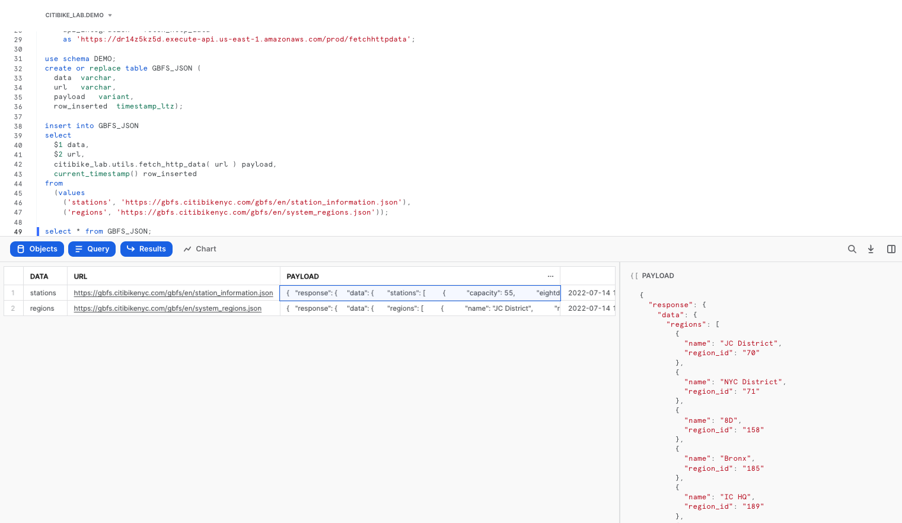
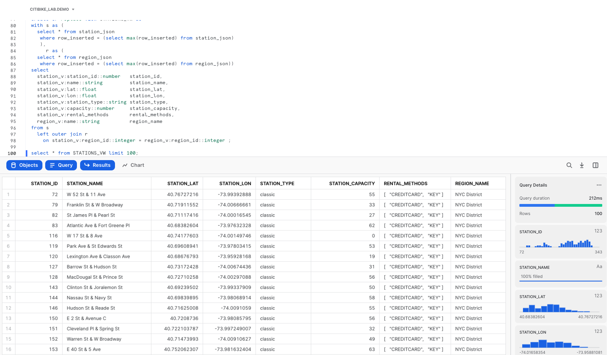
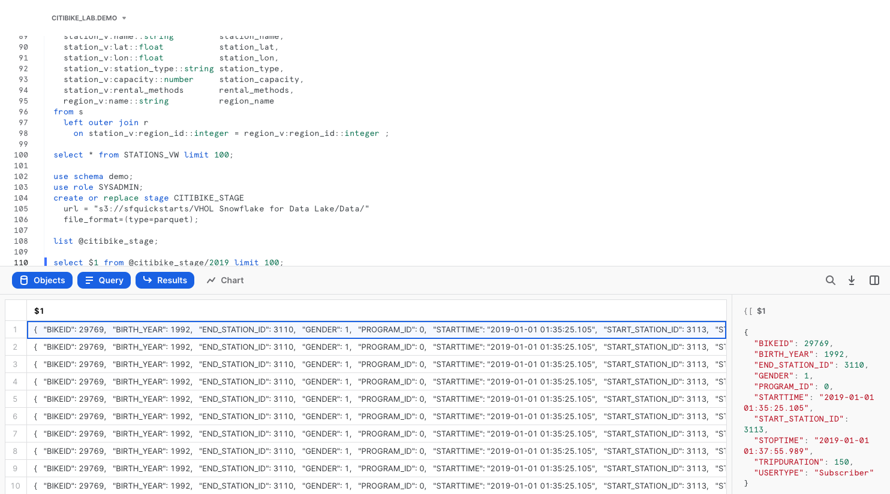
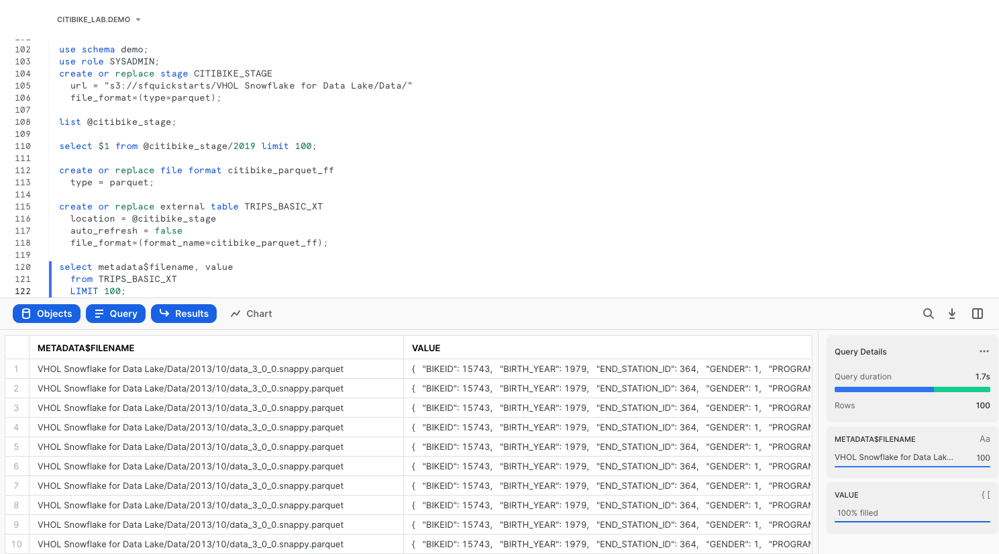
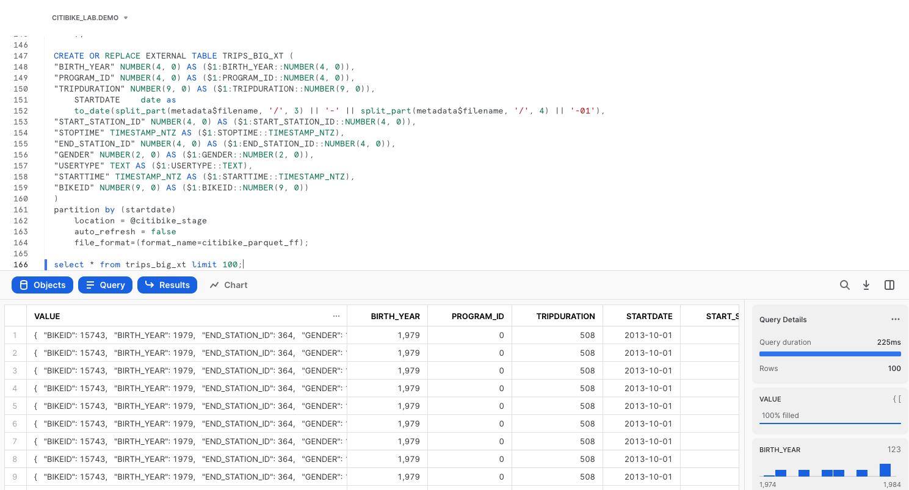
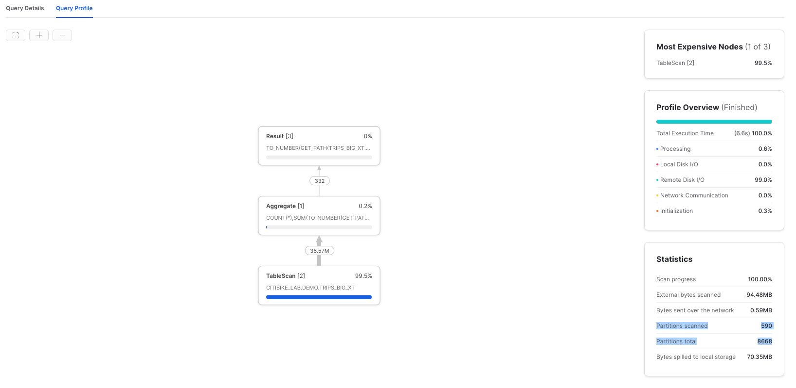
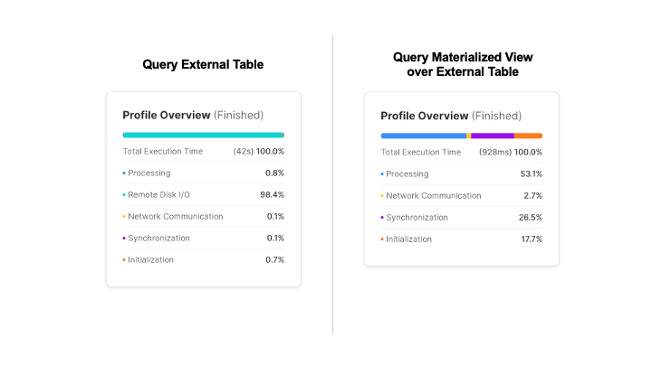
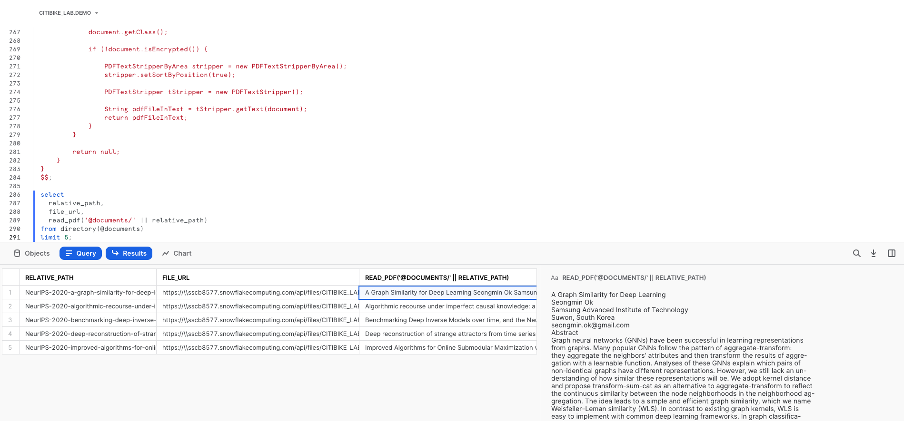

author: Scott Teal
id: vhol_data_lake
summary: This is the guide for the hands-on lab, Snowflake for Data Lake
categories: getting-started,data-engineering,architecture-patterns
environments: web
status: Published 
feedback link: https://github.com/Snowflake-Labs/sfguides/issues
tags: Getting Started, Data Lake, Unstructured Data

# Snowflake for Data Lake
<!-- ------------------------ -->
## Overview 
Duration: 1

This Quickstart is intended to help you use a sample of features available in Snowflake for your cloud data lake. This lab does not require that you have an existing data lake. All data will be provided in a publicly available cloud storage location. The datasets used in this Quickstart contain trip data in Apache Parquet format from the Citibike transportation company in New York. To show Snowflake’s support for unstructured data, we’ll also use research papers (PDF) from the 2020 Conference on Neural Information Processing Systems.

### Prerequisites
- Use of the [Snowflake free 30-day trial](https://trial.snowflake.com)
- Basic knowledge of SQL, database concepts, and objects
- Familiarity with JSON and Apache Parquet semi-structured data
- Recommended to first complete [Getting Started with Snowflake - Zero to Snowflake](https://quickstarts.snowflake.com/guide/getting_started_with_snowflake/index.html?index=..%2F..index#0)

### What You’ll Learn 
- How to query partitioned semi-structured data stored in files in external cloud object storage with __External Tables__
- How to use __Schema Detection__ to automatically determine and return the schema of staged files
- How to improve performance of queries over external object stores with __Materialized Views__ over External Tables
- Process and analyze __unstructured data__ with __Snowpark__

### What You’ll Build 
- An External Function to fetch JSON data from an API and store in a table
- An External Stage and External Table for querying Apache Parquet files stored in Amazon S3
- A Materialized View over an External Table to improve performance
- A Java UDF for processing PDF files

<!-- ------------------------ -->
## Prepare Your Lab Environment
Duration: 8

If you haven't already, register for a [Snowflake free 30-day trial](https://trial.snowflake.com). The cloud provider (AWS, Azure, Google Cloud), and Region (US East, EU, e.g.) do _not_ matter for this lab. However, we suggest you select the region which is physically closest to you. Select the __Enterprise__ edition so you can use some advanced capabilities that are not available in the Standard edition. After registering, you will receive an email with an activation link and your Snowflake account URL. Bookmark this URL for easy, future access. After activation, you will create a username and password. Write down these credentials.

To easily follow the instructions, resize your browser windows so you can view this Quickstart and your Snowflake environment side-by-side. If possible, even better is to use a secondary display dedicated to the Quickstart.

While commands from this Quickstart can be copy/pasted to a worksheet in your Snowflake account, you can optionally [download the script as a SQL file to your local machine](https://sfquickstarts.s3.amazonaws.com/VHOL%20Snowflake%20for%20Data%20Lake/Scripts/lab_script_datalake.sql).

### Navigating to Snowsight
For this lab, you will use the latest Snowflake web interface, Snowsight.
1. Log into your Snowflake trial account
2. Click on __Snowsight__ Worksheets tab. The new web interface opens in a separate tab or window.
3. Click __Worksheets__ in the left-hand navigation bar. The __Ready to Start Using Worksheets and Dashboards__ dialog opens.
4. Click the __Enable Worksheets and Dashboards button__.


### Create a Warehouse, Database, Schemas
Create a warehouse, database, and schema that will be used for loading, storing, processing, and querying data for this Quickstart. We will use the UI within the Worksheets tab to run the DDL that creates these objects.

Copy the commands below into your trial environment. To execute a single statement, just position the cursor anywhere within the statement and click the Run button. To execute several statements, they must be highlighted through the final semi-colon prior to clicking the Run button.

```sql
use role SYSADMIN;
create or replace warehouse LOAD_WH with 
  warehouse_size = 'xlarge' 
  auto_suspend = 300 
  initially_suspended = true;

use warehouse LOAD_WH;

create or replace database CITIBIKE_LAB;
create or replace schema DEMO;
create or replace schema UTILS;
```
### Load the Data
Create an API integration to support creating an external function call to a REST API.

```sql
use schema UTILS;
use role accountadmin;

create or replace api integration fetch_http_data
  api_provider = aws_api_gateway
  api_aws_role_arn = 'arn:aws:iam::148887191972:role/ExecuteLambdaFunction'
  enabled = true
  api_allowed_prefixes = ('https://dr14z5kz5d.execute-api.us-east-1.amazonaws.com/prod/fetchhttpdata');

grant usage on integration fetch_http_data to role sysadmin;
```

Now create the external function that uses the API integration object.

```sql
use role sysadmin;

create or replace external function utils.fetch_http_data(v varchar)
    returns variant
    api_integration = fetch_http_data
    as 'https://dr14z5kz5d.execute-api.us-east-1.amazonaws.com/prod/fetchhttpdata';
```

Create a few reference tables in which the data will be stored.

```sql
use schema DEMO;
create or replace table GBFS_JSON (
  data	varchar,
  url	varchar,
  payload	variant,
  row_inserted	timestamp_ltz);
```

Now populate the table with raw JSON data through the external function call, then preview the contents of the table `GBFS_JSON`.

```sql
insert into GBFS_JSON
select 
  $1 data,
  $2 url, 
  citibike_lab.utils.fetch_http_data( url ) payload,
  current_timestamp() row_inserted
from 
  (values
    ('stations', 'https://gbfs.citibikenyc.com/gbfs/en/station_information.json'),
    ('regions', 'https://gbfs.citibikenyc.com/gbfs/en/system_regions.json'));

select * from GBFS_JSON;
```



Now refine that raw JSON data by extracting out the `STATIONS` nodes, storing the results in a separate table.

```sql
create or replace table STATION_JSON as
with s as (
  select payload, row_inserted 
    from gbfs_json
   where data = 'stations'
     and row_inserted = (select max(row_inserted) from gbfs_json)
  )
select 
  value station_v,
  payload:response.last_updated::timestamp last_updated,
  row_inserted
from s,
  lateral flatten (input => payload:response.data.stations)
  where try_to_number(station_v:station_id::string) is not null;
```

Extract the individual region records, storing the results in a separate table.

```sql
create or replace table REGION_JSON as
with r as (
  select payload, row_inserted 
    from gbfs_json
   where data = 'regions'
     and row_inserted = (select max(row_inserted) from gbfs_json)
  )
select
  value region_v,
  payload:response.last_updated::timestamp last_updated,
  row_inserted
from r,
  lateral flatten (input => payload:response.data.regions);
```

Lastly, create a view that flattens and joins the two tables a standard tabular structure.

```sql
create or replace view STATIONS_VW as
with s as (
  select * from station_json
   where row_inserted = (select max(row_inserted) from station_json)
   ),
     r as (
  select * from region_json
   where row_inserted = (select max(row_inserted) from region_json))
select
  station_v:station_id::number   station_id,
  station_v:name::string         station_name,
  station_v:lat::float           station_lat,
  station_v:lon::float           station_lon,
  station_v:station_type::string station_type, 
  station_v:capacity::number     station_capacity,
  station_v:rental_methods       rental_methods,
  region_v:name::string          region_name
from s 
  left outer join r
    on station_v:region_id::integer = region_v:region_id::integer ;

select * from STATIONS_VW limit 100;
```


<!-- ------------------------ -->
## External Tables
Duration: 2

With Snowflake, you have options for various storage patterns. You can load semi-structured and unstructured data directly into Snowflake for the best security, performance, and automatic management, or you can read data from external object storage. Say you already have data in cloud object storage, you can start processing and querying this data from Snowflake in minutes. 

For this lab, Snowflake has provided the Citibike TRIPS data in an Amazon S3 bucket. The data files are in Apache Parquet format and are partitioned into folders by year. The bucket URL is: `"s3://sfquickstarts/VHOL Snowflake for Data Lake/Data/"`

### Create an External Table linked to an S3 bucket
To create an external table over the files stored in that Amazon S3 bucket, first an external stage needs to be created by specifying the URL of the bucket and optionally the file format.

```sql
use schema demo;
use role SYSADMIN;
create or replace stage CITIBIKE_STAGE
  url = "s3://sfquickstarts/VHOL Snowflake for Data Lake/Data/"  
  file_format=(type=parquet);
```

Now let's see what data is available in the Amazon S3 bucket by listing the files in the external stage.

```sql
list @citibike_stage;
```

With the right permissions, you can even look at the contents of individual files.

```sql
select $1 from @citibike_stage/2019 limit 100;
```

Click on row 1 in the results pane. On the right side of your screen, the contents of a single row from the Parquet file are displayed.



Let's create an external table using the external stage.

```sql
create or replace file format citibike_parquet_ff
  type = parquet;
  
create or replace external table TRIPS_BASIC_XT 
  location = @citibike_stage 
  auto_refresh = false
  file_format=(format_name=citibike_parquet_ff);
```

In this external table definition, there is only one column available: a VARIANT named `VALUE` that contains the file data. Using the VARIANT data type preserves the raw structure, allowing the flexibility to define schema later on.

We can also add a reference to a pseudocolumn called `metadata$filename`, to see which file the data came from.

```sql
select metadata$filename, value
  from TRIPS_BASIC_XT 
  LIMIT 100;
```



### Using Schema Detection to Define External Table
A single column named `VALUE` is not going to be very user-friendly. It would be much more useful to break out the individual fields into separate columns. We can use `INFER_SCHEMA` for Snowflake to determine the schema of the parquet files and then more easily define the schema for the table. Additionally, we can define a partitioning expression for the table that matches the underlying layout of the source data files in S3.

Now let's create a new external table on the same set of Parquet files, but this time define each column separately, and partition the files on the date portion of their folder names. We'll use Snowflake's `INFER_SCHEMA` and `GENERATE_COLUMN_DESCRIPTION` functionality to help create the table definition.

```sql
select *
from table(
  infer_schema(
    location=>'@citibike_stage'
    , file_format=>'citibike_parquet_ff'
    )
  );

SELECT
  $$ CREATE OR REPLACE EXTERNAL TABLE FOO ($$ || (
      SELECT
      GENERATE_COLUMN_DESCRIPTION(ARRAY_AGG(OBJECT_CONSTRUCT(*))
        , 'EXTERNAL_TABLE') ||
        $$) LOCATION = @citibike_stage FILE_FORMAT = my_parquet_format; $$
      FROM
        TABLE (
          INFER_SCHEMA(
            LOCATION => '@citibike_stage',
            FILE_FORMAT => 'citibike_parquet_ff'
          )
        )
    );
```
Below is the output of the command above.

```sql
-- CREATE OR REPLACE EXTERNAL TABLE FOO ("BIRTH_YEAR" NUMBER(4, 0) AS ($1:BIRTH_YEAR::NUMBER(4, 0)),
-- "PROGRAM_ID" NUMBER(4, 0) AS ($1:PROGRAM_ID::NUMBER(4, 0)),
-- "TRIPDURATION" NUMBER(9, 0) AS ($1:TRIPDURATION::NUMBER(9, 0)),
-- "START_STATION_ID" NUMBER(4, 0) AS ($1:START_STATION_ID::NUMBER(4, 0)),
-- "STOPTIME" TIMESTAMP_NTZ AS ($1:STOPTIME::TIMESTAMP_NTZ),
-- "END_STATION_ID" NUMBER(4, 0) AS ($1:END_STATION_ID::NUMBER(4, 0)),
-- "GENDER" NUMBER(2, 0) AS ($1:GENDER::NUMBER(2, 0)),
-- "USERTYPE" TEXT AS ($1:USERTYPE::TEXT),
-- "STARTTIME" TIMESTAMP_NTZ AS ($1:STARTTIME::TIMESTAMP_NTZ),
-- "BIKEID" NUMBER(9, 0) AS ($1:BIKEID::NUMBER(9, 0))) 
-- LOCATION=@citibike_stage/Data 
-- FILE_FORMAT='citibike_parquet_ff';
```
We can use the `CREATE EXTERNAL TABLE` statement that `INFER_SCHEMA` provided as our template, and then create a calculated startdate column that reflects how the table is partitioned in the underlying bucket. 

```sql
CREATE OR REPLACE EXTERNAL TABLE TRIPS_BIG_XT (
"BIRTH_YEAR" NUMBER(4, 0) AS ($1:BIRTH_YEAR::NUMBER(4, 0)),
"PROGRAM_ID" NUMBER(4, 0) AS ($1:PROGRAM_ID::NUMBER(4, 0)),
"TRIPDURATION" NUMBER(9, 0) AS ($1:TRIPDURATION::NUMBER(9, 0)),
    STARTDATE    date as
    to_date(split_part(metadata$filename, '/', 3) || '-' || split_part(metadata$filename, '/', 4) || '-01'),
"START_STATION_ID" NUMBER(4, 0) AS ($1:START_STATION_ID::NUMBER(4, 0)),
"STOPTIME" TIMESTAMP_NTZ AS ($1:STOPTIME::TIMESTAMP_NTZ),
"END_STATION_ID" NUMBER(4, 0) AS ($1:END_STATION_ID::NUMBER(4, 0)),
"GENDER" NUMBER(2, 0) AS ($1:GENDER::NUMBER(2, 0)),
"USERTYPE" TEXT AS ($1:USERTYPE::TEXT),
"STARTTIME" TIMESTAMP_NTZ AS ($1:STARTTIME::TIMESTAMP_NTZ),
"BIKEID" NUMBER(9, 0) AS ($1:BIKEID::NUMBER(9, 0))
)
partition by (startdate)
    location = @citibike_stage
    auto_refresh = false
    file_format=(format_name=citibike_parquet_ff);
```
Notice that every column definition consists of three parts: the column name, its datatype, and the transformation clause following the "as" keyword. The most basic transformation clause is just a reference to an element in the file as `value:"elementName"`, followed by an explicit datatype casting as `::datatype`.

Let's see what the data looks like in the new external table.
```sql
select * from trips_big_xt limit 100;
```



### Querying External Tables
Now it's time to start querying. To effectively prune out files from the scan list, a partition column can be added to the filter.

```sql
select 
  start_station_id, 
  count(*) num_trips, 
  avg(tripduration) avg_duration
from trips_big_xt
where startdate between to_date('2014-01-01') and to_date('2014-06-30')
group by 1;
```
In the Query Details of the Results pane, click on __View Query Profile__ for more details in a new browser tab. Compare the query profile for the two queries we just executed. Looking at partitions scanned compared to partitions total, the query was able to effectively prune out over 90% of the file reads.



Without any ingestion, external table can be joined with other tables and views in Snowflake. Here's an example query joining an external table with a view created earlier.

```sql
with t as (
  select 
     start_station_id, 
     end_station_id, 
     count(*) num_trips
  from trips_big_xt
  where startdate between to_date('2014-01-01') and to_date('2014-12-30')
    group by 1, 2)

select 
   ss.station_name start_station, 
   es.station_name end_station, 
   num_trips
 from t inner join stations_vw ss on t.start_station_id = ss.station_id
        inner join stations_vw es on t.end_station_id = es.station_id
order by 3 desc;
```

### Additional Options for External Tables
Although not covered hands-on in this Quickstart because they require access to a cloud console, there are two important optional parameters to note for External Tables.

#### REFRESH_ON_CREATE = { TRUE | FALSE }
`TRUE` by default, this parameter specifies whether to automatically refresh the external table metadata once, immediately after the external table is created. The metadata for an external table is the list of files that exist in the specified storage location. Setting this option to FALSE essentially creates an “empty” external table definition. To refresh the metadata requires execution of the command `ALTER EXTERNAL TABLE refresh;`

#### AUTO_REFRESH = { TRUE | FALSE }
Also `TRUE` by default, this parameter specifies whether Snowflake should enable triggering automatic refreshes of the external table metadata when new or updated data files are available in the named external stage specified. Setting this option to `TRUE` will keep external tables in sync with the contents of the related storage location.

<!-- ------------------------ -->
## Materialized Views over External Tables
Duration: 2

External Tables offer the ability to have a SQL interface on top of object storage, without having to maintain an additional copy of the data in the Snowflake storage layer. Automatic refresh can keep the external metadata in sync with the contents of the storage location, eliminating many complex data engineering workflows. Defining the external table with an effective partitioning scheme can greatly improve query performance against external tables.

[Materialized Views](https://docs.snowflake.com/en/user-guide/views-materialized.html) are pre-computed data sets derived from a query specification (the SELECT in the view definition) and stored for later use. Because the data is pre-computed, querying a materialized view is faster than executing the original query.

Combining these two techniques, i.e., creating a Materialized View over an External Table, provides better query performance, with the benefit of maintaining the original data source in external storage.

### Create a Materialized View over an External Table
Run the commands below to create a materialized view over the external table created earlier in this Quickstart.
```sql
use role SYSADMIN;
use schema CITIBIKE_LAB.DEMO;

create or replace materialized view TRIPS_MV as
select 
  startdate, 
  start_station_id, 
  end_station_id, 
  count(*) num_trips
from trips_big_xt
group by 1, 2, 3;
```

Confirm that the number of rows in the materialized view matches the number of rows in the external table.
```sql
select 
  count(*) 		num_rows, 
  sum(num_trips) 	num_trips
from trips_mv;
```

Re-run the join query earlier, but replacing the external table with the new materialized view.

```sql
with t as (
  select 
    start_station_id, 
    end_station_id, 
    sum(num_trips) num_trips
  from trips_mv
  where startdate between to_date('2014-01-01') and to_date('2014-12-30')
  group by 1, 2)

select 
  ss.station_name start_station, 
  es.station_name end_station, 
  num_trips
from t 
  inner join stations_vw ss 
     on t.start_station_id = ss.station_id
  inner join stations_vw es 
     on t.end_station_id = es.station_id
order by 3 desc;
```

In the Results panel, view the Query Profile. Notice how much faster this was than the same query against the external table.



<!-- ------------------------ -->
## Unstructured Data
Duration: 15

So far you’ve seen how easy it is to query semi-structured data in Snowflake. Snowflake also supports unstructured data, which allows you to store and access files, natively process files using Snowpark, process files by calling out to external services using External Functions, and use Snowflake’s role-based access controls to govern unstructured data.

### Create an External Stage and Directory Table linked to an S3 bucket
Snowflake supports two types of stages for storing data files used for loading/unloading:
- __Internal stages__ store the files internally within Snowflake, automatically encrypted and compressed.
- __External stages__ access metadata of files in external storage that is referenced by the stage. An external stage specifies location and credential information, if required, for the object storage.

In this Quickstart, we are working with PDFs that have already been staged in a public, external S3 bucket. Before you can use this data, you first need to create a external stage that specifies the location of the storage bucket.

```sql
create or replace stage documents
 url = "s3://sfquickstarts/VHOL Snowflake for Data Lake/PDF/"
 directory = (enable = true auto_refresh = false);
```

List of all the files in the external stage.

```sql
ls @documents;
```

Directory tables are built-in tables in Snowflake that provide an up-to-date, tabular file catalog for external and internal stages. Directory Tables make it easy to search for files using a catalog, which can be challenging in cloud object storage.

When you created the external stage documents, you specified that a directory table be created with `directory = (enable = true)`. Refresh the stage metadata in the directory table, then search for files where the URL contains the substring 'algorithm%pdf'.

```sql
alter stage documents refresh;

select *
from directory(@documents)
where file_url ilike '%algorithm%pdf';
```

### Processing Unstructured Data with Snowpark
Unstructured data can be processed natively in Snowflake using Snowpark, currently in public preview. In this example, you will see how a Java User-Defined Function (UDF) can extract text from PDF files into a structured table for analytical use. Here’s an illustration for how the files are processed:


A Java UDF can be created either in-line or pre-compiled. In this example, you will see how to create an in-line UDF. Snowflake will compile the source code and store the compiled code in a JAR file, and you have the option to specify a location for the JAR file. A pre-compiled JAR file containing the Java code for parsing the PDFs has already been uploaded to an S3 bucket. The JAR file can be copied into a Snowflake stage, and from there a function can be created.

```sql
create or replace stage jars_stage
 url = "s3://sfquickstarts/VHOL Snowflake for Data Lake/JARs/"
 directory = (enable = true auto_refresh = false);

create or replace function read_pdf(file string)
returns string
language java
imports = ('@jars_stage/pdfbox-app-2.0.24.jar')
HANDLER = 'PdfParser.ReadFile'
as
$$
import org.apache.pdfbox.pdmodel.PDDocument;
import org.apache.pdfbox.text.PDFTextStripper;
import org.apache.pdfbox.text.PDFTextStripperByArea;

import java.io.File;
import java.io.FileInputStream;
import java.io.IOException;
import java.io.InputStream;

public class PdfParser {

    public static String ReadFile(InputStream stream) throws IOException {
        try (PDDocument document = PDDocument.load(stream)) {

            document.getClass();

            if (!document.isEncrypted()) {

                PDFTextStripperByArea stripper = new PDFTextStripperByArea();
                stripper.setSortByPosition(true);

                PDFTextStripper tStripper = new PDFTextStripper();

                String pdfFileInText = tStripper.getText(document);
                return pdfFileInText;
            }
        }

        return null;
    }
}
$$;
```
Now this function can be called in queries to use the parsed results of PDFs.

```sql
select
  relative_path,
  file_url,
  read_pdf('@documents/' || relative_path)
from directory(@documents)
limit 5;
```



<!-- ------------------------ -->
## Conclusion
Duration: 2

Congratulations, you have completed this Quickstart for a quick overview of capabilities Snowflake for data lakes.

### What We've Covered
- How to query partitioned semi-structured data stored in files in external cloud object storage with __External Tables__
- How to use __Schema Detection__ to automatically determine and return the schema of staged files
- How to improve performance of queries over external object stores with __Materialized Views__ over External Tables
- Process and analyze __unstructured data__ with __Snowpark__

### Related Resources
- [Quickstart: Getting Started with Snowpark](https://quickstarts.snowflake.com/guide/getting_started_with_snowpark/index.html?index=..%2F..index)
- [Quickstart: Getting Started with Time Travel](https://quickstarts.snowflake.com/guide/getting_started_with_time_travel/index.html?index=..%2F..index#0)
- [Quickstart: Process PII data using Snowflake RBAC, DAC, Row Access Policies, and Column Level Security](https://quickstarts.snowflake.com/guide/getting_started_with_pii/index.html?index=..%2F..index#0)
