author: Bren Stokes
id: vhol_data_marketplace_app
summary: This is a sample Snowflake Guide
categories: app-development, marketing
environments: web
status: Published 
feedback link: https://github.com/Snowflake-Labs/sfguides/issues
tags: Getting Started, Data Science, Data Engineering, Twitter 

# Building an application on Snowflake with data from Snowflake Marketplace
<!-- ------------------------ -->
## Overview 
Duration: 1

Snowflake Marketplace can provide rapid results to external data which can be used as an overlay or enhancement of your existing data to monitor trends and perform compelling results. Building an application to distribute your results rapidly on a modern data platform are key to innovating faster and gaining a competitive advantage.
Snowflake combined with Quasar, a modern Application framework together with AWS can help you achieve that competitive advantage. In this lab, we will show how to build a small web application using the Quasar Application Framework and AWS Lambda Python Layer.  

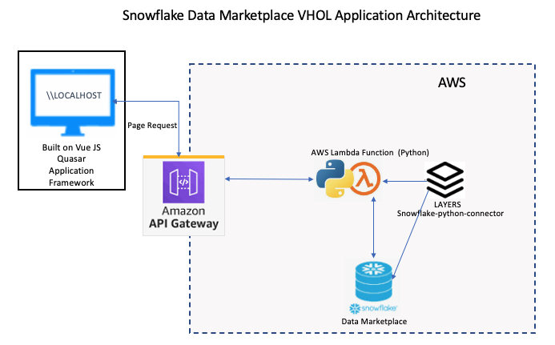


### Prerequisites
- We will be using Visual Studio Code in this lab but you are welcome to use your preference.
- You will need to sign-up for a free AWS trial account.
- You will need sign-up for a free Snowflake trial account.
- We provided the Snowflake Connector for Python and made it available for you to download.  

### What You’ll Learn About Snowflake Marketplace 
- How to explore Snowflake Marketplace Listings
- How to import data from Snowflake Marketplace
- How to review Snowflake Marketplace data for insight development

### What You’ll Learn About Building an Application  
- How simple it is to connect to Snowflake Marketplace data
- How simple it is to query the data from Snowflake Marketplace datasets 
- How to perform a quick regression analysis on the datasets
- How to create a view of Snowflake Marketplace Datasets  
- How to create a line chart using the Quasar application framework
- How to attach the Snowflake connector in AWS 
- How to create the AWS Lambda function to query Snowflake and pass the data to the application endpoint
- How to build the Lambda Python script to support interaction with the Quasar line charts

### What You’ll Need 
- A [AWS] (https://aws.amazon.com/free/?all-free-tier.sort-by=item.additionalFields.SortRank&all-free-tier.sort-order=asc&awsf.Free%20Tier%20Types=*all&awsf.Free%20Tier%20Categories=*all) free trial Account 
- A [Snowflake](https://signup.snowflake.com/?_ga=2.216496658.583434456.1619544527-1296939414.1603389593) trial Account 
- [Quasar CLI](https://quasar.dev/start/pick-quasar-flavour/) Installed
- [Quasar Installation Video ](https://www.youtube.com/watch?v=BK66mQTSl7U) Installed
- [Download snowflake-connector-python.zip](https://github.com/Snowflake-Labs/sfguide-marketplace-data-app/releases/tag/v1)
-  [Getting your AWS Lambda Functions to work with Snowflake -Connector Download ](https://medium.com/snowflake/getting-your-aws-lambda-functions-to-work-with-snowflake-a14b453bb5ee) 


### What You’ll Build 
- A Quasar .vue chart sourced with Snowflake Marketplace Knoema Economy and Poverty Data
- A Snowflake Query using the Regression function
- A AWS Lambda with the Snowflake Python connector

<!-- ------------------------ -->

## Working with Snowflake Marketplace 
Duration: 2

Snowflake Marketplace provides visibility to a wide variety of datasets from third-party data stewards which broaden access to data points used to transform business process. Snowflake Marketplace also removes the need to integrate and model data by providing secure access to data sets fully maintained by the data provider. 

**Before we begin to review working with Snowflake Marketplace data sets, STOP and verify you have installed a trial version of Snowflake.  If not, click Install Snowflake Trial. Now that you have a working trial account, and you are logged into the Snowflake Console, follow the following steps.** 

* 	At the top right corner, make sure you are logged in as `ACCOUNTADMIN`
* 	Click on Snowflake Marketplace
* 	Click on Explore the Snowflake Marketplace 

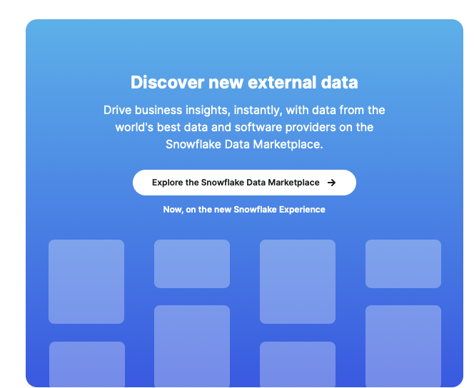

*	At the Search bar, type: Knoema Economic then click on the Tile Box labeled: Economic Data Atlas.
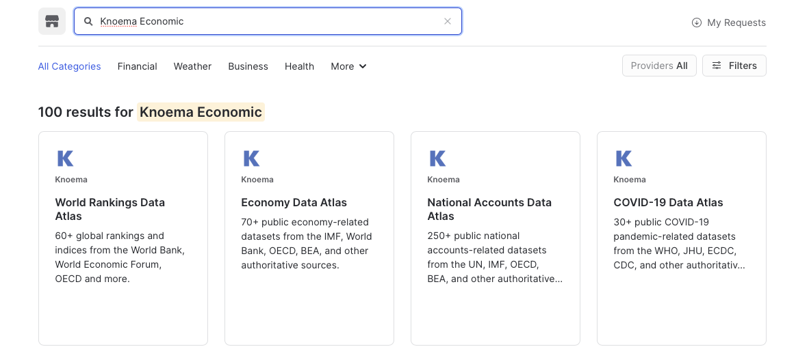
*  At the top right corner, Select Get Data
*	Select the appropriate roles to access the Database being created and accept the Snowflake consumer terms and Knoema’s terms of use.
*	Create Database

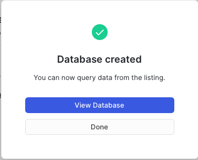


*	View Database
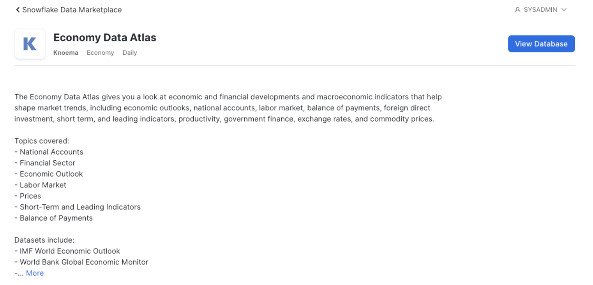

* At the Search bar, type: Knoema Poverty  then click on the Tile Box labeled: Poverty Data Atlas.
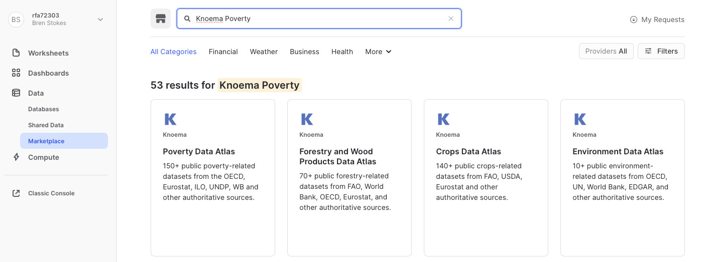
* At the top right corner, Select Get Data
* Select the appropriate roles to access the Database being created and accept the Snowflake  consumer terms and Knoema’s terms of use.
* Create Database


*	View Database
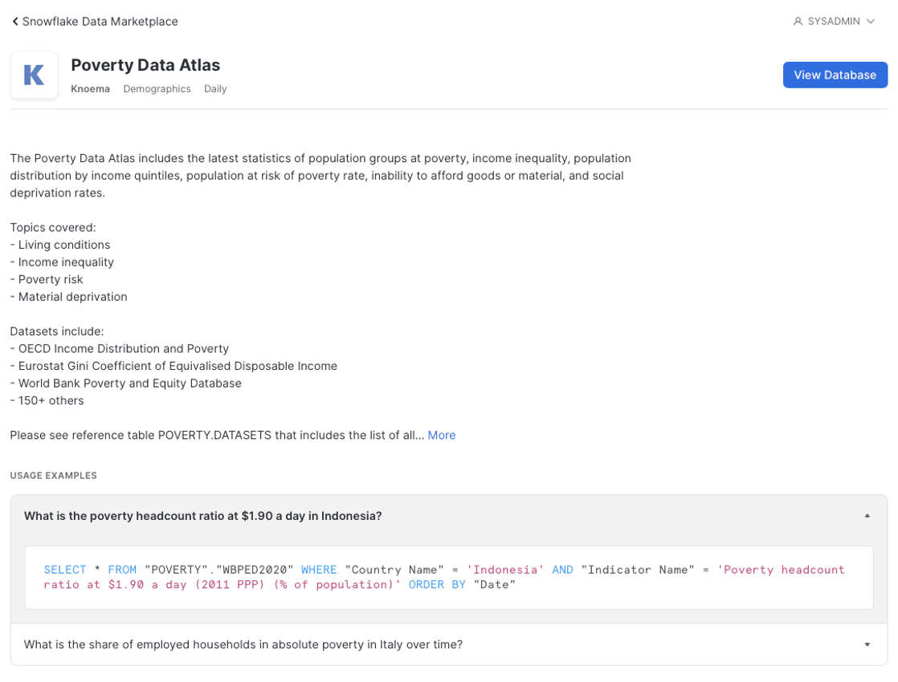

* At the top left corner select Worksheets and select Enable Worksheets and Dashboards*
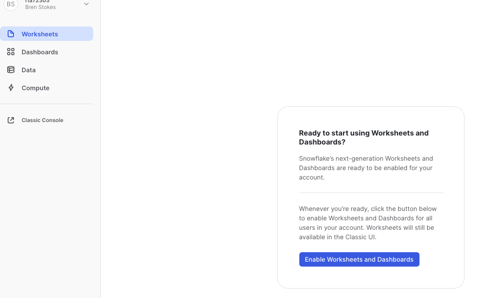
* You will see a display “ Setting Up” and then select Import Worksheets if you have any. Otherwise, you will be taken directly into the worksheet counsel  click +Worksheets and paste the following code into the display.
* At the top right corner, Select Account Admin Role and a Warehouse and select the Database: Knoema_Economy_Data Atlas  and run the query by pressing the circle with arrow button at the top right-hand corner for the counsel. Explore the data and familiar yourself with the following data sets: 


```sql


--## Step 1  Review the available data tables
--Review the datasets available
select * from "KNOEMA_POVERTY_DATA_ATLAS"."POVERTY"."DATASETS";
select * from "KNOEMA_ECONOMY_DATA_ATLAS"."ECONOMY"."DATASETS";

--## Step 2 Identify the columns by which data sets can be joined by running simple select statements for a variety of different data views.  This will allow you to see patterns in data which join views to produce a combined view of many datasets.

select * from "KNOEMA_POVERTY_DATA_ATLAS"."POVERTY"."sdg_01_20" agi;
--Poverty Thresholds -ilc_li01  geo, geoName, geoRegionid month start date
select * from "KNOEMA_POVERTY_DATA_ATLAS"."POVERTY"."ilc_li01";
--Household Investment rate tec00098  geo, geoName, geoRegionid annual start date
select * from "KNOEMA_ECONOMY_DATA_ATLAS"."ECONOMY"."tec00098";
--Household Saving rate teina500-20160217 geo, geoName, geoRegionid quarter start date
select * from "KNOEMA_ECONOMY_DATA_ATLAS"."ECONOMY"."teina500-20160217";
--Key indicators annual nasa_10_ki-20180427 geo, geoName, geoRegionid annual start date
select * from "KNOEMA_ECONOMY_DATA_ATLAS"."ECONOMY"."nasa_10_ki-20180427";
--Proverty and Equity WBPED2020  Country, Country Name, Country Region annual start date
select * from "KNOEMA_ECONOMY_DATA_ATLAS"."ECONOMY"."WBPED2020"
```
  Review the datasets available and identify which data sets can be joined by running simple select statements for a variety of different data views.  This will allow you to see patterns in data which join views to produce a combined view of many datasets. 

<!-- ------------------------ -->
## Create Snowflake Views
Duration: 1

Using Snowflake's Regression function returns the slope of the linear regression line for non-null pairs in a group. It is computed for non-null pairs, a powerful way to compare multiple variables in a set of data. It will help us evaluate in this case, Credit worthiness of Single Persons relative to Poverty. We also look at Savings rate and average investment rates by geography and time.

* Go to the home icon and switch to classic console


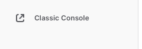


* Click worksheets tab and select new worksheet
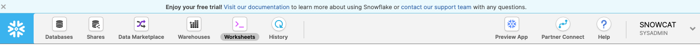
* Select New Worksheet at the top of the Snowflake Console
* Create a database to store your Application Views.

```sql

--# Step 1 Create a database to store your views
Create database VHOL;
```
<!-- ------------------------ -->

```sql

--## Step 2 Create a View from the Regression query

create view VHOLAPP2 as select 
agi."geo RegionId" as GeoRegionIdAgi
, agi."Date" as dateAgi
, agi."Value" as ValueAgi
, pth."geo RegionId" as GeoRegionIdPth
, pth."Date"  as datePth
, pth."hhtyp Name" as hhtypNamePth
, pth."indic_il Name" as NamePth
, pth."currency Name"as Name3
, pth."Value" as ValuePth
, ir."geo RegionId"as GeoRegionIdIr
, ir."Date" as  DateIr
, ir."na_item Name" as na_itemNameIr
, ir."Measure Name" as MeasuerNameIr 
, ir."Value" as ValueIr
, sr."geo RegionId" as GeoRegionIdSr
, sr."Date" as  DateSr
, sr."na_item Name" as na_itemNameSr
, sr."Measure Name" as MeasuerNameSr 
, sr."Value" as ValueSr
,REGR_SLOPE(pth."Value", ir."Value") OVER (  PARTITION BY pth."geo RegionId",pth.
"hhtyp Name" ) as ir_lin
,REGR_SLOPE(pth."Value", sr."Value") OVER (  PARTITION BY pth."geo RegionId",pth.
"hhtyp Name" ) as sr_lin

from "KNOEMA_POVERTY_DATA_ATLAS"."POVERTY"."sdg_01_20" agi  --pov atlas
inner join "KNOEMA_POVERTY_DATA_ATLAS"."POVERTY"."ilc_li01" pth on agi."geo RegionId"=pth."geo RegionId" and agi."Date"=pth."Date"  -- join thresholds
inner join "KNOEMA_ECONOMY_DATA_ATLAS"."ECONOMY"."tec00098" ir on agi."geo RegionId"=ir."geo RegionId" and agi."Date"=ir."Date" -- join investment rate
inner join "KNOEMA_ECONOMY_DATA_ATLAS"."ECONOMY"."teina500-20160217" sr on agi."geo RegionId"=sr."geo RegionId" and agi."Date"=sr."Date"  -- join saving rate


--## Step 3 Create a view to pair down the variables for the APP --

create view VHOLAPP3 as select 
 GeoRegionIdPth, dateagi
 ,hhtypNamePth
 ,min(ValuePth) ValuePth
 ,avg(ir_lin) avg_Investment_Rate
 ,avg(sr_lin) avg_Savings_Rate
 from VHOLAPP2
 where GeoRegionIdAgi = 'AT' and hhtypNamePth = 'Single person'
 
  group by dateagi,GeoRegionIdPth,hhtypNamePth--, ir_lin, sr_lin
  order by dateagi,GeoRegionIdPth,hhtypNamePth--, ir_lin, sr_lin 

```
  Limiting the variables that will be presented on the application layer (in this case our chart) is an efficient use of data and compute resources. Hence why we created the VHOLAPP3 view. 

  Verify your view is created by running the following:
  ```markdown
  Select * from VHOLAPP3;
  ```
  Make sure at the top of your worksheet, you are in running with the appropriate access privileges ( Role, Warehouse, Selected database and Schema) which has access to these views.  


<!-- ------------------------ -->


## Create Application Code for Line Chart
Duration: 1


We are using the Quasar Application Framework with vue.js. 
- [Quasar CLI](https://quasar.dev/start/pick-quasar-flavour/) ✅ Is Installed
- [Quasar Installation Video ](https://www.youtube.com/watch?v=BK66mQTSl7U) ✅ Watch video if not Installed

So, before we begin to review the index.vue code make sure you have successfully installed the quasar Application Framework.

**Please see the prerequisite for this lab**

**You will need to drop the quasar folder from the repository into your local quasar project folder** 

[Download Quasar Folder from repository](https://github.com/Snowflake-Labs/sfguide-marketplace-data-app/tree/main/quasar)

Now let’s take a look at the application we are going to build. In the image displayed below, you will  see a dropdown selection box for the Geography  which will pass the GeoRegionIdPth variable to the selection box, A slider bar to set the Time Period (start date, and end date) which will pass the Dateagi variable(s) to slider bar. The Refresh Button which will populate 3-line charts which represent the Poverty Threshold, Savings Rate and Avg Investment Rate relative to the Time Period  and Geography selected. If a Geography is not selected, an error message will display in red, “You Must select a Geography”
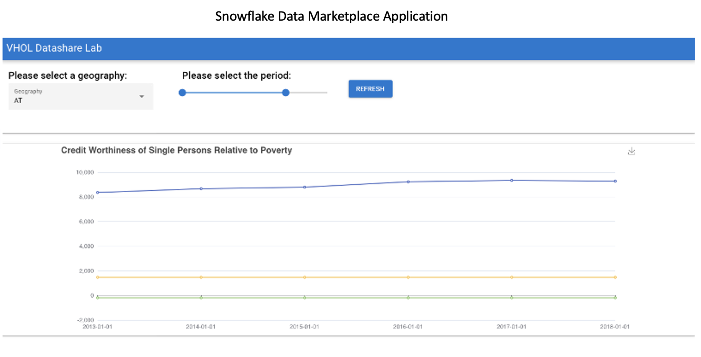

Using your favorite code editor, open the following file: /your project folder/src/pages/index.vue
```markdown
## Create Index.vue
Duration: 2

<template>
  <q-page>
    <q-form @submit="onSubmit" @reset="onReset" class="q-gutter-md">
      <q-card class="my-card">
        <div class="row">
          <div class="col-3">
            <q-card-section>
              <div class="text-h6">Please select a geography:</div>
              <q-select
                filled
                v-model="selectedCountry"
                :options="countryOptions"
                label="Geography"
                style="width: 300px"
              />
            </q-card-section>
          </div>
          <div class="col-3">
            <q-card-section>
              <div class="text-h6">Please select the period:</div>
              <q-range
                v-model="selectedPeriod"
                :min="2013"
                :max="2020"
                :step="1"
                style="width: 300px"
                label
              />
            </q-card-section>
          </div>
          <div class="self-center">
            <q-btn color="primary" label="refresh" @click="refreshGraph" />
          </div>
        </div>

        <q-card-section> </q-card-section>
      </q-card>
    </q-form><br/>
    <q-separator />
        <q-card class="my-card">
    <echarts :option="chartOptions" :height="400" :width="1200"></echarts>
        </q-card>
  </q-page>
</template>

<script>
import echarts from "src/components/echarts.vue";
export default {
  name: "PageIndex",
  components: { echarts },
  //Let's add the list of Geography codes to selecton filter....
  data() {
    return {
      countryOptions: [
        "AT",
        "BE",
        "CZ",
        "DE",
        "DK",
        "ES",
        "FI",
        "FR",
        "GB",
        "HR",
        "IE",
        "IT",
        "NL",
        "NO",
        "PL",
        "PT",
        "RO",
        "SE",
        "SI",
      ],
      selectedCountry: null,
      selectedPeriod: {
        min: 2013,
        max: 2020,
      },
      chartOptions: null,
    };
  },
  //Let's enforce selecton of Geography, and Start and End for time period...
  methods: {
    refreshGraph: function () {
      if (!this.selectedCountry) {
        this.$q.notify({
          type: "negative",
          message: `You must select a geography.`,
        });
        this.chartOptions = null;
        return;
      }

      if (!this.selectedPeriod.min || !this.selectedPeriod.max) {
        this.$q.notify({
          type: "negative",
          message: `You must select a period.`,
        });
        this.chartOptions = null;
        this.chartOptions = null;
        return;
      }
      //Here we GET the json data passed through the lambda function from the embeded SQL query from snowflake view through our API endpoint
      return this.$axios
        .get(
          "https://rkpnrd2qf1.execute-api.us-west-1.amazonaws.com/default/snowdemo?geo=" +
            this.selectedCountry +
            "&startYear=" +
            this.selectedPeriod.min +
            "&endYear=" +
            this.selectedPeriod.max
        )
        .then((response) => {
          console.log(response);

          let results = response.data;
          let VALUEPTHValues = [];
          let AVG_INVESTMENT_RATEValues = [];
          let AVG_SAVINGS_RATEValues =[]
          //Now lets push the variables from Snowflake View  to the chart Here...
          let xDates = [];
          results.map((item) => {
            VALUEPTHValues.push(item.VALUEPTH);
            AVG_INVESTMENT_RATEValues.push(item.AVG_INVESTMENT_RATE);
             AVG_SAVINGS_RATEValues.push(item.AVG_SAVINGS_RATE)
            xDates.push(item.DATEAGI);
          });

          //Now lets add the chart title  and assign the tool tip here.....
          this.chartOptions = {
            title: {
              text: "Credit Worthiness of Single Persons Relative to Poverty",
            },
            tooltip: {
              trigger: "axis",
            },
            legend: {
              data: ["VALUEPTH", "AVG_INVESTMENT_RATE"],
            },
            grid: {
              left: "3%",
              right: "4%",
              bottom: "3%",
              containLabel: true,
            },
            toolbox: {
              feature: {
                saveAsImage: {},
              },
            },
            xAxis: {
              type: "category",
              boundaryGap: false,
              data: xDates,
            },
            yAxis: {
              type: "value",
            },
            //Now lets pass the values to the line charts for all three values here....
            series: [
              {
                name: "POVERTY THRESHOLD",
                type: "line",

                data: VALUEPTHValues,
              },
              {
            name: 'SAVINGS RATE',
            type: 'line',
       data: AVG_SAVINGS_RATEValues
        },

              {
                name: "AVG INVESTMENT RATE",
                type: "line",

                data: AVG_INVESTMENT_RATEValues,
              },
            ],
          };
        });
    },
  },
};
</script>

```
* Open the quasar.config.js with your editor and add the folowing code snipit if it is missing.

### quasar.config.js
```
//Quasar plugins
      plugins: ['Notify']
    },
```
* Now go to your browser and go to localhost:8080/#/
* You should see a non-responsive application.
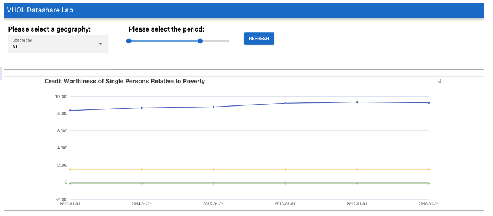

We will come back to this again in a later step. If you do not see the application from your local host, verify your installation and the download of repository folder/quasar.

<!-- ------------------------ -->
## Building the Lambda
Duration: 8


Now let’s begin our work on in  AWS to create a server-less environment to run our application. For the purpose of the lab, we will create the application and host it from your local host. So, let’s begin.
- [AWS] (https://aws.amazon.com/free/?all-free-tier.sort-by=item.additionalFields.SortRank&all-free-tier.sort-order=asc&awsf.Free%20Tier%20Types=*all&awsf.Free%20Tier%20Categories=*all) Free trial Account ✅ Is Installed

* Open up your AWS Console. Let's go to services and then we want to go straight into the Lambda.
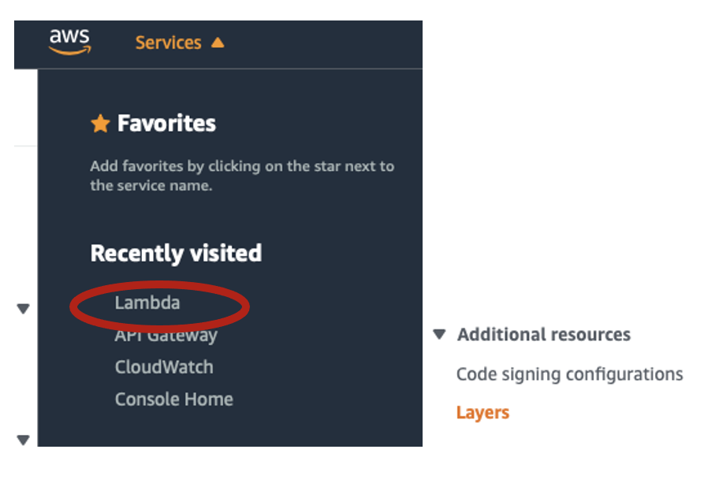


* Select, Create a layer
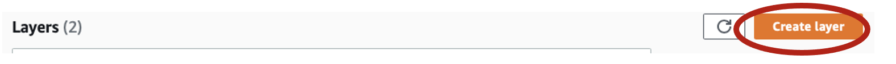

* And here we're going to name this: **snowflake-connector**
* Go to your application project folder where you downloaded the project from GitHub and upload the  snowflake-connector-python.zip file  **If you forgot to download the .zip file, follow the link below:** 
- [Download snowflake-connector-python.zip](https://github.com/Snowflake-Labs/sfguide-marketplace-data-app/releases/tag/v1)
* Under Runtimes, select Python 3.8
* Select Create – It may take a while as the file it is uploading is quite large.  See Below..
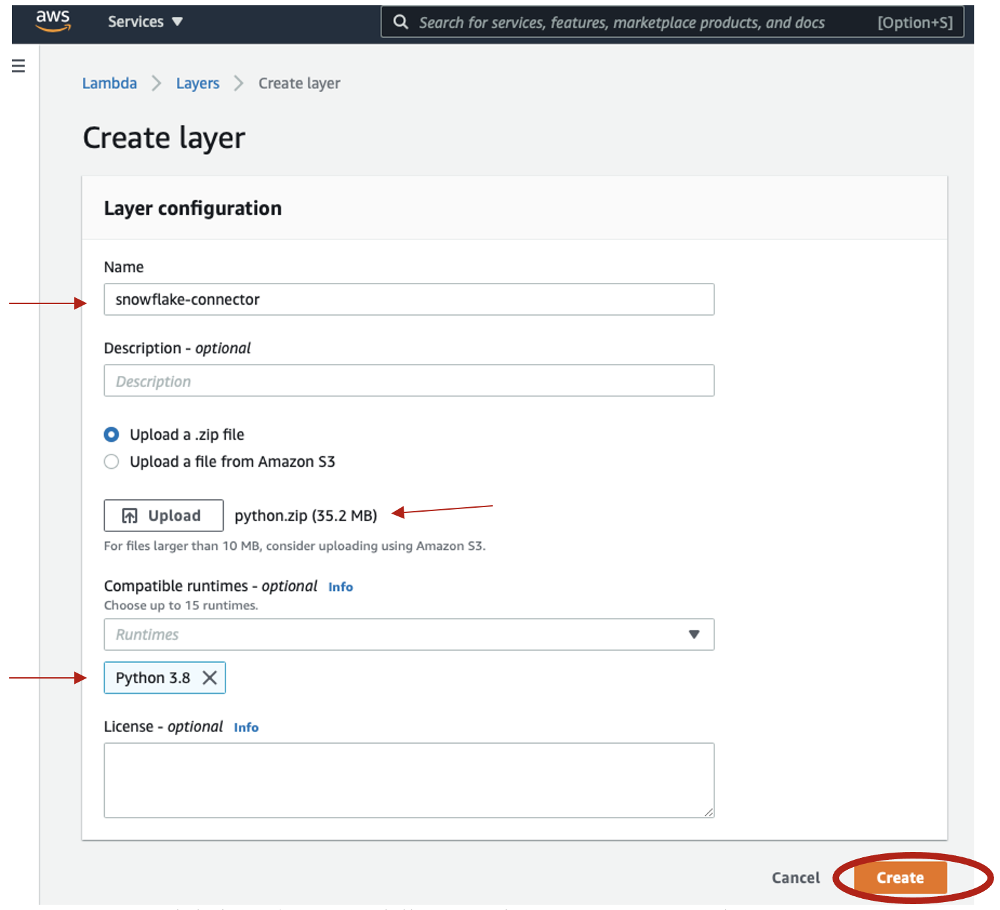

* Once your Lambda layer is successfully created, you can move on to the next step.
* At the top left menu select Lambda and Select Functions, then at the top right corner select create function
* Select the tile “Author from Scratch” add the function name “VHOL” and using the “Runtime pull down, select “Python 3.8”
* At bottom corner, select create function and wait until your function is created.
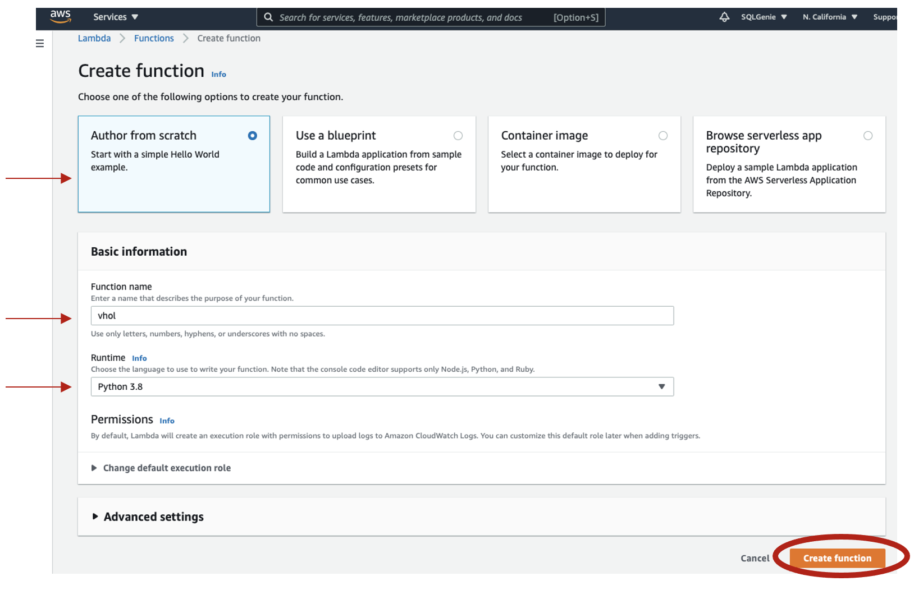
* Under Environment, select lambda_Function.py. 
* Now select the default script and delete so you have a clear tab. Now using visual studio code open the file “lambda.py and paste into the lambda_function tab
[Download Lambda](https://github.com/Snowflake-Labs/sfguide-marketplace-data-app/tree/main/Lambda-src)
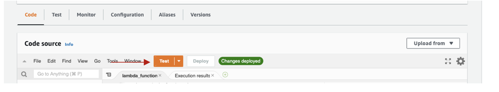
* Click on the “Test Tab” 
* Now using visual studio code, our your preferred code editor, open the file [Download Lambda](https://github.com/Snowflake-Labs/sfguide-marketplace-data-app/tree/main/Lambda-src)“lambda-Test-Script.gyp and past into the AWS configure test event and Give it an event name "Hello"
* Select Create
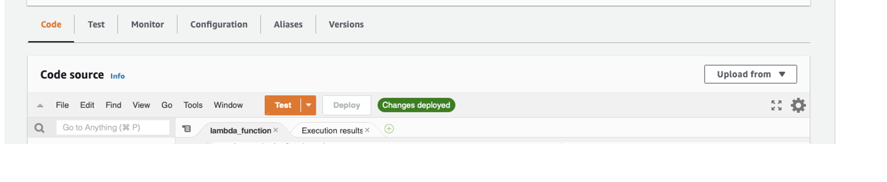


### Lambda.py Function 
```javascript
{
  "queryStringParameters": {
    "startYear": "2015",
    "endYear": "2020",
    "geo": "DK"
  }
}

10)	Greetings and Save/ create 
11)	Configuration – add trigger -API Trigger  Rest, Authorization, None 
12)	Review the function

import json, decimal, datetime 
import snowflake.connector
from snowflake.connector import DictCursor
def default_json_transform(obj):
    if isinstance(obj, decimal.Decimal):
        return str(obj)
    if isinstance(obj, (datetime.date, datetime.datetime)):
        return obj.isoformat()
    raise TypeError
def lambda_handler(event, context):
    print('event:',json.dumps(event))
    #print('queryStringParameters:', json.dumps(event['queryStringParameters'])
    # 1. Test query string parameters
    # TODO implement
    #startY= event["startYear"]
    #endY= event["endYear"]
    #geo= event["geo"]
     # Lets Parse query string parameters
    startY= event["queryStringParameters"]["startYear"]
    endY= event["queryStringParameters"]["endYear"]
    geo= event["queryStringParameters"]["geo"]
  
    
    # Lets get connection going...
    ctx = snowflake.connector.connect(
        user='yournusername',
        account='sfsenorthamerica_youraccount',
        password='SnowGlowXXX',
        role='ACCOUNTADMIN',
        warehouse='SNOWBALL',
        database="TEMP",
        schema='PUBLIC')
        # set the cursor...
    cs = ctx.cursor(DictCursor)

    # Let's execute the query to snowflake.....
    cs.execute("select  ValuePth, DateAgi, Avg_Investment_Rate, Avg_Savings_Rate, GeoRegionIdPth from TEMP.public.VHOLAPP3 WHERE  hhtypNamePth = 'Single person' and GeoRegionIdPth='" + geo + "' AND DateAgi >=TO_DATE('" + startY + "-01-01','YYYY-DD-MM') AND DateAgi <= TO_DATE('"+endY +"-01-01','YYYY-DD-MM')") 
    
    # Here it goes to the Array.....
    dataArr= []
    # It dumps the string to Json....WHEW! Finish up done
    for rec in cs:
        dataArr.append(rec)
    json_formatted_str = json.dumps(dataArr, default=default_json_transform)
    cs.close()
    return {
        'statusCode': 200,
        'body': json_formatted_str,
        'headers': {
            'Content-Type': 'application/json',
            'Access-Control-Allow-Origin': '*'
            },
    }

```

### Test Script using the AWS Lambda Test Tab
```
{
  "queryStringParameters": {
    "startYear": "2015",
    "endYear": "2020",
    "geo": "DK"
  }
}

```
<!-- ------------------------ -->
* Now go to the Configuration and select, then select general configuration and select the edit icon and increase the memory to 3032 and select “save”
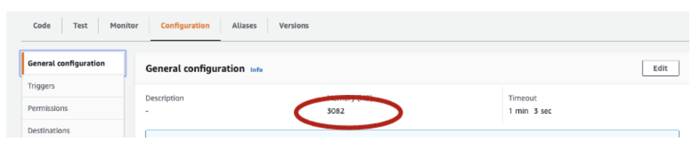
* Select +Add trigger  and select API Gateway  create and API, select REST and the security endpoint for this lab select “open” and finally select the Add button. 
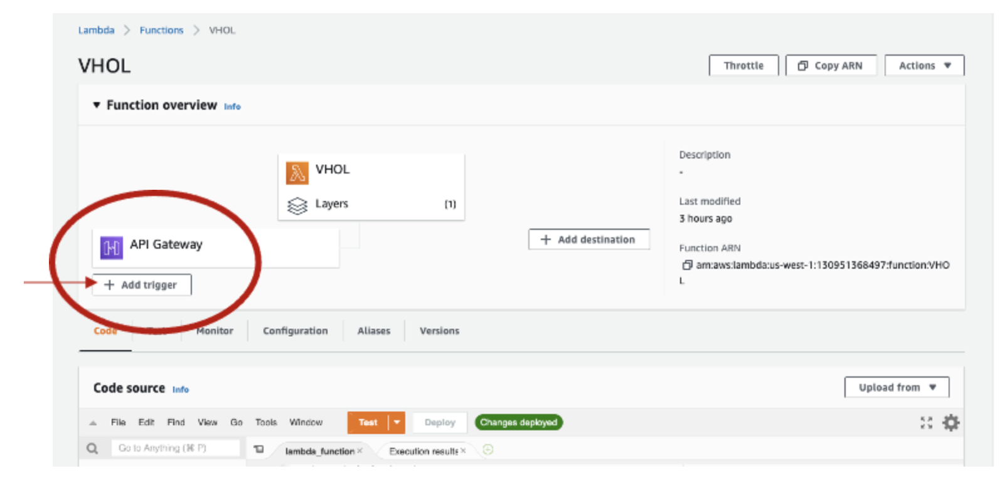
* Select API Details and verify:
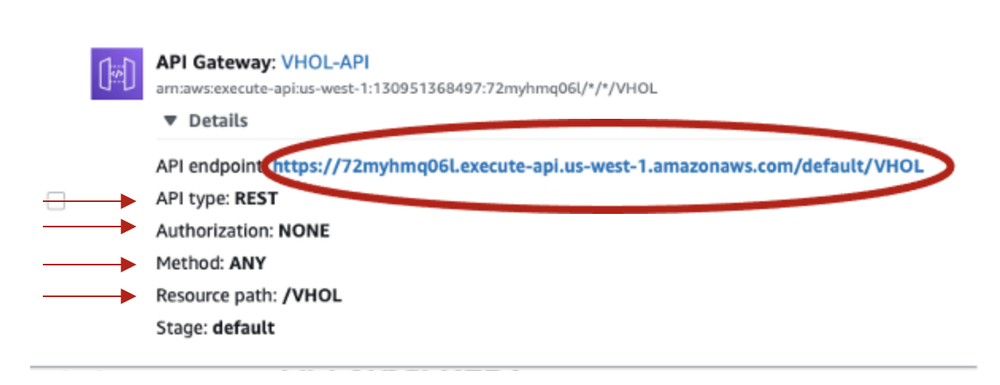
* Click  Deploy to Deploy the new code. Then select Test and it should be successful 
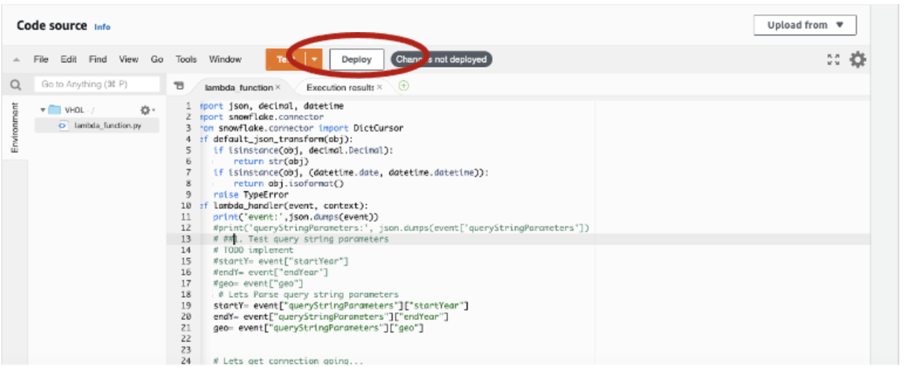
* Click on the Details of your created API Gateway and select the endpoint highlighted in blue. And replace it into your index.vue file 
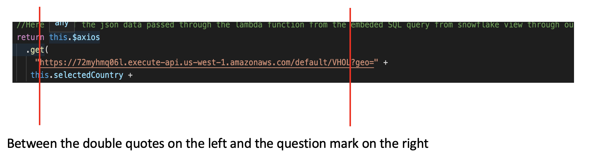

**Now lets’ go back to your  browser and go to localhost:8080/#/**
* Select geography and select the time period and select Refresh. Your application should now be connected to the service and should work.

❄️ Congratulations! This concludes our lab ❄️


## Additional References
Duration: 2

A fantastic reference for downloading the snowflake-python connector .zip file  [Getting your AWS Lambda Functions to work with Snowflake](https://medium.com/snowflake/getting-your-aws-lambda-functions-to-work-with-snowflake-a14b453bb5ee) to see how to use markdown to generate these elements. 


<!-- ------------------------ -->
## Conclusion
Duration: 1


To learn more about Snowflake Marketplace visit the official website here: [Snowflake Marketplace](https://www.snowflake.com/data-marketplace/)

To learn more about Building Data Applications visit the official  website here: [Building Data Applications](https://www.snowflake.com/workloads/data-applications/)


### What we've covered
- You were acquainted with Snowflake Marketplace
- You became familiar with building an application using the Quasar Application Framework
- We guided you through using the Snowflake Connector for Python via AWS Lambda
- We created the API Gateway and tested the functionality of the application
