author: yarodmi
id: vhol_data_vault
summary: Building a Real-time Data Vault in Snowflake
categories: Getting Started
environments: web
status: Published 
feedback link: https://github.com/Snowflake-Labs/sfguides/issues
tags: Getting Started, Data Vault, Data Enineering

# Building a Real-Time Data Vault in Snowflake
<!-- ------------------------ -->
## Overview 
Duration: 3

 
In this day and age, with the ever-increasing availability and volume of data from many types of sources such as IoT, mobile devices, and weblogs, there is a growing need, and yes, demand, to go from batch load processes to streaming or “real-time” (RT) loading of data. Businesses are changing at an alarming rate and are becoming more competitive all the time. Those that can harness the value of their data faster to drive better business outcomes will be the ones to prevail.

One of the benefits of using the Data Vault 2.0 architecture is that it was designed from inception not only to accept data loaded using traditional batch mode (which was the prevailing mode in the early 2000s when [Dan Linstedt](https://datavaultalliance.com/certification/standards-board/) introduced Data Vault) but also to easily accept data loading in real or near-realtime (NRT). In the early 2000s, that was a nice-to-have aspect of the approach and meant the methodology was effectively future-proofed from that perspective. Still, few database systems had the capacity to support that kind of requirement. Today, RT or at least NRT loading is almost becoming a mandatory requirement for modern data platforms. Granted, not all loads or use cases need to be NRT, but most forward-thinking organizations need to onboard data for analytics in an NRT manner.

Those who have been using the Data Vault approach don’t need to change much other than figure out how to engineer their data pipeline to serve up data to the Data Vault in NRT. The data models don’t need to change; the reporting views don’t need to change; even the loading patterns don’t need to change. (NB: For those that aren’t using Data Vault already, if they have real-time loading requirements, this architecture and method might be worth considering.)

### Data Vault on Snowflake

There have been numerous [blog posts](https://www.snowflake.com/blog/tips-for-optimizing-the-data-vault-architecture-on-snowflake/), user groups, and webinars over the last few years, discussing the best practices and customer success stories around implementing Data Vaults on Snowflake.  So the question now is how do you build a Data Vault on Snowflake that has real-time or near real-time data streaming into it.

Luckily, streaming data is one of the [use-cases](https://www.snowflake.com/cloud-data-platform/) that Snowflake was built to support, so we have many features to help us achieve this goal. **This guide is an extended version of the [article](https://datavaultalliance.com/news/building-a-real-time-data-vault-in-snowflake/) posted on Data Vault Alliance website, now including practical steps to build an example of real-time Data Vault feed on Snowflake. Join us on simple-to-follow steps to see it in action.**

### Prerequisites
* A Snowflake account. Existing or if you are not(yet) a Snowflake user, you can always get a [trial](https://trial.snowflake.com/) account

* Familiarity with Snowflake and Snowflake objects

### What You’ll Learn 
* how to use Data Vault on Snowflake

* how to build basic objects and write ELT code for it

* how to leverage [Snowpipe](https://docs.snowflake.com/en/user-guide/data-load-snowpipe-intro.html) and [Continous Data Pipelines](https://docs.snowflake.com/en/user-guide/data-pipelines.html) to automate data processing

* how to apply data virtualization to accellerate data access

### What You’ll Build 
* a Data Vault environment on Snowflake, based on sample dataset 

* data pipelines, leveraging streams, tasks and Snowpipe

<!-- ------------------------ -->
## Reference Architecture
Duration: 5

Let’s start with the overall architecture to put everything in context. 

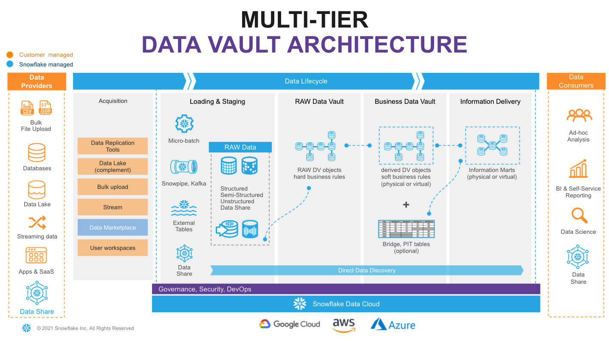  


On the very left of figure above we have a list of **data providers** that typically include a mix of existing operational databases, old data warehouses, files, lakes as well as 3rd party apps. There is now also the  possibility to leverage Snowflake Data Sharing/Marketplace as a way to tap into new 3rd party data assets to augment your data set. 

On the very right we have our ultimate **data consumers**: business users, data scientists, IT systems or even other companies you decided to exchange your data with.
 
Architecturally, we will split the data lifecycle into following layers:
* **Data Acquisition:** extracting data from source systems and making it accessible for Snowflake.
* **Loading & Staging:** moving the source data into Snowflake. For this Snowflake has multiple options, including batch load, external tables and Snowpipe(our managed service for onboarding streaming data). Snowflake allows you to load and store structured and semi-structured in the original format whilst automatically optimizing the physical structure for efficient query access. The data is immutable and should be stored as it was received from source with no changes to the content. From a Data Vault perspective, functionally, this layer is also responsible for adding technical metadata (record source,, load date timestamp, etc.) as well as calculating business keys. 
* **Raw Data Vault:** a data vault model with no soft business rules or transformations applied (only hard rules are allowed) loading all records received from source.
* **Business Data Vault:** data vault objects with soft business rules applied. The raw data vault data is getting augmented by the intelligence of the system. It is not a copy of the raw data vault, but rather a sparse addition with perhaps calculated satellites,  mastered records,or maybe even commonly used aggregations. This could also optionally include PIT and Bridge tables helping to simplify access to bi-temporal view of the data. From a Snowflake perspective, raw and business data vaults could be separated by object naming convention or represented as different schemas or even different databases. 
* **Information Delivery:** a layer of consumer-oriented models. This could be implemented as a set (or multiple sets) of views. It is common to see the use of dimensional models (star/snowflake) or denormalized flat tables (for example for data science or sharing) but it could be any other modeling stye (e.g., unified star schema, supernova, key-value, document object mode, etc.) that fits best for your data consumer. Snowflake’s scalability will support the required speed of access at any point of this data lifecycle. You should consider Business Vault and Information Delivery objects materialization as optional. This specific topic (virtualization) is going to be covered later in this article. 


<!-- ------------------------ -->
## Environment setup 
Duration: 5

1. Login to your Snowflake trial account.  
  

2. First page you are going to see would likely be [Snowflake Classic UI](https://docs.snowflake.com/en/user-guide/ui-using.html):
   
To keep things interesting, for the purpose of this lab let's use [Snowflake New Web Interface](https://docs.snowflake.com/en/user-guide/ui-web.html) also known as Snowsight. However, you absolutely can continue using Classic UI as all steps in this guide are expressed in SQL and will work regardless what interface is used.
To switch into Snowsight, let's click the **Preview** button in the top-right corner:

   

Click Sign in to continue. You will need to use the same user and password that you used to login to your Snowflake account the first time.

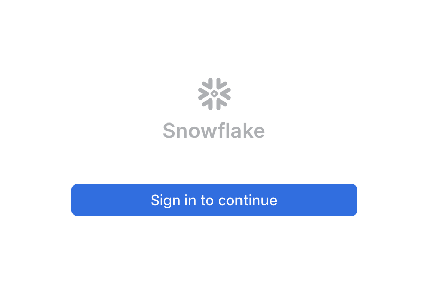   

You're now in the new UI - Snowsight. It's pretty cool - with charting, dashboards, autocompletion and new capabilities that our engineering team will continue to add on weekly. Now, let's click on Worksheets...

3. Let's click on the worksheets -> **+ Worksheet** 
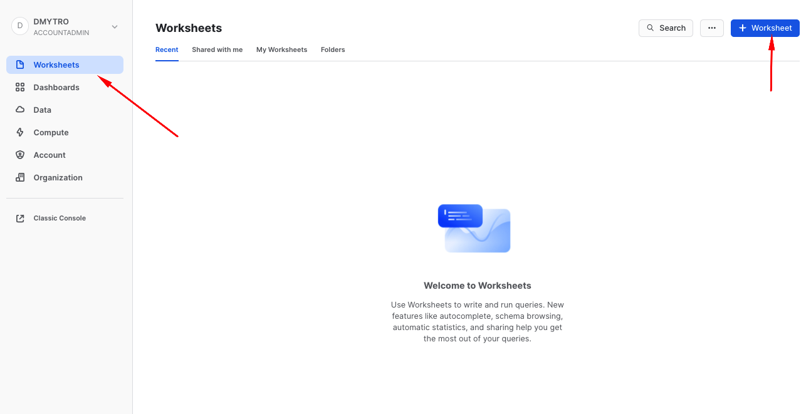   

And without going into too much details, this is a fairly intuitive SQL workbench. It has a section for code we are going to be copy-pasting, object tree on the left, the 'run' button and of course the result panel at the bottom with the simple charting functionality. 
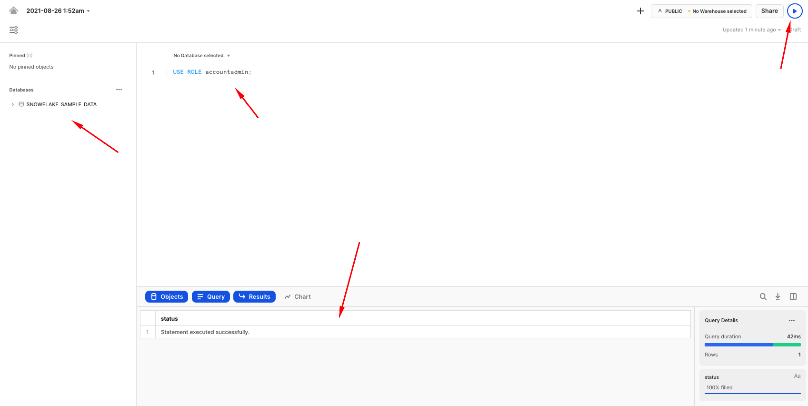   

4. We are going to start by setting up basics for the lab environment. Creating a clean database and logically dividing it into four different schemas, representing each functional area mentioned in the reference architecture. 

To keep things simple, we are going to use the ACCOUNTADMIN role (thou, of course in the real life examples you would employ a proper RBAC model). We also going to create two [Snowflake virtual warehouses](https://docs.snowflake.com/en/user-guide/warehouses.html) to manage compute - one for generic use during the course of this lab and the other one (dv_rdv_wh) that is going to be used by our data pipelines. You might notice that the code for two more virtual warehouses (dv_bdv_wh, dv_id_wh) is commented - again, this is just to keep things simple for the guide but we wanted to illustrate the fact you can have as many of virtual warehouses of any size and configuration as you needed. For example having separate ones to deal with different layers in our Data Vault architecture.


```sql
--------------------------------------------------------------------
-- setting up the environment
--------------------------------------------------------------------

USE ROLE accountadmin;

CREATE OR REPLACE DATABASE dv_lab;

USE DATABASE dv_lab;

CREATE OR REPLACE WAREHOUSE dv_lab_wh WITH WAREHOUSE_SIZE = 'XSMALL' MIN_CLUSTER_COUNT = 1 MAX_CLUSTER_COUNT = 1 AUTO_SUSPEND = 60 COMMENT = 'Generic WH';
CREATE OR REPLACE WAREHOUSE dv_rdv_wh WITH WAREHOUSE_SIZE = 'XSMALL' MIN_CLUSTER_COUNT = 1 MAX_CLUSTER_COUNT = 1 AUTO_SUSPEND = 60 COMMENT = 'WH for Raw Data Vault object pipelines';
--CREATE OR REPLACE WAREHOUSE dv_bdv_wh WITH WAREHOUSE_SIZE = 'XSMALL' MIN_CLUSTER_COUNT = 1 MAX_CLUSTER_COUNT = 1 AUTO_SUSPEND = 60 COMMENT = 'WH for Business Data Vault object pipelines';
--CREATE OR REPLACE WAREHOUSE dv_id_wh  WITH WAREHOUSE_SIZE = 'XSMALL' MIN_CLUSTER_COUNT = 1 MAX_CLUSTER_COUNT = 1 AUTO_SUSPEND = 60 COMMENT = 'WH for information delivery object pipelines';

USE WAREHOUSE dv_lab_wh;

CREATE OR REPLACE SCHEMA l00_stg COMMENT = 'Schema for Staging Area objects';
CREATE OR REPLACE SCHEMA l10_rdv COMMENT = 'Schema for Raw Data Vault objects';
CREATE OR REPLACE SCHEMA l20_bdv COMMENT = 'Schema for Business Data Vault objects';
CREATE OR REPLACE SCHEMA l30_id  COMMENT = 'Schema for Information Delivery objects';
```

<!-- ------------------------ -->
## Data Pipelines: Design
Duration: 10

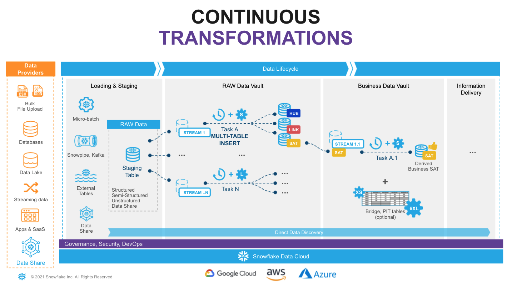  

Snowflake supports multiple options for engineering data pipelines. In this post we are going to show one of the most efficient ways to implement incremental NRT integration leveraging Snowflake [Continuous Data Pipelines](https://docs.snowflake.com/en/user-guide/data-pipelines.html).  Let's take a look at the architecture diagram above to understand how it works. 

Snowflake has a special [stream](https://docs.snowflake.com/en/user-guide/streams.html) object that tracks all data changes on a table (inserts, updates, and deletes). This process is 100% automatic and unlike traditional databases will never impact the speed of data loading. The change log from a stream is automatically ‘consumed’ once there is a successfully completed DML operation using the stream object as a source. 

So, loading new data into a staging table, would immediately be reflected in a stream showing the [‘delta’](https://docs.snowflake.com/en/user-guide/streams.html#data-flow) that requires processing.

The second component we are going to use is [tasks](https://docs.snowflake.com/en/user-guide/tasks-intro.html). It is a Snowflake managed data processing unit that will wake up on a defined interval (e.g., every 1-2 min), check if there is any data in the associated stream and if so, will run SQL to push it to the Raw Data Vault objects. Tasks could be arranged in a [tree-like dependency graph](https://docs.snowflake.com/en/user-guide/tasks-intro.html#simple-tree-of-tasks), executing child tasks the moment the predecessor finished its part. 

Last but not least, following Data Vault 2.0 best practices for NRT data integration (to load data in parallel) we are going to use Snowflake’s [multi-table insert (MTI)](https://docs.snowflake.com/en/sql-reference/sql/insert-multi-table.html) inside tasks to populate multiple Raw Data Vault objects by a single DML command. (Alternatively you can create multiple streams & tasks from the same table in stage in order to populate each data vault object by its own asynchronous flow.) 

Next step, you assign tasks to one or many virtual warehouses. This means you always have enough [compute power](https://docs.snowflake.com/en/user-guide/warehouses-overview.html#warehouse-size) (XS to 6XL) to deal with any size workload, whilst the [multi-cluster virtual warehouse](https://docs.snowflake.com/en/user-guide/warehouses-multicluster.html#multi-cluster-warehouses) option will automatically scale-out and load balance all the tasks as you introduce more hubs, links and satellites to your vault. 

As your raw vault is updated, streams can then be used to propagate those changes to Business Vault objects (such as derived Sats, PITS, or Bridges, if needed) in the next layer. This setup can be repeated to move data through all the layers in small increments very quickly and efficiently. All the way until it is ready to be accessed by data consumers (if materialization of the data is required for performance). 

Following this approach will result in a hands-off production data pipeline that feeds your Data Vault architecture.

<!-- ------------------------ -->
## Sample data & staging area
Duration: 5

Every Snowflake account provides access to [sample data sets](https://docs.snowflake.com/en/user-guide/sample-data.html). You can find corresponding schemas in SNOWFLAKE_SAMPLE_DATA database in your object explorer.
For this guide we are going to use a subset of objects from [TPC-H](https://docs.snowflake.com/en/user-guide/sample-data-tpch.html) set, representing **customers** and their **orders**. We also going to take some reference data about **nations** and **regions**. 

| Dataset | Description | Source | Load Scenario | Mechanism
| --- | ----------- |--- | --- | --- |--- |
| Nation | Static ref data | snowflake.sample_data.tpch_sf10.nation | one-off CTAS | SQL
| Region | Static ref data | snowflake.sample_data.tpch_sf10.region | one-off CTAS | SQL
| Customer | Customer data | snowflake.sample_data.tpch_sf10.customer | incremental JSON files | Snowpipe
| Orders | Orders data | snowflake.sample_data.tpch_sf10.orders | incremental CSV files | Snowpipe

1. Let's start with the static reference data:

```sql
--------------------------------------------------------------------
-- setting up staging area
--------------------------------------------------------------------

USE SCHEMA l00_stg;

CREATE OR REPLACE TABLE stg_nation 
AS 
SELECT src.*
     , CURRENT_TIMESTAMP()          ldts 
     , 'Static Reference Data'      rscr 
  FROM snowflake_sample_data.tpch_sf10.nation src;

CREATE OR REPLACE TABLE stg_region
AS 
SELECT src.*
     , CURRENT_TIMESTAMP()          ldts 
     , 'Static Reference Data'      rscr 
  FROM snowflake_sample_data.tpch_sf10.region src;
```

2. Next, let's create staging tables for our data loading. This syntax should be very familiar with anyone working with databases before. It is ANSI SQL compliant DDL, with probably one key exception - for stg_customer we are going to load the full payload of JSON into raw_json column. For this, Snowflake has a special data type [VARIANT](https://docs.snowflake.com/en/sql-reference/data-types-semistructured.html). 

As we load data we also going to add some technical metadata, like load data timestamp, row number in a file. 

```sql
CREATE OR REPLACE TABLE stg_customer
(
  raw_json                VARIANT
, filename                STRING   NOT NULL
, file_row_seq            NUMBER   NOT NULL
, ldts                    STRING   NOT NULL
, rscr                    STRING   NOT NULL
);

CREATE OR REPLACE TABLE stg_orders
(
  o_orderkey              NUMBER
, o_custkey               NUMBER  
, o_orderstatus           STRING
, o_totalprice            NUMBER  
, o_orderdate             DATE
, o_orderpriority         STRING
, o_clerk                 STRING
, o_shippriority          NUMBER
, o_comment               STRING
, filename                STRING   NOT NULL
, file_row_seq            NUMBER   NOT NULL
, ldts                    STRING   NOT NULL
, rscr                    STRING   NOT NULL
);
```

3. Tables we just created are going to be used by Snowpipe to drip-feed the data as it is lands in the stage. 
In order to easily detect and incrementally process the new portion of data we are going to create [streams](https://docs.snowflake.com/en/user-guide/streams.html) on these staging tables:

```sql
CREATE OR REPLACE STREAM stg_customer_strm ON TABLE stg_customer;
CREATE OR REPLACE STREAM stg_orders_strm ON TABLE stg_orders;
```

4. Next we are going to produce some sample data. And for the sake of simplicity we are going to take a bit of a shortcut here. 
We are going to generate data by unloading subset of data from our TPCH sample dataset into files and then use Snowpipe to load it back into our Data Vault lab, simulating the streaming feed. 
Let's start by creating two stages for each data class type (orders, customers data). In real-life scenarios these could be internal or external stages as well as these feeds could be sourced via Kafka connector. The world is your oyster. 

```sql
CREATE OR REPLACE STAGE customer_data FILE_FORMAT = (TYPE = JSON);
CREATE OR REPLACE STAGE orders_data   FILE_FORMAT = (TYPE = CSV) ;
```

5. Generate and unload sample data. There are couple of things going on. 
First, we are using [object_construct](https://docs.snowflake.com/en/sql-reference/functions/object_construct.html) as a quick way to create a object/document from all columns and subset of rows for customer data and offload it into customer_data stage. Orders data would be extracted into compressed CSV files. There are many additonal options in [COPY INTO stage](https://docs.snowflake.com/en/sql-reference/sql/copy-into-location.html) construct that would fit most requirements, but in this case we are using INCLUDE_QUERY_ID to make it easier to generate new incremental files as we are going to run these commands over and over again, without a need to deal with file overriding. 

```sql

COPY INTO @customer_data 
FROM
(SELECT object_construct(*)
  FROM snowflake_sample_data.tpch_sf10.customer limit 10
) 
INCLUDE_QUERY_ID=TRUE;

COPY INTO @orders_data 
FROM
(SELECT *
  FROM snowflake_sample_data.tpch_sf10.orders limit 1000
) 
INCLUDE_QUERY_ID=TRUE;
```

You can now run the following to validate that the data is now stored in files:
```sql
list @customer_data;
SELECT METADATA$FILENAME,$1 FROM @customer_data; 
```
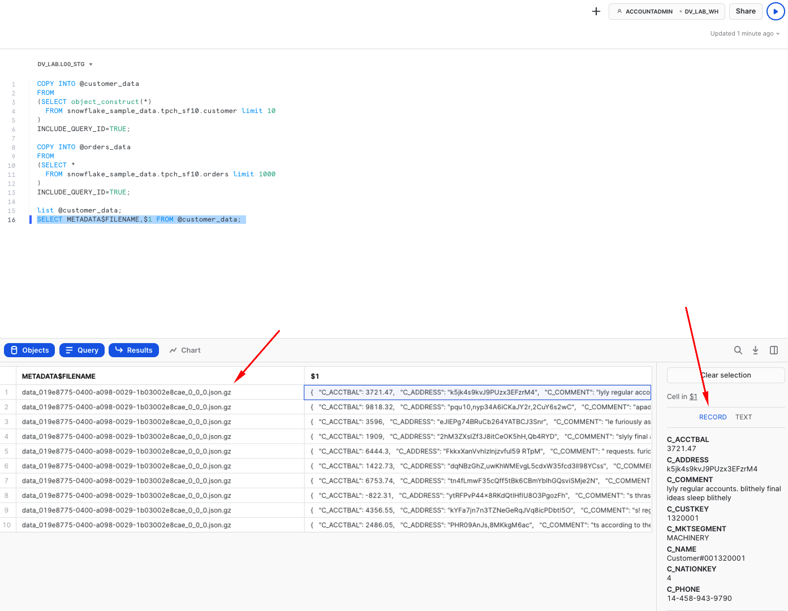

6. Next, we are going to setup Snowpipe to load data from files in a stage into staging tables. 
In this guide, for better transparency we are going to trigger Snowpipe explicitly to scan for new files, but in real projects you will likely going to enable AUTO_INGEST, connecting it with your cloud storage events (like AWS SNS) and process new files automatically. 

```sql
CREATE OR REPLACE PIPE stg_orders_pp 
--AUTO_INGEST = TRUE
--aws_sns_topic = 'arn:aws:sns:mybucketdetails'
AS 
COPY INTO stg_orders 
FROM
(
SELECT $1,$2,$3,$4,$5,$6,$7,$8,$9 
     , metadata$filename
     , metadata$file_row_number
     , CURRENT_TIMESTAMP()
     , 'Orders System'
  FROM @orders_data
);

CREATE OR REPLACE PIPE stg_customer_pp 
--AUTO_INGEST = TRUE
--aws_sns_topic = 'arn:aws:sns:mybucketdetails'
AS 
COPY INTO stg_customer
FROM 
(
SELECT $1
     , metadata$filename
     , metadata$file_row_number
     , CURRENT_TIMESTAMP()
     , 'Customers System'
  FROM @customer_data
);

ALTER PIPE stg_customer_pp REFRESH;

ALTER PIPE stg_orders_pp   REFRESH;
```

Once this done, you should be able to see data appearling in the target tables and the stream on these tables.
As you would notice, number of rows in a stream is exactly the same as in the base table. This is because we didn't process/consumed the delta of that stream yet. Stay tuned! 

```sql
SELECT 'stg_customer', count(1) FROM stg_customer
UNION ALL
SELECT 'stg_orders', count(1) FROM stg_orders
UNION ALL
SELECT 'stg_orders_strm', count(1) FROM stg_orders_strm
UNION ALL
SELECT 'stg_customer_strm', count(1) FROM stg_customer_strm
;
```
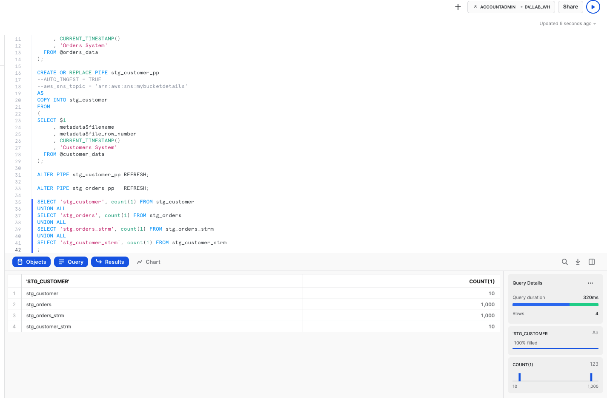

7. Finally, now that we established the basics and new data is knocking at our door (stream), let's see how we can derive some of the business keys for the Data Vault entites we are going to model. In this example, we will model it as a view on top of the stream that should allow us to perform data parsing (raw_json -> columns) and business_key, hash_diff derivation on the fly.
Another thing to notice here is the use of SHA1_BINARY as hasing function. There are many articles on choosing between MD5/SHA1(2)/other hash functions, so we won't focus on this. For this lab, we are going to use fairly common SHA1 and its BINARY version from Snowflake arsenal of functions that use less bytes to encode value than STRING. 

```sql
CREATE OR REPLACE VIEW stg_customer_strm_outbound AS 
SELECT src.*
     , raw_json:C_CUSTKEY::NUMBER           c_custkey
     , raw_json:C_NAME::STRING              c_name
     , raw_json:C_ADDRESS::STRING           c_address
     , raw_json:C_NATIONKEY::NUMBER         C_nationcode
     , raw_json:C_PHONE::STRING             c_phone
     , raw_json:C_ACCTBAL::NUMBER           c_acctbal
     , raw_json:C_MKTSEGMENT::STRING        c_mktsegment
     , raw_json:C_COMMENT::STRING           c_comment     
--------------------------------------------------------------------
-- derived business key
--------------------------------------------------------------------
     , SHA1_BINARY(UPPER(TRIM(c_custkey)))  sha1_hub_customer     
     , SHA1_BINARY(UPPER(ARRAY_TO_STRING(ARRAY_CONSTRUCT( 
                                              NVL(TRIM(c_name)       ,'-1')
                                            , NVL(TRIM(c_address)    ,'-1')              
                                            , NVL(TRIM(c_nationcode) ,'-1')                 
                                            , NVL(TRIM(c_phone)      ,'-1')            
                                            , NVL(TRIM(c_acctbal)    ,'-1')               
                                            , NVL(TRIM(c_mktsegment) ,'-1')                 
                                            , NVL(TRIM(c_comment)    ,'-1')               
                                            ), '^')))  AS customer_hash_diff
  FROM stg_customer_strm src
;

CREATE OR REPLACE VIEW stg_order_strm_outbound AS 
SELECT src.*
--------------------------------------------------------------------
-- derived business key
--------------------------------------------------------------------
     , SHA1_BINARY(UPPER(TRIM(o_orderkey)))             sha1_hub_order
     , SHA1_BINARY(UPPER(TRIM(o_custkey)))              sha1_hub_customer  
     , SHA1_BINARY(UPPER(ARRAY_TO_STRING(ARRAY_CONSTRUCT( NVL(TRIM(o_orderkey)       ,'-1')
                                                        , NVL(TRIM(o_custkey)        ,'-1')
                                                        ), '^')))  AS sha1_lnk_customer_order             
     , SHA1_BINARY(UPPER(ARRAY_TO_STRING(ARRAY_CONSTRUCT( NVL(TRIM(o_orderstatus)    , '-1')         
                                                        , NVL(TRIM(o_totalprice)     , '-1')        
                                                        , NVL(TRIM(o_orderdate)      , '-1')       
                                                        , NVL(TRIM(o_orderpriority)  , '-1')           
                                                        , NVL(TRIM(o_clerk)          , '-1')    
                                                        , NVL(TRIM(o_shippriority)   , '-1')          
                                                        , NVL(TRIM(o_comment)        , '-1')      
                                                        ), '^')))  AS order_hash_diff     
  FROM stg_orders_strm src
;
```
Finally let's query these views to validate the results:
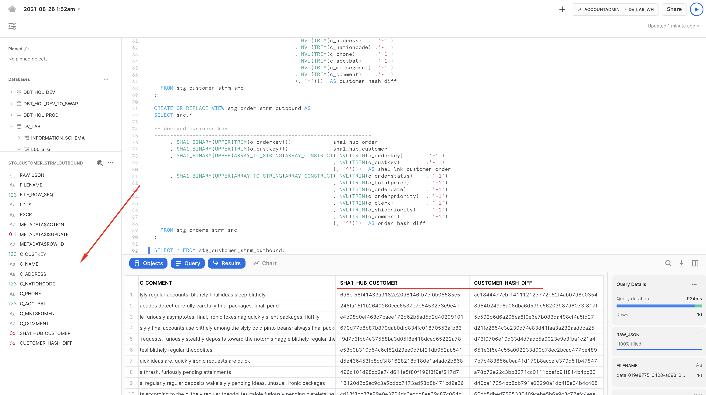

Well done! We build our staging/inbound pipeline, ready to accomodate streaming data and derived business keys that we are going to use in our Raw Data Vault. Let's move on to the next step!


<!-- ------------------------ -->
## Build: Raw Data Vault
Duration: 10

In this section, we will start building structures and pipelines for **Raw Data Vault** area. 

Here is the ER model of the objects we are going to deploy using the script below:
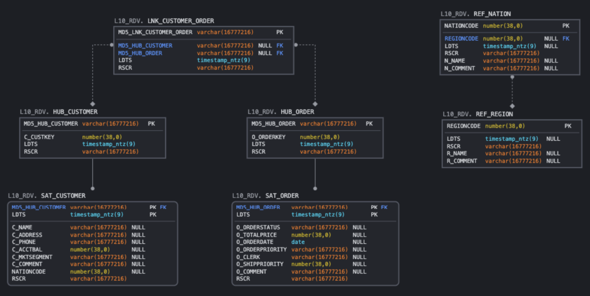


1. We'll start by deploying DDL for the HUBs, LINKs and SATellite tables. As you can imagine, this guide has no chance to go in the detail on data vault modelling process. This is something we usually highly recommend to establish by working with experts & partners from Data Vault Alliance.  


```sql
--------------------------------------------------------------------
-- setting up RDV
--------------------------------------------------------------------

USE SCHEMA l10_rdv;

-- hubs

CREATE OR REPLACE TABLE hub_customer 
( 
  sha1_hub_customer       BINARY    NOT NULL   
, c_custkey               NUMBER    NOT NULL                                                                                 
, ldts                    TIMESTAMP NOT NULL
, rscr                    STRING    NOT NULL
, CONSTRAINT pk_hub_customer        PRIMARY KEY(sha1_hub_customer)
);                                     

CREATE OR REPLACE TABLE hub_order 
( 
  sha1_hub_order          BINARY    NOT NULL   
, o_orderkey              NUMBER    NOT NULL                                                                                 
, ldts                    TIMESTAMP NOT NULL
, rscr                    STRING    NOT NULL
, CONSTRAINT pk_hub_order           PRIMARY KEY(sha1_hub_order)
);                                     

-- sats

CREATE OR REPLACE TABLE sat_customer 
( 
  sha1_hub_customer      BINARY    NOT NULL   
, ldts                   TIMESTAMP NOT NULL
, c_name                 STRING
, c_address              STRING
, c_phone                STRING 
, c_acctbal              NUMBER
, c_mktsegment           STRING    
, c_comment              STRING
, nationcode             NUMBER
, hash_diff              BINARY    NOT NULL
, rscr                   STRING    NOT NULL  
, CONSTRAINT pk_sat_customer       PRIMARY KEY(sha1_hub_customer, ldts)
, CONSTRAINT fk_sat_customer       FOREIGN KEY(sha1_hub_customer) REFERENCES hub_customer
);                                     

CREATE OR REPLACE TABLE sat_order 
( 
  sha1_hub_order         BINARY    NOT NULL   
, ldts                   TIMESTAMP NOT NULL
, o_orderstatus          STRING   
, o_totalprice           NUMBER
, o_orderdate            DATE
, o_orderpriority        STRING
, o_clerk                STRING    
, o_shippriority         NUMBER
, o_comment              STRING
, hash_diff              BINARY    NOT NULL
, rscr                   STRING    NOT NULL   
, CONSTRAINT pk_sat_order PRIMARY KEY(sha1_hub_order, ldts)
, CONSTRAINT fk_sat_order FOREIGN KEY(sha1_hub_order) REFERENCES hub_order
);   

-- links

CREATE OR REPLACE TABLE lnk_customer_order
(
  sha1_lnk_customer_order BINARY     NOT NULL   
, sha1_hub_customer       BINARY 
, sha1_hub_order          BINARY 
, ldts                    TIMESTAMP  NOT NULL
, rscr                    STRING     NOT NULL  
, CONSTRAINT pk_lnk_customer_order  PRIMARY KEY(sha1_lnk_customer_order)
, CONSTRAINT fk1_lnk_customer_order FOREIGN KEY(sha1_hub_customer) REFERENCES hub_customer
, CONSTRAINT fk2_lnk_customer_order FOREIGN KEY(sha1_hub_order)    REFERENCES hub_order
);

-- ref data

CREATE OR REPLACE TABLE ref_region
( 
  regioncode            NUMBER 
, ldts                  TIMESTAMP
, rscr                  STRING NOT NULL
, r_name                STRING
, r_comment             STRING
, CONSTRAINT PK_REF_REGION PRIMARY KEY (REGIONCODE)                                                                             
)
AS 
SELECT r_regionkey
     , ldts
     , rscr
     , r_name
     , r_comment
  FROM l00_stg.stg_region;

CREATE OR REPLACE TABLE ref_nation 
( 
  nationcode            NUMBER 
, regioncode            NUMBER 
, ldts                  TIMESTAMP
, rscr                  STRING NOT NULL
, n_name                STRING
, n_comment             STRING
, CONSTRAINT pk_ref_nation PRIMARY KEY (nationcode)                                                                             
, CONSTRAINT fk_ref_region FOREIGN KEY (regioncode) REFERENCES ref_region(regioncode)  
)
AS 
SELECT n_nationkey
     , n_regionkey
     , ldts
     , rscr
     , n_name
     , n_comment
  FROM l00_stg.stg_nation;           
```

2. Now we have source data waiting in our staging streams & views, we have target RDV tables. 
Let's connect the dots. We are going to create tasks, one per each stream so whenever there is new records coming in a stream, that delta will be incrementally propagated to all dependent RDV models in one go. To achieve that, we are going to use multi-table insert functionality as described in design section before. As you can see, tasks can be set up to run on a pre-defined frequency (every 1 minute in our example) and use dedicated virtual warehouse as a compute power (in our guide we are going to use same warehouse for all tasks, thou this could be as granular as needed). Also, before waking up a compute resource, tasks are going to check that there is data in a corresponding stream to process. Again, you are paying only for the compute when you actually use it.  

```sql
CREATE OR REPLACE TASK customer_strm_tsk
  WAREHOUSE = dv_rdv_wh
  SCHEDULE = '1 minute'
WHEN
  SYSTEM$STREAM_HAS_DATA('L00_STG.STG_CUSTOMER_STRM')
AS 
INSERT ALL
WHEN (SELECT COUNT(1) FROM hub_customer tgt WHERE tgt.sha1_hub_customer = src_sha1_hub_customer) = 0
THEN INTO hub_customer  
( sha1_hub_customer
, c_custkey
, ldts
, rscr
)  
VALUES 
( src_sha1_hub_customer
, src_c_custkey
, src_ldts
, src_rscr
)  
WHEN (SELECT COUNT(1) FROM sat_customer tgt WHERE tgt.sha1_hub_customer = src_sha1_hub_customer AND tgt.hash_diff = src_customer_hash_diff) = 0
THEN INTO sat_customer  
(
  sha1_hub_customer  
, ldts              
, c_name            
, c_address         
, c_phone           
, c_acctbal         
, c_mktsegment      
, c_comment         
, nationcode        
, hash_diff         
, rscr              
)  
VALUES 
(
  src_sha1_hub_customer  
, src_ldts              
, src_c_name            
, src_c_address         
, src_c_phone           
, src_c_acctbal         
, src_c_mktsegment      
, src_c_comment         
, src_nationcode        
, src_customer_hash_diff         
, src_rscr              
)
SELECT sha1_hub_customer   src_sha1_hub_customer
     , c_custkey           src_c_custkey
     , c_name              src_c_name
     , c_address           src_c_address
     , c_nationcode        src_nationcode
     , c_phone             src_c_phone
     , c_acctbal           src_c_acctbal
     , c_mktsegment        src_c_mktsegment
     , c_comment           src_c_comment    
     , customer_hash_diff  src_customer_hash_diff
     , ldts                src_ldts
     , rscr                src_rscr
  FROM l00_stg.stg_customer_strm_outbound src
;


CREATE OR REPLACE TASK order_strm_tsk
  WAREHOUSE = dv_rdv_wh
  SCHEDULE = '1 minute'
WHEN
  SYSTEM$STREAM_HAS_DATA('L00_STG.STG_ORDERS_STRM')
AS 
INSERT ALL
WHEN (SELECT COUNT(1) FROM hub_order tgt WHERE tgt.sha1_hub_order = src_sha1_hub_order) = 0
THEN INTO hub_order  
( sha1_hub_order
, o_orderkey
, ldts
, rscr
)  
VALUES 
( src_sha1_hub_order
, src_o_orderkey
, src_ldts
, src_rscr
)  
WHEN (SELECT COUNT(1) FROM sat_order tgt WHERE tgt.sha1_hub_order = src_sha1_hub_order AND tgt.hash_diff = src_order_hash_diff) = 0
THEN INTO sat_order  
(
  sha1_hub_order  
, ldts              
, o_orderstatus  
, o_totalprice   
, o_orderdate    
, o_orderpriority
, o_clerk        
, o_shippriority 
, o_comment              
, hash_diff         
, rscr              
)  
VALUES 
(
  src_sha1_hub_order  
, src_ldts              
, src_o_orderstatus  
, src_o_totalprice   
, src_o_orderdate    
, src_o_orderpriority
, src_o_clerk        
, src_o_shippriority 
, src_o_comment      
, src_order_hash_diff         
, src_rscr              
)
WHEN (SELECT COUNT(1) FROM lnk_customer_order tgt WHERE tgt.sha1_lnk_customer_order = src_sha1_lnk_customer_order) = 0
THEN INTO lnk_customer_order  
(
  sha1_lnk_customer_order  
, sha1_hub_customer              
, sha1_hub_order  
, ldts
, rscr              
)  
VALUES 
(
  src_sha1_lnk_customer_order
, src_sha1_hub_customer
, src_sha1_hub_order  
, src_ldts              
, src_rscr              
)
SELECT sha1_hub_order          src_sha1_hub_order
     , sha1_lnk_customer_order src_sha1_lnk_customer_order
     , sha1_hub_customer       src_sha1_hub_customer
     , o_orderkey              src_o_orderkey
     , o_orderstatus           src_o_orderstatus  
     , o_totalprice            src_o_totalprice   
     , o_orderdate             src_o_orderdate    
     , o_orderpriority         src_o_orderpriority
     , o_clerk                 src_o_clerk        
     , o_shippriority          src_o_shippriority 
     , o_comment               src_o_comment      
     , order_hash_diff         src_order_hash_diff
     , ldts                    src_ldts
     , rscr                    src_rscr
  FROM l00_stg.stg_order_strm_outbound src;    

ALTER TASK customer_strm_tsk RESUME;  
ALTER TASK order_strm_tsk    RESUME;  

```

2. Once tasks are created and RESUMED (by default, they are initially suspended) let's have a look on the task execution history to see how the process will start. 

```sql
SELECT *
  FROM table(information_schema.task_history())
  ORDER BY scheduled_time DESC;
```
Notice how after successfull execution, next two tasks run were automatically SKIPPED as there were nothing in the stream and there nothing to do. 

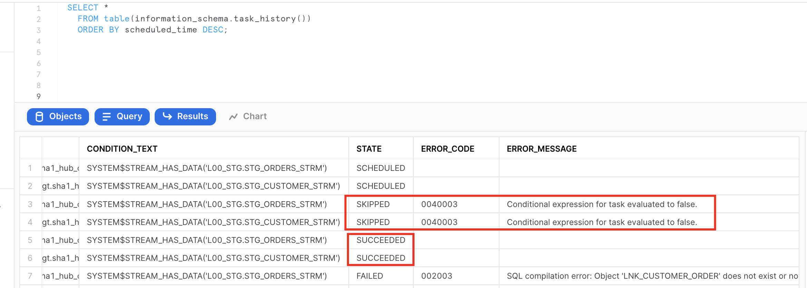

3. We can also check content and stats of the objects involved. Please notice that views on streams in our staging area are no longer returning any rows. This is because that delta of changes was consumed by a successfully completed DML transaction (in our case, embedded in tasks). This way you don't need to spend any time implementing incremental detection/processing logic on the application side. 

```sql
SELECT 'hub_customer', count(1) FROM hub_customer
UNION ALL
SELECT 'hub_order', count(1) FROM hub_order
UNION ALL
SELECT 'sat_customer', count(1) FROM sat_customer
UNION ALL
SELECT 'sat_order', count(1) FROM sat_order
UNION ALL
SELECT 'lnk_customer_order', count(1) FROM lnk_customer_order
UNION ALL
SELECT 'l00_stg.stg_customer_strm_outbound', count(1) FROM l00_stg.stg_customer_strm_outbound
UNION ALL
SELECT 'l00_stg.stg_order_strm_outbound', count(1) FROM l00_stg.stg_order_strm_outbound;
```
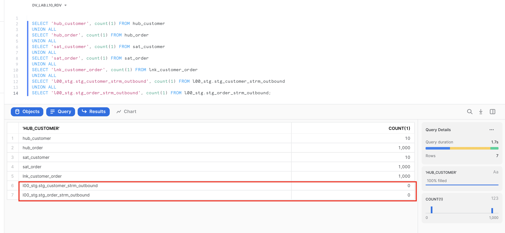

Great. We now have data in our **Raw Data Vault** core structures. Let's move on and talk about the concept of virtualization for building your near-real time Data Vault solution.

<!-- ------------------------ -->
## Views for Agile Reporting
Duration: 10

One of the great benefits of having the compute power from Snowflake is that now it is totally possible to have most of your business vault and information marts in a Data Vault architecture be built exclusively from views. There are numerous customers using this approach in production today. There is no longer a need to have the argument that there are “too many joins” or that the response won’t be fast enough. The elasticity of the Snowflake virtual warehouses combined with our dynamic optimization engine have solved that problem. (For more details, see this [post](https://www.snowflake.com/blog/tips-for-optimizing-the-data-vault-architecture-on-snowflake-part-3/))

If you really want to deliver data to the business users and data scientists in NRT, in our opinion using views is the only option. Once you have the streaming loads built to feed your Data Vault, the fastest way to make that data visible downstream will be views. Using views allows you to deliver the data faster by eliminating any latency that would be incurred by having additional ELT processes between the Data Vault and the data consumers downstream.

All the business logic, alignment, and formatting of the data can be in the view code. That means fewer moving parts to debug, and reduces the storage needed as well.


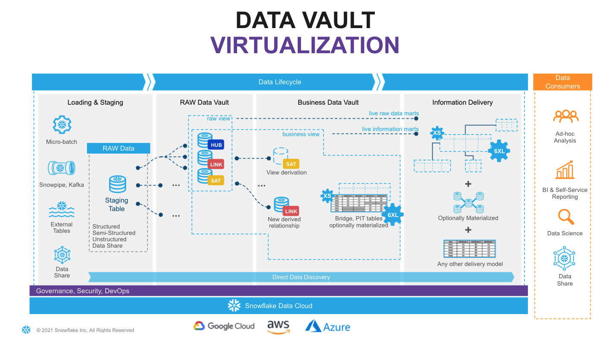  

Looking at the diagram above you will see an example of how virtualization could fit in the architecture. Here, solid lines are representing physical tables and dotted lines - views. You incrementally ingest data into **Raw Data Vault** and all downstream transformations are applied as views. From a data consumer perspective when working with a virtualized information mart, the query always shows everything known by your data vault, right up to the point the query was submitted. 

With Snowflake you have the ability to provide as much compute as required, on-demand,  without a risk of causing performance impact on any surrounding processes and pay only for what you use. This makes materialization of transformations in layers like **Business Data Vault** and **Information delivery** an option rather than a must-have. Instead of “optimizing upfront” you can now make this decision based on the usage pattern characteristics, such as frequency of use, type of queries, latency requirements, readiness of the requirements etc. 


Many modern data engineering automation frameworks are already actively supporting virtualization of logic. Several tools offer a low-code or configuration-like ability to switch between materializing an object as a view or a physical table, automatically generating all required DDL & DML. This could be applied on specific objects, layers or/and be environment specific. So even if you start with a view, you can easily refactor to use a table if user requirements evolve.

As said before, virtualization is not only a way to improve time-to-value and provide near real time access to the data, given the scalability and workload isolation of Snowflake, virtualization also is a design technique that could make your Data Vault excel: minimizing cost-of-change, accelerating the time-to-delivery and becoming an extremely agile, future proof solution for ever growing business needs. 

<!-- ------------------------ -->
## Build: Business Data Vault
Duration: 10

As a quick example of using views for transformations we just discussed, here is how enrichment of customer descriptive data could happen in Business Data Vault, connecting data received from source with some reference data.

1. Let's create a view that will perform these additional derivations on the fly. Assuming non-functional capabilities are satisflying our requirements, deploying (and re-deploying a new version) transformations in this way is super easy. 

```SQL
USE SCHEMA l20_bdv;

CREATE OR REPLACE VIEW sat_customer_bv
AS
SELECT rsc.sha1_hub_customer  
     , rsc.ldts                   
     , rsc.c_name                 
     , rsc.c_address              
     , rsc.c_phone                 
     , rsc.c_acctbal              
     , rsc.c_mktsegment               
     , rsc.c_comment              
     , rsc.nationcode             
     , rsc.rscr 
     -- derived 
     , rrn.n_name                    nation_name
     , rrr.r_name                    region_name
  FROM l10_rdv.sat_customer          rsc
  LEFT OUTER JOIN l10_rdv.ref_nation rrn
    ON (rsc.nationcode = rrn.nationcode)
  LEFT OUTER JOIN l10_rdv.ref_region rrr
    ON (rrn.regioncode = rrr.regioncode)
;
```
2. Now,let's imagine we have a heavier transformation to perform that it would make more sense to materialize it as a table. It could be more data volume, could be more complex logic, PITs, bridges or even an object that will be used frequently and by many users. For this case, let's first build a new business satellite that for illustration purposes will be deriving additional classification/tiering for orders based on the conditional logic. 

```sql
CREATE OR REPLACE TABLE sat_order_bv
( 
  sha1_hub_order         BINARY    NOT NULL   
, ldts                   TIMESTAMP NOT NULL
, o_orderstatus          STRING   
, o_totalprice           NUMBER
, o_orderdate            DATE
, o_orderpriority        STRING
, o_clerk                STRING    
, o_shippriority         NUMBER
, o_comment              STRING  
, hash_diff              BINARY    NOT NULL
, rscr                   STRING    NOT NULL   
-- additional attributes
, order_priority_bucket  STRING
, CONSTRAINT pk_sat_order PRIMARY KEY(sha1_hub_order, ldts)
, CONSTRAINT fk_sat_order FOREIGN KEY(sha1_hub_order) REFERENCES l10_rdv.hub_order
)
AS 
SELECT sha1_hub_order 
     , ldts           
     , o_orderstatus  
     , o_totalprice   
     , o_orderdate    
     , o_orderpriority
     , o_clerk        
     , o_shippriority 
     , o_comment      
     , hash_diff      
     , rscr 
     -- derived additional attributes
     , CASE WHEN o_orderpriority IN ('2-HIGH', '1-URGENT')             AND o_totalprice >= 200000 THEN 'Tier-1'
            WHEN o_orderpriority IN ('3-MEDIUM', '2-HIGH', '1-URGENT') AND o_totalprice BETWEEN 150000 AND 200000 THEN 'Tier-2'  
            ELSE 'Tier-3'
       END order_priority_bucket
  FROM l10_rdv.sat_order;
```

3. What we are going to do from processing/orchestration perspective is extending our order processing pipeline so that when the task populates a **l10_rdv.sat_order** this will generate a new stream of changes and these changes are going to be propagated by a dependent task to **l20_bdv.sat_order_bv**.
This is super easy to do as tasks in Snowflake can be not only schedule-based but also start automatically once the parent task is completed.

```sql
CREATE OR REPLACE STREAM l10_rdv.sat_order_strm ON TABLE l10_rdv.sat_order; 

ALTER TASK l10_rdv.order_strm_tsk SUSPEND;

CREATE OR REPLACE TASK l10_rdv.hub_order_strm_sat_order_bv_tsk
  WAREHOUSE = dv_rdv_wh
  AFTER l10_rdv.order_strm_tsk
AS 
INSERT INTO l20_bdv.sat_order_bv
SELECT   
  sha1_hub_order 
, ldts           
, o_orderstatus  
, o_totalprice   
, o_orderdate    
, o_orderpriority
, o_clerk        
, o_shippriority 
, o_comment      
, hash_diff      
, rscr 
-- derived additional attributes
, CASE WHEN o_orderpriority IN ('2-HIGH', '1-URGENT')             AND o_totalprice >= 200000 THEN 'Tier-1'
       WHEN o_orderpriority IN ('3-MEDIUM', '2-HIGH', '1-URGENT') AND o_totalprice BETWEEN 150000 AND 200000 THEN 'Tier-2'  
       ELSE 'Tier-3'
  END order_priority_bucket
FROM sat_order_strm;

ALTER TASK l10_rdv.hub_order_strm_sat_order_bv_tsk RESUME;
ALTER TASK l10_rdv.order_strm_tsk RESUME;
```

4. Now, let's go back to our staging area to process another slice of data to test the task. 

```sql
USE SCHEMA l00_stg;

COPY INTO @orders_data 
FROM
(SELECT *
  FROM snowflake_sample_data.tpch_sf10.orders limit 1000
) 
INCLUDE_QUERY_ID=TRUE;

ALTER PIPE stg_orders_pp   REFRESH;
```

5. Data is not automatically flowing through all the layers via asyncronous tasks. With the results you can validate: 

```sql
SELECT 'l00_stg.stg_orders', count(1) FROM l00_stg.stg_orders
UNION ALl
SELECT 'l00_stg.stg_orders_strm', count(1) FROM l00_stg.stg_orders_strm
UNION ALl
SELECT 'l10_rdv.sat_order', count(1) FROM l10_rdv.sat_order
UNION ALl
SELECT 'l10_rdv.sat_order_strm', count(1) FROM l10_rdv.sat_order_strm
UNION ALL
SELECT 'l20_bdv.sat_order_bv', count(1) FROM l20_bdv.sat_order_bv;
```

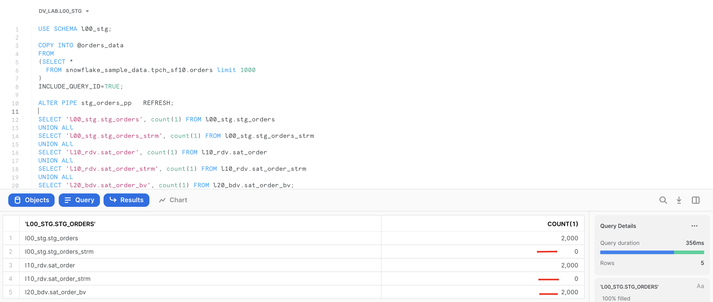

Great. Hope this example illustrated few ways of managing **Business Data Vault** objects in our pipeline.
Let's finally move into the **Information Delivery** layer. 

<!-- ------------------------ -->
## Build: Information Delivery
Duration: 10

When it comes to Information Delivery area we are not changing the meaning of data, but we may change format to simplify users to access and work with the data products/output interfaces. Different consumers may have different needs and preferences, some would prefer star/snowflake dimensional schemas, some would adhere to use flattened objects or even transform data into JSON/parquet objects. 

1. First things we would like to add to simplify working with satellites is creating views that shows latest version for each key. 

```sql
--------------------------------------------------------------------
-- RDV curr views
--------------------------------------------------------------------

USE SCHEMA l10_rdv;

CREATE VIEW sat_customer_curr_vw
AS
SELECT  *
FROM    sat_customer
QUALIFY LEAD(ldts) OVER (PARTITION BY sha1_hub_customer ORDER BY ldts) IS NULL;

CREATE OR REPLACE VIEW sat_order_curr_vw
AS
SELECT  *
FROM    sat_order
QUALIFY LEAD(ldts) OVER (PARTITION BY sha1_hub_order ORDER BY ldts) IS NULL;

--------------------------------------------------------------------
-- BDV curr views
--------------------------------------------------------------------

USE SCHEMA l20_bdv;

CREATE VIEW sat_order_bv_curr_vw
AS
SELECT  *
FROM    sat_order_bv
QUALIFY LEAD(ldts) OVER (PARTITION BY sha1_hub_order ORDER BY ldts) IS NULL;

CREATE VIEW sat_customer_bv_curr_vw
AS
SELECT  *
FROM    sat_customer_bv
QUALIFY LEAD(ldts) OVER (PARTITION BY sha1_hub_customer ORDER BY ldts) IS NULL;
```

2. Let's create a simple dimensional structure. Again, we will keep it virtual(as views) to start with, but you already know that depending on access characteristics required any of these could be selectively materialized. 

```sql

USE SCHEMA l30_id;

-- DIM TYPE 1
CREATE OR REPLACE VIEW dim1_customer 
AS 
SELECT hub.sha1_hub_customer                      AS dim_customer_key
     , sat.ldts                                   AS effective_dts
     , hub.c_custkey                              AS customer_id
     , sat.rscr                                   AS record_source
     , sat.*     
  FROM l10_rdv.hub_customer                       hub
     , l20_bdv.sat_customer_bv_curr_vw            sat
 WHERE hub.sha1_hub_customer                      = sat.sha1_hub_customer;

-- DIM TYPE 1
CREATE OR REPLACE VIEW dim1_order
AS 
SELECT hub.sha1_hub_order                         AS dim_order_key
     , sat.ldts                                   AS effective_dts
     , hub.o_orderkey                             AS order_id
     , sat.rscr                                   AS record_source
     , sat.*
  FROM l10_rdv.hub_order                          hub
     , l20_bdv.sat_order_bv_curr_vw               sat
 WHERE hub.sha1_hub_order                         = sat.sha1_hub_order;

-- FACT table

CREATE OR REPLACE VIEW fct_customer_order
AS
SELECT lnk.ldts                                   AS effective_dts     
     , lnk.rscr                                   AS record_source
     , lnk.sha1_hub_customer                      AS dim_customer_key
     , lnk.sha1_hub_order                         AS dim_order_key
-- this is a factless fact, but here you can add any measures, calculated or derived
  FROM l10_rdv.lnk_customer_order                 lnk;  
```

3. All good so far? Now lets try to query **fct_customer_order** and at least in my case this view was not returning any rows.
Why? If you remember, when we were unloading sample data, we took a subset of random orders and a subset of random customers. Which in my case didn't have any overlap, therefore doing the inner join with dim1_order was resulting in all rows being eliminated from the resultset. 
Thankfully we are using Data Vault and all need to do is go and load full customer dataset. Just think about it, there is no need to reprocess any links or fact tables simply because customer/reference feed was incomplete. I am sure for those of you who were using different architectures for data engineering and warehousing have painful experience when such situations occur. So, lets go and fix it:

```sql
USE SCHEMA l00_stg;

COPY INTO @customer_data 
FROM
(SELECT object_construct(*)
  FROM snowflake_sample_data.tpch_sf10.customer
  -- removed LIMIT 10
) 
INCLUDE_QUERY_ID=TRUE;

ALTER PIPE stg_customer_pp   REFRESH;
```

All you need to do now is just wait a few seconds whilst our continious data pipeline will automatically propagate new customer data into Raw Data Vault.
Quick check for the records count in customer dimension now shows that there are 1.5Mn records: 

```sql
USE SCHEMA l30_id;

SELECT COUNT(1) FROM dim1_customer;


COUNT(1)
------
1,500,000
```

4. Finally lets wear user's hat and run a query to break down orders by nation,region and order_priority_bucket (all attributes we derived in **Business Data Vault**). As we are using Snowsight, why not quickly creating a chart from this result set to better understand the data. For this simply click on the 'Chart' section on the bottom pane and put attributes/measures as it is snown on the screenshot below. 

```sql
SELECT dc.nation_name
     , dc.region_name
     , do.order_priority_bucket
     , COUNT(1)                                   cnt_orders
  FROM fct_customer_order                         fct
     , dim1_customer                              dc
     , dim1_order                                 do
 WHERE fct.dim_customer_key                       = dc.dim_customer_key
   AND fct.dim_order_key                          = do.dim_order_key
GROUP BY 1,2,3;
```
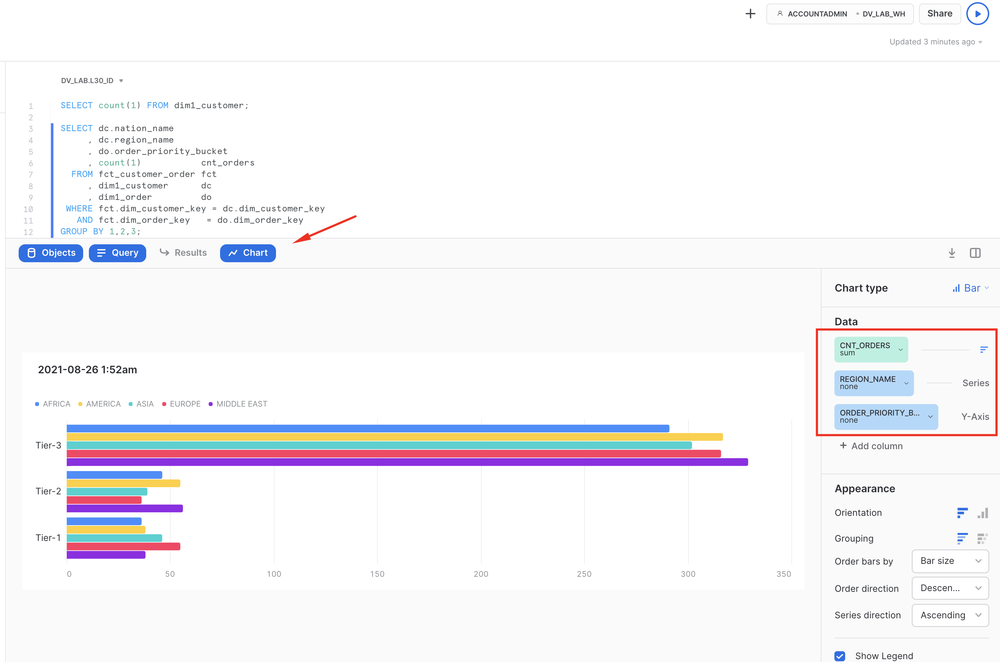

Voila! This concludes our journey for this guide. Hope you enjoyed it and lets summarise key points in the next section.

<!-- ------------------------ -->
## Conclusion
Duration: 1

Simplicity of engineering, openness, scalable performance, enterprise-grade governance enabled by the core of the Snowflake platform are now allowing teams to focus on what matters most for the business and build truly agile, collaborative data environments. Teams can now connect data from all parts of the landscape, until there are no stones left unturned. They are even tapping into new datasets via live access to the Snowflake Data Marketplace. The Snowflake Data Cloud combined with a Data Vault 2.0 approach is allowing teams to democratize access to all their data assets at any scale. We can now easily derive more and more value through insights and intelligence, day after day, bringing businesses to the next level of being truly data-driven.  

Delivering more usable data faster is no longer an option for today’s business environment. Using the Snowflake platform, combined with the Data Vault 2.0 architecture it is now possible to build a world class analytics platform that delivers data for all users in near real-time. 

### What we've covered
- building Data Vault environment
- unloading and loading back data using COPY and Snowpipe
- engineering data pipelines using virtualization, streams and tasks

### Call to action
- seeing is believing. Try it! 
- we made examples limited in size, but feel free to scale the data volumes and virtual warehouse size to see scalability in action
- tap into numerous communities of practice for Data Engineering on Snowflake and Data Vault in particular
- talk to us about modernizing your data landscape! Whether it is Data Vault or not you have on your mind, we have the top expertise and product to meet your demand
- feedback is super welcome! 
- Enjoy your journey! 
