author: andries.engelbrecht@snowflake.com
id: vhol_snowflake_salesforce_tcrm
summary: This lab will walk you through how to use Snowflake, Salesforce and Tableau CRM to integrate data, and deliver Customer 360.
categories: Getting Started
environments: web
status: Published
feedback link: https://github.com/Snowflake-Labs/sfguides/issues
tags: Salesforce, Tableau CRM, Customer 360, Data Marketplace, Databases, Tables, Stages, File Formats

# Enrich Salesforce data with Snowflake to deliver your Customer 360

<!-- ------------------------ -->
## Use Case Overview
Duration: 5

This guide will take you through the process of integrating Salesforce and Snowflake using Tableau CRM to deliver Customer 360.

Throughout this process, you will discover the ease at which it is possible to build integrated solutions with Snowflake and Salesforce using Tableau CRM. 

To showcase customer 360, we will first load shipping data in Snowflake. Then the data will be enriched with weather information from the Snowflake Data Marketplace. We will then load customer service data in Salesforce, and using Tableau CRM the customer service data will then be synced with Snowflake, where it will be combined with the shipping and weather data. The customer service agent from the Salesforce environment will then be able to have access to the full combined service, shipping and weather data in Snowflake using Tableau CRM Direct Data connector.

Here is an outline of the workflow:
<br/><br/>
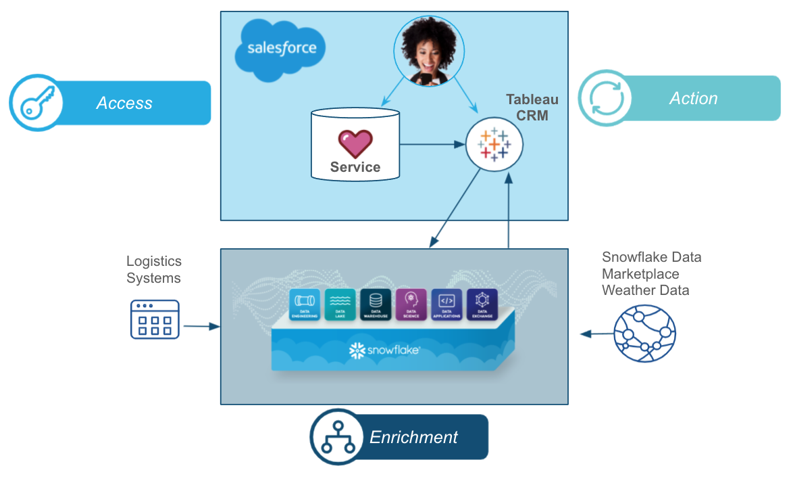
<br/><br/>

### Prerequisites
- Basic knowledge of SQL, and database concepts and objects
- Basic understanding of Salesforce

### What You'll Learn
- How to create and utilize databases, tables, views, and warehouses
- Load structured data into Snowflake
- Load data into Salesforce
- Use Snowflake’s Data Marketplace to easily access external data
- Use Tableau CRM to Sync data to and do live queries with Snowflake

### What You’ll Need
- [Snowflake Trial Account](https://signup.snowflake.com/) 
- [Salesforce Analytics Developer Account](https://trailhead.salesforce.com/en/promo/orgs/analytics-de)

### What You’ll Build
- Snowflake objects, including tables and warehouses, to scale and manage your data
- Tableau CRM integrations with Salesforce Service Cloud objects and Snowflake to manage data flow and reporting to drive action

<!-- ------------------------ -->
## Setting up Snowflake
Duration: 3

The first thing you will need to do is download the following .sql file that contains a series of SQL commands we will execute throughout this lab.

<button>
  [Download .sql File](https://snowflake-corp-se-workshop.s3.us-west-1.amazonaws.com/VHOL_Snowflake_Salesforce/TCRM_V1/files/VHOL_SNOW_TCRM_1.0.sql)
</button>
<br/><br/>

At this point, log into your Snowflake account and have a clear screen to start working with. If you have just created a free trial account, feel free to minimize or close and hint boxes that are looking to help guide you. These will not be needed for this lab and most of the hints will be covered throughout the remainder of this exercise.

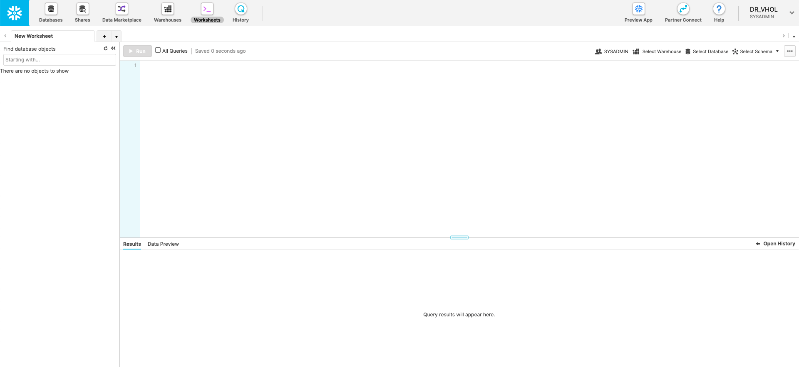
<br/><br/>

To ingest our script in the Snowflake UI, navigate to the ellipsis button on the top right hand side of a “New Worksheet” and load our script.


<br/><br/>

The SQL script file should show up as text in a new worksheet.

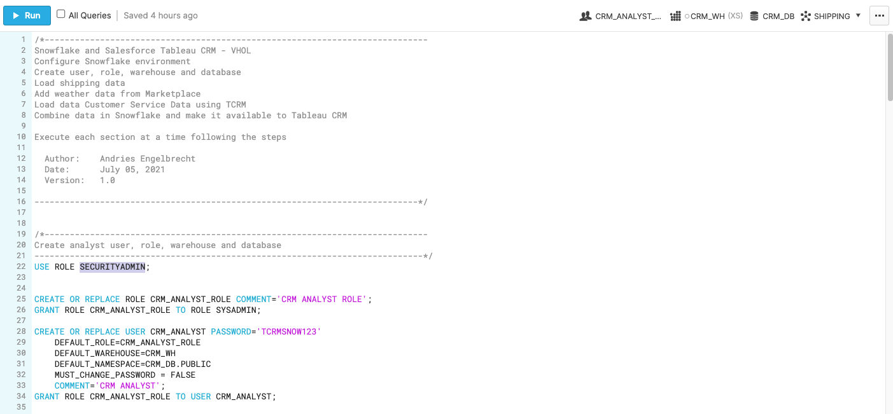
<br/><br/>

Snowflake provides "worksheets" as the spot for you to execute your code. For each worksheet you create, you will need to set the “context” so the worksheet knows how to behave. A “context” in Snowflake is made up of 4 distinctions that must be set before we can perform any work: the “role” we want to act as, the “database” and “schema” we want to work with, and the “warehouse” we want to perform the work. This can be found in the top right hand section of a new worksheet.


<br/><br/>

It is also helpful to turn on code highlight in the worksheet. This will highlight the SQL command(s) that you will execute before "running" the command. Navigate to the ellipsis button on the top right hand side of a "New Worksheet" and click Turn on Code Highlight.

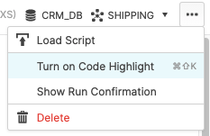
<br/><br/>

Let's go ahead and set the role we want to act as, which will be `SECURITYADMIN` to begin with. We can either set this either manually by hovering over the people icon and choosing SECURITYADMIN from the “Role” dropdown, or we can run the first line of code in our worksheet. In addition to traditional SQL statements, Snowflake Data Definition ([DDL](https://docs.snowflake.com/en/sql-reference/sql-ddl-summary.html)) commands, such as setting the worksheet context, can also be written and executed within the worksheet. 

For convenience all the SQL commands needed are already in the SQL script. Let's execute the first SQL command in the SQL script.

```sql
USE ROLE SECURITYADMIN;
```

To execute this code, all we need to do is place our cursor on the line we wish to run and then either hit the "run" button at the top left of the worksheet or press `Cmd/Ctrl + Enter/Return`. 

Once code is executed the results will be displayed below the worksheet.

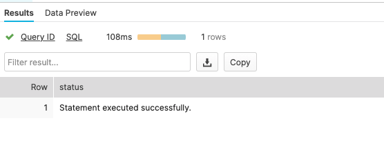
<br/>

Each step throughout the guide has an associated SQL command to perform the work we are looking to execute, and so feel free to step through each action running the code line by line as we walk through the lab. For the purposes of this demo, we will not be running multiple statements in a row.

<!-- ------------------------ -->
## Creating Snowflake Role, User, Database & Warehouse
Duration 5:

To get started, we are going to create the Snowflake objects for this lab. You can create objects using the UI, but for the purposes of this lab we will use Snowflake DDL commands in the SQL script file that we downloaded in the previous step. 

We already switched our "role" to `SECURITYADMIN`, a role typically used to create users and roles in the Snowflake account. We will now create our primary ROLE and USER that will be used by the CRM Analyst persona. We will also grant the CRM_ANALYST role to the SYSADMIN role to make administration easier. Highlight and execute both commands.

```sql
CREATE OR REPLACE ROLE CRM_ANALYST_ROLE COMMENT='CRM ANALYST ROLE';
GRANT ROLE CRM_ANALYST_ROLE TO ROLE SYSADMIN;
``` 

Next we will create the `CRM_ANALYST` user, and grant the `CRM_ANALYST_ROLE` role to this user. Please note the password that is set for the user, feel free to change the password to your preference, but **do note this password** as it will be used in future steps to configure the connections with Tableau CRM.

```sql
CREATE OR REPLACE USER CRM_ANALYST PASSWORD='TCRMSNOW123' 
    DEFAULT_ROLE=CRM_ANALYST_ROLE 
    DEFAULT_WAREHOUSE=CRM_WH
    DEFAULT_NAMESPACE=CRM_DB.PUBLIC
    MUST_CHANGE_PASSWORD = FALSE
    COMMENT='CRM ANALYST';
GRANT ROLE CRM_ANALYST_ROLE TO USER CRM_ANALYST;
```

We will now switch to the `SYSADMIN` role to create the database and schema needed. Databases and Schemas are storage structures used in Snowflake to store and manage objects such as Tables, Views, Stages, Sequences, etc. We will also grant the `CRM_ANALYST_ROLE` the necessary privileges on these structures.

```sql
USE ROLE SYSADMIN;

CREATE OR REPLACE DATABASE CRM_DB;
CREATE OR REPLACE SCHEMA CRM_DB.SHIPPING;

GRANT USAGE ON DATABASE CRM_DB TO ROLE CRM_ANALYST_ROLE;
GRANT ALL ON SCHEMA CRM_DB.SHIPPING TO ROLE CRM_ANALYST_ROLE;
```

Next we will create a Snowflake WAREHOUSE that will be used. In Snowflake a WAREHOUSE is a compute cluster that can be instantaneously start/stopped or scaled up/down as needed. WAREHOUSES only perform compute work, while all data is managed and stored in DATABASES, as Snowflake has complete separation between storage and compute to allow for fast and flexible independent scaling. We will also grant the CRM_ANALYST_ROLE usage privileges on the WAREHOUSE.

**TIP:** It is typically a good idea to create all warehouses with the `AUTO_SUSPEND` and `AUTO_RESUME` properties set to avoid using compute resources when not needed.

```sql
CREATE OR REPLACE WAREHOUSE CRM_WH
      WITH WAREHOUSE_SIZE = 'XSMALL'
      AUTO_SUSPEND = 300
      AUTO_RESUME = TRUE;

GRANT USAGE ON WAREHOUSE CRM_WH TO ROLE CRM_ANALYST_ROLE;
```

The warehouse is now ready to use.

<!-- ------------------------ -->
## Load Shipping data into Snowflake
Duration: 5

We will now load shipping data into Snowflake to simulate data from internal shipping and financials systems, that are typically doen with ELT/ETL processes.

First we will set our context to the `CRM_ANALYST_ROLE`, and the `CRM_DB` database and `SHIPPING` schema.

```sql
USE ROLE CRM_ANALYST_ROLE;
USE WAREHOUSE CRM_WH;
USE CRM_DB.SHIPPING;
```
Next we will create the `SHIPPING_NFO` table to load the data.

```sql
CREATE OR REPLACE TABLE SHIPPING_INFO 
   (Account_ID VARCHAR(64), Shipment_Id VARCHAR(64), Shipping_State VARCHAR(4),	
    Last_Modified_Date DATE, Closed_Date DATE,
    Priority VARCHAR(10), Contact_Name VARCHAR(64), SLA_Compliant_textBucket VARCHAR(10),	
    Shipmen_Account_Name VARCHAR(64), Line_Haul_Carrier VARCHAR(64),	
    Product_Description	VARCHAR(64), Shipment_Name VARCHAR(64),	
    Created_Date DATE, Profit_per_Order DECIMAL(10,4), Cost_per_Ship DECIMAL(10,4),	
    Estimated_Days_to_Destination INT
    );
```

Next we will create a Snowflake `EXTERNAL STAGE` to a public S3 location with the data we want to load. Snowflake stages are storage spaces which can be used to load or unload data to/from Snowflake using the `COPY` command. In this case we are using an `EXTERNAL STAGE` to directly be able to copy data from S3 to Snowflake.

```sql
CREATE OR REPLACE STAGE SHIPPING_DATA
  url='s3://snowflake-corp-se-workshop/VHOL_Snowflake_Salesforce/TCRM_V1/data/';
```

Next we can load the data into Snowflake using the `COPY` command. We will use one of the predefined Snowflake file formats for CSV files to do this.

```sql
COPY INTO SHIPPING_INFO FROM @SHIPPING_DATA/ FILE_FORMAT = (TYPE = 'CSV' SKIP_HEADER = 1 FIELD_OPTIONALLY_ENCLOSED_BY ='"' DATE_FORMAT = 'MM/DD/YY');
```

Let's have a quick look at the shipping data.

```sql
SELECT * FROM SHIPPING_INFO;
```  
You should now see the information in the `SHIPPING_INFO` table.

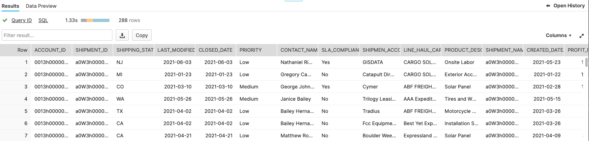
<br/><br/>

This data will simulate data from various internal systems.

<!-- ------------------------ -->
## Snowflake MarketPlace Data
Duration: 10

The **Snowflake Marketplace** has a large number of Data Providers where you can gain immediate access to external data without the need to perform any ETL or transformations. The data will show up as a database in your account. Additionally the the data will immediately be updated as soon a the Data Provider performs any updates. This is an extremely powerful mechanism to enrich your data with external data sources.

First we will grant the right privileges to the `CRM_ANALYST_ROLE` role to allow it to add Marketplace data. For this we will have to switch to the `ACCOUNTADMIN` role first.

```sql
USE ROLE ACCOUNTADMIN;
GRANT IMPORT SHARE ON ACCOUNT TO CRM_ANALYST_ROLE;
GRANT CREATE DATABASE ON ACCOUNT TO ROLE CRM_ANALYST_ROLE;
```
We will then switch back to out `CRM_ANALYST_ROLE`.
```sql
USE ROLE CRM_ANALYST_ROLE;
```

To be able to add Marketplace data we will use the new Snowflake UI. Click on the `Preview App` button on the top right hand of the Snowflake console, next to the Partner Connect and Help buttons.


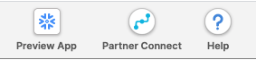
<br/><br/>

Once you click on the Preview App button a new browser tab will open with the new preview Snowflake UI. On the top left hand corner click on your username and then hover over the `Switch Role` menu. Scroll and select the the `CRM_ANALYST_ROLE` from the list of roles.

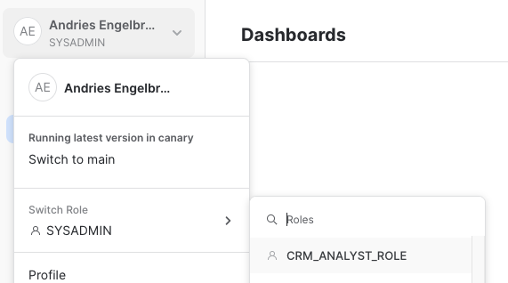
<br/><br/>

Now click on the `Data` menu bar on the left side. Then select `Marketplace`.

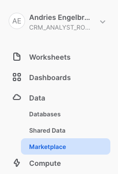
<br/><br/> 

Once in the Marketplace type `Weather` in the top `Search Data Marketplace` and hit Enter/Return. This will provide a list of Data Providers with Weather data. Make sure to select **Weather Source** as provider and the **Global Weather & Climate Data for BI** tile from the list of tiles. 

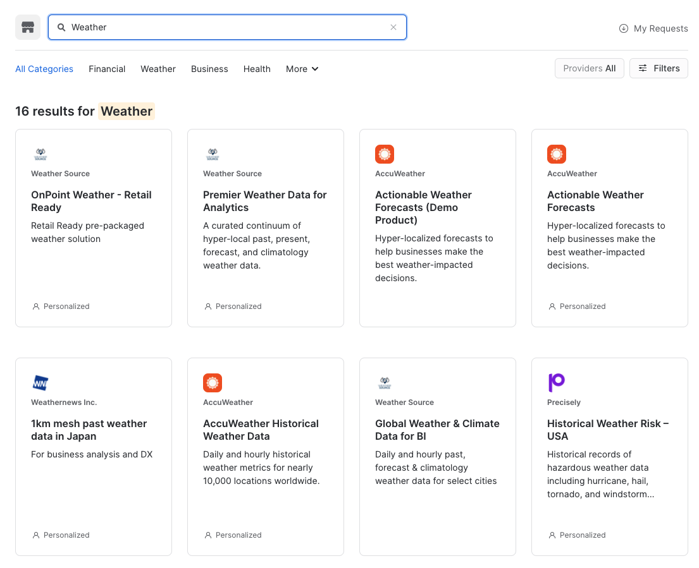
<br/><br/> 

Then click on the `Get Data` button on the top right side.

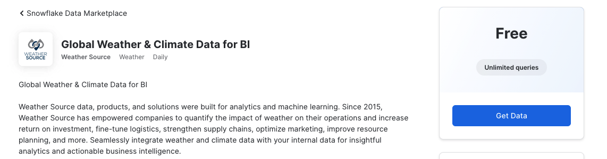
<br/><br/> 

**TIP:** If you experience errors getting to the listing, sign out of the preview app and sign back in by clicking on your username in the top left corner.


In the pop up display remove the current string in the entry field, and type in **WEATHERSOURCE** for Create Database and click on `Get Data`.

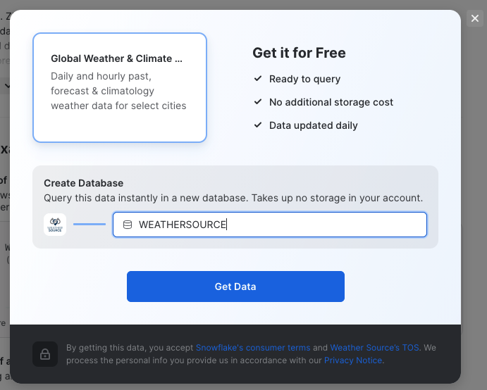
<br/><br/> 

Click `Done` when finished. Then on the top of the window click `Snowflake Data Marketplace` to return to the listings of Marketplace Data Providers. 

We now want to get data to allow us to consolidate geography data by state and zip code. SafeGraph provides a data set that will help with that. Following the same steps as before type `SafeGraph` in the top search box. Then select **SafeGraph** as provider and the **Foot Traffic Patterns - Starbucks** tile.

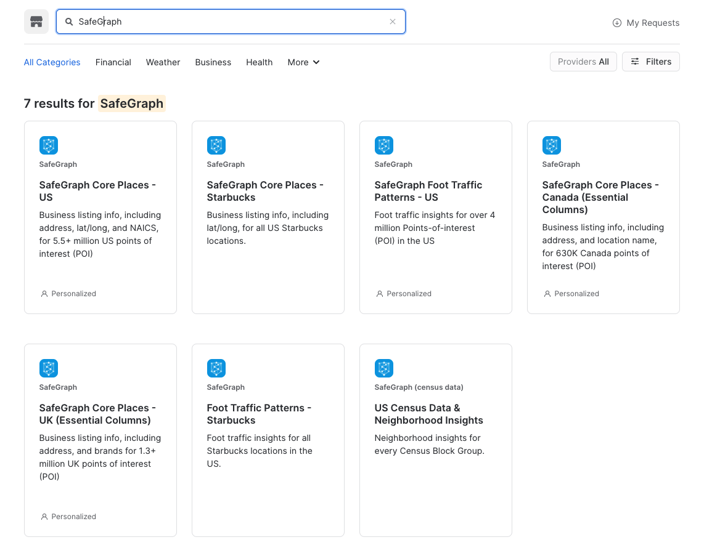
<br/><br/> 

Then click on the `Get Data` button on the top right side. In the pop up display remove the current string in the entry field, and type in **SAFEGRAPH_STARBUCKS** for Create Database and click on `Get Data`.

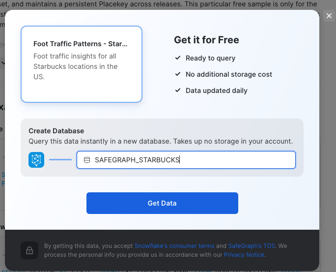
<br/><br/> 

Click `Done` when finished and close the browser tab that was used for the Marketplace.

<!-- ------------------------ -->
## Enrich the Shipping data with Marketplace data
Duration: 4

Let's look at the Marketplace data we got from the previous steps. The Marketplace data will look like databases in your Snowflake account with no need to do any ETL.

**Note:** Make sure you are using the `CRM_ANALYST_ROLE` as set in the previous step.

Let's first look at the weather data. You will notice there are historical and forecast data, we will quickly look at both. Take some time after each query to look at the data. You will notice the data is available by zip (postal) code and one entry for each zip and day.

```sql
USE WEATHERSOURCE.STANDARD_TILE;

SELECT * FROM WEATHERSOURCE.STANDARD_TILE.HISTORY_DAY ORDER BY DATE_VALID_STD DESC LIMIT 1000;

SELECT * FROM WEATHERSOURCE.STANDARD_TILE.FORECAST_DAY ORDER BY DATE_VALID_STD DESC LIMIT 1000;
```

Our shipping data was only by state, let's look at the SafeGraph data.

```sql
USE SAFEGRAPH_STARBUCKS.PUBLIC;

SELECT * FROM SAFEGRAPH_STARBUCKS.PUBLIC.PATTERNS LIMIT 1000;
```

We can see that the SafeGraph data provides zip codes for states. We can now use that to join with the Weather data and use aggregate function to the weather extremes in the state for that day. To make it simpler to use we will create Snowflake `VIEWS` joining the datasets so it will always be up to date when the providers update their data. We will create a view for Weather History and a view for Weather Forecast.

We will create the views in our `CRM_DB` database and `SHIPPING` schema.

```sql
USE CRM_DB.SHIPPING;

CREATE OR REPLACE VIEW WEATHER_HISTORICAL AS
    SELECT W.DATE_VALID_STD AS DATE, S.REGION AS STATE, MAX(W.MAX_TEMPERATURE_AIR_2M_F) AS MAX_TEMP,
            MIN(W.MIN_TEMPERATURE_AIR_2M_F) AS MIN_TEMP, MAX(W.TOT_PRECIPITATION_IN) AS PRECIPITATION,
            MAX(W.MAX_WIND_SPEED_10M_MPH) AS MAX_WIND
        FROM WEATHERSOURCE.STANDARD_TILE.HISTORY_DAY W, SAFEGRAPH_STARBUCKS.PUBLIC.PATTERNS S
        WHERE W.POSTAL_CODE = S.POSTAL_CODE
        GROUP BY W.DATE_VALID_STD,S.REGION;
        
CREATE OR REPLACE VIEW WEATHER_FORECAST AS        
       SELECT W.DATE_VALID_STD AS DATE, S.REGION AS STATE, MAX(W.MAX_TEMPERATURE_AIR_2M_F) AS MAX_TEMP_F,
            MIN(W.MIN_TEMPERATURE_AIR_2M_F) AS MIN_TEMP_F, MAX(W.PROBABILITY_OF_PRECIPITATION_PCT) AS PRECIPITATION_PROB,
            MAX(W.MAX_WIND_SPEED_10M_MPH) AS MAX_WIND
        FROM WEATHERSOURCE.STANDARD_TILE.FORECAST_DAY W, SAFEGRAPH_STARBUCKS.PUBLIC.PATTERNS S
        WHERE W.POSTAL_CODE = S.POSTAL_CODE
        GROUP BY W.DATE_VALID_STD,S.REGION;
```

We can now use these views to see how it may have impacted shipping. Here is query that joins the `SHIPPING_INFO` table with the historical weather data.

```sql
SELECT S.*, WH.MAX_TEMP, WH.MIN_TEMP, WH.PRECIPITATION, WH.MAX_WIND
    FROM SHIPPING_INFO S LEFT JOIN WEATHER_HISTORICAL WH
    ON S.SHIPPING_STATE = WH.STATE AND TO_DATE(S.CREATED_DATE) = WH.DATE;
```
In the results you can scroll to the left and see the corresponding weather data for the shipping rows. If you scroll down you will see some shipping data has now corresponding weather data and those columns will have `NULL` values.

To make this information easier to consume we will create a view combining the shipping and weather data.

```sql
CREATE OR REPLACE VIEW SHIP_WEATHER_HISTORY AS
    SELECT S.*, WH.MAX_TEMP, WH.MIN_TEMP, WH.PRECIPITATION, WH.MAX_WIND
    FROM SHIPPING_INFO S LEFT JOIN WEATHER_HISTORICAL WH
    ON S.SHIPPING_STATE = WH.STATE AND TO_DATE(S.CREATED_DATE) = WH.DATE;
```        

You can use this view for easier consumption of the data.

<!-- ------------------------ -->
## Loading Data into Salesforce
Duration: 5

Let's switch to Salesforce. Open another tab on your browser and login to the [Salesforce Analytics Developer Account](https://trailhead.salesforce.com/en/promo/orgs/analytics-de).


### First we need to enable the Snowflake output connection.

Setup → Analytics → Analytics → Settings → Check the `Enable Snowflake output connection`
 
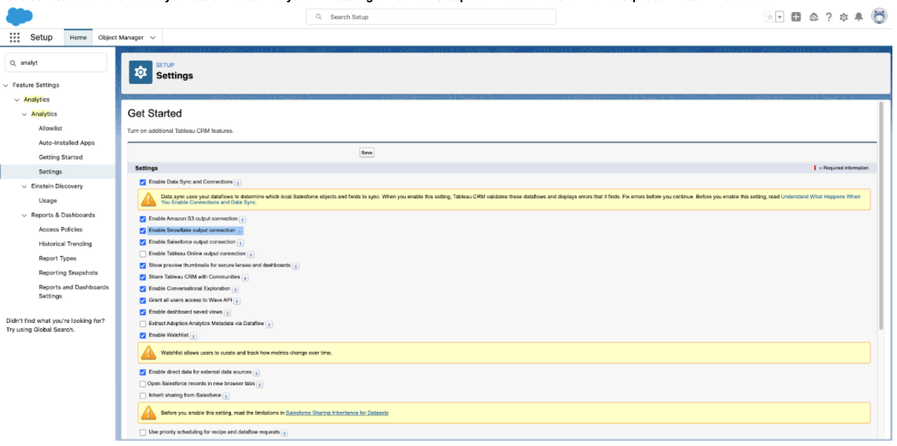
<br/><br/> 


To simulate **Customer Service** data we will create a `Custom Object` from the CSV file in the link below. Click the button to download the CSV file. 


<button>
  [Download .csv File](https://snowflake-corp-se-workshop.s3.us-west-1.amazonaws.com/VHOL_Snowflake_Salesforce/TCRM_V1/files/master_customer_case.csv)
</button>
<br/><br/>


### Follow the steps below to load the data:
- Go to Setup 
- Click on Object Manager and click on CREATE. Select “Custom Object from Spreadsheet”.
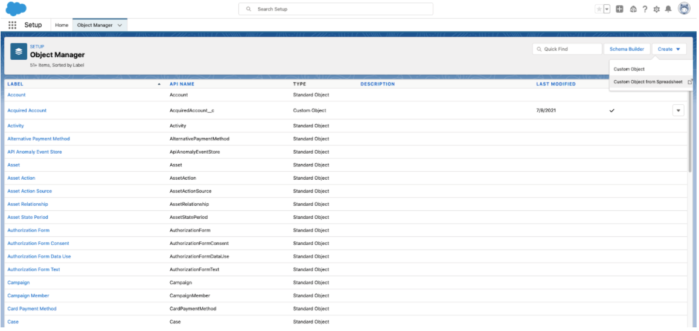
<br/><br/> 

- In the new browser tab login with Salesforce (Provide credentials for the dev account you just created)
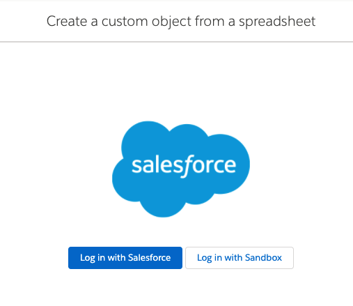
<br/><br/> 

- Drag and drop the `master_customer_case.csv` file.
- You will get a warning for Account_Name. Select “Text” from the Field Type. 
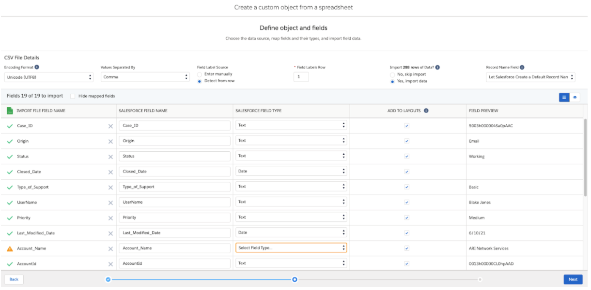
<br/><br/> 

- Hit Next. 
- Hit Finish on the next page. 
- Close the browser tab when finished. The custom object is created.

**TIP:** Type the setting name in the `Quick Find` search bar in Setup.


We now have to assign permissions on the Custom object to allow Analytic Cloud Integrations to read the object.

### Steps to assign permissions:
- Setup → Home → Profiles → “Analytics Cloud Integrations”. 
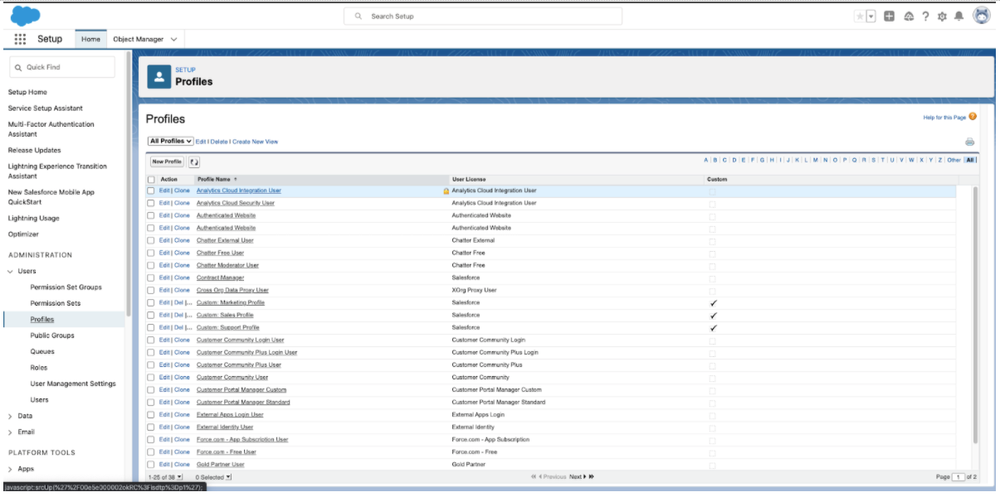
<br/><br/> 

- Scroll down and find “Custom Field-Level Security”.
- Click on “View” just next to the `master_customer_case`. Click on Edit, then make sure all the fields have “Read Access”, if not enabled please check all the fields and save.
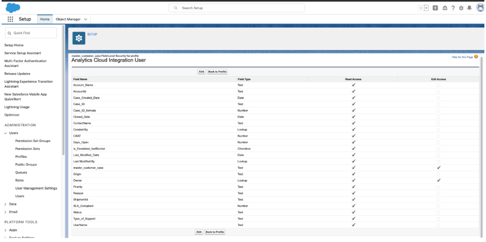
<br/><br/> 

- Repeat the same steps for “System Administration” profiles.
- Profiles → “System Administration” → “Custom Field level Security” → “Enable all the fields” and Save.

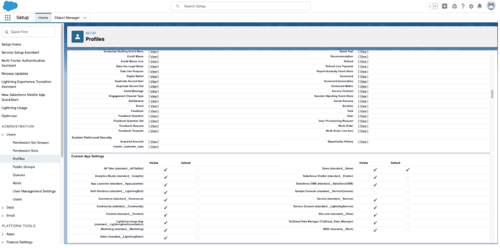
<br/><br/> 

The object will now be accessible for data integration. 

<!-- ------------------------ -->
## Configure Tableau CRM and Sync Salesforce data with Snowflake
Duration: 15


### The next step is to configure the connection to the Salesforce object in the Data Manager.
Go to `Analytics Studio` from the App Launcher.

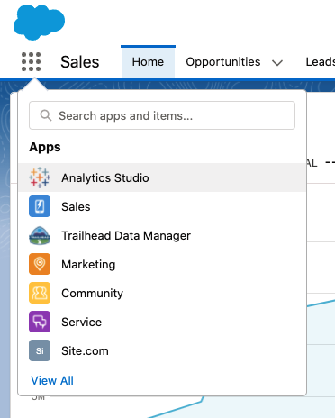
<br/><br/> 

Select `Data Manager` on the left hand menu. Go to `Dataflows and Recipes` and click on `Create Dataflow`. Enter **Snowflake - TCRM Test** as the name.

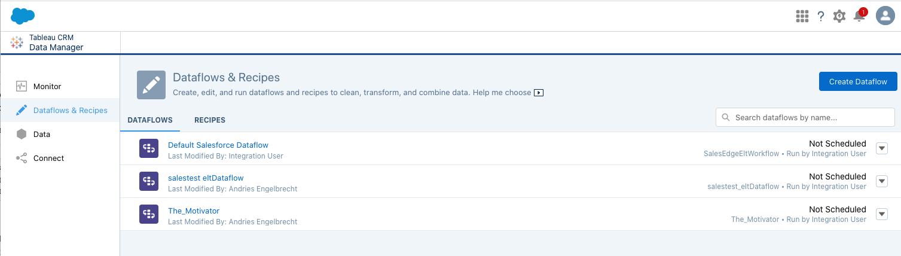
<br/><br/> 

Click on `SFDC Digest` (second option on eft side of the panel).

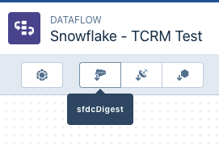
<br/><br/> 

Give a name to the Node and select the source object which we created(`master_customer_case__c`). Then click on `select fields` and make sure you select all the fields that we have in that object. For reference, see  the below list of fields that need to be selected.  
**NOTE: MAKE SURE ALL OF THE FIELDS THAT WE GAVE ACCESS TO PROFILES ARE SELECTED AND DO NOT SELECT ANY EXTRA FIELDS. THIS MAY CAUSE DATAFLOW TO FAIL.**

**TIP:** Most fields will have `__c` at the end for the custom object we loaded.

* `ID`
* `CASE_ID_FORMULA__C`
* `SLA_COMPLIANT__C`
* `SHIPMENTID__C`
* `NAME`
* `PRIORITY__C`
* `CREATEDBYID`
* `OWNERID`
* `REASON__C`
* `DAYS_OPEN__C`
* `CLOSED_DATE__C`
* `CSAT__C`
* `ACCOUNTID__C`
* `CASE_CREATED_DATE__C`
* `USERNAME__C`
* `ACCOUNT_NAME__C`
* `LAST_MODIFIED_DATE__C`
* `ORIGIN__C`
* `IS_ESCALATED_TEXTBUCKET__C`
* `CONTACTNAME__C`
* `STATUS__C`
* `CASE_ID__C`
* `LASTMODIFIEDBYID`
* `TYPE_OF_SUPPORT__C`

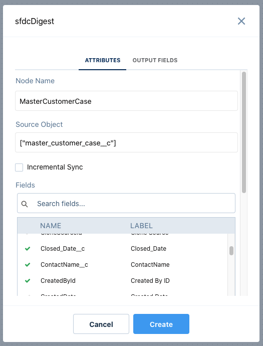
<br/><br/> 

Click `Create` to save the node.
Click `Update Dataflow` from the top right corner, provide a version name (if needed) and then `Run the Dataflow`.
Switch back to Data Manager and you can monitor the flow from `Monitor`.

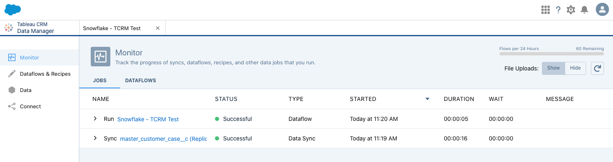
<br/><br/> 

Once the dataflow ran successfully. Go to `Connect` from the left panel and look for the `master_customer_case` object. Click on the dropdown and select `Run Data Sync` and `Run Full Sync`.

Once the sync ran successfully, click on `Connect to Data` → `Input Connection` → Click on `+` and select `Salesforce Connector`.

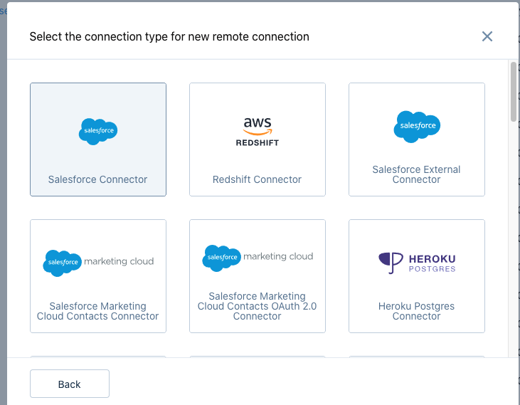
<br/><br/> 
 
Then name your connection as `SFDC Daily Connection` ,developer name as `SFDC_Conn`  and write a description and save the connection. Close the window.

Click on the drop down next to `master_customer_case` and select `Switch Connection` and select `SFDC_LOCAL_SFDC DAILY Connection`. Click `Save`.

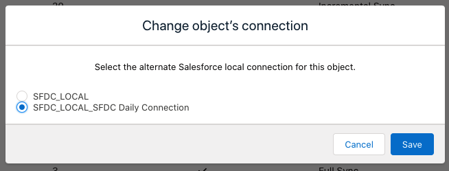
<br/><br/> 

Click on the object `master_customer_case` under `SFDC_LOCAL_SFDC DAILY Connection`, then click `Continue`. 

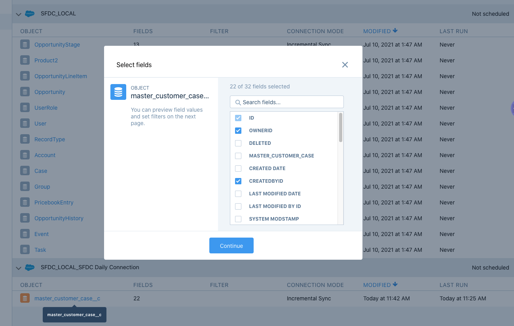
<br/><br/>   

Hit `Save`.

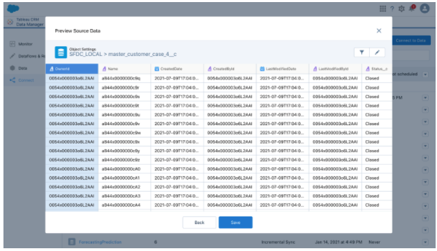
<br/><br/>  

After that you will see the object created in `SFDC_LOCAL_SFDC DAILY Connection`.

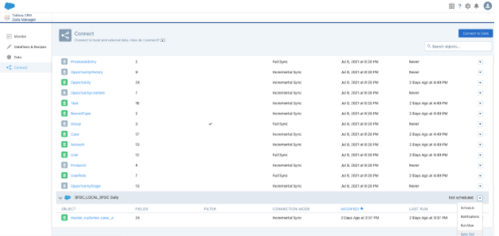
<br/><br/>  


### Now we will configure the connection to Snowflake.

Click on `Connect to Data` from top → `Output Connections` → Select `+` → Select `Snowflake Output Connector`.
Enter the Snowflake connection information.

- Connection Name - Snowflake Output
- Developer Name - SNOW_Dev
- Description - VHOL
- Schema - SHIPPING
- Password - TCRMSNOW123 (or the password you entered in Snowflake)
- Role - CRM\_ANALYST_ROLE
- Warehouse - CRM_WH
- Username - CRM_ANALYST
- Account - \<Your Snowflake account name - see note below\>
- Database - CRM_DB

**NOTE:** The Snowflake account name can be found by looking at the URL in your browser tab logged into the Snowflake UI. Copy the characters after the https:// and before snowflakecomputing.com i.e. **https://abcd123.us-east-1.snowflakecomputing.com** the account name will be **abcd123.us-east-1**  

In some cases the region (us-east-1 or other region name) may not be present, in this case just copy the characters before snowflakecomputing.com i.e. **https://xyz1234.snowflakecomputing.com** the account name will be **xyz1234**  

Click `Save & Test`. If the details are correct there will be a successful message. Click `Continue` and close the Connection Source window.

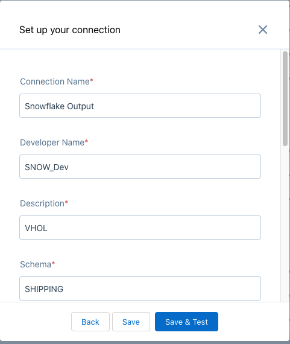
<br/><br/>  


### Lastly we will use Sync Out to sync the Salesforce data with Snowflake.

Scroll down to `SFDC_LOCAL_SFDC DAILY Connection` and from drop down select `Sync Out`.

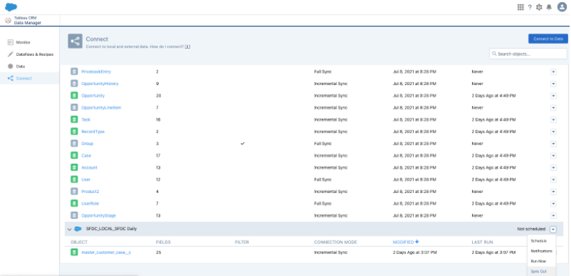
<br/><br/>  

Check `Enable Sync Out` and select the Snowflake Output connection. Click Save.

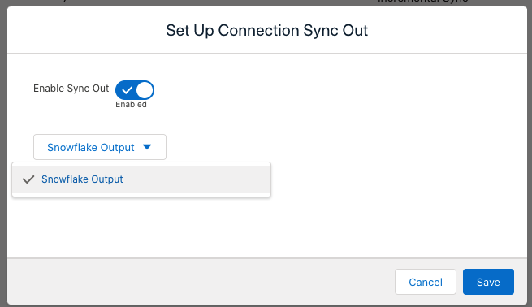
<br/><br/>

From the drop down select `Run Now`. You can go to the Monitor section to see when the sync is complete. 

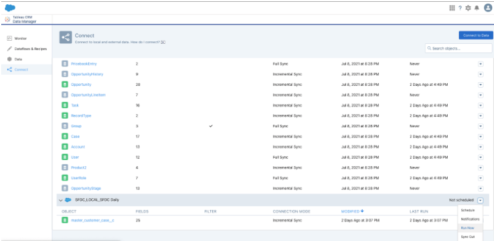
<br/><br/>

The data will now be successfully written to a table in Snowflake.

<!-- ------------------------ -->
## Enrich the Salesforce data in Snowflake
Duration: 3

Switch back to the Snowflake tab in your browser. Tableau CRM Sync Out automatically created a table in Snowflake with the Salesforce data. The table name in Snowflake will match the object name from Salesforce - `master_customer_case__c`.

Let's have a quick look at the table.


```sql
SELECT * FROM MASTER_CUSTOMER_CASE__C;
```  

All the selected fields should show up as table columns.

Next we can join the `customer case` data from Salesforce with the `shipping` data from the internal system that we already have in Snowflake, and also with the `weather` data from the external data provider. This allows us to get a full few of the customer's case data, the shipping data as well as external factors that may impact the customer's shipments.

We will create a `VIEW` to join the data sets together, leveraging the Snowflake views we created earlier. By doing this the view will always represent the latest data as Tableau CRM updates the Snowflake table with new information from Salesforce.

```sql
CREATE OR REPLACE VIEW CUSTOMER_CASE_SHIP_FULL_VW AS
    SELECT C.*, SW.* 
    FROM MASTER_CUSTOMER_CASE__C C, SHIP_WEATHER_HISTORY SW
    WHERE C.SHIPMENTID__C = SW.SHIPMENT_ID;
```

We can now have a quick look at the combined data.

```sql
SELECT * FROM CUSTOMER_CASE_SHIP_FULL_VW;
```
This provides a consolidated view of all the data sources.

<!-- ------------------------ -->
## Read live data from Snowflake in Salesforce
Duration: 10

Switch back to your Salesforce Tableau CRM Data Manager tab in your browser. 

Click on `Connect to Data` → Select `Live Connections` → Click on `Add Connection` →	Select `Snowflake Direct Connector`. 

Provide the details for the connection, similar to the Output Connection for Snowflake.

- Connection Name - Snowflake Live
- Developer Name - SNOW\_Dev_1
- Description - VHOL
- Schema - SHIPPING
- Password - TCRMSNOW123 (or the password you entered in Snowflake)
- Role - CRM\_ANALYST_ROLE
- Warehouse - CRM_WH
- Username - CRM_ANALYST
- Account - \<Your Snowflake account name - see note from Output Connection setup\>
- Database - CRM_DB

Click `Save & Create Dataset`. 

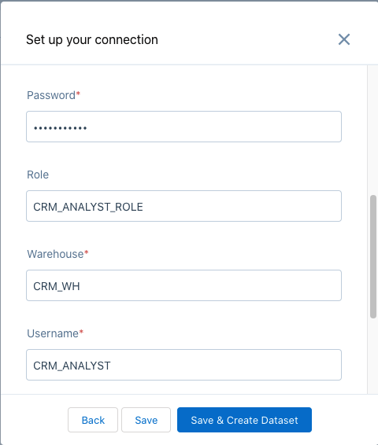
<br/><br/>

Select the dataset `CUSTOMER_CASE_SHIP_FULL_VW` from the list to enable that dataset and hit `Continue`. 

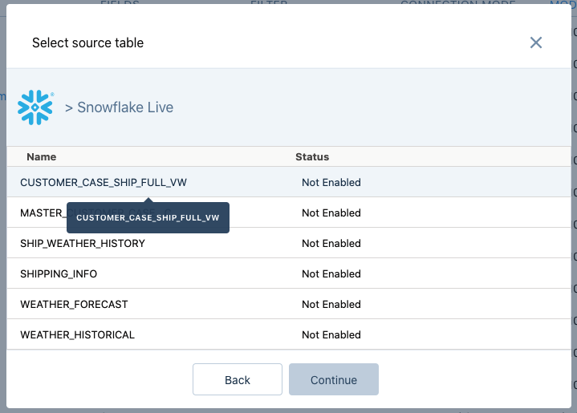
<br/><br/>

Go ahead and select the `My Private App` from the App drop down list and click on `Create Live Dataset`.


Go back to `Analytics Studio` and open the `My Private App` where you saved the dataset. 

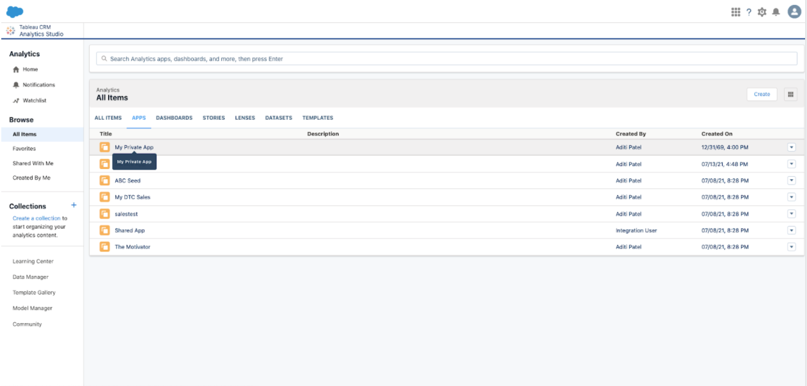
<br/><br/>

Click on the `CUSTOMER_CASE_SHIP_FULL_VW` dataset to start exploring.

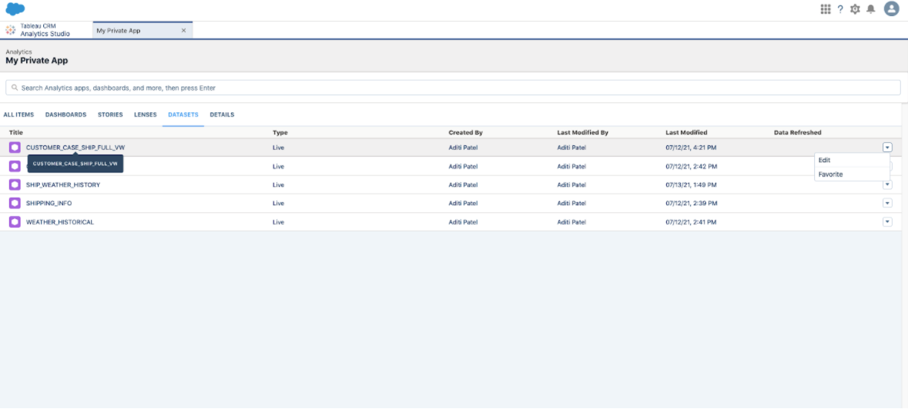
<br/><br/>

Click on `Query Mode` and then copy & paste the SQL query below to see the details for a specific customer.

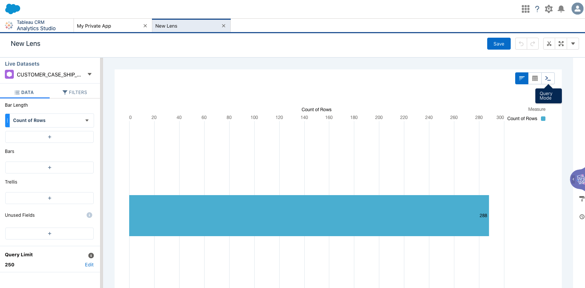
<br/><br/>

```sql
SELECT "CASE_ID__C" AS "CASE_ID__C", "ACCOUNT_NAME__C" AS "ACCOUNT_NAME__C", "STATUS__C" AS "STATUS__C", "SHIPPING_STATE" AS "SHIPPING_STATE", AVG("ESTIMATED_DAYS_TO_DESTINATION") AS "ETA Days", AVG("MAX_WIND") AS "Max Wind", AVG("MAX_TEMP") AS "Max Temp", AVG("MIN_TEMP") AS "Min Temp", AVG("PRECIPITATION") AS "Precipitation" FROM "CUSTOMER_CASE_SHIP_FULL_VW" WHERE "ACCOUNT_NAME__C" = 'See of San Francisco' GROUP BY "CASE_ID__C", "ACCOUNT_NAME__C", "STATUS__C", "SHIPPING_STATE" ORDER BY "CASE_ID__C" ASC, "ACCOUNT_NAME__C" ASC, "STATUS__C" ASC, "SHIPPING_STATE" ASC LIMIT 250
```

Click on `Run Query` 

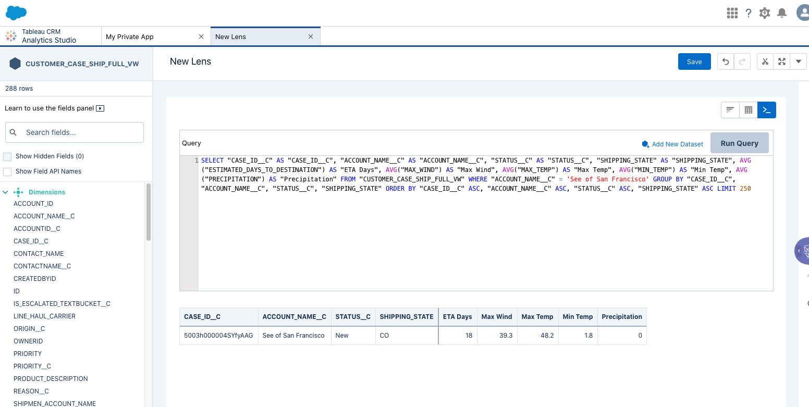
<br/><br/>


This provides the customer service agent with the shipping and weather information to enrich the service case data in Salesforce. In this case we can see that there were very low temperatures and high winds causing shipping delays in the state. 

The analytics information can be used in the Salesforce UI for simpler access by users as well.


