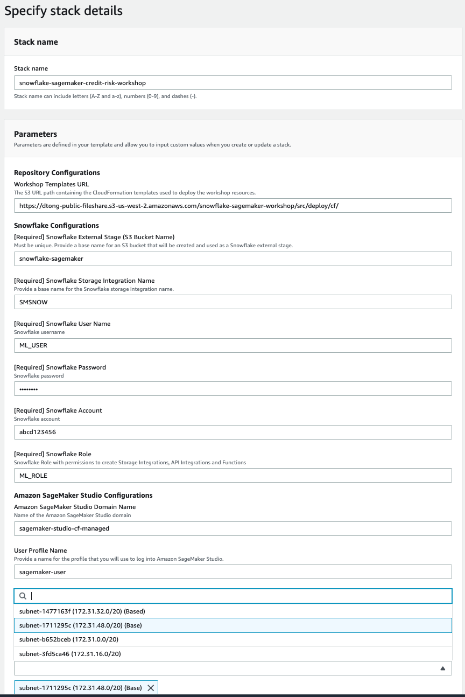
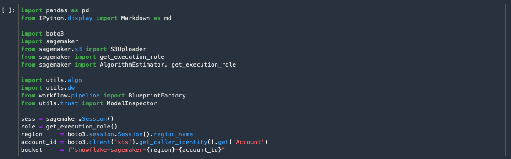

summary: This lab will walk you through how to accelerate Feature Engineering for Machine Learning Models with Snowflake and Amazon SageMaker.
id: vhol_snowflake_data_wrangler
categories: Getting Started
environments: web
status: Hidden
feedback link: https://github.com/Snowflake-Labs/sfguides/issues
tags: SageMaker, Data Wrangler, Feature Engineering, Data Marketplace, Machine Learning, Financial Services, Storage Integration
authors: andries.engelbrecht@snowflake.com

# Accelerate ML Feature Engineering with Snowflake and Amazon SageMaker Data Wrangler


<!-- ------------------------ -->
## Overview
Duration: 5


This guide will take you through the process of integrating SageMaker and Snowflake using Data Wrangler and SageMaker Studio. It will cover the powerful features in both Snowflake and Data Wrangler to enrich your data with SNowflake Data Marketplace data, and also how to quickly and effectively evaluate the enriched data’s potential to train ML models.


We will be exploring a financial service use of evaluating loan information to predict if a lender will default on a loan. The base data set was derived from loan data from the Lending Club.


We will first load this data set into Snowflake to simulate data collected from internal systems for analytical purposes. Using Snowflake’s Zero Copy Cloning feature will make this data available to the Data Science team, without duplicating the data and also protecting the production data from any data manipulation. The data will then be enriched with unemployment data from Knoema on the Snowflake Data Marketplace.


From within SageMaker Studio we will then retrieve the data using Data Wrangler, which we will use to do analysis of the data. Using Data Wrangler we will perform feature engineering and then analyze the data for ML model potential. The next step will be to add the enriched unemployment data and reevaluate the data. The data prep flow will then be used to provide data for model training. Finally we will deploy a scoring pipeline and write the data back to Snowflake.


### Prerequisites

- Familiarity with Snowflake, basic SQL knowledge and Snowflake objects
- Familiarity with AWS Service and Management Console
- Basic knowledge of Python, Jupyter notebook and Machine Learning

### What You'll Need During the Lab

To participate in the virtual hands-on lab, attendees need the following:

- A [Snowflake account](https://trial.snowflake.com/) **ACCOUNTADMIN** access
- An [AWS Account](https://aws.amazon.com/premiumsupport/knowledge-center/create-and-activate-aws-account/) with admin access
- **An AWS VPC and Subnet in your AWS where SageMaker studio can be deployed**

### What You'll Learn

- Snowflake data management features for machine learning
- How to leverage data in Snowflake's Data Marketplace
- How to connect SageMaker Data Wrangler and Studio to Snowflake
- The analysis and feature engineering capabilities in Data Wrangler
- Building and deploying SageMaker Pipelines
- Options to integrate the ML models and pipeline with Snowflake

### What You'll Build

- A Snowflake database for machine learning and data enrichment using the Data Marketplace
- SageMaker Studio environment with integration to Snowflake
- SageMaker Data Wrangler flow with Snowflake data
- SageMaker Pipeline to prep Snowflake data and perform inference


- - -


## Setting up Snowflake
Duration: 3


The first thing you will need to do is download the following .sql file that contains a series of SQL commands we will execute throughout this lab.


At this point, log into your Snowflake account and have a clear screen to start working with. If you have just created a free trial account, feel free to minimize or close and hint boxes that are looking to help guide you. These will not be needed for this lab and most of the hints will be covered throughout the remainder of this exercise.


To ingest our script in the Snowflake UI, navigate to the ellipsis button on the top right hand side of a "New Worksheet" and load our script.


The SQL script file should show up as text in a new worksheet.

It is also helpful to turn on code highlight in the worksheet. This will highlight the SQL command(s) that you will execute before "running" the command. Navigate to the ellipsis button on the top right hand side of a "New Worksheet" and click Turn on Code Highlight.


Each step throughout the Snowflake portion of the guide has an associated SQL command to perform the work we are looking to execute, and so feel free to step through each action running the code line by line as we walk through the lab.


First we will switch to the SECURITYADMIN role and create a role (ML\_ROLE), as well as a user (ML\_USER) that we will use in the lab.


```
USE ROLE SECURITYADMIN;

CREATE OR REPLACE ROLE ML_ROLE COMMENT='ML Role';

GRANT ROLE ML_ROLE TO ROLE SYSADMIN;


CREATE OR REPLACE USER ML_USER PASSWORD='AWSSF123'

        DEFAULT_ROLE=ML_ROLE

        DEFAULT_WAREHOUSE=ML_WH

        DEFAULT_NAMESPACE=ML_WORKSHOP.PUBLIC

        COMMENT='ML User';

GRANT ROLE ML_ROLE TO USER ML_USER;
```


Please note the default password assigned for the user. If you choose to change it make sure to record the password as you will need to provide it later in the lab for the integration with Data Wrangler.


Next we will grant privileges to the ML\_ROLE to allow it to create storage integrations that are needed for Data Wrangler. We will also grant privileges to create databases in Snowflake and also import shares. This will allow the roles to access and import Snowflake Data Marketplace data, as well as create the Snowflake database that will be used for machine learning. For this we need to use the ACCOUNTADMIN role.


```
USE ROLE ACCOUNTADMIN;

GRANT CREATE INTEGRATION ON ACCOUNT TO ROLE ML_ROLE;

GRANT IMPORT SHARE ON ACCOUNT TO ML_ROLE;

GRANT CREATE DATABASE ON ACCOUNT TO ROLE ML_ROLE;
```


<!-- ------------------------ -->
## Configure Amazon SageMaker Studio and Snowflake Storage Integration with AWS
Duration: 2


To save some time we will configure the SageMaker environment and the Snowflake Storage Integration that will be used by Data Wrangler by using a CloudFormation Template. Open another tab in your browser and log into your AWS console.

Next we will go to a Github repo by clicking the link below.


Click on the launch template button in the **Launch Template** column

The top button will deploy SageMaker Studio in the AWS region.

The bottom button can be used if you already have SageMaker Studio deployed in the AWS region.

We will use the top button to deploy SageMaker Studio in this example.

Select the **AWS region** where you want to deploy the CloudFormation. **It is recommended to use the same region as where you have your Snowflake account**. For example we will use Oregon(us-west-2).


On the Create Stack page select **Next**


On the next page you will specify your stack details. Please pay close attention as these parameters are used to create various objects.


- **Stack name** \- use the default **snowflake-sagemaker-credit-risk-workshop**
- **Repository Configurations** - Workshop Templates URL
  - Leave the URL as is
- **Snowflake Configurations**:
  - Snowflake External Stage S3 Bucket Name - This is a base name to which the region and account id will be added. Must be universally unique.
  - Snowflake Storage Integration Name - Base name for what the storage integration will be called. Region and account ID will be added. Leave as is or if changed - only use CAPITAL LETTER, numbers and underscores
  - Snowflake User Name - ML\_USER
  - Snowflake Password - The password you assigned to the ML\_USER in the previous step - Required to enter.
  - Snowflake Account - the Snowflake account name -**see note below**
  - Snowflake Role - ML\_ROLE
* **SageMaker Studio Configurations**
  - SageMaker Studio Domain Name
  - SageMaker Studio User Profile Name
* **VPC Configurations**
  - VPC - Choose existing VPC
  - VPC Subnet - Choose existing VPC Subnet in availability zone supported by SageMaker


Positive
: The Snowflake account name can be found by looking at the URL in your browser tab logged into the Snowflake UI. Copy the characters after the https:// and before snowflakecomputing.com i.e. **https://abcd123.us-east-1.snowflakecomputing.com** the account name will be **abcd123.us-east-1**

In some cases the region (us-east-1 or other region name) may not be present, in this case just copy the characters before snowflakecomputing.com i.e. **https://xyz1234.snowflakecomputing.com** the account name will be **xyz1234**

- - -





Click **Next**


On the next page - **Configure stack options** - click **Next** (no need to change anything)


On the Review page - 

- Review the parameters
- Check the **I acknowledge that AWS CloudFormation might create IAM resources with custom names.** Box
- Check the **I acknowledge that AWS CloudFormation might require the following capability: CAPABILITY\_AUTO\_EXPAND** Box
- Click on **Create Stack**


It may take a few minutes for the stack to be created and we will use the time to continue with Snowflake.


- - -


<!-- ------------------------ -->
## Load data in Snowflake and access the Marketplace
Duration: 5


Next we will create a virtual warehouse that we will use to compute with the **SYSADMIN** role, and then grant all privileges to the **ML\_ROLE**.


```
USE ROLE SYSADMIN;

--Create Warehouse for AI/ML work

CREATE OR REPLACE WAREHOUSE ML_WH

  WITH WAREHOUSE_SIZE = 'XSMALL'

  AUTO_SUSPEND = 120

  AUTO_RESUME = true

  INITIALLY_SUSPENDED = TRUE;

GRANT ALL ON WAREHOUSE ML_WH TO ROLE ML_ROLE;
```


We are now ready to start creating databases and loading data.

First we will switch to the ML\_ROLE and use the ML\_WH warehouse for compute.


```
USE ROLE ML_ROLE;

USE WAREHOUSE ML_WH;
```


Next we will create a database and table that will represent the aggregation of data from internal systems.


```
CREATE DATABASE IF NOT EXISTS LOANS_V2;


CREATE OR REPLACE TABLE LOAN_DATA (

    LOAN_ID NUMBER(38,0),

    LOAN_AMNT NUMBER(38,0),

    FUNDED_AMNT NUMBER(38,0),

    TERM VARCHAR(16777216),

    INT_RATE VARCHAR(16777216),

    INSTALLMENT FLOAT,

    GRADE VARCHAR(16777216),

    SUB_GRADE VARCHAR(16777216),

    EMP_TITLE VARCHAR(16777216),

    EMP_LENGTH VARCHAR(16777216),

    HOME_OWNERSHIP VARCHAR(16777216),

    ANNUAL_INC NUMBER(38,0),

    VERIFICATION_STATUS VARCHAR(16777216),

    PYMNT_PLAN VARCHAR(16777216),

    URL VARCHAR(16777216),

    DESCRIPTION VARCHAR(16777216),

    PURPOSE VARCHAR(16777216),

    TITLE VARCHAR(16777216),

    ZIP_SCODE VARCHAR(16777216),

    ADDR_STATE VARCHAR(16777216),

    DTI FLOAT,

    DELINQ_2YRS NUMBER(38,0),

    EARLIEST_CR_LINE DATE,

    INQ_LAST_6MON NUMBER(38,0),

    MNTHS_SINCE_LAST_DELINQ VARCHAR(16777216),

    MNTHS_SINCE_LAST_RECORD VARCHAR(16777216),

    OPEN_ACC NUMBER(38,0),

    PUB_REC NUMBER(38,0),

    REVOL_BAL NUMBER(38,0),

    REVOL_UTIL FLOAT,

    TOTAL_ACC NUMBER(38,0),

    INITIAL_LIST_STATUS VARCHAR(16777216),

    MTHS_SINCE_LAST_MAJOR_DEROG VARCHAR(16777216),

    POLICY_CODE NUMBER(38,0),

    LOAN_DEFAULT NUMBER(38,0),

    ISSUE_MONTH NUMBER(2,0),

    ISSUE_YEAR NUMBER(4,0)

);
```


Next we will create an external stage to load the lab data into the table. This is done from a public S3 bucket to simplify the workshop. Typically an external stage will be using various secure integrations as described in this [link](https://docs.snowflake.com/en/user-guide/data-load-s3-config.html).


```
CREATE OR REPLACE STAGE LOAN_DATA

  url='s3://snowflake-corp-se-workshop/VHOL_Snowflake_Data_Wrangler/V2/data/';
```


We can now use the COPY command to load the data into Snowflake.

```
COPY INTO LOAN_DATA FROM @LOAN_DATA/loan_data.csv

    FILE_FORMAT = (TYPE = 'CSV' SKIP_HEADER = 1);
```


This data represents aggregation from various internal systems for lender information and loans. We can have a quick look and see the various attributes in it.


```
SELECT * FROM LOAN_DATA LIMIT 100;
```


### Snowflake Data Marketplace data


We can now look at additional data in the Snowflake Marketplace that can be helpful for improving ML models. It may be good to look at employment data in the region when analyzing loan defaults. Let’s look in the Snowflake Data Marketplace and see what external data is available from the data providers.


To be able to add Marketplace data we will use the new Snowflake UI. Click on the **Preview App** button on the top right hand of the Snowflake console, next to the Partner Connect and Help buttons.


Once you click on the Preview App button a new browser tab will open with the new preview Snowflake UI. On the top left hand corner click on your username and then hover over the **Switch Role** menu. Scroll and select the **ML\_ROLE** from the list of roles.


Now click on the **Data** menu bar on the left side. Then select **Marketplace**.


Once in the Marketplace type **Unemployment** in the top **Search Data Marketplace** and hit Enter/Return. This will provide a list of Data Providers with employment data.


Click on the tile with **Knoema - Labor Data Atlas.**

This will show what data is available from the listing. We will notice indicators such as employment and unemployment rates.


Next click on the **Get Data** button. This will provide a pop up window in which you can create a database in your account that will provide the data from the data provider.

Change the name of the database to **KNOEMA\_LABOR\_DATA\_ATLAS** and then click the **Get Data** button.


When the confirmation is provided click on done and then you can close the browser tab with the Preview App.


Data from the Snowflake Data Marketplace does not require any additional work and will show up as a database in your account. A further benefit is that the data will automatically update as soon as the data provider does any updates to the data on their account.


Let’s start using the marketplace data. First we will create a view to pivot the data for the different employment metrics to columns for easier consumption.


```
USE LOANS_V2.PUBLIC;


CREATE OR REPLACE VIEW KNOEMA_EMPLOYMENT_DATA AS (

SELECT *

FROM (SELECT "Measure Name" MeasureName, "Date", "RegionId" State, AVG("Value") Value FROM "KNOEMA_LABOR_DATA_ATLAS"."LABOR"."BLSLA" WHERE "RegionId" is not null and "Date" >= '2018-01-01' AND "Date" < '2018-12-31' GROUP BY "RegionId", "Measure Name", "Date")

        PIVOT(AVG(Value) FOR MeasureName IN ('civilian noninstitutional population', 'employment', 'employment-population ratio', 'labor force', 'labor force participation rate', 'unemployment', 'unemployment rate'))

         AS p (Date, State, civilian_noninstitutional_population, employment, employment_population_ratio, labor_force, labor_force_participation_rate, unemployment, unemployment_rate)

);
```


We will now create a new table to join the loan data with the unemployment data using the geography and time periods. This will provide us with unemployment data in the region associated with the specific loan.


```
CREATE OR REPLACE TABLE UNEMPLOYMENT_DATA AS

        SELECT l.LOAN_ID, e.CIVILIAN_NONINSTITUTIONAL_POPULATION, e.EMPLOYMENT, e.EMPLOYMENT_POPULATION_RATIO, e.LABOR_FORCE,            e.LABOR_FORCE_PARTICIPATION_RATE, e.UNEMPLOYMENT, e.UNEMPLOYMENT_RATE

        FROM LOAN_DATA l LEFT JOIN KNOEMA_EMPLOYMENT_DATA e

            on l.ADDR_STATE = right(e.state,2) and l.issue_month = month(e.date) and l.issue_year = year(e.date);
```


We can quickly look at the metrics by running a simple query.


```
SELECT * FROM UNEMPLOYMENT_DATA LIMIT 100;
```


### Database for Machine Learning

The last step is to create a database that can be used by the data science team. This will allow them full access to the data without impacting any of the other analyst or production teams. Snowflake provides a very unique feature called [Zero Copy Cloning](https://www.youtube.com/watch?v%3DyQIMmXg7Seg) that will create a new copy of the data by **only making a copy of the metadata of the objects**. This drastically speeds up creation of copies and also drastically reduces the storage space needed for data copies.

This feature can be very handy for Machine Learning as it will allow for feature engineering in Snowflake and also the ability to save copies of the data used for the training of ML models for future reference.


In this lab we will just clone table objects, though complete databases can also be cloned. First we will create a database and schema to clone the tables objects to.


```
CREATE OR REPLACE DATABASE ML_LENDER_DATA;

CREATE OR REPLACE SCHEMA ML_LENDER_DATA.ML_DATA;

USE ML_LENDER_DATA.ML_DATA;
```

Next we will clone the loan\_data and unemployment\_data tables to the new database.


```
CREATE TABLE LOAN_DATA_ML CLONE LOANS_V2.PUBLIC.LOAN_DATA;

CREATE TABLE UNEMPLOYMENT_DATA CLONE LOANS_V2.PUBLIC.UNEMPLOYMENT_DATA;
```


We will also create a table to allow us to write the ML Model predictions back in the future.


```
CREATE OR REPLACE TABLE ML_RESULTS (LABEL NUMBER, PREDICTIONS NUMBER, P_DEFAULT FLOAT);
```


Lastly we will get the storage integration information that was created by the CloudFormation template.


```
SHOW INTEGRATIONS;
```


Make sure to note the name of the storage integration that was created as it will be used with Data Wrangler configuration.

Positive
: We can also get the storage integration name from the CloudFormation stack. Click on the NESTED stack with a name like snowflake-sagemaker-credit-risk-workshop-StorageIntegrationStack and then the Outputs tab in the CloudFormation browser tab.
You can also find Snowflake Secret ARN in the Output tab.


- - -
<!-- ------------------------ -->
## Data Wrangler - Data Prep &amp; Feature Analysis
Duration: 30


#### Let’s go to SageMaker Studio.

Click on this link ([https://console.aws.amazon.com/sagemaker/home](https://console.aws.amazon.com/sagemaker/home)) and it will open a new browser tab with the SageMaker Console.

Click on the **Amazon SageMaker Studio** menu on the left hand side.

Next to the**User name - sagemaker-user** you will click on the link to**Open Studio** to open SageMaker Studio


This will open a new browser tab with SageMaker Studio. It may take a minute or two to create the environment.


#### Next we can clone the Git repository that includes all the files we need for the lab in SageMaker Studio.

On the Left side menu click on the Git repository icon and then the Clone a Repository button.


You will then enter copy the Git URL below for the repository in the popup window and then click CLONE

[https://github.com/dylan-tong-aws/snowflake-sagemaker-workshops](https://github.com/dylan-tong-aws/snowflake-sagemaker-workshops)


The Studio environment will then switch to the folder browser.

Navigate to the /snowflake-sagemaker-workshops/loan-default/notebooks folder by double clicking each folder in the path.


Open the snowflake-loan-default-workshop.ipnyb notebook by double clicking on it.

A window will pop up to select the Kernel you want to use. Select the Python 3 (snowflake-workshop/) kernel and click Select.


Give the kernel a little time to startup.


The notebook is very well documented with the steps needed for the workshop.

You can execute the code sections by selecting them and hitting the **run button** at the top or **shift+return/enter**.





Once you have run the cell you will note a number in the square brackets next to it.


Next we will provide access to the AWS Secrets Manager. Execute the next code block.


#### Data Wrangler

We will now create a Data Wrangler flow.


Create a new Data Wrangler flow by selecting it from the top **File Menu**

File&gt;New&gt;Data Wrangler Flow


This can take a few minutes to start an instance.


##### Connect to Snowflake and Add Data

A new tab will open in Studio with untitled.flow.

Click on Add data source and Select Snowflake


You can either use the username and password that was created in Snowflake earlier or the AWS Secret that was created in the CloudFormation template to connect to Snowflake. You can use AWS Secret Manager Console ([https://console.aws.amazon.com/secretsmanager/home](https://console.aws.amazon.com/secretsmanager/home) ) to get the secret **ARN**.


Use the Snowflake account name from Step 3 if you don’t use the AWS Secrets Manager

The Snowflake Storage Integration name from Step 4 will be used - SMSNOW\_\<region>\_\<accountid>\_STORAGE\_INTEGRATION</accountid></region>


Provide a name for the connection.


You can now navigate the Snowflake data by looking at the Snowflake objects on the left hand side or use the SQL window to run queries.


When using the SQL window you can set the context of the queries, similar to Snowflake. Select:

Data Warehouse - ML\_WH

Database - ML\_LENDER\_DATA

Schema - ML\_DATA


To see the LOAN\_DATA in Data Wrangler execute the following SQL and click Run

```
SELECT * FROM ML_LENDER_DATA.ML_DATA.LOAN_DATA_ML
```

You can see the Query Results with the data.


We can refine the features by only selecting columns that will likely be good features.

We will also Snowflake to generate a repeatable sampling of the table’s data to split the data in a train/test data set.


Execute the following SQL to acquire a filtered list of potential features.


```
SELECT

LOAN_ID, LOAN_AMNT, FUNDED_AMNT,

TERM, INT_RATE, INSTALLMENT,

GRADE, SUB_GRADE, EMP_LENGTH,

HOME_OWNERSHIP, ANNUAL_INC, VERIFICATION_STATUS,

PYMNT_PLAN, PURPOSE, ZIP_SCODE,

DTI, DELINQ_2YRS, EARLIEST_CR_LINE,

INQ_LAST_6MON, MNTHS_SINCE_LAST_DELINQ,

MNTHS_SINCE_LAST_RECORD, OPEN_ACC,

PUB_REC, REVOL_BAL, REVOL_UTIL,

TOTAL_ACC, INITIAL_LIST_STATUS,

MTHS_SINCE_LAST_MAJOR_DEROG,

POLICY_CODE, LOAN_DEFAULT, ISSUE_MONTH

FROM ML_LENDER_DATA.ML_DATA.LOAN_DATA_ML

SAMPLE BLOCK (80) REPEATABLE(100)
```

Click **Run** and then click the **Import** button on the top right.


Enter a name for the Dataset - loan\_data

Then click**Add**


##### Profile your data

Profile the data by Clicking the **+ sign** next to the Data types block

Select**Add Analysis**


In the Analysis select:

Type - Histogram

X axis - LOAN\_DEFAULT


Then click **Preview** to get an analysis of the skew.


#### Apply Feature Transformations

Next we will use Data Wrangler to perform some feature transformations.

In the Analysis window click**Back to data flow** at the top.


Click on the**+** and select **Add Transform** by the Data types box.


Click on **+ Add Step** - To add a transform step


First we will fix the **INT\_RATE** column from a string with a % sign to a numeric data type.

- Click on Search and edit
- Select Input Column as INT\_RATE
- Enter % in the Pattern field
- In the **Replacement string** <span class="c13">*type space and then delete it* to have % replaced with an empty string
- Click Preview
- Click Add


To add additional steps click + Add Step each time


- Next select Parse column as type
- Select INT\_RATE column
- From: String
- To: Float
- Click Preview
- Click Add


Next we will address the VERIFICATION\_STATUS column, which has various string values to indicate boolean values.


Select **Custom Transform**then **Python(Spark)** and copy the following Python code in the code box

```
from pyspark.sql.functions import udf
from pyspark.sql.types import LongType


def categories(status) :
  if not status :
    return None
  elif status == "not verified" :
    return 0
  elif status == "VERIFIED - income":
    return 1
  elif status == "VERIFIED - income source":
    return 1
  else :
    return None
bucket_udf = udf(categories, LongType())

df = df.withColumn("VERIFIED", bucket_udf("VERIFICATION_STATUS"))
```

Select Preview and then Add


This code creates a new column VERIFIED with boolean values.


Now we can drop the original VERIFICATION\_STATUS column.

- Select Manage columns
- Transform - select Drop Column
- Column to Drop - select VERIFICATION\_STATUS
- Select Preview and then Add


Finally we will drop the LOAN\_ID column using the steps above.


Click onBack to data flow. You should see the five transform steps at the tail of your data prep flow.


#### Data Validation

Next we will check for **Target Leakage**.

Target leakage occurs when you accidently train a model with features that are not available in production. As a consequence, you end up with a deceptively effective model in development that causes problems in production. You can mitigate production issues by performing target leakage analysis.


Click the + sign next to the 5 Transform Steps and select Add analysis.


In the Analysis select:

- Analysis type - Target Leakage
- Max Features - 30
- Problem type - Classification
- Target - LOAN\_DEFAULT


Select Preview


The report indicates that there is no target leakage risk. It does detect some potentially redundant features.


**Next we will create a Bias Report**

Our data does not have any obvious sensitive attributes like gender and race. However, it does contain zip codes. It's possible that we have a flawed dataset with an abnormal number of loan defaults in minority communities. This might not represent the actual distribution. Regardless, this situation could create a model that is biased against minorities resulting in legal risk.


In the Analysis window select:

- Analysis Type - Bias Report
- SELECT the column your model predicts (target): LOAN\_DEFAULT
- Is your predicted column a value or threshold?: Value
- Predicted value(s): 0;1
- SELECT the column to analyze for bias: ZIPS\_CODE
- Is your column a value or threshold?: Value
- Column value(s) to analyze for bias: 200xx;207xx;206xx;900xx;100xx;941xx


Click **Check for bias**


The report does not reveal any salient data bias issues.


#### Prototype Model

**Create a Quick Model Report**


Amazon Data Wrangler provides aQuick Model report which can serve as a prototyping mechanism. The report will sample your dataset, process your flow and generates a Random Forest Model. The report provides model and feature importance scores to help you assess:


- What features are most impactful?
- Does your data have enough predictive signals to produce a practical model?
- Are your changes to your dataset leading to improvements?


Navigate to the Analysis panel from the tail end of your flow—as you did in the previous section.

Configure your report:

- Analysis type: Quick Model
- Analysis name: Quick Test
- Label: LOAN\_DEFAULT


It will take about 5 minutes to generate a report like the following:


Take note of the feature importance ranking in the bar chart. This gives you an approximation of which features have strong predictive signals.


<!-- ------------------------ -->
## Iterate, Experiment and Improve
Duration: 10


We will now add a new data source to your existing flow.

First clickBack to data flow

SELECT the Import sub tab and click on the Snowflake icon.


Run the following query to extract the unemployment rate data that you obtained from the Snowflake Data Marketplace.


```
SELECT LOAN_ID, UNEMPLOYMENT_RATE

FROM ML_LENDER_DATA.ML_DATA.UNEMPLOYMENT_DATA
```


Click Run and then the Import button

Name the datasetunemployment\_data

Click Add


Next, you're going to merge the two datasets. There are many ways to do this. You could have performed this entirely using Snowflake. In this lab, you'll learn how to perform this merge through DataWrangler.


First delete the last transformation from the original flow, so that we have **LOAN\_ID** available.

Click on the Steps and then on the ellipsis next to step 5 and select **Delete Step**


Confirm the Delete


Next we will merge the data sets using a join operator

Click on the end of the original flow and select the Join operator.

SELECT the other flow.

Click on Configure

SELECT Left Outer as the Join Type.

SELECT LOAN\_ID for both the Left and Right join keys.


SELECT the other flow.


Click on Configure


SELECT Left Outer as the Join Type.

SELECT LOAN\_ID for both the Left and Right join keys.


Click **Apply**


Then click **Add** in the top right corner


Select the Join Node and Add Transform


Drop the columns, LOAN\_ID\_0 and LOAN\_ID\_1 using the same transformation steps as before.

Manage Columns&gt;Drop Column&gt;Loan\_ID\_0

Manage Columns&gt;Drop Column&gt;Loan\_ID\_1


Re-Validate the Dataset

You should re-validate your dataset since it has been modified.

Add analysis to the Join Operator similar to previous steps.

- Analysis type - Target Leakage
- Max Features - 30
- Problem type - Classification
- Target - LOAN\_DEFAULT


The Target Leakage report calculates the correlation between your features and the target variable. In effect, it provides you with an idea of how likely your new feature will improve your model. The report should present the new feature, UNEMPLOYMENT\_RATE, as the feature with the highest predictive potential.


Evaluate your Dataset Modifications

Create a new Quick Model report to assess the impact of your modifications.


The results should be similar to the following:

- Analysis type - Quick Model
- Label - LOAN\_DEFAULT


A couple of key takeaways:

* UNEMPLOYMENT\_RATE is ranked as the most important feature.
* The F1 score increased substantially.

This tells us that we are likely heading in the right direction. We added a feature that generated notable improvements to the "quick model" and the new feature had the greatest impact.


<!-- ------------------------ -->
## Generate the Dataset and Train your Model
Duration: 10


We are now ready to fully train and tune a model. First, we need to generate our datasets by executing the data flow that we've created.


**Export your Data Flow**

DataWrangler supports multiple ways to export the flow for execution.

In this lab, you will select the option that generates a notebook that can be run to execute the flow as a SageMaker Processing job. This is the simplest option.


Click on **Back to data flow**

Select the **Export** tab


Select thelast step in the flow and the lastDrop Column transformation


Then click Export Step on the top right


Select**Save to S3**


This will generate a new notebook tab. Select the new notebook.


- Follow the steps outlined in thegenerated notebook.
- Run the cells and wait for the processing job to complete.
- COPY the output S3 URI of the processed dataset.


This can take a few minutes


The S3 URI will look similar to: s3://(YOUR\_BUCKET)/export-flow-23-23-17-34-6a8a80ec/output/data-wrangler-flow-processing-23-23-17-34-6a8a80ec.


COPY the S3 URI to the PREP\_DATA\_S3 variable in your initial workshop notebook


TIP: You can monitor the processing jobs in the SageMaker Console


Train your Model


Subscribe to AutoGluon in the AWS Marketplace


Next, you are going to subscribe to the AutoGluon Marketplace algorithm. This provides your account access to a SageMaker compatible container for running AutoGluon. This Marketplace algorithm is managed by AWS and doesn't have additional software costs. Marketplace algorithms are similar to SageMaker built-in algorithms. Once subscribed, you can run the algorithm to train and serve models with "low-to-no-code".


Follow these steps to subscribe to the AWS Marketplace AutoGluon algorithm:

- Click this[URL](https://aws.amazon.com/marketplace/pp/Amazon-Web-Services-AutoGluon-Tabular/prodview-n4zf5pmjt7ism) to navigate to the AutoGluon product page.
- SELECT the orange "Continue to Subscribe" button.
- Run the helper function below to identify the AWS resource ID (ARN) of your AutoGluon Marketplace algorithm.


Next, we'll configure our algorithm for remote training.

More details are provided in the notebook description.

Execute the next code cell to set the parameters for the remote training job.


The following cell will launch the remote training job. This will take a few minutes.


You can monitor the training job in the SageMaker Console


<!-- ------------------------ -->
## Deploy your Model
Duration: 15


You can serve your predictions in a couple of ways. You could deploy the model as a real-time hosted endpoint on SageMaker and integrate it with Snowflake as an External Function. This will enable you to query your predictions in real-time and minimize data staleness.


Alternatively, you can pre-calculate your predictions as a transient batch process. In the following section, you will use Batch Transform to do just that. When your use case allows you to pre-calculate predictions, Batch Transform is a good option.


In the following sections we are going to deploy our model as a batch inference pipeline. The pipeline is designed to consume data from Snowflake, process it using our DataWrangler flow and then pre-calculate predictions using our trained model and Batch Transform.


**Modify your Data Preparation flow for Inference**


First we will make a copy of our flow file.

- Right click on theuntitled.flowfile and selectDuplicate


- Right click on the duplicate copy -untitled-Copy1.flowand select Rename
- Use **inference\_flow\_loan.flow** as the new name


Positive
: **TIP:** Click on the Folder icon on the left hand side of the screen to see the files


Set the INFERENCE\_FLOW\_NAME to the new flow file in your workshop notebook.


**Next we will open the new flow file by double clicking on it**.

We can now change the data source for the flow:

- Click on theData Flowtab at the top
- Click on the + next to the Snowflake:loan\_data source and select Edit Query
- 
- Click on the Snowflake Connection button
- Replace the current SQL query with a new query that will retrieve the 20% sample data that we didn’t use for training.

```
SELECT

  L1.LOAN_ID,  L1.LOAN_AMNT,   L1.FUNDED_AMNT,

  L1.TERM,   L1.INT_RATE,   L1.INSTALLMENT,

  L1.GRADE,   L1.SUB_GRADE,   L1.EMP_LENGTH,

  L1.HOME_OWNERSHIP,   L1.ANNUAL_INC,

  L1.VERIFICATION_STATUS,   L1.PYMNT_PLAN,

  L1.PURPOSE,   L1.ZIP_SCODE,   L1.DTI,

  L1.DELINQ_2YRS,   L1.EARLIEST_CR_LINE,

  L1.INQ_LAST_6MON,   L1.MNTHS_SINCE_LAST_DELINQ,

  L1.MNTHS_SINCE_LAST_RECORD,   L1.OPEN_ACC,

  L1.PUB_REC,   L1.REVOL_BAL,   L1.REVOL_UTIL,

  L1.TOTAL_ACC,   L1.INITIAL_LIST_STATUS,

  L1.MTHS_SINCE_LAST_MAJOR_DEROG,   L1.POLICY_CODE,

  L1.LOAN_DEFAULT,   L1.ISSUE_MONTH

FROM ML_LENDER_DATA.ML_DATA.LOAN_DATA_ML AS L1

 LEFT OUTER JOIN

 (SELECT * FROM ML_LENDER_DATA.ML_DATA.LOAN_DATA_ML sample block (80) REPEATABLE(100)) AS L2

 ON L1.LOAN_ID = L2.LOAN_ID

WHERE L2.LOAN_ID IS NULL
```

- ClickRunand then theApplybutton on the top right
- Name the dataset loan\_inference


#### Re-export and re-factor your flow as a Pipeline

First select theExport tab at the top.

As previously select the last step in the flow and bottom Drop Column transform.


Then click Export Step on the top right and select Pipeline


This will generate a new notebook - inference\_flow\_loan.ipynb


Scroll down in the notebook till you find the cell with output\_name in it.

COPY the node ID form this cell.


In practice, you will need to refactor the exported script. This has been done for you, so all you need to do is locate the export node-id. Each step in your data flow is a unique node and the export script is dependent on the node that you select for export.


#### Go back to your workshop notebook - snowflake-loan-default-workshop.ipynb


COPY the node ID to the FLOW\_NODE\_ID cell and run the cell


You can run the next cell if you like to see the refactored script.


Next you will run your batch scoring pipeline by executing the next cell.


This will process the data prep steps and then run batch inference using the model that was previously trained. These steps will take some time to complete.


You can monitor the pipeline in SageMaker Studio.

- SELECT the SageMaker resources icon on the left hand menu bar
- 
- SELECT Pipelines from the drop down menu
- 
- Right click on your pipeline and select**Open pipeline details**
- 
- This will open a pipeline tab. Right click on the status of the pipeline and select**Open execution details**
- 
- This opens a tab with the pipeline steps. You can click on each step to get more information.
- 


<!-- ------------------------ -->
## Evaluate Model Performance and Write Back to Snowflake
Duration: 5


Since the data set is small enough we can load it to a local pandas dataframe and review the results.


The next cell will load the data set and provide an output of the results.


We can use some utilities to evaluate how well the model performed using the test data set.

Execute next 2 cells


The last cell will provide an interactive chart to see how well the model performed based on the threshold we set for the prediction.


#### Writeback to Snowflake

Typically for large batch transforms we will use Snowflake’s automated capability to read data from S3 called[Snowpipe](https://docs.snowflake.com/en/user-guide/data-load-snowpipe-intro.html), or alternatively the [COPY](https://docs.snowflake.com/en/sql-reference/sql/copy-into-table.html) command to perform bulk loads. Since this data set is in a dataframe we can use the Python connector to write it directly back to Snowflake.


First we will use the AWS Secret we create with the CloudFormation template. Go to the [Secrets Manager Console](https://console.aws.amazon.com/secretsmanager/home). Select the Snowflake Secret and copy the Secret Name i.e. **SnowflakeSecret-P4qyGUyk67hj** in the cell below.


The next cell creates a function to retrieve AWS Secrets for use in the notebook. Run the cell.


The next cell will establish a connection with Snowflake using the secret’s information.


The last cell will write the dataframe data into a Snowflake table.


Positive
: TIP: The same connection can be used to read data from Snowflake as well as issue Snowflake commands to help process data.


Congratulations! you have completed the lab.


- - -


<!-- ------------------------ -->
## Conclusions &amp; Next Steps
Duration: 5


In this lab we build an example of how you can enrich your internal data with Snowflake Data marketplace data to improve the performance of your Machine Learning Models. We also covered how you can integrate Data Wrangler with Snowflake to gain access to the data and drive pipelines for your ML models.


Additionally we covered how you can use SageMaker Studio and deploy CloudFormation Templates to create prebuild kernels with the Snowflake Python Connector prebuild. Also how to deploy the Snowflake Storage Integrations with a CloudFormation template and using AWS Secrets Manager to provide more secure connections with Snowflake.


Related Resources

- [Snowflake Data Marketplace](https://docs.snowflake.com/en/user-guide/data-marketplace.html)
- [SageMaker Data Wrangler](https://aws.amazon.com/sagemaker/data-wrangler/)
- [SageMaker Studio](https://aws.amazon.com/sagemaker/studio/)

