summary: This lab will walk you through how to accelerate Feature Engineering for Machine Learning Models with Snowflake and Amazon SageMaker. 
id: vhol_snowflake_data_wrangler 
categories: Getting Started
environments: web
status: Hidden 
feedback link: https://github.com/Snowflake-Labs/sfguides/issues
tags: SageMaker, Data Wrangler, Feature Engineering, Data Marketplace, Machine Learning, Financial Services, Storage Integration  
authors: andries.engelbrecht@snowflake.com

# Accelerate Feature Engineering for Machine Learning Models with Snowflake and Amazon SageMaker Data Wrangler for a Data Centric Approach to ML

<span class="c0"></span>

<span class="c0"></span>

## <span class="c10">Overview</span>

<span class="c22 c13">Duration: 5</span>

<span class="c1"></span>

<span class="c3">This guide will take you through the process of integrating SageMaker and Snowflake using Data Wrangler and SageMaker Studio. It will cover the powerful features in both Snowflake and Data Wrangler to enrich your data with SNowflake Data Marketplace data, and also how to quickly and effectively evaluate the enriched data’s potential to train ML models.</span>

<span class="c3"></span>

<span class="c3">We will be exploring a financial service use of evaluating loan information to predict if a lender will default on a loan. The base data set was derived from loan data from the Lending Club.</span>

<span class="c3"></span>

<span class="c3">We will first load this data set into Snowflake to simulate data collected from internal systems for analytical purposes. Using Snowflake’s Zero Copy Cloning feature will make this data available to the Data Science team, without duplicating the data and also protecting the production data from any data manipulation. The data will then be enriched with unemployment data from Knoema on the Snowflake Data Marketplace.</span>

<span class="c3"></span>

<span class="c3">From within SageMaker Studio we will then retrieve the data using Data Wrangler, which we will use to do analysis of the data. Using Data Wrangler we will perform feature engineering and then analyze the data for ML model potential. The next step will be to add the enriched unemployment data and reevaluate the data. The data prep flow will then be used to provide data for model training. Finally we will deploy a scoring pipeline and write the data back to Snowflake.  </span>

<span class="c3"></span>

<span class="c3"></span>

<span style="overflow: hidden; display: inline-block; margin: 0.00px 0.00px; border: 0.00px solid #000000; transform: rotate(0.00rad) translateZ(0px); -webkit-transform: rotate(0.00rad) translateZ(0px); width: 624.00px; height: 396.00px;">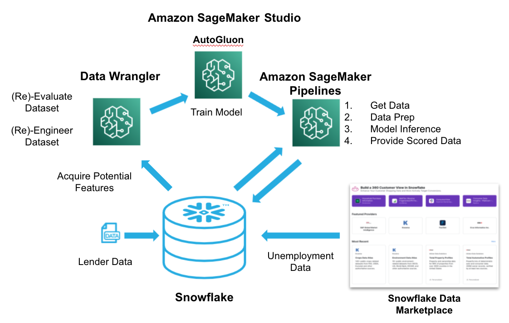</span>

<span class="c3"></span>

<span class="c3"></span>

### <span class="c26">Prerequisites</span>

*   <span class="c3">Familiarity with Snowflake, basic SQL knowledge and Snowflake objects</span>
*   <span class="c3">Familiarity with AWS Service and Management Console</span>
*   <span class="c3">Basic knowledge of Python, Jupyter notebook and Machine Learning</span>

### <span class="c28 c26">What You'll Need During the Lab</span>

<span class="c3">To participate in the virtual hands-on lab, attendees need the following:</span>

*   <span class="c14">A</span> <span class="c14 c25">[Snowflake account](https://www.google.com/url?q=https://trial.snowflake.com/&sa=D&source=editors&ust=1630522484980000&usg=AOvVaw3_8ex5DsKw5tJ9I4Kxv6ZE)</span><span class="c14">with</span> <span class="c21">ACCOUNTADMIN</span><span class="c3"> access</span>
*   <span class="c14">An</span> <span class="c16 c14">[AWS Account](https://www.google.com/url?q=https://aws.amazon.com/premiumsupport/knowledge-center/create-and-activate-aws-account/&sa=D&source=editors&ust=1630522484981000&usg=AOvVaw0y4llx0YsA9Sr0sqjWxJBt)</span><span class="c3"> with admin access</span>
*   <span class="c28 c20 c15">An AWS VPC and Subnet in your AWS where SageMaker studio can be deployed</span>

### <span class="c28 c26">What You'll Learn</span>

*   <span class="c3">Snowflake data management features for machine learning</span>
*   <span class="c3">How to leverage data in Snowflake's Data Marketplace</span>
*   <span class="c3">How to connect SageMaker Data Wrangler and Studio to Snowflake</span>
*   <span class="c3">The analysis and feature engineering capabilities in Data Wrangler</span>
*   <span class="c3">Building and deploying SageMaker Pipelines</span>
*   <span class="c3">Options to integrate the ML models and pipeline with Snowflake</span>

### <span class="c28 c26">What You'll Build</span>

*   <span class="c3">A Snowflake database for machine learning and data enrichment using the Data Marketplace</span>
*   <span class="c3">SageMaker Studio environment with integration to Snowflake</span>
*   <span class="c3">SageMaker Data Wrangler flow with Snowflake data</span>
*   <span class="c3">SageMaker Pipeline to prep Snowflake data and perform inference  </span>

<span class="c3"></span>

<span class="c1"></span>

<span class="c1"></span>

<span class="c1"></span>

* * *

<span class="c1"></span>

## <span class="c18">Setting up Snowflake</span>

<span class="c22 c13">Duration: 3</span>

<span class="c1"></span>

<span class="c3">The first thing you will need to do is download the following .sql file that contains a series of SQL commands we will execute throughout this lab.</span>

<span class="c3"></span>

<button>[Download:  Data_Wrangler_Snowflake_VHOL_V2.sql](https://snowflake-corp-se-workshop.s3.us-west-1.amazonaws.com/VHOL_Snowflake_Data_Wrangler/V2/files/Data_Wrangler_Snowflake_VHOL_V2.sql)</button>

<span class="c3"></span>

<span class="c3">At this point, log into your Snowflake account and have a clear screen to start working with. If you have just created a free trial account, feel free to minimize or close and hint boxes that are looking to help guide you. These will not be needed for this lab and most of the hints will be covered throughout the remainder of this exercise.</span>

<span class="c3"></span>

<span style="overflow: hidden; display: inline-block; margin: 0.00px 0.00px; border: 0.00px solid #000000; transform: rotate(0.00rad) translateZ(0px); -webkit-transform: rotate(0.00rad) translateZ(0px); width: 624.00px; height: 286.67px;">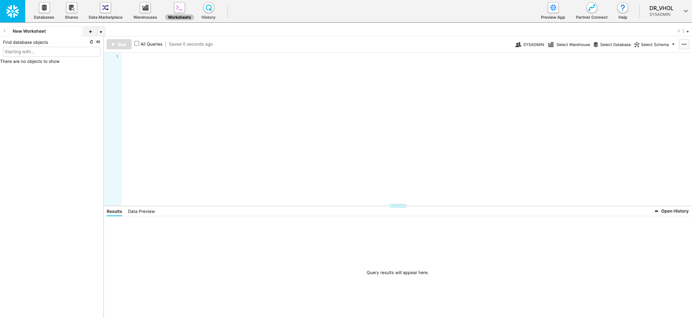</span>

<span class="c3"></span>

<span class="c3">To ingest our script in the Snowflake UI, navigate to the ellipsis button on the top right hand side of a "New Worksheet" and load our script.</span>

<span class="c3"></span>

<span style="overflow: hidden; display: inline-block; margin: 0.00px 0.00px; border: 0.00px solid #000000; transform: rotate(0.00rad) translateZ(0px); -webkit-transform: rotate(0.00rad) translateZ(0px); width: 502.00px; height: 152.00px;">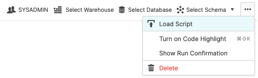</span>

<span class="c3"></span>

<span class="c3">The SQL script file should show up as text in a new worksheet.</span>

<span class="c3">It is also helpful to turn on code highlight in the worksheet. This will highlight the SQL command(s) that you will execute before "running" the command. Navigate to the ellipsis button on the top right hand side of a "New Worksheet" and click Turn on Code Highlight.</span>

<span style="overflow: hidden; display: inline-block; margin: 0.00px 0.00px; border: 0.00px solid #000000; transform: rotate(0.00rad) translateZ(0px); -webkit-transform: rotate(0.00rad) translateZ(0px); width: 233.00px; height: 151.00px;">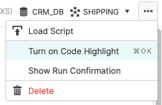</span>

<span class="c3"></span>

<span class="c3">Each step throughout the Snowflake portion of the guide has an associated SQL command to perform the work we are looking to execute, and so feel free to step through each action running the code line by line as we walk through the lab.</span>

<span class="c3"></span>

<span class="c3">First we will switch to the SECURITYADMIN role and create a role (ML_ROLE), as well as a user (ML_USER) that we will use in the lab.</span>

<span class="c3"></span>

```

USE ROLE SECURITYADMIN;

CREATE OR REPLACE ROLE ML_ROLE COMMENT='ML Role';

GRANT ROLE ML_ROLE TO ROLE SYSADMIN;


CREATE OR REPLACE USER ML_USER PASSWORD='AWSSF123'

        DEFAULT_ROLE=ML_ROLE

        DEFAULT_WAREHOUSE=ML_WH

        DEFAULT_NAMESPACE=ML_WORKSHOP.PUBLIC

        COMMENT='ML User';

GRANT ROLE ML_ROLE TO USER ML_USER;

```

<span class="c3"></span>

<span class="c3">Please note the default password assigned for the user. If you choose to change it make sure to record the password as you will need to provide it later in the lab for the integration with Data Wrangler.</span>

<span class="c3"></span>

<span class="c3">Next we will grant privileges to the ML_ROLE to allow it to create storage integrations that are needed for Data Wrangler. We will also grant privileges to create databases in Snowflake and also import shares. This will allow the roles to access and import Snowflake Data Marketplace data, as well as create the Snowflake database that will be used for machine learning. For this we need to use the ACCOUNTADMIN role.</span>

<span class="c3"></span>

```

USE ROLE ACCOUNTADMIN;

GRANT CREATE INTEGRATION ON ACCOUNT TO ROLE ML_ROLE;

GRANT IMPORT SHARE ON ACCOUNT TO ML_ROLE;

GRANT CREATE DATABASE ON ACCOUNT TO ROLE ML_ROLE;

```

<span class="c3"></span>

* * *

<span class="c3"></span>

## <span> Configure Amazon SageMaker Studio and Snowflake Storage Integration with AWS</span>

<span class="c22 c13">Duration: 2</span>

<span class="c1"></span>

<span class="c3">To save some time we will configure the SageMaker environment and the Snowflake Storage Integration that will be used by Data Wrangler by using a CloudFormation Template. Open another tab in your browser and log into your AWS console.</span>

<span class="c3"></span>

<span class="c3">Next you will launch the CloudFormation Template by clicking on the button below, which will open another browser tab and launch AWS CloudFormation.</span>

<span class="c3"></span>

<span class="c20 c15">NOTE:</span> <span class="c3">This CloudFormation Template will create a SageMaker Studio environment</span>

<span class="c3"></span>

<button>[Download - workshop-setup-w-studio.yml](https://console.aws.amazon.com/cloudformation/home?region%3Dregion%23/stacks/new?stackName%3DVHOLSMSNOW%26templateURL%3Dhttps://snowflake-corp-se-workshop.s3.us-west-1.amazonaws.com/VHOL_Snowflake_Data_Wrangler/V2/cft/workshop-setup-w-studio.yml)</button>

<span class="c3"></span>

<span class="c3"></span>

<span class="c14">For environment with</span> <span class="c15 c20">an existing SageMaker Studio environment</span><span class="c3"> use the following CloudFormation Template</span>

<span class="c3"></span>

<button>[Download - workshop-setup-no-studio.yml](https://console.aws.amazon.com/cloudformation/home?region%3Dregion%23/stacks/new?stackName%3DVHOLSMSNOW%26templateURL%3Dhttps://snowflake-corp-se-workshop.s3.us-west-1.amazonaws.com/VHOL_Snowflake_Data_Wrangler/V2/cft/workshop-setup-no-studio.yml)</button>

<span class="c3"></span>

<span class="c14">Select the</span> <span class="c20 c15">AWS region</span><span class="c14">where you want to deploy the CloudFormation.</span> <span class="c20 c15">It is recommended to use the same region as where you have your Snowflake account</span><span class="c3">. For example we will use Oregon(us-west-2).</span>

<span class="c3"></span>

<span class="c14">On the Create Stack page select</span> <span class="c28 c20 c15">Next</span>

<span style="overflow: hidden; display: inline-block; margin: 0.00px 0.00px; border: 0.00px solid #000000; transform: rotate(0.00rad) translateZ(0px); -webkit-transform: rotate(0.00rad) translateZ(0px); width: 624.00px; height: 413.33px;">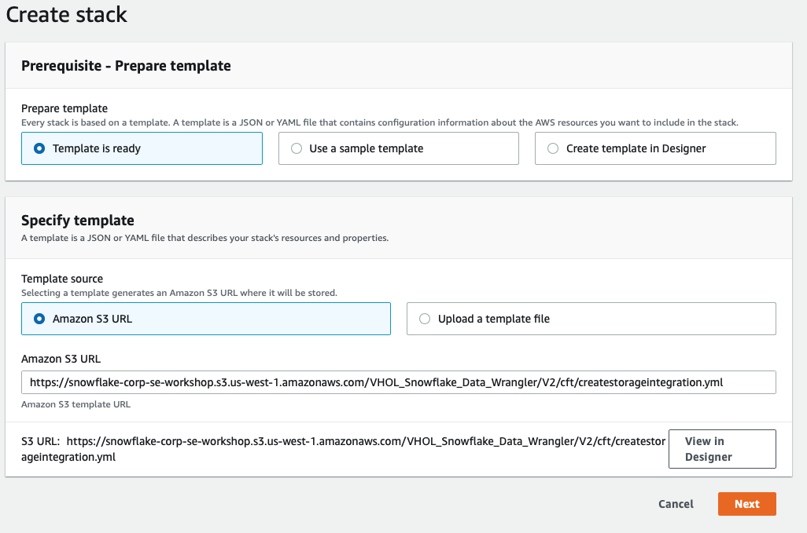</span>

<span class="c3"> </span>

<span class="c3">On the next page you will specify your stack details. Please pay close attention as these parameters are used to create various objects.</span>

<span class="c3"></span>

*   <span class="c20 c15">Stack name</span><span class="c14">- use the default</span> <span class="c20 c15">VHOLSMSNOW</span><span class="c3"> or supply your own name with CAPITAL letters</span>
*   <span class="c20 c15">Repository Configurations</span><span class="c3"> - Workshop Templates URL</span>

*   <span class="c3">Leave the URL as is</span>

*   <span class="c20 c15">Snowflake Configurations</span><span class="c3">:</span>

*   <span class="c3">Snowflake External Stage S3 Bucket Name - This is a base name to which the region and account id will be added. Must be universally unique. Can add your initials if needed.</span>
*   <span class="c3">Snowflake Storage Integration Name - Base name for what the storage integration will be called. Region and account ID will be added. Leave as is or if changed - only use CAPITAL LETTER, numbers and underscores</span>
*   <span class="c3">Snowflake User Name - ML_USER</span>
*   <span class="c3">Snowflake Password - The password you assigned to the ML_USER in the previous step - Required to enter.</span>
*   <span class="c14">Snowflake Account - the Snowflake account name -</span> <span class="c28 c20 c15">see note below</span>
*   <span class="c14">S</span><span class="c3">nowflake Role - ML_ROLE</span>

*   <span class="c28 c20 c15">SageMaker Studio Configurations</span>

*   <span class="c3">SageMaker Studio Domain Name</span>
*   <span class="c3">SageMaker Studio User Profile Name</span>

*   <span class="c28 c20 c15">VPC Configurations</span>

*   <span class="c3">VPC - Choose existing VPC</span>
*   <span class="c3">VPC Subnet - Choose existing VPC Subnet in availability zone supported by SageMaker</span>

<span class="c3"></span>

<span class="c20 c15">NOTE:</span><span class="c14">The Snowflake account name can be found by looking at the URL in your browser tab logged into the Snowflake UI. Copy the characters after the https:// and before snowflakecomputing.com i.e.</span> <span class="c20 c15">https://abcd123.us-east-1.snowflakecomputing.com</span><span class="c14">the account name will be</span> <span class="c20 c15 c28">abcd123.us-east-1</span>

<span class="c14">In some cases the region (us-east-1 or other region name) may not be present, in this case just copy the characters before snowflakecomputing.com i.e.</span><span class="c20 c15"> https://xyz1234.snowflakecomputing.com</span><span class="c14">the account name will be</span> <span class="c28 c20 c15">xyz1234</span>

* * *

<span class="c3"></span>

<span style="overflow: hidden; display: inline-block; margin: 0.00px 0.00px; border: 0.00px solid #000000; transform: rotate(0.00rad) translateZ(0px); -webkit-transform: rotate(0.00rad) translateZ(0px); width: 624.00px; height: 1014.67px;">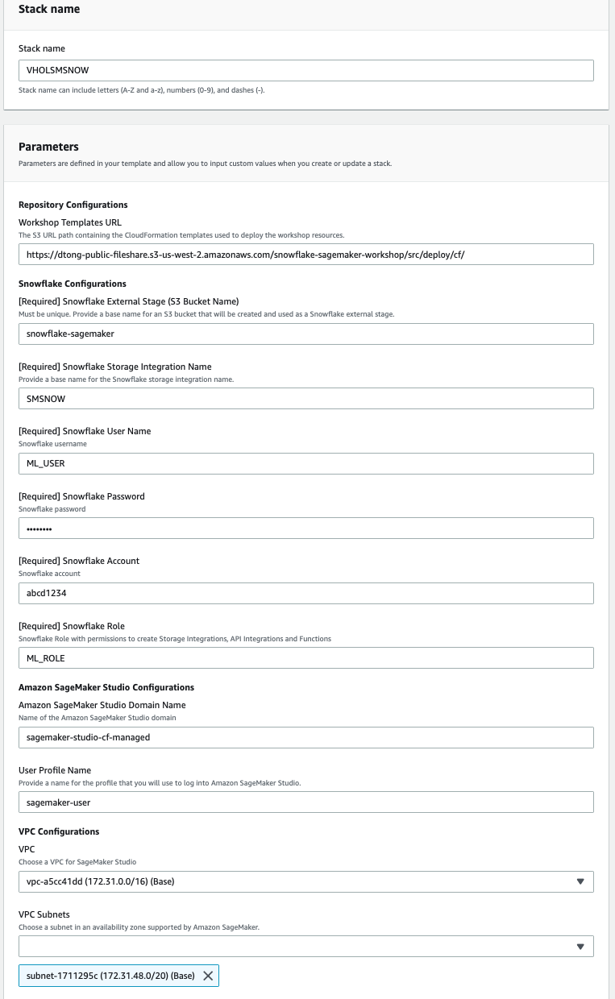</span>

<span class="c3"></span>

<span class="c14">Click</span> <span class="c20 c15">Next</span>

<span class="c3"></span>

<span class="c14">On the next page -</span> <span class="c20 c15">Configure stack options</span><span class="c14">- click</span> <span class="c20 c15">Next</span> <span class="c3">(no need to change anything)</span>

<span class="c3"></span>

<span class="c3">On the Review page -</span>

*   <span class="c3">Review the parameters</span>
*   <span class="c14">Check the</span> <span class="c20 c15 c35">I acknowledge that AWS CloudFormation might create IAM resources.</span> <span class="c14 c35 c40">Box</span>
*   <span class="c14">Click on</span> <span class="c20 c15">Create Stack</span><span class="c3"> </span>

<span class="c3"></span>

<span style="overflow: hidden; display: inline-block; margin: 0.00px 0.00px; border: 0.00px solid #000000; transform: rotate(0.00rad) translateZ(0px); -webkit-transform: rotate(0.00rad) translateZ(0px); width: 624.00px; height: 233.33px;">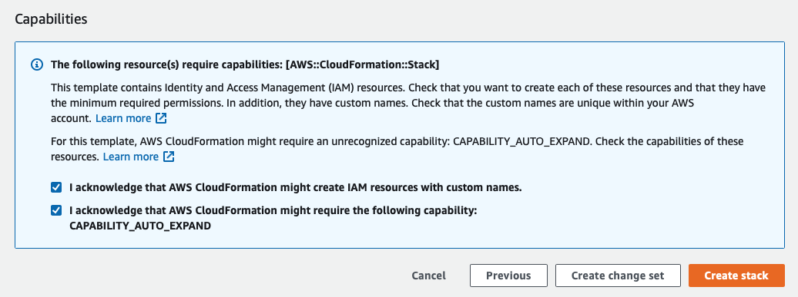</span>

<span class="c3"></span>

<span class="c3"></span>

<span class="c3">It may take a few minutes for the stack to be created and we will use the time to continue with Snowflake.</span>

<span class="c3"></span>

<span class="c3"></span>

* * *

<span class="c3"></span>

## <span class="c18"> Load data in Snowflake and access the Marketplace</span>

<span class="c13 c22">Duration: 5</span>

<span class="c1"></span>

<span>Next we will create a virtual warehouse that we will use to compute with the</span> <span class="c15">SYSADMIN</span><span>role, and then grant all privileges to the</span> <span class="c15">ML_ROLE</span><span class="c1">.</span>

<span class="c1"></span>

```

USE ROLE SYSADMIN;

--Create Warehouse for AI/ML work

CREATE OR REPLACE WAREHOUSE ML_WH

  WITH WAREHOUSE_SIZE = 'XSMALL'

  AUTO_SUSPEND = 120

  AUTO_RESUME = true

  INITIALLY_SUSPENDED = TRUE;

GRANT ALL ON WAREHOUSE ML_WH TO ROLE ML_ROLE;

```

<span class="c1"></span>

<span class="c1">We are now ready to start creating databases and loading data.</span>

<span class="c1">First we will switch to the ML_ROLE and use the ML_WH warehouse for compute.</span>

<span class="c1"></span>

```

USE ROLE ML_ROLE;

USE WAREHOUSE ML_WH;

```

<span class="c1"></span>

<span class="c1">Next we will create a database and table that will represent the aggregation of data from internal systems.</span>

<span class="c1"></span>

```

CREATE DATABASE IF NOT EXISTS LOANS_V2;


CREATE OR REPLACE TABLE LOAN_DATA (

    LOAN_ID NUMBER(38,0),

    LOAN_AMNT NUMBER(38,0),

    FUNDED_AMNT NUMBER(38,0),

    TERM VARCHAR(16777216),

    INT_RATE VARCHAR(16777216),

    INSTALLMENT FLOAT,

    GRADE VARCHAR(16777216),

    SUB_GRADE VARCHAR(16777216),

    EMP_TITLE VARCHAR(16777216),

    EMP_LENGTH VARCHAR(16777216),

    HOME_OWNERSHIP VARCHAR(16777216),

    ANNUAL_INC NUMBER(38,0),

    VERIFICATION_STATUS VARCHAR(16777216),

    PYMNT_PLAN VARCHAR(16777216),

    URL VARCHAR(16777216),

    DESCRIPTION VARCHAR(16777216),

    PURPOSE VARCHAR(16777216),

    TITLE VARCHAR(16777216),

    ZIP_SCODE VARCHAR(16777216),

    ADDR_STATE VARCHAR(16777216),

    DTI FLOAT,

    DELINQ_2YRS NUMBER(38,0),

    EARLIEST_CR_LINE DATE,

    INQ_LAST_6MON NUMBER(38,0),

    MNTHS_SINCE_LAST_DELINQ VARCHAR(16777216),

    MNTHS_SINCE_LAST_RECORD VARCHAR(16777216),

    OPEN_ACC NUMBER(38,0),

    PUB_REC NUMBER(38,0),

    REVOL_BAL NUMBER(38,0),

    REVOL_UTIL FLOAT,

    TOTAL_ACC NUMBER(38,0),

    INITIAL_LIST_STATUS VARCHAR(16777216),

    MTHS_SINCE_LAST_MAJOR_DEROG VARCHAR(16777216),

    POLICY_CODE NUMBER(38,0),

    LOAN_DEFAULT NUMBER(38,0),

    ISSUE_MONTH NUMBER(2,0),

    ISSUE_YEAR NUMBER(4,0)

);

```

<span class="c1"></span>

<span>Next we will create an external stage to load the lab data into the table. This is done from a public S3 bucket to simplify the workshop. Typically an external stage will be using various secure integrations as described in this</span> <span class="c16">[link](https://www.google.com/url?q=https://docs.snowflake.com/en/user-guide/data-load-s3-config.html&sa=D&source=editors&ust=1630522484997000&usg=AOvVaw3R7DRbe1pMxBz0ehYEbhze)</span><span class="c1">.</span>

<span class="c1"></span>

```

CREATE OR REPLACE STAGE LOAN_DATA

  url='s3://snowflake-corp-se-workshop/VHOL_Snowflake_Data_Wrangler/V2/data/';

```

<span class="c1"></span>

<span class="c1">We can now use the COPY command to load the data into Snowflake.</span>

```

COPY INTO LOAN_DATA FROM @LOAN_DATA/loan_data.csv

    FILE_FORMAT = (TYPE = 'CSV' SKIP_HEADER = 1);

```

<span class="c1"></span>

<span class="c1">This data represents aggregation from various internal systems for lender information and loans. We can have a quick look and see the various attributes in it.</span>

<span class="c1"></span>

```

SELECT * FROM LOAN_DATA LIMIT 100;

```

<span class="c1"></span>

#### <span class="c15 c36">Snowflake Data Marketplace data</span>

<span class="c1"> </span>

<span class="c1">We can now look at additional data in the Snowflake Marketplace that can be helpful for improving ML models. It may be good to look at employment data in the region when analyzing loan defaults. Let’s look in the Snowflake Data Marketplace and see what external data is available from the data providers.</span>

<span class="c1"></span>

<span class="c14">To be able to add Marketplace data we will use the new Snowflake UI. Click on the</span> <span class="c21">Preview App</span><span class="c3"> button on the top right hand of the Snowflake console, next to the Partner Connect and Help buttons.</span>

<span style="overflow: hidden; display: inline-block; margin: 0.00px 0.00px; border: 0.00px solid #000000; transform: rotate(0.00rad) translateZ(0px); -webkit-transform: rotate(0.00rad) translateZ(0px); width: 283.00px; height: 67.00px;">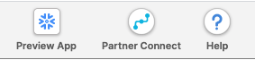</span>

<span class="c3"></span>

<span class="c14">Once you click on the Preview App button a new browser tab will open with the new preview Snowflake UI. On the top left hand corner click on your username and then hover over the</span> <span class="c21">Switch Role</span><span class="c14">menu. Scroll and select the</span> <span class="c21">ML_ROLE</span><span class="c3"> from the list of roles.</span>

<span class="c3"></span>

<span style="overflow: hidden; display: inline-block; margin: 0.00px 0.00px; border: 0.00px solid #000000; transform: rotate(0.00rad) translateZ(0px); -webkit-transform: rotate(0.00rad) translateZ(0px); width: 445.72px; height: 360.50px;">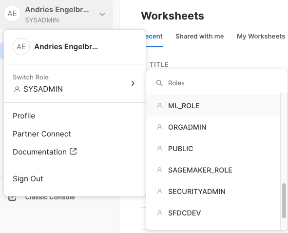</span>

<span class="c3"></span>

<span class="c14">Now click on the</span> <span class="c21">Data</span><span class="c14">menu bar on the left side. Then select</span> <span class="c21">Marketplace</span><span class="c3">.</span>

<span style="overflow: hidden; display: inline-block; margin: 0.00px 0.00px; border: 0.00px solid #000000; transform: rotate(0.00rad) translateZ(0px); -webkit-transform: rotate(0.00rad) translateZ(0px); width: 215.83px; height: 414.50px;">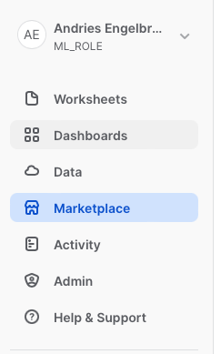</span>

<span class="c1"></span>

<span>Once in the Marketplace type</span> <span class="c15">Unemployment</span><span>in the top</span> <span class="c21">Search Data Marketplace</span><span class="c14"> and hit Enter/Return. This will provide a list of Data Providers with employment data.</span>

<span class="c1"></span>

<span style="overflow: hidden; display: inline-block; margin: 0.00px 0.00px; border: 0.00px solid #000000; transform: rotate(0.00rad) translateZ(0px); -webkit-transform: rotate(0.00rad) translateZ(0px); width: 624.00px; height: 296.00px;">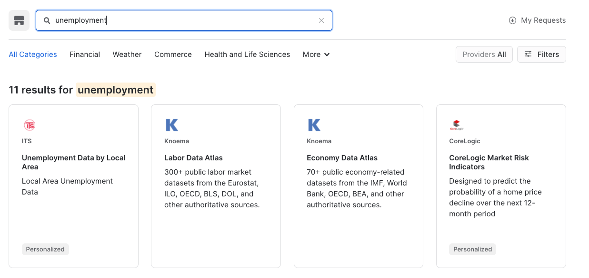</span>

<span class="c1"></span>

<span>Click on the tile with</span> <span class="c8">Knoema - Labor Data Atlas.</span>

<span class="c1">This will show what data is available from the listing. We will notice indicators such as employment and unemployment rates.</span>

<span style="overflow: hidden; display: inline-block; margin: 0.00px 0.00px; border: 0.00px solid #000000; transform: rotate(0.00rad) translateZ(0px); -webkit-transform: rotate(0.00rad) translateZ(0px); width: 624.00px; height: 428.00px;">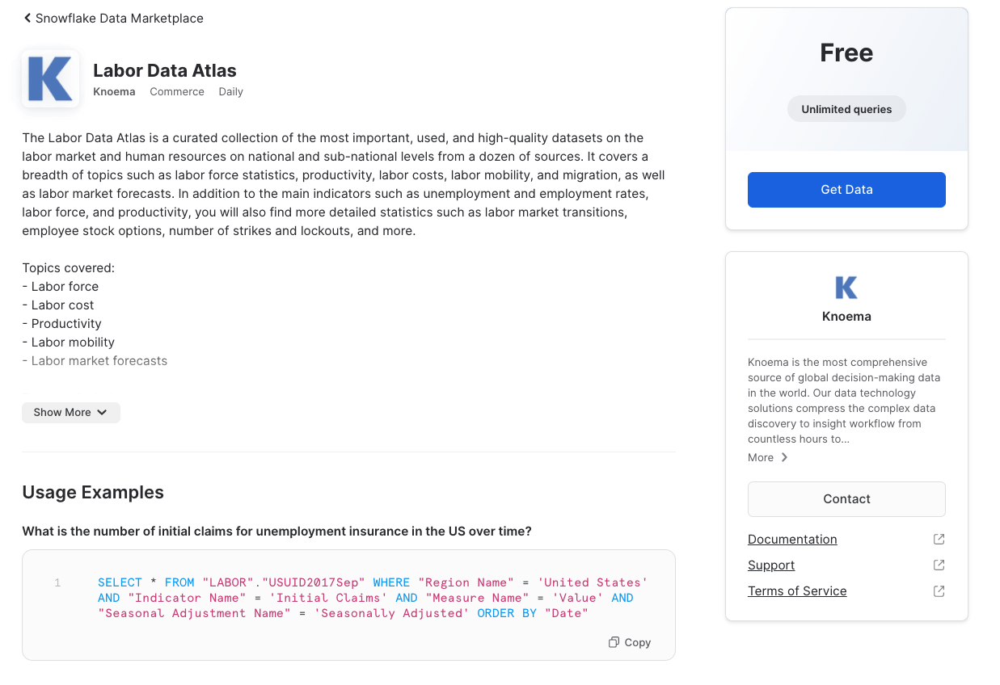</span>

<span class="c1"></span>

<span>Next click on the</span> <span class="c15">Get Data</span><span class="c1"> button. This will provide a pop up window in which you can create a database in your account that will provide the data from the data provider.</span>

<span>Change the name of the database to</span> <span class="c15">KNOEMA_LABOR_DATA_ATLAS</span><span>and then click the</span> <span class="c15">Get Data</span><span> button.</span>

<span style="overflow: hidden; display: inline-block; margin: 0.00px 0.00px; border: 0.00px solid #000000; transform: rotate(0.00rad) translateZ(0px); -webkit-transform: rotate(0.00rad) translateZ(0px); width: 624.00px; height: 441.33px;">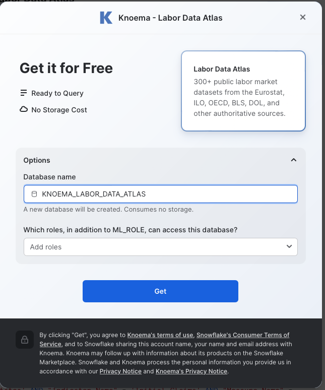</span>

<span class="c1"></span>

<span class="c1">When the confirmation is provided click on done and then you can close the browser tab with the Preview App.</span>

<span class="c1"></span>

<span class="c1">Data from the Snowflake Data Marketplace does not require any additional work and will show up as a database in your account. A further benefit is that the data will automatically update as soon as the data provider does any updates to the data on their account.</span>

<span class="c1"></span>

<span class="c1">Let’s start using the marketplace data. First we will create a view to pivot the data for the different employment metrics to columns for easier consumption.</span>

<span class="c1"></span>

```

USE LOANS_V2.PUBLIC;


CREATE OR REPLACE VIEW KNOEMA_EMPLOYMENT_DATA AS (

SELECT *

FROM (SELECT "Measure Name" MeasureName, "Date", "RegionId" State, AVG("Value") Value FROM "KNOEMA_LABOR_DATA_ATLAS"."LABOR"."BLSLA" WHERE "RegionId" is not null and "Date" >= '2018-01-01' AND "Date" < '2018-12-31' GROUP BY "RegionId", "Measure Name", "Date")

        PIVOT(AVG(Value) FOR MeasureName IN ('civilian noninstitutional population', 'employment', 'employment-population ratio', 'labor force', 'labor force participation rate', 'unemployment', 'unemployment rate'))

         AS p (Date, State, civilian_noninstitutional_population, employment, employment_population_ratio, labor_force, labor_force_participation_rate, unemployment, unemployment_rate)

);


```

<span class="c1"></span>

<span class="c1">We will now create a new table to join the loan data with the unemployment data using the geography and time periods. This will provide us with unemployment data in the region associated with the specific loan.</span>

<span class="c1"></span>

```

CREATE OR REPLACE TABLE UNEMPLOYMENT_DATA AS

        SELECT l.LOAN_ID, e.CIVILIAN_NONINSTITUTIONAL_POPULATION, e.EMPLOYMENT, e.EMPLOYMENT_POPULATION_RATIO, e.LABOR_FORCE,            e.LABOR_FORCE_PARTICIPATION_RATE, e.UNEMPLOYMENT, e.UNEMPLOYMENT_RATE

        FROM LOAN_DATA l LEFT JOIN KNOEMA_EMPLOYMENT_DATA e

            on l.ADDR_STATE = right(e.state,2) and l.issue_month = month(e.date) and l.issue_year = year(e.date);


```

<span class="c1"></span>

<span class="c1">We can quickly look at the metrics by running a simple query.</span>

<span class="c1"></span>

```

SELECT * FROM UNEMPLOYMENT_DATA LIMIT 100;

```

<span class="c1"></span>

<span class="c1"></span>

<span class="c1"></span>

<span class="c1"></span>

<span class="c1"></span>

<span class="c1"></span>

#### <span class="c15">Database for Machine Learning</span>

<span>The last step is to create a database that can be used by the data science team. This will allow them full access to the data without impacting any of the other analyst or production teams. Snowflake provides a very unique feature called</span> <span class="c16 c15">[Zero Copy Cloning](https://www.google.com/url?q=https://www.youtube.com/watch?v%3DyQIMmXg7Seg&sa=D&source=editors&ust=1630522485003000&usg=AOvVaw1EUvz2GIHttPRzutlqvlGJ)</span><span> that will create a new copy of the data by</span> <span class="c15">only making a copy of the metadata of the objects</span><span class="c1">. This drastically speeds up creation of copies and also drastically reduces the storage space needed for data copies.</span>

<span class="c1">This feature can be very handy for Machine Learning as it will allow for feature engineering in Snowflake and also the ability to save copies of the data used for the training of ML models for future reference.</span>

<span class="c1"></span>

<span class="c1">In this lab we will just clone table objects, though complete databases can also be cloned. First we will create a database and schema to clone the tables objects to.</span>

<span class="c1"></span>

<span class="c1"></span>

```

CREATE OR REPLACE DATABASE ML_LENDER_DATA;

CREATE OR REPLACE SCHEMA ML_LENDER_DATA.ML_DATA;

USE ML_LENDER_DATA.ML_DATA;

```

<span class="c1">Next we will clone the loan_data and unemployment_data tables to the new database.</span>

<span class="c1"></span>

```

CREATE TABLE LOAN_DATA_ML CLONE LOANS_V2.PUBLIC.LOAN_DATA;

CREATE TABLE UNEMPLOYMENT_DATA CLONE LOANS_V2.PUBLIC.UNEMPLOYMENT_DATA;

```

<span class="c1"></span>

<span class="c1">We will also create a table to allow us to write the ML Model predictions back in the future.</span>

<span class="c1"></span>

```

CREATE OR REPLACE TABLE ML_RESULTS (LABEL NUMBER, PREDICTIONS NUMBER, P_DEFAULT FLOAT);

```

<span class="c1"></span>

<span class="c1">Lastly we will get the storage integration information that was created by the CloudFormation template.</span>

<span class="c1"></span>

```

SHOW INTEGRATIONS;

```
<span class="c1"></span>

<span class="c1">Make sure to note the name of the storage integration that was created as it will be used with Data Wrangler configuration.</span>

<span class="c1"></span>

<span class="c1"></span>

<span class="c1"></span>

<span class="c1"></span>

<span class="c1"></span>

* * *

## <span class="c18"></span>

## <span> Data Wrangler - Data Prep & Feature Analysis</span>

<span class="c1">Duration: 30</span>

<span class="c1"></span>

#### <span>Let’s</span><span class="c27"> go to SageMaker Studio.</span>

<span class="c14">Click on this link (</span><span class="c16 c38">[https://console.aws.amazon.com/sagemaker/home](https://www.google.com/url?q=https://console.aws.amazon.com/sagemaker/home&sa=D&source=editors&ust=1630522485007000&usg=AOvVaw1V0fUjd-E89KAgM4zG7FPl)</span><span class="c1">) and it will open a new browser tab with the SageMaker Console.</span>

<span>Click on the</span> <span class="c15">Amazon SageMaker Studio</span><span class="c1"> menu on the left hand side.</span>

<span>Next to the</span> <span class="c15">User name - sagemaker-user</span><span>you will click on the link to</span> <span class="c15">Open Studio</span><span class="c1"> to open SageMaker Studio</span>

<span style="overflow: hidden; display: inline-block; margin: 0.00px 0.00px; border: 0.00px solid #000000; transform: rotate(0.00rad) translateZ(0px); -webkit-transform: rotate(0.00rad) translateZ(0px); width: 624.00px; height: 146.67px;"></span>

<span class="c1"></span>

<span class="c1">This will open a new browser tab with SageMaker Studio. It may take a minute or two to create the environment.</span>

<span class="c1"></span>

<span class="c1"></span>

#### <span class="c27">Next we can clone the Git repository that includes all the files we need for the lab in SageMaker Studio.</span>

<span class="c1">On the Left side menu click on the Git repository icon and then the Clone a Repository button.</span>

<span class="c1"></span>

<span style="overflow: hidden; display: inline-block; margin: 0.00px 0.00px; border: 0.00px solid #000000; transform: rotate(0.00rad) translateZ(0px); -webkit-transform: rotate(0.00rad) translateZ(0px); width: 314.00px; height: 242.00px;">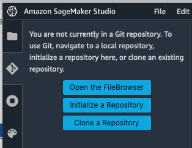</span>

<span class="c1"></span>

<span class="c1">You will then enter copy the Git URL below for the repository in the popup window and then click CLONE</span>

<span class="c16">[https://github.com/dylan-tong-aws/snowflake-sagemaker-workshops](https://www.google.com/url?q=https://github.com/dylan-tong-aws/snowflake-sagemaker-workshops&sa=D&source=editors&ust=1630522485009000&usg=AOvVaw0SMfJIXdIguymSBCIIMFPc)</span>

<span class="c1"></span>

<span style="overflow: hidden; display: inline-block; margin: 0.00px 0.00px; border: 0.00px solid #000000; transform: rotate(0.00rad) translateZ(0px); -webkit-transform: rotate(0.00rad) translateZ(0px); width: 279.00px; height: 166.00px;">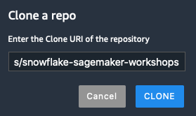</span>

<span class="c1"></span>

<span class="c1">The Studio environment will then switch to the folder browser.</span>

<span class="c1">Navigate to the /snowflake-sagemaker-workshops/loan-default/notebooks folder by double clicking each folder in the path.</span>

<span class="c1"></span>

<span style="overflow: hidden; display: inline-block; margin: 0.00px 0.00px; border: 0.00px solid #000000; transform: rotate(0.00rad) translateZ(0px); -webkit-transform: rotate(0.00rad) translateZ(0px); width: 458.00px; height: 184.00px;">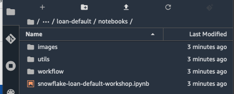</span>

<span class="c1"></span>

<span class="c1">Open the snowflake-loan-default-workshop.ipnyb notebook by double clicking on it.</span>

<span class="c1">A window will pop up to select the Kernel you want to use. Select the Python 3 (snowflake-workshop/3) kernel and click Select.</span>

<span class="c1"></span>

<span style="overflow: hidden; display: inline-block; margin: 0.00px 0.00px; border: 0.00px solid #000000; transform: rotate(0.00rad) translateZ(0px); -webkit-transform: rotate(0.00rad) translateZ(0px); width: 433.00px; height: 182.00px;">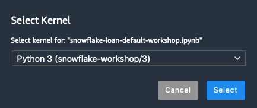</span>

<span class="c1"></span>

<span class="c1">Give the kernel a little time to startup.</span>

<span class="c1"></span>

<span class="c1"></span>

<span class="c1"></span>

<span class="c1">The notebook is very well documented with the steps needed for the workshop.</span>

<span>You can execute the code sections by selecting them and hitting the</span> <span class="c15">run button</span><span>at the top or</span> <span class="c15">shift+return/enter</span><span class="c1">.</span>

<span class="c1"></span>

<span class="c15">If you changed the name of the S3 Bucket Name in the CloudFormation Template </span><span> you will need to change the first code block to enter</span><span class="c15"> the S3 bucket name</span><span>that was created by the CloudFormation template for the</span> <span class="c15">bucket variable</span><span class="c1">. It will look like snowflake-sagemaker-<region>-<accountid>.</span>

<span class="c1">You can find the bucket name in the CloudFormation stack from the previous step.</span>

<span class="c1"></span>

<span style="overflow: hidden; display: inline-block; margin: 0.00px 0.00px; border: 0.00px solid #000000; transform: rotate(0.00rad) translateZ(0px); -webkit-transform: rotate(0.00rad) translateZ(0px); width: 624.00px; height: 221.33px;">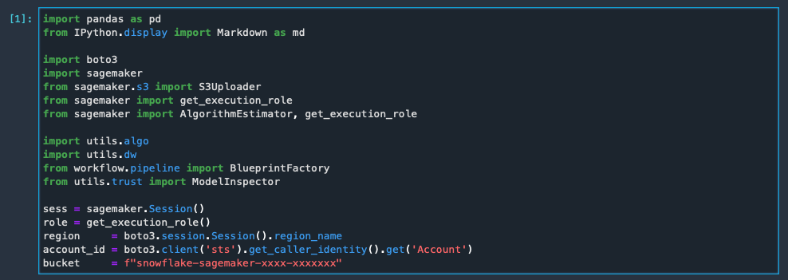</span>

<span class="c1"></span>

<span class="c1">Once you have run the cell you will note a number in the square brackets next to it.</span>

<span class="c1"></span>

<span class="c1">Next we will provide access to the AWS Secrets Manager. Execute the next code block.</span>

<span class="c1"></span>

<span style="overflow: hidden; display: inline-block; margin: 0.00px 0.00px; border: 0.00px solid #000000; transform: rotate(0.00rad) translateZ(0px); -webkit-transform: rotate(0.00rad) translateZ(0px); width: 624.00px; height: 64.00px;">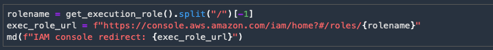</span>

<span class="c1"></span>

<span class="c1"></span>

#### <span class="c27">Data Wrangler</span>

<span class="c1">We will now create a Data Wrangler flow.</span>

<span class="c1"></span>

<span>Create a new Data Wrangler flow by selecting it from the top</span> <span class="c8">File Menu</span>

<span>File>New>Data Wrangler Flow</span>

<span style="overflow: hidden; display: inline-block; margin: 0.00px 0.00px; border: 0.00px solid #000000; transform: rotate(0.00rad) translateZ(0px); -webkit-transform: rotate(0.00rad) translateZ(0px); width: 349.50px; height: 358.21px;">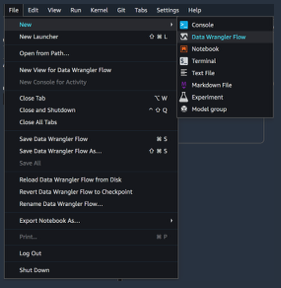</span>

<span class="c1"></span>

<span class="c1">This can take a few minutes to start an instance.</span>

<span class="c1"></span>

##### <span class="c19">Connect to Snowflake and Add Data</span>

<span class="c1">A new tab will open in Studio with untitled.flow.</span>

<span class="c1">Click on Add data source and Select Snowflake</span>

<span class="c1"></span>

<span style="overflow: hidden; display: inline-block; margin: 0.00px 0.00px; border: 0.00px solid #000000; transform: rotate(0.00rad) translateZ(0px); -webkit-transform: rotate(0.00rad) translateZ(0px); width: 481.00px; height: 218.49px;">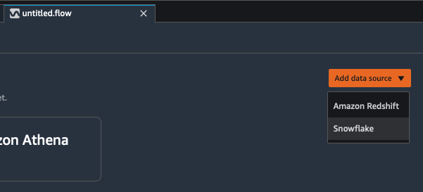</span>

<span class="c1"></span>

<span class="c1"></span>

<span>You can either use the username and password that was created in Snowflake earlier or the AWS Secret that was created in the CloudFormation template to connect to Snowflake. You can use AWS Secret Manager Console (</span><span class="c16">[https://console.aws.amazon.com/secretsmanager/home](https://www.google.com/url?q=https://console.aws.amazon.com/secretsmanager/home&sa=D&source=editors&ust=1630522485012000&usg=AOvVaw1kq5a5OMN5ahv0YZwkYaYp)</span><span class="c1"> ) to get the secret.</span>

<span class="c1"></span>

<span>Use the Snowflake account name from</span> <span class="c15">Step3</span> <span class="c1">if you don’t use the AWS Secrets Manager</span>

<span class="c1">The Snowflake Storage Integration name from Step 4 will be used - <yourid>_STORAGE_INTEGRATION  </span>

<span class="c1"></span>

<span class="c1">Provide a name for the connection.</span>

<span class="c1"></span>

<span style="overflow: hidden; display: inline-block; margin: 0.00px 0.00px; border: 0.00px solid #000000; transform: rotate(0.00rad) translateZ(0px); -webkit-transform: rotate(0.00rad) translateZ(0px); width: 624.00px; height: 433.33px;">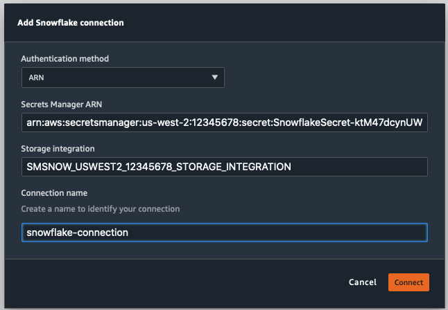</span>

<span class="c1"></span>

<span class="c1"></span>

<span class="c1">You can now navigate the Snowflake data by looking at the Snowflake objects on the left hand side or use the SQL window to run queries.</span>

<span class="c1"></span>

<span class="c1">When using the SQL window you can set the context of the queries, similar to Snowflake. Select:</span>

<span class="c1">Data Warehouse - ML_WH</span>

<span class="c1">Database - ML_LENDER_DATA</span>

<span class="c1">Schema - ML_DATA</span>

<span class="c1"></span>

<span class="c1">To see the LOAN_DATA in Data Wrangler execute the following SQL and click Run</span>

```

SELECT * FROM ML_LENDER_DATA.ML_DATA.LOAN_DATA_ML</span>

```

<span class="c1">You can see the Query Results with the data.</span>

<span class="c1"></span>

<span class="c1">We can refine the features by only selecting columns that will likely be good features.</span>

<span class="c1">We will also Snowflake to generate a repeatable sampling of the table’s data to split the data in a train/test data set.</span>

<span class="c1"></span>

<span class="c1">Execute the following SQL to acquire a filtered list of potential features.</span>

<span class="c1"></span>

```

SELECT

LOAN_ID, LOAN_AMNT, FUNDED_AMNT,

TERM, INT_RATE, INSTALLMENT,

GRADE, SUB_GRADE, EMP_LENGTH,

HOME_OWNERSHIP, ANNUAL_INC, VERIFICATION_STATUS,

PYMNT_PLAN, PURPOSE, ZIP_SCODE,

DTI, DELINQ_2YRS, EARLIEST_CR_LINE,

INQ_LAST_6MON, MNTHS_SINCE_LAST_DELINQ,

MNTHS_SINCE_LAST_RECORD, OPEN_ACC,

PUB_REC, REVOL_BAL, REVOL_UTIL,

TOTAL_ACC, INITIAL_LIST_STATUS,

MTHS_SINCE_LAST_MAJOR_DEROG,

POLICY_CODE, LOAN_DEFAULT, ISSUE_MONTH

FROM ML_LENDER_DATA.ML_DATA.LOAN_DATA_ML

SAMPLE BLOCK (80) REPEATABLE(100);

```

<span>Click</span> <span class="c15">Run</span><span>and then click the</span> <span class="c15">Import</span><span class="c1"> button on the top right.</span>

<span style="overflow: hidden; display: inline-block; margin: 0.00px 0.00px; border: 0.00px solid #000000; transform: rotate(0.00rad) translateZ(0px); -webkit-transform: rotate(0.00rad) translateZ(0px); width: 139.00px; height: 47.00px;">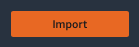</span>

<span class="c1"></span>

<span class="c1">Enter a name for the Dataset - loan_data</span>

<span>Then click</span> <span class="c8">Add</span>

<span style="overflow: hidden; display: inline-block; margin: 0.00px 0.00px; border: 0.00px solid #000000; transform: rotate(0.00rad) translateZ(0px); -webkit-transform: rotate(0.00rad) translateZ(0px); width: 500.88px; height: 170.17px;">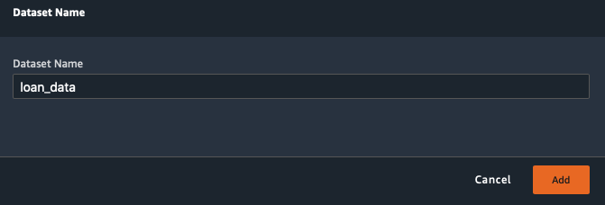</span>

<span class="c1"></span>

<span class="c1"></span>

<span class="c1"></span>

##### <span class="c19">Profile your data</span>

<span>Profile the data by Clicking the</span> <span class="c15">+ sign</span><span class="c1"> next to the Data types block</span>

<span>Select</span> <span class="c15">Add Analysis</span>

<span style="overflow: hidden; display: inline-block; margin: 0.00px 0.00px; border: 0.00px solid #000000; transform: rotate(0.00rad) translateZ(0px); -webkit-transform: rotate(0.00rad) translateZ(0px); width: 624.00px; height: 317.33px;">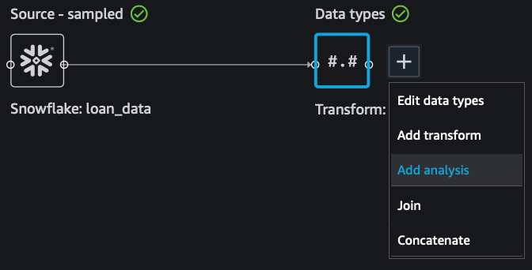</span>

<span class="c1"></span>

<span class="c1">In the Analysis select:</span>

<span class="c1">Type - Histogram</span>

<span class="c1">X axis - LOAN_DEFAULT</span>

<span style="overflow: hidden; display: inline-block; margin: 0.00px 0.00px; border: 0.00px solid #000000; transform: rotate(0.00rad) translateZ(0px); -webkit-transform: rotate(0.00rad) translateZ(0px); width: 332.50px; height: 394.49px;">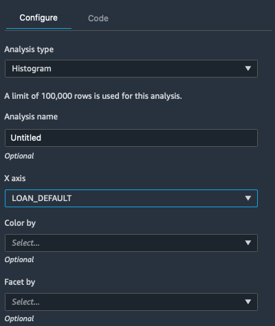</span><span class="c1"> </span>

<span class="c1"></span>

<span>Then click</span> <span class="c15">Preview</span><span class="c1"> to get an analysis of the skew.</span>

<span class="c1"></span>

<span class="c1"></span>

<span class="c1"></span>

##### <span class="c19">Apply Feature Transformations</span>

<span class="c1">Next we will use Data Wrangler to perform some feature transformations.</span>

<span>In the Analysis window click</span> <span class="c15">Back to data flow</span><span class="c1"> at the top.</span>

<span style="overflow: hidden; display: inline-block; margin: 0.00px 0.00px; border: 0.00px solid #000000; transform: rotate(0.00rad) translateZ(0px); -webkit-transform: rotate(0.00rad) translateZ(0px); width: 126.00px; height: 26.00px;">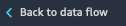</span>

<span class="c1"></span>

<span>Click on the</span> <span class="c15">+</span><span>and select</span> <span class="c15">Add Transform</span><span class="c1"> by the Data types box.</span>

<span style="overflow: hidden; display: inline-block; margin: 0.00px 0.00px; border: 0.00px solid #000000; transform: rotate(0.00rad) translateZ(0px); -webkit-transform: rotate(0.00rad) translateZ(0px); width: 245.50px; height: 287.11px;">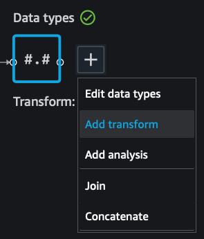</span>

<span class="c1"></span>

<span>Click on</span> <span class="c15">+ Add Step</span><span class="c1"> - To add a transform step</span>

<span class="c1"></span>

<span style="overflow: hidden; display: inline-block; margin: 0.00px 0.00px; border: 0.00px solid #000000; transform: rotate(0.00rad) translateZ(0px); -webkit-transform: rotate(0.00rad) translateZ(0px); width: 293.00px; height: 107.00px;">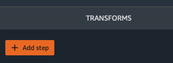</span>

<span class="c1"></span>

<span>First we will fix the</span> <span class="c15">INT_RATE</span><span class="c1"> column from a string with a % sign to a numeric data type.</span>

*   <span>Click on</span> <span class="c8">Search and edit</span>
*   <span>Select</span> <span class="c15">Input Column</span><span class="c1"> as INT_RATE</span>
*   <span>Enter % in the</span> <span class="c15">Pattern</span><span class="c1"> field</span>
*   <span>In the</span> <span class="c15">Replacement string</span><span> </span><span class="c13">type space and then delete it</span><span class="c1"> to have % replaced with an empty string</span>
*   <span>Click</span> <span class="c8">Preview</span>
*   <span>Click</span> <span class="c8">Add</span>

<span class="c1"></span>

<span style="overflow: hidden; display: inline-block; margin: 0.00px 0.00px; border: 0.00px solid #000000; transform: rotate(0.00rad) translateZ(0px); -webkit-transform: rotate(0.00rad) translateZ(0px); width: 403.00px; height: 448.00px;">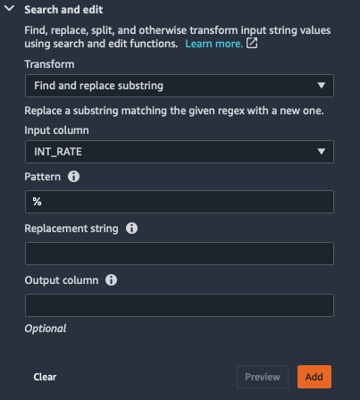</span>

<span class="c1"></span>

<span class="c15">To add additional steps click + Add Step each time</span>

<span class="c1"></span>

*   <span>Next select</span> <span class="c8">Parse column as type</span>
*   <span>Select</span> <span class="c15">INT_RATE</span><span class="c1"> column</span>
*   <span>From:</span> <span class="c8">String</span>
*   <span>To:</span> <span class="c8">Float</span>
*   <span>Click</span> <span class="c8">Preview</span>
*   <span>Click</span> <span class="c8">Add</span>

<span style="overflow: hidden; display: inline-block; margin: 0.00px 0.00px; border: 0.00px solid #000000; transform: rotate(0.00rad) translateZ(0px); -webkit-transform: rotate(0.00rad) translateZ(0px); width: 421.00px; height: 302.00px;"></span>

<span class="c8"></span>

<span class="c1">Next we will address the VERIFICATION_STATUS column, which has various string values to indicate boolean values.</span>

<span class="c1"></span>

<span>Select</span> <span class="c15">Custom Transform</span> <span>then</span><span class="c15"> Python(Spark)</span><span class="c1">and copy the following Python code in the code box</span>

```

from pyspark.sql.functions import udf

from pyspark.sql.types import LongType


def categories(status) :

  if not status :

    return None

  elif status == "not verified" :    

    return 0

  elif status == "VERIFIED - income":

    return 1

  elif status == "VERIFIED - income source":

    return 1

  else :

    return None

bucket_udf = udf(categories, LongType())

df = df.withColumn("VERIFIED", bucket_udf("VERIFICATION_STATUS"))

```

<span>Select</span> <span class="c15">Preview</span><span>and then</span> <span class="c8">Add</span>

<span class="c1"></span>

<span style="overflow: hidden; display: inline-block; margin: 0.00px 0.00px; border: 0.00px solid #000000; transform: rotate(0.00rad) translateZ(0px); -webkit-transform: rotate(0.00rad) translateZ(0px); width: 393.00px; height: 471.00px;">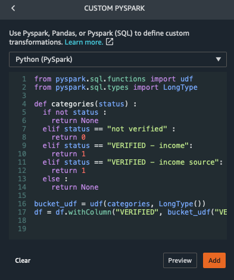</span>

<span class="c1"></span>

<span>This code creates a new column</span> <span class="c15">VERIFIED</span><span class="c1"> with boolean values.</span>

<span class="c1"></span>

<span>Now we can drop the original</span> <span class="c15">VERIFICATION_STATUS</span><span class="c1"> column.</span>

*   <span>Select</span> <span class="c8">Manage columns</span>
*   <span>Transform - select</span> <span class="c8">Drop Column</span>
*   <span class="c15">Column to Drop</span><span class="c1"> - select VERIFICATION_STATUS</span>
*   <span>Select</span> <span class="c15">Preview</span><span>and then</span> <span class="c15">Add</span>

<span class="c1"></span>

<span style="overflow: hidden; display: inline-block; margin: 0.00px 0.00px; border: 0.00px solid #000000; transform: rotate(0.00rad) translateZ(0px); -webkit-transform: rotate(0.00rad) translateZ(0px); width: 407.00px; height: 234.00px;">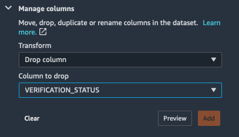</span>

<span class="c1"></span>

<span>Finally we will</span> <span class="c15">drop the LOAN_ID</span><span class="c1"> column using the steps above.</span>

<span style="overflow: hidden; display: inline-block; margin: 0.00px 0.00px; border: 0.00px solid #000000; transform: rotate(0.00rad) translateZ(0px); -webkit-transform: rotate(0.00rad) translateZ(0px); width: 387.00px; height: 220.00px;">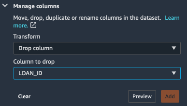</span>

<span class="c1"></span>

<span>Click on</span> <span class="c15">Back to data flow</span><span class="c1">. You should see the five transform steps at the tail of your data prep flow.</span>

<span class="c1"></span>

<span style="overflow: hidden; display: inline-block; margin: 0.00px 0.00px; border: 0.00px solid #000000; transform: rotate(0.00rad) translateZ(0px); -webkit-transform: rotate(0.00rad) translateZ(0px); width: 603.00px; height: 121.00px;">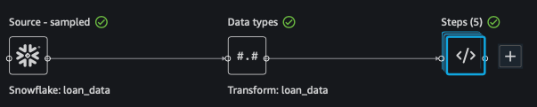</span>

<span class="c1"></span>

<span class="c1"></span>

##### <span class="c19">Data Validation</span>

<span>Next we will check for</span> <span class="c15">Target Leakage</span><span>.</span>

<span class="c1">Target leakage occurs when you accidently train a model with features that are not available in production. As a consequence, you end up with a deceptively effective model in development that causes problems in production. You can mitigate production issues by performing target leakage analysis.</span>

<span class="c1"></span>

<span>Click the</span> <span class="c15">+</span><span>sign next to the 5 Transform Steps and select</span> <span class="c15">Add analysis</span><span class="c1">.</span>

<span style="overflow: hidden; display: inline-block; margin: 0.00px 0.00px; border: 0.00px solid #000000; transform: rotate(0.00rad) translateZ(0px); -webkit-transform: rotate(0.00rad) translateZ(0px); width: 276.00px; height: 314.00px;">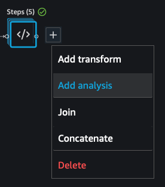</span>

<span class="c1"></span>

<span class="c1">In the Analysis select:</span>

*   <span class="c1">Analysis type - Target Leakage</span>
*   <span class="c1">Max Features - 30</span>
*   <span class="c1">Problem type - Classification</span>
*   <span class="c1">Target - LOAN_DEFAULT</span>

<span style="overflow: hidden; display: inline-block; margin: 0.00px 0.00px; border: 0.00px solid #000000; transform: rotate(0.00rad) translateZ(0px); -webkit-transform: rotate(0.00rad) translateZ(0px); width: 421.00px; height: 508.00px;">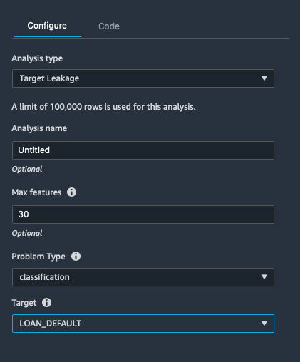</span>

<span class="c1"></span>

<span>Select</span> <span class="c8">Preview</span>

<span class="c1"></span>

<span style="overflow: hidden; display: inline-block; margin: 0.00px 0.00px; border: 0.00px solid #000000; transform: rotate(0.00rad) translateZ(0px); -webkit-transform: rotate(0.00rad) translateZ(0px); width: 624.00px; height: 292.00px;">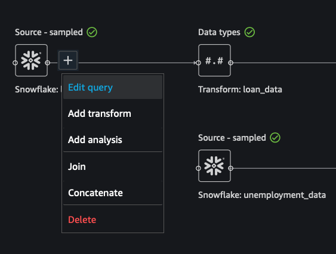</span>

<span class="c1">The report indicates that there is no target leakage risk. It does detect some potentially redundant features.</span>

<span class="c1"></span>

<span class="c8">Next we will create a Bias Report</span>

<span class="c1">Our data does not have any obvious sensitive attributes like gender and race. However, it does contain zip codes. It's possible that we have a flawed dataset with an abnormal number of loan defaults in minority communities. This might not represent the actual distribution. Regardless, this situation could create a model that is biased against minorities resulting in legal risk.</span>

<span class="c1"></span>

<span class="c1">In the Analysis window select:</span>

*   <span class="c1">Analysis Type - Bias Report</span>
*   SELECT the column your model predicts (target): LOAN_DEFAULT</span>
*   <span class="c1">Is your predicted column a value or threshold?: Value</span>
*   <span class="c1">Predicted value(s): 0;1</span>
*   SELECT the column to analyze for bias: ZIPS_CODE</span>
*   <span class="c1">Is your column a value or threshold?: Value</span>
*   <span class="c1">Column value(s) to analyze for bias: 200xx;207xx;206xx;900xx;100xx;941xx</span>

<span class="c1"></span>

<span>Click</span> <span class="c8">Check for bias</span>

<span class="c1"></span>

<span style="overflow: hidden; display: inline-block; margin: 0.00px 0.00px; border: 0.00px solid #000000; transform: rotate(0.00rad) translateZ(0px); -webkit-transform: rotate(0.00rad) translateZ(0px); width: 407.00px; height: 658.00px;">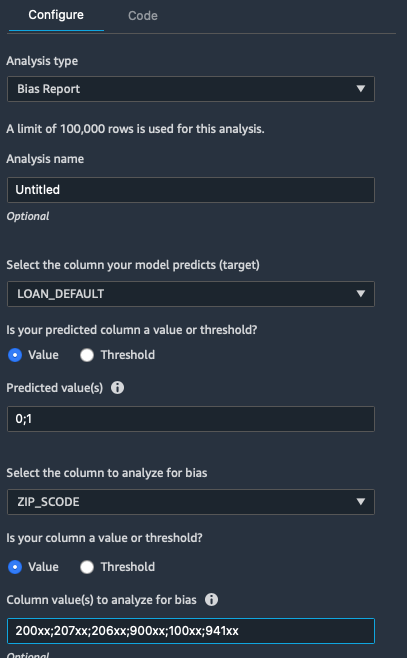</span>

<span class="c1"></span>

<span class="c1">The report does not reveal any salient data bias issues.</span>

<span class="c1"></span>

<span class="c1"></span>

<span style="overflow: hidden; display: inline-block; margin: 0.00px 0.00px; border: 0.00px solid #000000; transform: rotate(0.00rad) translateZ(0px); -webkit-transform: rotate(0.00rad) translateZ(0px); width: 598.00px; height: 149.00px;">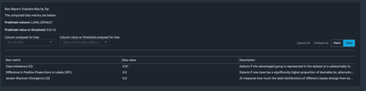</span>

<span class="c1"></span>

<span class="c1"></span>

<span class="c1"></span>

<span class="c1"></span>

<span class="c1"></span>

##### <span class="c19">Prototype Model</span>

<span class="c8">Create a Quick Model Report</span>

<span class="c1"></span>

<span>Amazon Data Wrangler provides a</span> <span class="c15">Quick Model</span><span class="c1"> report which can serve as a prototyping mechanism. The report will sample your dataset, process your flow and generates a Random Forest Model. The report provides model and feature importance scores to help you assess:</span>

<span class="c1"></span>

*   <span class="c1">What features are most impactful?</span>
*   <span class="c1">Does your data have enough predictive signals to produce a practical model?</span>
*   <span class="c1">Are your changes to your dataset leading to improvements?</span>

<span class="c1"></span>

<span class="c1">Navigate to the Analysis panel from the tail end of your flow—as you did in the previous section.</span>

<span class="c1">Configure your report:</span>

*   <span class="c1">Analysis type: Quick Model</span>
*   <span class="c1">Analysis name: Quick Test</span>
*   <span class="c1">Label: LOAN_DEFAULT</span>

<span style="overflow: hidden; display: inline-block; margin: 0.00px 0.00px; border: 0.00px solid #000000; transform: rotate(0.00rad) translateZ(0px); -webkit-transform: rotate(0.00rad) translateZ(0px); width: 422.00px; height: 331.00px;">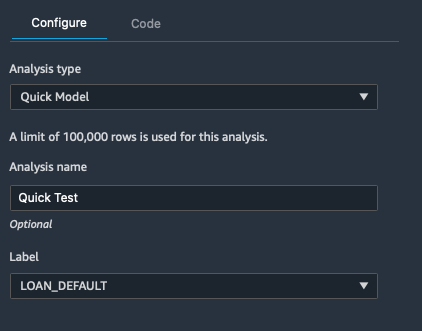</span>

<span class="c1"></span>

<span class="c1">It will take about 5 minutes to generate a report like the following:</span>

<span style="overflow: hidden; display: inline-block; margin: 0.00px 0.00px; border: 0.00px solid #000000; transform: rotate(0.00rad) translateZ(0px); -webkit-transform: rotate(0.00rad) translateZ(0px); width: 624.00px; height: 322.67px;">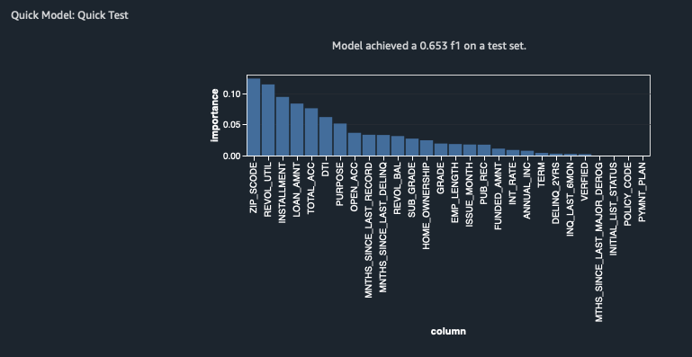</span>

<span class="c1"></span>

<span class="c1">Take note of the feature importance ranking in the bar chart. This gives you an approximation of which features have strong predictive signals.</span>

<span class="c1"></span>

<span class="c1"></span>

<span class="c1"></span>

<span class="c1"></span>

<span class="c1"></span>

## <span class="c18"> Iterate, Experiment and Improve</span>

<span class="c1">Duration: 10</span>

<span class="c1"></span>

<span class="c1">We will now add a new data source to your existing flow.</span>

<span>First click</span> <span class="c8">Back to data flow</span>

SELECT the Import sub tab and click on the Snowflake icon.</span>

<span style="overflow: hidden; display: inline-block; margin: 0.00px 0.00px; border: 0.00px solid #000000; transform: rotate(0.00rad) translateZ(0px); -webkit-transform: rotate(0.00rad) translateZ(0px); width: 624.00px; height: 169.33px;">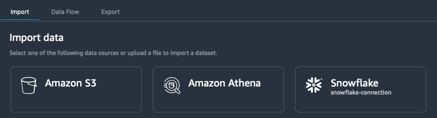</span>

<span class="c1"></span>

<span class="c1">Run the following query to extract the unemployment rate data that you obtained from the Snowflake Data Marketplace.</span>

<span class="c1"></span>

```

SELECT LOAN_ID, UNEMPLOYMENT_RATE

FROM ML_LENDER_DATA.ML_DATA.UNEMPLOYMENT_DATA

```

<span class="c1"></span>

<span>Click</span> <span class="c15">Run</span><span>and then the</span> <span class="c8">Import button</span>

<span>Name the dataset</span> <span class="c8">unemployment_data</span>

<span>Click</span><span class="c8"> Add</span>

<span style="overflow: hidden; display: inline-block; margin: 0.00px 0.00px; border: 0.00px solid #000000; transform: rotate(0.00rad) translateZ(0px); -webkit-transform: rotate(0.00rad) translateZ(0px); width: 624.00px; height: 234.67px;">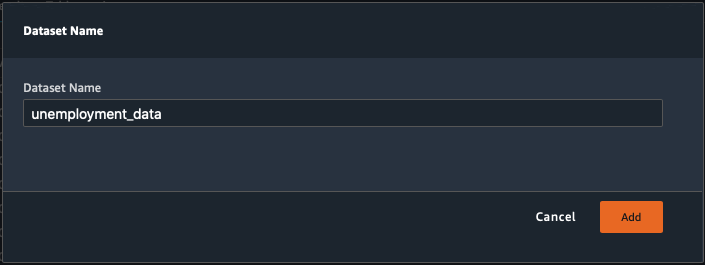</span>

<span class="c1"></span>

<span class="c1">Next, you're going to merge the two datasets. There are many ways to do this. You could have performed this entirely using Snowflake. In this lab, you'll learn how to perform this merge through DataWrangler.</span>

<span class="c1"></span>

<span>First delete the last transformation from the original flow, so that we have</span> <span class="c15">LOAN_ID</span><span class="c1"> available.</span>

<span>Click on the Steps and then on the ellipsis next to step 5 and select</span> <span class="c8">Delete Step</span>

<span style="overflow: hidden; display: inline-block; margin: 0.00px 0.00px; border: 0.00px solid #000000; transform: rotate(0.00rad) translateZ(0px); -webkit-transform: rotate(0.00rad) translateZ(0px); width: 624.00px; height: 256.00px;">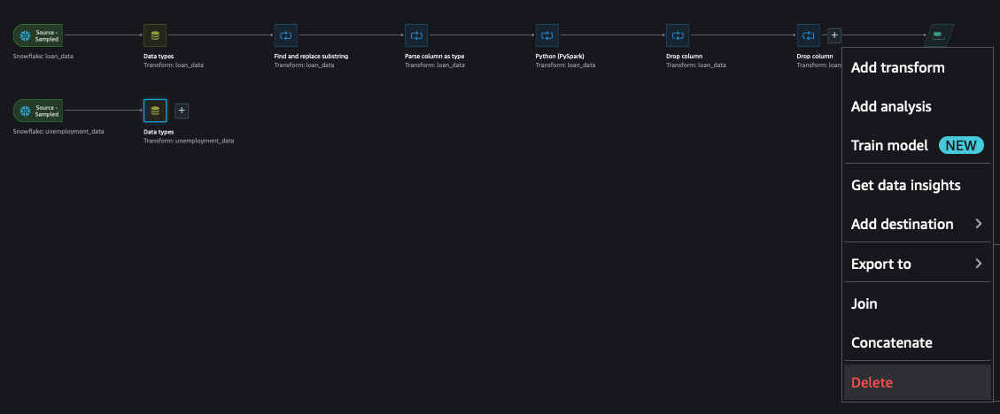</span>

<span class="c1"></span>

<span class="c1">Confirm the Delete</span>

<span style="overflow: hidden; display: inline-block; margin: 0.00px 0.00px; border: 0.00px solid #000000; transform: rotate(0.00rad) translateZ(0px); -webkit-transform: rotate(0.00rad) translateZ(0px); width: 482.00px; height: 189.00px;">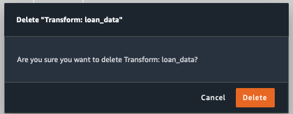</span>

<span class="c1"></span>

<span class="c1">Next we will merge the data sets using a join operator</span>

<span class="c1">Click on the end of the original flow and select the Join operator.</span>

SELECT the other flow.</span>

<span class="c1">Click on Configure</span>

SELECT Left Outer as the Join Type.</span>

SELECT LOAN_ID for both the Left and Right join keys.</span>

<span class="c1"></span>

<span style="overflow: hidden; display: inline-block; margin: 0.00px 0.00px; border: 0.00px solid #000000; transform: rotate(0.00rad) translateZ(0px); -webkit-transform: rotate(0.00rad) translateZ(0px); width: 325.00px; height: 376.00px;">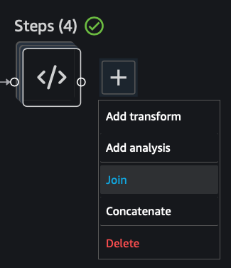</span>

<span class="c1"></span>

SELECT the other flow.</span>

<span style="overflow: hidden; display: inline-block; margin: 0.00px 0.00px; border: 0.00px solid #000000; transform: rotate(0.00rad) translateZ(0px); -webkit-transform: rotate(0.00rad) translateZ(0px); width: 624.00px; height: 197.33px;">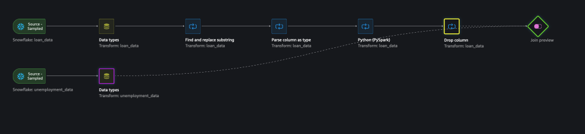</span>

<span class="c1">Click on Configure</span>

<span style="overflow: hidden; display: inline-block; margin: 0.00px 0.00px; border: 0.00px solid #000000; transform: rotate(0.00rad) translateZ(0px); -webkit-transform: rotate(0.00rad) translateZ(0px); width: 157.00px; height: 76.00px;">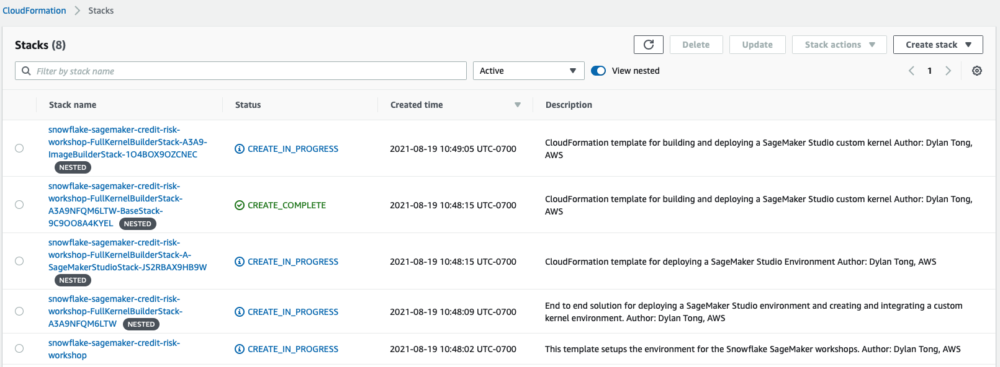</span>

<span class="c1"></span>

SELECT Left Outer as the Join Type.</span>

SELECT LOAN_ID for both the Left and Right join keys.</span>

<span class="c1"></span>

<span style="overflow: hidden; display: inline-block; margin: 0.00px 0.00px; border: 0.00px solid #000000; transform: rotate(0.00rad) translateZ(0px); -webkit-transform: rotate(0.00rad) translateZ(0px); width: 346.00px; height: 367.00px;">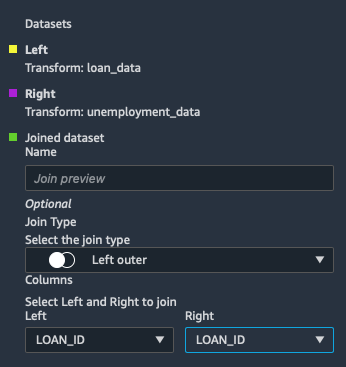</span>

<span class="c1"></span>

<span>Click</span> <span class="c8">Apply</span>

<span class="c1"></span>

<span>Then click</span> <span class="c15">Add</span><span class="c1"> in the top right corner</span>

<span class="c1"></span>

<span>Select the Join Node and</span> <span class="c8">Add Transform</span>

<span style="overflow: hidden; display: inline-block; margin: 0.00px 0.00px; border: 0.00px solid #000000; transform: rotate(0.00rad) translateZ(0px); -webkit-transform: rotate(0.00rad) translateZ(0px); width: 288.00px; height: 349.00px;">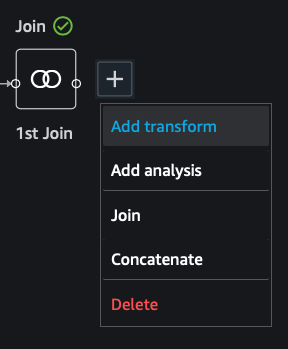</span>

<span class="c1">Drop the columns, LOAN_ID_0 and LOAN_ID_1 using the same transformation steps as before.</span>

<span class="c1">Manage Columns>Drop Column>Loan_ID_0</span>

<span class="c1">Manage Columns>Drop Column>Loan_ID_1</span>

<span style="overflow: hidden; display: inline-block; margin: 0.00px 0.00px; border: 0.00px solid #000000; transform: rotate(0.00rad) translateZ(0px); -webkit-transform: rotate(0.00rad) translateZ(0px); width: 478.00px; height: 458.00px;">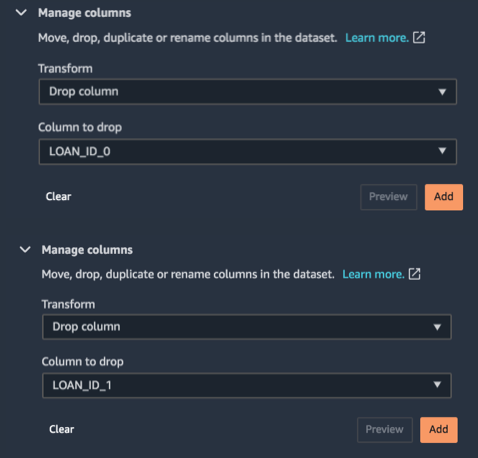</span>

<span class="c1"></span>

<span class="c1"></span>

<span class="c8">Re-Validate the Dataset</span>

<span class="c1">You should re-validate your dataset since it has been modified.</span>

<span class="c1">Add analysis to the Join Operator similar to previous steps.</span>

*   <span class="c1">Analysis type - Target Leakage</span>
*   <span class="c1">Max Features - 30</span>
*   <span class="c1">Problem type - Classification</span>
*   <span class="c1">Target - LOAN_DEFAULT</span>

<span class="c1"></span>

<span class="c1"></span>

<span class="c1">The Target Leakage report calculates the correlation between your features and the target variable. In effect, it provides you with an idea of how likely your new feature will improve your model. The report should present the new feature, UNEMPLOYMENT_RATE, as the feature with the highest predictive potential.</span>

<span class="c1"></span>

<span style="overflow: hidden; display: inline-block; margin: 0.00px 0.00px; border: 0.00px solid #000000; transform: rotate(0.00rad) translateZ(0px); -webkit-transform: rotate(0.00rad) translateZ(0px); width: 538.00px; height: 297.00px;">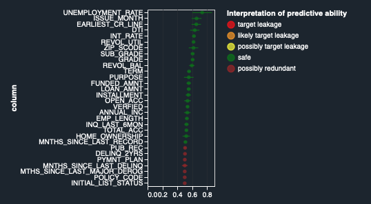</span>

<span class="c1"></span>

<span class="c1"></span>

<span class="c8">Evaluate your Dataset Modifications</span>

<span>Create a new</span> <span class="c15">Quick Model</span> <span class="c1">report to assess the impact of your modifications.</span>

<span class="c1"></span>

<span class="c1">The results should be similar to the following:</span>

*   <span class="c1">Analysis type - Quick Model</span>
*   <span class="c1">Label - LOAN_DEFAULT</span>

<span class="c1"></span>

<span class="c1"></span>

<span style="overflow: hidden; display: inline-block; margin: 0.00px 0.00px; border: 0.00px solid #000000; transform: rotate(0.00rad) translateZ(0px); -webkit-transform: rotate(0.00rad) translateZ(0px); width: 530.00px; height: 373.00px;">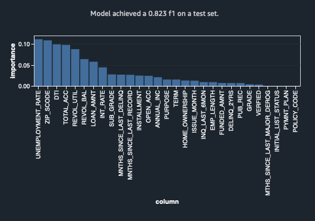</span>

<span class="c1"></span>

<span class="c1"></span>

<span class="c1"></span>

<span class="c1"></span>

<span class="c1"></span>

<span class="c1"></span>

<span class="c1">A couple of key takeaways:</span>

*   <span class="c1">UNEMPLOYMENT_RATE is ranked as the most important feature.</span>
*   <span class="c1">The F1 score increased substantially.</span>

<span class="c1">This tells us that we are likely heading in the right direction. We added a feature that generated notable improvements to the "quick model" and the new feature had the greatest impact.</span>

<span class="c1"></span>

<span class="c1"></span>

<span class="c1"></span>

<span class="c1"></span>

<span class="c1"></span>

<span class="c1"></span>

<span class="c1"></span>

<span class="c1"></span>

<span class="c1"></span>

<span class="c1"></span>

<span class="c1"></span>

<span class="c1"></span>

<span class="c1"></span>

## <span class="c18"> Generate the Dataset and Train your Model</span>

<span class="c1">Duration: 10</span>

<span class="c1"></span>

<span class="c1"></span>

<span class="c1">We are now ready to fully train and tune a model. First, we need to generate our datasets by executing the data flow that we've created.</span>

<span class="c1"></span>

<span class="c8">Export your Data Flow</span>

<span class="c1">DataWrangler supports multiple ways to export the flow for execution.</span>

<span class="c1">In this lab, you will select the option that generates a notebook that can be run to execute the flow as a SageMaker Processing job. This is the simplest option.</span>

<span class="c1"></span>

<span>Click on</span> <span class="c8">Back to data flow</span>

<span>Select the</span> <span class="c15">Export</span><span class="c1"> tab</span>

<span style="overflow: hidden; display: inline-block; margin: 0.00px 0.00px; border: 0.00px solid #000000; transform: rotate(0.00rad) translateZ(0px); -webkit-transform: rotate(0.00rad) translateZ(0px); width: 287.00px; height: 47.00px;">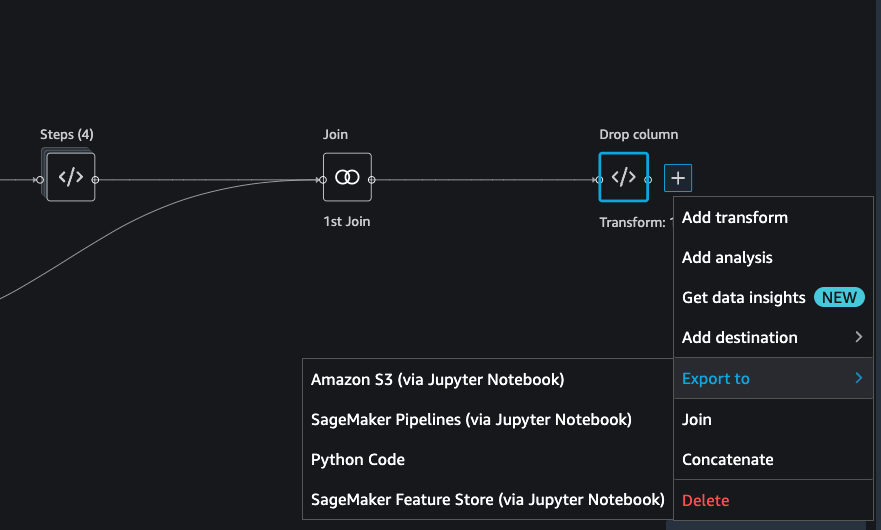</span>

<span class="c1"></span>

<span>Select the</span> <span class="c15">last step</span><span>in the flow and the last</span> <span class="c15">Drop Column</span><span class="c1"> transformation</span>

<span style="overflow: hidden; display: inline-block; margin: 0.00px 0.00px; border: 0.00px solid #000000; transform: rotate(0.00rad) translateZ(0px); -webkit-transform: rotate(0.00rad) translateZ(0px); width: 484.00px; height: 287.00px;">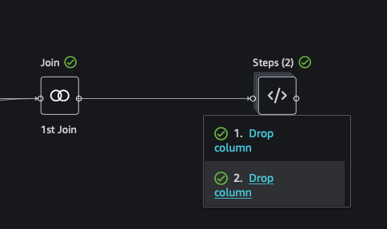</span>

<span class="c1"></span>

<span class="c1">Then click Export Step on the top right</span>

<span style="overflow: hidden; display: inline-block; margin: 0.00px 0.00px; border: 0.00px solid #000000; transform: rotate(0.00rad) translateZ(0px); -webkit-transform: rotate(0.00rad) translateZ(0px); width: 93.00px; height: 42.00px;">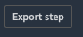</span>

<span>Select</span> <span class="c8">Save to S3</span>

<span style="overflow: hidden; display: inline-block; margin: 0.00px 0.00px; border: 0.00px solid #000000; transform: rotate(0.00rad) translateZ(0px); -webkit-transform: rotate(0.00rad) translateZ(0px); width: 417.00px; height: 412.00px;">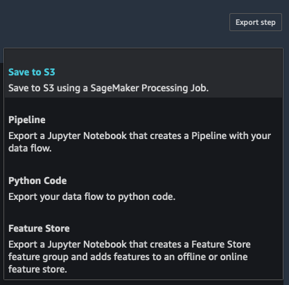</span>

<span class="c1"></span>

<span class="c1">This will generate a new notebook tab. Select the new notebook.</span>

<span style="overflow: hidden; display: inline-block; margin: 0.00px 0.00px; border: 0.00px solid #000000; transform: rotate(0.00rad) translateZ(0px); -webkit-transform: rotate(0.00rad) translateZ(0px); width: 624.00px; height: 98.67px;">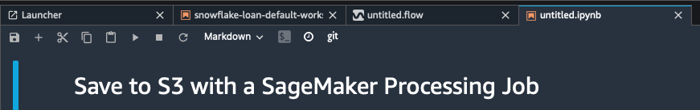</span>

<span class="c1"></span>

*   <span>Follow the steps outlined in the</span> <span class="c15">generated notebook</span><span class="c1">.</span>
*   <span class="c15">Run the cells and wait for the processing job to complete</span><span class="c1">.</span>
*   COPY the output S3 URI of the processed dataset.</span>

<span class="c1"></span>

<span class="c1">This can take a few minutes</span>

<span class="c1"></span>

<span style="overflow: hidden; display: inline-block; margin: 0.00px 0.00px; border: 0.00px solid #000000; transform: rotate(0.00rad) translateZ(0px); -webkit-transform: rotate(0.00rad) translateZ(0px); width: 624.00px; height: 129.33px;">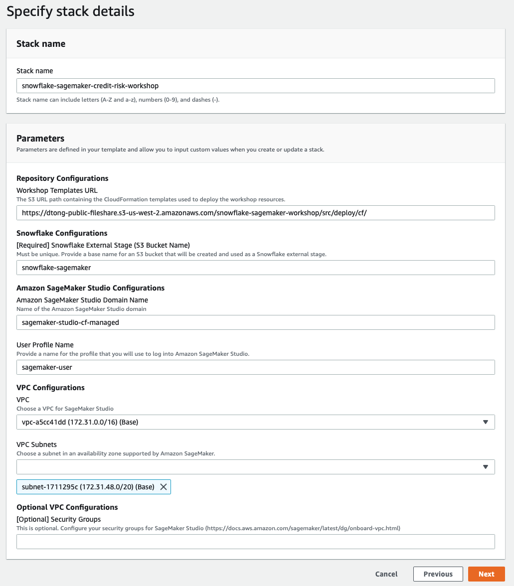</span>

<span class="c1"></span>

<span class="c1">The S3 URI will look similar to: s3://(YOUR_BUCKET)/export-flow-23-23-17-34-6a8a80ec/output/data-wrangler-flow-processing-23-23-17-34-6a8a80ec.</span>

<span class="c1"></span>

COPY the S3 URI to the PREP_DATA_S3 variable in your workshop notebook</span>

<span style="overflow: hidden; display: inline-block; margin: 0.00px 0.00px; border: 0.00px solid #000000; transform: rotate(0.00rad) translateZ(0px); -webkit-transform: rotate(0.00rad) translateZ(0px); width: 624.00px; height: 24.00px;">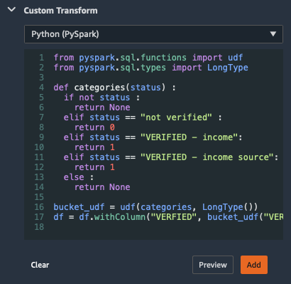</span>

<span class="c1"></span>

<span class="c1">TIP: You can monitor the processing jobs in the SageMaker Console</span>

<span style="overflow: hidden; display: inline-block; margin: 0.00px 0.00px; border: 0.00px solid #000000; transform: rotate(0.00rad) translateZ(0px); -webkit-transform: rotate(0.00rad) translateZ(0px); width: 624.00px; height: 232.00px;">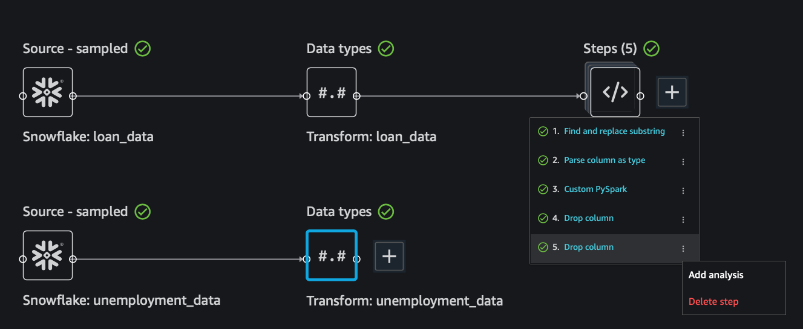</span>

<span class="c1"></span>

<span class="c1"></span>

<span class="c1"></span>

<span class="c8">Train your Model</span>

<span class="c1"></span>

<span class="c1">Subscribe to AutoGluon in the AWS Marketplace</span>

<span class="c1"></span>

<span class="c1">Next, you are going to subscribe to the AutoGluon Marketplace algorithm. This provides your account access to a SageMaker compatible container for running AutoGluon. This Marketplace algorithm is managed by AWS and doesn't have additional software costs. Marketplace algorithms are similar to SageMaker built-in algorithms. Once subscribed, you can run the algorithm to train and serve models with "low-to-no-code".</span>

<span class="c1"></span>

<span class="c1">Follow these steps to subscribe to the AWS Marketplace AutoGluon algorithm:</span>

*   <span>Click this</span> <span class="c16">[URL](https://www.google.com/url?q=https://aws.amazon.com/marketplace/pp/Amazon-Web-Services-AutoGluon-Tabular/prodview-n4zf5pmjt7ism&sa=D&source=editors&ust=1630522485039000&usg=AOvVaw2uQ7z32q6IyG4e9wKQXnoA)</span><span class="c1"> to navigate to the AutoGluon product page.</span>
*   SELECT the orange "Continue to Subscribe" button.</span>
*   <span class="c1">Run the helper function below to identify the AWS resource ID (ARN) of your AutoGluon Marketplace algorithm.</span>

<span style="overflow: hidden; display: inline-block; margin: 0.00px 0.00px; border: 0.00px solid #000000; transform: rotate(0.00rad) translateZ(0px); -webkit-transform: rotate(0.00rad) translateZ(0px); width: 624.00px; height: 72.00px;">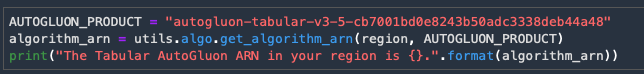</span>

<span class="c1"></span>

<span class="c1">Next, we'll configure our algorithm for remote training.</span>

<span class="c1">More details are provided in the notebook description.</span>

<span class="c1">Execute the next code cell to set the parameters for the remote training job.</span>

<span style="overflow: hidden; display: inline-block; margin: 0.00px 0.00px; border: 0.00px solid #000000; transform: rotate(0.00rad) translateZ(0px); -webkit-transform: rotate(0.00rad) translateZ(0px); width: 624.00px; height: 288.00px;">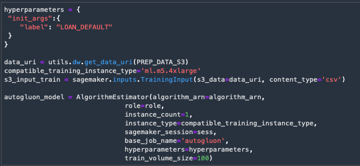</span>

<span class="c1"></span>

<span class="c1">The following cell will launch the remote training job. This will take a few minutes.</span>

<span style="overflow: hidden; display: inline-block; margin: 0.00px 0.00px; border: 0.00px solid #000000; transform: rotate(0.00rad) translateZ(0px); -webkit-transform: rotate(0.00rad) translateZ(0px); width: 415.00px; height: 34.00px;">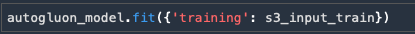</span>

<span class="c1"></span>

<span class="c1">You can monitor the training job in the SageMaker Console</span>

<span style="overflow: hidden; display: inline-block; margin: 0.00px 0.00px; border: 0.00px solid #000000; transform: rotate(0.00rad) translateZ(0px); -webkit-transform: rotate(0.00rad) translateZ(0px); width: 624.00px; height: 225.33px;">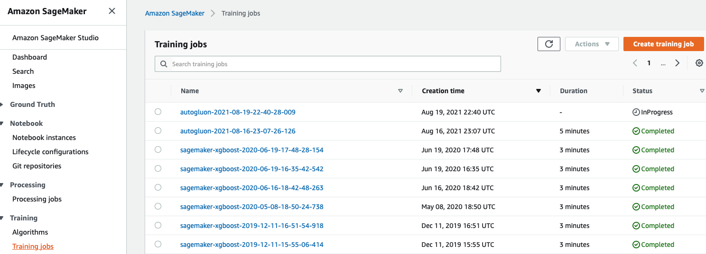</span>

<span class="c1"></span>

<span class="c1"></span>

<span class="c1"></span>

<span class="c1"></span>

<span class="c1"></span>

<span class="c1"></span>

<span class="c1"></span>

<span class="c1"></span>

<span class="c1"></span>

<span class="c1"></span>

<span class="c1"></span>

## <span class="c18"> Deploy your Model</span>

<span>Duration: 15</span>

<span class="c1"></span>

<span class="c1">You can serve your predictions in a couple of ways. You could deploy the model as a real-time hosted endpoint on SageMaker and integrate it with Snowflake as an External Function. This will enable you to query your predictions in real-time and minimize data staleness.</span>

<span class="c1"></span>

<span class="c1">Alternatively, you can pre-calculate your predictions as a transient batch process. In the following section, you will use Batch Transform to do just that. When your use case allows you to pre-calculate predictions, Batch Transform is a good option.</span>

<span class="c1"></span>

<span class="c1">In the following sections we are going to deploy our model as a batch inference pipeline. The pipeline is designed to consume data from Snowflake, process it using our DataWrangler flow and then pre-calculate predictions using our trained model and Batch Transform.</span>

<span class="c1"></span>

<span class="c8">Modify your Data Preparation flow for Inference</span>

<span class="c1"></span>

<span class="c1">First we will make a copy of our flow file.</span>

*   <span>Right click on the</span> <span class="c15">untitled.flow</span><span>file and select</span> <span class="c8">Duplicate</span>

<span style="overflow: hidden; display: inline-block; margin: 0.00px 0.00px; border: 0.00px solid #000000; transform: rotate(0.00rad) translateZ(0px); -webkit-transform: rotate(0.00rad) translateZ(0px); width: 312.79px; height: 442.50px;">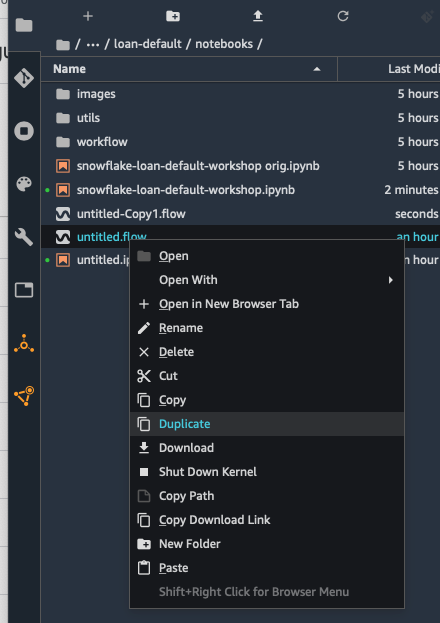</span>

*   <span>Right click on the duplicate copy -</span> <span class="c15">untitled-Copy1.flow</span> <span class="c1">and select Rename</span>
*   <span>Use</span> <span class="c15">inference_flow_loan.flow</span><span class="c1"> as the new name</span>

<span class="c1"></span>

<span class="c15">TIP:</span><span class="c1"> Click on the Folder icon on the left hand side of the screen to see the files</span>

<span class="c1"></span>

<span class="c1">Set the INFERENCE_FLOW_NAME to the new flow file in your workshop notebook.</span>

<span style="overflow: hidden; display: inline-block; margin: 0.00px 0.00px; border: 0.00px solid #000000; transform: rotate(0.00rad) translateZ(0px); -webkit-transform: rotate(0.00rad) translateZ(0px); width: 434.00px; height: 43.00px;">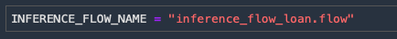</span>

<span class="c1"></span>

<span class="c15">Next we will open the new flow file by double clicking on it</span><span class="c1">.</span>

<span class="c1">We can now change the data source for the flow:</span>

*   <span>Click on the</span> <span class="c15">Data Flow</span> <span class="c1">tab at the top</span>
*   <span class="c1">Click on the + next to the Snowflake:loan_data source and select Edit Query</span>
*   <span style="overflow: hidden; display: inline-block; margin: 0.00px 0.00px; border: 0.00px solid #000000; transform: rotate(0.00rad) translateZ(0px); -webkit-transform: rotate(0.00rad) translateZ(0px); width: 396.36px; height: 299.91px;">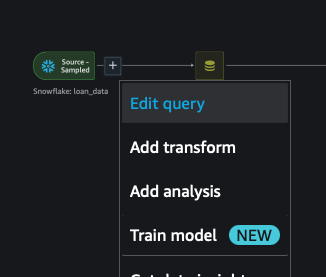</span>
*   <span class="c1">Click on the Snowflake Connection button</span>
*   <span class="c1">Replace the current SQL query with a new query that will retrieve the 20% sample data that we didn’t use for training.</span>

```

SELECT

  L1.LOAN_ID,  L1.LOAN_AMNT,   L1.FUNDED_AMNT,

  L1.TERM,   L1.INT_RATE,   L1.INSTALLMENT,

  L1.GRADE,   L1.SUB_GRADE,   L1.EMP_LENGTH,

  L1.HOME_OWNERSHIP,   L1.ANNUAL_INC,

  L1.VERIFICATION_STATUS,   L1.PYMNT_PLAN,

  L1.PURPOSE,   L1.ZIP_SCODE,   L1.DTI,

  L1.DELINQ_2YRS,   L1.EARLIEST_CR_LINE,

  L1.INQ_LAST_6MON,   L1.MNTHS_SINCE_LAST_DELINQ,

  L1.MNTHS_SINCE_LAST_RECORD,   L1.OPEN_ACC,

  L1.PUB_REC,   L1.REVOL_BAL,   L1.REVOL_UTIL,

  L1.TOTAL_ACC,   L1.INITIAL_LIST_STATUS,

  L1.MTHS_SINCE_LAST_MAJOR_DEROG,   L1.POLICY_CODE,

  L1.LOAN_DEFAULT,   L1.ISSUE_MONTH

FROM ML_LENDER_DATA.ML_DATA.LOAN_DATA_ML AS L1

 LEFT OUTER JOIN

 (SELECT * FROM ML_LENDER_DATA.ML_DATA.LOAN_DATA_ML sample block (80) REPEATABLE(100)) AS L2

 ON L1.LOAN_ID = L2.LOAN_ID

WHERE L2.LOAN_ID IS NULL;

```

*   <span>Click</span> <span class="c15">Run</span><span>and then the</span> <span class="c15">Apply</span> <span class="c1">button on the top right</span>
*   <span class="c1">Name the dataset loan_inference</span>

<span class="c1"></span>

##### <span class="c19">Re-export and re-factor your flow as a Pipeline</span>

<span>First select the</span> <span class="c15">Export</span><span class="c1"> tab at the top.</span>

<span class="c1">As previously select the last step in the flow and bottom Drop Column transform.</span>

<span style="overflow: hidden; display: inline-block; margin: 0.00px 0.00px; border: 0.00px solid #000000; transform: rotate(0.00rad) translateZ(0px); -webkit-transform: rotate(0.00rad) translateZ(0px); width: 624.00px; height: 306.67px;">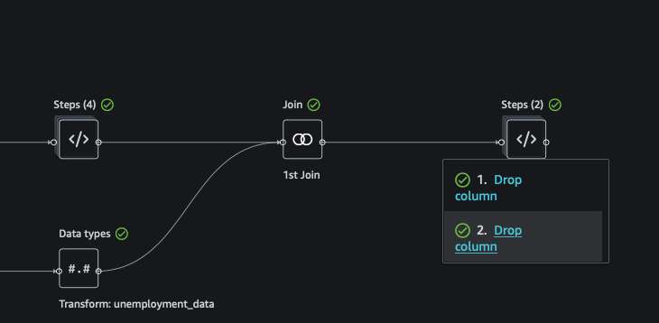</span>

<span class="c1"></span>

<span>Then click</span><span> </span><span class="c15">Export Step</span><span> on the top right and select</span> <span class="c8">Pipeline</span>

<span class="c1"></span>

<span style="overflow: hidden; display: inline-block; margin: 0.00px 0.00px; border: 0.00px solid #000000; transform: rotate(0.00rad) translateZ(0px); -webkit-transform: rotate(0.00rad) translateZ(0px); width: 319.50px; height: 370.77px;">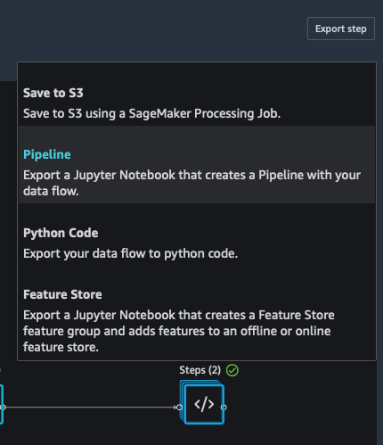</span>

<span class="c1"></span>

<span class="c1">This will generate a new notebook - inference_flow_loan.ipynb</span>

<span class="c1"></span>

<span class="c1">Scroll down in the notebook till you find the cell with output_name in it.</span>

COPY the node ID form this cell.</span>

<span style="overflow: hidden; display: inline-block; margin: 0.00px 0.00px; border: 0.00px solid #000000; transform: rotate(0.00rad) translateZ(0px); -webkit-transform: rotate(0.00rad) translateZ(0px); width: 624.00px; height: 173.33px;">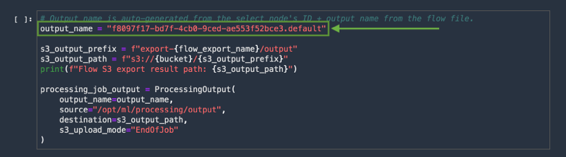</span>

<span class="c1">In practice, you will need to refactor the exported script. This has been done for you, so all you need to do is locate the export node-id. Each step in your data flow is a unique node and the export script is dependent on the node that you select for export.</span>

<span class="c1"></span>

<span class="c1"></span>

<span class="c1"></span>

##### <span>Go back to your</span> <span>workshop </span><span>notebook -</span> <span class="c15 c34">snowflake-loan-default-workshop.ipynb</span>

<span class="c1"></span>

COPY the node ID to the FLOW_NODE_ID cell and run the cell</span>

<span style="overflow: hidden; display: inline-block; margin: 0.00px 0.00px; border: 0.00px solid #000000; transform: rotate(0.00rad) translateZ(0px); -webkit-transform: rotate(0.00rad) translateZ(0px); width: 529.00px; height: 55.00px;">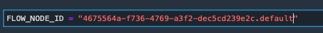</span>

<span class="c1"></span>

<span class="c1">You can run the next cell if you like to see the refactored script.</span>

<span style="overflow: hidden; display: inline-block; margin: 0.00px 0.00px; border: 0.00px solid #000000; transform: rotate(0.00rad) translateZ(0px); -webkit-transform: rotate(0.00rad) translateZ(0px); width: 351.00px; height: 43.00px;"></span>

<span class="c1"></span>

<span class="c1">Next you will run your batch scoring pipeline by executing the next cell.</span>

<span style="overflow: hidden; display: inline-block; margin: 0.00px 0.00px; border: 0.00px solid #000000; transform: rotate(0.00rad) translateZ(0px); -webkit-transform: rotate(0.00rad) translateZ(0px); width: 580.00px; height: 473.00px;">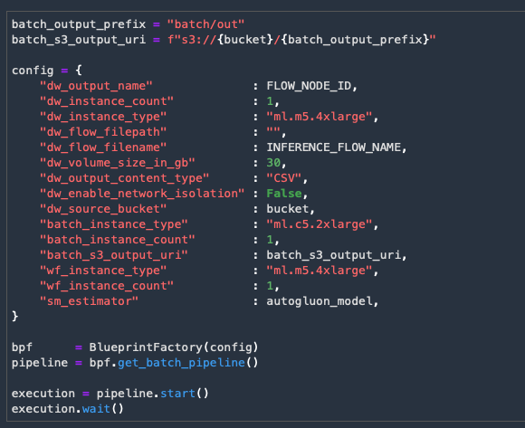</span>

<span class="c1">This will process the data prep steps and then run batch inference using the model that was previously trained. This steps will take some time to complete.</span>

<span class="c1"></span>

<span class="c1">You can monitor the pipeline in SageMaker Studio.</span>

*   SELECT the SageMaker resources icon on the left hand menu bar</span>
*   <span style="overflow: hidden; display: inline-block; margin: 0.00px 0.00px; border: 0.00px solid #000000; transform: rotate(0.00rad) translateZ(0px); -webkit-transform: rotate(0.00rad) translateZ(0px); width: 267.00px; height: 90.00px;">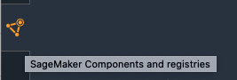</span>
*   SELECT Pipelines from the drop down menu</span>
*   <span style="overflow: hidden; display: inline-block; margin: 0.00px 0.00px; border: 0.00px solid #000000; transform: rotate(0.00rad) translateZ(0px); -webkit-transform: rotate(0.00rad) translateZ(0px); width: 462.00px; height: 416.00px;">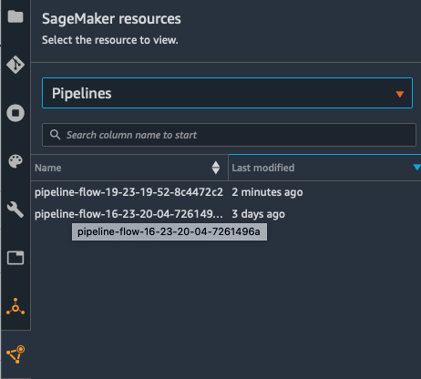</span>
*   <span>Right click on your pipeline and select</span> <span class="c8">Open pipeline details</span>
*   <span style="overflow: hidden; display: inline-block; margin: 0.00px 0.00px; border: 0.00px solid #000000; transform: rotate(0.00rad) translateZ(0px); -webkit-transform: rotate(0.00rad) translateZ(0px); width: 491.00px; height: 248.00px;">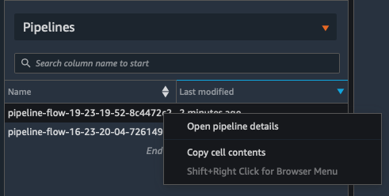</span>
*   <span>This will open a pipeline tab. Right click on the status of the pipeline and select</span> <span class="c8">Open execution details</span>
*   <span style="overflow: hidden; display: inline-block; margin: 0.00px 0.00px; border: 0.00px solid #000000; transform: rotate(0.00rad) translateZ(0px); -webkit-transform: rotate(0.00rad) translateZ(0px); width: 546.00px; height: 448.00px;">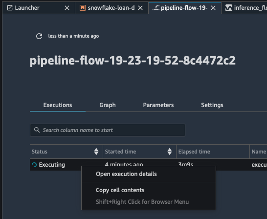</span>
*   <span class="c1">This opens tab with the pipeline steps. You can click on each step to get more information.</span>
*   <span style="overflow: hidden; display: inline-block; margin: 0.00px 0.00px; border: 0.00px solid #000000; transform: rotate(0.00rad) translateZ(0px); -webkit-transform: rotate(0.00rad) translateZ(0px); width: 624.00px; height: 694.67px;">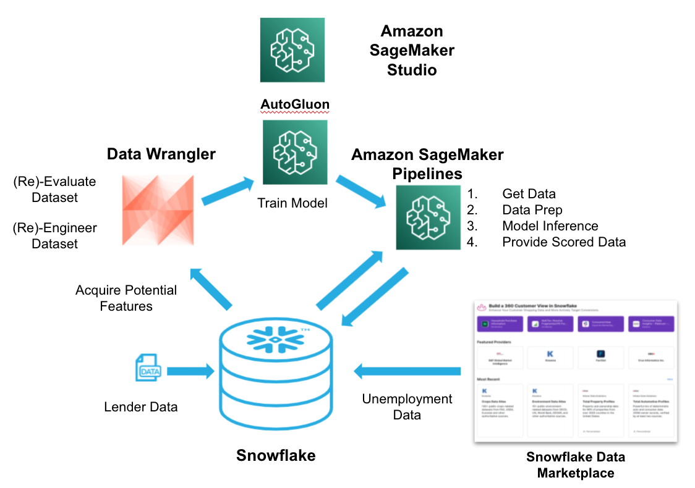</span>
*   <span class="c1"></span>

<span class="c1"></span>

<span class="c1"></span>

<span class="c1"></span>

<span class="c1"></span>

<span class="c1"></span>

## <span class="c18"> Evaluate Model Performance and Write Back to Snowflake</span>

<span class="c1">Duration: 5</span>

<span class="c1"></span>

<span class="c1">Since the data set is small enough we can load it to a local pandas dataframe and review the results.</span>

<span class="c1"></span>

<span class="c1">The next cell will load the data set and provide an output of the results.</span>

<span style="overflow: hidden; display: inline-block; margin: 0.00px 0.00px; border: 0.00px solid #000000; transform: rotate(0.00rad) translateZ(0px); -webkit-transform: rotate(0.00rad) translateZ(0px); width: 624.00px; height: 185.33px;">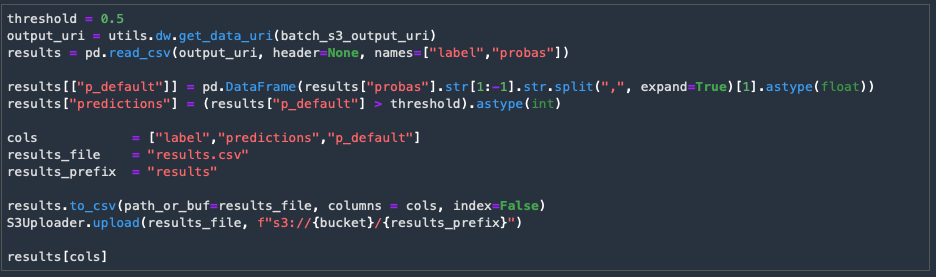</span>

<span class="c1"></span>

<span class="c1">We can use some utilities to evaluate how well the model performed using the test data set.</span>

<span class="c1">Execute next 2 cells</span>

<span style="overflow: hidden; display: inline-block; margin: 0.00px 0.00px; border: 0.00px solid #000000; transform: rotate(0.00rad) translateZ(0px); -webkit-transform: rotate(0.00rad) translateZ(0px); width: 529.00px; height: 327.00px;">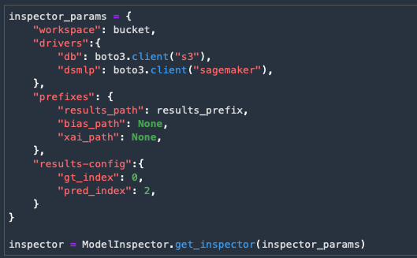</span>

<span style="overflow: hidden; display: inline-block; margin: 0.00px 0.00px; border: 0.00px solid #000000; transform: rotate(0.00rad) translateZ(0px); -webkit-transform: rotate(0.00rad) translateZ(0px); width: 297.00px; height: 72.00px;">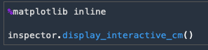</span>

<span class="c1">The last cell will provide an interactive chart to see how well the model performed based on the threshold we set for the prediction.</span>

<span class="c1"></span>

<span class="c1"></span>

#### <span class="c27">Writeback to Snowflake</span>

<span>Typically for large batch transforms we will use Snowflake’s automated capability to read data from S3 called</span> <span class="c16">[Snowpipe](https://www.google.com/url?q=https://docs.snowflake.com/en/user-guide/data-load-snowpipe-intro.html&sa=D&source=editors&ust=1630522485052000&usg=AOvVaw3SYNoOa8q-n-WBbpQ08pk5)</span><span>, or alternatively the</span> <span class="c16">[COPY](https://www.google.com/url?q=https://docs.snowflake.com/en/sql-reference/sql/copy-into-table.html&sa=D&source=editors&ust=1630522485052000&usg=AOvVaw3n_81V0gfo_TCKcXmv77oQ)</span><span class="c1"> command to perform bulk loads. Since this data set is in a dataframe we can use the Python connector to write it directly back to Snowflake.</span>

<span class="c1"></span>

<span>First we will use the AWS Secret we create with the CloudFormation template. Go to the [</span><span class="c15">Secrets Manager Console</span><span>](https://console.aws.amazon.com/secretsmanager/home). Select the Snowflake Secret and copy the Secret Name i.e.</span> <span class="c13">SnowflakeSecret-P4qyGUyk67hj</span><span> in the cell below.  </span>

<span class="c1"></span>

<span style="overflow: hidden; display: inline-block; margin: 0.00px 0.00px; border: 0.00px solid #000000; transform: rotate(0.00rad) translateZ(0px); -webkit-transform: rotate(0.00rad) translateZ(0px); width: 389.00px; height: 40.00px;">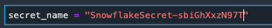</span>

<span class="c1"></span>

<span class="c1">The next cell creates a function to retrieve AWS Secrets for use in the notebook. RUn the cell.</span>

<span style="overflow: hidden; display: inline-block; margin: 0.00px 0.00px; border: 0.00px solid #000000; transform: rotate(0.00rad) translateZ(0px); -webkit-transform: rotate(0.00rad) translateZ(0px); width: 390.00px; height: 261.00px;"></span>

<span class="c1"></span>

<span class="c1">The next cell will establish a connection with Snowflake using the secret’s information.</span>

<span style="overflow: hidden; display: inline-block; margin: 0.00px 0.00px; border: 0.00px solid #000000; transform: rotate(0.00rad) translateZ(0px); -webkit-transform: rotate(0.00rad) translateZ(0px); width: 500.00px; height: 274.00px;"></span>

<span class="c1"></span>

<span class="c1">The last cell will write the dataframe data into a Snowflake table.</span>

<span class="c1"></span>

<span class="c1">TIP: The same connection can be used to read data from Snowflake as well as issue Snowflake commands to help process data.</span>

<span class="c1"></span>

<span style="overflow: hidden; display: inline-block; margin: 0.00px 0.00px; border: 0.00px solid #000000; transform: rotate(0.00rad) translateZ(0px); -webkit-transform: rotate(0.00rad) translateZ(0px); width: 624.00px; height: 93.33px;">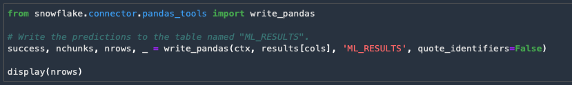</span>

<span class="c1"></span>

<span class="c1"></span>

<span class="c1">Congratulations you have completed the lab.</span>

<span class="c1"></span>

<span class="c1"></span>

<span class="c1"></span>

<span class="c1"></span>

<span class="c1"></span>

* * *

<span class="c1"></span>

<span class="c1"></span>

## <span class="c18"> Conclusions & Next Steps</span>

<span class="c1">Duration: 5</span>

<span class="c1"></span>

<span class="c1">In this lab we build an example of how you can enrich your internal data with Snowflake Data marketplace data to improve the performance of your Machine Learning Models. We also covered how you can integrate Data Wrangler with Snowflake to gain access to the data and drive pipelines for your ML models.</span>

<span class="c1"></span>

<span class="c1">Additionally we covered how you can use SageMaker Studio and deploy CloudFormation Templates to create prebuild kernels with the Snowflake Python Connector prebuild. Also how to deploy the Snowflake Storage Integrations with a CloudFormation template and using AWS Secrets Manager to provide more secure connections with Snowflake.</span>

<span class="c1"></span>

<span class="c1"></span>

<span class="c1">Related Resources</span>

*   <span class="c1">[Snowflake Data Marketplace](https://docs.snowflake.com/en/user-guide/data-marketplace.html)</span>
*   <span class="c1">[SageMaker Data Wrangler](https://aws.amazon.com/sagemaker/data-wrangler/)</span> 
*   <span class="c1">[SageMaker Studio](https://aws.amazon.com/sagemaker/studio/)</span>  


<span class="c1"></span>
