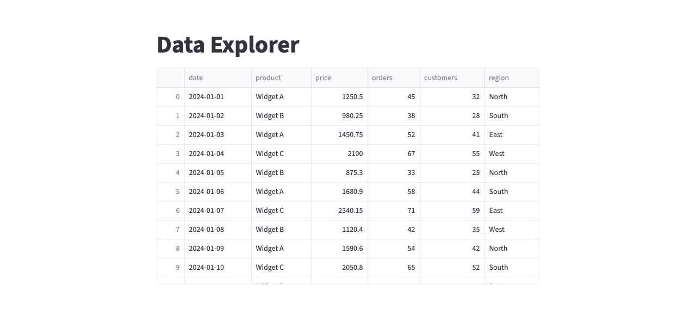
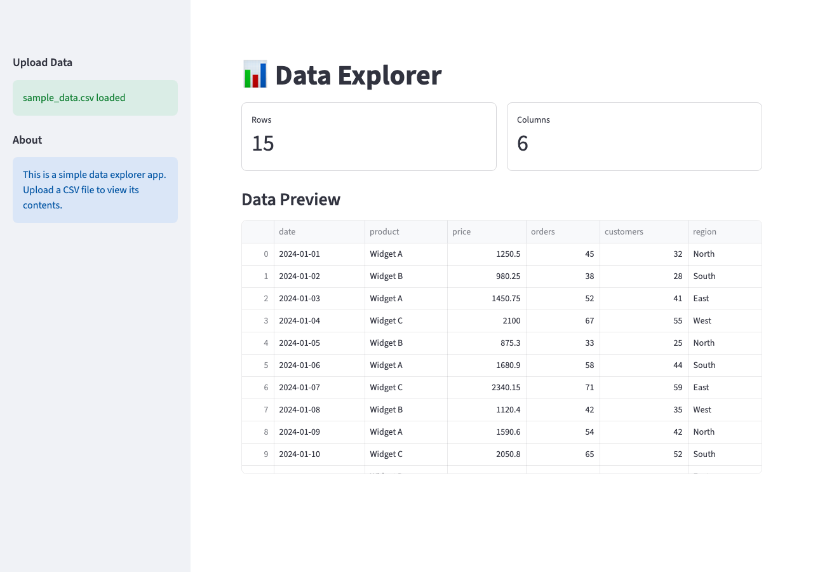
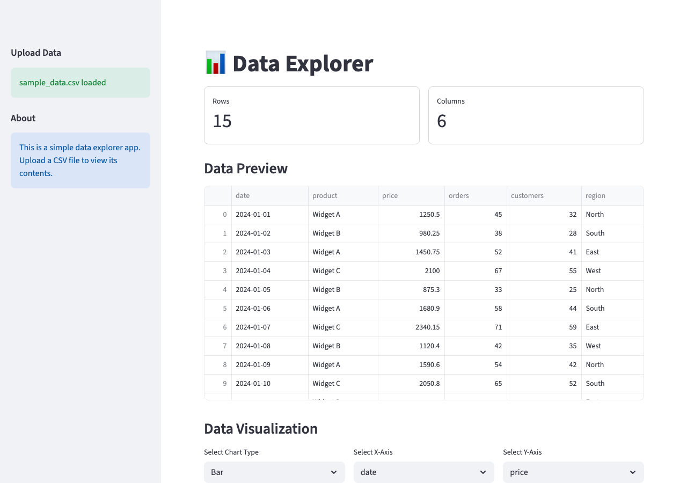
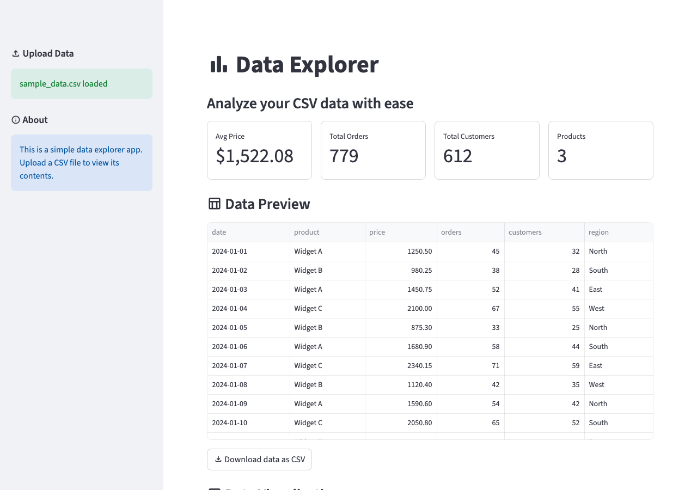
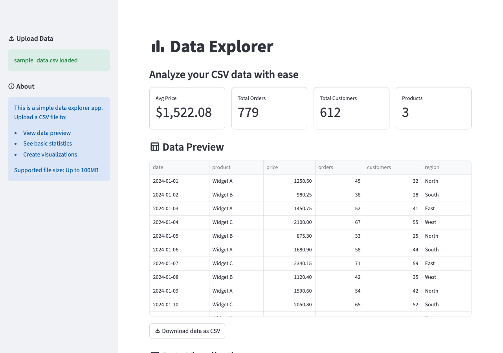

author: Chanin Nantasenamat
id: vibe-code-a-streamlit-app
summary: Build a complete data explorer app through iterative prompting — no manual coding required. Learn the vibe coding workflow, effective prompt patterns, and how to steer AI output using follow-up corrections.
categories: snowflake-site:taxonomy/solution-center/certification/quickstart,snowflake-site:taxonomy/product/ai
language: en
environments: web
status: Published
feedback link: https://github.com/Snowflake-Labs/sfguides/issues


# Vibe Code a Streamlit App
<!-- ------------------------ -->
## Overview

Vibe coding flips the traditional development loop. Instead of writing code line by line, you have a conversation like: *"Build me a dashboard," "Add a sidebar with filters," and "Make the chart interactive."* AI then generates the code, you see the result, and you keep going until it's right.

Streamlit is the ideal framework for vibe coding because:
- **Visual feedback loop**: Save the file, see the app update instantly. You know immediately if the AI got it right.
- **Pattern-friendly**: Most Streamlit apps follow recognizable patterns (cache data, build layout, handle state). AI assistants excel at these.
- **Low boilerplate**: A working app can be 20 lines. This means fewer things for the AI to get wrong and faster iterations.
- **Progressive complexity**: Start simple, add features through conversation. Each prompt builds on what's already there.

This guide walks you through building a real data explorer app from scratch, no manual coding required. By the end, you'll know which prompt patterns actually work, what to do when the AI goes sideways, and how to go from a blank file to a polished app in under 30 minutes.

### What You'll Build

A data explorer app that lets users upload a CSV, view key metrics, visualize data with interactive charts, and handle edge cases gracefully — all built through iterative prompting.

### What You'll Learn

- The vibe coding workflow: describe, generate, see, refine
- How to write effective prompts for Streamlit development
- When to iterate on a prompt vs. start fresh
- How to handle edge cases and errors through conversation
- Prompt patterns that consistently produce good Streamlit code

### Prerequisites

- AI coding assistant (e.g. [Cortex Code](https://signup.snowflake.com/cortex-code?utm_source=snowflake-devrel&utm_medium=developer-guides&utm_cta=developer-guides), Claude Code, Cursor, Gemini CLI, etc.) or cloud-based LLMs (e.g. ChatGPT, Claude, Gemini, etc.)
- Python 3 installed
- Streamlit installed (`pip install streamlit`)
- No prior Streamlit experience needed. The AI handles the code

<!-- ------------------------ -->
## The Vibe Coding Workflow

Before we start building, let's understand the workflow. Vibe coding follows a simple loop:

1. **Describe** what you want in plain English
2. **Generate**: the AI writes the code
3. **See**: run the app and look at the result
4. **Refine**: tell the AI what to change

Your role shifts from *"programmer"* to *"product designer."* You decide what the app should do and how it should feel. The AI handles implementation. You'll still glance at the code occasionally, mostly to make sure the AI didn't do something obviously wrong, but you'll spend 90% of your time describing and evaluating, not typing.

### When to Iterate vs. When to Restart

- **Iterate** when the app is 70%+ correct and needs tweaks
- **Restart** when the AI went in a fundamentally wrong direction
- **Rule of thumb**: If your correction prompt is longer than the original prompt, consider starting over with a better initial description

Why this matters: AI assistants build on their previous output. If the foundation is wrong (wrong architecture, wrong data flow, wrong assumptions about your data), each iteration digs the hole deeper. A fresh prompt with better context is faster than 10 correction prompts fighting a bad start.

### The Prompt Spectrum

Prompts exist on a spectrum from vague to specific:

- Too vague: *"Make a dashboard"* — AI guesses everything, probably wrong
- Too specific: *"Create a st.columns(3) with st.metric in each, using border=True, with values from df['price'].sum()"* — You're just dictating code
- Just right: *"Build a dashboard with three KPI cards at the top showing revenue, orders, and customers. Add a line chart below for trends over time."* — Clear intent, flexible implementation

<!-- ------------------------ -->
## The First Prompt

Let's start building. Open your AI coding assistant and type:

```
Build a Streamlit data explorer app. I want to upload a CSV file
and see the data in a table. Keep it simple for now.
```

The AI generates something like this:

```python
import streamlit as st
import pandas as pd

st.set_page_config(page_title="Data Explorer", layout="centered")
st.title("Data Explorer")

uploaded_file = st.file_uploader("Upload a CSV file", type=["csv"])

if uploaded_file is not None:
    df = pd.read_csv(uploaded_file)
    st.dataframe(df)
else:
    st.info("Upload a CSV file to get started.")
```

Run it:

```bash
streamlit run app.py
```

You should see a file upload widget and, after uploading a CSV, a data table. It works, but it's bare-bones. That's fine. We'll build from here.

### What to Look For

After the AI generates code, do a quick sanity check:
- Does it import streamlit?
- Does it have `st.set_page_config()`?
- Does it use `st.file_uploader()` with a sensible file type filter?
- Does it handle the case where no file is uploaded yet?

If any of these are missing, mention it in your next prompt. The AI will fix it.



<!-- ------------------------ -->
## Improve the Layout

The app works, but it's a single column with everything stacked. Now refine the structure:

```
Move the file upload to the sidebar. Show the number of rows and
columns as metrics above the table. Use wide layout.
```

The AI restructures the app to something like this:

```python
st.set_page_config(page_title="Data Explorer", layout="wide")

with st.sidebar:
    uploaded_file = st.file_uploader("Upload a CSV file", type=["csv"])

st.title("Data Explorer")

if uploaded_file is not None:
    df = pd.read_csv(uploaded_file)
    col1, col2 = st.columns(2)
    col1.metric("Rows", df.shape[0])
    col2.metric("Columns", df.shape[1])
    st.dataframe(df)
```

Notice how we described what we wanted, not how to code it. We said *"metrics above the table,"* not *"use `st.columns(2)` with `st.metric` inside."* This is the core discipline of vibe coding: own the intent, delegate the implementation.



<!-- ------------------------ -->
## Add Charts

The layout is clean. Now make the data visual:

```
Add a chart section below the table. Let me pick the chart type
(bar, line, scatter) and choose which columns to use for X and Y
axes. Only show numeric columns for the Y axis.
```

The AI adds `st.selectbox` widgets for chart type and column selection and filters columns by dtype. It will likely reach for Plotly or Altair for the charts. That works, but Streamlit's built-in chart functions are simpler and keep the dependency list short. A quick follow-up fixes that:

```
Use Streamlit's built-in chart functions instead of Plotly.
```

Now the code uses native charts:

```python
numeric_cols = df.select_dtypes(include="number").columns.tolist()
all_cols = df.columns.tolist()

chart_type = st.selectbox("Chart type", ["bar", "line", "scatter"])
x_col = st.selectbox("X axis", all_cols)
y_col = st.selectbox("Y axis", numeric_cols)

if chart_type == "bar":
    st.bar_chart(df.set_index(x_col)[y_col])
elif chart_type == "line":
    st.line_chart(df.set_index(x_col)[y_col])
elif chart_type == "scatter":
    st.scatter_chart(df, x=x_col, y=y_col)
```

This is where vibe coding shines. Describing a feature like *"only show numeric columns for Y axis"* is one sentence for you but several lines of code for the AI. And when the AI picks a heavier library than you need, a single follow-up sentence is all it takes to course-correct.



<!-- ------------------------ -->
## Style and Polish

The app is functional. Now make it feel finished:

```
Add material icons to the section headers. Replace the generic row/column
metrics with meaningful ones: average price, total orders, total customers,
and number of products. Add conditional formatting to the data table and
a download button.
```

The AI's first attempt will probably use emoji for icons and pull in a third-party table library. That is functional, but Streamlit has native solutions for all of these. Steer it with a follow-up:

```
Use Streamlit's :material/icon_name: syntax for icons instead of emoji.
Use st.column_config for conditional formatting on st.dataframe.
```

If the result still has stray dependencies or emoji shortcodes, one more nudge finishes the job:

```
Remove any third-party table dependencies. Use st.dataframe with the
st.column_config you already defined. For icons, use the :material/icon_name:
syntax everywhere.
```

After these corrections the AI adds `:material/icon_name:` syntax to headers, replaces generic metrics with data-specific ones, adds column configuration to the dataframe, and adds `st.download_button`. Two rounds of feedback, each a few sentences, and the app now uses only built-in Streamlit features.



<!-- ------------------------ -->
## Handle Edge Cases

The happy path works. Now think about what could go wrong:

```
Handle these edge cases:
- No file uploaded yet: show a friendly message with upload instructions
- File has no numeric columns: hide the chart section and explain why
- File is empty: show a warning
- Very large files: show a warning if over 100MB
```

This is one of the most underrated vibe coding patterns. You don't need to think about `if/else` logic or error handling code. Just describe what should happen when things go wrong, and the AI figures out the implementation. Plain English bullet points become guardrails.



<!-- ------------------------ -->
## Prompt Patterns That Work

After building the app across 5 rounds, here are the prompt patterns that consistently produce good results:

### 1. Start Broad, Then Narrow
Start with the big picture, then zoom into details in subsequent prompts. Don't try to specify everything in prompt one.

### 2. Describe the User Experience
*"When the user clicks X, they should see Y"* is more effective than *"add an on_click callback that updates session state."* Why: the AI knows Streamlit's event model better than most developers. Describing the desired behavior lets it pick the right mechanism (whether that's `st.session_state`, a callback, or a simple re-run) rather than locking it into an approach that might not fit.

### 3. Reference What Exists
*"In the sidebar, below the file upload, add a multiselect for columns."* This tells the AI where to put things relative to what already exists.

### 4. Show, Don't Tell (for Design)
*"Make it look like a data dashboard with KPI cards at the top, filters on the left, and charts below"* gives the AI a concrete reference.

### 5. Batch Related Changes
Instead of 5 separate prompts for 5 small changes, combine them: *"Fix these issues: the chart title is cut off, add a divider between sections, move the download button below the chart, add tooltips to the metrics, and change the date format to MM/DD."*

### 6. The "What If" Pattern
*"What happens if someone uploads a file with 1 million rows? Or a file with special characters in column names?"* This proactively surfaces edge cases.

<!-- ------------------------ -->
## Common Pitfalls

### Over-Specifying
Telling the AI exactly which Streamlit functions to use defeats the purpose. You're coding with extra steps. Describe intent instead.

### Not Running Between Iterations
Run the app after every prompt. Stacking 5 changes without running risks compounding errors that are hard to untangle. When something breaks after 5 unverified rounds, you won't know which prompt introduced the bug, and neither will the AI. Frequent runs give you a known-good checkpoint to describe from: *"The chart was working after round 3, but now it's gone"* is far more actionable than *"something broke."* If the app crashes, Streamlit shows the traceback directly in the browser. Paste that exact error message into your AI assistant as your next prompt. Don't paraphrase it; the raw traceback gives the AI the context it needs to fix the problem.

### Ignoring the AI's Code
You don't need to read every line, but do a 30-second scan after each round. Look for:
- `st.experimental_*` functions, which are deprecated; prompt the AI: *"Replace any deprecated `st.experimental_*` calls with their current equivalents."*
- Hardcoded file paths like `/Users/yourname/...`, which break on other machines.
- `st.cache` instead of `st.cache_data` or `st.cache_resource`. The old decorator was removed and will cause an error in current Streamlit versions.

### Too Many Changes at Once
If a prompt asks for 10 things and the AI gets 3 wrong, you don't know which prompts worked and can't isolate what to fix. Keep rounds focused: 2-4 changes per prompt. The exception is the "Batch Related Changes" pattern, where grouping 5 small visual tweaks into one prompt is fine because they're independent and low-risk. The rule is about avoiding large, interdependent changes in a single round.

### Not Saving Checkpoints
Before a major change, save a copy. If the AI breaks the app, you can roll back instead of trying to describe the undo. The fastest way:

```bash
cp app.py app_checkpoint.py
```

If the next round goes wrong, restore it with:

```bash
cp app_checkpoint.py app.py
```

If you're using Git, a single commit before each round works even better: `git add app.py && git commit -m "checkpoint before round 5"`. Then `git restore app.py` to undo.

<!-- ------------------------ -->
## The Final App

After 5 rounds of vibe coding, you have a data explorer with:
- CSV upload with validation
- Responsive layout with sidebar controls
- Data-specific metrics in bordered cards
- Interactive charts with column selection
- Material icons and polished column formatting
- Edge case handling and error messages

Here's how each prompt built on the last:

| Round | Prompt | What It Added |
|-------|--------|---------------|
| 1 | "Build a Streamlit data explorer app. I want to upload a CSV file and see the data in a table. Keep it simple for now." | File uploader, data table, basic page structure |
| 2 | "Move the file upload to the sidebar. Show the number of rows and columns as metrics above the table. Use wide layout." | Sidebar, `st.metric` cards, wide layout |
| 3 | "Add a chart section below the table. Let me pick the chart type and choose which columns to use for X and Y axes. Only show numeric columns for the Y axis." | Bar/line/scatter charts, axis selectors, dtype filtering |
| 4 | "Add material icons to the section headers. Replace the generic row/column metrics with meaningful ones: average price, total orders, total customers, and number of products. Add conditional formatting to the data table and a download button." | `:material/` icons, data-specific metrics, `st.column_config`, download button |
| 5 | "Handle these edge cases: no file uploaded yet, file has no numeric columns, file is empty, very large files over 100MB." | File size guard, empty-file check, friendly error messages, Getting Started placeholder |

Total time: ~20 minutes of prompting. No manual code written.

Compare this to building the same app manually: you'd need to know the Streamlit API, figure out layout patterns, handle edge cases, style the components. Easily 2-3 hours even for an experienced developer.

### Tips for Better Results

1. **Use the right AI assistant**: Cortex Code has Streamlit agent skills built in, which means it knows current APIs and patterns. Other assistants may use outdated patterns unless you install the [Streamlit Agent Skills](https://github.com/streamlit/agent-skills).
2. **Keep the conversation focused**: One app per conversation. Starting a new feature? Consider a new conversation if the context is getting long.
3. **Provide sample data**: If your app works with specific data, show the AI a few rows. *"The CSV has columns: date, product, price, orders, customers, region"* is much better than *"a CSV file."*
4. **Ask for explanations when confused**: *"Why did you use @st.cache_data here?"* The AI explains, and you learn Streamlit along the way.
5. **Save your best prompts**: When a prompt produces great results, save it. You'll reuse it for similar apps.

<!-- ------------------------ -->
## Conclusion And Resources

Congratulations! You've successfully built a complete Streamlit app without writing a single line of code manually. Vibe coding with Streamlit works because the framework's simplicity and visual feedback loop align perfectly with the describe-generate-see-refine workflow.

### What You Learned
- The vibe coding workflow follows four steps: **Describe** what you want, **Generate** the code with AI, **See** the result by running the app, and **Refine** with follow-up prompts
- Vibe coding is about describing intent, not dictating implementation
- Good prompts describe the user experience, not the code structure
- Handle edge cases by describing failure scenarios in plain English
- Running the app after every prompt is essential for catching issues early

### Next Steps
1. **Try it with your data**: Replace the CSV upload with a Snowflake connection: *"Connect to Snowflake and load data from my ORDERS table"*
2. **Deploy it**: [Deploy this app to Streamlit Community Cloud](https://www.youtube.com/watch?v=HKoOBiAaHGg) or [Deploy/Connect to Snowflake](https://www.youtube.com/watch?v=SgWxkAdjK78)
3. **Explore the agent skills**: Towards agentic engineering by reading this guide: [Build Streamlit Apps with Agent Skills](https://www.snowflake.com/en/developers/guides/build-streamlit-apps-with-agent-skills/)

### Related Resources
- [streamlit/agent-skills on GitHub](https://github.com/streamlit/agent-skills): Agent skills for better AI-generated Streamlit code
- [Streamlit Documentation](https://docs.streamlit.io/): Official docs
- [Cortex Code](https://docs.snowflake.com/en/user-guide/cortex-code/cortex-code): Snowflake's AI coding CLI
