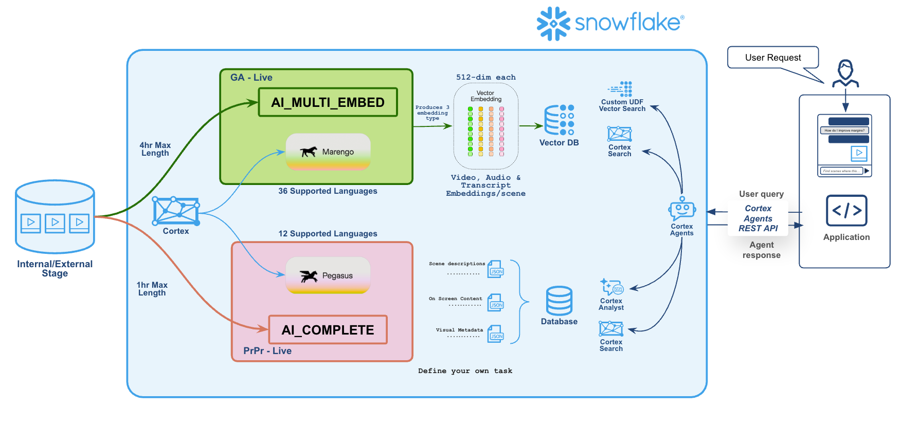

author: Akhil Ramasagaram
id: video-search-with-twelve-labs-on-snowflake
summary: Turn your video library into a searchable, queryable asset using Twelve Labs Marengo and Pegasus models running natively in Snowflake Cortex.
categories: snowflake-site:taxonomy/solution-center/partners/technology-partner
environments: web
status: Published
feedback link: https://github.com/Snowflake-Labs/sfquickstarts/issues
tags: Cortex, AI, Video, Twelve Labs, Marengo, Pegasus, Embeddings, Vector Search, Multimodal

# Cortex Can Now Watch, Hear & Understand Video: Twelve Labs on Snowflake

<!-- ------------------------ -->
## Overview
Duration: 5

Video is now the most produced, most consumed, and least understood data in the enterprise.

It accounts for over 80% of consumer internet traffic. Inside organizations, it is everywhere — marketing libraries with tens of thousands of creatives, sports archives spanning decades of broadcast footage, surveillance feeds running 24/7, training content, earnings calls, user-generated media, and content libraries worth billions.

And yet, almost none of it is queryable. It sits in cold storage as a cost line, not an asset.

The reason is simple: there was no GPT moment for video. Text got transformers, embeddings, and reasoning models — and overnight, an entire ecosystem of search, summarization, and analysis emerged. Video had nothing equivalent. Computer vision recognized objects in frames but could not understand narrative, emotion, or temporal flow. Transcription captured speech but missed everything visual. The modalities stayed siloed. Enterprise video remained dark data.

**That changes now.**

### Prerequisites
- A Snowflake account with access to Snowflake Cortex
- An internal or external stage containing video files (MP4, MOV, etc.)
- Basic familiarity with SQL

### What You'll Learn
- How Twelve Labs Marengo and Pegasus models work inside Snowflake Cortex
- How to generate multimodal video embeddings with `AI_MULTI_EMBED`
- How to analyze video content with `AI_COMPLETE` (Pegasus)
- How to search your video library using Cortex Search and Cortex Agents

### What You'll Build
- A searchable video embedding table powered by Marengo
- A video analysis pipeline powered by Pegasus
- A natural language video search interface using Cortex Agents

<!-- ------------------------ -->
## Why Twelve Labs
Duration: 3

Twelve Labs built the first video-native AI — models that learn from video the way humans do: ingesting visuals, audio, and speech simultaneously across time. Not frame-by-frame analysis. Not audio and video processed in separate pipelines. A unified, temporal understanding of what is happening in the content.

Two models power this:

**Marengo** — the perception engine. A multimodal encoder that converts video into 512-dimensional embeddings capturing visual content, audio patterns, and spoken language in a single representation. Think of it as what text embedding models did for documents, but for video.

**Pegasus** — the reasoning engine. A video-language model that watches video and generates text: summaries, structured metadata, answers to questions, scene descriptions. Think of it as what GPT did for text, but for video.

Together, they give you both sides of the intelligence stack. Marengo handles **retrieval** — finding the right moment in a massive library. Pegasus handles **understanding** — telling you what that moment means.

<!-- ------------------------ -->
## Why This Matters on Snowflake
Duration: 3

Your campaign data, audience segments, content metadata, and spend already live in Snowflake. Until now, the video that generated all of that data was locked outside the analytics layer.

With Twelve Labs models running natively inside Snowflake Cortex:

- **Video never leaves your account.** Embeddings are generated in-place. No data movement, no external API calls, no security exceptions.
- **It's SQL.** Not a separate platform, not a Python SDK, not a new vendor to onboard. A function call in a query.
- **It joins.** Video-derived signals sit in the same tables as your structured data. Content intelligence meets performance metrics in a single query.
- **It's governed.** Row-level policies, role-based access, audit logs — all apply to video-derived data the same way they apply to everything else in Snowflake.

<!-- ------------------------ -->
## Architecture
Duration: 2



Videos live on a Snowflake stage — internal or external (S3, GCS, Azure). Cortex routes them through Marengo for embeddings and Pegasus for reasoning. The outputs land in Snowflake tables — vectors in a Vector DB, structured metadata in a Database — where Cortex Search, Cortex Analyst, and Cortex Agents make them queryable from applications via REST API.

<!-- ------------------------ -->
## Embed: Generate Multimodal Video Embeddings
Duration: 5

One function call turns your entire video library into a searchable vector database.

```sql
SELECT AI_MULTI_EMBED(
    'twelvelabs-marengo-embed-3-0',
    TO_FILE(@my_stage, relative_path)  -- works with internal or external stages
) AS embeddings
FROM video_catalog;
```

Marengo processes each video end-to-end and returns a structured object containing embeddings across three modalities. Each modality produces one or more segments depending on the video's length and content, with every segment represented as a 512-dimensional vector:

| Field | Type | Description |
|---|---|---|
| `embeddings.value[n].embedding` | `VECTOR(FLOAT, 512)` | The embedding vector for a single segment |
| `embeddings.value[n].modality` | `VARCHAR` | One of `visual`, `audio`, or `transcription` |
| `embeddings.value[n].start_offset_sec` | `FLOAT` | Start timestamp (seconds) of the segment |
| `embeddings.value[n].end_offset_sec` | `FLOAT` | End timestamp (seconds) of the segment |

The number of segments varies by video length and modality — a 2-minute video might produce 10 visual segments, 8 audio segments, and 12 transcription segments. Each captures a different facet of the content: what is on screen, what is heard, and what is spoken (supporting 36 languages).

Your video library becomes a vector database — searchable with plain text.

<!-- ------------------------ -->
## Analyze: Video Reasoning with Pegasus
Duration: 5

```sql
SELECT AI_COMPLETE(
    'twelvelabs-pegasus-1-2',
    'What are the main characters doing? Identify any historical references.',
    TO_FILE(@my_stage, relative_path)  -- works with internal or external stages
) AS analysis
FROM video_catalog;
```

One function call. No frame extraction. No transcription pipeline. No pre-processing. Pegasus watches the video and reasons about it — returning free-text answers, structured metadata, or whatever your prompt asks for.

<!-- ------------------------ -->
## Search: Natural Language Video Retrieval
Duration: 5

Once your video embeddings are stored, **Cortex Search** indexes them and makes your entire library queryable from natural language — no manual tags, no keyword matching, no content taxonomies to maintain.

For advanced use cases, **Cortex Agents** can orchestrate multi-vector search across modalities — combining visual, audio, and transcription signals with custom ranking strategies, all through tool calling. Describe what you are looking for in plain language, and the agent retrieves the most relevant moments from across your video library.

| Twelve Labs Capability | Snowflake Surface | What it does |
|---|---|---|
| **Embed** (Marengo) | `AI_MULTI_EMBED` | Converts video into searchable multi-modal vectors |
| **Analyze** (Pegasus) | `AI_COMPLETE` | Watches video and generates structured reasoning |
| **Search** | Cortex Search + Cortex Agents | Retrieves relevant moments via natural language queries |

<!-- ------------------------ -->
## Who This Is For
Duration: 3

| Industry | The Problem | What This Unlocks |
|---|---|---|
| **Media & Entertainment** | Millions of hours of content with incomplete, inconsistent metadata | Auto-enrich entire libraries with structured metadata at scale |
| **Advertising & Creative** | No way to connect what is in a creative to how it performed | Correlate visual elements, talent, messaging with campaign KPIs |
| **Sports & Broadcasting** | Manual highlight clipping, slow search across decades of archives | Find any play, moment, or athlete by describing it in plain language |
| **Security & Surveillance** | Analysts review hours of footage looking for a single event | Semantic search across camera feeds — describe the incident, get the clip |
| **Retail & E-Commerce** | Product videos have no structured data attached to them | Extract products, brands, sentiment, and visual attributes automatically |
| **Healthcare & Life Sciences** | Surgical recordings and clinical videos are unindexed | Search procedures by technique, instrument, or anatomical landmark |
| **Financial Services** | Earnings calls and investor presentations are transcribed but not visually analyzed | Correlate what executives show on screen with what they say |
| **Education & Training** | Lecture and training libraries are searchable only by title | Students and employees find the exact concept they need by describing it |
| **Manufacturing & Industrial** | Inspection and assembly-line footage is reviewed manually | Detect anomalies, search for defect patterns, and audit quality at scale |
| **Government & Public Sector** | Body-cam, courtroom, and public meeting recordings sit in cold archives | Surface relevant footage for FOIA requests, investigations, and oversight |

<!-- ------------------------ -->
## Get Started
Duration: 1

If you are sitting on video data that should be generating insights — content libraries, ad creatives, broadcast archives, surveillance footage, training materials — this is your opportunity to turn storage costs into strategic assets.

**Interested? Marengo 3.0 is already in GA and Pegasus 1.2 is in Private Preview — reach out to your Snowflake account team to enroll for early access.**

### What You Learned
- How Twelve Labs Marengo generates multimodal video embeddings via `AI_MULTI_EMBED`
- How Pegasus reasons about video content via `AI_COMPLETE`
- How Cortex Search and Cortex Agents enable natural language video retrieval
- Which industries and use cases benefit from queryable video

### Related Resources
- [Snowflake Cortex AI Documentation](https://docs.snowflake.com/en/user-guide/snowflake-cortex)
- [AI_MULTI_EMBED Function Reference](https://docs.snowflake.com/en/sql-reference/functions/ai_multi_embed)
- [Twelve Labs Documentation](https://docs.twelvelabs.io/)
