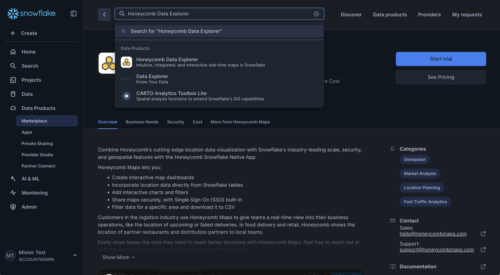
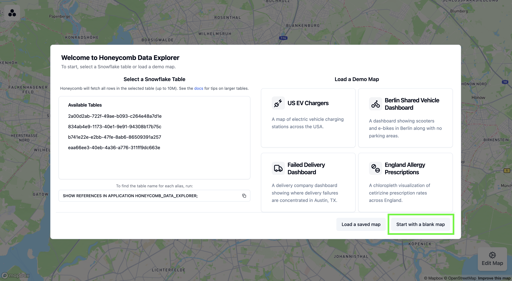
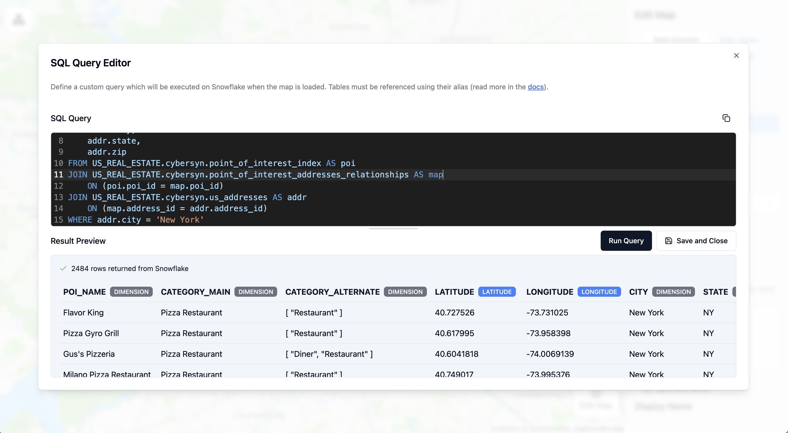
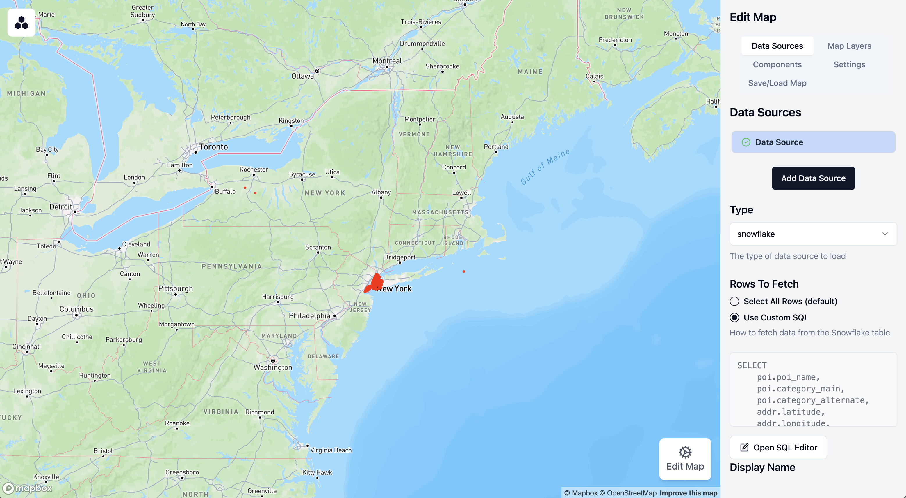
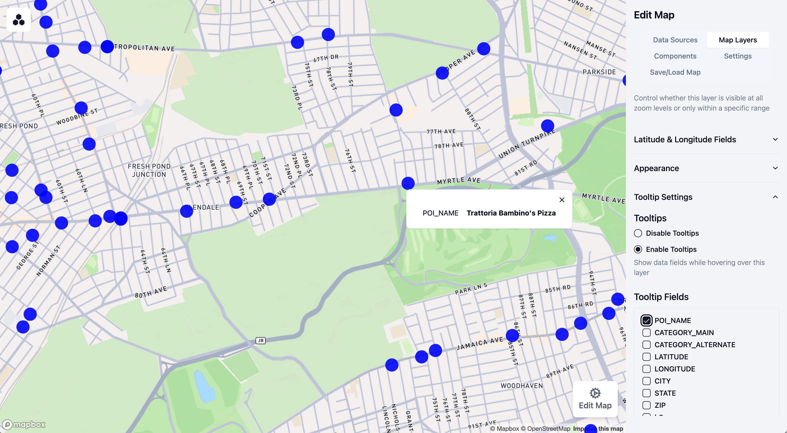
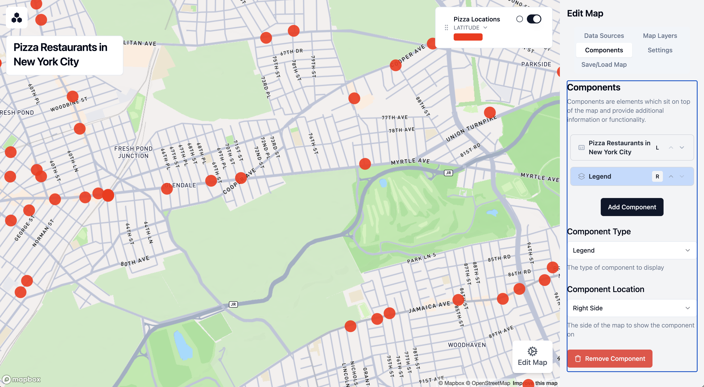
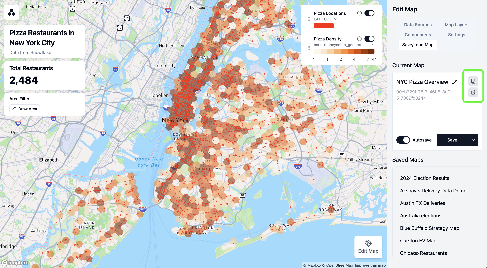

author: Carston Hernke
id: viewing-location-data-on-an-interactive-map
summary: This guide walks you through creating an interactive map visualization to analyze location data using the Honeycomb Maps native app.
categories: data-visualization,partner-integrations
environments: web
status: Published
feedback link: https://github.com/Snowflake-Labs/sfguides/issues
tags: Getting Started, Geospatial, Visualization, Native Apps

# Viewing Location Data on an Interactive Map
<!-- ------------------------ -->
## Overview 
Duration: 3

Honeycomb Maps is a Snowflake Native App that enables logistics and mobility companies to build interactive map dashboards directly using their data in Snowflake. As a native app, Honeycomb runs inside your Snowflake account, keeping your data secure by eliminating the need to extract or duplicate it.

Honeycomb Maps provides a no-code interface for creating interactive, shareable, and data-driven maps directly within Snowflake. This ensures that your geospatial data never leaves your Snowflake environment, allowing for cutting-edge interactive maps while maintaining all of Snowflake's security, governance, and scalability benefits.


In this quickstart guide, you'll learn how to use Honeycomb Maps to create an interactive visualization of geospatial data. You'll create a map showing pizza restaurants in New York City, add additional layers to visualize density, and create interactive components to filter the data.

### Prerequisites
- A [Snowflake](https://signup.snowflake.com/?utm_cta=quickstarts_) account. Sign up for a [30-day free trial](https://signup.snowflake.com/?utm_cta=quickstarts_) account, if required.
- Permissions to install apps from Snowflake Marketplace (An ACCOUNTADMIN role will work)
- Access to Snowflake's US_REAL_ESTATE sample database (available for free from Snowflake Marketplace) or your own geospatial data
- Basic familiarity with SQL queries

### What You'll Learn 
- How to install the Honeycomb Maps app from the Snowflake Marketplace
- How to create a data source connection to your Snowflake data
- How to visualize point data on an interactive map
- How to add a density heatmap layer using H3 cells
- How to add interactive filters and metrics to the map
- How to save and share your map

### What You'll Build 
An interactive map dashboard showing pizza restaurants in New York City with:
- Points representing individual restaurants
- A density heatmap using H3 cells
- Interactive area filters to explore specific areas
- Components showing real-time aggregated metrics

Let's get started with creating our first Honeycomb map!

<!-- ------------------------ -->
## Install Honeycomb Maps 
Duration: 5

The first step is to install the Honeycomb Maps application from the Snowflake Marketplace.

### Navigate to the Snowflake Marketplace

1. Log in to your Snowflake account
2. Click on **Marketplace** in the left navigation menu
3. Search for "Honeycomb" in the search bar
4. Click on the **Honeycomb Data Explorer** or **Honeycomb Maps** tile



### Install the Application

1. On the Honeycomb Data Explorer listing page, click the blue **Get** button.
2. A pop-up window will appear with additional details. You can use the default warehouse and default options.
4. Click **Get** to start the installation.
5. After a few seconds, the app will appear in the 'Apps' window.

### Finish installation
1. For the Honeycomb Maps app to function, you will need to grant it a series of permissions. The UI will show the permissions required. Click 'Grant' to grant these permissions to the application.
2. Click 'Activate'.
3. The app will take 10-15 minutes to fully activate.

<!-- ------------------------ -->
## Get POI Data 
### Get the Data from Marketplace

Snowflake provides a free dataset of POI (Point of Interest) data across the United States. This dataset can be added your account through the Snowflake Marketplace. [Here is a link to the listing.](https://app.snowflake.com/marketplace/listing/GZTSZ290BV255/snowflake-public-data-products-snowflake-public-data-free?originTab=provider&providerName=Snowflake%20Public%20Data%20Products&profileGlobalName=GZTSZAS2KCS) 

1. Open Snowflake Marketplace and find the 'Snowflake Public Data (Free)' dataset provided by Snowflake
2. Click on 'Get' and follow the instructions to add this data to your account
3. Once the data has been added, make sure that you can query the data successfully. Open up a new worksheet in Snowsight (Projects -> Worksheets -> '+') and run the following query:

```sql 
-- verify whether we can query the Snowflake POI data
SELECT
    poi.poi_name,
    addr.latitude,
    addr.longitude
FROM SNOWFLAKE_PUBLIC_DATA_FREE.PUBLIC_DATA_FREE.point_of_interest_index AS poi
JOIN SNOWFLAKE_PUBLIC_DATA_FREE.PUBLIC_DATA_FREE.point_of_interest_addresses_relationships AS map
    ON (poi.poi_id = map.poi_id)
JOIN SNOWFLAKE_PUBLIC_DATA_FREE.PUBLIC_DATA_FREE.us_addresses AS addr
    ON (map.address_id = addr.address_id)
WHERE addr.city = 'New York'
  AND addr.state = 'NY'
  AND poi.category_main = 'Pizza Restaurant'
LIMIT 10;
```
 
4. The query above should run successfully and return 10 rows of data. If it does not, make sure that the role you are using has access to the 'US_REAL_ESTATE' database that was created when you added the data from Marketplace.


5. For Honeycomb Maps to access this data, you need to grant the application the necessary privileges:

```sql
-- Grant privileges on sample database to the Honeycomb application
GRANT IMPORTED PRIVILEGES ON DATABASE SNOWFLAKE_PUBLIC_DATA_FREE TO APPLICATION HONEYCOMB_DATA_EXPLORER;
```
Execute this SQL command in a Snowflake worksheet to grant the Honeycomb app access to the sample data we'll be using. If you're using your own database, replace "SNOWFLAKE_PUBLIC_DATA_FREE" with your database name.

### Launch the Application

1. Navigate to **Apps** in the left navigation menu
2. Find and click on **Honeycomb Data Explorer**
3. The application will open in a new browser tab. For security reasons, you may need to log into Snowflake again.

You have now successfully installed Honeycomb Maps and are ready to create your first interactive map!

<!-- ------------------------ -->
## Create Your First Map
Duration: 10

Now that you have Honeycomb Maps installed, let's create your first map visualization.

### Start a New Project

1. On the Honeycomb Maps start page, click on **Start with a blank map**



2. You'll see a blank map canvas. The next step will be to add data onto the map.


### Connect to Your Data

Next, we'll connect to Snowflake data to visualize pizza restaurants in New York:

1. Click on **Edit Map** in the bottom-right corner to open the configuration sidebar.
2. Click on **Data Sources** in the side panel
3. Click on **Add Data Source**
4. Select **Snowflake** as the data source type
5. Under **Rows to Fetch**, click on **Use Custom SQL**


6. Click on **Open SQL Editor**

### Write Your Query

In the SQL editor, enter the following query to fetch pizza restaurant locations:

```sql
SELECT
    poi.poi_name,
    poi.category_main,
    poi.category_alternate,
    addr.latitude,
    addr.longitude,
    addr.city,
    addr.state,
    addr.zip
FROM SNOWFLAKE_PUBLIC_DATA_FREE.PUBLIC_DATA_FREE.point_of_interest_index AS poi
JOIN SNOWFLAKE_PUBLIC_DATA_FREE.PUBLIC_DATA_FREE.point_of_interest_addresses_relationships AS map
    ON (poi.poi_id = map.poi_id)
JOIN SNOWFLAKE_PUBLIC_DATA_FREE.PUBLIC_DATA_FREE.us_addresses AS addr
    ON (map.address_id = addr.address_id)
WHERE addr.city = 'New York'
  AND addr.state = 'NY'
  AND poi.category_main = 'Pizza Restaurant';
```

This query joins several tables to find all pizza restaurants in New York City, retrieving their names, categories, and geographic coordinates.

7. Click **Run** to test the query
8. Verify that it returns the pizza restaurant data. Note: If you see an error, make sure that you have granted Honeycomb access to the database that you are trying to query (see the previous step).

9. Click **Save and Close**

A point layer will be automatically added to your map, showing the location of each pizza restaurant.



10. You can scroll to zoom into New York City

### Customize Point Styling

Let's improve the appearance of our points:

1. Click on **Map Layers** in the sidebar
2. Click on the automatically created **Point Layer**
3. Change the label to "Pizza Locations"
4. Adjust the point color by clicking on 'Colors' and then the color selector

### Enable Tooltips

Tooltips allow users to see information about each restaurant when hovering over points:

1. With your Point Layer selected, click on **Tooltip Settings**
2. Toggle **Enable Tooltips** to On
3. Select **POI_NAME** as a field to show in the tooltip
4. You can now hover over points on the map to see restaurant names



Your map now displays all pizza restaurants with customized styling and tooltips!

<!-- ------------------------ -->
## Add Title and Legend
Duration: 10

Now let's enhance our map by adding a label and legend to the map

### Add a Title 

1. Click on **Components** in the sidebar
2. Click on **Add Component**
3. Keep the first component as a **Title Card** on the left-hand side
4. Enter "Pizza Restaurants in New York City" as the title
5. Add "Data from Snowflake" as a subtitle

### Add a Legend
6. Click **Add Component** again
7. Change the component type to **Legend**
8. Under "Component Location," select "right side" to move the legend to the right side of the map




<!-- ------------------------ -->
## Add a Density Layer

Now, let's add a layer to show the density of pizza restaurants using hexagonal H3 cells:

1. Click on **Map Layers** in the sidebar
2. Click on **Add Map Layer**
3. Label this layer "Pizza Density"
4. Make sure the layer type is set to **Honeycomb Layer**
5. Expand the **H3 Data** section
6. Set **Resolution Mode** to **Fixed resolution**
7. Set H3 resolution to 8 (this controls the size of the hexagons)
8. Under **Measure Field**, select "honeycomb_generated_id"
9. Set **Aggregation Type** to "count"

This creates a hexagon grid where each cell is colored based on the number of pizza restaurants it contains.

10. Enable tooltips for this layer to show the exact count in each cell


<!-- ------------------------ -->
## Add Interactive Components
### Add a Metric Component

Let's add a component that shows the total number of pizza restaurants:

1. Click on **Components** in the sidebar
2. Click on **Add Component**
3. Change the component type to **Big Number**
4. Set "Total Restaurants" as the title
5. Select the single data source under **Data Source**
6. Under **Measure Field**, select "honeycomb_generated_id"
7. Set **Aggregation Type** to "Count"

Your component now shows the total number of pizza restaurants on the map. It should be close to 2,484 if you are using the Snowflake POI data.

Let's add an interactive polygon filter that lets users examine the number of restaurants in specific areas.

### Add a Polygon Filter

1. Click on **Components** in the sidebar
2. Click on **Add Component**
3. For **Component Type**, select **Polygon Filter**
4. Set "Area Filter" as the title
5. Under **Polygon Input Methods**, keep "Allow Drawing on Map" selected
6. Under **Elements to Filter**, select all checkboxes (Pizza Locations, Pizza Density, and Total Restaurants)


### Use the Polygon Filter

Now you can use the filter to analyze specific areas:

1. Click on **Draw Area** to start drawing
2. Click on the map to add points outlining your area of interest (such as the Upper East Side)
3. Click on the first point to close the shape and finish drawing
4. The map now only shows restaurants within your defined area
5. The Total Restaurants metric automatically updates to show the count for the selected area
6. You can drag corners of the area to adjust the boundaries or click **Reset** to start over


This interactive filter is especially useful for analyzing density and distribution in specific neighborhoods or regions.

<!-- ------------------------ -->
## Save and Share Your Map
Duration: 5

Once you're satisfied with your map, let's save it and learn how to share it with others.

### Configure Map Settings

1. Click on **Settings** in the sidebar
2. Adjust the map view to show all of New York City
3. Click **Set to Current View** to save this as the default view
4. Decide whether to save active filters with the map by toggling **Save Active Filters**


### Save Your Map

1. Click on **Save/Load Map** at the top of the sidebar
2. Enter "NYC Pizza Overview" as the name for your map
3. Click **Save**

Your map is now saved to Snowflake and will be accessible to others who have access to the Honeycomb tool in your organization.

### Share Your Map

You can share your map with colleagues in two ways:

1. **Editable Link**:
   - This allows recipients to customize the map and save their changes
   - Good for collaborative analysis

2. **Read-only Link**:
   - This removes the 'Edit Map' sidebar, limiting viewers to only interacting with the map
   - Ideal for presenting finalized insights
   - Users can still utilize filter components that have been added to the map

To share either link type:
1. Click on **Share** in the top navigation bar
2. Choose either **Copy Editable Link** or **Copy Read-only Link**
3. Share the link with your colleagues via email or your preferred communication tool. For security reasons, they will need to sign into Snowflake to view the map.



Congratulations! You've successfully created, customized, and shared an interactive map visualization using Honeycomb Maps.

<!-- ------------------------ -->
## Next Steps and Advanced Features
Duration: 5


Now that you've created your first map with Honeycomb Maps, here are some advanced features to explore:

### Additional Layer Types

Beyond points and hexagons, Honeycomb Maps supports:

- **Line Layers**: Visualize routes, paths, or connections between locations
- **Area Layers**: Display administrative boundaries like zip codes or census tracts, or operational areas
- **Arc Layers**: Show connections between two points

### Multiple Data Sources

Combine multiple datasets on a single map:

1. Add additional data sources using the **Data Sources** panel
2. Create new layers that reference different data sources
3. Honeycomb can be used as a 'single source of truth map' showing location data from Snowflake

### Powerful Filters
In this demo we only showed a basic polygon filter, however, Honeycomb supports more advanced filtering options.
- Non-spatial data fields can be filtered with sliders, drop-down lists, checkboxes, and more
- The polygon filter can accept areas uploaded from GeoJSON files, or areas from a Snowflake table

### Always up-to-date-data 
- When a map loads, it will always pull fresh data from Snowflake tables by running the query defined in 'Data Sources'
- For the best performance, keep these queries fast or consider using materialized views

### Enforced SSO
- Honeycomb comes with SSO integrated with Snowflake out-of-the-box. This makes it easy for others to securely access the maps you create, and limits the risk of accidentally making sensitive data public

Explore these advanced features to create even more powerful geographic visualizations and gain deeper insights from your location data!

<!-- ------------------------ -->
## Conclusion And Resources
Duration: 1

Congratulations! You've successfully created an interactive map visualization using Honeycomb Maps. You've learned how to:

- Install the Honeycomb Maps Snowflake Native App
- Connect to and visualize your Snowflake data on a map
- Add multiple visualization layers including points and density hexagons
- Create interactive components like tooltips and filters
- Save and share your map with others


### Learn More

To continue your journey with Honeycomb Maps:

- Visit the official [Honeycomb Maps documentation](https://docs.honeycombmaps.com) for comprehensive guides and tutorials
- Learn more about Honeycomb Maps capabilities on the [product page](https://www.honeycombmaps.com/product/snowflake)
- Apply these techniques to your own geospatial data
- Reach out to the Honeycomb team at hello@honeycombmaps.com for questions and assistance

With Honeycomb Maps, you now have a powerful tool to visualize and analyze location data directly within your Snowflake environment, allowing you to gain insights while maintaining Snowflake's security, governance, and scalability. Honeycomb Maps enables you to:

- Create beautiful, interactive maps with your Snowflake data
- Share insights with stakeholders through intuitive visualizations
- Reduce data warehouse load by handling map interactions on the client-side
- Avoid data movement with the Snowflake Native App architecture
- Leverage Snowflake's security and governance model

**Happy mapping!**

###Resources
- [Download Refernce Architecture](https://drive.google.com/file/d/1NuDVwb4MgjFabjwHM8-6aaPJwTnjxJZb/view?usp=sharing)
- [Read Engineering Blog](https://www.honeycombmaps.com/blog/announcing-honeycomb-for-snowflake-high-performance-high-security)
- [Read Medium Blog](https://medium.com/snowflake/building-interactive-map-dashboards-with-snowflake-and-honeycomb-dae2e2b2801a)
- [Watch the Demo](https://youtu.be/hDbIRELQ_Kk?list=TLGG6VBsYYOwqukyNDA5MjAyNQ)
