author: Carston Hernke
id: viewing-location-data-on-an-interactive-map
categories: snowflake-site:taxonomy/solution-center/certification/quickstart, snowflake-site:taxonomy/solution-center/certification/partner-solution, snowflake-site:taxonomy/solution-center/includes/architecture, snowflake-site:taxonomy/product/applications-and-collaboration, snowflake-site:taxonomy/snowflake-feature/external-collaboration, snowflake-site:taxonomy/snowflake-feature/native-apps
language: en
summary: This guide walks you through creating an interactive map visualization to analyze location data using the Honeycomb Maps native app.
environments: web
status: Published
feedback link: https://github.com/Snowflake-Labs/sfguides/issues

# Viewing Location Data on an Interactive Map

<!-- ------------------------ -->
## Overview 
Honeycomb Maps is a Snowflake Native App for building interactive map dashboards using data in Snowflake tables. As a native app, Honeycomb Maps runs completely inside Snowflake, keeping data secure by eliminating the need to extract or duplicate it.

Honeycomb Maps provides a no-code interface for creating interactive, shareable, and data-driven maps directly within Snowflake. This ensures that location data never leaves the Snowflake environment, allowing for cutting-edge interactive maps while maintaining all of Snowflake's security, governance, and scalability benefits.

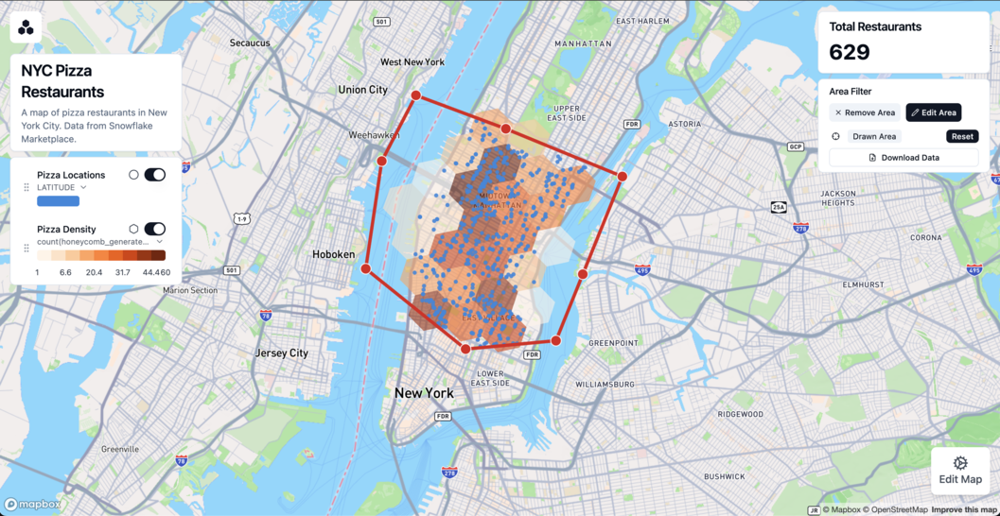

In this quickstart guide, you will learn how to use Honeycomb Maps to create an interactive visualization of geospatial data. You will create a map showing pizza restaurants in New York City, add additional layers to visualize density, and create interactive components to filter the data.

### Prerequisites
- A [Snowflake](https://signup.snowflake.com/?utm_source=snowflake-devrel&utm_medium=developer-guides&utm_cta=developer-guides) account.
- Permissions to install apps from Snowflake Marketplace (An ACCOUNTADMIN role will work)
- Access to Snowflake's US_REAL_ESTATE sample database (available for free from Snowflake Marketplace) or your own geospatial data
- Basic familiarity with SQL queries

### What You'll Learn 
- How to install the Honeycomb Maps app from the Snowflake Marketplace
- How to access Snowflake tables from Honeycomb Maps
- How to visualize point data on an interactive map
- How to add a density heatmap layer using H3 cells
- How to add interactive filters and metrics to the map
- How to save and share your map

### What You'll Build 
An interactive map dashboard showing pizza restaurants in New York City with:
- Points representing individual restaurants
- A density heatmap using H3 cells
- Interactive area filters to explore specific areas
- Components showing real-time aggregated metrics

Let's get started with creating our first Honeycomb map!

<!-- ------------------------ -->
## Install Honeycomb Maps 
The first step is to install the Honeycomb Maps application from the Snowflake Marketplace.

### Access the Application Listing in the Snowflake Marketplace

The application listing is located at the following link: [https://app.snowflake.com/marketplace/listing/GZSYZTWLBH/honeycomb-maps-honeycomb-maps](https://app.snowflake.com/marketplace/listing/GZSYZTWLBH/honeycomb-maps-honeycomb-maps)

Alternatively, you can search for "Honeycomb Maps" within the Snowflake Marketplace

### Install the Application

1. On the Honeycomb Maps listing page, click the blue **Get** button.
2. A pop-up window will appear with additional details. You can use the default warehouse and default options.
4. Click **Get** to start the installation.
5. After a few seconds you should see that the app was succesfully installed, with an option to configure it.


### Finish installation
1. For the Honeycomb Maps app to function, you will need to grant it a series of permissions. The UI will show the permissions required. 

- Click 'Grant' to grant these permissions to the application.
- Click 'Review' to review the configuration for accessing basemap tiles. This is required to show basemaps (streets, countries) under your data on maps. Click on 'Connect' to allow this configuration.

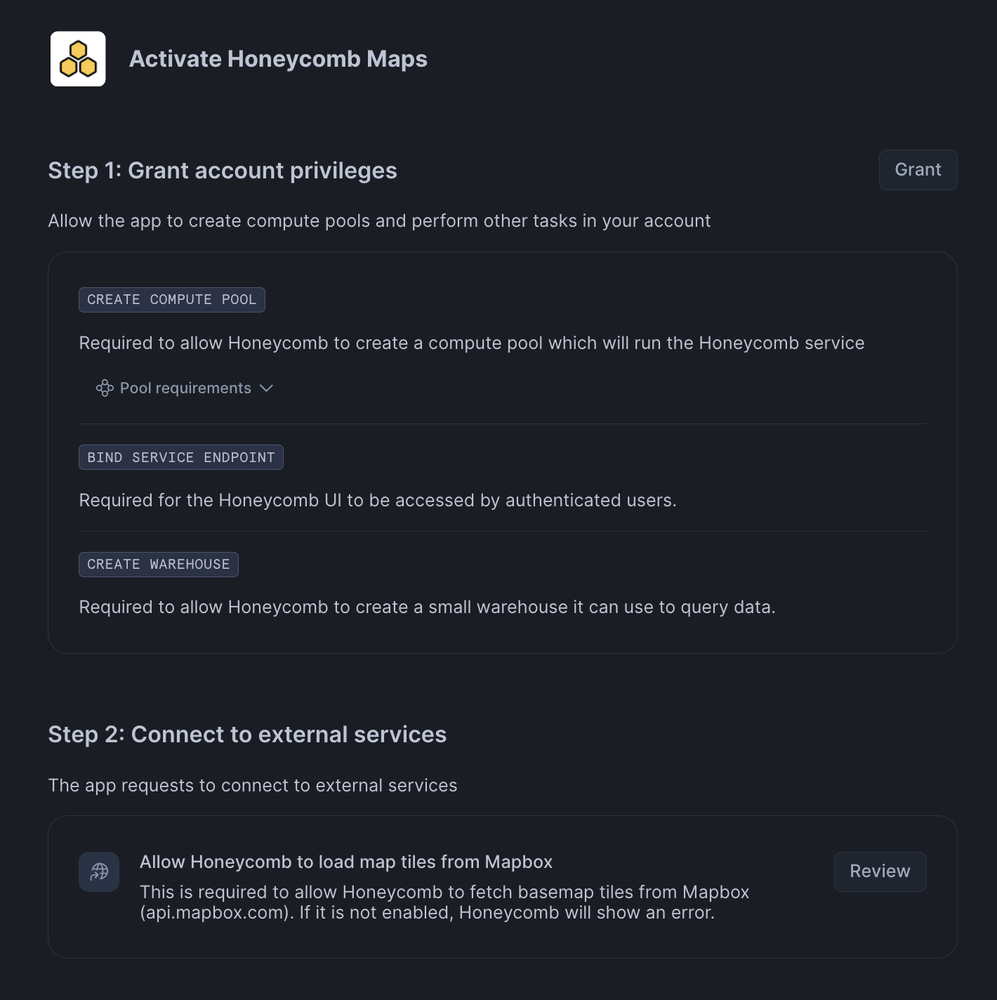

2. Click 'Activate'.
3. The app will take 10-15 minutes to activate and become available to use. While we wait for this to complete, we will go get data from Snowflake Marketplace.

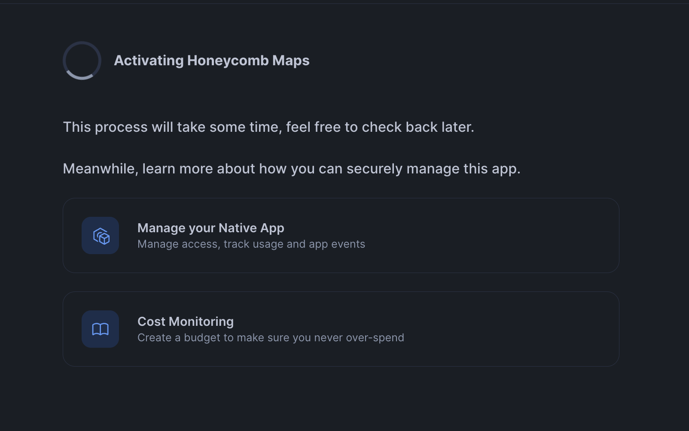


## Get POI Data 
### Get the Data from Marketplace
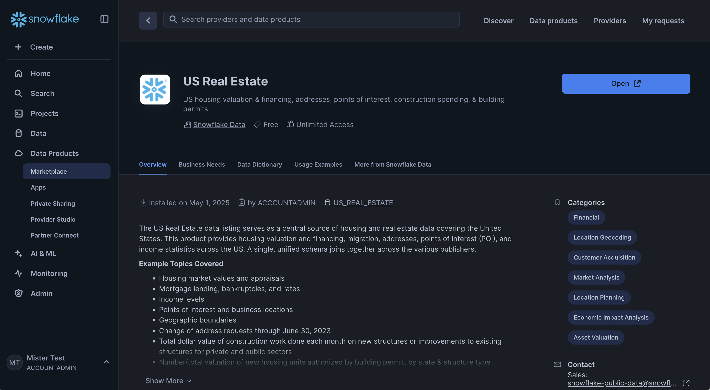
Snowflake provides a free dataset of POI (Point of Interest) data across the United States. This dataset can be added your account through the Snowflake Marketplace. Here is a link to the listing: [https://app.snowflake.com/marketplace/listing/GZTSZAS2KI6/snowflake-data-us-real-estate](https://app.snowflake.com/marketplace/listing/GZTSZAS2KI6/snowflake-data-us-real-estate). 

1. Open Snowflake Marketplace and find the 'US Real Estate' dataset provided by Snowflake
2. Click on 'Get' and follow the instructions to add this data to your account
3. Once the data has been added, make sure that you can query the data successfully. Open up a new worksheet in Snowsight (Projects -> Worksheets -> '+') and run the following query:

```sql 
-- verify whether we can query the Snowflake POI data
SELECT
    poi.poi_name,
    poi.websites[0]::VARCHAR as website,
    addr.latitude,
    addr.longitude
FROM us_real_estate.cybersyn.point_of_interest_index AS poi
JOIN us_real_estate.cybersyn.point_of_interest_addresses_relationships AS map
    ON (poi.poi_id = map.poi_id)
JOIN us_real_estate.cybersyn.us_addresses AS addr
    ON (map.address_id = addr.address_id)
WHERE addr.city = 'New York'
  AND addr.state = 'NY'
  AND poi.category_main = 'Pizza Restaurant';
```

> This demo focuses on Pizza Restaurants. However, by changing the 'poi.category_main' field, you can find data on many different types of businesses across the US. This can be very useful for finding lists of business customer prospects or for scouting the competitors in a new market.
 
4. The query above should run successfully and return 10 rows of data. If it does not, make sure that the role you are using has access to the 'US_REAL_ESTATE' database that was created when you added the data from Marketplace.

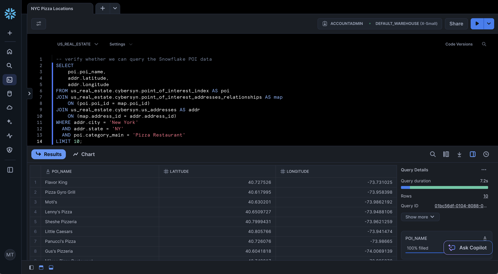


### Configure the Honeycomb Maps application
1. Navigate to **Catalog** -> **Apps** in the Snowsight left navigation menu (or [click here](https://app.snowflake.com/_deeplink/#/apps/applications?utm_source=quickstart&utm_medium=quickstart&utm_campaign=-us-en-all&utm_content=app-viewing-location-data-on-an-interactive-map) to go directly)
2. Click on **Honeycomb Maps**

#### Configure Restricted Caller's Rights
Honeycomb Maps uses the current user's identity to allow for querying data within Snowflake. This uses a Snowflake feature named [Restricted Caller's Rights (RCR)](https://docs.snowflake.com/en/developer-guide/restricted-callers-rights).

Before users can query data in Honeycomb Maps, you must set up RCR. **Note: this can also be done using the SQL command below**

##### Configure RCR using SQL 
```sql
// Your selected grants
GRANT INHERITED CALLER USAGE ON ALL SCHEMAS IN DATABASE "US_REAL_ESTATE" TO APPLICATION "HONEYCOMB_MAPS";
GRANT INHERITED CALLER SELECT ON ALL TABLES IN DATABASE "US_REAL_ESTATE" TO APPLICATION "HONEYCOMB_MAPS";
GRANT INHERITED CALLER SELECT ON ALL EXTERNAL TABLES IN DATABASE "US_REAL_ESTATE" TO APPLICATION "HONEYCOMB_MAPS";
GRANT INHERITED CALLER SELECT ON ALL VIEWS IN DATABASE "US_REAL_ESTATE" TO APPLICATION "HONEYCOMB_MAPS";

// Grants required to use your selected grants
GRANT CALLER USAGE ON DATABASE "US_REAL_ESTATE" TO APPLICATION "HONEYCOMB_MAPS";
```

##### Configure RCR with the Snowsight UI 
1. Click on the 'Privileges' tab on the app page in Snowsight
2. Scroll down to 'Restricted caller's rights'
3. Click on 'Add Grants' and select which permissions users will be able to use with the Honeycomb Maps app. 

We recommend granting `SELECT` rights on all tables and views. For this demo, the minimum permissions required are `USAGE` on the `US_REAL_ESTATE` database, `USAGE` on all schemas in the `US_REAL_ESTATE` database, and `SELECT` on all external tables, views, and tables in the `US_REAL_ESTATE` database.

> Tip: RCR does not change the permissions that users already have. Instead, it allows the Honeycomb Maps app to utilize a subset of a user's existing permissions when then interact with the app. This makes it easy for users to start using Honeycomb Maps without compromising security.

The Restricted Caller's Rights section in the 'Privileges' tab:


Selecting the `US_REAL_ESTATE` database:
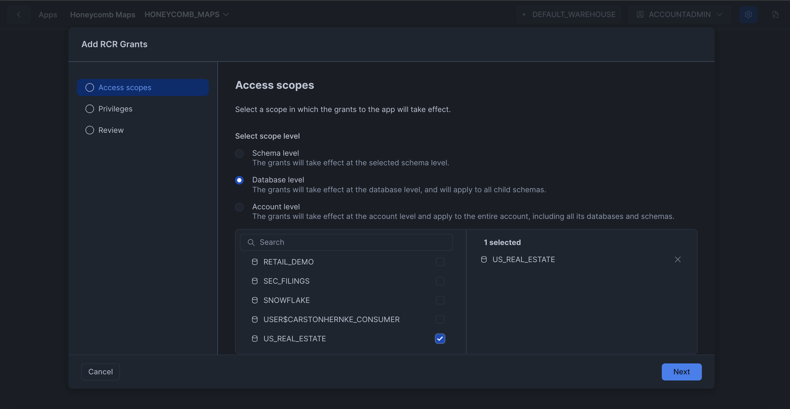

Here are the minimum permissions required for this demo:
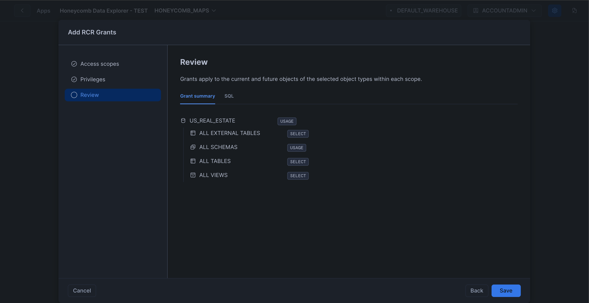

### Allow users to access the Honeycomb Maps Warehouse
To allow users to access data within Honeycomb Maps, you must configure permissions for users to use the application's warehouse. To do this, run the following query:

```sql
GRANT CALLER USAGE ON WAREHOUSE honeycomb_maps_warehouse TO APPLICATION honeycomb_maps;
```

> Replace HONEYCOMB_MAPS with the application name you specified during installation if you used a different name. The warehouse will always be named by adding _WAREHOUSE to the application name.

> Important: Honeycomb Maps will not function if the permission above is not configured.


### Launch the Application

1. Navigate to **Apps** in the left navigation menu
2. Find and click on **Honeycomb Maps**
3. If you are not taken directly to the application, click on 'Launch app'
4. The application will open in a new browser tab. For security reasons, you may need to log into Snowflake again.
5. You should see the following screen:

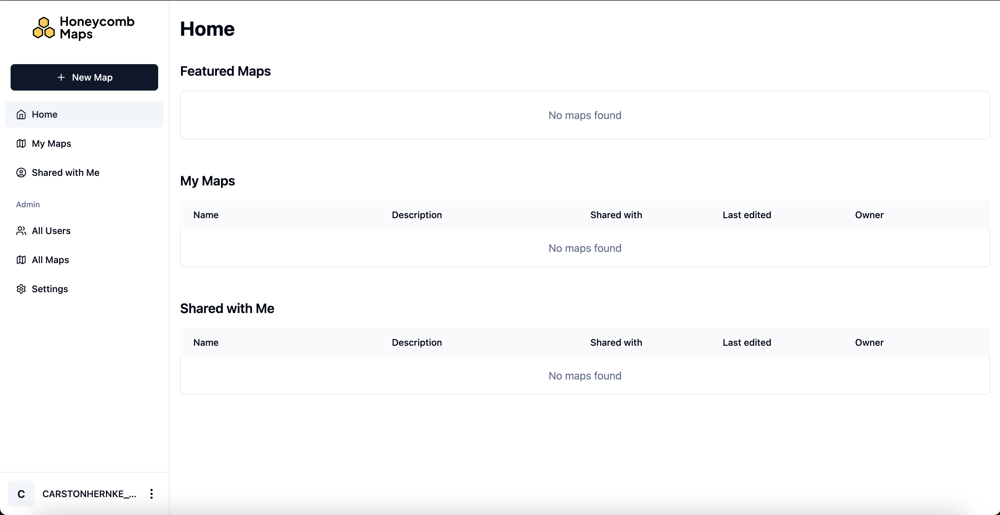

_If you don't see the screen above, ensure that you ran the grant warehouse query in the previous step.

You have now successfully installed Honeycomb Maps and are ready to create your first interactive map!


<!-- ------------------------ -->
## Create Your First Map
Now that you have Honeycomb Maps installed, let's create your first map visualization.

### Create a new map

1. On the top left of the Honeycomb Maps home screen, click on '+ New Map'. Enter a name and description for this new map. 

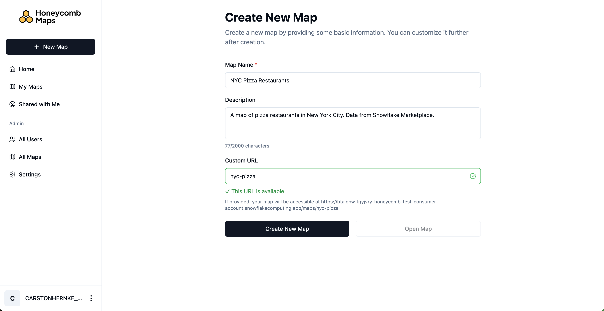

2. Click on **Create New Map**. Then once it has been created successfully, click on **Open Map**.

### Add the Pizza Data to the Map

Next, we'll connect to Snowflake data to visualize pizza restaurants in New York:

1. Click on **Edit Map** in the bottom-right corner to open the configuration sidebar.
2. Click on **Add Data Source**. This will add a new Snowflake Query data source.
3. Click on **Open SQL Editor** to edit the query for this data source.
4. Paste this query into the SQL Editor *(it is similar to the query in the previous step, just with the LIMIT removed and more columns selected)*:

```sql
SELECT
    poi.poi_name,
    poi.category_main,
    poi.category_alternate,
    poi.websites[0]::VARCHAR as website,
    addr.latitude,
    addr.longitude,
    addr.city,
    addr.state,
    addr.zip
FROM us_real_estate.cybersyn.point_of_interest_index AS poi
JOIN us_real_estate.cybersyn.point_of_interest_addresses_relationships AS map
    ON (poi.poi_id = map.poi_id)
JOIN us_real_estate.cybersyn.us_addresses AS addr
    ON (map.address_id = addr.address_id)
WHERE addr.city = 'New York'
  AND addr.state = 'NY'
  AND poi.category_main = 'Pizza Restaurant';
```

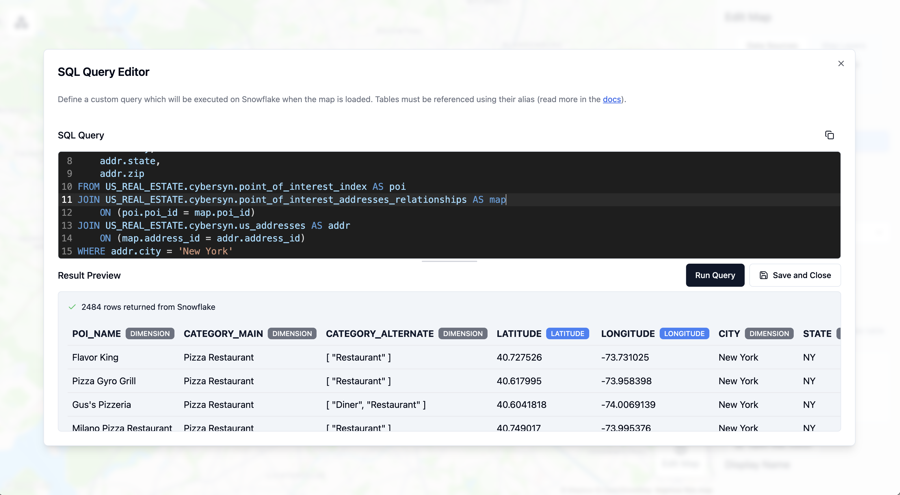

This query joins several tables to find all pizza restaurants in New York City, retrieving their names, categories, and geographic coordinates.

7. Click **Run** to test the query
8. Verify that it returns the pizza restaurant data (it should return around 3200 rows). Note: If you see an error, make sure that you have configured restricted caller's rights correctly (previous step).

9. Click **Save and Close**

A point layer will be automatically added to your map, showing the location of each pizza restaurant. Scroll to zoom into New York City.

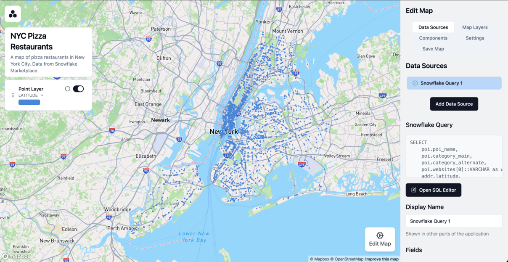

### Customize Point Styling

Let's improve the appearance of the pizza locations on the map:

1. Click on **Map Layers** in the sidebar
2. Click on the automatically created **Point Layer**
3. Change the label to "Pizza Locations". You will notice that the label on the Legend on the left-hand side changes automatically.
4. You can edit the size of the points in the 'Appearance' section, and the color of the points in the 'Colors' section.

### Enable Tooltips

Tooltips allow users to see information about each restaurant when hovering over points:

1. With your Point Layer selected, click on **Tooltip Settings**
2. Toggle **Enable Tooltips** to On
3. Select **POI_NAME** and **WEBSITE** as fields to show in the tooltip
4. You can now hover over points on the map to see restaurant names and websites.

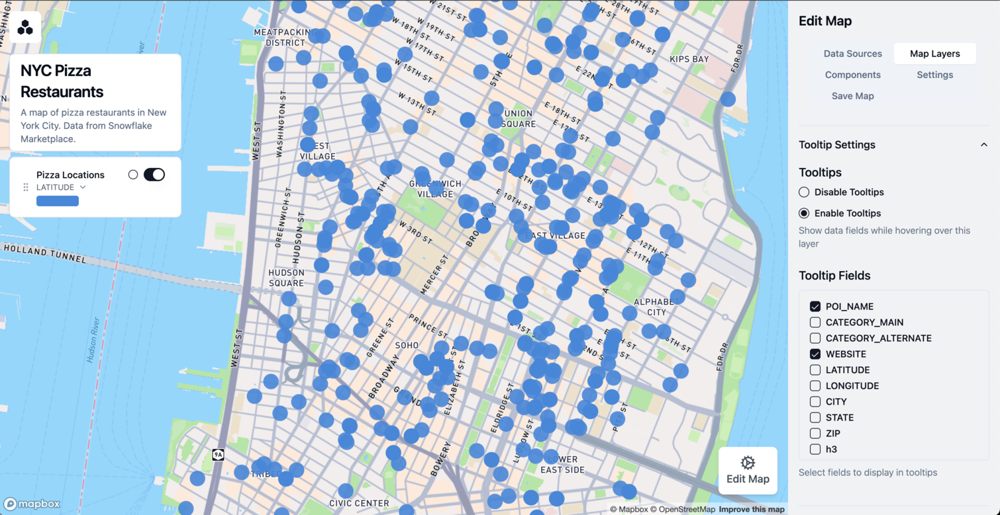

Your map now displays all pizza restaurants with customized styling and tooltips!


## Add a Density Layer

Now, let's add a layer to show the density of pizza restaurants using hexagonal H3 cells. H3 is a hexagon-based spatial index that allows us to group points into hexagon cells and generate metrics and heatmaps for each cell.

If a dataset contains latitude and longitude points, Honeycomb Maps will generate the corresponding H3 cells automatically. Honeycomb Maps also supports H3 cells from Snowflake tables (using [Snowflake's H3 functions](https://docs.snowflake.com/en/sql-reference/functions/h3_latlng_to_cell)). 

1. Click on **Map Layers** in the sidebar
2. Click on **Add Map Layer**
3. Label this layer "Pizza Density"
4. Make sure the layer type is set to **Honeycomb Layer**
5. Expand the **H3 Data** section
6. Set **Resolution Mode** to **Fixed resolution**
7. Set H3 resolution to 8 (this controls the size of the hexagons)
8. Under **Measure Field**, select "honeycomb_generated_id"
9. Set **Aggregation Type** to "Count"

This creates a hexagon grid where each cell is colored based on the number of pizza restaurants it contains.

10. Enable tooltips for this layer to show the exact count in each cell

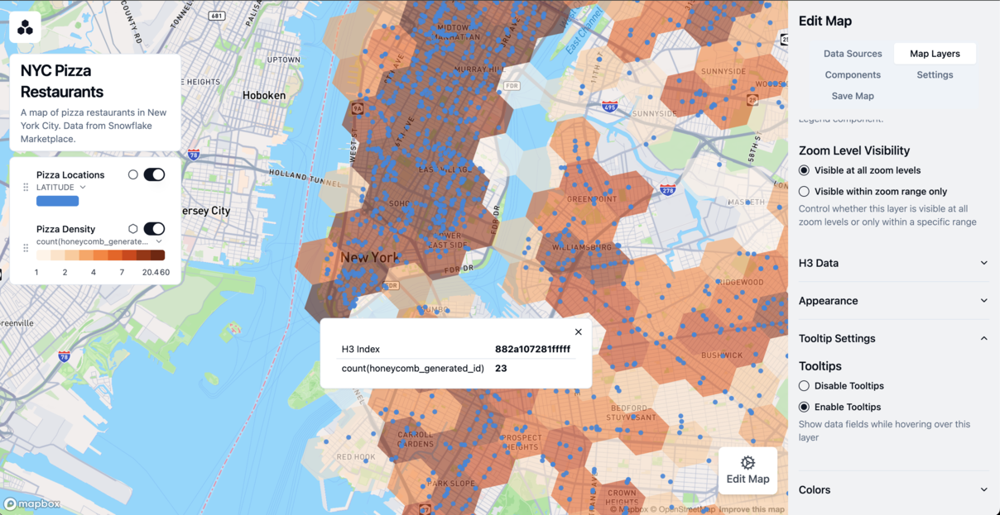


<!-- ------------------------ -->
## Add Interactive Components
Components are user interface elements that sit on top of the map, on the left or right side. They include titles, different types of filters and non-location data displays like metrics and charts. Components allow for automatic cross-filtering - a filter may affect map layers and metrics.   

### Add a Metric Component

Let's add a component that shows the total number of pizza restaurants:

1. Click on **Components** in the sidebar
2. Click on **Add Component**
3. Change the component type to **Big Number**. The Big Number component type is used to show calculated metrics.
4. Set "Total Restaurants" as the title
5. Select the single data source under **Data Source**
6. Under **Measure Field**, select "honeycomb_generated_id"
7. Set **Aggregation Type** to "Count"

Your component now shows the total number of pizza restaurants on the map. It should be close to 3256 if you are using the Snowflake POI data.

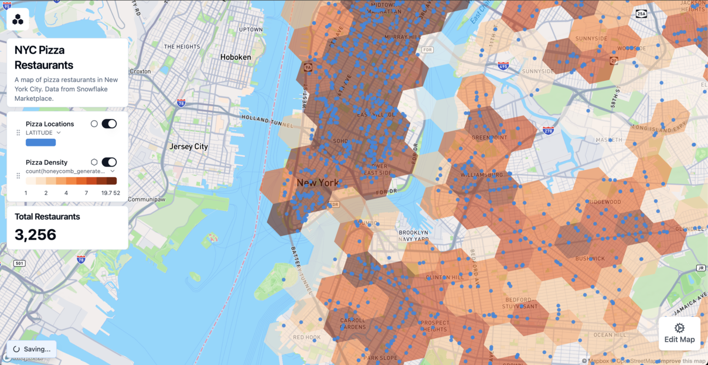

Next, we will add an interactive polygon filter that lets users examine the number of restaurants in specific areas.

### Add a Polygon Filter
Polygon filters allow users to filter the data for specific areas - and these areas can come from drawing on the map, from uploading a GeoJSON file, or from another data source.

For this demo, we'll create a polygon filter that allows users to draw on the map, which will then filter both data layers and the 'Total Restaurants' metric.

1. Click on **Components** in the sidebar
2. Click on **Add Component**
3. For **Component Type**, select **Polygon Filter**
4. Set "Area Filter" as the title
5. Under **Polygon Input Methods**, keep "Allow Drawing on Map" selected
6. Under **Elements to Filter**, select all checkboxes (Pizza Locations, Pizza Density, and Total Restaurants)

### Use the Polygon Filter

Now you can use the filter to analyze specific areas:

1. Click on **Draw Area** to start drawing
2. Click on the map to add points outlining your area of interest (such as the Upper East Side)
3. Click on the first point to close the shape and finish drawing
4. The map now only shows restaurants within your defined area
5. The Total Restaurants metric automatically updates to show the count for the selected area
6. You can drag corners of the area to adjust the boundaries or click **Reset** to start over


This interactive filter is especially useful for analyzing density and distribution in specific neighborhoods or regions.

<!-- ------------------------ -->
## Save and Share Your Map
Once you're satisfied with your map, you can share it with others. Users will go through Snowflake SSO to access the map. The map will always show fresh data from Snowflake.

### Configure Map Settings
The settings menu lets you configure light/dark mode, set the initial map view (where the map starts when it is loaded), and whether to save the filters along with the map.

1. Click on **Settings** in the sidebar
2. Adjust the map view to show all of New York City
3. Click **Set to Current View** to save this as the default view
4. Decide whether to save active filters with the map by toggling **Save Active Filters**

### Share Your Map
Maps created in Honeycomb Maps are private by default - however they can be easily shared with fine-grained permissions. 

#### Managing access to the Honeycomb Maps application
Honeycomb Maps uses application roles to manage access and permissions. Three roles: `HONEYCOMB_APP_ADMIN`, `HONEYCOMB_APP_EDITOR` and `HONEYCOMB_APP_VIEWER` each give a different set of permissions.

To allow a user to access the application and create maps, grant them the `HONEYCOMB_APP_EDITOR` role

```sql
-- For a specific user
GRANT APPLICATION ROLE honeycomb_app_editor TO USER <example_user>;

-- For an existing snowflake role
GRANT APPLICATION ROLE honeycomb_app_editor TO ROLE <example_role>;
```

For users that only need to view maps, you can grant them the `HONEYCOMB_APP_VIEWER` application role. 

Roles can also be configured through the Snowsight UI, from within the application management page (only visible to administrators).
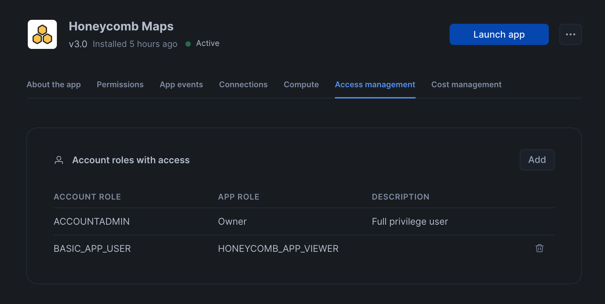

#### Sharing maps
The user who creates a map becomes the map owner. By default maps are only available to the owner, however, they can be shared with others. When they are shared, they can be shared with 'edit' or 'view' permissions. If a map is shared with 'view' permissions, then other users who open the map will not be able to access the 'Edit Map' sidebar. However, map viewers can still interact with filters.

Honeycomb Maps enforces data permissions on the underlying map data sources. In order to view data on a map in Honeycomb Maps, the user must have select permissions to the underlying data table. This is enforced by Snowflake using [Restricted Caller's Rights](https://docs.snowflake.com/en/developer-guide/restricted-callers-rights).

To share a map, go to the Honeycomb Maps homepage, and click on the elipsis (three dots) button on the right-hand side. Select 'Control sharing'.

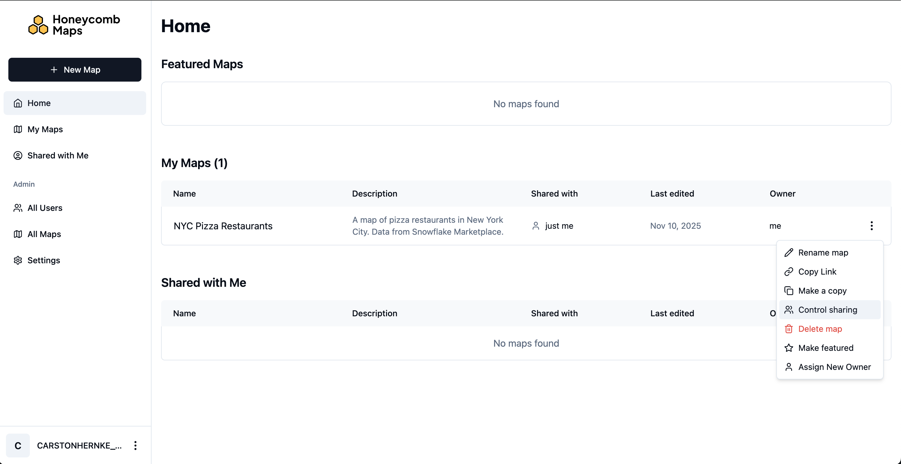

Maps can be shared with 'All users' or with specific named users. For a map to be shared with a named user, they must have logged into the Honeycomb Maps application at least once before. Maps can be shared with either 'Edit' (can change the map configuration) or 'View' (can only view the existing map) permissions.

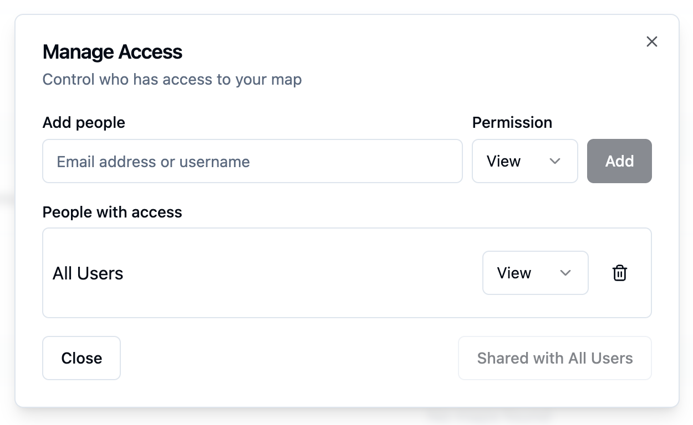

Congratulations! You've successfully created, customized, and shared an interactive map visualization using Honeycomb Maps.


<!-- ------------------------ -->
## Next Steps and Advanced Features
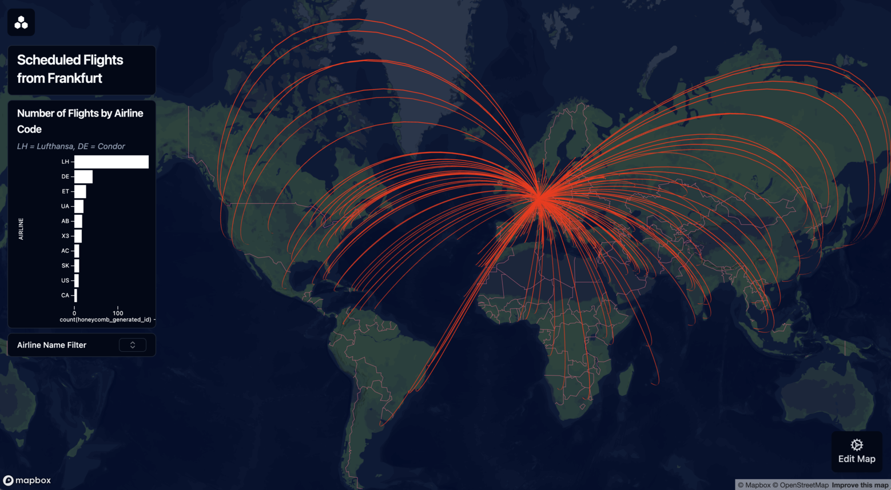

Now that you've created your first map with Honeycomb Maps, here are some advanced features to explore:

### Additional Layer Types

Beyond points and hexagons, Honeycomb Maps supports:

- **Line Layers**: Visualize routes, paths, or connections between locations
- **Area Layers**: Display administrative boundaries like zip codes or census tracts, or operational areas
- **Arc Layers**: Show connections between two points

### Multiple Data Sources

Combine multiple datasets on a single map:

1. Add additional data sources using the **Data Sources** panel
2. Create new layers that reference different data sources
3. Honeycomb can be used as a 'single source of truth map' showing location data from Snowflake

### Powerful Filters
In this demo we only showed a basic polygon filter, however, Honeycomb supports more advanced filtering options.
- Non-spatial data fields can be filtered with sliders, drop-down lists, checkboxes, and more
- The polygon filter can accept areas uploaded from GeoJSON files, or areas from a Snowflake table

### Always up-to-date-data 
- When a map loads, it will always pull fresh data from Snowflake tables by running the query defined in 'Data Sources'
- For the best performance, keep these queries fast or consider using materialized views

### Featured Maps
- Users with the `HONEYCOMB_APP_ADMIN` role can set specific maps as 'Featured'. Featured maps are prominently shown on the Honeycomb Maps homepage when users open the app. This is a great way to highlight curated maps to new users within your organization.
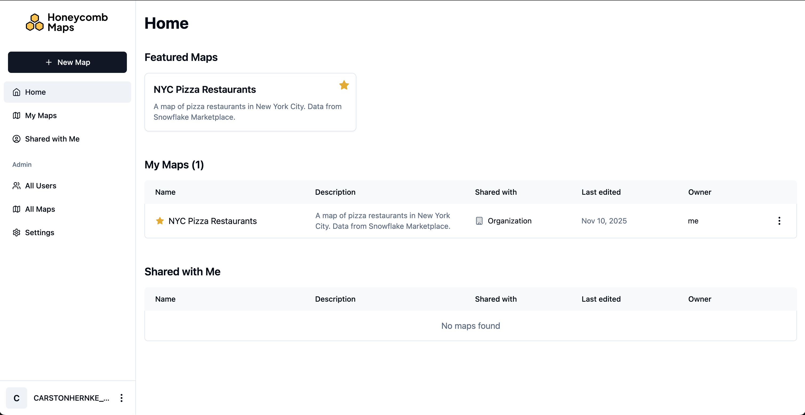

Explore these advanced features to create even more powerful geographic visualizations and gain deeper insights from your location data!

<!-- ------------------------ -->
## Conclusion And Resources
Congratulations! You've successfully created an interactive map visualization using Honeycomb Maps. You've learned how to:

- Install the Honeycomb Maps Snowflake Native App
- Connect to and visualize your Snowflake data on a map
- Add multiple visualization layers including points and density hexagons
- Create interactive components like tooltips and filters
- Share your map with others


### Learn More

To continue your journey with Honeycomb Maps:

- Visit the official [Honeycomb Maps documentation](https://docs.honeycombmaps.com) for comprehensive guides and tutorials
- Learn more about Honeycomb Maps capabilities on the [product page](https://www.honeycombmaps.com/product/snowflake)
- Create maps with your own location data
- Reach out to the Honeycomb team at support@honeycombmaps.com for questions and assistance

With Honeycomb Maps, you now have a powerful tool to visualize and analyze location data directly within your Snowflake environment, allowing you to gain insights while maintaining Snowflake's security, governance, and scalability. Honeycomb Maps enables you to:

- Create beautiful, interactive maps with your Snowflake data
- Share insights with stakeholders through intuitive visualizations
- Reduce data warehouse load by handling map interactions on the client side
- Avoid data movement with the Snowflake Native App architecture
- Leverage Snowflake's security and governance model

**Happy mapping!**
