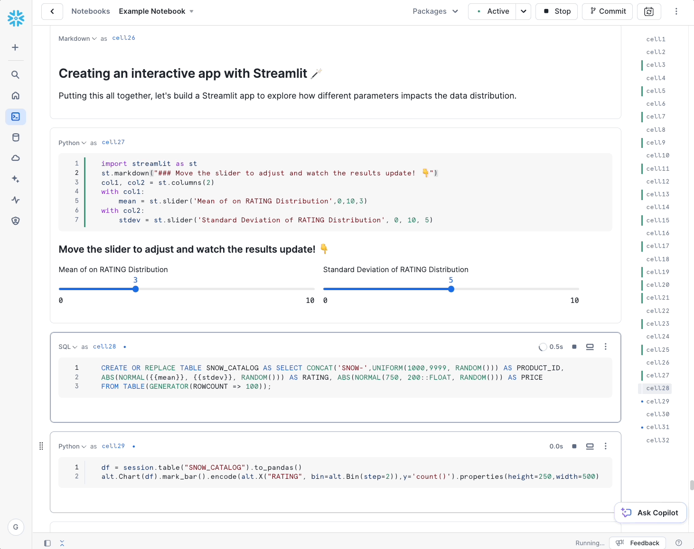
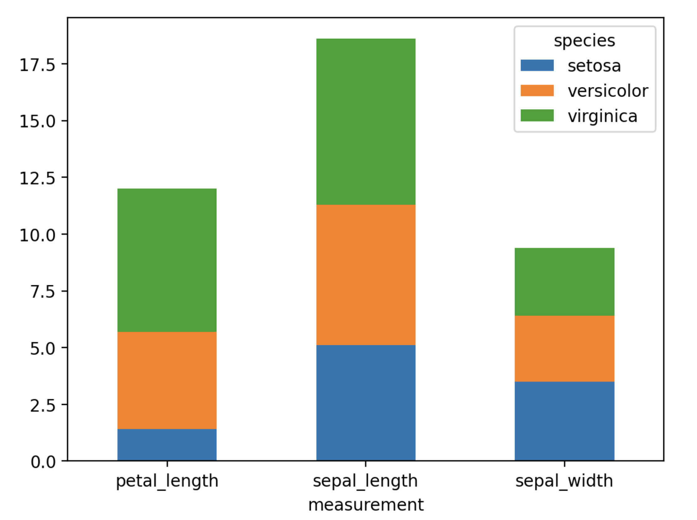
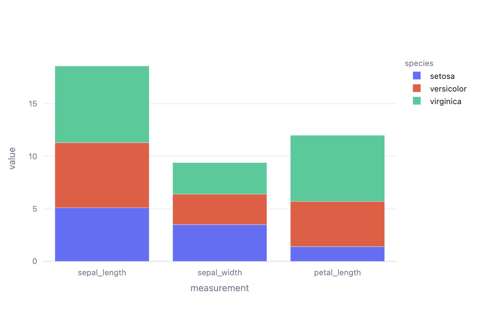
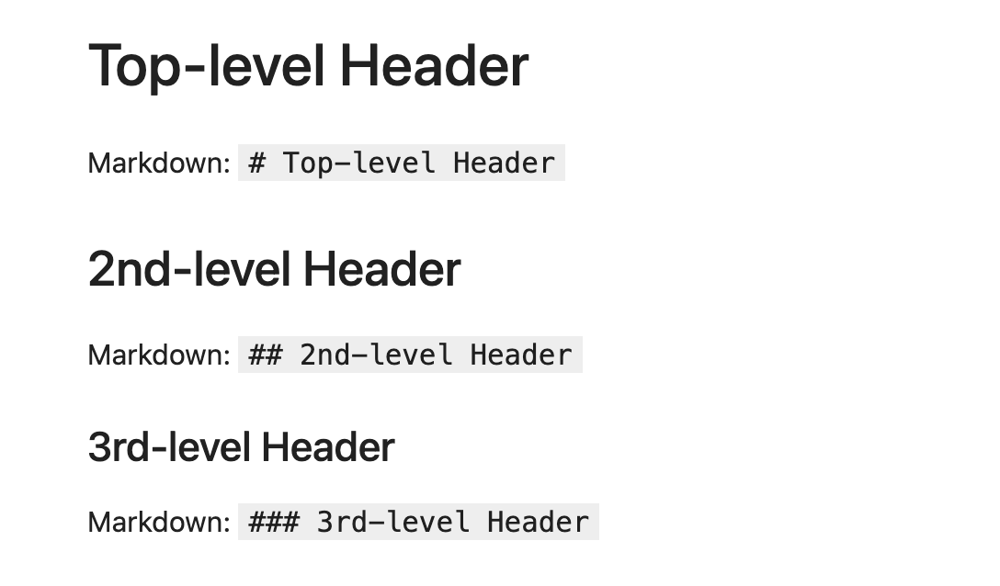
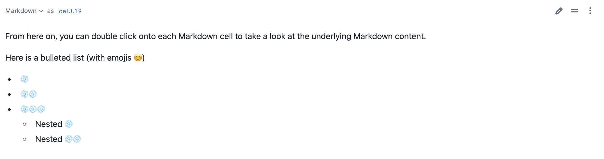
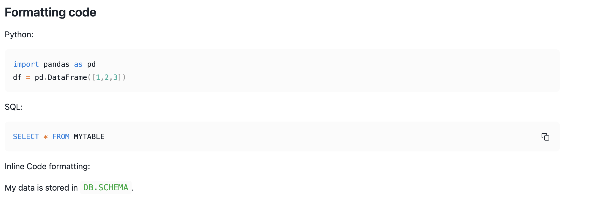
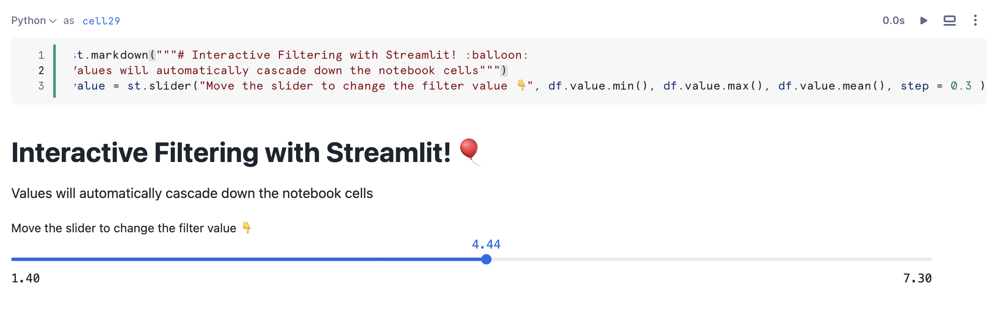
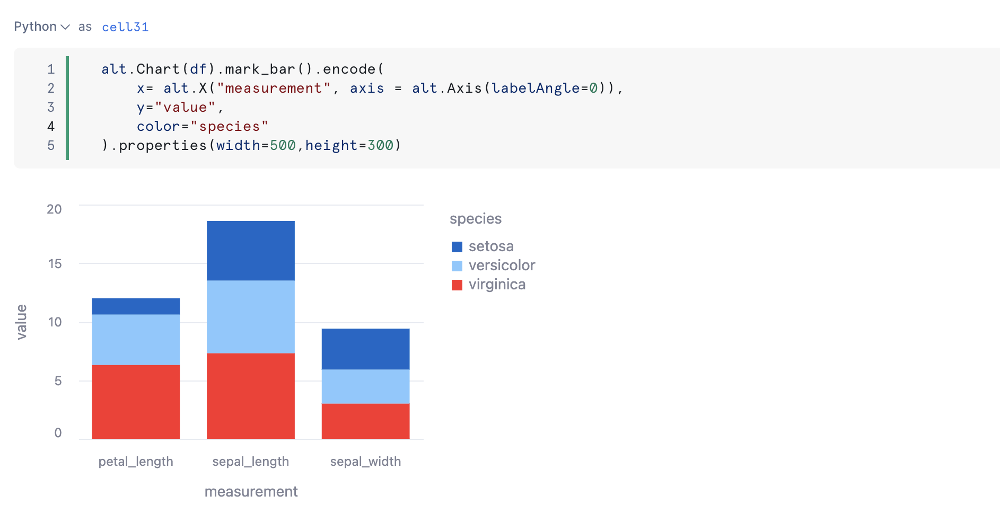

id: visual-data-stories-with-snowflake-notebooks
categories: snowflake-site:taxonomy/solution-center/certification/quickstart, snowflake-site:taxonomy/solution-center/certification/certified-solution, snowflake-site:taxonomy/solution-center/includes/architecture, snowflake-site:taxonomy/product/platform, snowflake-site:taxonomy/snowflake-feature/observability, snowflake-site:taxonomy/snowflake-feature/build
language: en
summary: This guide provides the instructions on how to build visualizations in Snowflake Notebook. 
environments: web
status: Published
feedback link: <https://github.com/Snowflake-Labs/sfguides/issues>
authors: Vino Duraisamy, Doris Lee
fork repo link: https://github.com/Snowflake-Labs/sfguide-visual-data-storytelling-in-snowflake-notebooks


# A Guide to Visual Data Storytelling in Snowflake Notebooks
<!-- ------------------------ -->
## Overview


[Snowflake Notebooks](https://docs.snowflake.com/user-guide/ui-snowsight/notebooks) offer an interactive, cell-based programming environment for Python and SQL. With a Snowflake Notebook, you can perform exploratory data analysis, visualize your data, build data dashboards, experiment with feature engineering for machine learning, and perform other data science tasks within Snowflake.

You can write and execute code, visualize results, and tell the story of your analysis all in one place.

* Explore and experiment with data already in Snowflake, or upload new data to Snowflake from local files, external cloud storage, or datasets from the Snowflake Marketplace.
* Write SQL or Python code and quickly compare results with cell-by-cell development and execution.
* Interactively visualize your data using embedded Streamlit visualizations and other libraries like Altair, Matplotlib, or seaborn.
* Contextualize results and make notes about different results with Markdown cells.
* Keep your data fresh by relying on the default behavior to run a cell and all modified cells preceding it or debug your notebook by running it cell-by-cesll.
* Run your notebook on a schedule. See [Schedule your Snowflake Notebook to run](https://docs.snowflake.com/user-guide/ui-snowsight/notebooks-schedule).
* Make use of the role-based access control and other data governance functionality available in Snowflake to allow other users with the same role to view and collaborate on the notebook.



In this tutorial, we will walk you through the different ways you can enrich your data narrative through engaging visuals in Snowflake Notebooks. We will demonstrate how you can develop visualizations, work with Markdown text, embed images, and build awesome data apps all within your notebook, alongside your code and data.

### Prerequisites

- A [Snowflake](https://signup.snowflake.com/?utm_source=snowflake-devrel&utm_medium=developer-guides&utm_cta=developer-guides) account. Sign up for a [30-day free trial](https://signup.snowflake.com/?utm_source=snowflake-devrel&utm_medium=developer-guides&utm_cta=developer-guides) account, if required.
- Access to download `.ipynb` file from [Snowflake notebooks demo repo](https://github.com/Snowflake-Labs/snowflake-demo-notebooks/tree/main)
- Please add the `matplotlib` and `plotly` package from the package picker on the top right. We will be using these packages in the notebook.

### What will you Learn?

Here is a summary of what you will be able to learn in each step by following this quickstart:

- **Plot with Altair, Matplotlib and Plotly**: How to use different visualization libraries in Snowflake Notebooks
- **Working with Markdown cells**: How to develop your narratives using Markdown language
- **Using Streamlit in Notebook**: How to use Streamlit to embed images in Notebook
- **Build Interactive Data Apps**: How to build interactive dashboards and data apps using Streamlit in Snowflake Notebook

<!-- ------------------------ -->
## Load demo notebooks to Snowflake


You can create a Snowflake Notebook directly from the Snowsight UI or upload an existing IPython Notebook to Snowflake.

In this example, we will upload an existing notebook from [Snowflake Notebooks demo repo](https://github.com/Snowflake-Labs/snowflake-demo-notebooks/tree/main) into a Snowflake account.

The notebook files are available for download as `.ipynb` files in the demo repository. To load the demo notebooks into your Snowflake Notebook, follow these steps: 

1. On Github, click into each folder containing the tutorial and the corresponding `.ipynb file`, such as [this](https://github.com/Snowflake-Labs/snowflake-demo-notebooks/blob/main/Visual%20Data%20Stories%20with%20Snowflake%20Notebooks/Visual%20Data%20Stories%20with%20Snowflake%20Notebooks.ipynb). Download the file by clicking on the `Download raw file` from the top right.

2. Go to the Snowflake web interface, [Snowsight](https://app.snowflake.com), on your browser.

3. Navigate to `Project` > `Notebooks` from the left menu bar. 

4. Import the .ipynb file you've download into your Snowflake Notebook by using the `Import from .ipynb` button located on the top right of the Notebooks page.


5. Select the file from your local directory and press `Open`.

6. A `Create Notebook` dialog will show up. Select a database, schema, and warehouse for the Notebook and click `Create`.

<!-- ------------------------ -->
## Plotting data using Altair, Matplotlib and Plotly


With Snowflake Notebook, you can use your favorite Python visualization library, including Altair, matplotlib and plotly, to develop your visualization. 

First, let's generate some toy data for the Iris dataset.

```python
# Sample data
species = ["setosa"] * 3 + ["versicolor"] * 3 + ["virginica"] * 3
measurements = ["sepal_length", "sepal_width", "petal_length"] * 3
values = [5.1, 3.5, 1.4, 6.2, 2.9, 4.3, 7.3, 3.0, 6.3]
df = pd.DataFrame({"species": species,"measurement": measurements,"value": values})
df
```

### Plotting with Altair

Now let's plot a bar chart in Altair. You can learn more about Altair [here](https://altair-viz.github.io/).

```python
import altair as alt
alt.Chart(df).mark_bar().encode(
    x= alt.X("measurement", axis = alt.Axis(labelAngle=0)),
    y="value",
    color="species"
).properties(
    width=700,
    height=500
)
```


### Plotting with Matplotlib

Let's do the same with matplotlib. Note how convenient it is to do `df.plot` with your dataframe with pandas. This uses matplotlib underneath the hood to generate the plots. You can learn more about pandas's [pd.DataFrame.plot](https://pandas.pydata.org/docs/reference/api/pandas.DataFrame.plot.html) and about matplotlib [here](https://matplotlib.org/).

First, let's pivot our data so that our data is stacked.

```python
pivot_df = pd.pivot_table(data=df, index=['measurement'], columns=['species'], values='value')
```

We build a quick Streamlit app to visualize the pivot operation. (Don't worry we will discuss what the st. Streamlit commands mean later in the tutorial!)

```python
col1, col2 = st.columns(2)
with col1: 
    st.markdown("Old Dataframe")
    st.dataframe(df)    
with col2:
    st.markdown("Pivoted Dataframe")
    st.dataframe(pivot_df)
```

Now let's use matplotlib to plot the stacked bar chart.

```python
import matplotlib.pyplot as plt
ax = pivot_df.plot.bar(stacked=True)
_ = ax.set_xticklabels(list(pivot_df.index), rotation=0)
```



### Plotting with Plotly

Finally, let's do the same plot with plotly. Learn more about plotly [here](https://plotly.com/python/plotly-express/).

```python
import plotly.express as px
px.bar(df, x='measurement', y='value', color='species')
```



<!-- ------------------------ -->
## Working with Markdown cells


With Snowflake Notebooks, you can leverage Markdown language to develop rich text displays with formatting.

You can change a cell type to render Markdown by clicking on the dropdown on the top left to select `Markdown` (or use `m` as the hotkey to convert a cell type to Markdown).



### Inline Text Formatting

Here is some *italicized* text and **bolded text**.
Markdown: `Here is some *italicized text* and **bolded text**`.

Here is a link to the [Snowflake website](https://snowflake.com/)
Markdown: `Here is a link to the [Snowflake website](https://snowflake.com/)`

From here on, you can double click onto each Markdown cell to take a look at the underlying Markdown content.

### Bulleted List

Here is a bulleted list (with emojis 😊)

- ❄️
- ❄️❄️
- ❄️❄️❄️
    - Nested ❄️
    - Nested ❄️❄️




### Formatting Code

Python: 
```python
import pandas as pd
df = pd.DataFrame([1,2,3])
```

SQL: 
```sql
SELECT * FROM MYTABLE
```

Inline Code formatting: 

My data is stored in `DB.SCHEMA`. 



### Embedding Images and GIFs

You can use the Markdown Syntax to embed images and GIFs in your notebook.

The syntax looks like ``. Here are some examples!

``
``

<!-- ------------------------ -->
## Using Streamlit in Notebook


You can bring your data narrative alive in notebooks and make it even more interactive by using Streamlit.

[Streamlit](https://streamlit.io/) is an open-source framework for building interactive data apps in Python (not a single line of HTML or Javascript required!)

Unlike in other notebooks where you need to navigate to a separate terminal window to serve up your Streamlit app, you can test and develop your Streamlit app directly in your notebook. 

We saw how you can embed images using Markdown. Here we show how you can embed images in your notebook using Streamlit which gives you more image customization options.

```python
import streamlit as st
st.image("/wp-content/themes/snowflake/assets/img/brand-guidelines/logo-sno-blue-example.svg",width=500)
```

```python
# Also works with a GIF animation!
st.image("https://upload.wikimedia.org/wikipedia/commons/2/2c/Rotating_earth_%28large%29.gif", caption="Rotating Earth!")
```

Let's say you have some images in your Snowflake stage, you can stream in the image file and display it with Streamlit.

```sql
LS @IMAGE_STAGE;
```

```python
from snowflake.snowpark.context import get_active_session
session = get_active_session()
image=session.file.get_stream("@IMAGE_STAGE/snowflake-logo.png", decompress=False).read() 
st.image(image)
```
<!-- ------------------------ -->
## Build Interactive Data Apps with Streamlit


Think of each cell in your Snowflake Notebook as a mini Streamlit app. As you interact with your data app, the relevant cells will get re-executed and the results in your app updates.

```python
st.markdown("""# Interactive Filtering with Streamlit! :balloon: 
Values will automatically cascade down the notebook cells""")
value = st.slider("Move the slider to change the filter value 👇", df.value.min(), df.value.max(), df.value.mean(), step = 0.3
```



```python
# Filter the table from above using the Streamlit slider
df[df["value"]>value].sort_values("value")
```

```python
alt.Chart(df).mark_bar().encode(
    x= alt.X("measurement", axis = alt.Axis(labelAngle=0)),
    y="value",
    color="species"
).properties(width=500,height=300)
```



<!-- ------------------------ -->
## Conclusion And Resources


Congratulations! You've successfully completed the Visual Data Stories with Snowflake Notebooks quickstart guide. [Try out Notebooks](https://signup.snowflake.com/?utm_source=snowflake-devrel&utm_medium=developer-guides&utm_cta=developer-guides) yourself to build your own data narrative!

### What You Learned

- **Plot with Altair, Matplotlib and Plotly**: How to use different visualization libraries in Snowflake Notebooks
- **Working with Markdown cells**: How to develop your narratives using Markdown language
- **Using Streamlit in Notebook**: How to use Streamlit to embed images in Notebook
- **Build Interactive Data Apps**: How to build interactive dashboards and data apps using Streamlit in Snowflake Notebook

### Related Resources

Here are some resources to learn more about Snowflake Notebooks:

* [Documentation](https://docs.snowflake.com/LIMITEDACCESS/snowsight-notebooks/ui-snowsight-notebooks-about)
* [Github Demo Repo]([https://github.com/Snowflake-Labs/snowflake-demo-notebooks/tree/main](https://github.com/Snowflake-Labs/snowflake-demo-notebooks/tree/main/Visual%20Data%20Stories%20with%20Snowflake%20Notebooks?_fsi=JPxvZrjh))
* [View the Notebook](/notebooks/?staticAppId=Visual_Data_Stories_with_Snowflake_Notebooks)
* [YouTube Playlist](https://www.youtube.com/playlist?list=PLavJpcg8cl1Efw8x_fBKmfA2AMwjUaeBI)
* [Solution Center](https://developers.snowflake.com/solutions/?_sft_technology=notebooks)
* [Download Reference Architecture](/content/dam/snowflake-site/developers/2024/07/Visual-Data-Stories-with-Snowflake-Notebooks.pdf)
