author: Chandra Nayak & Bailey Ferrari
id: visual_analytics_powered_by_snowflake_and_tableau
summary: Visual Analytics Powered by Snowflake and Tableau
categories: Getting Started
environments: web
status: Published
feedback link: https://github.com/Snowflake-Labs/sfguides/issues
tags: Data Visualization, Data Engineering, Embedded Analytics, Data Sharing

# Visual Analytics powered by Snowflake and Tableau

Duration: 30

<!-- ------------------------ -->

## Overview

Join Snowflake and Tableau for an instructor-led hands-on lab to build governed, visual, and interactive analytics quickly and easily.


### Prerequisites

* Familiarity with Snowflake and Tableau
* Familarity with using an IDE

### What You’ll Learn

* Load semi-structured data from IoT enabled bikes, geospatial and weather data into Snowflake.
* Integrate and deliver multi-tenant tables and views in Snowflake to Tableau for real-time dashboarding.
* Build visual, intuitive, and interactive data visualizations powered by live data in Snowflake.
* Share production-ready Tableau dashboards by embedding the visualizations into your custom application.
* Showcase your data in the Snowflake Data Marketplace.

### What You’ll Need

* A [Snowflake](https://trial.snowflake.com/) account or free trial
* A [Tabelau Online](https://www.tableau.com/products/online/request-trial) account or free trial
* [Visual Studio Code](https://code.visualstudio.com/download) editor
* The ["open in browser"](https://marketplace.visualstudio.com/items?itemName=techer.open-in-browser) VS code extension from Visual Studio Marketplace
* Get [Tableau Embedded Script](https://snowflake-workshop-lab.s3.amazonaws.com/citibike-trips/Tableau+Embedded+Portal.zip)

### What You’ll Build

* Snowflake objects and data share
* A custom map with advanced spatial data
* A simple Tableau dashboard, which you'll embed into a portal

<!-- ------------------------ -->

## Snowflake Configuration

Duration: 2


1. Create a Snowflake enterprise trial account
2. Login to your Snowflake account
3. We will be using the new UI to get started but you can also switch over to the Classic Console if you would like.

Classic UI:
If you ever want to change from the new UI to the classic one, click on the home button and then Classic Console.


### New Login UI

 

<!-- ------------------------ -->

## Managing Semi-Structured Data

Duration: 5

### Download Demo SQL Script

[Download workload.sql & Create Worksheet from SQL File](https://snowflake-workshop-lab.s3.amazonaws.com/citibike-trips/Workshop_SQL.sql).

 

### Create Snowflake Objects

```sql
-- Create Database, Schema and Warehouse
create or replace database VHOL_DATABASE;
use database VHOL_DATABASE;

create or replace schema  VHOL_DATABASE.VHOL_SCHEMA;
use schema  VHOL_SCHEMA;

create or replace warehouse VHOL_WH WITH 
    WAREHOUSE_SIZE = 'MEDIUM' 
    WAREHOUSE_TYPE = 'STANDARD' 
    AUTO_SUSPEND = 60 
    AUTO_RESUME = TRUE 
    MIN_CLUSTER_COUNT = 1 
    MAX_CLUSTER_COUNT = 1 
    SCALING_POLICY = 'STANDARD';
  
-- Change Compute Size Instantly 
alter warehouse VHOL_WH SET WAREHOUSE_SIZE = 'LARGE';
alter warehouse VHOL_WH SET WAREHOUSE_SIZE = 'SMALL';
use warehouse VHOL_WH;
```

### Create Stage for hosting files

```sql
create or replace STAGE VHOL_STAGE;

show stages;

--External Stage on S3
create or replace STAGE VHOL_STAGE
    URL = 's3://snowflake-workshop-lab/citibike-trips/json';

--Lists Files on the S3 Bucket
list @VHOL_STAGE/;

CREATE FILE FORMAT "JSON" TYPE=JSON COMPRESSION=GZIP;

show File Formats;
```

### Query JSON Data

```sql

-- Query all columns from a single row from the Stage
SELECT * FROM @VHOL_STAGE/2016-08-01/data_01a304b5-0601-4bbe-0045-e8030021523e_005_6_0.json.gz (file_format=>JSON)  limit 1;

-- Create a table with Variant column in Snowflake to load JSON data
create or replace table vhol_trips
  (tripid number autoincrement, 
   v variant)
  change_tracking = true;

-- Load JSON data into Variant column
copy into vhol_trips (v) from 
  (SELECT * FROM @VHOL_STAGE/2016-08-01/data_01a304b5-0601-4bbe-0045-e8030021523e_005_6_0.json.gz (file_format=>JSON));
```

### Build Relational Views on JSON

```sql
--- Not easy to read JSON, so let's extract JSON data as relational columns
create or replace view vhol_trips_vw 
  as select 
    tripid,
    dateadd(year,4,v:STARTTIME::timestamp_ntz) starttime,
    dateadd(year,4,v:ENDTIME::timestamp_ntz) endtime,
    datediff('minute', starttime, endtime) duration,
    v:START_STATION_ID::integer start_station_id,
    v:END_STATION_ID::integer end_station_id,
    v:BIKE.BIKEID::string bikeid,
    v:BIKE.BIKE_TYPE::string bike_type,
    v:RIDER.RIDERID::integer riderid,
    v:RIDER.FIRST_NAME::string || ' ' || v:RIDER.LAST_NAME::string rider_name,
    to_date(v:RIDER.DOB::string, 'YYYY-MM-DD') dob,
    v:RIDER.GENDER::string gender,
    v:RIDER.MEMBER_TYPE::string member_type,
    v:RIDER.PAYMENT.TYPE::string payment,
    ifnull(v:RIDER.PAYMENT.CC_TYPE::string, 
      v:RIDER.PAYMENT.PHONE_TYPE::string) payment_type,
    ifnull(v:RIDER.PAYMENT.PHONE_NUM::string,
      v:RIDER.PAYMENT.CC_NUM::string) payment_num
  from vhol_trips;

-- Avg trip duration 
select date_trunc('hour', starttime) as "date",
count(*) as "num trips",
avg(duration)/60 as "avg duration (mins)" 
from vhol_trips_vw
group by 1 order by 1;

-- Trips by day
select
    dayname(starttime) as "day of week",
    count(*) as "num trips"
from vhol_trips_vw
group by 1 order by 2 desc;
```

<!-- ------------------------ -->

## Add Weather Data from Snowflake Marketplace

Duration: 5

### Click on data marketplace and type **Global Weather & Climate Data for BI** in search toolbar

 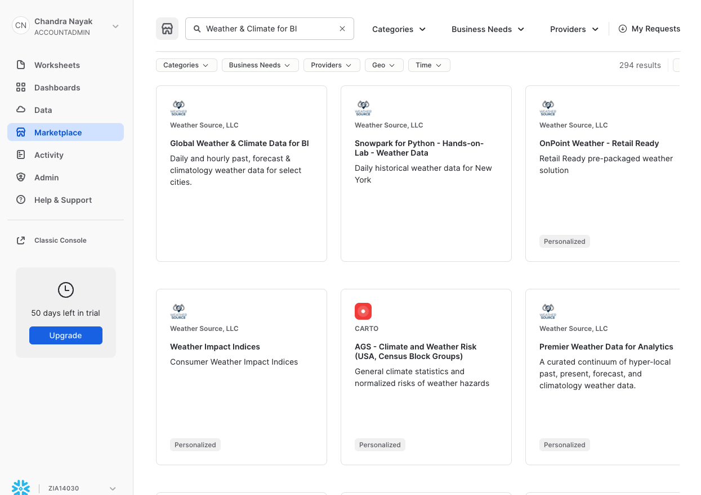

### Set database name to WEATHER, grant access to PUBLIC role

 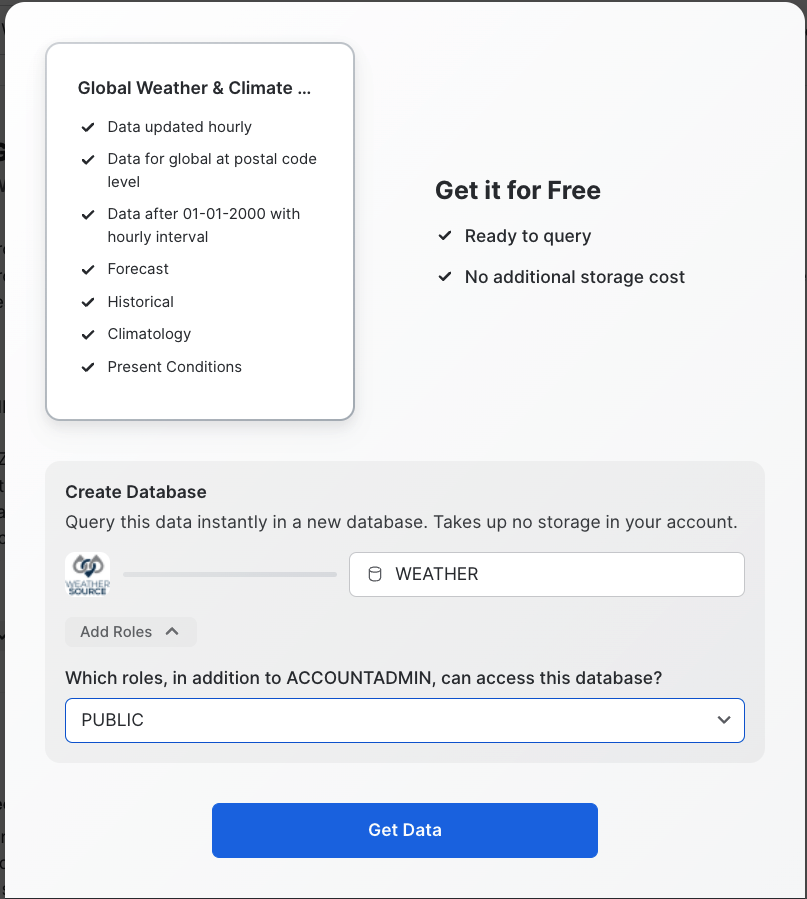

### Data Ready to Query

 


### Let's just query Weather data in a specific zipcode

```sql

-- Is there rain in the forecast that may impact cycling in a specific area 
SELECT COUNTRY,DATE_VALID_STD,TOT_PRECIPITATION_IN,tot_snowfall_in AS SNOWFALL,  POSTAL_CODE, DATEDIFF(day,current_date(),DATE_VALID_STD) AS DAY, HOUR(TIME_INIT_UTC) AS HOUR  FROM WEATHER.STANDARD_TILE.FORECAST_DAY WHERE POSTAL_CODE='32333' AND DAY=7;
```

### Convert Kelvin to Celcius

```sql
-- UDF to convert Kelvin to Celcius
use database vhol_database;
use schema vhol_schema;
use warehouse vhol_wh;
create or replace function degFtoC(k float)
returns float
as
$$
  truncate((k - 32) * 5/9, 2)
$$; 
```

### Is there precipitation or snowfall in NY zipcodes

```sql
create or replace view vhol_weather_vw as
  select 'New York'                                   state,
    date_valid_std                                    observation_date,
    doy_std                                           day_of_year,
    avg(min_temperature_air_2m_f)                     temp_min_f,
    avg(max_temperature_air_2m_f)                     temp_max_f,
    avg(avg_temperature_air_2m_f)                     temp_avg_f,
    avg(degFtoC(min_temperature_air_2m_f))            temp_min_c,
    avg(degFtoC(max_temperature_air_2m_f))            temp_max_c,
    avg(degFtoC(avg_temperature_air_2m_f))            temp_avg_c,
    avg(tot_precipitation_in)                         tot_precip_in,
    avg(tot_snowfall_in)                              tot_snowfall_in,
    avg(tot_snowdepth_in)                             tot_snowdepth_in,
    avg(avg_wind_direction_100m_deg)                  wind_dir,
    avg(avg_wind_speed_100m_mph)                      wind_speed_mph,
    truncate(avg(avg_wind_speed_100m_mph * 1.61), 1)  wind_speed_kph,
    truncate(avg(tot_precipitation_in * 25.4), 1)     tot_precip_mm,
    truncate(avg(tot_snowfall_in * 25.4), 1)          tot_snowfall_mm,
    truncate(avg(tot_snowdepth_in * 25.4), 1)         tot_snowdepth_mm
  from weather.standard_tile.history_day
  where postal_code in ('10257', '10060', '10128', '07307', '10456')
  group by 1, 2, 3;

-- Is it clear to cycle today 
select observation_date, tot_precip_in,  tot_snowfall_in from vhol_weather_vw order by observation_date desc limit 10;
```

<!-- ------------------------ -->

<!-- ------------------------ -->

## Enrich with Geospatial Station Data

Duration: 5

We just have station_id, so let's get geospatial data to locate those stations on map

### Access data from AWS API Gateway

```sql
-- Integration to AWS API Gateway 
create or replace api integration fetch_http_data
  api_provider = aws_api_gateway
  api_aws_role_arn = 'arn:aws:iam::148887191972:role/ExecuteLambdaFunction'
  enabled = true
  api_allowed_prefixes = ('https://dr14z5kz5d.execute-api.us-east-1.amazonaws.com/prod/fetchhttpdata');
```

```sql
-- External Function call to Lambda to download data 

create or replace external function fetch_http_data(v varchar)
    returns variant
    api_integration = fetch_http_data
    as 'https://dr14z5kz5d.execute-api.us-east-1.amazonaws.com/prod/fetchhttpdata';
```


### Flatten JSON data received from API's

Geospatial data is available in a nested json array, let's flatten that

```sql
-- use lateral flatten function to flatten nested JSON and load in Snowflake tables
create or replace table vhol_spatial_data as
with gbfs as (
  select $1 type, 
     fetch_http_data($2) payload
  from (values
    ('region', 'https://gbfs.citibikenyc.com/gbfs/en/system_regions.json'),
    ('station', 'https://gbfs.citibikenyc.com/gbfs/en/station_information.json'),
    ('neighborhood', 'https://snowflake-demo-stuff.s3.amazonaws.com/neighborhoods.geojson'))
  )
  select type, value v
    from gbfs, lateral flatten (input => payload:response.data.regions)
    where type = 'region'
  union all
  select type, value v
    from gbfs, lateral flatten (input => payload:response.data.stations)
    where type = 'station'
  union all
  select type, value v
    from gbfs, lateral flatten (input => payload:response.features)
    where type = 'neighborhood';
    
    
    select * from vhol_spatial_data;
```

## Correlate Trips, Weather and Geospatial Data

Duration: 5

### Combine station data with geospatial data

```sql
create or replace table vhol_stations as with 
  -- Extract the station data
    s as (select 
        v:station_id::number station_id,
        v:region_id::number region_id,
        v:name::string station_name,
        v:lat::float station_lat,
        v:lon::float station_lon,
        st_point(station_lon, station_lat) station_geo,
        v:station_type::string station_type,
        v:capacity::number station_capacity,
        v:rental_methods rental_methods
    from vhol_spatial_data
    where type = 'station'),
    -- Extract the region data
    r as (select
        v:region_id::number region_id,
        v:name::string region_name
    from vhol_spatial_data
    where type = 'region'),
    -- Extract the neighborhood data
    n as (select
        v:properties.neighborhood::string nhood_name,
        v:properties.borough::string borough_name,
        to_geography(v:geometry) nhood_geo
    from vhol_spatial_data
    where type = 'neighborhood')   
-- Join it all together using a spatial join
select station_id, station_name, station_lat, station_lon, station_geo,
  station_type, station_capacity, rental_methods, region_name,
  nhood_name, borough_name, nhood_geo
from s inner join r on s.region_id = r.region_id
       left outer join n on st_contains(n.nhood_geo, s.station_geo);

-- Query station data 
select * from vhol_stations;
```

### Combine Trips, Geospatial and Stations

Let's combine trip data with geospatial to identify popular routes

```sql
create or replace view vhol_trips_stations_vw as (
  with
    t as (select * from vhol_trips_vw),
    ss as (select * from vhol_stations),
    es as (select * from vhol_stations)
  select 
    t.tripid, 
    starttime, endtime, duration, start_station_id,
    ss.station_name start_station, ss.region_name start_region,
    ss.borough_name start_borough, ss.nhood_name start_nhood, 
    ss.station_geo start_geo, ss.station_lat start_lat, ss.station_lon start_lon,
    ss.nhood_geo start_nhood_geo, 
    end_station_id, es.station_name end_station, 
    es.region_name end_region, es.borough_name end_borough, 
    es.nhood_name end_nhood, es.station_geo end_geo, 
    es.station_lat end_lat, es.station_lon end_lon,
    es.nhood_geo end_nhood_geo,
    bikeid, bike_type, dob, gender, member_type, payment, payment_type, payment_num
  from t 
    left outer join ss on start_station_id = ss.station_id
    left outer join es on end_station_id = es.station_id); 


select * from vhol_trips_stations_vw limit 200;
```

### 

### Combine Trip, Geospatial, Stations and Weather data

```sql
create or replace view vhol_trips_stations_weather_vw as (
  select t.*, temp_avg_c, temp_avg_f,
         wind_dir, wind_speed_mph, wind_speed_kph
  from vhol_trips_stations_vw t 
       left outer join vhol_weather_vw w on date_trunc('day', starttime) = observation_date);

-- let's review the integrated data view
select START_STATION,END_STATION,TEMP_AVG_C,WIND_SPEED_KPH from vhol_trips_stations_weather_vw limit 10;
```

### 

## Login to Tableau Online & Connect to Snowflake

Duration: 30

Navigate to https://online.tableau.com/ and login to Tableau Cloud (Online) using your login credentials.

 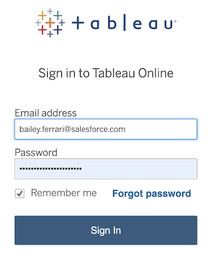

<br>

You will be redirected to the Tableau Cloud (Online) Home page. Within the blue “Welcome to your Tableau site” banner, click into the “New” dropdown and select “Workbook”.

 

<br>

You will be automatically prompted to connect to a data source. Within the “Connect to Data” popup window, select “Connectors”. Find *Snowflake* in the grid.
Note: you may need to use the horizontal bottom scrollbar at the bottom of the window and scroll to the right of the “Connections" tab.

 

<br>

Enter the Server name. Change Authentication to “Username and Password”, enter your login credentials, select role ACCOUNTADMIN & then click the blue “Sign in” button.

 

<br>

Within the connections pane, make the following selections:

* Warehouse: VHOL_WH
* Database: VHOL_DATABASE
* Schema: VHOL_Schema


A list of tables will appear:

 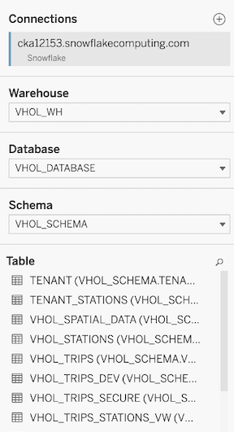

<br>

Hover over the border of the Connections pane window until a black icon appears, then drag the “Connections” window to the right to make it wider. Widen the pane until you can read the full table names. Scroll down in the list of available tables until you find a table called “VHOL_Trips_Stations_Weather_VW”.

 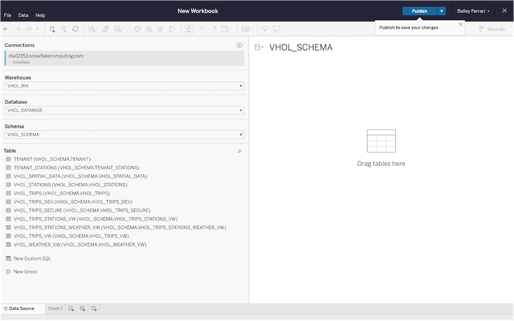

<br>

Drag that table out onto the main section of the screen, where it says “Drag tables here”.

 

<br>

<!-- ------------------------ -->

<!-- ------------------------ -->

<br>

## Configure Data Source Filters

By adding data source filters, we can exclude any outliers that may hinder performance or skew our data. We are going to be adding 3 data source filters total.

In the top right corner of the screen, locate where it says “Filters”. Under “Filters”, there is a button that says “Add”. Click the “Add” button.

 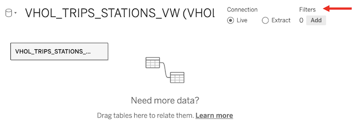

<br>

On the bottom left of the pop-up “Edit Data Source Filters” window, click “Add Filter”.

 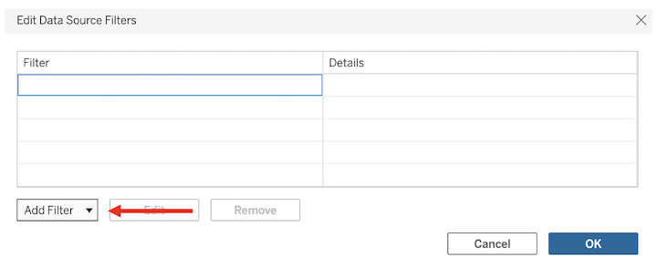

<br>

Within the pop-up, start typing “Start Station”. Click the “Start Station” field.

 

<br>

When the list of Station Names appear, click “Null”, then click “Exclude selected values”. After that, click the blue “OK” button in the bottom right of the pop-up.

 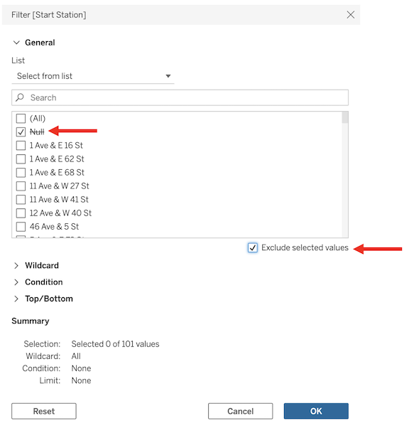

<br>

Repeat these steps for “End Station”; Add Filter → search “End Station” → click Null → Exclude selected values → OK.
 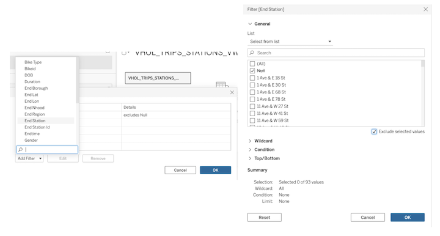

<br>

Lastly, repeat the same steps steps for “Start Borough”; Add Filter → search “Start Borough” → click Null → Exclude selected values → OK.

 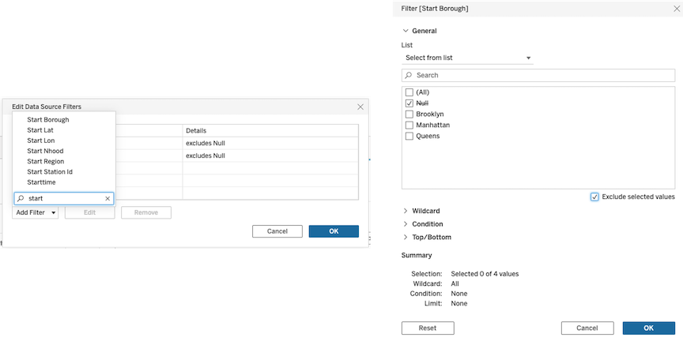

<br>

All 3 Data Source filters should appear within the “Edit Data Source Filters” window, and the “Details” column of the table confirms we are excluding Nulls. Once you’ve confirmed the data source filters have been set correctly, click the blue “OK” button in the bottom right of the “Edit Data Source Filters” window.

 

<br>

We have successfully filtered out incomplete trips or trips without a documented start borough.

<br>

<!-- ------------------------ -->

<!-- ------------------------ -->

<br>

## Visualize Spatial Data

Now we are ready to visualize our data! In the bottom left of the screen, click “Sheet 1”.

 

<br>

Let’s start by creating a simple calculation to count the number of trips in our data set. In the upper toolbar (the toolbar that contains “File”, locate the “Analysis” tab. Within the “Analysis” dropdown, click “Create Calculated Field...”

 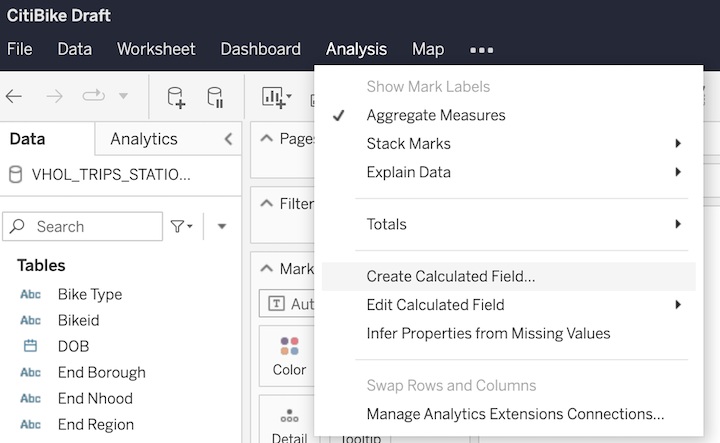

<br>

Change the name of the calculation from “Calculation1” to “Trip Journey”. Click into the blank calculation window below; once a flashing cursor appears, type:

```
MAKELINE([Start Geo],[End Geo])
```

This calculation is creating a line between the station a rider began the ride, and the station a rider ended their ride, effectively plotting the journey they made.

Locate the new “Trip Journey” field within the left Data pane. Immediately after you close the calculated field window, Trip Journey will be highlighted in blue. When a field is blue in Tableau, it means it is a dimension or, in this case, a categorical geographic field.

 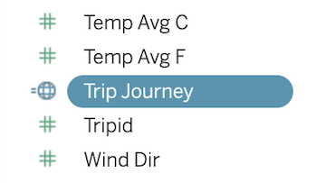

<br>

Click and drag the Trip Journey field into the workspace, where it says “drop field here”. Tableau is going to spin for a moment here, but it shouldn’t take more than 45-60 seconds. Not only is this complex spatial data, but it’s the first time Tableau is indexing it or storing it in its cache — this initial ingestion step is the only time it will take this long to render.

Upon rendering, you’ll notice that Tableau not only automatically creates a map for us, but also plots a line between the start location and the end location.

 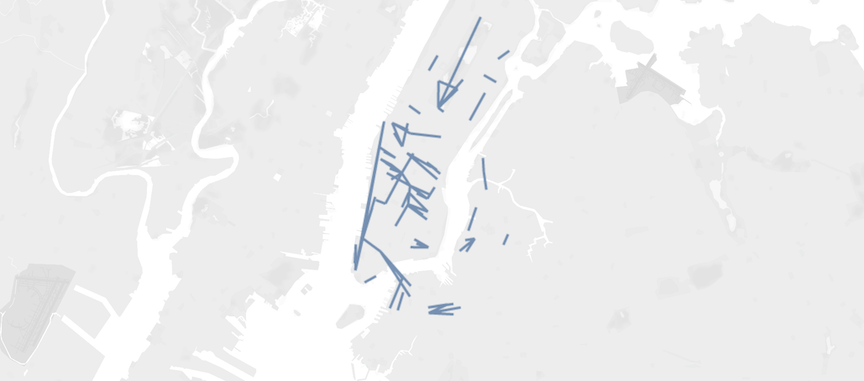

<br>

If you hover over the map, you will notice that Tableau is grouping all of the trips together into one single Mark. By adding layers of detail, we can isolate each individual trip.

The first Detail we will add is “Start Station”. Locate the “Start Station” field in the Data pane, and drag it onto the “Detail” icon within the Marks card. Tableau will spin for a bit, but it shouldn’t take more than 30-45 seconds to render.

 

<br>

Repeat the steps above with “End Station”. Locate the “End Station” field within the Data pane, then drag it onto Detail. Tableau will spin for a bit, but it shouldn’t take more than 30-45 seconds to render.

 

<br>

Now hover over any of the marks on the map. You will see we’ve effectively isolated the different trips, creating a mark for each journey.

 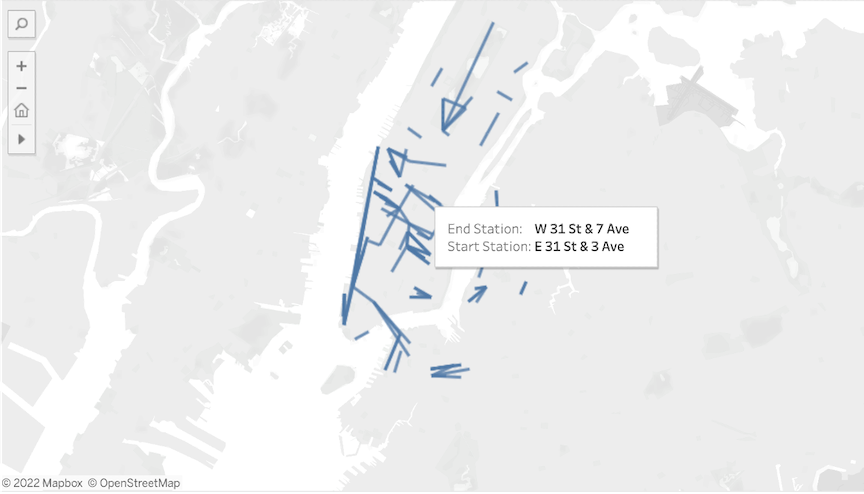

<br>

<!-- ------------------------ -->

<!-- ------------------------ -->

<br>

## Add KPIs to the Tooltip

The white box that appears when you hover over a mark on a view within a Tableau worksheet or Tableau dashboard is called a “Tooltip”. As you build in Tableau, you have the flexibility and autonomy to customize Tooltips as you see fit.

Currently, our Tooltip only contains **Start Station** and **End Station**, and it isn’t formatted super intuitively. Let’s add a few other interesting metrics, then adjust the formatting to read more like a sentence.

We'll begin by writing another calculation. Within the “Analysis” dropdown, click “Create Calculated Field...”

 

<br>

Rename the field from “Calculation 1” to “Number of Trips”. Click into the blank calculation window below; once a flashing cursor appears, type:

```
CountD([Tripid])
```

Click the blue “OK” button on the bottom right of the calculated field window.

Locate the new “Number of Trips” field within the left Data pane. When you close the calculated field window, the “Number of Trips” field will be highlighted in green.

Click and drag “Number of Trips” onto the “Tooltip” icon within the Marks card.

 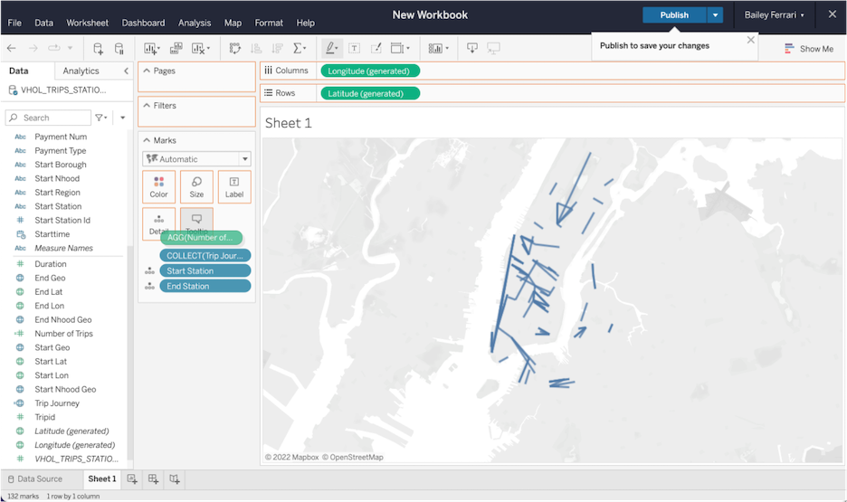

<br>

Next, locate the “Duration” field. As you did with “Number of Trips”, drag and drop “Duration” onto the “Tooltip” icon within the Marks card.

When Duration is dropped on Tooltip,  you’ll notice Tableau sets the aggregation to SUM(). In our case, we actually do not want to find the sum, we want to find the average. Fortunately, Tableau makes it easy to alter the aggregation type. Simply hover over the green SUM(Duration) field within the Marks card until an arrow appears in the right corner of the field. Click that arrow to open a drop-down menu and change “Measure” from **Sum** to **Average**.

 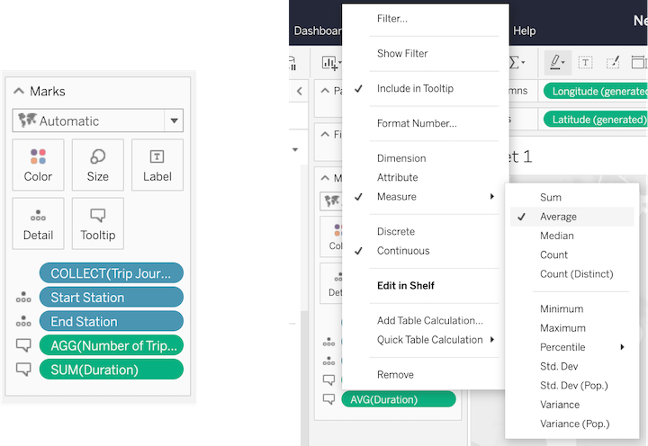

<br>

Now hover over any of the lines on the map. You’ll notice the Tooltip now contains the number of trips taken and the average duration of each trip in minutes.

 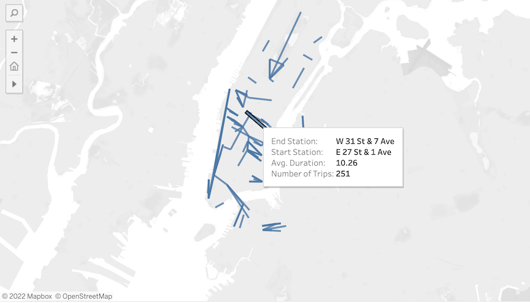

<br>

As I mentioned, Tooltips can easily be reformatted. Click the Tooltip icon within the Marks card to open a rich text editor.

 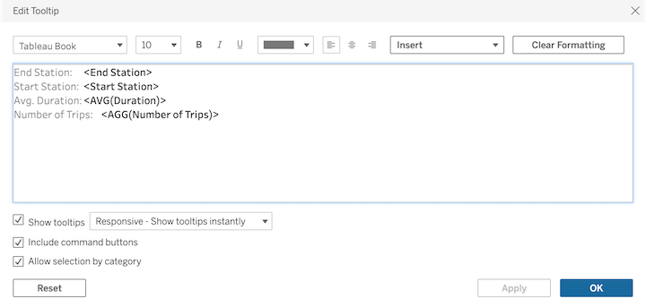

<br>

Within the “Edit Tooltip” window, highlight all of the auto-populated text and delete it. (Don’t worry, it isn’t gone forever, we’re just going to present the information differently).

In the blank window, type or paste:

```
“*<AGG(Number of Trips)>* people rode a CitiBike from *<Start Station>* to *<End Station>*.
On average, this trip took *<AVG(Duration)> minutes* to complete.”
```

Make sure to bold all of the field names before hitting the blue “OK” button at the bottom of the window.

 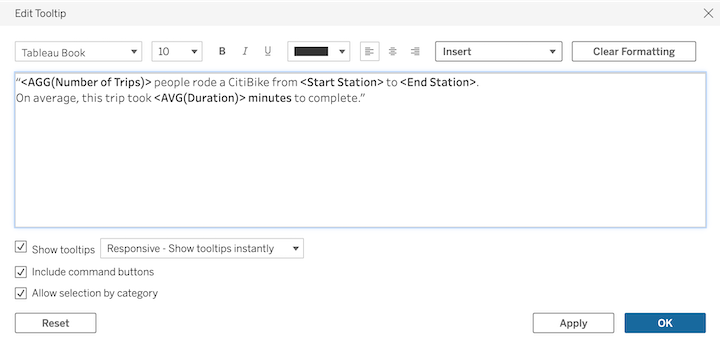

<br>

<!-- ------------------------ -->

<!-- ------------------------ -->

<br>

## Handle Map Layers

Now, we can add Map Layers.

Locate the “Start Geo” field in the Data pane, and drag it into the view, directly on top of our existing map. You’ll notice a “Map Layers” icon appears in the top left corner of the Map. Drag the “Start Geo” field onto that button, making sure to release the field only when the Map Layers icon is highlighted in orange.

 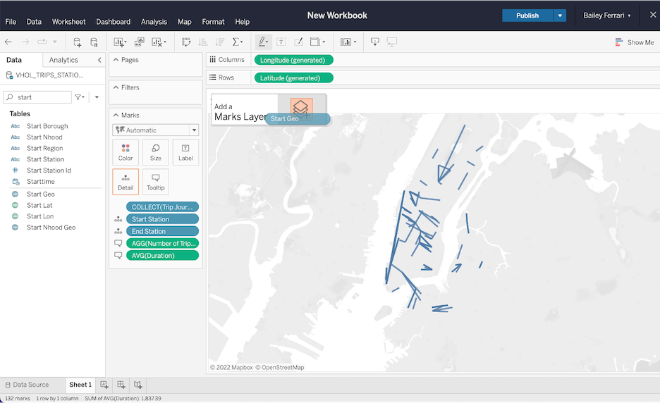

<br>

Repeat this process with the “End Geo” field.

 

<br>

Let’s pause and assess our map. We now have a line representing the journey each rider took, a dot where they started, and a dot where they ended.

You’ll notice that within the Marks card, Tableau has isolated all three of our Map layers: Start Geo, End Geo, and Trip Journey.

 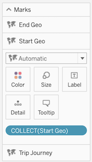

<br>

We can reorder these layers via simple drag and drop.  Let’s move ”Start Geo“ above ”End Geo“. Click the ”Start Geo“ tab and drag it above the ”End Geo“ tab.

 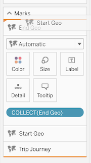


### Format Map Layers

Select the “Start Geo” section of the Marks card, then click the “Color” button within the “Start Geo” Marks card.

 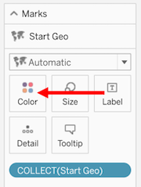

<br>

At the top of the “Color” pop-up menu, click the lightest shade of *blue*. At the bottom of the “Color” pop-up, click into the “Halo” drop-down. Within this menu, select the darkest shade of *blue*. The marks on the map update immediately.

 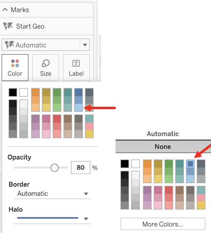

<br>

Next, let’s customize the “End Geo” map layer to differentiate the starting point from the ending point.

Select the “End Geo” section of the Marks card, then click the “Color” icon. At the top of the “Color” pop-up menu, click the lightest shades of *orange*. At the bottom of the “Color” pop-up, click into the “Halo” drop-down. Within this menu, select the darkest shade of *orange*. Again, the marks on the map update immediately.

 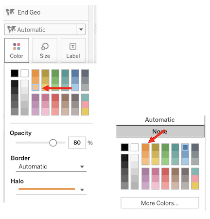

<br>

The last Map Layer to customize is “Trip Journey”. Select the “Trip Journey” section of the Marks card, then click the “Color” icon. At the top of the “Color” pop-up, click the second to lightest shade of gray.

 

<br>

Now, click the “Size” icon directly to the right of the “Color” icon. Drag the Size slider to the left, decreasing the Mark Size by approximately 50%.

 


### Enhance the Map with Custom Backgrounds

Within the top toolbar directly to the right of “Analysis”, click into the “Map” tab.

Hover over the first option in the pop-up drop-down, “Background Maps”, and change the selection from “Light” to “Normal”. You’ll notice we now have color and shading to help us differentiate streets from water and landmarks.

 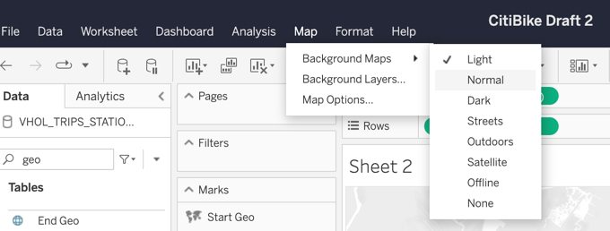

<br>

Go back to the “Map” tab in the top toolbar. This time, click into “Background Layers...”. Tableau comes packaged with a wide variety of background map details for you to enable or disable as you choose. In our case, let’s add “Streets, Highways, Routes” to our view. Simply click that checkbox within the list.

 

<br>

Exit the “Background Layers” pane by clicking the “X” on the top right. Clicking this X will bring you back to the familiar Data pane.

<br>

<!-- ------------------------ -->

<!-- ------------------------ -->

<br>

## Format Worksheet Title & Add Filter

Now, let’s format the title of this worksheet! Much like you can do with Tooltips, you have the ability to customize and integrate key fields or metrics in your title as well.

There are two fields I would like to add to our title that isn’t currently in our view: start time and average temperature.

To incorporate these fields into the view, start by clicking into the “Start Geo” tab within the Marks card.

 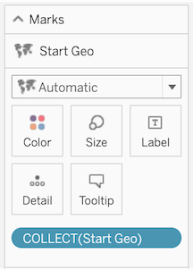

<br>

Locate the “Starttime” field within the Data pane, then drag that field onto the “Detail” icon within the Marks card.

 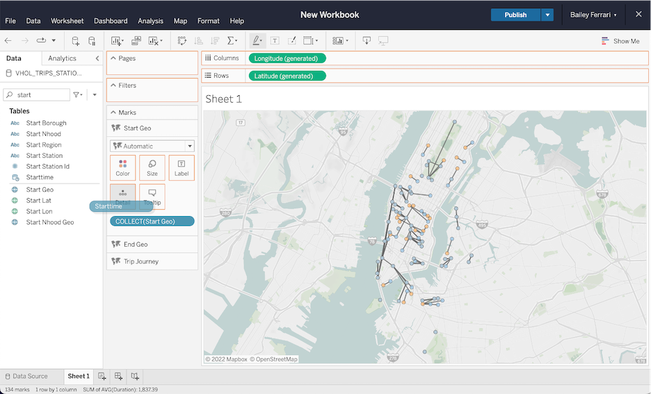

<br>

You’ll notice that Tableau automatically groups the dates by year. While rolling up to a yearly level may be helpful in some cases, it isn’t what we want here.

To alter this, hover over the blue YEAR(Starttime) field within the Marks card until an arrow appears in the right corner of the field. Click that arrow to open a drop-down menu.

Within the menu, select the *second* “Month” option from the lower section of the drop-down.

 

<br>

Next, locate the “Temp Avg F” field within the Data pane, then drag that field onto the “Detail” icon within the Marks card.

Just like “Duration“, Tableau set the aggregation to sum. To change it to average, simply hover over the green SUM(Temp Avg F) field within the Marks card until an arrow appears in the right corner of the field. Click that arrow to open a drop-down menu and change “Measure” from Sum to Average.

 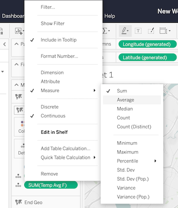

<br>

Now, double click where it says “Sheet 1” above the map. This will open a rich text editor.

Delete “Sheet 1” and type or paste:

```
CitiBike Bike Rides in <MONTH(Starttime)> (Avg Temp: <AVG(Temp Avg F)> °F) <br>
The dark gray lines represent *trip* *journeys*, the blue dots represent the *Start Station*, and the orange dots represent the *End Station*. Hover over any line to see the number of trips taken and the average trip time in minutes.
```

Highlight “CitiBike Bike Rides in <MONTH(Starttime)> (Avg Temp: <AVG(Temp Avg F)> °F)” and change the font size to *20*.

Highlight “The dark gray lines represent *trip* *journeys*, the blue dots represent the *Start Station*, and the orange dots represent the *End Station*. Hover over any line to see the number of trips taken and the average trip time in minutes.“ and change the font size to *12*.

 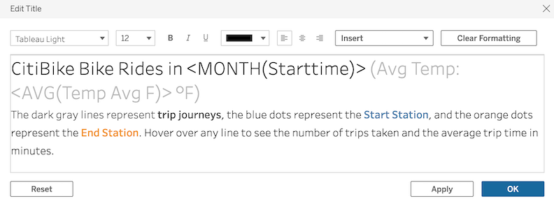

<br>

Finally, let’s add a filter into our view.

Locate the “Start Borough” field within the Data pane, then drag that field onto the Filters card.

 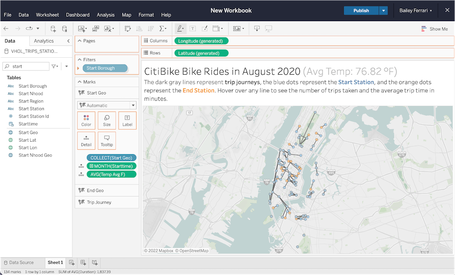

<br>

In the pop-up “Filter \[Start Borough\]” menu, select (All) then hit the blue “OK” button.

 

<br>

On the bottom left of the screen, right click where it says “Sheet 1” and select “Rename” from the menu. Update the Sheet name to “Map”.

 

<br>

<!-- ------------------------ -->

<!-- ------------------------ -->

<br>

## Publish a Simple Dashboard

Click the middle icon on the bottom banner.

The first thing we are going to do adjust our dashboard size. On the far left of the screen, you’ll notice that the *Data* pane has been replaced with the *Dashboard* pane — that’s how you can confirm you are authoring a dashboard, not a worksheet.

To change the size of the dashboard, find the “Size” section within the Dashboard pane and click where it says “Desktop Browser (1000 x 800)”.

Alter the dashboard sizing accordingly:

* Width *1150*
* Height *700*


Locate the “Maps” worksheet under the “Sheets” section of the Dashboard pane. Click and drag that worksheet into the workspace, releasing where it says “Add sheets here”. If we had made more than one worksheet, you would repeat this process until all of the desired sheets were added to your dashboard.

 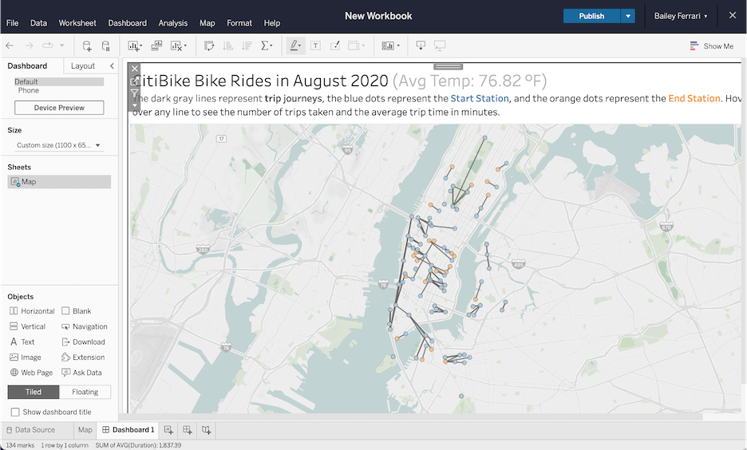

<br>

We’re done! Right click on “Dashboard 1” and rename it “CitiBike”. Click the blue “Publish” button at the top of the screen. Name the Workbook “CitiBike” and, under Location, select your “default” folder. When you’re done, hit the blue “Publish” button at the bottom of the screen to.

 

<br>

After it finishes processing your request, the dashboard will load and a pop-up message will appear at the top of the screen. Within that message, click “Go to workbook”.

 

<br>

Select “CitiBike” to load the dashboard.

 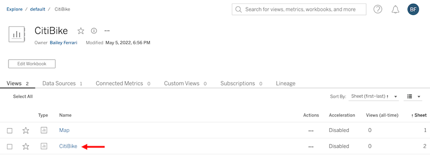

<br>

<!-- ------------------------ -->

<!-- ------------------------ -->

<br>

### Embed the Dashboard into a Web Page

Click the white “Share” button at the top right of the screen.

 

<br>

Under “Share using a link”, click “Copy Link”.

 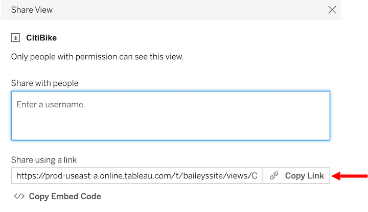

<br>

As a prerequisite, you were instructed to download a text editor called Visual Studio Code (VS Code). Open that Application.

 

<br>

Locate the  “Tableau Embedded Portal” folder we provided at the begging on this lab.

 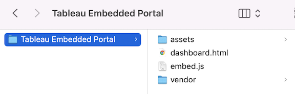

<br>

Open the “Tableau Embedded Portal” folder in VS Code by clicking “Open” on the “Get Started” window and then selecting the folder name, or by simply dragging the folder into the VS Code window.

 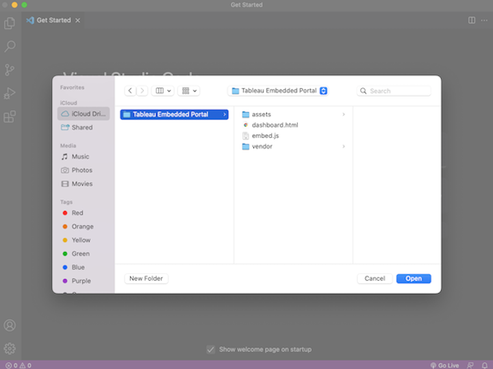

<br>

Once you’ve opened the folder in VS Code, you’ll notice two key files: dashboard.html and embed.js. Within the lefthand “Explorer” pane, click to open the *embed.js* file.

 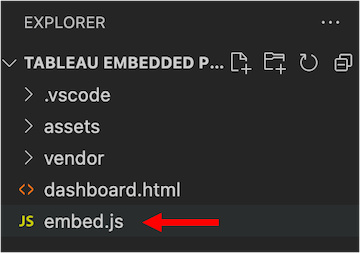

<br>

On line 8 where the annotations prompt you to “PASTE LINK HERE“, paste the embed link we copied from Tableau Online. After pasting, save your changes using File → Save.

 

<br>

Now within the “Explorer” pane, right click on “dashboard.html” and select “Open in Default Browser” from the drop-down menu. This will open the webpage you just embedded your Tableau dashboard into.

 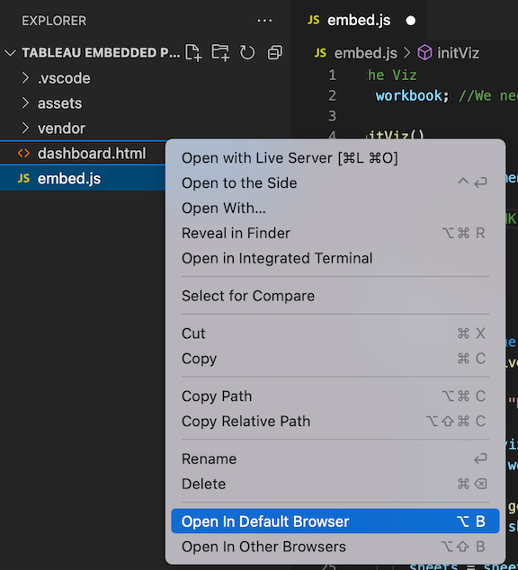

<br>

Now we can not only view our Tableau dashboard within an external webpage, but we can actually interact with it!

 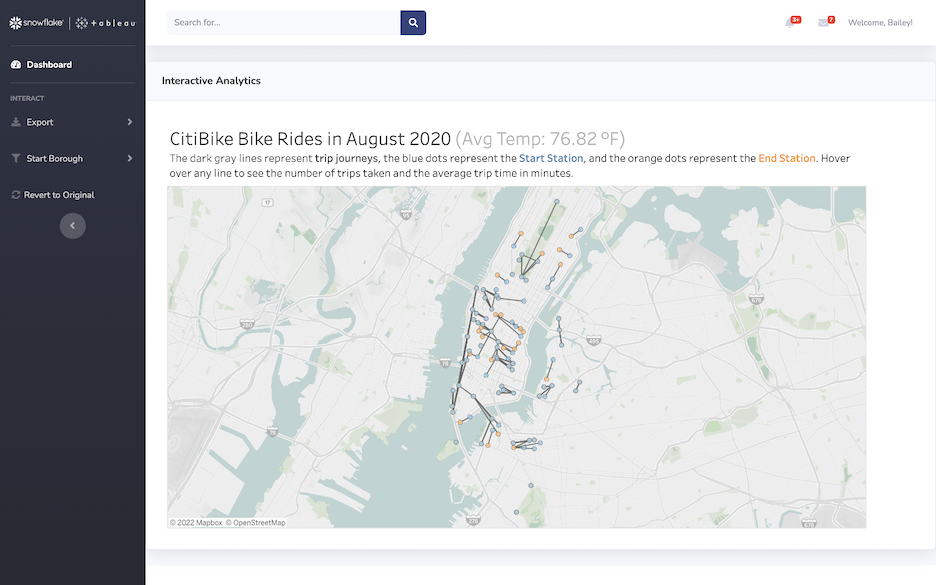

<br>

Remember when we added the “Start Borough” field into our worksheet in Tableau Online? By doing that, we told Tableau we want to use that field as a filter. This enables us to leverage Tableau’s JavaScript API to translate the selections we make within a webpage into filters within Tableau.

In the left pane of the webpage, click “Start Borough”. Select “Brooklyn” within the “Start Boroughs” filter menu. That selection will be passed into Tableau.

 

<br>

The dashboard will zoom and filter, showing us only trips that started in Brooklyn.

 

<br>

<!-- ------------------------ -->

<!-- ------------------------ -->

<br>


## Secure Data Sharing

Duration: 5

```sql
create or replace table tenant (
    tenant_id number,
    tenant_description string,
    tenant_account string
);

--Let's get your Snowflake Account 
select current_account(); 

--add tenant for your account
insert into tenant values (
    1, 'My Account', current_account()
);


--map tenant to subscribed station beacons
create or replace table tenant_stations (
    tenant_id number,
    station_id number
);

-- Add start_stations in 200 range for Tenant 1
insert into tenant_stations values
    (1, 212),
  (1, 216),
  (1, 217),
  (1, 218),
  (1, 223),
  (1, 224),
  (1, 225),
  (1, 228),
  (1, 229),
  (1, 232),
  (1, 233),
  (1, 236),
  (1, 237),
  (1, 238),
  (1, 239),
  (1, 241),
  (1, 242),
  (1, 243),
  (1, 244),
  (1, 245),
  (1, 247),
  (1, 248),
  (1, 249),
  (1, 250),
  (1, 251),
  (1, 252),
  (1, 253),
  (1, 254),
  (1, 255),
  (1, 257),
  (1, 258),
  (1, 259),
  (1, 260),
  (1, 261),
  (1, 262),
  (1, 263),
  (1, 264),
  (1, 265),
  (1, 266),
  (1, 267),
  (1, 268),
  (1, 270),
  (1, 271),
  (1, 274),
  (1, 275),
  (1, 276),
  (1, 278),
  (1, 279),
  (1, 280),
  (1, 281),
  (1, 282),
  (1, 284),
  (1, 285),
  (1, 289),
  (1, 290),
  (1, 291),
  (1, 293),
  (1, 294),
  (1, 295),
  (1, 296),
  (1, 297),
  (1, 298)
;
```

### Optional : Control data access based on context

```sql
--select *
select * from tenant_stations;

--select
set tenant_sv = '1';

select * from vhol_trips_vw
join tenant_stations
    on vhol_trips_vw.start_station_id = tenant_stations.station_id
join tenant
    on tenant_stations.tenant_id = tenant.tenant_id
where
    tenant.tenant_id = $tenant_sv
limit 100;

--select bogus
set tenant_sv = '0';

select * from vhol_trips_vw
join tenant_stations
    on vhol_trips_vw.start_station_id = tenant_stations.station_id
join tenant
    on tenant_stations.tenant_id = tenant.tenant_id
where
    tenant.tenant_id = $tenant_sv
limit 100;
```

### Create Secure Objects to Share

```sql
--secure view
create or replace secure view  vhol_trips_secure as
(select --tripduration, 
 starttime, endtime, start_station_id, bikeid, tenant.tenant_id from vhol_trips_vw
join tenant_stations
    on vhol_trips_vw.start_station_id = tenant_stations.station_id
join tenant
    on tenant_stations.tenant_id = tenant.tenant_id
where
    tenant.tenant_account = current_account());

--current account?
select current_account();

--select secure view

select * from vhol_trips_secure limit 100;
```

### Create Reader Account

```sql
--create a reader account for your tenant

DROP MANAGED ACCOUNT IF EXISTS IMP_CLIENT;
CREATE MANAGED ACCOUNT IMP_CLIENT
    admin_name='USER',
    admin_password='P@ssword123',
    type=reader,
    COMMENT='Testing'; -- Take a note of the Account Name and the URL .. give it a minute before you test url

show managed accounts; 
--take note of account_locator
SELECT "locator" FROM TABLE (result_scan(last_query_id(-1))) WHERE "name" = 'IMP_CLIENT';
```


:::info
**Replace *GOA63594 with your locator***

:::

```sql
--Replace ***'GOA63594'*** with your locator for 'IMP_CLIENT' from above step
set account_locator='GOA63594';

--add tenant for your big important client via a reader account
insert into tenant values (
    1, 'Big Important Client, Wink Wink', $account_locator
);
```


### Share Access to Reader

```sql
--create share and share to reader account
CREATE OR REPLACE SHARE VHOL_SHARE COMMENT='Creating my Share to Share with my Reader';
GRANT USAGE ON DATABASE VHOL_DATABASE TO SHARE VHOL_SHARE;
GRANT USAGE ON SCHEMA VHOL_SCHEMA TO SHARE VHOL_SHARE;
GRANT SELECT ON VIEW VHOL_TRIPS_SECURE TO SHARE VHOL_SHARE;
DESC SHARE VHOL_SHARE;

ALTER SHARE VHOL_SHARE ADD ACCOUNT = $account_locator;

show managed accounts;
-- Click on reader account url below and login with credentials (USER,P@ssword123) 
select  $6 as URL FROM table (result_scan(last_query_id())) WHERE "name" = 'IMP_CLIENT';

 
```

### 

<!-- ------------------------ -->

<!-- ------------------------ -->

## Optional: Consumer Access Data

Duration: 5

### Login to Reader Account

 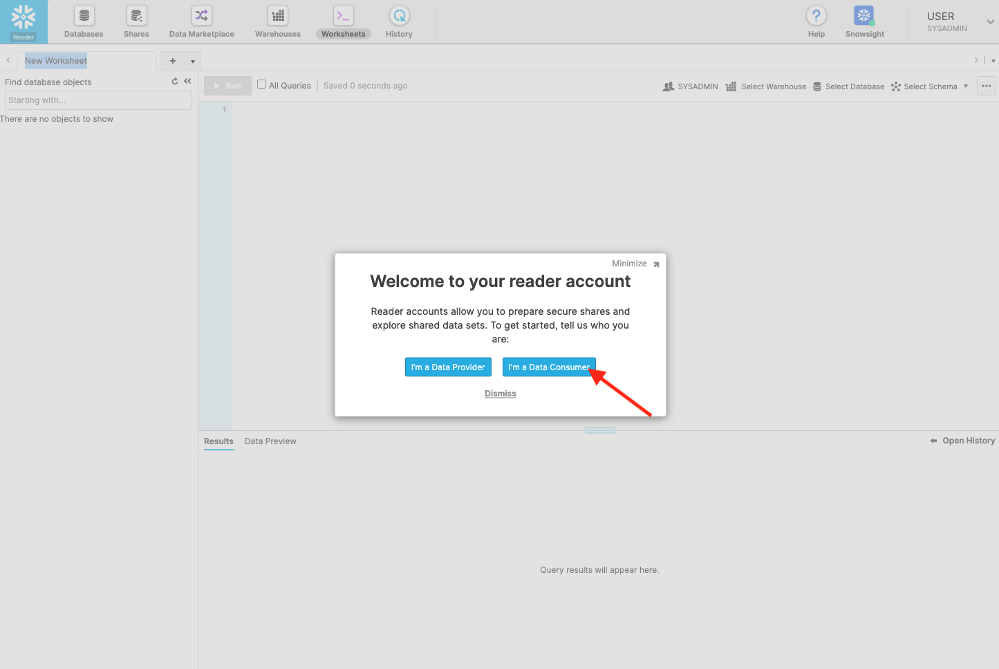

### Connect to Snowsight

 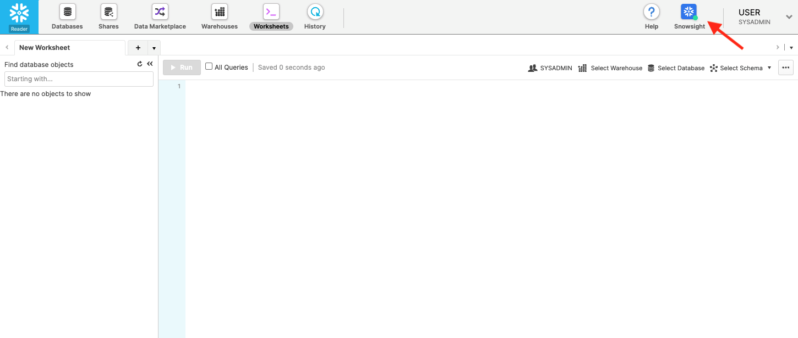


### Set Role ACCOUNTADMIN & Add Worksheet

[Download reader_query.sql & Create Worksheet from SQL File](https://snowflake-workshop-lab.s3.amazonaws.com/citibike-trips/reader_query.sql)          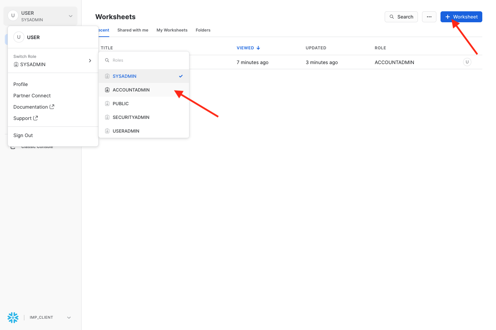


```sql
-- create database from share in the reader account  
use role accountadmin;
create or replace warehouse VHOL_READER WITH 
    WAREHOUSE_SIZE = 'XSMALL' 
    WAREHOUSE_TYPE = 'STANDARD' 
    AUTO_SUSPEND = 60 
    AUTO_RESUME = TRUE 
    MIN_CLUSTER_COUNT = 1 
    MAX_CLUSTER_COUNT = 1 
    SCALING_POLICY = 'STANDARD';
show shares like 'VHOL_SHARE%';
select  "name" FROM table (result_scan(last_query_id()));
```


:::info
**Replace LKA85298.VHOL_SHARE with your share**

:::

```sql
<!-- ------------------------ -->
-- replace your share name ***LKA85298.VHOL_SHARE*** from above query
CREATE OR REPLACE DATABASE TRIPSDB FROM SHARE LKA85298.VHOL_SHARE;
USE WAREHOUSE VHOL_READER;
USE DATABASE TRIPSDB;
USE SCHEMA VHOL_SCHEMA; 

SELECT * FROM VHOL_SCHEMA.VHOL_TRIPS_SECURE;

<!-- ------------------------ -->
```

## Optional: DevOps in Snowflake

Duration: 5

### Clone Table

```sql
create table vhol_trips_dev clone vhol_trips;

select * from vhol_trips_dev limit 1;
```

### Drop and Undrop Table

```sql

drop table vhol_trips_dev; 

-- statement will fail because the object is dropped
select * from vhol_trips_dev limit 1; 

--thank to Snowflake! we can bring it back to life
undrop table vhol_trips_dev;

select * from vhol_trips_dev limit 1;
```

### Cleanup the Demo Account


:::info
**Replace AOA45492 with your account**

:::

```sql
set account_locator = 'AOA45492';
alter share VHOL_SHARE remove account = $account_locator;
drop share VHOL_SHARE;
drop schema vhol_schema;
drop database vhol_database;
drop warehouse VHOL_WH;
```

<!-- ------------------------ -->


## Conclusion

Congratulations! you have completed the lab.

In this lab we captured semi-structured data coming from NewYork Citibikes, enriched that data with geospatial data, and weather data from  Snowflake Data marketplace data to find correlation between demand for bicycles and weather. We visualized the data using Tableau to quickly arrive at relevant insights.

[Semi-structured Data](https://docs.snowflake.com/en/user-guide/semistructured-concepts.html)
<br>
</br>
[Secure Data Sharing](https://docs.snowflake.com/en/user-guide/data-sharing-intro.html)
<br>
</br>
[Snowflake Data Marketplace](https://other-docs.snowflake.com/en/data-marketplace.html)
<br></br>

### Video on the Demo

[Youtube - Video on the Demo](https://www.youtube.com/watch?v=9zMtimcooxo)
<!-- ------------------------ -->

<br>