author: Chandra Nayak & Madeline Lee
id: visual_analytics_powered_by_snowflake_and_tableau
summary: Visual Analytics Powered by Snowflake and Tableau
categories: Getting-Started
environments: web
status: Published
feedback link: https://github.com/Snowflake-Labs/sfguides/issues
tags: Data Engineering, Data Collaboration, Date Lake

# Visual Analytics Powered by Snowflake and Tableau

Duration: 60

<!-- ------------------------ -->

## Overview

Join Snowflake and Tableau for an instructor-led hands-on lab to build governed, visual, and interactive analytics quickly and easily on Food Truck data.

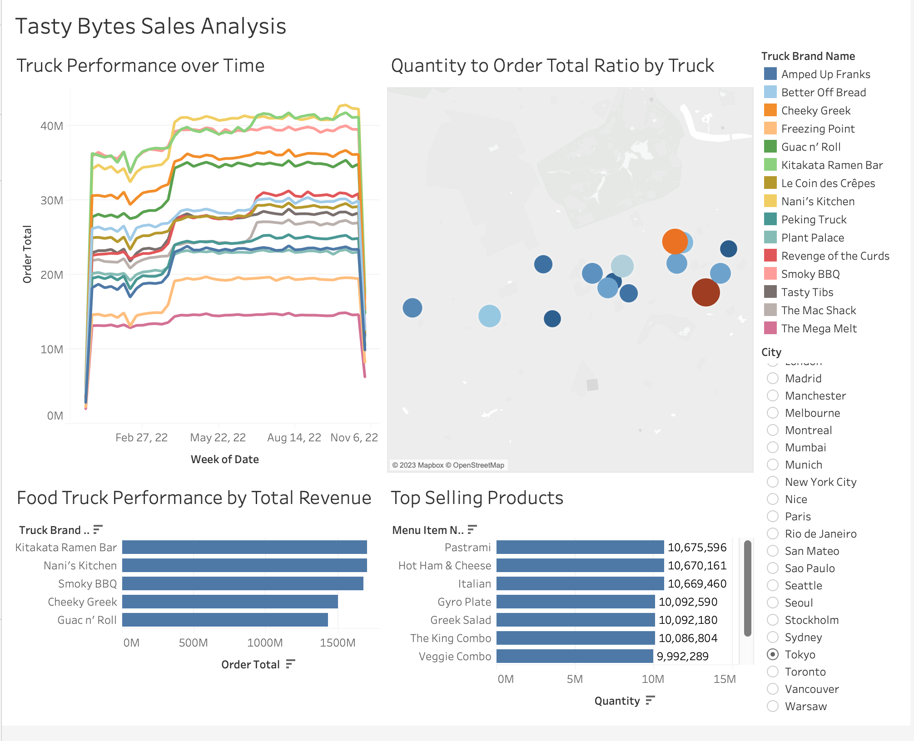

### What You’ll Learn

* Loading semi-structured data into Snowflake
* Querying Iceberg data in external DataLakes 
* Snowflake Generative AI Functions
* Building Visualization using Tableau on Snowflake data. 


### What You’ll Build

* Using structured and semi-structured data in Snowflake
* Creating Snowflake managed Iceberg tables to access external datalakes
* Using Snowflake Cortex functions to Translate non-english reviews, and extract Sentiment
* A simple Tableau dashboard, and Pulse metric to visualize Snowflake data. 

### Prerequisites

* Familiarity with Snowflake, AWS and Tableau
* [Snowflake](https://trial.snowflake.com/) account or free trial *** choose AWS and Enterprise ***
* [AWS](https://aws.amazon.com) account or free trial *** choose same region as Snowflake Account ***
* [Tabelau Online](https://www.tableau.com/products/online/request-trial) account or free trial

<!--- ------------------------- -->

## Snowflake Setup
Duration: 2

1. Create a Snowflake enterprise trial account 
2. Login to your Snowflake account


### Snowflake User Interface

 

### Download Scripts and Create Worksheet from SQL 


<!-- ------------------------ -->

## Manage Semi-Structured Data

Duration: 5

### Run the scripts in a Snowsight or VSCode 

#### Create Snowflake Database and Warehouse 
[Click here to download  create_db_wh.sql](scripts/create_db_wh.sql)

#### Grant Privileges on Snowflake Objects
[Click here to download grantperms.sql](scripts/grant_perms.sql)

#### Create Snowflake Stages and Native Tables
[Click here to download createobjects.sql](scripts/create_objects.sql)

#### Load data into Raw Tables 
[Click here to download tabloadraw.sql](scripts/tab_load_raw.sql)


## DataLake Integration 

### Create the necessary AWS Configuration 
Duration: 15 

#### Download the Customer Reviews files to your laptop

unzip the file before you load into AWS bucket
[click here to download for reviews zipfile](assets/2022.zip)

**Login to AWS Account, and create a bucket in the same region as your Snowflake account**


#### Upload the folder from your laptop to the S3 bucket.
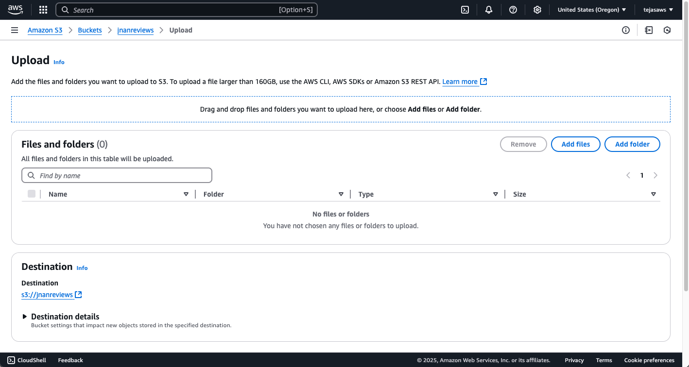

#### Take a note of your AWS Account ID.
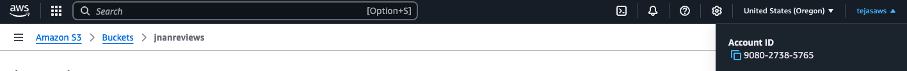

**Now, in your Snowflake account let us run scripts to integrate with AWS**

[Copy from below or click here to download SQL](scripts/aws_integration.sql)
```sql

USE DATABASE frostbyte_tasty_bytes;
USE SCHEMA raw_customer;

CREATE or REPLACE STORAGE INTEGRATION frostbyte_tasty_bytes.raw_customer.int_tastybytes_truckreviews
  TYPE = EXTERNAL_STAGE
  STORAGE_PROVIDER = 'S3'
  STORAGE_AWS_ROLE_ARN = 'arn:aws:iam::<your AWS account ID>:role/<give a new name for IAM role>' -- ex: snow_s3_access_role
  ENABLED = TRUE
  STORAGE_ALLOWED_LOCATIONS = ('s3://<name of your S3 bucket>');


CREATE OR REPLACE FILE FORMAT frostbyte_tasty_bytes.raw_customer.ff_csv
    TYPE = 'csv'
    SKIP_HEADER = 1   
    FIELD_DELIMITER = '|';

CREATE OR REPLACE STAGE frostbyte_tasty_bytes.raw_customer.stg_truck_reviews
    STORAGE_INTEGRATION = int_tastybytes_truckreviews
    URL = 's3://<name of your S3 bucket>/'
    FILE_FORMAT = ff_csv;

-- You will need the output of these values in AWS CloudFormation in Next Steps
DESC INTEGRATION frostbyte_tasty_bytes.raw_customer.int_tastybytes_truckreviews; 
```
#### You need following values from Storage Integration for next steps
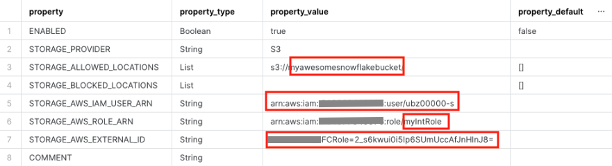

### Launch the AWS CloudFormation 
**Click the template and login to AWS** [CloudFormationTemplate](https://console.aws.amazon.com/cloudformation/home?region=us-west-2#/stacks/new?stackName=Snowflake-storage-integration&templateURL=https://snowflake-corp-se-workshop.s3.us-west-1.amazonaws.com/CFTs/storageInt.json)

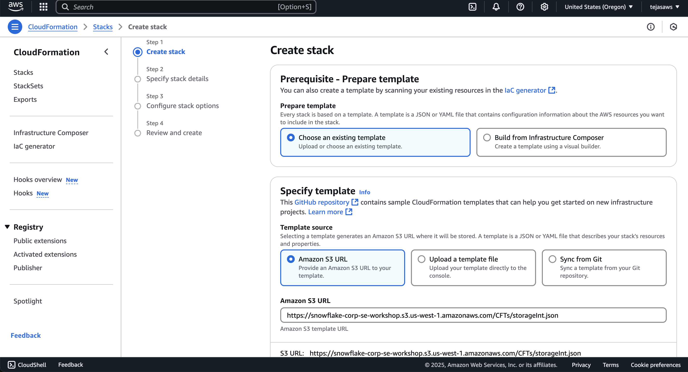

#### Copy the values below  
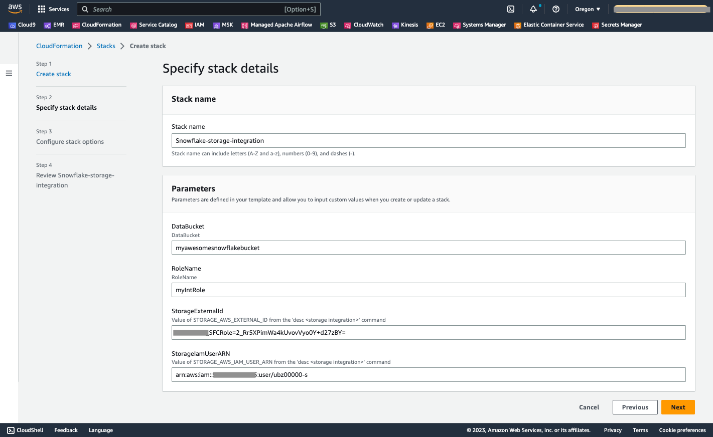

**Select defaults for remaining screens and submit** 

#### Validate AWS access by running below SQL in Snowflake
``` sql

 --- Test if your AWS Storage is Accessible 
SELECT   SYSTEM$VALIDATE_STORAGE_INTEGRATION('<integration_name>',    's3://<bucket>/',    'validate_all.txt', 'all'); 
```
##### Output should show success for READ and LIST  
{
  "status" : "success","actions" : { "READ" : { "status" : "success" }, "LIST" : { "status" : "success" }}
}


### Create Snowflake managed Iceberg Tables to access Datalake and query reviews data
Download the script or run below sql 
[Query Review Data](scripts/query_iceberg.sql)
```sql 
USE ROLE ACCOUNTADMIN;
USE DATABASE  frostbyte_tasty_bytes;
USE SCHEMA raw_customer;
--- Test if your AWS Storage is Accessible 
SELECT   SYSTEM$VALIDATE_STORAGE_INTEGRATION('<integration_name>',    's3://<bucket>/',    'validate_all.txt', 'all'); 


CREATE OR REPLACE EXTERNAL VOLUME vol_tastybytes_truckreviews
    STORAGE_LOCATIONS =
        (
            (
                NAME = 'reviews-s3-volume'
                STORAGE_PROVIDER = 'S3'
                STORAGE_BASE_URL = 's3://jnanreviews'
                STORAGE_AWS_ROLE_ARN = 'arn:aws:iam::<aws-account-id>:role/<snow_role>' --ex:snow_s3_access_role 
                STORAGE_AWS_EXTERNAL_ID = 'external_id' -- enter your external id 
            )
            
        )ALLOW_WRITES=true; 

-- Create Iceberg Tables to track metadata 
CREATE OR REPLACE ICEBERG TABLE iceberg_truck_reviews
        (
        source_name VARCHAR,
        quarter varchar,
        order_id BIGINT,
        truck_id INT,
        language VARCHAR, 
        review VARCHAR,
        primary_city VARCHAR,
        customer_id varchar,
        year date,
        month date,
        truck_brand VARCHAR,
        review_date date
        )
        CATALOG = 'SNOWFLAKE'
        EXTERNAL_VOLUME = 'vol_tastybytes_truckreviews'
        BASE_LOCATION = 'reviews-s3-volume'; 


-- Insert  Metadata from External Files 
INSERT INTO iceberg_truck_reviews
(
        source_name,
        quarter,
        order_id,
        truck_id,
        language, 
        review,
        primary_city ,
        customer_id ,
        year ,
        month ,
        truck_brand ,
        review_date 
)
SELECT 
       SPLIT_PART(METADATA$FILENAME, '/', 4) as source_name,
       CONCAT(SPLIT_PART(METADATA$FILENAME, '/', 2),'/' ,SPLIT_PART(METADATA$FILENAME, '/', 3)) as quarter,
       $1 as order_id,
       $2 as truck_id,
       $3 as language,
       $5 as review,
       $6 as primary_city, 
       $7 as customer_id,
       $8 as year,
       $9 as month,
       $10 as truck_brand,
       DATEADD(day,-UNIFORM(0,180,RANDOM()),CURRENT_DATE()) as review_date
FROM @stg_truck_reviews 
(FILE_FORMAT => 'FF_CSV',
PATTERN => '.*reviews.*[.]csv') 
;


-- Create a view on the Iceberg Reviews, and run Cortex AI to extract Sentiment
USE SCHEMA analytics;

-- We have non-english reviews from global customers
SELECT order_id, quarter, truck_id, language, source_name, primary_city, truck_brand , review, review_date from frostbyte_tasty_bytes.raw_customer.iceberg_truck_reviews  where language !='en' order by review_date desc;

-- Snowflake Cortex makes it easy for us to translate and extract sentiment out of unstructured data
CREATE OR REPLACE VIEW  frostbyte_tasty_bytes.analytics.product_unified_reviews as             
    SELECT order_id, quarter, truck_id, language, source_name, primary_city, truck_brand , snowflake.cortex.sentiment(review) , review_date  from frostbyte_tasty_bytes.raw_customer.iceberg_truck_reviews  where language='en'
    UNION    
    SELECT order_id, quarter, truck_id, language, source_name, primary_city, truck_brand , snowflake.cortex.sentiment(snowflake.cortex.translate(review,language,'en')), review_date  from frostbyte_tasty_bytes.raw_customer.iceberg_truck_reviews where language !='en';


select * from frostbyte_tasty_bytes.analytics.product_unified_reviews limit 100;

-- Sentiment Grouped By City and Brand 

CREATE OR REPLACE VIEW  frostbyte_tasty_bytes.analytics.product_sentiment AS 
SELECT primary_city, truck_brand, avg(snowflake.cortex.sentiment(review_date)) as avg_review_sentiment 
FROM frostbyte_tasty_bytes.analytics.product_unified_reviews
group by primary_city, truck_brand;


-- Query the average the query sentiment by city and brand 
select * from frostbyte_tasty_bytes.analytics.product_sentiment limit 10;
```


<!-- ------------------------ -->


## Connect Tableau to Snowflake

Duration: 20

Navigate to https://online.tableau.com/ and login to Tableau Cloud (Online) using your login credentials.

If using a trial site, make sure you have agent and Pulse enabled - see this video for instructions https://www.youtube.com/watch?v=I9jQt0xM_JY&ab_channel=Tableau

<br>

You will be redirected to the Tableau Cloud (Online) Home page. Within the blue “Welcome to your Tableau site” banner, click into the “New” dropdown and select “Workbook”.

 

<br>

You will be automatically prompted to connect to a data source. Within the “Connect to Data” popup window, select “Connectors”. Find *Snowflake* in the grid.
Note: you may need to use the horizontal bottom scrollbar at the bottom of the window and scroll to the right of the “Connections" tab.

 

<br>

Enter the Server name. Note that you will need to remove the 'https://' from the name (see screenshot). You can find the server name [insert instructions here] Change the authentication method to username/password, enter your credentials & then click the blue “Sign in” button.

 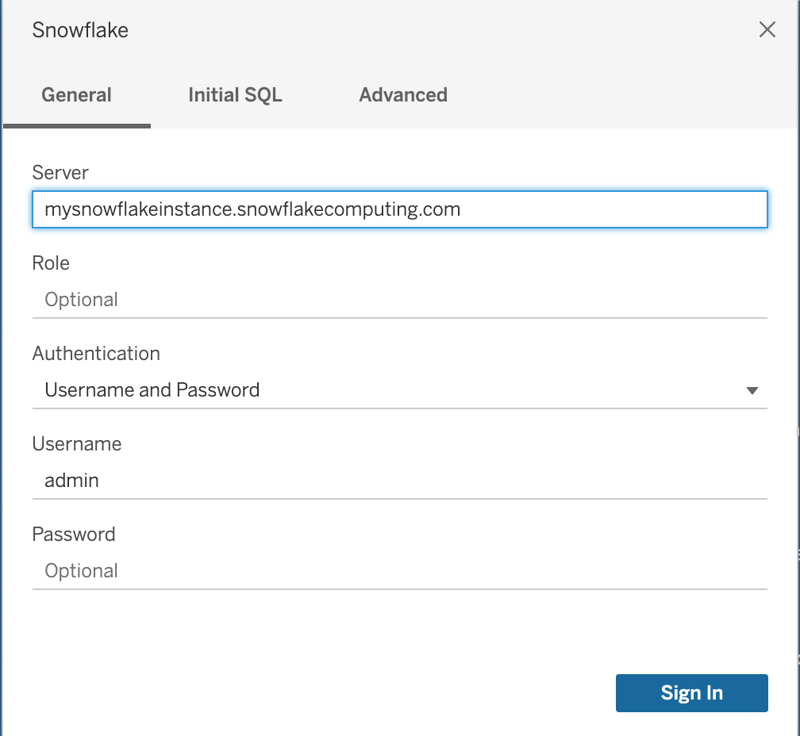

<br>

Within the connections pane, make the following selections:

* Warehouse: your warehouse
* Database: FROSTBYTE_TASTY_BYTES
* Schema: ANALYTICS


A list of tables will appear:

 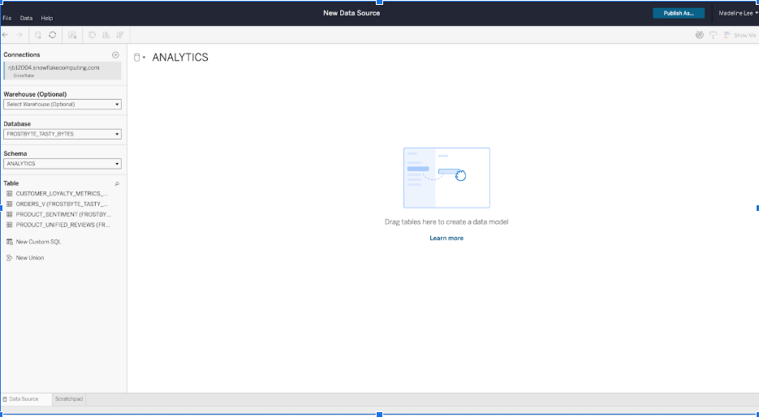


<br>

Click and drag the 'ORDERS_V' table where it says “Drag tables here”.

<br>

Next, click and drag the 'PRODUCT_FINAL REVIEWS' to the Canvas. This will create a relationship. In Tableau, a relationship is a flexible way to do multi-table analysis without creating one large flat table. Make sure that the fields are mapped correctly by matching 'Primary City’, ‘Truck ID’, and ‘Order ID’.

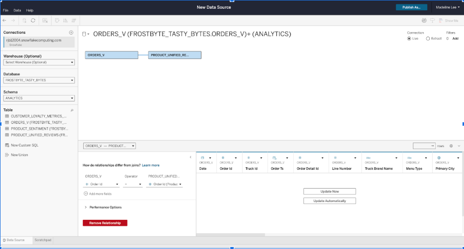

Drag Customer Loyalty Metrics out to the canvas, and map Orders and Customer Loyalty Metrics table by joining on ‘Customer ID’.

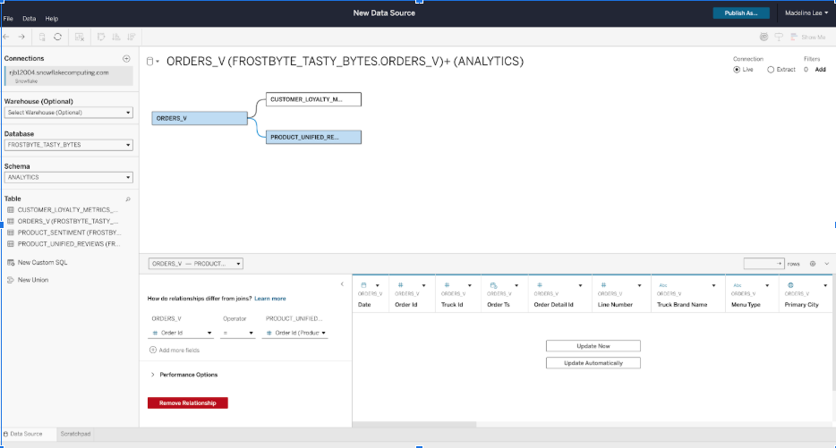

Let’s publish this data source and call it ‘Frostbyte’. Embed the credentials for now.

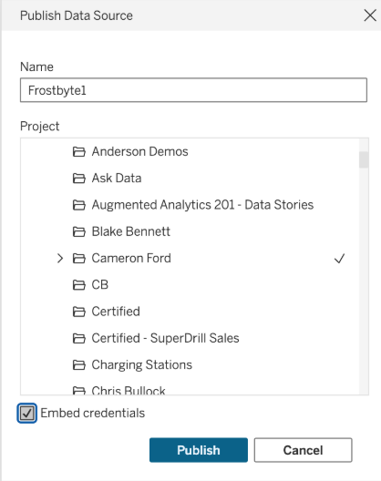

Click Publish.

<!-- ------------------------ -->

<!-- ------------------------ -->

<br>

## Visualize Data

Now we are ready to visualize our data! Click ‘Go to Frostbye’. From the published data source, click ‘New’ and select ‘New Workbook’. In the bottom left of the screen, click “Sheet 1”.

 

 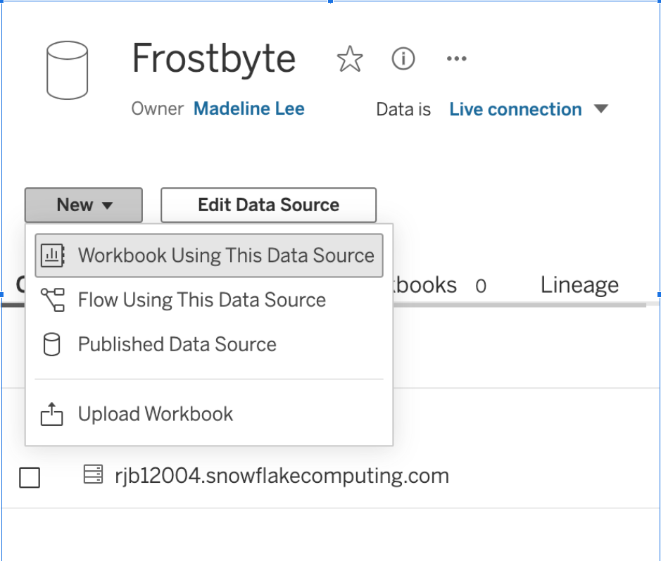
<br>

We'll start by getting a quick sense of how each Truck Brand is doing in terms of reviews. Start a Tableau Agent session by clicking the astro logo in the top right corner. Click ‘Got it’ to initiate the session. Then, click ‘Suggestions’.

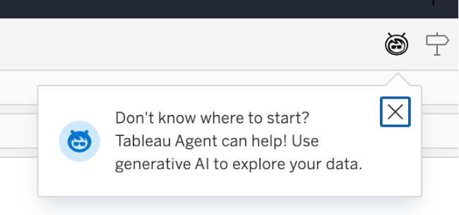

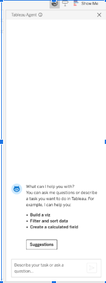

<br>
Click on any suggestion. It may take time for Tableau Agent to index your data. See how it will build the visualization for you, and also give you feedback in the agent chat itself. 
<br>


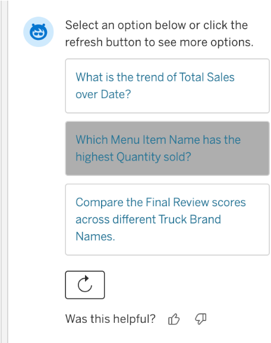

Next, type in ‘Compare average reviews by truck brand’ and hit enter. See how the visualization is created. 

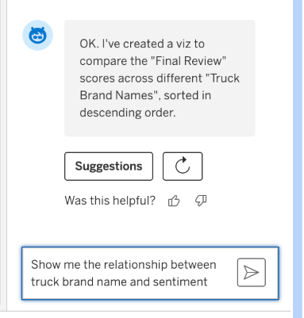

Now Tableau Agent is iterative, so lets add complexity to the viz by dragging and dropping. we don’t have to just use the chat to build this. Drag ‘Primary City’ from the sentiment table to the rows shelf, to the left of ‘Truck Brand Name’.

<br>

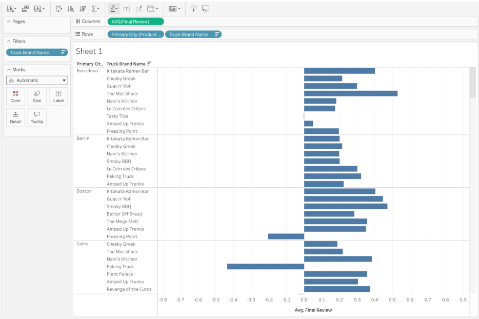

Now we can see the breakdown of sentiment for each truck in each city- and look, there is some average negative sentiment! Let’s focus on only those trucks.
Next, let’s use an agent to filter the data. Type in ‘filter to only trucks with negative average reviews for each city’ and hit enter.

<br>

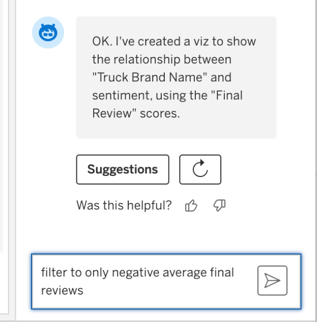

Wow, this might be something to take note of. We should help those truck owners out and figure out how we can increase our service or quality, since it seems customers are disappointed and have bad associations with those trucks in those cities. 

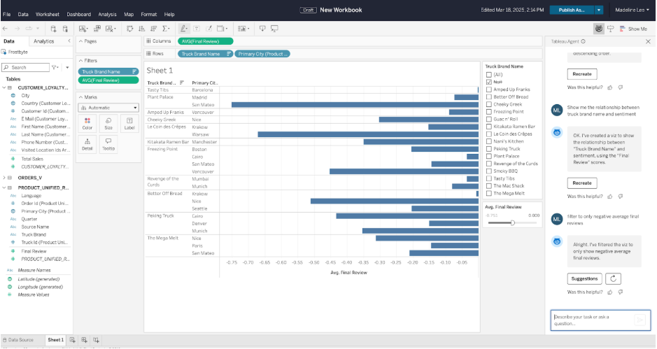

Finally, we’ll want to see if it’s a busy truck, and how many orders are coming through those trucks, to figure out where to focus first. I’ll drag out ‘Count Orders_V’ onto the Color tab in the details pane.

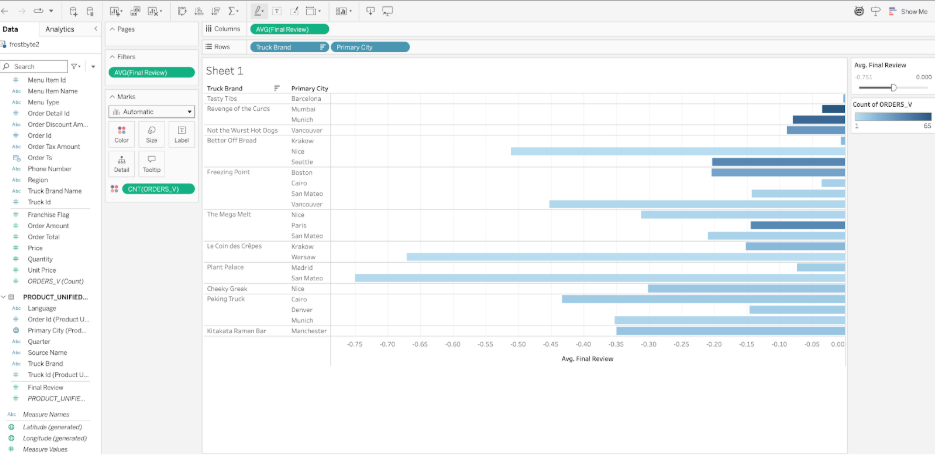

Looks like we should focus on trucks in Mumbai first, as they are getting the most orders, and have negative reviews. 

Save the workbook.


<!-- ------------------------ -->

<!-- ------------------------ -->

<br>

## Publish
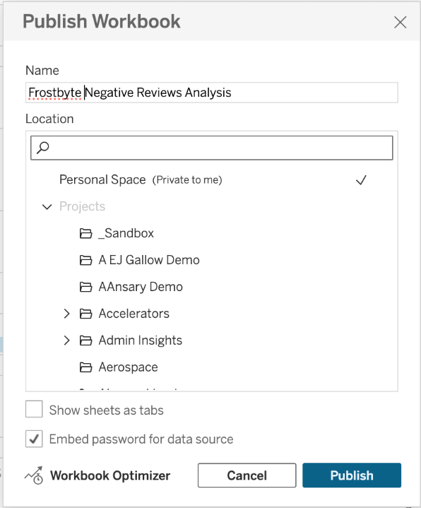

Lets see if we can track that over time and get alerts on any dropping review sentiment using Tableau Pulse. Save this
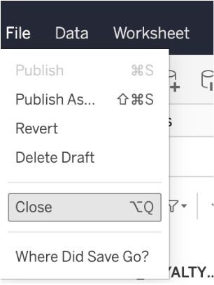


<br>
Next, navigate to Tableau Pulse. Click ‘New Metric Definition’.

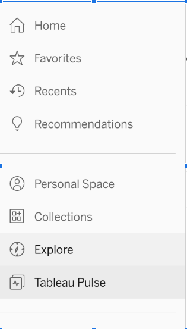


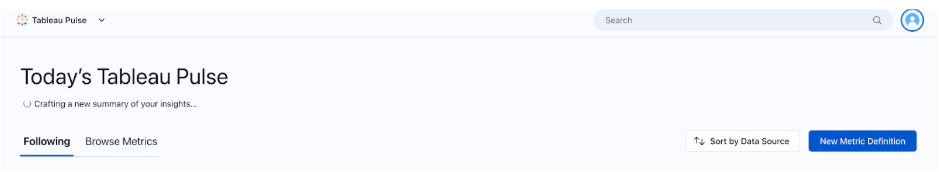

Select the data source you just published named ‘Frostbyte’.

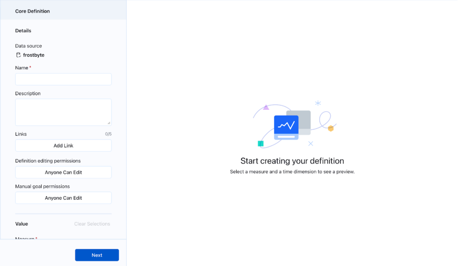
Name your pulse metric ‘Average Review Sentiment’ and fill out the values in the screenshot. We want to track average final review sentiment over the date. Select ‘Review Sentiment’, ‘Average aggregation, and ‘Review Date’ as the time dimension.

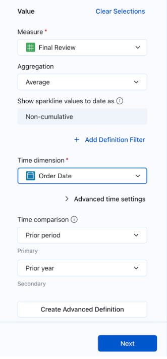

<br>

Add filters such as ‘Truck Brand Name’ and ‘Primary City’.

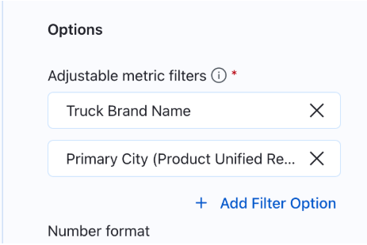

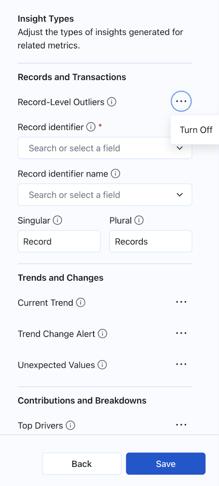

Click Next, Next, until you get to the Records and Transitions page. Since we don’t have unique identifiers for the reviews, we will turn this setting off.

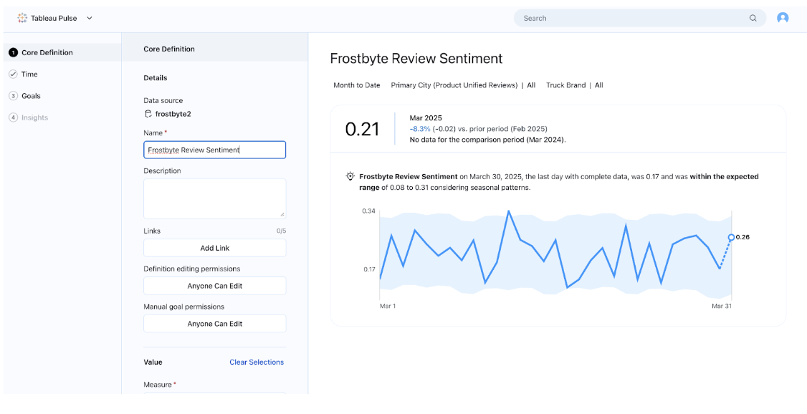

Your Metric should look something like this. Click save, and your published metric should load automatically.
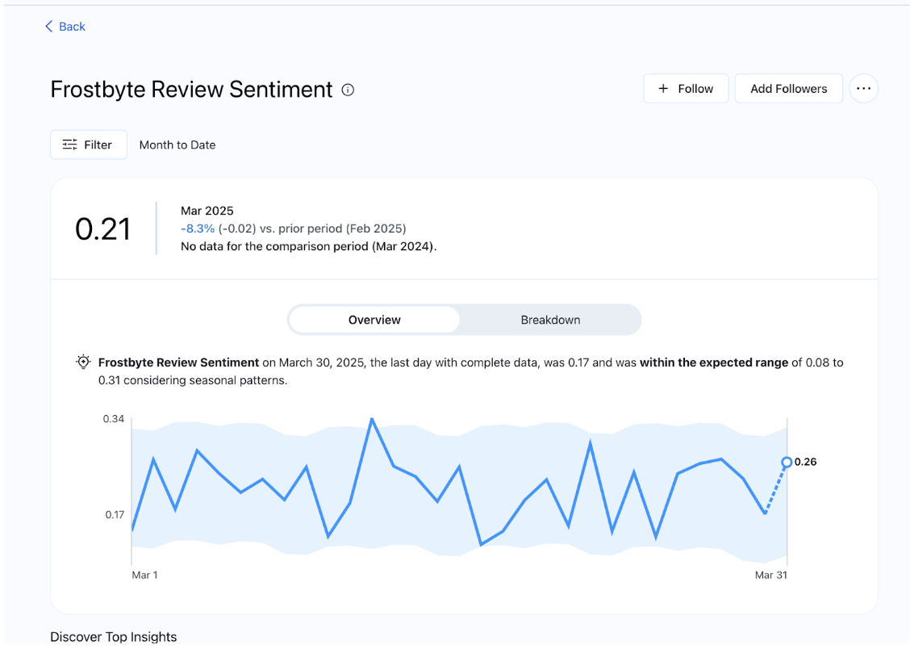

New: Set a goal to 0.25, or a value between 0 and 1, to get notified every time average sentiment across all trucks goes below that number. 

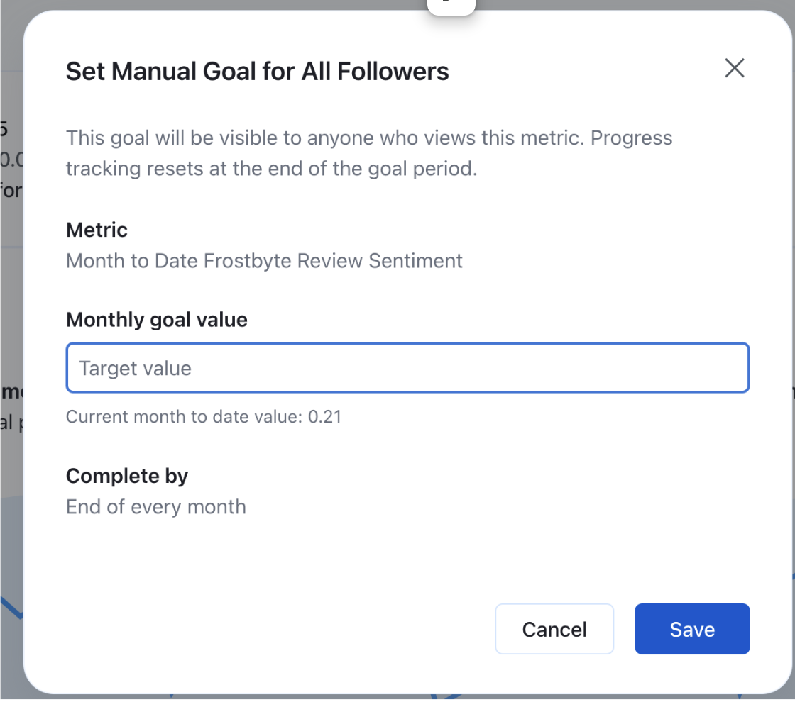

Click Save.


Congratulations! You have successfully completed the Tableau portion.


<!-- ------------------------ -->
## Clean Up 
[Download tb_reset_vhol.sql ](scripts/tb_reset_vhol.sql) or run below sql

```sql
USE ROLE accountadmin;

DROP FUNCTION IF EXISTS frostbyte_tasty_bytes.analytics.fahrenheit_to_celsius(NUMBER(35,4));
DROP FUNCTION IF EXISTS frostbyte_tasty_bytes.analytics.inch_to_millimeter(NUMBER(35,4));

--USE ROLE sysdmin;
DROP DATABASE IF EXISTS frostbyte_tasty_bytes;   
DROP DATABASE IF EXISTS frostbyte_weathersource;
DROP WAREHOUSE IF EXISTS demo_build_wh; 
DROP WAREHOUSE IF EXISTS tasty_de_wh;
DROP WAREHOUSE IF EXISTS tasty_bi_wh;
```

## Conclusion and Resources

Congratulations! you have successfully completed the lab.

### What You Learned

 * In this lab we loaded semi-structured data from TastyBytes food truck, read external  
      datalake using Iceberg tables.
 * Leverage Snowflake Cortex to translate and extract sentiment scores.
 * Use Tableau Pulse metrics to track against CSAT goals. 


### Resources 

[Semi-structured Data](https://docs.snowflake.com/en/user-guide/semistructured-concepts.html)

[Iceberg Tables](https://docs.snowflake.com/en/user-guide/tables-iceberg)

[Snowflake Marketplace](https://other-docs.snowflake.com/en/data-marketplace.html)


