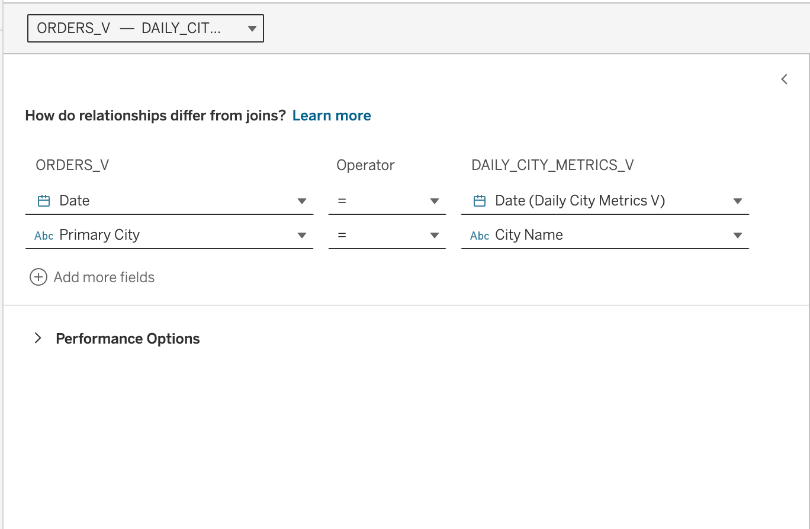
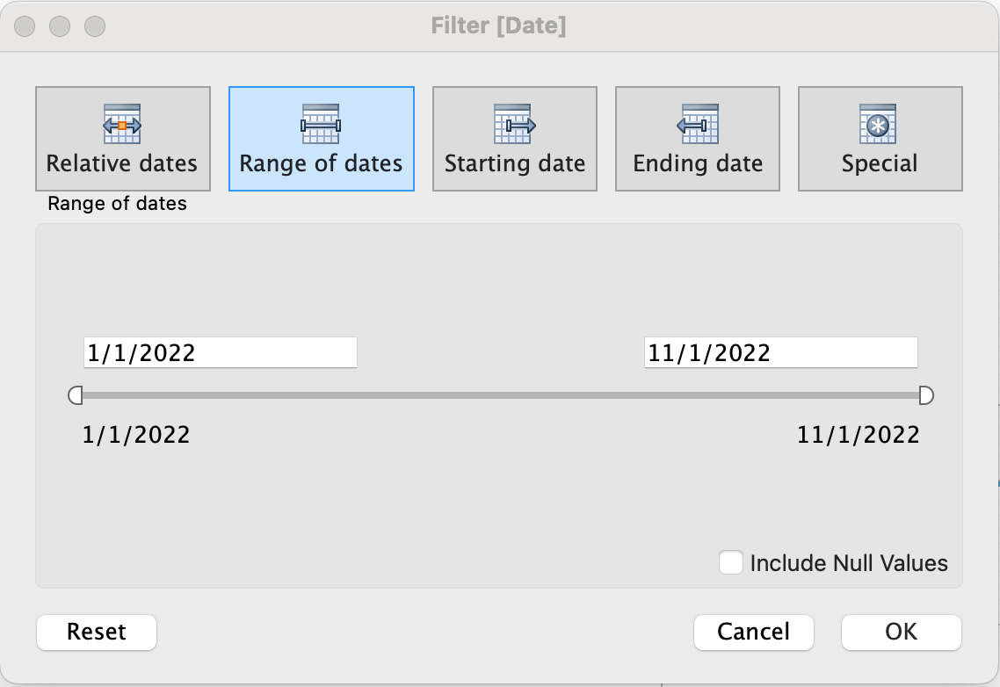
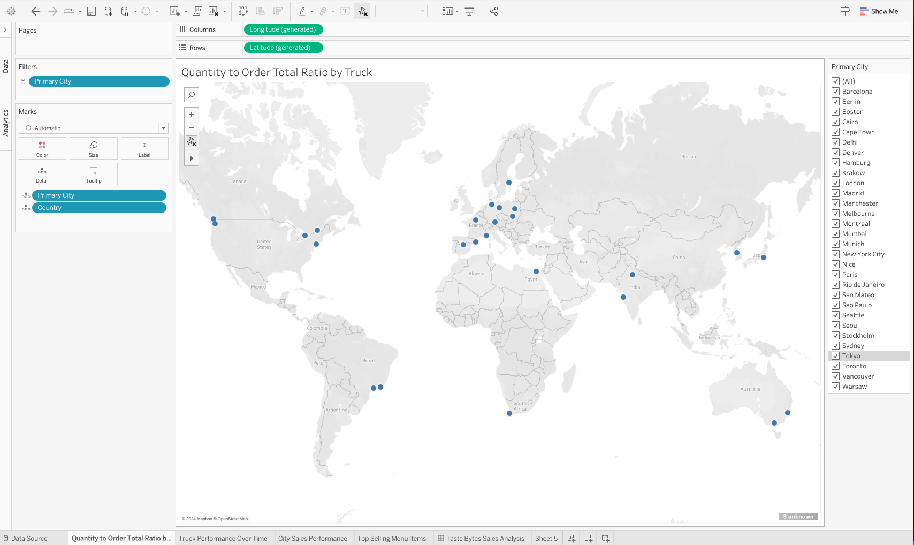
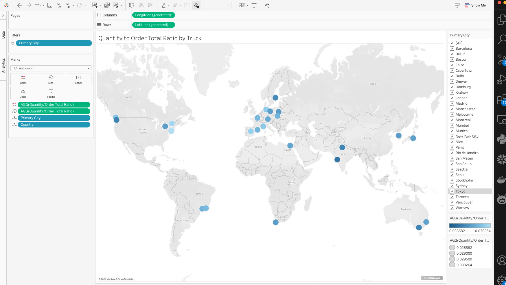
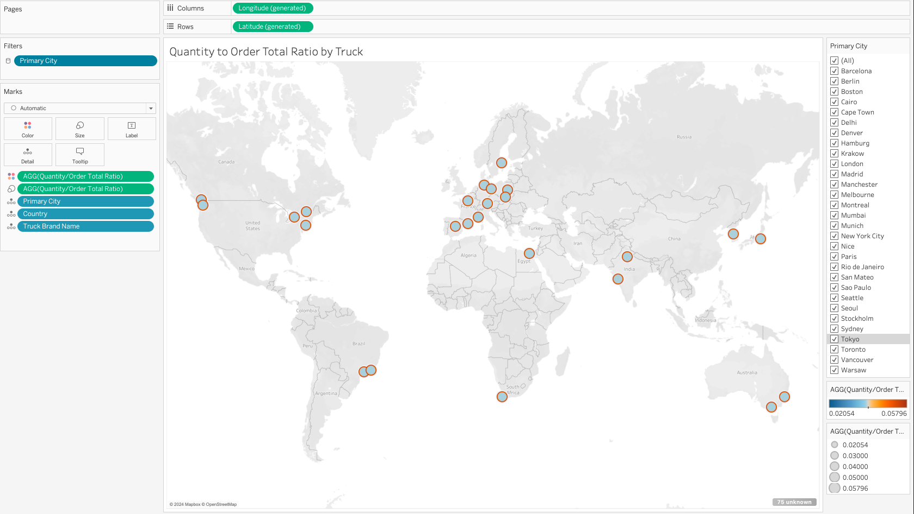

author: Chandra Nayak & Madeline Lee
id: visual_analytics_powered_by_snowflake_and_tableau
summary: Visual Analytics Powered by Snowflake and Tableau
categories: Getting-Started
environments: web
status: Published
feedback link: https://github.com/Snowflake-Labs/sfguides/issues
tags: Data Engineering, Data Collaboration, Geospatial Data

# Visual Analytics powered by Snowflake and Tableau

Duration: 60

<!-- ------------------------ -->

## Overview

Join Snowflake and Tableau for an instructor-led hands-on lab to build governed, visual, and interactive analytics quickly and easily on Food Truck data.


### What You’ll Learn

* Loading structured and semi-structured data to Snowflake tables
* Incorporate Weather data from Snowflake Marketplace
* Use Iceberg tables to access externally stored datalakes
* Easily Extract Sentiment from unstructured data using Snowflake Cortex
* Build visual, intuitive, and interactive Tableau data visualizations powered by live data in Snowflake.

### What You’ll Build

* Snowflake objects  
* Integrate external dataLakes
* A simple Tableau dashboard to present data

### Prerequisites

* Familiarity with Snowflake, AWS and Tableau
* [Snowflake](https://trial.snowflake.com/) account or free trial *** choose AWS and Enterprise ***
* [AWS](https://aws.amazon.com) account or free trial *** choose same region as Snowflake Account ***
* [Tabelau Online](https://www.tableau.com/products/online/request-trial) account or free trial
* [Visual Studio Code](https://code.visualstudio.com/download) editor
<!--- ------------------------- -->

## Snowflake Configuration
Duration: 2

1. Create a Snowflake enterprise trial account
2. Login to your Snowflake account


### Login User Interface

 

<!-- ------------------------ -->

## Managing Semi-Structured Data

Duration: 5

### Download Demo SQL Script
 


### Create Snowflake Objects

```sql
-- Create Database, Schema, Warehouse and Roles

USE ROLE ACCOUNTADMIN;

-- Keep a note of this as we need this for DataLake Integration 
SELECT current_region(); 

-- create frostbyte_tasty_bytes database
CREATE OR REPLACE DATABASE frostbyte_tasty_bytes;

-- create raw_pos schema
CREATE OR REPLACE SCHEMA frostbyte_tasty_bytes.raw_pos;

-- create raw_customer schema
CREATE OR REPLACE SCHEMA frostbyte_tasty_bytes.raw_customer;

-- create harmonized schema
CREATE OR REPLACE SCHEMA frostbyte_tasty_bytes.harmonized;

-- create analytics schema
CREATE OR REPLACE SCHEMA frostbyte_tasty_bytes.analytics;

-- create warehouses
CREATE OR REPLACE WAREHOUSE demo_build_wh
    WAREHOUSE_SIZE = 'medium'
    WAREHOUSE_TYPE = 'standard'
    AUTO_SUSPEND = 30
    AUTO_RESUME = TRUE
    INITIALLY_SUSPENDED = TRUE
COMMENT = 'demo build warehouse for frostbyte assets';
    
CREATE OR REPLACE WAREHOUSE tasty_de_wh
    WAREHOUSE_SIZE = 'xsmall'
    WAREHOUSE_TYPE = 'standard'
    AUTO_SUSPEND = 60
    AUTO_RESUME = TRUE
    INITIALLY_SUSPENDED = TRUE
COMMENT = 'data engineering warehouse for tasty bytes';

CREATE OR REPLACE WAREHOUSE tasty_bi_wh
    WAREHOUSE_SIZE = 'small'
    WAREHOUSE_TYPE = 'standard'
    AUTO_SUSPEND = 60
    AUTO_RESUME = TRUE
    INITIALLY_SUSPENDED = TRUE
COMMENT = 'business intelligence warehouse for tasty bytes';
-- create roles
USE ROLE ACCOUNTADMIN;

-- functional roles
CREATE ROLE IF NOT EXISTS tasty_admin
    COMMENT = 'admin for tasty bytes';
    
CREATE ROLE IF NOT EXISTS tasty_data_engineer
    COMMENT = 'data engineer for tasty bytes';

CREATE ROLE IF NOT EXISTS tasty_bi
    COMMENT = 'business intelligence for tasty bytes';

-- role hierarchy
GRANT ROLE tasty_admin TO ROLE ACCOUNTADMIN;
GRANT ROLE tasty_data_engineer TO ROLE tasty_admin;
GRANT ROLE tasty_bi TO ROLE tasty_admin;


```

### Grant Privileges on Snowflake Objects

```sql
-- privilege grants
USE ROLE accountadmin;
GRANT IMPORTED PRIVILEGES ON DATABASE snowflake TO ROLE tasty_data_engineer;
GRANT CREATE WAREHOUSE ON ACCOUNT TO ROLE tasty_admin;

GRANT USAGE ON DATABASE frostbyte_tasty_bytes TO ROLE tasty_admin;
GRANT USAGE ON DATABASE frostbyte_tasty_bytes TO ROLE tasty_data_engineer;
GRANT USAGE ON DATABASE frostbyte_tasty_bytes TO ROLE tasty_bi;

GRANT USAGE ON ALL SCHEMAS IN DATABASE frostbyte_tasty_bytes TO ROLE tasty_admin;
GRANT USAGE ON ALL SCHEMAS IN DATABASE frostbyte_tasty_bytes TO ROLE tasty_data_engineer;
GRANT USAGE ON ALL SCHEMAS IN DATABASE frostbyte_tasty_bytes TO ROLE tasty_bi;

GRANT ALL ON SCHEMA frostbyte_tasty_bytes.raw_pos TO ROLE tasty_admin;
GRANT ALL ON SCHEMA frostbyte_tasty_bytes.raw_pos TO ROLE tasty_data_engineer;
GRANT ALL ON SCHEMA frostbyte_tasty_bytes.raw_pos TO ROLE tasty_bi;

GRANT ALL ON SCHEMA frostbyte_tasty_bytes.harmonized TO ROLE tasty_admin;
GRANT ALL ON SCHEMA frostbyte_tasty_bytes.harmonized TO ROLE tasty_data_engineer;
GRANT ALL ON SCHEMA frostbyte_tasty_bytes.harmonized TO ROLE tasty_bi;

GRANT ALL ON SCHEMA frostbyte_tasty_bytes.analytics TO ROLE tasty_admin;
GRANT ALL ON SCHEMA frostbyte_tasty_bytes.analytics TO ROLE tasty_data_engineer;
GRANT ALL ON SCHEMA frostbyte_tasty_bytes.analytics TO ROLE tasty_bi;

-- warehouse grants
GRANT ALL ON WAREHOUSE demo_build_wh TO ROLE ACCOUNTADMIN;
GRANT OWNERSHIP ON WAREHOUSE tasty_de_wh TO ROLE tasty_admin REVOKE CURRENT GRANTS;
GRANT ALL ON WAREHOUSE tasty_de_wh TO ROLE tasty_admin;
GRANT ALL ON WAREHOUSE tasty_bi_wh TO ROLE tasty_admin;
GRANT ALL ON WAREHOUSE tasty_bi_wh TO ROLE tasty_bi;

-- future grants
GRANT ALL ON FUTURE TABLES IN SCHEMA frostbyte_tasty_bytes.raw_pos TO ROLE tasty_admin;
GRANT ALL ON FUTURE TABLES IN SCHEMA frostbyte_tasty_bytes.raw_pos TO ROLE tasty_data_engineer;
GRANT ALL ON FUTURE TABLES IN SCHEMA frostbyte_tasty_bytes.raw_pos TO ROLE tasty_bi;

GRANT ALL ON FUTURE TABLES IN SCHEMA frostbyte_tasty_bytes.raw_customer TO ROLE tasty_admin;
GRANT ALL ON FUTURE TABLES IN SCHEMA frostbyte_tasty_bytes.raw_customer TO ROLE tasty_data_engineer;
GRANT ALL ON FUTURE TABLES IN SCHEMA frostbyte_tasty_bytes.raw_customer TO ROLE tasty_bi;

GRANT ALL ON FUTURE TABLES IN SCHEMA frostbyte_tasty_bytes.harmonized TO ROLE tasty_admin;
GRANT ALL ON FUTURE TABLES IN SCHEMA frostbyte_tasty_bytes.harmonized TO ROLE tasty_data_engineer;
GRANT ALL ON FUTURE TABLES IN SCHEMA frostbyte_tasty_bytes.harmonized TO ROLE tasty_bi;
GRANT ALL ON FUTURE VIEWS IN SCHEMA frostbyte_tasty_bytes.harmonized TO ROLE tasty_admin;
GRANT ALL ON FUTURE VIEWS IN SCHEMA frostbyte_tasty_bytes.harmonized TO ROLE tasty_data_engineer;
GRANT ALL ON FUTURE VIEWS IN SCHEMA frostbyte_tasty_bytes.harmonized TO ROLE tasty_bi;

GRANT ALL ON FUTURE TABLES IN SCHEMA frostbyte_tasty_bytes.analytics TO ROLE tasty_admin;
GRANT ALL ON FUTURE TABLES IN SCHEMA frostbyte_tasty_bytes.analytics TO ROLE tasty_data_engineer;
GRANT ALL ON FUTURE TABLES IN SCHEMA frostbyte_tasty_bytes.analytics TO ROLE tasty_bi;
GRANT ALL ON FUTURE VIEWS IN SCHEMA frostbyte_tasty_bytes.analytics TO ROLE tasty_admin;
GRANT ALL ON FUTURE VIEWS IN SCHEMA frostbyte_tasty_bytes.analytics TO ROLE tasty_data_engineer;
GRANT ALL ON FUTURE VIEWS IN SCHEMA frostbyte_tasty_bytes.analytics TO ROLE tasty_bi;
GRANT USAGE ON FUTURE PROCEDURES IN SCHEMA frostbyte_tasty_bytes.analytics TO ROLE tasty_admin;
GRANT USAGE ON FUTURE PROCEDURES IN SCHEMA frostbyte_tasty_bytes.analytics TO ROLE tasty_data_engineer;
GRANT USAGE ON FUTURE PROCEDURES IN SCHEMA frostbyte_tasty_bytes.analytics TO ROLE tasty_bi;

```

### Create Snowflake Stages and Native Tables

```sql
USE ROLE ACCOUNTADMIN;
USE WAREHOUSE demo_build_wh;  -- using a bigger  warehouse for load purpose

--External Stage on S3
CREATE OR REPLACE FILE FORMAT frostbyte_tasty_bytes.public.csv_ff 
type = 'csv';

CREATE OR REPLACE STAGE frostbyte_tasty_bytes.public.s3load
COMMENT = 'Quickstarts S3 Stage Connection'
url = 's3://sfquickstarts/frostbyte_tastybytes/'
file_format = frostbyte_tasty_bytes.public.csv_ff;

list @frostbyte_tasty_bytes.public.s3load;

/*--
 raw zone table build 
--*/

-- country table build
CREATE OR REPLACE TABLE frostbyte_tasty_bytes.raw_pos.country
(
    country_id NUMBER(18,0),
    country VARCHAR(16777216),
    iso_currency VARCHAR(3),
    iso_country VARCHAR(2),
    city_id NUMBER(19,0),
    city VARCHAR(16777216),
    city_population VARCHAR(16777216)
);

-- franchise table build
CREATE OR REPLACE TABLE frostbyte_tasty_bytes.raw_pos.franchise 
(
    franchise_id NUMBER(38,0),
    first_name VARCHAR(16777216),
    last_name VARCHAR(16777216),
    city VARCHAR(16777216),
    country VARCHAR(16777216),
    e_mail VARCHAR(16777216),
    phone_number VARCHAR(16777216) 
);

-- location table build
CREATE OR REPLACE TABLE frostbyte_tasty_bytes.raw_pos.location
(
    location_id NUMBER(19,0),
    placekey VARCHAR(16777216),
    location VARCHAR(16777216),
    city VARCHAR(16777216),
    region VARCHAR(16777216),
    iso_country_code VARCHAR(16777216),
    country VARCHAR(16777216)
);

-- menu table build
CREATE OR REPLACE TABLE frostbyte_tasty_bytes.raw_pos.menu
(
    menu_id NUMBER(19,0),
    menu_type_id NUMBER(38,0),
    menu_type VARCHAR(16777216),
    truck_brand_name VARCHAR(16777216),
    menu_item_id NUMBER(38,0),
    menu_item_name VARCHAR(16777216),
    item_category VARCHAR(16777216),
    item_subcategory VARCHAR(16777216),
    cost_of_goods_usd NUMBER(38,4),
    sale_price_usd NUMBER(38,4),
    menu_item_health_metrics_obj VARIANT
);

CREATE OR REPLACE TABLE frostbyte_tasty_bytes.raw_pos.truck
(
    truck_id NUMBER(38,0),
    menu_type_id NUMBER(38,0),
    primary_city VARCHAR(16777216),
    region VARCHAR(16777216),
    iso_region VARCHAR(16777216),
    country VARCHAR(16777216),
    iso_country_code VARCHAR(16777216),
    franchise_flag NUMBER(38,0),
    year NUMBER(38,0),
    make VARCHAR(16777216),
    model VARCHAR(16777216),
    ev_flag NUMBER(38,0),
    franchise_id NUMBER(38,0),
    truck_opening_date DATE
);

-- order_header table build
CREATE OR REPLACE TABLE frostbyte_tasty_bytes.raw_pos.order_header
(
    order_id NUMBER(38,0),
    truck_id NUMBER(38,0),
    location_id FLOAT,
    customer_id NUMBER(38,0),
    discount_id VARCHAR(16777216),
    shift_id NUMBER(38,0),
    shift_start_time TIME(9),
    shift_end_time TIME(9),
    order_channel VARCHAR(16777216),
    order_ts TIMESTAMP_NTZ(9),
    served_ts VARCHAR(16777216),
    order_currency VARCHAR(3),
    order_amount NUMBER(38,4),
    order_tax_amount VARCHAR(16777216),
    order_discount_amount VARCHAR(16777216),
    order_total NUMBER(38,4)
);

-- order_detail table build
CREATE OR REPLACE TABLE frostbyte_tasty_bytes.raw_pos.order_detail 
(
    order_detail_id NUMBER(38,0),
    order_id NUMBER(38,0),
    menu_item_id NUMBER(38,0),
    discount_id VARCHAR(16777216),
    line_number NUMBER(38,0),
    quantity NUMBER(5,0),
    unit_price NUMBER(38,4),
    price NUMBER(38,4),
    order_item_discount_amount VARCHAR(16777216)
);

-- customer loyalty table build
CREATE OR REPLACE TABLE frostbyte_tasty_bytes.raw_customer.customer_loyalty
(
    customer_id NUMBER(38,0),
    first_name VARCHAR(16777216),
    last_name VARCHAR(16777216),
    city VARCHAR(16777216),
    country VARCHAR(16777216),
    postal_code VARCHAR(16777216),
    preferred_language VARCHAR(16777216),
    gender VARCHAR(16777216),
    favourite_brand VARCHAR(16777216),
    marital_status VARCHAR(16777216),
    children_count VARCHAR(16777216),
    sign_up_date DATE,
    birthday_date DATE,
    e_mail VARCHAR(16777216),
    phone_number VARCHAR(16777216)
);

/*--
 • harmonized view creation
--*/

-- orders_v view
CREATE OR REPLACE VIEW frostbyte_tasty_bytes.harmonized.orders_v
    AS
SELECT 
    oh.order_id,
    oh.truck_id,
    oh.order_ts,
    od.order_detail_id,
    od.line_number,
    m.truck_brand_name,
    m.menu_type,
    t.primary_city,
    t.region,
    t.country,
    t.franchise_flag,
    t.franchise_id,
    f.first_name AS franchisee_first_name,
    f.last_name AS franchisee_last_name,
    l.location_id,
    cl.customer_id,
    cl.first_name,
    cl.last_name,
    cl.e_mail,
    cl.phone_number,
    cl.children_count,
    cl.gender,
    cl.marital_status,
    od.menu_item_id,
    m.menu_item_name,
    od.quantity,
    od.unit_price,
    od.price,
    oh.order_amount,
    oh.order_tax_amount,
    oh.order_discount_amount,
    oh.order_total
FROM frostbyte_tasty_bytes.raw_pos.order_detail od
JOIN frostbyte_tasty_bytes.raw_pos.order_header oh
    ON od.order_id = oh.order_id
JOIN frostbyte_tasty_bytes.raw_pos.truck t
    ON oh.truck_id = t.truck_id
JOIN frostbyte_tasty_bytes.raw_pos.menu m
    ON od.menu_item_id = m.menu_item_id
JOIN frostbyte_tasty_bytes.raw_pos.franchise f
    ON t.franchise_id = f.franchise_id
JOIN frostbyte_tasty_bytes.raw_pos.location l
    ON oh.location_id = l.location_id
LEFT JOIN frostbyte_tasty_bytes.raw_customer.customer_loyalty cl
    ON oh.customer_id = cl.customer_id;

-- loyalty_metrics_v view
CREATE OR REPLACE VIEW frostbyte_tasty_bytes.harmonized.customer_loyalty_metrics_v
    AS
SELECT 
    cl.customer_id,
    cl.city,
    cl.country,
    cl.first_name,
    cl.last_name,
    cl.phone_number,
    cl.e_mail,
    SUM(oh.order_total) AS total_sales,
    ARRAY_AGG(DISTINCT oh.location_id) AS visited_location_ids_array
FROM frostbyte_tasty_bytes.raw_customer.customer_loyalty cl
JOIN frostbyte_tasty_bytes.raw_pos.order_header oh
ON cl.customer_id = oh.customer_id
GROUP BY cl.customer_id, cl.city, cl.country, cl.first_name,
cl.last_name, cl.phone_number, cl.e_mail;

/*--
  analytics view creation
--*/

-- orders_v view
CREATE OR REPLACE VIEW frostbyte_tasty_bytes.analytics.orders_v
COMMENT = 'Tasty Bytes Order Detail View'
    AS
SELECT DATE(o.order_ts) AS date, * FROM frostbyte_tasty_bytes.harmonized.orders_v o;

-- customer_loyalty_metrics_v view
CREATE OR REPLACE VIEW frostbyte_tasty_bytes.analytics.customer_loyalty_metrics_v
COMMENT = 'Tasty Bytes Customer Loyalty Member Metrics View'
    AS
SELECT * FROM frostbyte_tasty_bytes.harmonized.customer_loyalty_metrics_v;

/*--
 raw zone table load 
--*/ 
 
-- country table load
COPY INTO frostbyte_tasty_bytes.raw_pos.country
FROM @frostbyte_tasty_bytes.public.s3load/raw_pos/country/;

-- franchise table load
COPY INTO frostbyte_tasty_bytes.raw_pos.franchise
FROM @frostbyte_tasty_bytes.public.s3load/raw_pos/franchise/;

-- location table load
COPY INTO frostbyte_tasty_bytes.raw_pos.location
FROM @frostbyte_tasty_bytes.public.s3load/raw_pos/location/;

-- menu table load
COPY INTO frostbyte_tasty_bytes.raw_pos.menu
FROM @frostbyte_tasty_bytes.public.s3load/raw_pos/menu/;

-- truck table load
COPY INTO frostbyte_tasty_bytes.raw_pos.truck
FROM @frostbyte_tasty_bytes.public.s3load/raw_pos/truck/;

-- customer_loyalty table load
COPY INTO frostbyte_tasty_bytes.raw_customer.customer_loyalty
FROM @frostbyte_tasty_bytes.public.s3load/raw_customer/customer_loyalty/;

-- order_header table load
COPY INTO frostbyte_tasty_bytes.raw_pos.order_header
FROM @frostbyte_tasty_bytes.public.s3load/raw_pos/order_header/;

-- order_detail table load
COPY INTO frostbyte_tasty_bytes.raw_pos.order_detail
FROM @frostbyte_tasty_bytes.public.s3load/raw_pos/order_detail/;

-- drop demo_build_wh
DROP WAREHOUSE IF EXISTS demo_build_wh; -- dropping the larger warehouse as data load is complete

-- setup completion note
SELECT 'frostbyte_tasty_bytes setup is now complete' AS note;
```


## Data Collaboration 

### Let's Bring Weather Data
[To skip individual command download tb_collaboration_vhol.sql & create Worksheet to run SQL file](assets/tb_collaboration_vhol.sql)

```sql
/*----------------------------------------------------------------------------------
 Investigating Zero Sales Days in our First Party Data

  Our Tasty Bytes Financial Analysts have brought it to our attention when running 
  year over year analysis that there are unexplainable days in various cities where
  our truck sales went to 0. 
  
  One example they have provided was for Hamburg, Germany in February of 2022.
----------------------------------------------------------------------------------*/

--  Step 1 - Querying Point of Sales Data for Trends
USE ROLE tasty_data_engineer;
USE WAREHOUSE tasty_de_wh;

SELECT 
    o.date,
    SUM(o.price) AS daily_sales
FROM frostbyte_tasty_bytes.analytics.orders_v o
WHERE 1=1
    AND o.country = 'Germany'
    AND o.primary_city = 'Hamburg'
    AND DATE(o.order_ts) BETWEEN '2022-02-10' AND '2022-02-20'
GROUP BY o.date
ORDER BY o.date ASC;
```


### Add Weather Data from Snowflake Marketplace
Duration: 5

1. Click -> Home Icon
2. Click -> Marketplace
3. Search -> frostbyte
![Search Dataset][Weather Data] 
4. Click -> Weather Source LLC: frostbyte
5. Click -> Get
![Add Database][assets/Frostbyte_DB.png] 
6. Rename Database -> FROSTBYTE_WEATHERSOURCE (all capital letters)
7. Grant to Additional Roles -> PUBLIC


```sql 
--  Step 2 - Harmonizing First and Third Party Data
CREATE OR REPLACE VIEW frostbyte_tasty_bytes.harmonized.daily_weather_v
    AS
SELECT 
    hd.*,
    TO_VARCHAR(hd.date_valid_std, 'YYYY-MM') AS yyyy_mm,
    pc.city_name AS city,
    c.country AS country_desc
FROM frostbyte_weathersource.onpoint_id.history_day hd
JOIN frostbyte_weathersource.onpoint_id.postal_codes pc
    ON pc.postal_code = hd.postal_code
    AND pc.country = hd.country
JOIN frostbyte_tasty_bytes.raw_pos.country c
    ON c.iso_country = hd.country
    AND c.city = hd.city_name;


--  Step 3 - Visualizing Daily Temperatures
SELECT 
    dw.country_desc,
    dw.city_name,
    dw.date_valid_std,
    AVG(dw.avg_temperature_air_2m_f) AS avg_temperature_air_2m_f
FROM frostbyte_tasty_bytes.harmonized.daily_weather_v dw
WHERE 1=1
    AND dw.country_desc = 'Germany'
    AND dw.city_name = 'Hamburg'
    AND YEAR(date_valid_std) = '2022'
    AND MONTH(date_valid_std) = '2'
GROUP BY dw.country_desc, dw.city_name, dw.date_valid_std
ORDER BY dw.date_valid_std DESC;


--  Step 4 - Bringing in Wind and Rain Metrics
SELECT 
    dw.country_desc,
    dw.city_name,
    dw.date_valid_std,
    MAX(dw.max_wind_speed_100m_mph) AS max_wind_speed_100m_mph
FROM frostbyte_tasty_bytes.harmonized.daily_weather_v dw
WHERE 1=1
    AND dw.country_desc IN ('Germany')
    AND dw.city_name = 'Hamburg'
    AND YEAR(date_valid_std) = '2022'
    AND MONTH(date_valid_std) = '2'
    AND date_valid_std between '2022-02-14' and  '2022-02-25'
GROUP BY dw.country_desc, dw.city_name, dw.date_valid_std
ORDER BY dw.date_valid_std ASC;

``` 
### Democratizing Data Insights 
```sql
/*----------------------------------------------------------------------------------
  We have now determined that Hurricane level winds were probably at play for the
  days with zero sales that our financial analysts brought to our attention.

  Let's now make these sort of research available to anyone in our organization
  by deploying an Analytics view that all Tasty Bytes employees can access.
----------------------------------------------------------------------------------*/

--  Step 1 - Creating SQL Functions
    --> create the SQL function that translates Fahrenheit to Celsius
CREATE OR REPLACE FUNCTION frostbyte_tasty_bytes.analytics.fahrenheit_to_celsius(temp_f NUMBER(35,4))
RETURNS NUMBER(35,4)
AS
$$
    (temp_f - 32) * (5/9)
$$;

    --> create the SQL function that translates Inches to Millimeter
CREATE OR REPLACE FUNCTION frostbyte_tasty_bytes.analytics.inch_to_millimeter(inch NUMBER(35,4))
RETURNS NUMBER(35,4)
    AS
$$
    inch * 25.4
$$;

--  Step 2 - Creating the SQL for our View
SELECT 
    fd.date_valid_std AS date,
    fd.city_name,
    fd.country_desc,
    ZEROIFNULL(SUM(odv.price)) AS daily_sales,
    ROUND(AVG(fd.avg_temperature_air_2m_f),2) AS avg_temperature_fahrenheit,
    ROUND(AVG(frostbyte_tasty_bytes.analytics.fahrenheit_to_celsius(fd.avg_temperature_air_2m_f)),2) AS avg_temperature_celsius,
    ROUND(AVG(fd.tot_precipitation_in),2) AS avg_precipitation_inches,
    ROUND(AVG(frostbyte_tasty_bytes.analytics.inch_to_millimeter(fd.tot_precipitation_in)),2) AS avg_precipitation_millimeters,
    MAX(fd.max_wind_speed_100m_mph) AS max_wind_speed_100m_mph
FROM frostbyte_tasty_bytes.harmonized.daily_weather_v fd
LEFT JOIN frostbyte_tasty_bytes.harmonized.orders_v odv
    ON fd.date_valid_std = DATE(odv.order_ts)
    AND fd.city_name = odv.primary_city
    AND fd.country_desc = odv.country
WHERE 1=1
    AND fd.country_desc = 'Germany'
    AND fd.city = 'Hamburg'
    AND fd.yyyy_mm = '2022-02'
    AND date_valid_std between '2022-02-14' and  '2022-02-25'
GROUP BY fd.date_valid_std, fd.city_name, fd.country_desc
ORDER BY fd.date_valid_std ASC;

--  Step 3 - Deploying our Analytics View
CREATE OR REPLACE VIEW frostbyte_tasty_bytes.analytics.daily_city_metrics_v
COMMENT = 'Daily Weather Source Metrics and Orders Data for our Cities'
    AS
SELECT 
    fd.date_valid_std AS date,
    fd.city_name,
    fd.country_desc,
    ZEROIFNULL(SUM(odv.price)) AS daily_sales,
    ROUND(AVG(fd.avg_temperature_air_2m_f),2) AS avg_temperature_fahrenheit,
    ROUND(AVG(frostbyte_tasty_bytes.analytics.fahrenheit_to_celsius(fd.avg_temperature_air_2m_f)),2) AS avg_temperature_celsius,
    ROUND(AVG(fd.tot_precipitation_in),2) AS avg_precipitation_inches,
    ROUND(AVG(frostbyte_tasty_bytes.analytics.inch_to_millimeter(fd.tot_precipitation_in)),2) AS avg_precipitation_millimeters,
    MAX(fd.max_wind_speed_100m_mph) AS max_wind_speed_100m_mph
FROM frostbyte_tasty_bytes.harmonized.daily_weather_v fd
LEFT JOIN frostbyte_tasty_bytes.harmonized.orders_v odv
    ON fd.date_valid_std = DATE(odv.order_ts)
    AND fd.city_name = odv.primary_city
    AND fd.country_desc = odv.country
GROUP BY fd.date_valid_std, fd.city_name, fd.country_desc;

```


```sql 

/*----------------------------------------------------------------------------------
 Driving Insights from Sales and Marketplace Weather Data
 
 With Sales and Weather Data available for all Cities our Food Trucks operate in,
 let's now take a look at the value we have now provided to our Financial Analysts.
----------------------------------------------------------------------------------*/

--  Section 6: Step 1 - Simplifying our Analysis
-- Wind Speed seems had a major Impact 
SELECT 
    dcm.date,
    dcm.city_name,
    dcm.country_desc,
    dcm.daily_sales,
    dcm.avg_temperature_fahrenheit,
    dcm.avg_temperature_celsius,
    dcm.avg_precipitation_inches,
    dcm.avg_precipitation_millimeters,
    dcm.max_wind_speed_100m_mph
FROM frostbyte_tasty_bytes.analytics.daily_city_metrics_v dcm
WHERE 1=1
    AND dcm.country_desc = 'Germany'
    AND dcm.city_name = 'Hamburg'
    AND dcm.date BETWEEN '2022-02-14' AND '2022-02-25'
ORDER BY date ASC;
```
<!-- ------------------------ -->

## DataLake Integration 

### Create the necessary AWS Configuration 
Duration: 15 

#### Download the Customer Reviews files to your laptop

unzip the file before you load into AWS bucket

**Login to AWS Account, and create a bucket in the same region as your Snowflake account**


#### Upload the folder from your laptop to the S3 bucket.


#### Take a note of your AWS Account ID.


**Now, in your Snowflake account**

```sql

USE DATABASE frostbyte_tasty_bytes;
USE SCHEMA raw_customer;

CREATE or REPLACE STORAGE INTEGRATION <name the storage integration>
  TYPE = EXTERNAL_STAGE
  STORAGE_PROVIDER = 'S3'
  STORAGE_AWS_ROLE_ARN = 'arn:aws:iam::<your AWS account ID>:role/<give a name for IAM role>' -- ex: snow_s3_access_role
  ENABLED = TRUE
  STORAGE_ALLOWED_LOCATIONS = ('s3://<name of your S3 bucket>/');

DESC INTEGRATION <name of the integration>; -- you will need the output of these values in AWS CloudFormation

CREATE OR REPLACE FILE FORMAT ff_csv
    TYPE = 'csv'
    SKIP_HEADER = 1   
    FIELD_DELIMITER = '|';

CREATE OR REPLACE STAGE stg_truck_reviews
    STORAGE_INTEGRATION = s3_int
    URL = 's3://jnanreviews'
    FILE_FORMAT = ff_csv;
```


**Go to AWS account and open this** [CloudFormationTemplate](https://github.com/Snowflake-Labs/aws-integrations-cloudops/blob/master/cft/aws-snowflakeintobj-servicecatalog.yml)

### Launch the AWS CloudFormation and enter the inputs as shown and submit 


### Create Snowflake managed Iceberg Tables to access Datalake 
``` sql
USE ROLE ACCOUNTADMIN;
USE DATABASE  frostbyte_tasty_bytes;
USE SCHEMA raw_customer;
CREATE OR REPLACE EXTERNAL VOLUME vol_tastybytes_truckreviews
    STORAGE_LOCATIONS =
        (
            (
                NAME = 'reviews-s3-volume'
                STORAGE_PROVIDER = 'S3'
                STORAGE_BASE_URL = 's3://jnanreviews'
                STORAGE_AWS_ROLE_ARN = 'arn:aws:iam::<aws-account-id>:role/<snow_role>' --ex:snow_s3_access_role 
                STORAGE_AWS_EXTERNAL_ID = 'RJB12004_SFCRole=4_zSAasUofMUwWxe/Hk98JqRTv2T4=' 
            )
            
        )ALLOW_WRITES=true; 

CREATE OR REPLACE ICEBERG TABLE icberg_truck_reviews
        (
        source_name VARCHAR,
        quarter VARCHAR,
        order_id BIGINT,
        truck_id INT,
        language VARCHAR, 
        review VARCHAR,
        primary_city VARCHAR,
        truck_brand VARCHAR
        )
        CATALOG = 'SNOWFLAKE'
        EXTERNAL_VOLUME = 'vol_tastybytes_truckreviews'
        BASE_LOCATION = 'reviews-s3-volume'; 

-- Insert Iceberg Metadata from External Files 
INSERT INTO icberg_truck_reviews
(
source_name, quarter, order_id, truck_id, language, review, primary_city, truck_brand
)
SELECT 
       SPLIT_PART(METADATA$FILENAME, '/', 4) as source_name,
       CONCAT(SPLIT_PART(METADATA$FILENAME, '/', 2),'/' ,SPLIT_PART(METADATA$FILENAME, '/', 3)) as quarter,
       $1 as order_id,
       $2 as truck_id,
       $3 as language,
       $5 as review,
       $6 as primary_city, 
       $10 as truck_brand 
FROM @stg_truck_reviews 
(FILE_FORMAT => 'FF_CSV',
PATTERN => '.*reviews.*[.]csv');


-- Create a view on the Iceberg Reviews, and run Cortex AI to extract Sentiment
USE SCHEMA analytics;

CREATE OR REPLACE VIEW  product_sentiment AS 
SELECT primary_city, truck_brand, avg(snowflake.cortex.sentiment(review)) as review_sentiment 
FROM frostbyte_tasty_bytes.raw_customer.icberg_truck_reviews 
group by primary_city, truck_brand ;

select * from frostbyte_tasty_bytes.analytics.product_sentiment limit 10;

```

## Login to Tableau Online & Connect to Snowflake

Duration: 30

Navigate to https://online.tableau.com/ and login to Tableau Cloud (Online) using your login credentials.

 

<br>

You will be redirected to the Tableau Cloud (Online) Home page. Within the blue “Welcome to your Tableau site” banner, click into the “New” dropdown and select “Workbook”.

 

<br>

You will be automatically prompted to connect to a data source. Within the “Connect to Data” popup window, select “Connectors”. Find *Snowflake* in the grid.
Note: you may need to use the horizontal bottom scrollbar at the bottom of the window and scroll to the right of the “Connections" tab.

 

<br>

Enter the Server name. Note that you will need to remove the 'https://' from the name (see screenshot). You can find the server name [insert instructions here] Change the authentication method to username/password, enter your credentials & then click the blue “Sign in” button.

 

<br>

Within the connections pane, make the following selections:

* Warehouse: your warehouse
* Database: FROSTBYTE_TASTY_BYTES
* Schema: ANALYTICS


A list of tables will appear:

 


<br>

Click and drag the 'ORDERS_V' table where it says “Drag tables here”.

<br>

Next, click and drag the 'DAILY_CITY_WEATHER_V' to the Canvas. This will create a relationship. In Tableau, a relationship is a flexible way to do multi-table analysis without creating one large flat table. Make sure that the fields are mapped correctly by matching 'Date' and 'Date' and matching 'City Name' and 'City'.



<!-- ------------------------ -->

<!-- ------------------------ -->

<br>

## Configure Data Source Filters

By adding data source filters, we can exclude any outliers that may hinder performance or skew our data. 

In the top right corner of the screen, locate where it says “Filters”. Under “Filters”, there is a button that says “Add”. Click the “Add” button.

 

<br>

On the bottom left of the pop-up “Edit Data Source Filters” window, click “Add Filter”.

 

<br>

Within the pop-up, start typing “Date”. Click the “Date” field.

<br>

When the options for different types of date filters appear, click “Range of Dates”, then click Next> and enter the range 1/1/2022 to 11/1/2022. After that, click the blue “OK” button in the bottom right of the pop-up. Then click 'OK' once you see the list of all data source filters.

 

<br>


<br>

<!-- ------------------------ -->

<!-- ------------------------ -->

<br>

## Visualize Data

Now we are ready to visualize our data! In the bottom left of the screen, click “Sheet 1”.

 

<br>

We'll start by getting a quick sense of how each city is doing in terms of sales. Drag out Longitude to columns and Latitude to rows to Double click 'Primary City' and 'Country' fields from the 'Orders_v' table. Then click and drag 'Truck Brand Name' to the details tile on the marks card. This will create a map that shows where each of the trucks sell. 

 

<br>


Now, this map shows us where we have data, but it doesn't tell us anything about the performance of each of those trucks in cities. Drag Order Total to the size tile on the marks card. You'll see the size of the mark correlate to the sum of order totals for that city. Let's drag Quantity to color, so that we can get a sense of the relationship between the number of items sold and the amount of revenue generated. 

 
 
 

<br>

We also want to filter to just one city at a time, because its hard to see the different truck locations when the map is zoomed out. Right-click PrimaryCity on the details tile and select 'Show Filter'. then, when the filter pops up on the right hand side, click the carrot on the right and select 'Single-Value (list)'. This will change the filter settings to only allow you to select one city at a time.


<br>

We can see from clicking through different cities and the size of the circles and the color legend that there seems to be a fairly linear relationship between quantity and order total. We would expect that. Let's create a calculated field that gives us the ratio of products sold vs total revenue. If it's higher, that means that the city is selling more menu items that are less expensive, whereas lower ratio means that the food trucks are selling more expensive items. 

We'll create a calculated field by navigating to the data pane and right clicking on the carrot near the search bar. 

 

<br>

Name your calculated field 'Quantity/Order Total Ratio' and enter in the text below:

```
SUM([Quantity])/SUM([Order Total])
```
Then, click OK. 

 

<br>

We'll replace the Quantity and Order total fields on the Color and Size marks card with this field. 

 

<br>

Finally, change the color legend so it is more easily distinguishable. Right click the color legend and select 'Edit Colors'. Then, select the Orange-Blue diverging scale. Reverse the colors and close out of the dialog box.


 

<br>

The reason we reversed the colors is that we want to keep a closer eye on trucks with higher ratios. A higher quantity to order total ratio indicates that folks are buying more, cheaper items, as compared to higher-cost items. Of course, this data set does not include profit information, but it can be something we explore for a potential marketing campaign or GTM study on more expensive items vs more profitable items. 




Rename the sheet 'Quantity to Order Total Ratio by Truck' by right-clicking on the Sheet1 label on the bottom bar and selecting 'Rename'.

 

<br>

Let's open another sheet to do some more analysis. Click the + button on the bottom bar to open a new sheet. Start by visualizing the Sales Data for each city over time. Find the 'Order Total' Field on the left hand pane under the 'Orders_V' table dropdown, and double click the field. This will automatically add the field to the canvas, and visualize it in the most optimal way. In this case, it will sum up the Order Totals and present it in a bar chart. If we translated this to SQL, it would be 'select sum(Order_Totals) from Orders_V'.

 

<br>

Now, lets start to bucket or group the order totals by another metric. We'll use date in this case. From the left pane, drag the 'Date' field from the 'Orders_V' table to the Columns shelf. You'll see that Tableau automatically aggregates dates up to the year level first. Let's change that to a more granular aggregation, since we are only working with 2 years of data.

 


By clicking the blue pill that says 'Year(Date)', we can see multiple options for aggregating the date. The first set of year/month/day will aggregate in a discrete manner. For example, if we selected 'Month', Tableau would aggregate the Order Totals for all the months of 2021, Jan 2022, Jan 2023, etc. The second set of 'year/month/day' will create a continuous time series of order totals. Let's select 'Week Number' from the 2nd set. You'll see a line chart appear with data on Order Totals from 2022-2023.

 
 <br>
 
<br>

Now, let's split out the line chart further and break it down by City. We can add a third field to the visualization by adding 'Primary City' to Color on the marks card. This will break out the data by each city and assign it a different color. You'll see the legend on the right hand side pop up. Let's also rename this sheet by clicking on the 'Sheet 2' label on the bottom bar and renaming it 'City Sales by Week'.

 

<br>

Looking at this line graph, here's more than one city with a massive drop in sales in March. These are Berlin, New York City, and Hamburg (Hamburg which we already visualized in snowflake). Let's add a filter so that I can narrow it down to those three cities. Drag the 'City' field to the filters card. When the filter card pops up, select just a few cities, including Berlin, NYC and Hamburg. Paris had a few fluctuations in sales as well, so we can select the field as well.


<br>

Great. Let's see if they also had high wind speed during those days and months with lower sales. Duplicate the sheet by right-clicking the bar along the bottom and selecting 'Duplicate'. Then, make sure that max wind speed is averaged by right clicking the field and selecitng 'Data properties' -> 'Aggregation' -> Avg. Then, drag out the 'Max Wind Speed' field to Rows. This may take a few minutes to render.

 

 


<br>

We can see that the avg wind speed does seem to have somewhat of a negative correlation with order totals. In order to further investigate the pattern, we can actually very quickly check the trends of the lines by reversing the axis. Right-click the y-axis for the wind speed, go to 'Edit Axis' and checked the 'reversed' box. You may expect the wind speed line to look similar to the Order Totals line.

  

<br>

It doesn't seem to look very similar, and there's also some null values - NYC has no wind speed data. We can make a note to ask my data engineers about that later. Remove the Wind Speed field and the city filter from the visualization. Change the field from 'Primary City' to 'Truck Brand Name' to get a sense of how the trucks are performing over time. Rename the sheet 'Truck Performance over Time'.


<br>

Now, let's look some of the most popular products. We'll measure by the quantity ordered. Open a new sheet, then drag 'Quantity' out onto the columns shelf. 
 

 <br>

 Drag 'Menu Item Name' onto the rows shelf and sort the sheet by descending quantity. You can just click the sort icon next to Quantity label at the bottom.

 

 <br>
 
Then,  exclude the top three items, Ice Tea, Bottled Soda and Bottled Water, since they are constants at every food truck. Do that by using command-click on both of the items, then selecting 'Exclude'.


  
<br>

Let's also change the way the data is visualized. A bar chart is great, but ultimately, since the numbers are so high, the differences in bar lengths are a difficult to gague. we also need to add a label so that we can see the nuances between some of the top selling products. Drag another copy of sum(Quantity) to the label square on the marks card to add more detail.


<br>

Next up we'll filter to just the top 10 products. The Menu Item Name pill is already on the filter card, so right click and select 'Edit Filter' to open it up. Navigate to the 'Top' tab and select 'By Field', then make sure that the filter grabs the top 10 by quantity. Click OK. Rename the sheet 'Top Selling Menu Items'.

  
  
  
  
 
 

Finally, Let's look at truck performance across all cities. To do that, we'll measure performance by total sales, or 'Order Total' field. Drag out the 'Order Total' field onto the columns shelf. 

 
<br>

Then, click and drag 'Truck Brand Name' to the rows shelf. Add a label to the bar charts, same as we did for the Top Selling Product sheet. Drag Order Totals to the labels tile on the marks card. Sort the sheet.


<br>

Filter the truck performance to the top 5 trucks. Do the same thing as for products, but just grab the top 5 by Order Total for truck names.

 

Rename the sheet 'Food Truck Performance by Total Revenue'.

 
 


<!-- ------------------------ -->

<!-- ------------------------ -->

<br>

## Create a Dashboard

We have all of this information, but lets put it all together to see if we can gain insights from looking at all of the separate information in one place. Click on the waffle icon in the bottom bar to create a new dashboard.

Just like fields dragged onto the canvas, you can drag sheets onto the dashboard to compose them. Let's drag our Time series with just order totals out, our map of Quantity/Order Total Ratio by city, then drag out 'Top Selling Products' and 'Food Truck Performance by Total Revenue' sheets. Finally, in order to make sure the filters carry over, apply the City filter with the single list to all sheets using this data source. To do that, simply click the carrot icon on the selected City filter, then click 'Apply to Worksheets' -> 'All using this datasource'. 

 

Interesting. The most frequently sold items are not part of the top food truck's menu. Next, we might want to speak to the data engineers on the Snowflake team to add profit to the data source for future analysis on most profitable items vs most profitable trucks. Rename the dashboard 'Tasty Bytes Sales Analysis'. Click the checkbox in the bottom left corner that says 'Show dashboard title'.

 

<br>

Let's publish this dashboard to share this insight and feedback with others. Click 'Publish As' in the top right hand corner. Give your Dashboard a name and you can store it in your personal space for now. Once you click save, the published dashboard should reload. 

 

 


<br>

<!-- ------------------------ -->

<!-- ------------------------ -->

<br>

<!-- ------------------------ -->


## Conclusion and Resources

Congratulations! you have completed the lab.

In this lab we captured semi-structured data coming from TastyBytes food truck data, enriched that weather data from Snowflake Marketplace data to find correlation between food sales and weather. We visualized the data using Tableau to quickly arrive at new insights.

[To skip individual commands download tb_reset_vhol.sql & create Worksheet to run SQL file](https://github.com/mcnayak/sfquickstarts/blob/master/site/sfguides/src/visual_analytics_powered_by_snowflake_and_tableau/assets/tb_reset_vhol.sql).

```sql
/**********************************************************************/
/*------               Quickstart Reset Scripts                 ------*/
/*------   These can be ran to reset your account to a state    ------*/
/*----- that will allow you to run through this Quickstart again -----*/
/**********************************************************************/

/**********************************************************************/
/*------               Quickstart Reset Scripts                 ------*/
/*------   These can be run to reset your account to a state    ------*/
/*----- that will allow you to run through this Quickstart again -----*/
/**********************************************************************/

USE ROLE accountadmin;

DROP VIEW IF EXISTS frostbyte_tasty_bytes.harmonized.daily_weather_v;
DROP VIEW IF EXISTS frostbyte_tasty_bytes.analytics.daily_city_metrics_v;


DROP FUNCTION IF EXISTS frostbyte_tasty_bytes.analytics.fahrenheit_to_celsius(NUMBER(35,4));
DROP FUNCTION IF EXISTS frostbyte_tasty_bytes.analytics.inch_to_millimeter(NUMBER(35,4));


UNSET center_point;

--USE ROLE sysdmin;
DROP DATABASE IF EXISTS frostbyte_tasty_bytes;   
DROP DATABASE IF EXISTS frostbyte_weathersource;
DROP DATABASE IF EXISTS frostbyte_safegraph;

DROP WAREHOUSE IF EXISTS demo_build_wh; 
DROP WAREHOUSE IF EXISTS tasty_de_wh;
DROP WAREHOUSE IF EXISTS tasty_bi_wh;


``` 

[Semi-structured Data](https://docs.snowflake.com/en/user-guide/semistructured-concepts.html)
<br>
</br>
[Iceberg Tables](https://docs.snowflake.com/en/user-guide/tables-iceberg)
<br>
</br>
[Snowflake Marketplace](https://other-docs.snowflake.com/en/data-marketplace.html)
<br></br>

### Video on the Demo

[Youtube - Video on the Demo](https://www.youtube.com/watch?v=9zMtimcooxo)
<!-- ------------------------ -->

<br>


[Weather Data]: assets/Frostbyte_Weather_Data.png
[def]: assets/Frostbyte_DB.png
[def2]: assets/2022