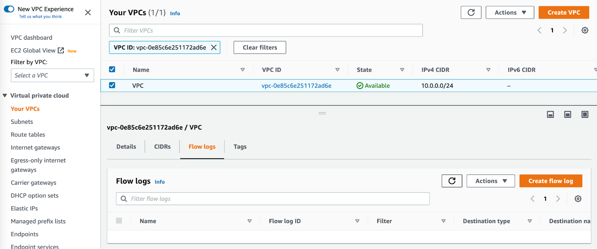
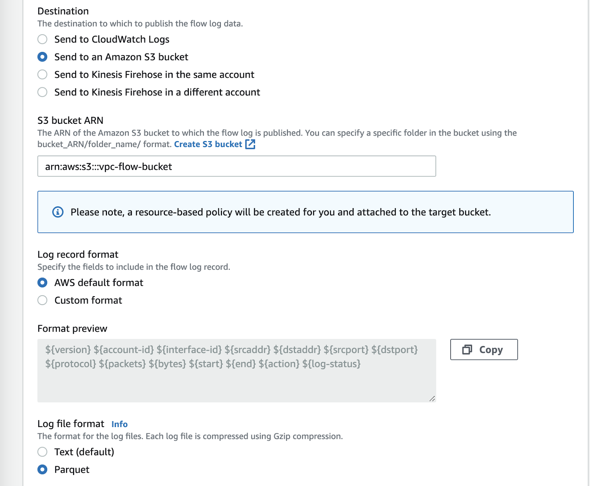
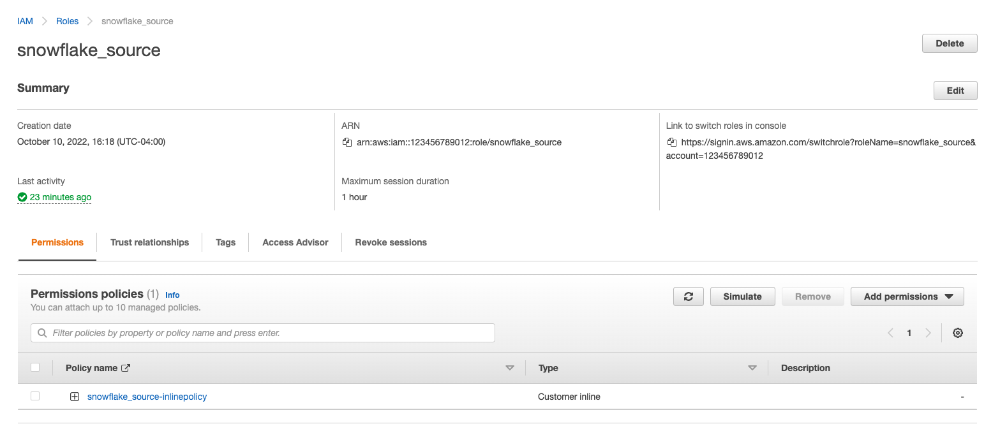
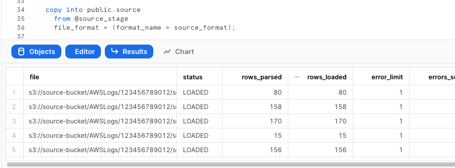
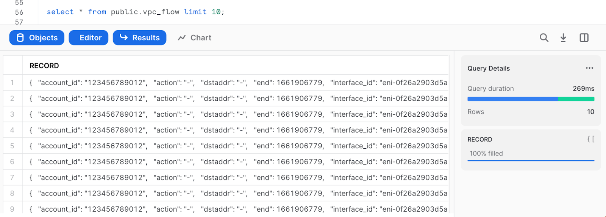
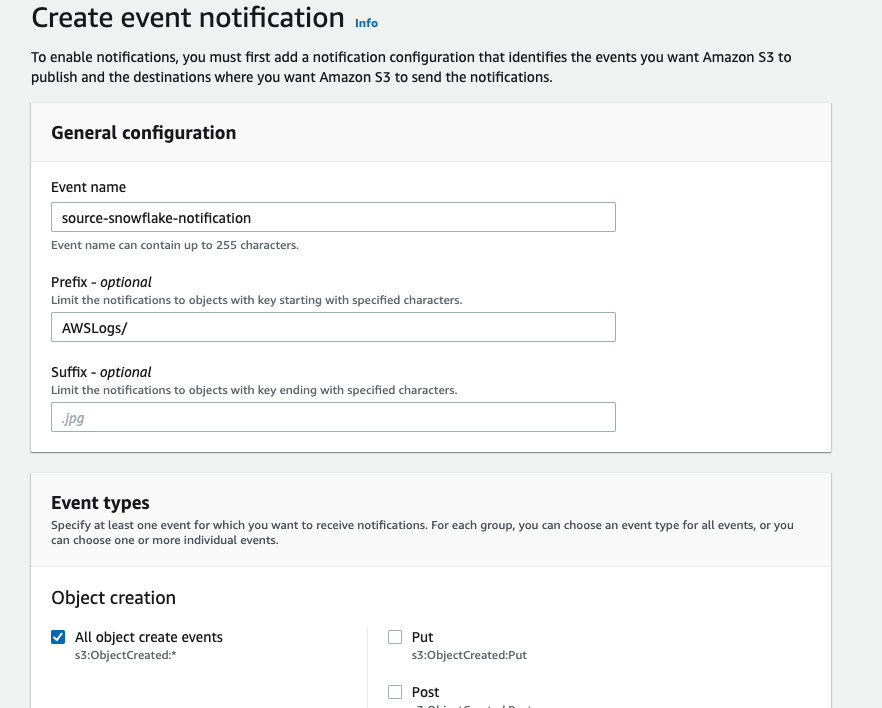
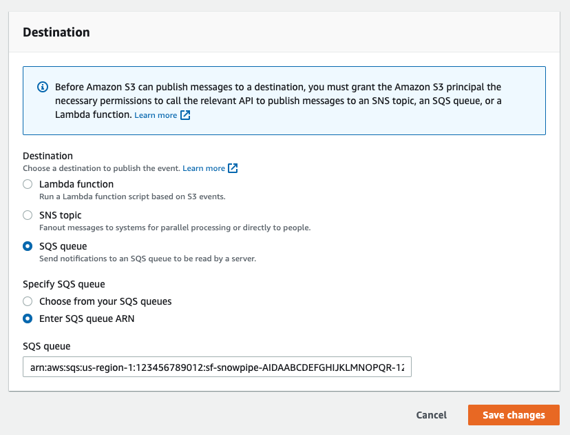
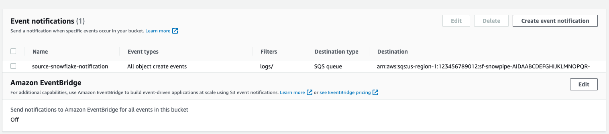
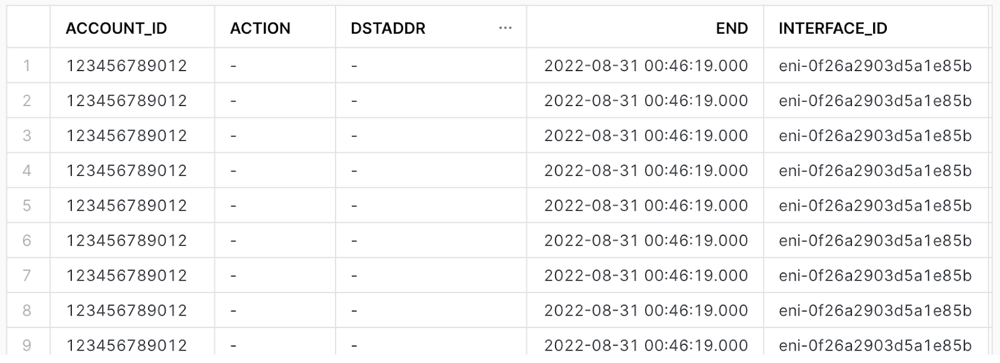

author: Jake Berkowsky
id: vpc_flow_log_ingestion
summary: This tutorial is a guide for ingestion AWS VPC Flowlogs into Snowflake. It demonstrates configuration of VPC flowlogs on AWS, ingestion using an external stage with Snowpipe and sample queries for CSPM and threat detection.
categories: cybersecurity,solution-examples,partner-integrations
environments: web
status: Published 
feedback link: https://github.com/Snowflake-Labs/sfguides/issues
tags: Cybersecurity, SIEM, CSPM, VPC Flow Logs

# AWS VPC Flow Logs Ingestion

## Overview 
Duration: 1

VPC Flow Logs is a feature that enables you to capture information about the IP traffic going to and from network interfaces in your VPC. 
Flow logs can help you with a number of tasks, such as:

- Monitoring the traffic that is reaching your instance
- Determining the direction of the traffic to and from the network interfaces
- Analyzing properties such as IP addresses, ports, protocol and total packets sent without the overhead of taking packet captures

Flow log data is collected outside of the path of your network traffic, and therefore does not affect network throughput or latency. You can create or delete flow logs without any risk of impact to network performance.

This quickstart is a guide for ingestion AWS VPC Flowlogs into Snowflake. It demonstrates configuration of VPC flowlogs on AWS, ingestion using an external stage with Snowpipe and sample queries for CSPM and threat detection.

### Prerequisites
- AWS user with permission to create and manage IAM policies and roles
- Snowflake user with permission to create tables, stages and storage integrations as well as setup snowpipe.
- An S3 Bucket

### Architecture
![A diagram depicting the journey of VPC Flow Logs from an Amazon VPC to a snowflake database. The diagram is split between sections, AWS Cloud and Snowflake Cloud. The diagram begins on the AWS Cloud side at Amazon VPC, an arrow leads to VPC Flow Logs, then to S3 External Stage, then to an SQS Queue with the description “Event Notification”. An arrow leads from the SQS queue to the Snowflake Cloud section of the diagram to an icon named Snowpipe. After Snowpipe the arrow leads back to S3 External stage with a description of “triggers”. Finally the path terminates on the Snowflake Cloud side at an icon named “Snowflake DB” with a description of “copy into”.](assets/vpc-flow-arch.png)

## Enable VPC Flow Logs and Push to S3
Duration: 5

_See [here](https://docs.aws.amazon.com/vpc/latest/userguide/flow-logs-s3.html#flow-logs-s3-create-flow-log) for more detailed instructions or for more granular VPC flow use cases._

From the VPC page in the AWS console, select the VPC you wish to enable flow logs on. Select the “Flow Logs” tab and press “Create flow log”



Configure VPC flow logs as desired. Ensure the following settings:

- **Destination:** Send to an Amazon S3 Bucket
- **S3 Bucket ARN:**  S3 Bucket ARN and prefix of existing bucket ( or press the “create s3 bucket” link to create a new one)
- **Log Record Format:** The later parts of this tutorial assume the default log format, a full list of available fields can be found here: https://docs.aws.amazon.com/vpc/latest/userguide/flow-logs.html#flow-logs-fields
- **Log file format:** Parquet



## Create a storage integration in Snowflake
Duration: 3

*Replace \<RoleName\> with the desired name of the role you’d like snowflake to use ( this role will be created in the next step).  Replace \<BUCKET_NAME\>/path/to/logs/ with the path to your VPC flow logs as set in the previous step*

```sql
create STORAGE INTEGRATION s3_int_vpc_flow
  TYPE = EXTERNAL_STAGE
  STORAGE_PROVIDER = S3
  ENABLED = TRUE
  STORAGE_AWS_ROLE_ARN = 'arn:aws:iam::<AWS_ACCOUNT_NUMBER>:role/<RoleName>'
  STORAGE_ALLOWED_LOCATIONS = ('s3://<BUCKET_NAME>/<PREFIX>/');

DESC INTEGRATION s3_int_vpc_flow;
```
Take note of **STORAGE_AWS_IAM_USER_ARN** and **STORAGE_AWS_EXTERNAL_ID**


## Create role and policy in AWS
Duration: 5

*The following assumes a user with the ability to create and manage IAM logged into the AWS console or using the CLI.  A full explanation can be found in [this documentation](https://docs.snowflake.com/en/user-guide/data-load-s3-config.html)*

Open up Cloudshell in the AWS console by pressing the  icon on the right side of the top navigation bar or run the following commands in your terminal once configured to use the AWS CLI.

Export the following variables, replacing the values with your own

```bash
export BUCKET_NAME='<BUCKET_NAME>'
export PREFIX='<PREFIX>' # no leading or trailing slashes
export ROLE_NAME='<ROLE_NAME>'
export STORAGE_AWS_IAM_USER_ARN='<STORAGE_AWS_IAM_USER_ARN>'
export STORAGE_AWS_EXTERNAL_ID='<STORAGE_AWS_EXTERNAL_ID>'
```
Create a role for Snowflake to assume
```bash
aws iam create-role \
    --role-name "${ROLE_NAME}" \
    --assume-role-policy-document \
'{
    "Version": "2012-10-17",
    "Statement": [
        {
            "Sid": "",
            "Effect": "Allow",
            "Principal": {
                "AWS": "'${STORAGE_AWS_IAM_USER_ARN}'"
            },
            "Action": "sts:AssumeRole",
            "Condition": {
                "StringEquals": {
                    "sts:ExternalId": "'${STORAGE_AWS_EXTERNAL_ID}'"
                }
            }
        }
    ]
}'
```
Create an inline-policy to allow snowflake to add and remove files from S3

```bash
aws iam put-role-policy \
    --role-name "${ROLE_NAME}" \
    --policy-name "${ROLE_NAME}-inlinepolicy" \
    --policy-document \
'{
    "Version": "2012-10-17",
    "Statement": [
        {
            "Effect": "Allow",
            "Action": [
              "s3:PutObject",
              "s3:GetObject",
              "s3:GetObjectVersion",
              "s3:DeleteObject",
              "s3:DeleteObjectVersion"
            ],
            "Resource": "arn:aws:s3:::'${BUCKET_NAME}'/'${PREFIX}'/*"
        },
        {
            "Effect": "Allow",
            "Action": [
                "s3:ListBucket",
                "s3:GetBucketLocation"
            ],
            "Resource": "arn:aws:s3:::'${BUCKET_NAME}'",
            "Condition": {
                "StringLike": {
                    "s3:prefix": [
                        "'${PREFIX}'/*"
                    ]
                }
            }
        }
    ]
}'
```
You will now be able to see your role, policy and trust relationship in the console



## Prepare Snowflake to receive data
Duration: 6

This quickstart requires a warehouse to perform computation and ingestion. We recommend creating a separate warehouse for security related analytics if one does not exist. The following will create a medium sized single cluster warehouse that suspends after 5 minutes of inactivity. For production workloads a larger warehouse will likely be required.

```sql
create warehouse security_quickstart with 
  WAREHOUSE_SIZE = MEDIUM 
  AUTO_SUSPEND = 300;
```

Create External Stage using the storage integration. Make sure you include the trailing slash if using a prefix.
```sql
create stage vpc_flow_stage
  url = 's3://<BUCKET_NAME>/<PREFIX>/'
  storage_integration = s3_int_vpc_flow
;
```

Check if snowflake can list S3 files
```sql
list @vpc_flow_stage;
```


```sql
create table public.vpc_flow(
  record VARIANT
);
```
Test Injection from External Stage
```sql
copy into public.vpc_flow
  from @vpc_flow_stage
  file_format = (type = parquet);
```



Select data
```sql
select * from public.vpc_flow limit 10;
```


## Setup Snowpipe for continuous loading
Duration: 5

The following instructions depend on a Snowflake account running on AWS. Accounts running on other cloud providers may invoke snowpipe from a rest endpoint.
[https://docs.snowflake.com/en/user-guide/data-load-snowpipe-rest.html](https://docs.snowflake.com/en/user-guide/data-load-snowpipe-rest.html)


Configure the Snowflake snowpipe
```sql
create pipe public.vpc_flow_pipe auto_ingest=true as
  copy into public.vpc_flow
  from @public.vpc_flow_stage
  file_format = (type = parquet)
;
```

Show pipe to retrieve SQS queue ARN 
```sql
show pipes;
```


Setup S3 bucket with following [AWS instructions](https://docs.aws.amazon.com/AmazonS3/latest/userguide/enable-event-notifications.html).

Target Bucket -> Open property -> Select “Create Event notification”


Fill out below items
- Name: Name of the event notification (e.g. Auto-ingest Snowflake).
- Prefix(Optional) :  if you receive notifications only when files are added to a specific folder (for example, logs/). 
- Events: Select the ObjectCreate (All) option.
- Send to: Select “SQS Queue” from the dropdown list.
- SQS: Select “Add SQS queue ARN” from the dropdown list.
- SQS queue ARN: Paste the SQS queue name from the SHOW PIPES output.





Event notification has been created


Refresh Snowpipe to retrieve unloaded file and run select if unloaded data should be loaded
```sql
alter pipe vpc_flow_pipe refresh;
select * from public.vpc_flow;
```
You can confirm also if snowpipe worked properly
```sql
select *
  from table(snowflake.information_schema.pipe_usage_history(
    date_range_start=>dateadd('day',-14,current_date()),
    date_range_end=>current_date(),
    pipe_name=>'public.vpc_flow_pipe));
```

## Create a view to better query data
Duration: 3

Create a view
```sql
create view vpc_flow_view as
select 
    record:account_id::varchar(16) as account_id,
    record:action::varchar(16) as action,
    record:bytes::integer as bytes,
    record:dstaddr::varchar(128) as dstaddr,
    record:dstport::integer as dstport,
    record:end::TIMESTAMP as "END",
    record:interface_id::varchar(32) as interface_id,
    record:log_status::varchar(8) as log_status,
    record:packets::integer as packets,
    record:protocol::integer as protocol,
    record:srcaddr::varchar(128) as srcaddr,
    record:srcport::integer as srcport,
    record:start::TIMESTAMP as "START",
    record:version::varchar(8) as version
from public.vpc_flow;

```
Preview the data
```sql
select * from vpc_flow_view limit 10;
```


## Query the data
Duration: 2

Create a workbook to query the new view. If desired, use the following to help get you started:

```sql
CREATE OR REPLACE FUNCTION ipv4_is_internal(ip varchar)
  RETURNS Boolean
  AS
  $$
    (parse_ip(ip,'INET'):ipv4 between (167772160) AND (184549375)) OR 
    (parse_ip(ip,'INET'):ipv4 between (2886729728) AND (2887778303))OR 
    (parse_ip(ip,'INET'):ipv4 between (3232235520) AND (3232301055))
  $$
  ;
  
-- Administrative traffic from public internet in past 30 days

(select distinct srcaddr as internal_addr,dstaddr as external_addr, srcport as port from vpc_flow_view where "START" > dateadd(day, -30, current_date()) and action = 'ACCEPT' and srcport in (22,3389) and ipv4_is_internal(internal_addr)) 
union all 
(select distinct dstaddr as internal_addr,srcaddr as external_addr, dstport as port from vpc_flow_view where "START" > dateadd(day, -30, current_date()) and action = 'ACCEPT' and dstport in (22,3389) and ipv4_is_internal(internal_addr));


-- Biggest talkers by destination in past 30 days
select dstaddr,sum(bytes) as total_bytes from vpc_flow_view where "START" > dateadd(day, -30, current_date()) and action = 'ACCEPT' group by dstaddr order by total_bytes desc limit 10;

-- Biggest talkers by source in past 30 days
select srcaddr,sum(bytes) as total_bytes from vpc_flow_view where "START" > dateadd(day, -30, current_date()) and action = 'ACCEPT' group by srcaddr order by total_bytes desc limit 10;

-- Biggest talkers by ENI in past 30 days
select interface_id,sum(bytes) as total_bytes from vpc_flow_view where "START" > dateadd(day, -30, current_date()) and action = 'ACCEPT' group by interface_id order by total_bytes desc limit 10;
```

## Conclusion & next steps
Duration: 0

Having completed this quickstart you have successfully:
- Enabled VPC flow logs
- Created and configured an external stage using S3
- Ingested VPC flow logs into snowflake
- Created and configured a pipeline to automatically load data
- Created a view to better explore and query VPC flow logs
- Explored sample queries to get insights out of your flow logs

### Additional References
- [https://docs.snowflake.com/en/user-guide/data-load-s3-config.html](https://docs.snowflake.com/en/user-guide/data-load-s3-config.html)
- [https://docs.snowflake.com/en/user-guide/data-load-snowpipe-auto-s3.html#option-1-creating-a-new-s3-event-notification-to-automate-snowpipe](https://docs.snowflake.com/en/user-guide/data-load-snowpipe-auto-s3.html#option-1-creating-a-new-s3-event-notification-to-automate-snowpipe)
- [https://docs.aws.amazon.com/vpc/latest/userguide/flow-logs.html](https://docs.aws.amazon.com/vpc/latest/userguide/flow-logs.html)
