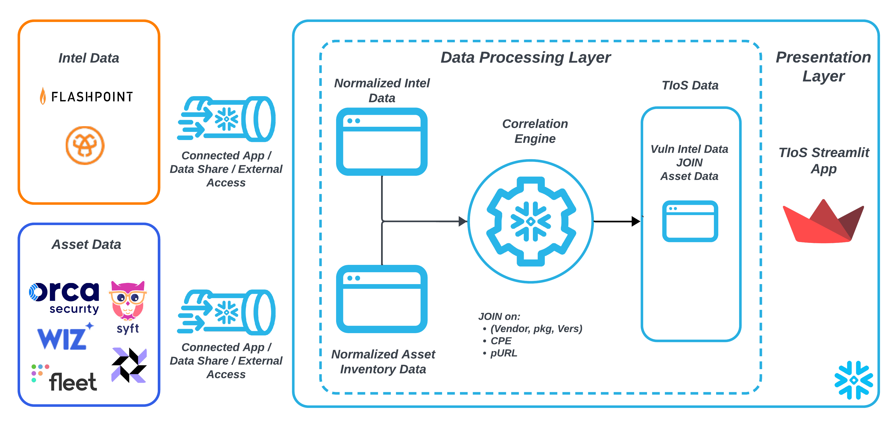
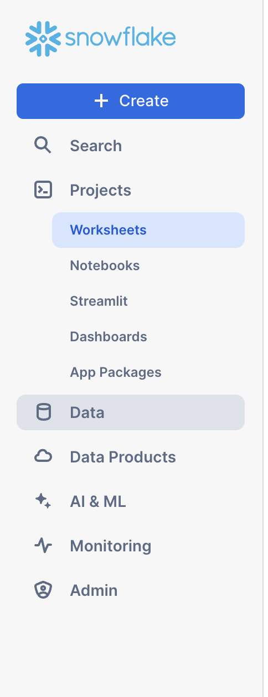

author: Prasanth Kommini
id: vulnerability-intelligence-on-snowflake
categories: snowflake-site:taxonomy/solution-center/certification/quickstart, snowflake-site:taxonomy/product/platform
language: en
summary: This guide will walk you through how to load sample security data info Snowflake tables and then join the data meaningfully and present that information using a Streamlit frontend. 
environments: web
status: Published
feedback link: https://github.com/Snowflake-Labs/sfguides/issues
authors: Manoj Kale, Ankur Agarwal, Prasanth Kommini


# Threat Intelligence on Snowflake Setup Guide

## Overview


In this guide we demonstrate how Snowflake can be used to create a Vulnerability and Threat Intelligence Streamlit App. Organizations require a Vulnerability and Threat Intelligence App so that they can:

1. Keep security teams informed on the latest threat and vulnerability intelligence from various vendors
2. Quickly assess impact to the organization's assets as covered by the organization's inventory process
3. Provide sufficient context through enrichment from vulnerability intel data to facilitate well informed mitigation efforts

The core use cases for the app are:

1. Assets Impacted by a Headline Vulnerability (CVE Lookup)
1. Vulnerabilities Affecting an Asset (Asset ID Lookup)
1. Vulnerabilities Affecting a Package (Package Name Lookup)



### Prerequisites

1. A Snowflake account
2. A database and schema when you have an account with the following permissions:
   - CREATE TABLE
   - CREATE TASK
   - CREATE STREAMLIT
3. Familiarity with Snowsight UI so that you can execute the data loading tasks and some transformation queries

### What You’ll Learn

- How to use Snowflake to do basic vulnerability scans on your asset data that has CPE information given some sample Vulnerability Intelligence Data
- How to write a performant vulnerability scan using SQL JOINs to meaningfully correlate:
  - A sample Vulnerablity Intel data set from a vendor (in this case Flashpoint VulnDB)
  - An organization's data with a specific asset data schema that include CPE or (Vendor, Product, Version) tuple for packages, libraries and software products
- How to deploy the TIOS streamlit application to present that data in a searchable form

### What You’ll Need

- A [Snowflake account](https://signup.snowflake.com/?utm_source=snowflake-devrel&utm_medium=developer-guides&utm_cta=developer-guides) with necessary permissions.

### What You’ll Build

A Vulnerability and Threat Intelligence Application through the following steps:

1. Create Backend Tables
2. Load Raw Data into Backend Tables
3. Correlate Vulnerability Intelligence with Asset Data
4. Deploy the TIOS Streamlit App presenting the `JOIN`ed datasets

<!-- ------------------------ -->

# Steps to Create a Vulnerability Intel Search Streamlit App

## Create Backend Tables


Before executing the create table statements. Open a Snowsight worksheet and select your database and schema at the top of the worksheet.

### Create a Raw Vulnerability Intelligence Data Table

```sql
CREATE OR REPLACE TABLE THREAT_INTEL_RAW_TABLE  (
  RECORDED_AT TIMESTAMP,
  RESULT VARIANT
);
```

### Create a Raw Asset Data Table

We use Wiz for asset discovery and then conduct our own scan using the "Impacted Packages, Libraries and Prodcuts" from our Flashpoint VulnDB intelligence data which provides real-time intel. This allows us to cover blindspots in Wiz reports that can be caused by _vulnerability scan onboarding_ delay plus _scanning delays_.

```sql
CREATE OR REPLACE TABLE ASSETS  (
  CONTAINER_VIRTUAL_MACHINE_ROWOBJECTTYPE VARCHAR(16777216),
  CONTAINER_VIRTUAL_MACHINE_EXTERNALID VARCHAR(16777216),
  SFDEPLOYMENT VARCHAR(16777216),
  HOSTED_TECHNOLOGY_CPE VARCHAR(16777216),
  SFROLE VARCHAR(16777216),
  CONTAINER_VIRTUAL_MACHINE_PROJECTS VARCHAR(16777216)
);
```

### Create a table for saved filters (Needed by the UI)

```sql
create or replace table tios_saved_filters(
    filter_name string,
    filter_params variant,
    created_on timestamp default current_timestamp,
    modified_on timestamp default current_timestamp
);
```

## Load Raw Data into Backend Tables


Follow below steps to load the sample data into the tables created in Step 1.

1. _Download the CSV File_:

   - Download this file: [threat_intel_raw.csv](https://github.com/Snowflake-Labs/sfquickstarts/blob/master/site/sfguides/src/vulnerability-intelligence-on-snowflake/assets/threat_intel_raw.csv).
   - Download this file: [assets_raw.csv](https://github.com/Snowflake-Labs/sfquickstarts/blob/master/site/sfguides/src/vulnerability-intelligence-on-snowflake/assets/assets_raw.csv).=

2. _Upload the CSV to the Snowflake Data Cloud_:
   - Open the Snowflake UI.
   - Navigate to the created table from the 
   - Click on the "Load" option
   - Upload the downloaded files using by filling the details as specified in the next step
   - Select following values in the form:
     - File Format - CSV
     - Header - Skip First Line
     - Field optionally enclosed by - Double Quotes

For detailed instructions on data upload in Snowflake, you can refer to the official Snowflake documentation: https://docs.snowflake.com/en/user-guide/data-load-web-ui

## Correlate Vulnerability Intelligence with Asset Data


### Flatten Vulnerability Data

```sql
CREATE OR REPLACE TABLE THREAT_INTEL_LANDING_TABLE AS
select
    result:THREAT_INTEL_ID::number as threat_intel_id,
    result:DESCRIPTION::string as description,
    result:KEYWORDS::string as keywords,
    result:MANUAL_NOTES::string as manual_notes,
    result:SOLUTION::string as solution,
    result:T_DESCRIPTION::string as t_description,
    result:TITLE::string as title,
    result:AUTHORS as authors,
    result:CLASSIFICATIONS as classifications,
    result:CVSS_METRICS as cvss_metrics,
    result:CVSS_VERSION_THREE_METRICS as cvss_version_three_metrics,
    try_to_timestamp(result:DISCLOSURE_DATE::string) as disclosure_date,
    try_to_timestamp(result:DISCOVERY_DATE::string) as discovery_date,
    try_to_timestamp(result:EXPLOIT_PUBLISH_DATE::string)
        as exploit_publish_date,
    result:EXT_REFERENCES as ext_references,
    result:LIBRARIES as libraries,
    result:NVD_ADDITIONAL_INFORMATION as nvd_additional_information,
    result:PACKAGES as packages,
    try_to_timestamp(result:SOLUTION_DATE::string) as solution_date,
    try_to_timestamp(result:THIRD_PARTY_SOLUTION_DATE::string)
        as third_party_solution_date,
    try_to_timestamp(result:VENDOR_ACK_DATE::string) as vendor_ack_date,
    try_to_timestamp(result:VENDOR_INFORMED_DATE::string)
        as vendor_informed_date,
    result:VENDORS as vendors,
    try_to_timestamp(result:THREAT_INTEL_LAST_MODIFIED::string)
        as threat_intel_last_modified,
    try_to_timestamp(result:THREAT_INTEL_PUBLISHED_DATE::string)
        as threat_intel_published_date,
    result:EPSS_SCORE::string as epss_score,
    result:EPSS_PLUS_SCORE::string as epss_plus_score,
    result:RANSOMWARE_LIKELIHOOD::string as ransomware_likelihood,
    null as details,
    vnd.value:name::string as vendor_name,
    vnd.value:id::number as vendor_id,
    prod.value:name::string as product_name,
    ver.value:affected::string as version_affected,
    ver.value:name::string as version_name,
    cpe_array.value:cpe::string as cpe_purl_pkg,
    cpe_array.value:type::string as cpe_type,
    prod.value:id as product_id,
    ver.value:id as version_id
from THREAT_INTEL_RAW_TABLE,
    lateral flatten(vendors) as vnd,
    lateral flatten(vnd.value:products) as prod,
    lateral flatten(prod.value:versions) as ver,
    lateral flatten(ver.value:cpe) as cpe_array
where
    title not like 'DEPRECATED:%'
    and result:BODY:ERROR::string is null
qualify 1 = dense_rank() over (
    partition by threat_intel_id
    order by
        threat_intel_last_modified
        desc
)
;
```

### JOIN Vulnerability Data with Internal Asset Data

```sql
CREATE OR REPLACE VIEW CPE_EXACT_MATCH_JOIN AS
with threat_intel as (
    select
        split_part(cpe_purl_pkg,':',4) as vendor,
        split_part(cpe_purl_pkg,':',5) as product,
        case when split_part(cpe_purl_pkg,':',6) ilike '%all versions%' then '' else split_part(cpe_purl_pkg,':',6)  end as v
        ,case when  v is null or  v = '' then 'Unspecified' else  v end as  version
        ,*
    from THREAT_INTEL_LANDING_TABLE
),
asset_cpe as (
    select
        split_part(HOSTED_TECHNOLOGY_CPE,':',3) as asset_vendor
        ,split_part(HOSTED_TECHNOLOGY_CPE,':',4) as asset_product
        ,split_part(HOSTED_TECHNOLOGY_CPE,':',5) as asset_v
        ,case
            when asset_v is null or asset_v = ''
            then 'Unspecified'
            else asset_v
        end as asset_version
        ,*
    from ASSETS
)
select distinct
    v.threat_intel_id
    ,v.title
    ,v.cpe_purl_pkg
    ,CONTAINER_VIRTUAL_MACHINE_ROWOBJECTTYPE
    ,CONTAINER_VIRTUAL_MACHINE_EXTERNALID
    ,w.HOSTED_TECHNOLOGY_CPE
    ,CONTAINER_VIRTUAL_MACHINE_PROJECTS
    ,SFROLE
    ,SFDEPLOYMENT
    ,v.details as cpe_details
    ,cvss_version_three_metrics
    ,ext_references
    ,solution
    ,THREAT_INTEL_LAST_MODIFIED
    ,THREAT_INTEL_PUBLISHED_DATE
    ,SOLUTION_DATE
    ,v.vendor
    ,w.asset_vendor
    ,v.product
    ,w.asset_product
    ,v.version
    ,w.asset_version
    ,v.epss_score
    ,v.epss_plus_score
    ,v.classifications
    ,v.ransomware_likelihood
from threat_intel v
inner join asset_cpe w
    on (
        (v.vendor, v.product, v.version) = (w.asset_vendor, w.asset_product, w.asset_version)
    )
;
```

Further increase the matches by consider major and minor version matches as well.

```sql
CREATE OR REPLACE VIEW CPE_MAJOR_MINOR_MATCH_JOIN AS
with asset_cpe as (
    select
        split_part(HOSTED_TECHNOLOGY_CPE,':',3) as asset_vendor
        ,split_part(HOSTED_TECHNOLOGY_CPE,':',4) as asset_product
        ,split_part(HOSTED_TECHNOLOGY_CPE,':',5) as asset_version
        ,split(asset_version,'.') brr
        ,brr[0]::integer b_w
        ,brr[1]::integer b_x
        ,brr[2]::integer b_y
        ,brr[3]::integer b_z
        ,array_construct_compact(b_w,b_x,b_y,b_z) new_brr
        ,*
    from ASSETS
    where 1=1
        and asset_version REGEXP '^[0-9]+(\\.[0-9]+)+$' = true
),
threat_intel as (
    select
        split_part(cpe_purl_pkg,':',4) as vendor,
        split_part(cpe_purl_pkg,':',5) as product,
        case
            when split_part(cpe_purl_pkg,':',6) ilike '%all versions%' then ''
            else split_part(cpe_purl_pkg,':',6)
        end as version
         ,split(version,'.') arr
        ,arr[0]::integer a_w
        ,arr[1]::integer a_x
        ,arr[2]::integer a_y
        ,arr[3]::integer a_z
        ,array_construct_compact(a_w,a_x,a_y,a_z) new_arr
        ,*
    from THREAT_INTEL_LANDING_TABLE
        where version REGEXP '^[0-9]+(\\.[0-9]+)+$' = true
         and cpe_purl_pkg not in (
            select distinct cpe_purl_pkg
            from CPE_EXACT_MATCH_JOIN
        )
        and vendor in (select distinct asset_vendor from asset_cpe)
),
joined as (
    select
        v.threat_intel_id
        ,v.title
        ,v.cpe_purl_pkg
        ,CONTAINER_VIRTUAL_MACHINE_ROWOBJECTTYPE
        ,CONTAINER_VIRTUAL_MACHINE_EXTERNALID
        ,w.HOSTED_TECHNOLOGY_CPE
        ,CONTAINER_VIRTUAL_MACHINE_PROJECTS
        ,SFROLE
        ,SFDEPLOYMENT
        ,v.details as cpe_details
        ,cvss_version_three_metrics
        ,ext_references
        ,solution
        ,THREAT_INTEL_LAST_MODIFIED
        ,THREAT_INTEL_PUBLISHED_DATE
        ,SOLUTION_DATE
        ,v.vendor
        ,w.asset_vendor
        ,v.product
        ,w.asset_product
        ,version as v_ver
        ,asset_version w_ver
        ,array_to_string(array_slice(new_arr,0,2),'.') vuln_ver
        ,array_to_string(array_slice(new_brr,0,2),'.') asset_ver
        ,(
            (a_w = b_w)  AND
            (a_x IS NULL OR b_x IS NULL OR a_x = b_x) AND
            (a_y IS NULL OR b_y IS NULL OR a_y = b_y) AND
            (a_z IS NULL OR b_z IS NULL OR a_z = b_z)
        ) as v_match
        ,v.epss_score
        ,v.epss_plus_score
        ,v.classifications
        ,v.ransomware_likelihood
    from threat_intel v
    inner join asset_cpe w
        on (v.vendor, v.product) = (w.asset_vendor, w.asset_product)
        where v_match

)
select distinct
    threat_intel_id
    ,title
    ,cpe_purl_pkg
    ,CONTAINER_VIRTUAL_MACHINE_ROWOBJECTTYPE
    ,CONTAINER_VIRTUAL_MACHINE_EXTERNALID
    ,HOSTED_TECHNOLOGY_CPE
    ,CONTAINER_VIRTUAL_MACHINE_PROJECTS
    ,SFROLE
    ,SFDEPLOYMENT
    ,cpe_details
    ,cvss_version_three_metrics
    ,ext_references
    ,solution
    ,THREAT_INTEL_LAST_MODIFIED
    ,THREAT_INTEL_PUBLISHED_DATE
    ,SOLUTION_DATE
    ,vendor
    ,asset_vendor
    ,product
    ,asset_product
    ,v_ver version
    ,w_ver asset_version
    ,epss_score
    ,epss_plus_score
    ,classifications
    ,ransomware_likelihood
from joined
```

Finally, consolidate all matches into a single view

```sql
CREATE OR REPLACE VIEW CPE_CONSOLIDATED_VIEW
AS
with consolidated as (
    select
        *
    from CPE_EXACT_MATCH_JOIN
    union all
    select
        *
    from CPE_MAJOR_MINOR_MATCH_JOIN
)
select
    a.*,
    case when CONTAINER_VIRTUAL_MACHINE_PROJECTS ILIKE '%prod%' then 'prod' else 'non-prod' end as environment,
    b.value:source::string source,
    concat('CVE-',b.value:cve_id) cve_id,
    b.value:score::string cvss,
    case
        when (cvss >= '9.0'::float) then 'critical'
        when ((cvss >= '7.0'::float) and (cvss <= '8.9'::float)) then 'high'
        when ((cvss >= '4.0'::float) and (cvss <= '6.9'::float)) then 'medium'
        else 'low'
    end as severity,
    b.value:generated_on::timestamp generated_on
from consolidated a, lateral flatten(cvss_version_three_metrics) b
qualify 1 = row_number() over(partition by b.seq,b.value:source,coalesce(b.value:cve_id,'') order by generated_on desc)

```

## Deploy the TIOS Streamlit App presenting the `JOIN`ed datasets


The Streamlit app is located in this [repository](https://github.com/sfc-gh-pkommini/tios). The app can be run locally (on a mac) or can be deployed in SIS and is setup in such a way that it is compatible with both.

### Instructions to run locally

1. Install `miniconda`

   ```bash
   brew install miniconda
   conda init zsh
   ```

1. Create a python 3.10 environment compatible with snowpark

   ```bash
   conda create \
     --name streamlit-tios python=3.10 \
     --override-channels \
     -c https://repo.anaconda.com/pkgs/snowflake
   ```

1. Create `.streamlit/secrets.toml`

   ```conf
    [snowflake]
    user="my_snowflake_username"
    authenticator="externalbrowser" # or password
    account="my_account_id"
    warehouse="DEV_WH"
    database="my_db"
    schema="TIOS_DEV"
    role="my_tios_role"
   ```

1. Activate environment and install packages

   ```sh
   conda activate streamlit-tios
   pip install --upgrade -r requirements-dev.txt
   ```

1. Update the warehouse name in snowflake.yml and Run the app

```sh
streamlit run tios/1_tios_app.py
```

### Instructions to deploy on SIS

We use snowflakecli to do the deployments.

1. Install and Setup snowflakecli

   ```bash
   pip install git+https://github.com/Snowflake-Labs/snowcli.git@v2.2.0
   ```

1. Create `~/.snowflake/config.toml` to setup connections required by snowflakecli

   ```toml
    [connections]

    [connections.tios_dev]
    account = "my_account_id"
    user = "my_username"
    authenticator = "externalbrowser"
    database = "my_db"
    schema = "TIOS_DEV"
    warehouse = "DEV_WH"
    role = "my_tios_role"
   ```

1. Deploy the Streamlit App

   ```bash
   snow streamlit deploy -c tios_dev --project=./ --replace
   ```

## Vulnerability Management Use Cases


### Use Case 1: Assets Impacted by a Headline Vulnerability (CVE Lookup)

The first use case is when there is a new vulnerability disclosure and a CISO is tasked with assessing impact to their environment and has to answer customers if they are impacted. In such a use case, the TIOS Streamlit app can be used to do a CVE ID lookup and find the number of impacted assets.

In the filter form, enter "CVE-2023-0466" into the CVE ID field and apply filter. You will see a number of results. In this case unfortunately we are affected by this vulnerability based on the coverage of our asset scanners.

Similarly, enter "CVE-2024-1234" in to the CVE ID textbox of the filter form and apply filters. You will see there are no results implying that we're not affected by this vulnerability based on the coverage of our asset data.

NOTE: Does not having any results mean we're not impacted by a vulnerability? No! It just means that through the lens our asset data we don't see any assets impacted. The vulnerability could be present in assets that are not currently covered by our asset scanning. This shows the importance of our asset coverage.

### Use Case 2: Vulnerabilities Affecting an Asset (Asset ID Lookup)

For our second use case, let us consider a scenario where we found Indicators of Compromise (IOC) on one of our assets. We now want to lookup the attack surface on that asset as part of the incident response investigation that will also guide our remediation efforts. In this case, TIOS Streamlit app can be used to perform an asset ID lookup.

Paste "i-0o4pkw8dveyp2ijvd" in to the "Asset ID" textbox of the filter form and apply filter. You'll see some results returned which show the unique number of vulnerabilities affecting packages in assets within the organization.

As another example input "i-1234" into the Asset ID textbox of the filter form and apply filter. You'll notice that there no results returned. This means that the asset ID: "i-1234" is not impacted by any vulnerabilities at the moment.

### Use Case 3: Vulnerabilities Affecting a Package (Package Name Lookup)

For our final use case. We find that a headline vulnerability such as log4j emerges and we need to quantify the presence of a package within our environment. In this case TIOS Streamlit app can be used to perform a Package Name lookup.

Paste "openssl" into the "Package Name" textbox of the filter form and apply filter. You'll notice some results.

These results represent vulnerable versions of the package found in various compute instance across the organizations. We can then use this to guide our patching efforts in order to notify each service team of the compute instances in their control.

## Conclusion and Resources


Congratulations! You have successfully built a Vulnerability and Threat Intelligence App using Snowflake, Snowpark and Streamlit and used it in a couple of security use cases.

### What You Learned

Here is the overview of what we built:

- How to setup some fake Vulnerability and Asset data respresenting a snapshot of an organization's data
- How to perform one time JOIN on that Vulnerability and Asset Data using a deconstructed CPE
- How to further increase the matches in the JOIN by doing shallow version comparisons
- How to then deploy the Streamlit App using Snowflake CLI (a preview feature)
- How to use the Streamlit App in various security use cases in day to day security operations

### Related Resources

- [Vulnerability Intelligence on Snowflake Blog](https://medium.com/snowflake/threat-intelligence-on-snowflake-08455bba6ab9)
- [TIOS Github Repo](https://github.com/sfc-gh-pkommini/tios)
