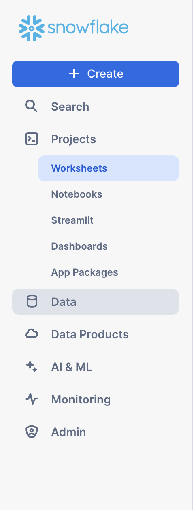

author: Prasanth Kommini
id: Vulnerability Intelligence on Snowflake
summary:
summary: This guide will walk you through how to load sample security data info Snowflake tables and then join the data meaningfully and present that information using a Streamlit frontend.
categories: TBD
environments: web
status: Published
feedback link: https://github.com/Snowflake-Labs/sfguides/issues
tags: Security, Vulnerability Intelligence
authors: Manoj Kale, Ankur Angarwal, Prasanth Kommini

# Threat Intelligence on Snowflake Setup Guide

## Overview

Duration: 1

In this guide we demonstrate how Snowflake can be used to create a Vulnerability Intelligence application. Organizations require a Vulnerability Intelligence application so that they can:

1. Keep security teams informed on the latest threat and vulnerability intelligence
2. Quickly assess impact to the organization's assets as covered by the inventory process
3. Provide sufficient context through enrichment from vulnerability intel data to facilitate well informed mitigation efforts

### Prerequisites

1. A Snowflake account
2. A database and schema when you have an account with the following permissions:
   - CREATE TABLE
   - CREATE TASK
   - CREATE STREAMLIT
3. Familiarity with Snowsight UI so that you can execute the data loading SQL queries

### What You’ll Learn

- How to setup Snowflake tables
- How to write a performant vulnerability scan using SQL JOINs to meaningfully correlate
  - Vulnerablity Intel data from a vendor such as Flashpoint VulnDB
  - An organization's data with a specific asset data schema
- How to setup Snowflake tasks to periodically perform the JOINs as the vulnerability and asset data sets are kept fresh

### What You’ll Need

- A Snowflake account with necessary access

### What You’ll Build

- A Vulnerability Intelligence Application

<!-- ------------------------ -->

## Create Tables

Duration: 2

<!-- ------------------------ -->

## Creating a Step

Duration: 2

A single sfguide consists of multiple steps. These steps are defined in Markdown using Header 2 tag `##`.

````markdown
## Step 1: Create Tables

### Create a table for Vulnerability Intelligence Data

```sql
CREATE OR REPLACE TABLE VULNDB_RAW_TABLE  (
  RECORDED_AT TIMESTAMP,
  RESULT VARIANT
);
```
````

### Create a table for Asset Data

We use Wiz for asset discovery and then conduct our own scan using the "Impacted Packages, Libraries and Prodcuts" from our Flashpoint VulnDB intelligence data which provides real-time intel. This allows us to cover blindspots in Wiz reports that can be caused by _vulnerability scan onboarding_ delay plus _scanning delays_.

```sql
CREATE OR REPLACE TABLE WIZ_ASSETS  (
  CONTAINER_VIRTUAL_MACHINE_ROWOBJECTTYPE VARCHAR(16777216),
  CONTAINER_VIRTUAL_MACHINE_EXTERNALID VARCHAR(16777216),
  SFDEPLOYMENT VARCHAR(16777216),
  HOSTED_TECHNOLOGY_CPE VARCHAR(16777216),
  SFROLE VARCHAR(16777216),
  CONTAINER_VIRTUAL_MACHINE_PROJECTS VARCHAR(16777216)
);
```

## Step 2: Load Data

Follow below steps to load the sample data into the tables created in Step 1.

1. _Download the CSV File_:

   - Download this file: [vulndb_raw.csv](assets/vulndb_raw.csv).

2. _Upload the CSV to the Snowflake Data Cloud_:
   - Open the Snowflake UI.
   - Navigate to the created table from the 
   - Click on the "Load" option
   - Upload the downloaded "vulndb_raw.csv" file
   - Select following values in the form:
     - File Format - CSV
     - Header - First Line Contains Header
     - Field optionally enclosed by - Double Quotes

For detailed instructions on data upload in Snowflake, you can refer to the official Snowflake documentation: https://docs.snowflake.com/en/user-guide/data-load-web-ui

## Step 3: Deploy the streamlit application

## Conclusion

Duration: 1

At the end of your Snowflake Guide, always have a clear call to action (CTA). This CTA could be a link to the docs pages, links to videos on youtube, a GitHub repo link, etc.

If you want to learn more about Snowflake Guide formatting, checkout the official documentation here: [Formatting Guide](https://github.com/googlecodelabs/tools/blob/master/FORMAT-GUIDE.md)

### What we've covered
