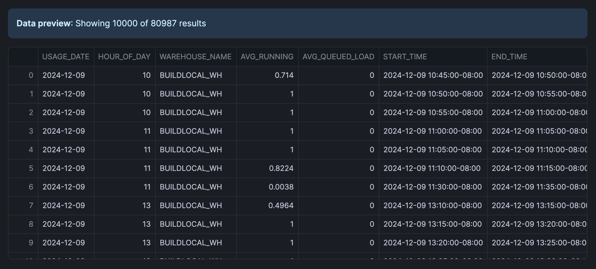
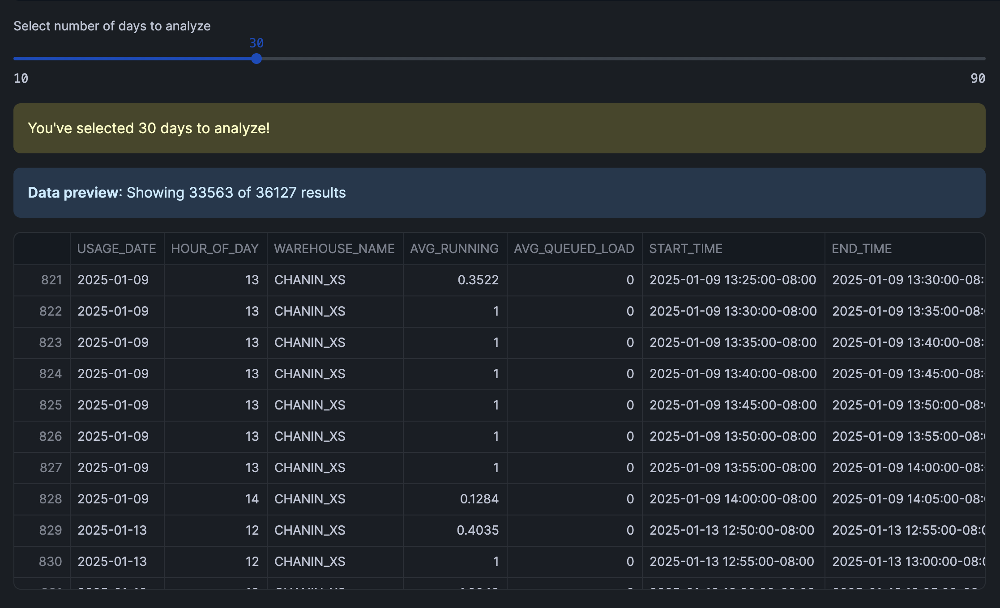
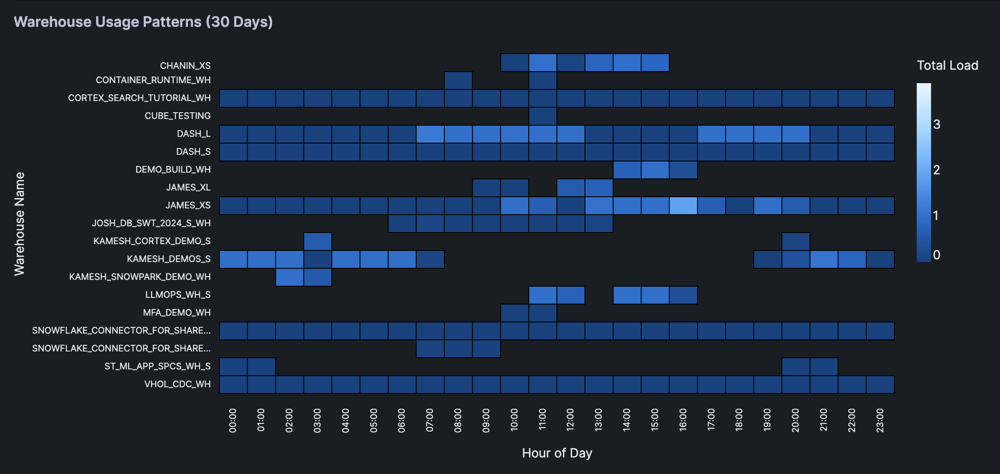

author: Chanin Nantasenamat
id: warehouse-utilization
categories: snowflake-site:taxonomy/solution-center/certification/quickstart, snowflake-site:taxonomy/product/platform
language: en
summary: Learn how to create an interactive heatmap visualization of Snowflake warehouse utilization patterns in Snowflake Notebooks and Streamlit. 
environments: web
status: Published
feedback link: https://github.com/Snowflake-Labs/sfguides/issues


# Build Warehouse Utilization App in Snowflake Notebooks
<!-- ------------------------ -->
## Overview

Learn how to create an interactive visualization tool that helps you analyze (and optimize) your Snowflake warehouse usage patterns. Using Snowflake Notebooks with Streamlit, you'll build a heatmap dashboard that reveals peak usage hours and potential cost optimization opportunities.

### What You'll Learn
- How to query warehouse utilization data from Snowflake
- Creating interactive widgets with Streamlit
- Building heatmap visualizations using Altair

### What You'll Build
An interactive dashboard featuring a heatmap visualization of warehouse usage patterns across different hours of the day, thereby helping to identify peak usage times and opportunities for optimization.

### What You'll Need
- Access to a [Snowflake account](https://signup.snowflake.com/?utm_source=snowflake-devrel&utm_medium=developer-guides&utm_cta=developer-guides)
- Basic familiarity with SQL and Python
- Understanding of Snowflake [warehouses](https://docs.snowflake.com/en/user-guide/warehouses-overview)

<!-- ------------------------ -->
## Setup

Firstly, to follow along with this quickstart, you can click on [Warehouse_Utilization_with_Streamlit.ipynb](https://github.com/Snowflake-Labs/snowflake-demo-notebooks/blob/main/Warehouse_Utilization_with_Streamlit/Warehouse_Utilization_with_Streamlit.ipynb) to download the Notebook from GitHub. 

Notebooks comes pre-installed with common Python libraries for data science and machine learning, including numpy, pandas, matplotlib, and more! For this particular use case, there's no further library to add to the working environment. If you need additional packages, use the Packages dropdown on the top right to add them to your notebook.

<!-- ------------------------ -->
## Retrieve Warehouse Data

### Write the Query
First, we'll query the warehouse utilization data available from `SNOWFLAKE.ACCOUNT_USAGE.WAREHOUSE_LOAD_HISTORY`:

```sql
SELECT 
    DATE(start_time) AS usage_date,
    HOUR(start_time) AS hour_of_day,
    warehouse_name,
    avg_running,
    avg_queued_load,
    start_time,
    end_time
FROM snowflake.account_usage.warehouse_load_history
WHERE start_time >= DATEADD(month, -1, CURRENT_TIMESTAMP())
ORDER BY warehouse_name, start_time;
```

Note: The above SQL cell is named `sql_warehouse_data`.

### Converting to DataFrame
Convert the above SQL results to a Pandas DataFrame:

```python
sql_warehouse_data.to_pandas()
```

The retrieved data looks like the following:

Note: The above Python cell is named `py_dataframe`.



<!-- ------------------------ -->
## Create an Interactive Interface

### Build the Slider Widget
Let's create an interactive slider using Streamlit. This would allow users to select the number of days to analyze, which would filter the DataFrame. 

Finally, we'll calculate the total warehouse load (`TOTAL_LOAD`) and format the hour display (`HOUR_DISPLAY`) for each record.

```python
import pandas as pd
import streamlit as st

# Get data
df = py_dataframe.copy()

# Create date filter slider
days = st.slider('Select number of days to analyze', 
                 min_value=10, 
                 max_value=90, 
                 value=30, 
                 step=10)

# Filter data based on selected days and create a copy
latest_date = pd.to_datetime(df['USAGE_DATE']).max()
cutoff_date = latest_date - pd.Timedelta(days=days)
filtered_df = df[pd.to_datetime(df['USAGE_DATE']) > cutoff_date].copy()

# Prepare data and create heatmap
filtered_df['TOTAL_LOAD'] = filtered_df['AVG_RUNNING'] + filtered_df['AVG_QUEUED_LOAD']
filtered_df['HOUR_DISPLAY'] = filtered_df['HOUR_OF_DAY'].apply(lambda x: f"{x:02d}:00")

st.warning(f"You've selected {days} days to analyze!")
filtered_df
```

The interactive interface that we've created using Streamlit is shown below along with the filtered DataFrame:



<!-- ------------------------ -->
## Visualize Usage Patterns

### Create the Heatmap
Finally, we're creating a heatmap using Altair. 

The heatmap shows the warehouse usage pattern across different hours of the day. Color intensity represents the total load and interactive tooltips showing detailed metrics for each cell.

```python
import altair as alt
import streamlit as st

chart = alt.Chart(filtered_df).mark_rect(
    stroke='black',
    strokeWidth=1
).encode(
    x=alt.X('HOUR_DISPLAY:O', 
            title='Hour of Day',
            axis=alt.Axis(
                labels=True,
                tickMinStep=1,
                labelOverlap=False
            )),
    y=alt.Y('WAREHOUSE_NAME:N', 
            title='Warehouse Name',
            axis=alt.Axis(
                labels=True,
                labelLimit=200,
                tickMinStep=1,
                labelOverlap=False,
                labelPadding=10
            )),
    color=alt.Color('TOTAL_LOAD:Q', title='Total Load'),
    tooltip=['WAREHOUSE_NAME', 'HOUR_DISPLAY', 'TOTAL_LOAD', 
            'AVG_RUNNING', 'AVG_QUEUED_LOAD']
).properties(
    title=f'Warehouse Usage Patterns ({days} Days)'
).configure_view(
    stroke=None,
    continuousHeight=400
).configure_axis(
    labelFontSize=10
)

# Display the chart
st.altair_chart(chart, use_container_width=True)
```

Here's the heatmap displaying the warehouse usage patterns:



<!-- ------------------------ -->
## Conclusion And Resources

Congratulations! You've successfully built an interactive warehouse utilization app that helps to identify usage patterns and optimization opportunities. This tool will help you make data-driven decisions about warehouse sizing and scheduling.

### What You Learned
- Queried warehouse utilization data from Snowflake
- Built an interactive interface with Streamlit
- Created an informative heatmap visualizations
- Analyzed warehouse usage patterns

### Related Resources

Articles:
- [Account Usage Views](https://docs.snowflake.com/en/sql-reference/account-usage)
- [Overview of Warehouses](https://docs.snowflake.com/en/user-guide/warehouses-overview)
- [Warehouse Load History](https://docs.snowflake.com/en/sql-reference/account-usage/warehouse_load_history)
- [Using Notebooks with Snowflake](https://docs.snowflake.com/en/user-guide/ui-snowsight/notebooks-use-with-snowflake)

Documentation:
- [Snowflake Documentation](https://docs.snowflake.com/)
- [Streamlit Documentation](https://docs.streamlit.io/)

Happy coding!
