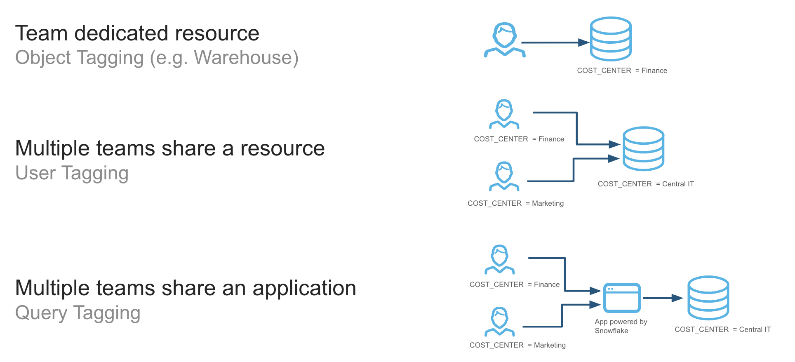

author: Well Architected Framework Team
id: well-architected-framework-cost-optimization-and-finops
categories: snowflake-site:taxonomy/solution-center/certification/well-architected-framework
language: en
summary: The Cost Optimization Pillar focuses on integrating financial accountability and cost awareness throughout the cloud platform lifecycle. 
environments: web
status: Published 

# Cost Optimization

## Overview

The Cost Optimization Pillar focuses on integrating financial
accountability and cost awareness throughout the cloud platform
lifecycle. It involves establishing principles, gaining visibility into
spending, implementing controls, and continuously optimizing resources
to align cloud costs with business value. This pillar is essential for
financial stakeholders, cloud architects, and engineering teams seeking
to maximize return on investment in cloud infrastructure.

## Principles

#### Business impact: Align cost with business value

Connect cloud spending directly to business outcomes, ensuring that every dollar spent in the cloud contributes meaningfully to strategic objectives and demonstrable value. Embed cost considerations directly into platform planning and architecture considerations.

#### Visibility: Understand & contextualize your consumption footprint

You can neither control nor optimize what you can't see. Gain deep and granular insight into all aspects of your cloud spending, fostering transparency, and attributing costs effectively.

#### Control: Establish guardrails and governance

Establish policies and mechanisms to govern resource provisioning and consumption, preventing unnecessary costs and enforcing financial boundaries.

#### Optimize: Maximize efficiency and value

Continuously improve the efficiency of your resources and workloads to maximize the value derived from your platform investment.

## Recommendations

The following key recommendations are covered within each principle of
Cost Optimization:

- **Business Impact**

  - **Consider cost as a design constraint:** Integrate cost
    considerations into the architecture and design process from the
    very beginning, making it a key non-functional requirement alongside
    performance, security, and reliability.

  - **Quantify value:** Develop metrics to quantify the business value
    delivered by cloud resources (e.g., revenue per Snowflake Credit,
    cost per customer, efficiency gains).

  - **Trade-off analysis:** Understand the inherent trade-offs between
    cost, performance, reliability, and security, and make informed
    decisions that align with business priorities.

  - **Measure business value KPIs baseline:** Once metrics to quantify
    business value are identified and trade-offs between cost,
    performance, and reliability are established, you need to document a
    “baseline measurement” in order to track progress again.
    Furthermore, you should establish a regular cadence for refreshing
    this measurement to ensure value realization is in line with
    expectations and business goals.

- **Visibility**

  - **Understand Snowflake’s resource billing models:** Review
    Snowflake’s billing models to align technical and non-technical
    resources on financial drivers and consumption terminology.

  - **Establish a consistent and granular cost attribution strategy:**
    Implement robust and organizationally consistent tagging and
    labeling strategies across all resources (storage objects,
    warehouses, accounts, queries) to accurately allocate costs to
    specific teams, products, or initiatives.

  - **Embed cost accountability into your organization's DNA:**
    Implement a feedback system to transparently show or charge back
    cloud costs to relevant business units or teams, increasing
    accountability.

  - **Deliver clear, historical consumption insights:** Utilize
    consistent in-tool visualizations or custom dashboards to monitor
    consumption and contextualize spend on the platform with unit
    economics.

  - **Investigate anomalous consumption activity:** Review anomaly
    detection to identify unforeseen cost anomalies and investigate
    cause and effect trends.

- **Control**

  - **Proactively monitor all platform usage:** Define and enforce
    budgets for projects and services, setting soft quotas to limit
    resource consumption and prevent runaway spending.

  - **Forecast consumption based on business needs:** Establish a
    forecast process to project future spend needs based on business and
    technical needs.

  - **Enforce cost guardrails for organizational resources:** Set up
    automated checks (e.g., Tasks, query insights) and resource
    guardrails (e.g., warehouse timeout, storage policies, resource
    monitors) to identify unusual usage patterns and potential
    overspending as they occur.

  - **Govern resource creation and administration:** Establish clear
    guidelines and automated processes for provisioning and maintaining
    resources, ensuring that only necessary and appropriately sized
    resources are deployed (e.g., warehouse timeout, storage policies,
    resource monitors).

- **Optimize**

  - **Compute workload-aligned provisioning:** Continuously monitor
    resource health metrics to resize and reconfigure to match actual
    workload requirements.

  - **Leverage managed services:** Prioritize fully managed Snowflake
    services (e.g., Snowpipe, Auto-clustering, [<u>Query Acceleration
    Service</u>](https://docs.snowflake.com/en/user-guide/query-acceleration-service))
    to offload operational overhead and often achieve better cost
    efficiency.

  - **Data storage types & lifecycle management:** Utilize appropriate
    storage types and implement appropriate storage configuration to
    right-size workloads to your storage footprint. Move data to cheaper
    tiers or delete it when no longer needed.

  - **Workload & architectural optimization:** Leverage architectural
    decisions for cost-optimized resource utilization while meeting
    business needs.

  - **Limit data transfer:** Move, secure, and back up the appropriate
    footprint across cloud regions.

  - **Improve continually:** As new capabilities or usage patterns
    emerge, establish a consistent testing framework to identify areas
    for cost efficiency.

## Business Impact

#### Overview

To maximize organizational outcomes, Snowflake consumption must be
explicitly tied to business value. While cost optimization ensures
efficiency, it does not guarantee that spend is aligned with outcomes
that matter to stakeholders. Alignment of business value to cost ensures
workloads, pipelines, dashboards, and advanced analytics are
continuously evaluated not only for cost but also for the value they
deliver. This approach ensures Snowflake delivers as a strategic
business platform rather than a technical expense.

#### Recommendations

Business value to cost alignment represents a maturity step in FinOps on
Snowflake. By embedding benchmarking, impact analysis, SLA definition,
usage metrics, ROI measures, and business impact evaluation into daily
operations, organizations can ensure that Snowflake consumption is
continuously justified, optimized, and communicated in business terms.
This elevates the conversation with leadership from cost oversight to
value realization and ensures that Snowflake is understood as a platform
for growth, innovation, and competitive advantage.

#### 

#### Consider cost as a design constraint

Cost-Aware Architecting is the practice of embedding financial
accountability directly into the design and development of Snowflake
workloads. By shifting left—introducing cost considerations early in the
architecture lifecycle—organizations ensure that ingestion,
transformation, analytics, and distribution workloads are not only
performant but also aligned with budget expectations. Many cost overruns
in Snowflake originate from architectural decisions made without cost
implications in mind.

For example, designing ingestion with sub-second latency when daily
freshness is sufficient, or selecting inefficient table designs that
increase query scanning. These can lead to disproportionate spend.
Shifting cost awareness into architecture helps prevent inefficiencies
before they occur and reinforces Snowflake’s role as a cost-effective
enabler of business value.

At the ingestion layer, best practices include balancing latency versus
cost by selecting appropriate services (e.g., Snowpipe, Snowpipe
Streaming, or third-party tools) and choosing the right storage format
(e.g., native tables, Iceberg). For transformations, design with
frequency versus SLA in mind to ensure data freshness matches the
business need. For analytics, apply schema design best practices such as
thoughtful clustering key choices and pruning strategies to reduce
consumed credits. In distribution, optimize data transfer by monitoring
egress patterns and applying cost-saving practices like the
[<u>Snowflake Data Transfer
Optimizer</u>](https://docs.snowflake.com/en/collaboration/provider-listings-auto-fulfillment-eco).

#### Quantify value

To maximize organizational outcomes, Snowflake consumption must be
explicitly tied to measurable business value and clearly communicated in
terms that resonate with stakeholders. Establishing baselines using
Snowflake’s [<u>Account Usage
views</u>](https://docs.snowflake.com/en/sql-reference/account-usage)
creates a reference point, while tracking the current state highlights
trends in performance and consumption. Defining explicit goal
states—such as reduced cost per decision, improved time-to-market, or
broader data access—ties workloads directly to outcomes that matter to
stakeholders. Outliers that diverge from these goals should be flagged
for review and optimization to prevent wasted resources. Best practices
include applying unit economic measures related to your field (e.g. cost
per terabyte analyzed or cost per fraud case prevented) and publishing
ROI dashboards that continuously link Snowflake consumption to business
outcomes. By incorporating measurement into daily operations,
organizations can move the conversation with leadership from cost
oversight to demonstrable value realization, positioning Snowflake as a
clear enabler of enterprise growth and innovation.

#### Trade-off analysis

Defining SLAs or explicit business needs ensures that Snowflake
workloads are aligned with their intended purpose and that consumption
levels are justified by business outcomes. Some Snowflake workloads can
become over-engineered or maintained without clear justification. Tying
each workload to an SLA or business requirement prevents waste and
ensures that investment aligns with value. Before implementation, it is
crucial to document and align on the value of meeting an SLA,
identifying all stakeholders who rely on the workload. This includes
differentiating between tangible outcomes, such as increased revenue,
and intangible outcomes, such as compliance or data trust. Efficient
customers use both [<u>Snowflake Resource
Monitors</u>](https://docs.snowflake.com/en/user-guide/resource-monitors)
and Budgets features to enforce guardrails that ensure workloads remain
within acceptable cost-performance boundaries. All design decisions have
trade-offs, and explicitly calling out the expected outcomes leads to
streamlined decision-making in the future when outcomes are reviewed.

#### Measure business value KPIs baseline

Benchmarking establishes performance and cost baselines for Snowflake
workloads and compares them against internal standards as well as
performance and cost results from previous tech solutions. These
benchmarks can measure workload efficiency, the adoption of specific
Snowflake features, and the alignment of workload costs to business
outcomes. Without benchmarks, organizations lack the context to
determine if their Snowflake consumption is delivering economies of
scale or value back to the business. Benchmarking allows teams to
identify best practices, track improvements over time, and highlight
outliers that may be driving unnecessary spend or delivering unexpected
value.

Best practices include measuring technical unit economic metrics (e.g.
credits per 1K queries, credits per 1 TB scanned), warehouse efficiency
and utilization by workload type, and business unit economics (e.g.
credits per customer acquired, credits per partner onboarded, or credits
per data product-specific KPIs). This provides a more comprehensive
picture of consumption in relation to cost and value. Outliers should be
highlighted in executive communications as either success stories or
cautionary examples. Benchmarking should be embedded in a continuous
improvement loop, where insights drive action, action improves
efficiency, and those improvements are effectively measured.

## Visibility

#### Overview

The Snowflake Visibility principle is designed to transform opaque cloud
spending into actionable insights, fostering financial accountability
and maximizing business value within your Snowflake environment. It is
foundational to the FinOps framework, as you cannot control, optimize,
or attribute business value to what you cannot see. To effectively
manage and optimize cloud costs in Snowflake, it's crucial to align
organizationally to an accountability structure of spend, gain deep and
granular insight into all aspects of your cloud spending, and
transparently display it to the appropriate stakeholders to take action.

#### Recommendations

Implementing a robust FinOps visibility framework in Snowflake,
supported by cross-functional collaboration, enables each business
function to access timely and relevant usage and cost data. This
empowers them to understand the business impact of their consumption and
take prompt action when anomalies arise. To meet this vision, consider
the following recommendations based on industry best practices and
Snowflake's capabilities:

#### Understand Snowflake’s resource billing models

It is essential to review Snowflake's billing models to align technical
and non-technical resources on financial drivers and consumption
terminology. Snowflake's elastic, credit-based consumption model charges
separately for compute (Virtual Warehouses, Compute Pools, etc),
storage, data transfer, and various serverless features (e.g., Snowpipe,
Automatic Clustering, Search Optimization, Replication/Failover, AI
Services). Understanding the interplay of these billing types ensures
you can attribute costs associated with each category’s unique usage
parameters. High-level categories are below.

- **Compute (Virtual Warehouses, Snowpark Container Services,
  Openflow):** This is often the most dynamic and largest portion of
  Snowflake spend. Virtual Warehouses are billed per-second after an
  initial 60-second minimum when active, with credit consumption
  directly proportional to warehouse size (e.g., an “X-Small” Gen1
  warehouse consumes one credit per hour, a 'Small' consumes two credits
  per hour, doubling with each size increase) while SPCS (via
  [<u>compute
  pools</u>](https://docs.snowflake.com/en/developer-guide/snowpark-container-services/accounts-orgs-usage-views#compute-pool-cost))
  are billed for all uptime with a minimum of five minutes.
  [<u>Openflow</u>](https://docs.snowflake.com/en/user-guide/data-integration/openflow/cost)
  is billed per second of runtime with a 60-second
  minimum.

- **Storage:** Costs are based on the average monthly compressed data
  volume stored, including active data, Time Travel (data retention),
  and Fail-safe (disaster recovery) data. The price per terabyte (TB)
  varies by cloud provider and region.

- **Serverless features:** Snowflake Serverless features use resources
  managed by Snowflake, not the user, which automatically scale to meet
  the needs of a workload. This allows Snowflake to pass on efficiencies
  and reduce platform administration while providing increased
  performance to customers. The cost varies by feature and is outlined
  in [<u>Snowflake’s Credit Consumption
  Document</u>](/legal-files/CreditConsumptionTable.pdf).

- **Cloud services layer:** This encompasses essential background
  services, including query compilation, metadata management,
  information schema access, access controls, and authentication. Usage
  for cloud services is only charged if the daily consumption of cloud
  services exceeds 10% of the daily usage of virtual warehouses.

- **AI features:** Snowflake additionally offers artificial intelligence
  features that run on Snowflake-managed compute resources, including
  Cortex AISQL functions (e.g. COMPLETE, CLASSIFY, etc.), Cortex
  Analyst, Cortex Search, Fine Tuning, and Document AI. The usage of
  these features, often with tokens, are converted to credits to unify
  with the rest of Snowflake’s billing model. Details are listed in the
  Credit Consumption Document.

- **Data transfer:** Data transfer is the process of moving data into
  (ingress) and out of (egress) Snowflake. This generally happens via
  egress on cross-region [<u>data
  replication</u>](https://docs.snowflake.com/en/user-guide/account-replication-cost#viewing-actual-costs),
  [<u>copying into/out of stage, function
  calls</u>](https://docs.snowflake.com/user-guide/cost-understanding-data-transfer#snowflake-features-that-incur-transfer-costs),
  and cross/same region [<u>SPCS data
  transfer</u>](https://docs.snowflake.com/en/developer-guide/snowpark-container-services/accounts-orgs-usage-views#data-transfer-cost).
  Depending on the cloud provider and the region used during data
  transfer, charges vary.

- **Data sharing & rebates:** Snowflake offers an opt-out Data
  Collaboration rebate program that allows customers to offset credits
  by data consumed with shared outside organizations. This rebate is
  proportional to the consumption of your shared data by consumer
  Snowflake accounts. See the latest terms and more details
  [<u>here</u>](/en/legal/).

#### Establish a consistent and granular cost attribution strategy

Implementing robust and organizationally consistent tagging and labeling
strategies across all resources (e.g. storage objects, warehouses,
accounts, queries) is crucial to accurately allocate costs to specific
teams, products, or initiatives and linking actions to outcomes.

**Tagging in Snowflake**

Tagging can be done at several levels:

- **Snowflake object tagging:** Snowflake allows you to apply
  [<u>object-level
  tags</u>](https://docs.snowflake.com/en/user-guide/object-tagging/introduction#supported-objects)
  (key-value pairs) to accounts, warehouses, databases, schemas, users,
  tables, and more. These tags are fundamental for apportioning costs
  across departments, environments (dev, test, prod), projects, or lines
  of business. Tags can also support
  [<u>inheritance</u>](https://docs.snowflake.com/en/user-guide/object-tagging/inheritance)
  and
  [<u>propagation</u>](https://docs.snowflake.com/en/user-guide/object-tagging/propagation),
  simplifying tagging across dependent objects. For example, instead of
  tagging each individual table underneath a schema, tagging the schema
  will cause all tables to inherit the tag of the schema. This
  significantly reduces the manual effort required for tagging and
  ensures that new objects created within a tagged schema or propagated
  workflow automatically inherit the correct cost attribution. Snowflake
  strongly recommends tags for warehouses, databases, tables, and users
  to enable granular cost breakdowns. You can use the
  [<u>TAG_REFERENCES</u>
  <u>view</u>](https://docs.snowflake.com/sql-reference/account-usage/tag_references)
  in SNOWFLAKE.ACCOUNT_USAGE to combine with common usage views like
  WAREHOUSE_METERING_HISTORY and TABLE_STORAGE_METRICS to allocate usage
  to relevant business groups. Object Tags are best utilized when
  Snowflake objects are not shared across cost owners.

- **Query tags for granular workload attribution:** [<u>Query
  tags</u>](https://docs.snowflake.com/en/user-guide/cost-attributing#resources-used-by-applications-that-need-to-attribute-costs-to-different-departments)
  can be set via session parameters (e.g., ALTER SESSION SET QUERY_TAG =
  'your_tag';) or directly within SQL clients or ETL tools. This
  associates individual queries with specific departments, projects, or
  applications, even when using shared warehouses. This is extremely
  valuable for shared warehouses where multiple teams or applications
  use the same compute resource, allowing for granular showback. It is
  also easy to programmatically make changes to query tags within
  scripts or processes to allocate costs appropriately. Query tags can
  be found in the QUERY_HISTORY view of the SNOWFLAKE.ACCOUNT_USAGE
  schema.

**Tagging models**

In the initial setup of a business unit or use case, it is important to
consider the [<u>model for
tagging</u>](https://docs.snowflake.com/en/user-guide/cost-attributing#types-of-cost-attribution-scenarios)
costs within the platform via shared or dedicated resources. These fall
into three large buckets:

- **Resources used exclusively by a single cost center or department:**
  An example of this is using object tags to associate warehouses with a
  department. You can use object tags to attribute the costs incurred by
  those warehouses to that department entirely.

- **Resources shared by users from multiple departments:** An example of
  this is a warehouse shared by users from different departments. In
  this case, you use object tags to associate each user with a
  department. The costs of queries are attributed to the users. Using
  the object tags assigned to users, you can break down the costs by
  department.

- **Applications or workflows shared by users from different
  departments:** An example of this is an application that issues
  queries on behalf of its users. In this case, each query executed by
  the application is [<u>assigned a query
  tag</u>](https://docs.snowflake.com/en/sql-reference/sql/alter-session)
  that identifies the team or cost center of the user for whom the query
  is being made.

Each model has its pros and cons, including how to handle concepts such
as idle time or whether to show/charge back attributed or billed
credits. Review each model before deploying resources. If an
organization is caught between models, a common approach is to start in
a shared resource environment and graduate to dedicated resources as the
workload increases.

**Tag enforcement**

Clear and consistent naming conventions for accounts, warehouses,
databases, schemas, and tables facilitate immediate cost understanding.
Enforcing robust tagging policies (e.g., requiring specific tags for new
resource creation and using automated scripts to identify untagged
resources) is crucial for accurate data interpretation and effective
cost management. Without tag enforcement, it is difficult to accurately
allocate all costs and can require manual effort, like extensive
tag-mapping tables. Tag values are enforced within an account, but if a
multi-account strategy is needed for your organization, a tag
[<u>database can be
replicated</u>](https://docs.snowflake.com/en/user-guide/cost-attributing#replicating-the-tag-database)
and leveraged across all accounts to ensure consistent values are used.
For best-in-class visibility, it is recommended to have a tagging
strategy and tag all resources in an organization to allocate costs to
relevant owners.

#### Embed cost accountability into your organization's DNA 

To effectively manage Snowflake spend and align business structure to
technical resources, you should implement a system of showback or
chargeback. This approach is crucial for promoting accountability and
optimizing resource usage as there is a single owner for each object
within the platform.

**Showback**

If cost accountability models have not been implemented previously,
consider a showback model. This involves transparently reporting
Snowflake costs to different departments or projects to raise awareness
of their costs. By showing each team their monthly consumption (broken
down by warehouse usage, query costs, and storage, etc.), it encourages
a cost-conscious culture. This initial step helps teams understand the
financial impact of their actions without the immediate pressure of
budget cuts. Tools like Snowflake's built-in [<u>Cost Management
UI</u>](https://docs.snowflake.com/en/user-guide/cost-exploring-overall#overview-of-account-level-costs)
& [<u>budget</u>](https://docs.snowflake.com/en/user-guide/budgets)
views, third-party cost management platforms, or custom dashboards can
be used to provide these reports.

**Chargeback**

For more financially mature organizations, a chargeback model can be
very effective for managing costs. This system directly bills
departments for their Snowflake usage. This creates a powerful financial
incentive for teams to optimize their workloads. To make this transition
smooth and fair, you need to define clear rules for cost allocation. By
implementing chargeback, you turn each department into a financial
stakeholder, encouraging them to right-size their warehouses, suspend
them during idle periods, and write more efficient queries. This shift
in accountability leads to a more disciplined and cost-effective use of
your Snowflake environment.

In either case, having a centralized dashboard or visual for all
organizations to review intra-period is critical for financial
accountability and next-step actions.

#### Deliver clear historical consumption insights 

The most mature FinOps customers are those who programmatically and
strategically drive consumption insights across the business. This
involves three core elements:

- **Platform cost tracking:** Pinpoint specific Snowflake credit
  consumption (compute, storage, serverless, AI, and data transfer),
  usage patterns, and efficiency opportunities to deconstruct credit
  usage, understand drivers, identify anomalies, and (eventually) drive
  forecasting operations.

- **Normalization of consumption:** Once consumption has been attributed
  and aggregated to meaningful levels, normalizing it against relevant
  business and technical metrics contextualizes it in relation to
  organizational goals. It allows for the natural growth and seasonality
  of platform usage to be put into context with business and technical
  demand drivers.

- **Clear reporting:** Presenting Snowflake cost data in an
  understandable format for various stakeholders is vital. This enables
  budgeting, forecasting, KPIs, and business value metrics directly tied
  to Snowflake credit consumption.

**Track usage data for all platform resources**

To deliver clear and actionable consumption insights, it is essential to
leverage the rich usage data that Snowflake natively provides. The
foundation for all cost visibility is the **SNOWFLAKE** database, which
contains two key schemas for this purpose:
[<u>ACCOUNT_USAGE</u>](https://docs.snowflake.com/en/sql-reference/account-usage)
(for granular, account-level data) and
[<u>ORGANIZATION_USAGE</u>](https://docs.snowflake.com/en/sql-reference/organization-usage)
(for a consolidated view across all accounts).

| Metric Category | Description | Key Metrics | Primary Data Sources |
|---|---|---|---|
| Compute & query metrics | Understand the cost of query execution, warehouse consumption, and overall compute health. These are often the most dynamic and largest portion of your spend. | - Credits used: total credits by warehouse - Query performance: execution time, bytes scanned, compilation time, parameterized query hash - Warehouse health: % idle time, queueing, spilling, concurrency | - `ACCOUNT_USAGE.WAREHOUSE_METERING_HISTORY` (hourly warehouse credit usage) - `ACCOUNT_USAGE.QUERY_HISTORY` (detailed query metrics and associated warehouses) |
| Storage metrics | Costs for compressed data, including active data, Time Travel, and Fail‑safe. | - Storage volume (avg monthly compressed GB/TB) - Inactive storage (Time Travel, Fail‑safe) - Storage growth rates - Table access (stale/unused) | - `ACCOUNT_USAGE.TABLE_STORAGE_METRICS` - `ACCOUNT_USAGE.DATABASE_STORAGE_USAGE_HISTORY` - `ACCOUNT_USAGE.ACCESS_HISTORY` |
| Serverless & AI metrics | Track credit consumption by Snowflake‑managed services and AI features. | - Credits used by service - Cost per credit‑consuming events | - `ACCOUNT_USAGE.<Serverless Feature>_HISTORY` - `ORGANIZATION_USAGE.METERING_DAILY_HISTORY` - AI views such as `CORTEX_FUNCTIONS_USAGE_HISTORY`, `CORTEX_ANALYST_USAGE_HISTORY`, `DOCUMENT_AI_USAGE_HISTORY` |
| Data transfer | Cost of moving data into (ingress) and out of (egress) Snowflake, especially cross‑region/cloud. | - Bytes transferred - Transfer cost by destination - Replication vs. egress | - `ACCOUNT_USAGE.DATA_TRANSFER_HISTORY` - `ORGANIZATION_USAGE.DATA_TRANSFER_DAILY_HISTORY` |
| Financial metrics | Translate credits to currency and provide org‑wide spend view. | - Overall dollar spend (daily) - Spend by service type | - `ORGANIZATION_USAGE.USAGE_IN_CURRENCY_DAILY` - `ORGANIZATION_USAGE.RATE_SHEET_DAILY` |

**Normalize consumption with unit economic metrics**

For organizations to achieve comprehensive financial visibility, it is
recommended best practice to move beyond tracking aggregate spend and
implement Unit Economics Metrics. Unit economics provides a powerful
methodology for normalizing cloud consumption by tying platform costs to
specific business or operational drivers. This per-unit approach helps
you understand cost efficiency, measure the ROI of your initiatives, and
make data-driven decisions about resource allocation and optimization.
By translating abstract credit consumption into tangible metrics, you
can empower technical and business teams with a shared language for
discussing value and cost. These metrics are commonly tracked across
time to show changes in efficiency or business impact.

**Efficiency metrics (technical KPIs)**

Efficiency Metrics are technical Key Performance Indicators (KPIs) that
connect cloud costs directly to platform operations and workloads. They
are crucial for engineering teams and platform owners to identify
inefficiencies, optimize resource usage, and understand the cost drivers
of the data platform itself. These metrics provide the granular,
operational view needed to manage the platform's performance day-to-day.
Some common examples include:

- **Cost per 1000 executable queries:** Determines the average cost for
  a batch of one thousand queries. This metric is useful for
  understanding the overall cost profile of analytical activity on the
  platform and, when trended, how efficiency has changed across time.

- **Cost per TB scanned:** Represents the average scanning cost of data.
  This metric can help understand the cost implications of table
  configuration (data ordering/clustering keys, Search Optimization) and
  query efficiency.

- **Cost per user:** Measures the average cost to support each active
  user on the platform. This helps in understanding the cost
  implications of user growth and identifying expensive usage patterns.

>
> Customers can track credits (warehouse) per thousand queries within a
> use case to see how efficiency has evolved over time and determine if
> they are achieving economies of scale.

**Business metrics (business KPIs)**

Business Metrics link cloud spending to meaningful business outcomes and
value drivers. These KPIs are essential for executives, finance teams,
and product managers to understand the return on investment (ROI) of
cloud expenditure and to allocate costs accurately across different
parts of the organization. They answer the critical question: "What
business value are we getting for our cloud spend?" Examples include:

- **Cost per customer:** Attributes a portion of the total platform cost
  to each of the company's end customers. This is a powerful metric for
  understanding profitability and cost-to-serve at a customer level.

- **Cost per project:** Allocates cloud costs to specific internal
  projects, products, or initiatives. This enables accurate
  project-based accounting and helps assess the financial viability of
  new features or services.

- **"Bring Your Own Metric":** Custom define unit economic metrics that
  are unique to your organization's business model. Examples could
  include Cost per Transaction, Cost per Shipment, or Cost per Ad
  Impression. Creating these tailored metrics ensures the most accurate
  alignment between cloud spend and core business value.

If Snowflake is in the value chain for orders, the cost per order can be
a good metric to tie Snowflake consumption to Business Demand Drivers.

**Visualize metrics with Snowsight tools and external BI tools**

A critical component of cost governance is the effective visualization
of spending and usage data. Raw data, while comprehensive, is often
difficult to interpret and act upon. By translating cost and usage
metrics into interactive dashboards and reports, you can empower
stakeholders—from engineers to executives—to understand spending
patterns, troubleshoot, and make informed decisions. A multi-layered
approach can be used to track meaningful cost metrics.

- **Snowsight's built-in cost management capabilities:** Snowsight
  provides pre-built visuals for usage and credit monitoring directly
  within the [<u>Snowflake Cost Management
  UI</u>](https://docs.snowflake.com/en/user-guide/cost-exploring-overall#overview-of-account-level-costs).
  It allows filtering by tags (e.g., view cost by department tag),
  credit consumption by object types, and cost insights to optimize the
  platform.

- **Creating custom dashboards or Streamlit apps for different
  stakeholder groups:** Snowsight facilitates the creation of custom
  dashboards using ACCOUNT_USAGE and ORGANIZATION_USAGE views. Custom
  charts in the Dashboards feature and Streamlit apps can both be easily
  shared. Combined with cost allocation and tagging, this allows for
  tailored views for finance managers (aggregated spend), engineering
  managers (warehouse utilization), or data analysts (query
  performance).

- **Integrating with third-party BI tools for advanced analytics:**
  Connecting to Snowflake from tools like Tableau, Power BI, Looker, or
  custom applications offers highly customizable and extensive control
  over cost data visualization. Cloud-specific third-party data programs
  (FinOps platforms) offer easier setup and more out-of-the-box
  Snowflake cost optimization insights.

- **Leverage Snowflake Assistant:** This capability leverages Snowflake
  Intelligence to allow users to query cost and usage data in
  ACCOUNT_USAGE views using natural language.

#### Investigate anomalous consumption activity

Cost Anomaly Detection is a critical component of visibility that
leverages machine learning to continuously monitor credit consumption
against historical spending patterns, automatically flagging significant
deviations from the established baseline. This proactive monitoring is
essential for preventing budget overruns and identifying inefficiencies,
shifting the organization from a reactive to a proactive cost management
posture to mitigate financial risk. As a best practice, you should
initially review anomaly detection on the entire account to gain a broad
view, then dive deeper into a more granular review for individual
high-spend warehouses. [This
approach](https://docs.snowflake.com/en/user-guide/cost-anomalies)
allows for more targeted analysis and assigns clear ownership for
investigating any flagged anomalies. There are several methods for
anomaly detection supported by Snowflake:

**Cost Anomalies in Snowsight**

Snowsight, Snowflake's primary web interface, offers a dedicated Cost
Management UI that allows users to visually identify and analyze the
details of any detected cost anomaly. The importance of this intuitive
visual interface lies in its ability to make complex cost data
accessible to a wide range of stakeholders, enabling rapid root cause
analysis by correlating a cost spike with specific query history or user
activity. One of the tabs in this UI is the Cost Anomaly Detection tab,
which enables you to view cost anomalies at the organization or account
level and explore the top warehouses or accounts driving this change. To
foster a culture of cost awareness and accountability, it is a best
practice to ensure there is an owner for an anomaly detected in the
account and set up a [<u>notification (via
email)</u>](https://docs.snowflake.com/en/user-guide/cost-anomalies-ui#configure-notifications-with-sf-web-interface)
in the UI itself to ensure that cost anomalies are quickly and
accurately investigated.

**Programmatic Cost Anomaly Detection**

For deeper integration and automation, organizations can review
[<u>anomalies
programmatically</u>](https://docs.snowflake.com/en/user-guide/cost-anomalies-class)
using the SQL functions and views available within the SNOWFLAKE.LOCAL
schema. This approach is important for enabling automation and
scalability, allowing cost governance to be embedded directly into
operational workflows, such as feeding anomaly data into third-party
observability tools or triggering automated incident response playbooks.
A key best practice is to utilize this programmatic access to build
custom reports and dashboards that align with specific financial
reporting needs and to create advanced, automated alerting mechanisms
that pipe anomaly data into established operational channels, such as
Slack or PagerDuty.

**Custom Anomaly Detection & Notification**

Although anomalies are detected at the account and organization level,
if you desire to detect anomalies at lower levels (e.g. warehouse or
table), it is recommended to leverage Snowflake’s [<u>Anomaly
Detection</u>](https://docs.snowflake.com/en/user-guide/ml-functions/anomaly-detection)
ML class and pair it with a Snowflake
[<u>alert</u>](https://docs.snowflake.com/en/user-guide/ml-functions/anomaly-detection#monitoring-with-a-snowflake-alert)
to notify owners of more granular anomalies that occur within the
ecosystem. This ensures all levels of Snowflake cost can be monitored in
a proactive and effective way. As a best practice,
[<u>notifications</u>](https://docs.snowflake.com/en/user-guide/notifications/about-notifications)
should be configured for a targeted distribution list that includes the
budget owner, the FinOps team, and the technical lead responsible for
the associated Snowflake resources, ensuring all stakeholders are
immediately aware of a potential cost overrun and can coordinate a swift
response.

## Control

#### Overview

The Control principle of the Cost Optimization framework is designed to
move organizations beyond cost reporting by establishing the necessary
automated guardrails and governance policies to manage and secure
Snowflake consumption proactively. This framework enforces financial
governance by transforming cost visibility into tangible action,
utilizing features like budgets and resource monitors to prevent
uncontrolled growth and ensure consumption aligns strictly with
organizational financial policies. Control is foundational for
maximizing the value of the platform by ensuring disciplined and
cost-effective resource utilization.

#### Recommendations

Implementing a comprehensive control framework, supported by features
such as Resource Monitors, Budgets, and Tagging Policies, empowers
organizations to enforce financial accountability and maintain budget
predictability. By adopting these controls, teams can actively manage
spend, quickly and automatically mitigate cost inefficiencies, and
ensure the disciplined, cost-effective utilization of the entire
Snowflake environment. The culmination of all of these controls leads to
greater platform ROI and minimized financial risk. To meet this goal,
consider the following recommendations based on industry best practices
and Snowflake's capabilities:

#### Proactively monitor all platform usage

To effectively manage and [<u>control Snowflake
spend</u>](https://docs.snowflake.com/en/user-guide/cost-controlling),
it is essential to establish and enforce cost guardrails. Implementing a
[<u>budgeting
system</u>](https://docs.snowflake.com/en/user-guide/budgets) is a key
FinOps practice that promotes cost accountability and optimizes resource
usage by providing teams with visibility into their consumption and the
ability to set alerts and automated actions. Budgeting helps to prevent
unexpected cost overruns and encourages a cost-conscious culture.

**Set budgets permissions**

To establish effective budgets, it's crucial to define [<u>roles and
privileges</u>](https://docs.snowflake.com/en/user-guide/budgets#budgets-roles-and-privileges)
by configuring the role, team, or user responsible for the resources.
This ensures that budget tracking aligns with specific business units or
projects, enabling accurate cost attribution and accountability. By
linking consumption to the relevant stakeholders, you can create a clear
showback or chargeback model, which is vital for fostering a sense of
ownership over spending. This configuration should be part of a broader,
consistent tagging strategy to ensure all costs are properly allocated
to departments, environments, or projects.

**Create budget categories**

Categorizing costs is fundamental for granular budget management. You
can establish budgets based on the
[<u>account</u>](https://docs.snowflake.com/en/user-guide/budgets/account-budget)
or create [<u>custom
categories</u>](https://docs.snowflake.com/en/user-guide/budgets/custom-budget)
using Object Tags. Custom tags, such as those for a data product or cost
center, are critical for accurately apportioning costs across different
departments, lines of business, or specific projects. This granular
approach provides a detailed breakdown of where spending occurs,
enabling more precise control and informed decision-making regarding
resource allocation. Implementing robust tagging policies and naming
conventions ensures consistency and facilitates the interpretation of
cost data. Because budgets are soft limit objects, objects can be part
of more than one budget if different perspectives need to be tracked for
cost (e.g., cost center & workload level budgeting).

**Implement a notification strategy**

Effective budget management relies on timely communication. Setting up
alerting through emails or webhooks to collaboration tools like Slack
and Microsoft Teams provides proactive
[<u>notification</u>](https://docs.snowflake.com/en/user-guide/budgets/notifications)
to key stakeholders when spending approaches or exceeds a defined
threshold. These alerts provide teams with an opportunity to review and
adjust their usage before it leads to significant cost overruns. This
capability positions organizations for security success by mitigating
potential threats through comprehensive monitoring and detection.

Notifications are not limited to just budgets; [<u>Snowflake
alerts</u>](https://docs.snowflake.com/en/user-guide/alerts) can also be
configured to systematically notify administrators of unusual or costly
patterns, such as those listed in the Control and Optimize sections of
the Cost Pillar. This ensures that key drivers of Snowflake consumption
can be tracked and remediated proactively, even as the platform’s usage
grows.

#### Forecast consumption based on business needs

Forecasting Snowflake consumption should be a strategic business
function, not a mere technical prediction. The goal is to establish a
transparent basis for budgeting and optimizing ROI by linking
consumption directly to measurable business outcomes. In a dynamic,
usage-based environment where compute costs are the most volatile
element of the bill, a robust framework must integrate quantitative
analysis of historical usage with qualitative insights into future
business drivers. The following framework outlines how to build and
maintain a comprehensive consumption forecast.

**Establish the Baseline**

This phase focuses on understanding the source of spend and establishing
granular cost accountability.

- **Identify demand drivers and unit economics:** To understand what
  drives Snowflake spend, correlate historical credit, storage, and data
  transfer usage with key business metrics like cost per customer or per
  transaction. Use Snowflake's
  [<u>ACCOUNT_USAGE</u>](https://docs.snowflake.com/en/sql-reference/account-usage)
  schema, including the WAREHOUSE_METERING_HISTORY and QUERY_HISTORY
  views, as the primary data sources for this analysis.

- **Granular cost attribution:** Accurately tie costs back to business
  teams or workloads by implementing a mandatory tagging strategy for
  all warehouses and queries. Align these tags with your organization's
  financial structure to provide clear cost segmentation.

**Build the predictive model**

This phase integrates historical trends with strategic business inputs
to create forward-looking projections.

- **Historical trend analysis:** Analyze past usage for trends,
  seasonality, and outliers to inform future projections. Start with
  simple trend-based forecasting and progressively move to more
  sophisticated models, leveraging Snowflake’s built-in
  [<u>SNOWFLAKE.ML.FORECAST</u>
  <u>function</u>](https://docs.snowflake.com/en/user-guide/ml-functions/forecasting)
  for time-series forecasting.

- **Driver-based forecasting:** Integrate planned business initiatives
  and new projects directly into the model. Collaborate with business
  leaders to gather strategic inputs such as projected customer growth,
  new product launches, or increased data ingestion from marketing
  campaigns.

- **Scenario modeling:** Develop multiple forecast scenarios (e.g.,
  "conservative," "base case," "aggressive") by applying varied growth
  factors to key business drivers. This enables flexible planning and
  helps mitigate financial risk.

**Operationalize and optimize**

This phase links the forecast to continuous monitoring, governance, and
proactive cost controls.

- **Continuous monitoring and variance analysis:** Regularly compare
  actual consumption against the forecast to identify and investigate
  significant variances. This feedback loop is crucial for refining the
  underlying model and adapting to evolving business needs.

- **Collaborative governance:** Ensure a single source of truth for
  consumption data by establishing a regular FinOps review session with
  Finance, Engineering, and Business teams. Use customized dashboards to
  present data in business-friendly terms.

- **Implement predictive budget controls:** Shift from reactive spending
  to a proactive model. Utilize Snowflake Resource Monitors and Budgets,
  which employ monthly-level time-series forecasting, to define credit
  quotas and trigger automated alerts or suspensions to prevent cost
  overruns.

#### Enforce cost guardrails for organizational resources

To effectively manage Snowflake expenditure and prevent unforeseen
costs, it is crucial to implement a robust framework of resource
controls. These controls act as automated guardrails, ensuring that
resource consumption for compute, storage, and other services aligns
with your financial governance policies. By proactively setting policies
and remediating inefficiencies, you can maintain budget predictability
and maximize the value of your investment in the platform.

**Compute controls**

Controlling compute consumption is often the most critical aspect of
Snowflake cost management, as it typically represents the largest
portion of spend. Snowflake offers several features to manage warehouse
usage and prevent excessive costs.

- **Implement resource monitors**: [<u>Resource
  monitors</u>](https://docs.snowflake.com/en/user-guide/resource-monitors)
  are a powerful feature for tracking and controlling credit consumption
  across virtual warehouses or for the entire account. Their primary
  importance lies in their ability to enforce strict budget limits,
  preventing cost overruns by automatically [<u>triggering
  actions</u>](https://docs.snowflake.com/en/user-guide/resource-monitors#actions),
  such as sending notifications and/or suspending warehouses when credit
  usage reaches a defined quota. For effective governance, it is a best
  practice to create multiple resource monitors at different
  granularities (e.g., per-department, per-project) with escalating
  actions, such as notifying administrators at 80% usage and suspending
  all assigned warehouses at 100% usage, to cap spending. It is also
  considered best practice to ensure there is a consistent action tied
  to the resource monitors based on your organization’s ways of working.
  For example, it is worth considering that set resource monitors
  perform actions like notify to specific admin(s) within your
  organization.

- **Reduce Runaway Queries:** Runaway or hung queries can lead to
  significant cost overruns. Managing long-running queries is especially
  important for environments with ad-hoc users or complex analytical
  workloads, where a poorly written query can consume credits for hours.

  - **Statement timeout policies** automatically terminate any query
    that runs longer than a specified time limit. This serves as an
    essential guardrail to prevent individual queries from consuming
    excessive resources and impacting both cost and performance for
    other users. The best practice is to set the
    [<u>STATEMENT_TIMEOUT_IN_SECONDS</u>
    <u>parameter</u>](https://docs.snowflake.com/en/user-guide/cost-controlling-controls#limit-query-times)
    at different levels—for the account, warehouse, specific users, or
    individual sessions—to tailor controls to different workload
    patterns, such as allowing longer timeouts for ETL warehouses
    compared to BI warehouses. [<u>Queued timeout
    policies</u>](https://docs.snowflake.com/en/user-guide/cost-controlling-controls#limit-statement-queue-times)
    can also help remove queries that eclipse a reasonable time
    threshold and could have been run elsewhere by users trying to
    receive a response.

  - **Policy-based automation** can also cancel queries pre-emptively.
    An example is using stored procedures that leverage the
    [<u>SYSTEM\$CANCEL_QUERY</u>](https://docs.snowflake.com/en/sql-reference/functions/system_cancel_query)
    function to terminate statements that exceed predefined runtime
    thresholds or contain ill-advised logic, such as exploding joins.
    This approach allows you to more finely customize the types of
    queries you want to cancel, as you have full control over defining
    the stored procedure logic.

- **Auto-suspend policies**: Auto-suspend policies are a foundational
  cost control for virtual warehouses, automatically suspending a
  warehouse after a defined period of inactivity. By default, all
  warehouses have auto-suspend enabled, however this feature can be
  disabled, so it’s important to [<u>monitor warehouse auto-suspend
  configuration</u>](https://docs.snowflake.com/en/user-guide/warehouses-considerations#automating-warehouse-suspension)
  and ensure proper access controls are set to
  restrict users from disabling the auto-suspend
  setting. The best practice for balancing cost versus performance is to
  reduce the auto-suspend policy to the minimum possible (generally
  above 60 seconds) without affecting query caching and performance
  (SLA) expectations.

**Storage Controls**

While storage costs are generally lower than compute costs, they can
grow significantly over time. Understanding the different components of
storage cost and implementing policies to manage the types of storage is
key to keeping these costs in check.

- **Staged files:**
  [<u>Staged</u>](https://docs.snowflake.com/en/user-guide/data-load-considerations-stage)
  files are files that have been prepped for bulk data loading/unloading
  (stored in compressed or uncompressed format). They can be stored in
  an [<u>external
  stage</u>](https://docs.snowflake.com/en/user-guide/data-load-s3-create-stage#creating-an-external-stage)
  using cloud provider’s blob storage (such as Amazon S3) or an
  [<u>internal
  stage</u>](https://docs.snowflake.com/en/user-guide/data-load-local-file-system-create-stage)
  within the Snowflake platform. You are only charged for data stored in
  internal stages.

  - To help control costs on staged files, as well as improve
    performance of data loads, you can ensure successfully ingested
    files are removed by using the PURGE = TRUE option of the
    [<u>COPY INTO
    \<table\></u>](https://docs.snowflake.com/en/sql-reference/sql/copy-into-table)
    command. Alternatively, use the
    [<u>REMOVE</u>](https://docs.snowflake.com/en/sql-reference/sql/remove)
    command to remove the files in the stage.

- **Active Storage:** [<u>Active
  Storage</u>](https://docs.snowflake.com/en/sql-reference/info-schema/table_storage_metrics)
  consists of the data in a table that can be actively queried against
  at the current point of time (i.e., without using Time-Travel
  commands)**.** To control active storage costs, you can create a
  [<u>Storage Lifecyle
  Policy</u>](https://docs.snowflake.com/LIMITEDACCESS/storage-lifecycle-policy/storage-lifecycle-policies)
  to automatically archive or delete data based on an expiration policy
  you create.

- **Time Travel:** [<u>Time
  Travel</u>](https://docs.snowflake.com/en/user-guide/data-time-travel)
  data is data that is maintained for all historical changes of a table
  through its retention time, allowing for easy recovery of changed or
  deleted data.

  - Time Travel data retention is controlled using the
    [<u>DATA_RETENTION_TIME_IN_DAYS</u>](https://docs.snowflake.com/en/user-guide/data-time-travel#changing-the-data-retention-period-for-an-object)
    parameter, which can be set at a number of different object
    levels (i.e. Account, Database, Schema, Table), so it is important
    to monitor this setting to ensure you do not have excessive data
    retention where it is not needed.

  - Snowflake has a standard [<u>data retention
    period</u>](https://docs.snowflake.com/en/user-guide/data-time-travel#changing-the-data-retention-period-for-an-object)
    of one day. This is automatically enabled for all accounts, but for
    some tables, particularly [<u>large, high churn
    tables</u>](https://docs.snowflake.com/en/user-guide/tables-storage-considerations#managing-costs-for-short-lived-tables),
    this one day can still result in excessive costs. To reduce costs in
    these cases, you can create these tables as transient with zero Time
    Travel retention (i.e., DATA_RETENTION_TIME_IN_DAYS=0) and
    periodically insert a copy of the table contents into a permanent
    table.

- **Fail-safe:** In addition to Time-Travel, Snowflake retains
  historical data for seven days after the Time-Travel retention period
  expires as
  [<u>Fail-Safe</u>](https://docs.snowflake.com/en/user-guide/data-failsafe)
  data. This data can be requested for worst-case scenario data
  recovery. Fail-safe applies to all tables that are created as the
  permanent [<u>table
  type</u>](https://docs.snowflake.com/en/user-guide/tables-temp-transient#comparison-of-table-types)
  (which is the default table type).

  - However, for ETL or data modeling, it is common to have tables that
    are created on a short-term basis to support transformations. For
    these use cases, it is recommended that you use
    [<u>Temporary and Transient
    tables</u>](https://docs.snowflake.com/en/user-guide/data-cdp-storage-costs#temporary-and-transient-tables),
    which do not utilize fail-safe storage and thus do not incur
    additional storage costs.

- **Retained for clones:** This is data that is stored because it is
  referenced by a clone, despite the data being deleted or outside the
  retention period of the base table that was cloned. To control costs
  related to these “stale” clones, it is recommended that you monitor
  [<u>RETAINED_FOR_CLONE_BYTES</u>](https://community.snowflake.com/s/article/How-to-manage-RETAINED-FOR-CLONE-BYTES)
  and drop clones that are no longer needed. You can leverage the
  [<u>Alerts and Notifications
  features</u>](https://docs.snowflake.com/en/guides-overview-alerts) to
  alert you when RETAINED_FOR_CLONE_BYTES exceeds a threshold, prompting
  you to take action.

**Serverless Features**

For serverless features, which do not use warehouse compute and
therefore cannot leverage the Resource Monitor feature, we recommend
setting up a budget.
[<u>Budgets</u>](https://docs.snowflake.com/en/user-guide/budgets) allow
you to define a monthly spending limit on the
[<u>compute
costs</u>](https://docs.snowflake.com/en/user-guide/cost-understanding-compute)
for a Snowflake account or a custom group of Snowflake objects. When the
spending limit is projected to be hit, a notification is sent. While
Budgets do not explicitly allow you to suspend serverless features upon
reaching a limit (the way that Resource Monitors do), Budgets can be
configured to not only send emails, but also send
[<u>notifications</u>](https://docs.snowflake.com/en/user-guide/budgets/notifications)
to a cloud message queue or other webhooks (such as Microsoft Teams,
Slack, or PagerDuty). This then gives you the ability to trigger other
actions for remediation.

#### Govern resource creation and administration

To prevent uncontrolled spend as organizations scale, it's essential to
have a clear management strategy for Snowflake resources, most notably,
virtual warehouses. This strategy should encompass a defined
provisioning process, ongoing object management, and automated platform
enforcement to foster agility while maintaining financial discipline.

**Centralized vs. decentralized management**

Organizations tend to adopt one of two primary approaches to managing
Snowflake resources:

- **Centralized management:** A dedicated team, such as a platform
  Center of Excellence (CoE), handles resource creation and
  administration policies. This ensures consistency, adheres to best
  practices, and facilitates robust cost control. This model is ideal
  for large enterprises where strict governance and chargeback are
  paramount.

- **Decentralized management:** Individual business units or teams
  manage their own resources. This provides greater autonomy and speed
  but can lead to resource sprawl, inconsistent practices, and
  significant cost inefficiencies if not properly governed.

**Striking the balance: the federated model**

The most effective strategy often lies in a hybrid, or federated, model.
This approach combines centralized governance (policies defined by a
CoE) with decentralized execution (teams having the freedom to create
resources within those guardrails). This balance enables agility while
mitigating financial risk.

**Core Principles for Governance**

Regardless of the chosen model, these principles are essential for
effective governance:

- **Limit resource creation:** Restrict the ability to create or modify
  virtual warehouses and other high-cost resources to a small number of
  trusted roles to prevent uncontrolled growth.

- **Establish a transparent workflow:** Create a clear, simple workflow
  for provisioning resources, especially for larger warehouses. For
  example, any request for a warehouse of medium size or larger should
  require a business justification and an assigned cost center.

- **Near real-time visibility:** Triggered visibility is non-negotiable
  for monitoring resource creation and resizing. Configure alerts that
  notify FinOps or CoE teams whenever a new warehouse is created or an
  existing one is modified outside of a provisioning workflow. This
  allows for immediate review and prevents overprovisioning.

- **Enforce tagging:** Make a mandatory tagging strategy a prerequisite
  for all resource creation. This ensures every credit spent can be
  accurately attributed to the correct department or project, enabling
  robust chargeback and accountability.

- **Automate deactivation:** To prevent object sprawl, implement
  policies that identify and deactivate stale resources after a
  predetermined period of disuse.

## Optimize

#### Overview

The Optimization principle of the Cost Optimization framework focuses on continuously improving the efficiency of your Snowflake resources. This includes optimizing compute, storage, data transfer, and managed services by understanding their usage and identifying areas for improvement. The frequency of optimization efforts should be guided by the metrics established in the Visibility principle and monitored through the Control principle. All recommendations within this Optimize principle are to be reviewed on a regular cadence and balanced with business and performance needs.

#### Recommendations

Snowflake offers numerous optimization controls within its platform.
These features are designed to enhance efficiency and reduce
administrative overhead for your various workloads. Coupled with
operational best practices that utilize features in a healthy manner,
you can balance performance goals with cost governance requirements to
meet business objectives.

By implementing these recommendations, you will be able to:

- Reduce administration time

- Increase workload efficiency

- Balance cost controls and guardrails to meet service level agreements
  and business objectives

- Achieve healthy growth and economies of scale within your organization

To foster healthy growth and achieve economies of scale within your
organization, we recommend the following, drawing upon industry best
practices and Snowflake's capabilities.

#### Compute workload-aligned provisioning

Compute is the most significant part of any organization’s Snowflake
spend, typically accounting for 80% or more of spend. A good warehouse
design should incorporate the principles below:

- Separate warehouses by workload (e.g., ELT versus analytics versus
  data science)

- Workload size in bytes should match the t-shirt size of the warehouse
  in the majority of the workloads–larger warehouse size doesn’t always
  mean faster

- Align warehouse size for optimal cost-performance settings

- [<u>Utilize Multi-Cluster
  Warehouse</u>](https://docs.snowflake.com/en/user-guide/warehouses-considerations#multi-cluster-warehouses-improve-concurrency)
  configuration to solve for high concurrency

- Utilize [<u>Query Acceleration
  Services</u>](https://docs.snowflake.com/en/user-guide/query-acceleration-service)
  to help with infrequent, large data scans

- For memory-intensive workloads, use a warehouse type of Snowpark
  Optimized or higher memory resource constraint configurations as
  appropriate

- Set appropriate auto-suspend settings - longer for high cache use,
  lower for no cache reuse

- Set appropriate warehouse query timeout settings for the workload and
  the use cases it supports.

Using the principles above ensures that your compute costs are well
managed and balanced with optimal benefits.

**Separate warehouses by workload**

Different workloads (e.g., data engineering, analytics, AI and
applications) have varying characteristics. [<u>Separating these to be
serviced by different virtual
warehouses</u>](https://docs.snowflake.com/en/user-guide/warehouses-considerations#how-does-query-composition-impact-warehouse-processing)
can help ensure relevant features in Snowflake can be utilized.

Some examples of this include:

- Optimize dashboards and reports by [<u>reusing the warehouse SSD
  cache</u>](https://docs.snowflake.com/en/user-guide/warehouses-considerations#how-does-warehouse-caching-impact-queries)
  for repeated select queries. This can be achieved by configuring a
  longer warehouse autosuspend setting.

- Loading large volumes of data using [<u>optimal file
  sizes</u>](https://docs.snowflake.com/en/user-guide/data-load-considerations-prepare)
  and utilizing all available threads in a virtual warehouse

- Processing large data sets for AI workloads using memory-optimized
  warehouses

**Warehouse sizing**

Mapping the workload to the [<u>right warehouse
size</u>](https://docs.snowflake.com/en/user-guide/performance-query-warehouse-size)
and configuration is an important consideration of warehouse design.
This should consider several factors like query completion time,
complexity, data size, query volume, SLAs, queuing, and balancing
overall cost objectives. Warehouse sizing involves a cost-benefit
analysis that balances performance, cost, and human expectations. Humans
often have expectations that their queries will not be queued or take a
long time to complete, so it is recommended to have dedicated warehouses
for teams.

Recommendations for choosing the right-sized warehouse include:

- Follow the principles outlined above and understand that this is a
  continuous improvement process.

- Choose a size based on the estimated or actual workload size and
  monitor.

- Utilize Snowflake's extensive telemetry data, such as
  [<u>QUERY_HISTORY</u>](https://docs.snowflake.com/en/sql-reference/account-usage/query_history)
  and
  [<u>WAREHOUSE_METERING_HISTORY</u>](https://docs.snowflake.com/en/sql-reference/account-usage/warehouse_metering_history),
  to validate that the warehouse size is impacting the metrics you care
  about in the direction you intend.

**Optimal warehouse settings**

While Snowflake strives for minimal knobs and self-managed tuning, there
are situations where selecting the right settings for warehouses can
help with optimal cost and/or performance. Some of the key [<u>warehouse
settings</u>](https://docs.snowflake.com/en/sql-reference/sql/create-warehouse)
include

- Auto suspend

- Multi-cluster settings

- Warehouse resource constraints

- Warehouse type

To maintain an optimal balance between cost and performance, regularly
monitor your resource usage (e.g., weekly or monthly) and set up
resource monitors to alert you to high credit consumption. When workload
demands change, adjust your settings as needed.

**Warehouse consolidation**

If you find yourself with an excess of provisioned warehouses or a shift
in workloads necessitating consolidation, apply the aforementioned
principles. Begin with the least utilized warehouses and migrate their
workloads to an existing warehouse that handles similar tasks.

The
[<u>WAREHOUSE_LOAD_HISTORY</u>](https://docs.snowflake.com/en/sql-reference/account-usage/warehouse_load_history)
view can help you assess the average number of queries running on a
warehouse over a specific period. A useful benchmark is to aim for a
warehouse running queries 80% of the time it's active. Continuously
monitor your key metrics to ensure they still meet SLA goals and adjust
warehouse settings as needed.

#### Leverage Managed Services

To achieve significant operational efficiency and predictable costs,
prioritize the use of serverless and managed services. These services
eliminate the need to manage underlying compute infrastructure, allowing
your organization to pay for results rather than resource provisioning
and scaling. Evaluate the following servterless features to reduce costs
and enhance performance in your environment.

**Storage optimization**

Snowflake offers several serverless features that automatically
[<u>manage and optimize your
tables</u>](https://docs.snowflake.com/en/user-guide/performance-query-storage),
reducing the need for manual intervention while improving query
performance. The following features ensure your data is efficiently
organized, allowing for faster and more cost-effective qeuerying without
the burden of user management.

**Automatic Clustering** is a background process in Snowflake that
organizes data within a table by sorting it according to predefined
columns. This process is critical for optimizing query performance and
reducing costs. Benefits include:

- **Improved query pruning:** By sorting data, automatic clustering
  enables more effective pruning in SQL WHERE clauses, meaning less data
  needs to be scanned for a given query.

- **Faster joins:** Clustering also results in quicker and more
  efficient join operations.

- **Cost-efficient queries:** These benefits ultimately result in faster
  and more cost-effective query execution.

**Considerations and Best Practices:**

- **Careful tuning:** It's essential to tune automatic clustering
  carefully. Overuse of clustering keys, use of highly selective keys,
  or frequent data manipulation language (DML) operations can
  significantly increase clustering costs.

- **Infrequently queried, frequently updated tables:** Exercise caution
  with tables that are often updated but rarely queried, as clustering
  costs may outweigh performance improvements.

- **Cost estimation:** Before enabling, estimate clustering costs for a
  table using Snowflake's system function for a preliminary cost/benefit
  analysis.

- **Strategic cluster key selection:** Optimizing clustering key
  selection is vital to strike a balance between cost and performance.

**Search Optimization Service (SOS)** enhances the performance of point
lookup searches by creating a persistent search access path. Its primary
value lies in achieving better pruning for these specific query types,
which is critical for applications requiring quick response times. They
can be used in combination with auto-clustering and [<u>Snowflake Optima
service</u>](https://docs.snowflake.com/en/user-guide/snowflake-optima#optima-indexing).

**Considerations for SOS:**

- **Excessive indexed columns:** Avoid having too many indexed columns,
  especially on high-churn tables, as maintenance costs can become
  substantial.

- **Inefficient cost-benefit ratio:** Tables that are frequently updated
  but infrequently queried for point lookups can lead to an inefficient
  cost/benefit ratio.

- **Cost estimation:** Before enabling, estimate SOS costs on a given
  table using a Snowflake system function to perform a preliminary
  cost/benefit analysis. Index selection is crucial for balancing
  performance and cost, a topic also addressed in the Workload
  Optimization section.

**Materialized Views (MVs)** are pre-computed query results stored as a
separate table and automatically maintained by Snowflake.

**Benefits of MVs:**

- **Cost efficiency:** It is often cheaper to update a materialized view
  than to repeatedly execute full scans of large, complex base tables.

- **Alternative table order:** MVs can provide an alternative table
  order for queries that do not align with your existing clustering
  design.

**Considerations for MVs:**

- **Infrequently queried, frequently updated tables:** Avoid creating
  materialized views on tables that are frequently updated but rarely
  queried, as automated maintenance costs will negate any potential
  query cost savings.

- **Clustering differences:** Be aware of clustering differences between
  the base table and the materialized view, as this can lead to high
  maintenance costs.

**[<u>Query Acceleration
Service</u>](https://docs.snowflake.com/en/user-guide/query-acceleration-service)
(QAS):** QAS is a serverless feature that provides a burst of additional
compute resources to accelerate specific parts of a query, rather than
replacing an appropriately sized warehouse. It's particularly beneficial
for large I/O operation queries, eliminating the need to manually scale
warehouses up or down. QAS also helps speed up query execution when
table clustering cannot be altered due to other workload dependencies. A
cost-benefit analysis should always be performed to ensure that the
credit consumption from QAS is justified by the performance improvement
and the avoided cost of a larger warehouse.

**Serverless tasks:** Serverless tasks enable the execution of SQL
statements or stored procedures on a user-defined schedule, eliminating
the need for a user-managed virtual warehouse. This is a cost-effective
solution for infrequent workloads where a warm cache offers minimal
value, or for unpredictable workloads that don't utilize a minimum
60-second usage.

#### Data storage types & lifecycle management

Next to compute, storage often represents the second-highest cost
component in Snowflake. Effective storage governance is a critical
concern for many industries due to federal and global regulations.
Snowflake's default settings prioritize maximum data protection, which
may not always align with the requirements of every workload or
environment. This section focuses on how to manage and configure
storage-related settings appropriately, ensuring that storage costs
remain reasonable and deliver business value.

**Optimizing table volume and auditing usage**

- **Review policy-driven data lifecycle management:**

  - **Time Travel & Fail-safe:** Set the
    [<u>DATA_RETENTION_TIME_IN_DAYS</u>](https://docs.snowflake.com/en/sql-reference/parameters#data-retention-time-in-days)
    parameter on a per-table or per-schema basis to the minimum required
    for your business needs. For transient data, use
    [<u>TRANSIENT</u>](https://docs.snowflake.com/en/user-guide/tables-temp-transient#transient-tables)
    tables to eliminate Fail-safe costs.

  - **Retained for clone:** Be mindful of cloning operations. While
    zero-copy cloning is cost-effective initially, any subsequent DML
    (Data Manipulation Language) operations on the clone will create new
    micro-partitions, increasing storage costs. It is recommended to
    drop clones when they are no longer needed.

- **Be aware of high-churn tables:**

  - If a table is updated consistently, inactive storage (Time Travel &
    Fail-safe data) can grow at a much faster rate than active storage.
    A high churn table is generally characterized as one that has 40% or
    more of its storage inactive. Therefore, aligning both the retention
    time and the use of an appropriate table type with business and
    recovery requirements is paramount to keeping costs under control.
    Review High Churn tables on a consistent basis to ensure their
    configuration is as desired.

- **Proactively clean up unused objects:**

  - **Large tables that are never queried:** Establish a process to
    identify, rename, and eventually drop tables that have not been
    queried for an extended period. You can use the
    [<u>ACCESS_HISTORY</u>](https://docs.snowflake.com/en/user-guide/access-history)
    account usage view to review the last time a table was selected
    from. Snowflake’s [<u>Cost
    Insights</u>](https://docs.snowflake.com/en/user-guide/cost-insights)
    will also check weekly for unused tables on your behalf.

  - **Short-lived permanent tables:** For staging or intermediate data
    that is rebuilt frequently, use
    [<u>TRANSIENT</u>](https://docs.snowflake.com/en/user-guide/tables-temp-transient#transient-tables)
    or
    [<u>TEMPORARY</u>](https://docs.snowflake.com/en/user-guide/tables-temp-transient#temporary-tables)
    tables instead of permanent tables to avoid unnecessary Time Travel
    and Fail-safe storage fees.

- **Perform catalog & stage management:**

  - **Data archiving:** For historical data that is rarely accessed,
    consider moving it to cooler tiers with [<u>storage lifecycle
    policies</u>](https://docs.snowflake.com/LIMITEDACCESS/storage-lifecycle-policy/storage-lifecycle-policies)
    or deleting it altogether.

**Optimizing Managed Data Structures and Access**

- You do not always need to define cluster keys for all tables (unlike
  many other relational database management systems) if Snowflake's
  natural data loading maintains consistent micro-partition min/max
  values relative to your query patterns. Additionally, you can disable
  Auto-Clustering on a table while keeping its cluster key definition
  without incurring extra costs.

- **Infrequently used materialized views and search optimization
  paths:** Materialized Views and search optimization paths can incur
  unnecessary storage and compute costs if they are no longer actively
  utilized. Materialized Views are most effective for stable data tables
  with repeated complex aggregations or joins, while search optimization
  is designed for high-speed point lookup queries. Snowflake’s [<u>Cost
  Insights
  feature</u>](https://docs.snowflake.com/en/user-guide/cost-insights)
  can help identify instances where these objects are rarely used,
  prompting a review to determine if their performance benefits still
  outweigh their associated costs.

#### Limit data transfer

Data egress, the transfer of data from one cloud provider or region to
another, can incur substantial costs, particularly when handling large
data volumes. Implementing appropriate tools and best practices is
essential to minimize these data transfer expenses and maximize business
value when data egress is necessary.

**Tooling: Enable proactive cost management**

Leverage Snowflake's native features to gain visibility and control over
data transfer costs before they become a significant expense.

- **Egress Cost Optimizer (ECO):** For providers of data products on the
  Snowflake Marketplace or private listings, enabling the [<u>Egress
  Cost
  Optimizer</u>](https://docs.snowflake.com/en/collaboration/provider-listings-auto-fulfillment-eco)
  (ECO) at the organizational level is a critical best practice. ECO is
  an automated feature for listings with Cross-Cloud Auto-Fulfillment.
  It intelligently routes data through a Snowflake-managed cache,
  allowing you to pay a one-time egress cost for the initial data
  transfer. After that, expanding to new regions incurs zero additional
  egress costs for the same dataset. This is a powerful tool for scaling
  your data sharing without compounding data transfer fees.

- **Monitoring and alerts:** To effectively manage data transfer costs,
  utilize Snowflake's
  [<u>DATA_TRANSFER_HISTORY</u>](https://docs.snowflake.com/en/sql-reference/organization-usage/data_transfer_history)
  telemetry view. This view provides detailed insights into data
  movement between different regions and clouds. Establish dashboards
  and alerts to meticulously track this usage, enabling prompt detection
  of any unexpected cost increases.

**Architectural best practices: Design for minimal data movement**

Minimizing data transfer costs for your workloads heavily depends on the
architecture of your data pipelines and applications. Adhere to the
following best practices to achieve this:

- **Unloading Data:**

  - **Compress data:** When using the [<u>COPY INTO
    \<location\></u>](https://docs.snowflake.com/en/sql-reference/sql/copy-into-location)
    command to unload data, always use a compression format (e.g., GZIP,
    BZIP2, or Brotli). This dramatically reduces the volume of data
    transferred and directly lowers egress costs.

  - **Filter before unloading:** Before unloading a large dataset, use
    SQL to filter and transform the data. Unload only the required
    columns and rows to minimize the volume of data that must leave the
    Snowflake environment.

- **Data replication:** Replicating a database to a Snowflake account in
  a different geographical region or on a different cloud provider
  incurs data transfer fees. While useful for disaster recovery, this
  can become expensive if not managed carefully.

  - **Targeted replication:** If a full database replica is not
    required, use [<u>replication
    groups</u>](https://docs.snowflake.com/en/user-guide/account-replication-intro)
    to replicate only the necessary databases or schemas. This granular
    approach ensures you only pay for the data you absolutely need to
    move.

  - **Consider refresh cadence:** your frequency of refresh will affect
    the amount of data that is replicated, since it acts like a snapshot
    rather than every incremental change. Incremental ETL practices are
    recommended even more with data that is being replicated vs full
    table reloads.

- **External network access and functions:**

  - **Minimize data egress:** [<u>External
    functions</u>](https://docs.snowflake.com/en/sql-reference/external-functions)
    and [<u>external network
    access</u>](https://docs.snowflake.com/en/developer-guide/external-network-access/external-network-access-overview),
    which call remote services (e.g., APIs), transfer data out of
    Snowflake. For best practice, filter data *before* sending it to the
    external service. Avoid writing functions that pass an entire large
    table as an input; instead, pass only a small, pre-filtered subset.

  - **Co-locate services:** If possible, deploy the remote service (like
    an AWS Lambda or Azure Function) in the same cloud and region as
    your Snowflake account to eliminate cross-region and cross-cloud
    egress fees.

- **Cross-cloud auto-fulfillment:**

  - **Embrace the cache:** As a data provider, enable [<u>Cross-Cloud
    Auto-Fulfillment</u>](https://docs.snowflake.com/en/collaboration/provider-listings-auto-fulfillment)
    for your listings. As mentioned under Tooling, this feature
    automates the replication process and works in conjunction with the
    Egress Cost Optimizer to ensure you pay a single, upfront cost for
    data transfer, even as your data product expands to new regions.

- **Cross-region/cross-cloud Iceberg storage:**

  - **Centralize your catalog:** While Snowflake supports [<u>Iceberg
    tables</u>](https://docs.snowflake.com/en/user-guide/tables-iceberg-storage)
    that are external to its managed storage, be mindful of where the
    data resides. If your Snowflake account and your Iceberg data are in
    different regions, querying the Iceberg table will result in egress
    costs from your cloud provider. For a well-architected solution,
    keep your Iceberg data and your Snowflake account in the same region
    to avoid these egress charges.

#### Workload optimization

Workload optimization focuses on identifying the efficiency of your data
processing activities within Snowflake. This involves a holistic
approach encompassing the review of query syntax, data pipelines, table
structures, and warehouse configurations to minimize resource
consumption and improve performance. By addressing inefficiencies across
these areas, organizations can significantly reduce costs and accelerate
data delivery.

**Query syntax optimization**

Inefficient queries often lead to excessive and hidden credit
consumption. Organizations can identify performance bottlenecks and
understand the cost impact of specific SQL patterns by using Snowflake
features and adhering to SQL code best practices. This enables
development teams to create more efficient and cost-effective code by
highlighting poor performing queries. Refer to the Performance
Optimization Pillar of the Snowflake Well-Architected Framework for
details on how to do this.

**Utilize query history & insights for highlevel monitoring**

For broader visibility across all workloads, the Snowsight UI and the
ACCOUNT_USAGE schema are indispensable.

- When looking for opportunities to improve, it is best to look for
  queries that have excessive execution time across similarly run
  queries. The newly created [<u>Grouped Query
  History</u>](https://docs.snowflake.com/en/user-guide/ui-snowsight-activity#label-snowsight-grouped-query-history)
  aggregates queries to their [<u>parameterized query
  hash</u>](https://docs.snowflake.com/en/user-guide/query-hash#using-the-hash-of-the-parameterized-query-query-parameterized-hash)
  and allows users to sort based on key performance indicators like
  total queries, total latency, bytes scanned, and drill down into the
  query execution across time. It is recommended to start with queries
  with outsized latency and query runs.

- The [<u>Query
  History</u>](https://docs.snowflake.com/en/user-guide/ui-snowsight-activity)
  page in Snowsight provides a high-level, filterable view of past and
  currently running queries. It allows for you to drill into the Query
  Profile for individual query statistics and investigation, even while
  the query is running.

- Snowflake's [<u>Query
  Insights</u>](https://docs.snowflake.com/en/user-guide/query-insights)
  feature (both a set of account usage tables and query profile
  attributes) are also in Snowsight and can easily surface queries that
  would benefit from optimization, such as queries with exploding joins
  or ineffective filtering criteria that Snowflake will surface on your
  behalf.

**Leverage the query profile for deep-dive analysis**

After identifying problematic queries, the [<u>Query
Profile</u>](https://docs.snowflake.com/en/user-guide/ui-snowsight-activity#query-profile-reference)
is an essential tool for understanding the execution plan of a query. It
provides a detailed, step-by-step breakdown of every operator involved,
from data scanning to final result delivery. To gain visibility into
inefficiencies, analysts and developers should regularly use the Query
Profile to identify common anti-patterns like:

- **Nodes with high execution time:** Pinpoint specific operations
  (e.g., a complex join or a sort operation) that consume the majority
  of the query's execution time.

- **"Exploding" joins:** Identify Cartesian products or other
  inefficient joins that create a much larger number of rows than
  expected.

- **Excessive table scanning:** In the profile, compare Partitions
  scanned to Partitions total. A large number of scanned partitions on a
  clustered table often indicates an opportunity to improve table
  pruning by adding or refining cluster keys or modifying WHERE clause
  predicates.

- **Data spillage:** Look for operators spilling data to local or remote
  disk. This indicates that the warehouse memory is insufficient for the
  operation, resulting in significant performance degradation. This
  might suggest a need to temporarily increase warehouse size for that
  specific workload or rewrite the query to consume less memory.

**Programmatically deconstruct queries for automated analysis**

For advanced use cases and automated monitoring, you can
programmatically access query performance data. The
[<u>GET_QUERY_OPERATOR_STATS</u>](https://docs.snowflake.com/en/sql-reference/functions/get_query_operator_stats)
function can be used to retrieve the granular, operator-level statistics
for a given query ID, showing many of the steps and attributes available
in the query profile view. This allows you to build automated checks
that, for instance, flag any query where a full table scan accounts for
more than 90% of the execution time or where data spillage exceeds a
certain threshold. This approach helps scale performance visibility
beyond manual checks.

**Pipeline optimization**

Snowflake pipeline optimization is about designing and managing data
ingestion and transformation processes that are efficient,
cost-effective, scalable, and low-maintenance, while balancing business
value and SLAs (service levels for freshness and responsiveness). Key
levers include architecture patterns (truncate & load versus incremental
loads), use of serverless managed services (e.g., Snowpipe, Dynamic
Tables), and auditing loading practices to maximize cost and performance
benefits.

**Batch loading**

The COPY INTO
([<u>table</u>](https://docs.snowflake.com/en/sql-reference/sql/copy-into-table)
or
[<u>location</u>](https://docs.snowflake.com/en/sql-reference/sql/copy-into-location))
command is a foundational and flexible method for bulk data loading from
an external stage into a Snowflake table. Its importance lies in its
role as a powerful, built-in tool for migrating large volumes of
historical data or loading scheduled batch files. The best practice is
to use COPY INTO for one-time or large batch data loading jobs, which
can then be supplemented with more continuous ingestion methods like
Snowpipe for incremental data. Additional information regarding COPY
INTO and general data loading best practices can be found in our
documentation
[<u>here</u>](https://docs.snowflake.com/user-guide/data-load-considerations).
Some additional best practices are outlined below.

- **File and batch sizing:** Optimal performance is achieved with files
  sized 100–250 MB compressed. Too few large files or too many very
  small files reduce load parallelism and reduce efficiency.

- **Parallelism:** Size and configure your warehouse cluster to match
  the number and typical size of files to be loaded. (e.g., an XS
  warehouse has eight threads; to utilize it fully, you need at least
  eight files).

- **File organization:** Partition files in external stages by logical
  paths (date, region, etc.) to allow selective/cost-effective loads and
  enable easy partition-level reloading.

- **Pattern filtering:** Use COPY's pattern and files parameter to
  precisely select the right files for each load, particularly to avoid
  scanning entire stages.

- **Resource management:** Use resource monitors and low auto-suspend
  settings on load warehouses to minimize idle compute costs. For more
  information here see our section on Resource Monitors.**  **

**Serverless ingestion**

While named similarly,
[<u>Snowpipe</u>](https://docs.snowflake.com/en/user-guide/data-load-snowpipe-intro)
and [<u>Snowpipe
Streaming</u>](https://docs.snowflake.com/en/user-guide/snowpipe-streaming/data-load-snowpipe-streaming-overview)
are different serverless methods to ingest data. You would utilize one
versus the other depending on your SLA requirements for data delivery,
and based on how data is landing for consumption.

- **Snowpipe (file-based micro-batch ingestion)**: Use Snowpipe for
  continuous ingestion of files where near real-time availability is
  acceptable and ingestion frequency is moderate. File size guidance is
  the same as COPY INTO (100-250MB). This leverages serverless compute
  to avoid warehouse management overhead.

- **Snowpipe Streaming (rowset-based, real-time ingestion)**: Use
  Snowpipe Streaming for very low-latency (sub-five-second) ingestion,
  high throughput, and streaming sources (e.g., Kafka, Kinesis, and
  event hubs). You will want to ensure “exactly-once guarantees” with
  offset tokens for idempotency. Ideally, you would batch insert as much
  as possible to reduce API call overhead, but avoid building streaming
  applications just to load large "batch" files.

**Data Transformation Optimization**

In general, there are two major transformation strategies followed in
Snowflake. One is “truncate & load,” which involves full data
replacement and reloading, and one is incrementally loading new data
into an object, possibly requiring an upsert operation. Below is some
general guidance on when to use each.

- **Truncate & load:** This is utilized when full data replacement is
  acceptable and the dataset volume/size allows for fast reloads. In
  this case, data change patterns are such that identifying incremental
  deltas is expensive or unreliable and downstream consumers can
  tolerate occasional brief periods of incomplete data (during load).

  - **Best practices:** Schedule loads during off-peak or agreed “quiet”
    windows. Consider transient or temporary tables to stage incoming
    data, maximize parallelism during the load, and then do an atomic
    swap/rename to minimize downtime. Ensure that you carefully manage
    object dependencies, constraints, and statistical metadata refresh
    after reloads to ensure proper performance once data is loaded

- **Incremental loads:** Incremental loads are best when datasets are
  large and a full reload is too costly, slow, or would create
  unacceptable latency. Change-data-capture (CDC), event streaming, or
  other means are available to reliably identify deltas (inserts,
  updates, deletes). Additionally, in these cases, downstream consumers
  require near-continuous data availability or very low data latency and
  freshness.

  - **Best practices:** Design pipelines to deduplicate, merge, and
    correctly apply CDC deltas using staging tables, Streams, and merge
    operations. Ideally, you use Stream objects on source tables to
    track changes efficiently if utilizing Streams or Tasks, and use
    Tasks to automate processing. Dynamic tables are also an option;
    please see below. Additionally, for batch files: organize files by
    partitioned paths and use file loading patterns that enable max
    parallelism (see COPY INTO guidance below).

  - Test workloads on [<u>Snowflake’s Generation 2
    warehouses</u>](https://docs.snowflake.com/en/user-guide/warehouses-gen2)
    that incorporate software improvements for data manipulation.

A great example of truncate & load versus incremental can be seen in
refresh strategies for [<u>Dynamic Tables
(DTs)</u>](https://docs.snowflake.com/en/user-guide/dynamic-tables-about).
They are also a cost-effective and low-maintenance way to maintain data
pipelines. Dynamic tables provide a powerful, automated way to build
continuous data transformation pipelines with SQL, eliminating the need
for manual task orchestration that was historically architected with
streams & tasks in Snowflake. [<u>Streams &
tasks</u>](https://docs.snowflake.com/en/user-guide/data-pipelines-intro)
still have their uses, but general guidance and ease of use see more
Snowflake users leaning towards DTs for automated data pipelines since
the pipeline definitions are defined in one object or in a chain of
objects.

The [<u>key concepts of dynamic
tables</u>](https://docs.snowflake.com/en/user-guide/dynamic-tables-refresh)
are defined in our documentation. However, best practices and
determining when to use DTs versus other methods of pipeline tooling in
Snowflake still warrant discussion, and are compared in Snowflake’s
[<u>documentation</u>](https://docs.snowflake.com/en/user-guide/dynamic-tables-comparison).

In addition to Snowflake’s published [<u>best
practices</u>](https://docs.snowflake.com/en/user-guide/dynamic-table-performance-guide),
consider the following

- **Default to AUTO refresh**: Override only as needed for predictable
  SLAs.

- **Keep incremental refresh-friendly queries simple:** Avoid complex
  nested joins, CTEs, and limit the number of outer joins per DT. The
  introduction of complexity for incremental refresh may result in
  longer times for execution, which in turn could force Snowflake in
  AUTO to perform a full refresh rather than incremental.

- **Incremental refresh is optimal** when less than 5% of the rows
  change between refresh cycles, and source tables are well clustered by
  relevant keys.

- **For very complex/large transformations:** Chain multiple DTs for
  better incrementalization, rather than building one massive DT.

- **Monitor actual lag and refresh metrics** to adjust lag or warehouse
  sizing as cost and response time needs evolve.

- **Prefer a dedicated warehouse for DT refresh** during pipeline
  development and cost analysis to isolate consumption, then consider
  sharing for production.

- **Use transient DTs** for high-throughput, non-critical staging steps
  to keep storage costs down.

- **Avoid non-deterministic functions in incremental DTs** (e.g.,
  random, volatile UDFs, queries depending on CURRENT_USER).

More information on dynamic tables versus streams & tasks versus
materialized views can be found in the Snowflake documentation
[<u>here</u>](https://docs.snowflake.com/en/user-guide/dynamic-tables-comparison#comparison-between-streams-and-tasks-and-dynamic-tables).

**Table pruning optimization**

Table scanning operations are one of the most resource-intensive aspects
of query execution. Minimizing the scan of data partitions in a table
(called partition pruning) can provide significant improvements to both
performance and cost for data operations in Snowflake. The account usage
views
[<u>TABLE_QUERY_PRUNING_HISTORY</u>](https://docs.snowflake.com/en/sql-reference/account-usage/table_query_pruning_history)
and
[<u>COLUMN_QUERY_PRUNING_HISTORY</u>](https://docs.snowflake.com/en/sql-reference/account-usage/column_query_pruning_history)
provide aggregated data on query execution, showing metrics such as
partitions scanned and rows matched, which helps identify tables with
poor pruning efficiency. By analyzing this data, you can determine the
most frequently accessed columns that are leading to a high number of
unnecessarily scanned micro-partitions. Common ways to optimize these
access patterns are by using Automatic Clustering and Search
Optimization.

To determine tables that can most benefit from re-ordering how data is
stored, you can review Snowflake’s [<u>best
practice</u>](https://medium.com/snowflake/supercharging-snowflake-pruning-using-new-account-usage-views-52530b24bf2e)
on how to analyze the TABLE_QUERY_PRUNING_HISTORY and
COLUMN_QUERY_PRUNING_HISTORY account usage views. Fundamentally,
reducing the percentage of partitions in each table pruned to the
percentage of rows returned in a query will lead to the most optimized
cost and performance for any given workload.

A table’s Ideal pruning state is scanning the same % of rows matched as
partitions read, minimizing unused read rows.

**Warehouse optimization**

Warehouse concurrency, type, and sizing can impact the execution
performance and cost of queries within Snowflake. Review the compute
optimization section for more information into the tuning of the
warehouse and its effect on cost and performance.

#### Improve continually

Optimization is a continuous process that ensures all workloads not only
drive maximum business value but also do so in an optimal manner. By
regularly reviewing, analyzing, and refining your Snowflake environment,
you can identify inefficiencies, implement improvements, and adapt your
platform to the ever-evolving business needs. The following set of steps
will help you continue to improve your environment as you grow:

**Step 1: Identify & investigate workloads to improve**

Begin by regularly reviewing (usually on a weekly, bi-weekly, or monthly
cadence) workloads that could benefit from optimization, using
Snowflake's [<u>Cost
Insights</u>](https://docs.snowflake.com/en/user-guide/cost-insights),
deviations in unit economics or health metrics (from the Visibility
principle), or objects hitting control limits (e.g., queries hitting
warehouse timeouts from the Control principle). Once identified,
investigate these findings through the Cost Management UI, Cost Anomaly
detection, Query History, or custom dashboards with Account Usage Views
to pinpoint the root cause. Then, using the recommendations in the
Optimize Pillar, make improvements to the workload or object.

**Step 2: Estimate & test**

Before implementing changes, estimate the potential impact on cost and
performance. Estimation encompasses both the expected amount of time
required to make a change (for instance, consolidating warehouses will
necessitate more coordination effort for teams using the resource than
altering a configuration setting) as well as the hard cost of
implementation. Snowflake provides helpful cost estimation functions for
serverless features, such as [<u>auto
clustering</u>](https://docs.snowflake.com/en/sql-reference/functions/system_estimate_automatic_clustering_costs)
and [<u>search optimization
service</u>](https://docs.snowflake.com/en/sql-reference/functions/system_estimate_search_optimization_costs),
to help make this a more data-driven process. If an estimation tool is
not available, making changes in a development or test environment on a
subset of the workload can provide an estimate and expected impact.

**Step 3: Decide & implement**

Based on your estimations and test results, decide whether to move
forward with the change, ensuring the cost-benefit aligns with
performance or business needs. If approved, proceed to productionize the
change, integrating it into your live environment.

**Step 4: Monitor & analyze**

Finally, monitor and analyze the implemented changes to track and
validate the change’s success over a period of time. This involves using
the same investigation methods, like utilizing the Cost Management UI
and Account Usage Views, and comparing cost and performance metrics
before and after the change to articulate the business impact. Translate
the technical improvements into tangible business benefits. For example,
"Optimizing this query reduced monthly warehouse costs by \$X and
improved report generation time by Y minutes, allowing business users to
make faster decisions." This helps to both demonstrate the value of your
optimization efforts to stakeholders and business value to the company.
Finally, course-correct as needed depending on the results of the
monitoring

This continual improvement framework is the culmination of all subtopics
within the Cost Optimization Pillar and provides a consistent way for
you to grow healthily on Snowflake.
