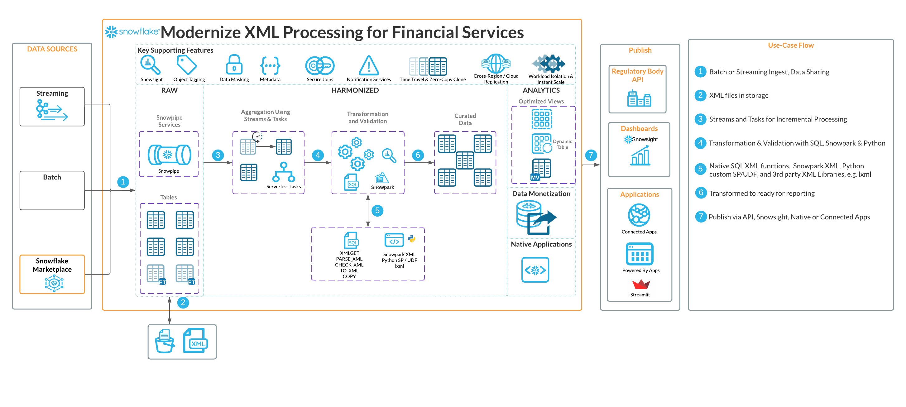
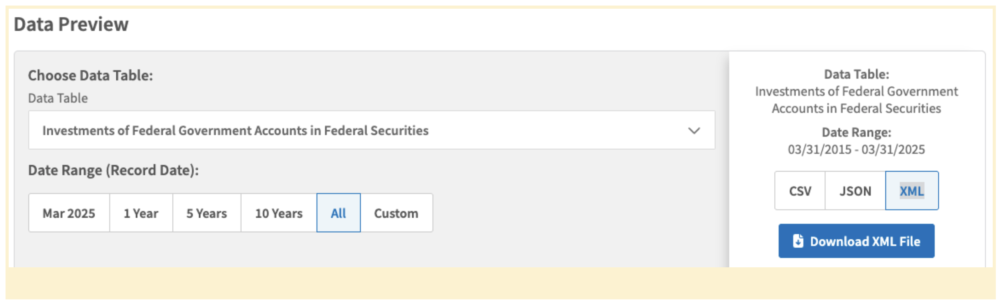
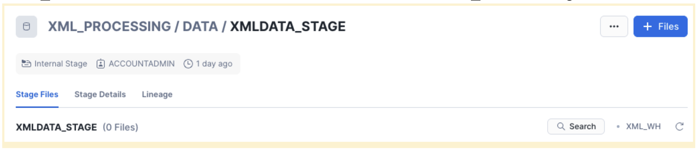
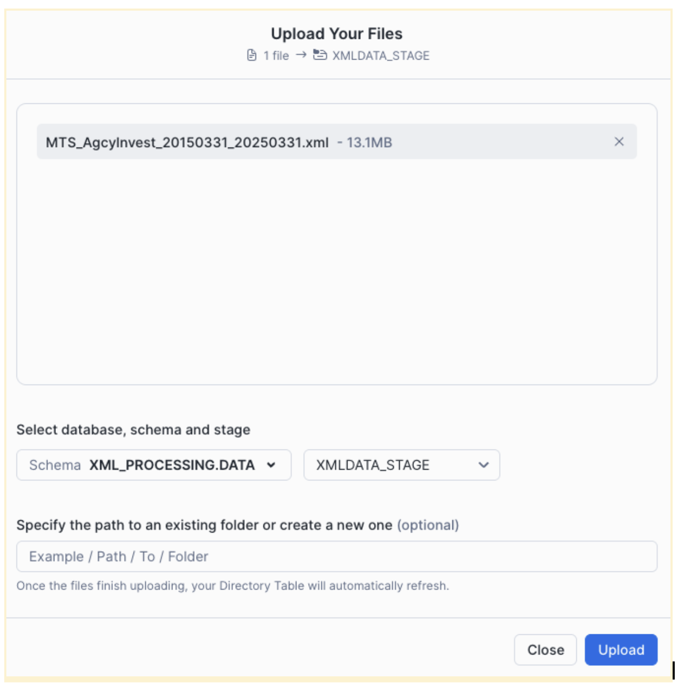
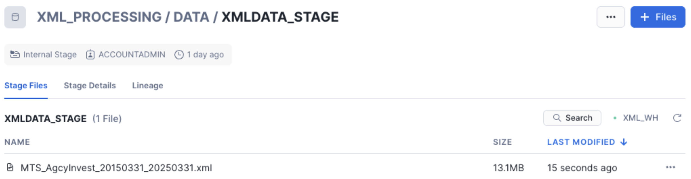
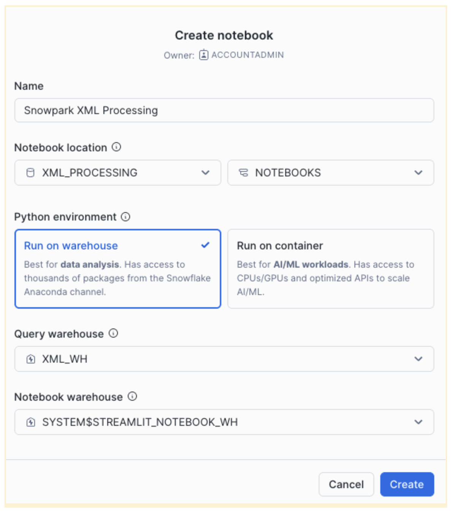

author: Constantin Stanca
id: xml-processing-snowpark
categories: snowflake-site:taxonomy/solution-center/certification/quickstart, snowflake-site:taxonomy/industry/financial-services, snowflake-site:taxonomy/product/platform
language: en
summary: Snowflake guide on how to process XML with Snowpark 
environments: web
status: Published 
feedback link: https://github.com/Snowflake-Labs/sfguides/issues


# Modernize XML Processing for Financial Services with Snowpark XML

<!-- ------------------------ -->
## Overview

This quickstart guides users through processing XML data using Snowflake’s Snowpark XML.

Snowflake [Notebooks](https://docs.snowflake.com/en/user-guide/ui-snowsight/notebooks) and a US Treasury dataset downloaded from [Investments of Federal Government Accounts in Federal Securities](https://fiscaldata.treasury.gov/datasets/monthly-treasury-statement/securities-issued-by-federal-agencies-under-special-financing-authorities) are used to demonstrate Snowpark XML capabilities. 

Snowpark XML enables scalable, Spark-like processing of XML files using Snowpark’s Python API and UDTF-based backend. 

Users can leverage Snowpark XML capabilities to:
- Efficiently ingest large or multiple XML files using `rowTag`.
- Output as structured rows in VARIANT, enabling easier querying.
- Use simple, Spark-compatible API (`session.read.option(...).xml(...)`).

### Prerequisites
- Access to a [Snowflake Account](https://signup.snowflake.com/?utm_source=snowflake-devrel&utm_medium=developer-guides&utm_cta=developer-guides)
- Privileges necessary to create a user, database, and virtual warehouse in Snowflake
- Intermediate knowledge of [Snowpark](https://docs.snowflake.com/en/developer-guide/snowpark/python/index) and Python
- Access to create and run [Notebooks](https://docs.snowflake.com/en/user-guide/ui-snowsight/notebooks)

### What You’ll Learn
- Efficiently ingest large or multiple XML files using `rowTag`.
- Output as structured rows in `VARIANT`, enabling easier querying.
- Use simple, Spark-compatible API (`session.read.option(...).xml(...)`).
- Create and run [Notebooks](https://docs.snowflake.com/en/user-guide/ui-snowsight/notebooks)

### What You’ll Need
- A Snowflake Account with ACCOUNTADMIN or a custom role with enough privileges

### What You’ll Build
- A Notebook for XML Data Processing with Snowpark XML on Snowflake

<!-- ------------------------ -->
## Architecture

This solution harnesses the power of Snowflake Snowpark XML to load, extract and render financial data in XML format.



Snowflake [Notebooks](https://docs.snowflake.com/en/user-guide/ui-snowsight/notebooks) serve as our interactive workspace. Through the skillful application of advanced Snowpark XML capabilities, we demonstrate how to process XML to support multiple use cases in financial services, including asset valuation, risk analysis, or regulatory reporting.

## Setup

### Database
Login to your Snowflake account. Navigate to [Worksheets](https://docs.snowflake.com/en/user-guide/ui-snowsight-worksheets-gs), click "+" in the top-right corner to create a new Worksheet and choose "SQL Worksheet". Name it "Snowpark XML Processing - Setup". 

Paste the following block to your worksheet.

```sql
USE ROLE ACCOUNTADMIN;

CREATE DATABASE IF NOT EXISTS XML_PROCESSING;

USE DATABASE XML_PROCESSING;

CREATE SCHEMA IF NOT EXISTS NOTEBOOKS;

CREATE WAREHOUSE IF NOT EXISTS XML_WH WAREHOUSE_SIZE=XSMALL INITIALLY_SUSPENDED=TRUE;

USE WAREHOUSE XML_WH;

CREATE FILE FORMAT IF NOT EXISTS my_xml_format
  TYPE = XML
  COMPRESSION = NONE;

CREATE STAGE IF NOT EXISTS XML_PROCESSING.DATA.XMLDATA_STAGE
  DIRECTORY = (ENABLE = TRUE)
  FILE_FORMAT = my_xml_format
  ENCRYPTION = (TYPE = 'SNOWFLAKE_SSE');
```
You will create Snowflake objects (database, schema, warehouse) executing the above SQL block from your worksheet. 

You can execute all at once " > Run All" or, one at the time, by selecting each statement and clicking on the "Run" button.

### Data
We are using the [Investments of Federal Government Accounts in Federal Securities](https://fiscaldata.treasury.gov/datasets/monthly-treasury-statement/securities-issued-by-federal-agencies-under-special-financing-authorities) dataset from the US Treasury.

To download it, scroll down to "Data Preview", set the following and click "Download XML file":
- Data Table = "Investments of Federal Government Accounts in Federal Securities"
- Date Range (Record Date) = "All" 
- Format type = "XML" 



A file "MTS_AgcyInvest_20150331_20250331.xml" (13.7MB) will be downloaded to your local "Downloads" folder.

Login to your Snowflake Account and from the left navigation menu select Data / Database "XML_PROCESSING" database, "DATA" schema and "XMLDATA_STAGE" stage



Click "+Files" in the top-right corner and "Browse" then select the downloaded file from your local /Downloads folder



Hit "Upload" and the file will be uploaded to the internal stage.


<!-- ------------------------ -->
## Snowpark XML Processing

Select "Projects" / "Notebooks" from the left navigation menu. Click "+ Notebook" from the top-right corner.

Complete the opened form:



Click "Create" and a default notebook with 3 cells will be created. Remove those three cells from the right corner of each cell by choosing "Delete". Repeat it for each cell.

Click "+ Markdown" and paste to the cell the following code block:

```python
# Loading XML Data from internal stage
Efficient ingestion of large or multiple XML files using rowTag.
```

Click "+ Python" and paste to the cell the following code block:

```python
from snowflake.snowpark.context import get_active_session
session = get_active_session()
```

Click "+ Python" and paste to the cell the following code block:

```python
stage_file_path = f'@XML_PROCESSING.DATA.XMLDATA_STAGE/MTS_AgcyInvest_20150331_20250331.xml'

df = session.read.option("rowTag", "row").xml(stage_file_path)
# df.show()
df.write.mode("overwrite").save_as_table("XML_PROCESSING.DATA.MTS_AgcyInvest")
# print(df.queries)
```

Click "+ SQL" and paste to the cell the following code block:

```SQL
SELECT COUNT(*) FROM XML_PROCESSING.DATA.MTS_AgcyInvest;
```

This returns the total number of rows loaded.

This quickstart is focused on how to load XML data.  Once loaded, XML data can be also processed with [Snowpark](https://docs.snowflake.com/en/developer-guide/snowpark/python/index) or SQL XML functions like [CHECK_XML](https://docs.snowflake.com/en/sql-reference/functions/check_xml), [PARSE_XML](https://docs.snowflake.com/en/sql-reference/functions/parse_xml), [XMLGET](https://docs.snowflake.com/en/sql-reference/functions/xmlget), [TO_XML](https://docs.snowflake.com/en/sql-reference/functions/to_xml). The output could be data ready for regulatory reporting.

Click "+ SQL" and paste to the cell the following code block:

```SQL
SELECT
  GET("'data-element'", 'record_calendar_month')::STRING AS record_calendar_month,
  GET("'data-element'", 'record_calendar_day')::STRING AS record_calendar_day,
  GET("'data-element'", 'begin_year_acct_bal_amt')::STRING AS begin_year_acct_bal_amt,
  GET("'data-element'", 'begin_month_acct_bal_amt')::STRING AS begin_month_acct_bal_amt,
  GET("'data-element'", 'close_month_acct_bal_amt')::STRING AS close_month_acct_bal_amt ,
  GET("'data-element'", 'current_month_net_txn_amt')::STRING AS current_month_net_txn_amt,
  GET("'data-element'", 'data_type_cd')::STRING AS data_type_cd,
  GET("'data-element'", 'fytd_net_txn_amt')::STRING AS fytd_net_txn_amt,
  GET("'data-element'", 'line_code_nbr')::STRING AS line_code_nbr,
  GET("'data-element'", 'parent_id')::STRING AS parent_id,
  GET("'data-element'", 'print_order_nbr')::STRING AS print_order_nbr,
  GET("'data-element'", 'prior_fytd_net_txn_amt')::STRING AS prior_fytd_net_txn_amt,
  GET("'data-element'", 'sequence_level_nbr')::STRING AS sequence_level_nbr,
  GET("'data-element'", 'sequence_number_cd')::STRING AS sequence_number_cd,
  GET("'data-element'", 'src_line_nbr')::STRING AS src_line_nbr,
  GET("'data-element'", 'table_nbr')::STRING AS table_nbr 
FROM XML_PROCESSING.DATA.MTS_AgcyInvest
WHERE GET("'data-element'", 'classification_desc') = 'Federal Housing Finance Agency' 
AND GET("'data-element'", 'record_calendar_year') = '2016'
ORDER BY GET("'data-element'", 'record_date') ASC;
```
You got a notebook!!! Before running the notebook, install the latest snowpark-python package.
In the top-right corner, click "Packages" and in "Find Packages" search window, type 
snowflake-snowpark-python" and choose "Latest".

You can run all cells using "Run all" from the top-right corner.
You can run cells, one by one, using "run this cell only" for each cell.

<!-- ------------------------ -->
## Conclusion And Resources

You did it! You have successfully completed the "Modernize XML Processing for Financial Services with Snowpark XML" quickstart  with notebooks and Snowpark XML.

### What you learned
- Load XML file to an internal stage via Snowflake UI
- Worksheet creation and execution for quickstart setup
- Notebook creation and execution for XML processing: 
    - Efficiently ingest large or multiple XML files using rowTag.
    - Output as structured rows in VARIANT, enabling easier querying.
    - Use simple, Spark-compatible API (`session.read.option(...).xml(...)`).

### Related Resources
- [About Snowflake Notebooks](https://docs.snowflake.com/en/user-guide/ui-snowsight/notebooks)
- [Snowpark Developer Guide for Python | Snowflake Documentation](https://docs.snowflake.com/en/developer-guide/snowpark/python/index)
