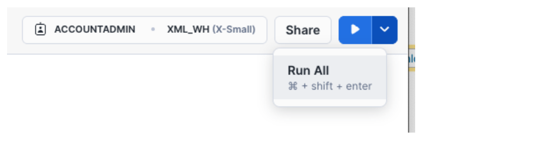

author: Constantin Stanca
id: xml-processing-sql
categories: snowflake-site:taxonomy/solution-center/certification/quickstart, snowflake-site:taxonomy/industry/financial-services, snowflake-site:taxonomy/product/platform
language: en
summary: Snowflake guide on how to process XML with SQL 
environments: web
status: Published 
feedback link: https://github.com/Snowflake-Labs/sfguides/issues


# Modernize XML Processing for Financial Services with SQL XML Functions

<!-- ------------------------ -->
## Overview

This quickstart guides users from financial services through processing XML data using Snowflake's SQL XML functions, specifically focusing on XML validation, parsing, element retrieval, and generation. It uses a trial XML dataset from the Snowflake Marketplace, "CMBS Schedule AL - XML", to demonstrate these techniques through SQL commands and Snowflake Notebooks. Users learn to leverage SQL XML functions like [CHECK_XML](https://docs.snowflake.com/en/sql-reference/functions/check_xml), [PARSE_XML](https://docs.snowflake.com/en/sql-reference/functions/parse_xml), [XMLGET](https://docs.snowflake.com/en/sql-reference/functions/xmlget), [TO_XML](https://docs.snowflake.com/en/sql-reference/functions/to_xml) to transform XML data for applications such as asset valuation, risk analysis, and regulatory reporting within the Snowflake environment.

### Prerequisites
- Access to a [Snowflake Account](https://signup.snowflake.com/?utm_source=snowflake-devrel&utm_medium=developer-guides&utm_cta=developer-guides)
- Privileges necessary to create a user, database, and virtual warehouse in Snowflake
- Intermediate knowledge of SQL
- Access to create and run [Notebooks](https://docs.snowflake.com/en/user-guide/ui-snowsight/notebooks)

### What You’ll Learn
- Leveraging powerful SQL XML functions such as [CHECK_XML](https://docs.snowflake.com/en/sql-reference/functions/check_xml), [PARSE_XML](https://docs.snowflake.com/en/sql-reference/functions/parse_xml), [XMLGET](https://docs.snowflake.com/en/sql-reference/functions/xmlget), [TO_XML](https://docs.snowflake.com/en/sql-reference/functions/to_xml)
- Transforming data using [Notebooks](https://docs.snowflake.com/en/user-guide/ui-snowsight/notebooks)
- Accessing select Edgar filing data from [Snowflake Marketplace](https://app.snowflake.com/marketplace)

### What You’ll Need 
- A Snowflake Account with ACCOUNTADMIN or a custom role with enough privileges

### What You’ll Build 
- A Notebook for XML Data Processing with SQL XML functions on Snowflake

<!-- ------------------------ -->
## Architecture

This solution harnesses the power of Snowflake SQL XML functions to validate, parse, extract and render financial data in XML format.


[Notebooks](https://docs.snowflake.com/en/user-guide/ui-snowsight/notebooks) serve as our interactive workspace. Through the skillful application of advanced SQL XML functions like [CHECK_XML](https://docs.snowflake.com/en/sql-reference/functions/check_xml), [PARSE_XML](https://docs.snowflake.com/en/sql-reference/functions/parse_xml), [XMLGET](https://docs.snowflake.com/en/sql-reference/functions/xmlget), [TO_XML](https://docs.snowflake.com/en/sql-reference/functions/to_xml), we demonstrate how to validate, parse, extract, transform and output XML to support multiple use cases in financial services, including asset valuation, risk analysis, or regulatory reporting.

## Setup

### Data
We are using free trial XML data from Snowflake Marketplace: "CMBS Schedule AL - XML". 

The paid dataset contains Schedule AL data from Edgar Form ABS-EE filings for 230+ CMBS deals across 9,500+ filings (monthly) and it is updated daily to capture all future ABS-EE filings as they are published in Edgar. This data, specifically Schedule AL remits, is intended for use in asset valuation and risk analysis. Investors use it to monitor changes in collateral valuations for CMBS bonds, while investors and loan originators use it to benchmark loan metrics like interest rates and debt yields.
The schema includes Edgar identifiers and timestamps along with the XML filed for each submission: CIK, COMPANY_NAME, FILING_ID, FILING_DATE, CREATED_AT, FORM_SUBMISSION_ID, HEADER_JSON, SRC_XML.

Find the dataset in the Snowflake Marketplace (left navigationan menu) using "Search" and typing: "CMBS Schedule AL - XML". It will come-up as "Free to Try".


Click on "CMBS_SCHEDULE_AI_XML" dataset link and "Start Trial".


> Keep the shared database name as CMBS_Schedule_AL__XML.

### Database
Login to your Snowflake account. Navigate to [Worksheets](https://docs.snowflake.com/en/user-guide/ui-snowsight-worksheets-gs), click "+" in the top-right corner to create a new Worksheet and choose "SQL Worksheet". Name it "SQL XML Processing Setup". 

Paste the following block to your worksheet.

```sql
USE ROLE ACCOUNTADMIN;

CREATE DATABASE IF NOT EXISTS XML_PROCESSING;

USE DATABASE XML_PROCESSING;

CREATE SCHEMA IF NOT EXISTS NOTEBOOKS;

CREATE WAREHOUSE IF NOT EXISTS XML_WH WAREHOUSE_SIZE=XSMALL INITIALLY_SUSPENDED=TRUE;

USE WAREHOUSE XML_WH;

CREATE FILE FORMAT IF NOT EXISTS my_xml_format
  TYPE = XML
  COMPRESSION = NONE;

CREATE STAGE IF NOT EXISTS XML_PROCESSING.DATA.XMLDATA_STAGE
  DIRECTORY = (ENABLE = TRUE)
  FILE_FORMAT = my_xml_format
  ENCRYPTION = (TYPE = 'SNOWFLAKE_SSE');
```
You will create Snowflake objects (database, schema, warehouse) executing the above SQL block from your worksheet. 

You can execute all at once " > Run All" or, one at the time, by selecting each statement and clicking on the "Run" button.

You will create Snowflake objects (database, schema, warehouse) executing the above SQL block from your worksheet. 

You can execute all at once 

or, one at the time, by selecting each statement and clicking on the "Run" button.

<!-- ------------------------ -->
## SQL XML Processing

You will learn how to create a notebook and to leverage powerful SQL XML functions such as [CHECK_XML](https://docs.snowflake.com/en/sql-reference/functions/check_xml), [PARSE_XML](https://docs.snowflake.com/en/sql-reference/functions/parse_xml), [XMLGET](https://docs.snowflake.com/en/sql-reference/functions/xmlget), [TO_XML](https://docs.snowflake.com/en/sql-reference/functions/to_xml) to process XML data to support multiple use cases in financial services, including asset valuation, risk analysis, or regulatory reporting, using "CMBS Schedule AL - XML" trial data from Snowflake Marketplace.

Select "Projects" / "Notebooks" from the left navigation menu. Click "+ Notebook" from the top-right corner.

Complete the opened form:


Click "Create" and a default notebook with 3 cells will be created. Remove those three cells from the right corner of each cell by choosing "Delete". Repeat it for each cell.

Click "+ Markdown" and paste the following:

```markdown
#Processing XML with SQL
Leverage SQL XML functions like CHECK_XML, PARSE_XML, XMLGET, and TO_XML to transform XML data for applications
```

Click "+ Markdown" and paste the following code:
```markdown
#Validate XML Data
CHECK_XML checks whether a given string is well-formed XML.
```

Click "+ SQL" and paste the following code:
```sql
SELECT DISTINCT CHECK_XML(SRC_XML)
FROM CMBS_SCHEDULE_AL__XML.MARKETPLACE.EDGAR_PAID_CMBS_ABSEE_XML 
WHERE COMPANY_NAME='COMM 2019-GC44 Mortgage Trust';
// the output of the function when the XML is valid is null
// used DISTINCT just to limit the output
```

Click "+ Markdown" and paste the following code:
```markdown
#Parsing XML Data
PARSE_XML converts raw XML text into Snowflake’s semi-structured format for storing and querying.
```

Click "+ SQL" and paste the following code:
```sql
SELECT 
   PARSE_XML(TO_VARCHAR(SRC_XML)), 
   CIK, 
   COMPANY_NAME, 
   FILING_ID, 
   FILING_DATE 
FROM CMBS_SCHEDULE_AL__XML.MARKETPLACE.EDGAR_PAID_CMBS_ABSEE_XML 
WHERE COMPANY_NAME='COMM 2019-GC44 Mortgage Trust';
```

Click "+ Markdown" and paste the following code:
```markdown
#Extracting XML Data Elements
The XMLGET extracts specific XML elements from the parsed XML.
```

Click "+ SQL" and paste the following code:
```sql
SELECT
   CIK::string AS cik,
   COMPANY_NAME::string AS company_name,
   FILING_ID::string AS filing_id,
   FILING_DATE::date AS filing_date,
   CREATED_AT::date AS created_at,
   FORM_SUBMISSION_ID::varchar(20) AS form_submission_id,
   XMLGET(xml_doc.value, 'assetTypeNumber'):"$"::string AS assetTypeNumber,
   XMLGET(xml_doc.value, 'assetNumber'):"$"::string AS assetNumber,
   DATE(XMLGET(xml_doc.value, 'reportingPeriodBeginningDate'):"$", 'MM-DD-YYYY') AS reportingPeriodBeginningDate,
   DATE(XMLGET(xml_doc.value, 'reportingPeriodEndDate'):"$", 'MM-DD-YYYY') AS reportingPeriodEndDate,
   XMLGET(properties.value, 'propertyName'):"$"::string AS propertyName,
   XMLGET(properties.value, 'propertyAddress'):"$"::string AS propertyAddress,
   XMLGET(properties.value, 'propertyCity'):"$"::string AS propertyCity,
   XMLGET(properties.value, 'propertyState'):"$"::string AS propertyState,
   XMLGET(properties.value, 'propertyZip'):"$"::string AS propertyZip,
   XMLGET(properties.value, 'propertyCounty'):"$"::string AS propertyCounty,
   XMLGET(properties.value, 'propertyTypeCode'):"$"::string AS propertyTypeCode
FROM
   CMBS_SCHEDULE_AL__XML.MARKETPLACE.EDGAR_PAID_CMBS_ABSEE_XML,
   LATERAL FLATTEN(GET(CMBS_SCHEDULE_AL__XML.MARKETPLACE.EDGAR_PAID_CMBS_ABSEE_XML.SRC_XML, '$')) xml_doc,
   LATERAL FLATTEN(to_array(xml_doc.VALUE:"$" )) properties
WHERE
   GET(properties.value, '@') = 'property'
     AND XMLGET(properties.value, 'propertyAddress'):"$"::string IS NOT NULL
     AND COMPANY_NAME='COMM 2019-GC44 Mortgage Trust'
     AND FILING_DATE='2020-07-01';
```

Click "+ Markdown" and paste the following code:
```markdown
#Generate XML
TO_XML allows serializing XML objects into XML text.
```

Click "+ SQL" and paste the following code:
```sql
SELECT
   TO_XML(OBJECT_CONSTRUCT('CIK', CIK, 'COMPANY_NAME', COMPANY_NAME, 'ASSET_TYPE_NUMBER', XMLGET(xml_doc.value, 'assetTypeNumber'):"$"::string))
FROM
   CMBS_SCHEDULE_AL__XML.MARKETPLACE.EDGAR_PAID_CMBS_ABSEE_XML,
   LATERAL FLATTEN(GET("MARKETPLACE"."EDGAR_PAID_CMBS_ABSEE_XML".SRC_XML, '$')) xml_doc,
   LATERAL FLATTEN(to_array(xml_doc.VALUE:"$" )) properties
WHERE
   GET(properties.value, '@') = 'property'
     AND XMLGET(properties.value, 'propertyAddress'):"$"::string IS NOT NULL
     AND COMPANY_NAME='COMM 2019-GC44 Mortgage Trust'
     AND FILING_DATE='2020-07-01';
```

You got a notebook!!!

You can run all cells using "Run all" from the top-right corner.
You can run cells, one by one, using "run this cell only" for each cell.

<!-- ------------------------ -->
## Conclusion And Resources

You did it! You have successfully completed the "Modernize XML Processing for Financial Services with SQL XML Functions"  quickstart  with notebooks and SQL XML functions.

### What you learned
- Leverage SQL XML functions such as [CHECK_XML](https://docs.snowflake.com/en/sql-reference/functions/check_xml), [PARSE_XML](https://docs.snowflake.com/en/sql-reference/functions/parse_xml), [XMLGET](https://docs.snowflake.com/en/sql-reference/functions/xmlget), [TO_XML](https://docs.snowflake.com/en/sql-reference/functions/to_xml)
- Perform data engineering tasks using [Notebooks](https://docs.snowflake.com/en/user-guide/ui-snowsight/notebooks)
- Access data from [Snowflake Marketplace](https://app.snowflake.com/marketplace)

### Related Resources
- [TO_XML](https://docs.snowflake.com/en/sql-reference/functions/to_xml): Serialize VARIANT objects back to XML strings
- [XMLGET](https://docs.snowflake.com/en/sql-reference/functions/xmlget): Extract specific XML elements by tags
- [PARSE_XML](https://docs.snowflake.com/en/sql-reference/functions/parse_xml): Convert XML strings to structured VARIANT objects
- [CHECK_XML](https://docs.snowflake.com/en/sql-reference/functions/check_xml): Validate XML document structure
- [Loading XML Data with COPY](https://docs.snowflake.com/en/sql-reference/sql/copy-into-table#type-xml): Use the COPY command
- [Loading and Parsing XML Data Using SQL](https://community.snowflake.com/s/article/introduction-to-loading-and-parsing-xml-data-using-sql)
