author: Cameron Shimmin, Dureti Shemsi
id: zero-to-snowflake
categories: snowflake-site:taxonomy/solution-center/certification/quickstart, snowflake-site:taxonomy/product/platform, snowflake-site:taxonomy/snowflake-feature/ingestion, snowflake-site:taxonomy/snowflake-feature/transformation, snowflake-site:taxonomy/snowflake-feature/dynamic-tables
language: en
summary: Zero to Snowflake 
environments: web
status: Published
feedback link: https://github.com/Snowflake-Labs/sfguides/issues

# Zero to Snowflake

## Overview


### Overview

Welcome to the Zero to Snowflake Quickstart! This guide is a consolidated journey through key areas of the Snowflake AI Data Cloud. You will start with the fundamentals of warehousing and data transformation, build an automated data pipeline, then see how you can experiment with LLMs using the Cortex Playground to compare different models for summarizing text, use AISQL Functions to instantly analyze customer review sentiment with a simple SQL command, and harness Cortex Search for intelligent text discovery, and utilize Cortex Analyst for conversational business intelligence. Finally, you will learn to secure your data with powerful governance controls and enrich your analysis through seamless data collaboration.

We'll apply these concepts using a sample dataset from our fictitious food truck, Tasty Bytes, to improve and streamline their data operations. We'll explore this dataset through several workload-specific scenarios, demonstrating the benefits Snowflake provides to businesses.

### Who is Tasty Bytes?


Our mission is to provide unique, high-quality food options in a convenient and cost-effective manner, emphasizing the use of fresh ingredients from local vendors. Their vision is to become the largest food truck network in the world with a zero carbon footprint.

### Prerequisites

 - A Supported Snowflake [Browser](https://docs.snowflake.com/en/user-guide/setup?_fsi=6tNBra0z&_fsi=6tNBra0z#browser-requirements)
 - An Enterprise or Business Critical Snowflake Account
 - If you do not have a Snowflake Account, please [sign up for a Free 30 Day Trial Account](https://signup.snowflake.com/?utm_source=snowflake-devrel&utm_medium=developer-guides&utm_cta=developer-guides&_fsi=6tNBra0z&_fsi=6tNBra0z). When signing up, please make sure to select  Enterprise edition. You are welcome to choose any [Snowflake Cloud/Region](https://docs.snowflake.com/en/user-guide/intro-regions?_fsi=6tNBra0z&_fsi=6tNBra0z).
 - After registering, you will receive an email with an activation link and your Snowflake Account URL.

### What You Will Learn

  - **Vignette 1: Getting Started with Snowflake:** The fundamentals of Snowflake warehouses, caching, cloning, and Time Travel.
  - **Vignette 2: Simple Data Pipelines:** How to ingest and transform semi-structured data using Dynamic Tables.
  - **Vignette 3: Snowflake Cortex AI:** How to leverage Snowflake's comprehensive AI capabilities for experimentation, scalable analysis, AI-assisted development, and conversational business intelligence.
  - **Vignette 4: Governance with Horizon:** How to protect your data with roles, classification, masking, and row-access policies.
  - **Vignette 5: Apps & Collaboration:** How to leverage the Snowflake Marketplace to enrich your internal data with third-party datasets.

### What You Will Build

  - A comprehensive understanding of the core Snowflake platform.
  - Configured Virtual Warehouses.
  - An automated ELT pipeline with Dynamic Tables.
  - A complete intelligence customer analytics platform leveraging Snowflake AI.
  - A robust data governance framework with roles and policies.
  - Enriched analytical views combining first- and third-party data.

## Setup

### **Overview**

In this guide, we will use <a href="https://app.snowflake.com/_deeplink/#/workspaces?utm_source=snowflake-devrel&utm_medium=developer-guides&utm_content=zero-to-snowflake&utm_cta=developer-guides-deeplink" class="_deeplink">Snowflake Workspaces</a> to organize, edit, and run all the SQL scripts required for this course. We will create a dedicated SQL file for the setup and each vignette. This will keep our code organized and easy to manage.

Let's walk through how to create your first SQL file, add the necessary setup code, and run it.

### **Step 1 - Create Your Setup SQL File**

First, we need a place to put our setup script.

1. **Navigate to <a href="https://app.snowflake.com/_deeplink/#/workspaces?utm_source=snowflake-devrel&utm_medium=developer-guides&utm_content=zero-to-snowflake&utm_cta=developer-guides-deeplink" class="_deeplink">Workspaces</a>:** In the left-hand navigation menu of the Snowflake UI, click on **Projects** » **<a href="https://app.snowflake.com/_deeplink/#/workspaces?utm_source=snowflake-devrel&utm_medium=developer-guides&utm_content=zero-to-snowflake-deeplink" class="_deeplink">Workspaces</a>**. This is the central hub for all your SQL files.  
2. **Create a New SQL File:** Find and click the **+ Add New** button in the top-left corner of the <a href="https://app.snowflake.com/_deeplink/#/workspaces?utm_source=snowflake-devrel&utm_medium=developer-guides&utm_content=zero-to-snowflake&utm_cta=developer-guides-deeplink" class="_deeplink">Workspaces</a> area, then select **SQL File**. This will generate a new, blank SQL file.  
3. **Rename the SQL File:** Your new SQL file will have a name based on the timestamp it was created. Give it a descriptive name like **Zero To Snowflake - Setup**.

### **Step 2 - Add and Run the Setup Script**

Now that you have your SQL file, it's time to add the setup SQL and execute it.

1. **Copy the SQL Code:** Click the link for the **[setup file](https://github.com/Snowflake-Labs/sfguide-getting-started-from-zero-to-snowflake/blob/main/scripts/setup.sql)** and copy it to your clipboard.  
2. **Paste into your SQL File:** Return to your Zero To Snowflake Setup SQL file in Snowflake and paste the entire script into the editor.  
3. **Run the Script:** To execute all the commands in the SQL file sequentially, click the **"Run All"** button located at the top-left of the editor. This will perform all the necessary setup actions, such as creating roles, schemas, and warehouses that you will need for the upcoming vignettes.


### **Looking Ahead**

The process you just completed for creating a new SQL file is the exact same workflow you will use for every subsequent vignette in this course.

For each new vignette, you will:

1. Create a **new** SQL file.  
2. Give it a descriptive name (e.g., Vignette 1 - Getting Started with Snowflake).  
3. Copy and paste the SQL script for that specific vignette.
4. Each SQL file has all of the necessary instructions and commands to follow along.

<!-- end list -->

## Get Started with Snowflake


### Overview

Within this Vignette, we will learn about core Snowflake concepts by exploring Virtual Warehouses, using the query results cache, performing basic data transformations, leveraging data recovery with Time Travel, and monitoring our account with Resource Monitors and Budgets.

### What You Will Learn
- How to create, configure, and scale a Virtual Warehouse.
- How to leverage the Query Result Cache.
- How to use Zero-Copy Cloning for development.
- How to transform and clean data.
- How to instantly recover a dropped table using UNDROP.
- How to create and apply a Resource Monitor.
- How to create a Budget to monitor costs.
- How to use Universal Search to find objects and information.

### What You Will Build
- A Snowflake Virtual Warehouse
- A development copy of a table using Zero-Copy Clone
- A Resource Monitor
- A Budget

### Get the SQL code and paste it into your SQL File.

**Copy and paste the SQL code from this [file](https://github.com/Snowflake-Labs/sfguide-getting-started-from-zero-to-snowflake/blob/main/scripts/vignette-1.sql) in a new SQL File to follow along in Snowflake. Note that once you've reached the end of the SQL File you can skip to Step 10 - Simple Data Pipeline**

### Virtual Warehouses and Settings


#### Overview

Virtual Warehouses are the dynamic, scalable, and cost-effective computing power that lets you perform analysis on your Snowflake data. Their purpose is to handle all your data processing needs without you having to worry about the underlying technical details.

#### Step 1 - Setting Context

First, lets set our session context. To run the queries, highlight the three queries at the top of your SQL file and click the "► Run" button.

```sql
ALTER SESSION SET query_tag = '{"origin":"sf_sit-is","name":"tb_zts,"version":{"major":1, "minor":1},"attributes":{"is_quickstart":1, "source":"tastybytes", "vignette": "getting_started_with_snowflake"}}';

USE DATABASE tb_101;
USE ROLE accountadmin;
```

#### Step 2 - Creating a Warehouse

Let's create our first warehouse! This command creates a new X-Small warehouse that will initially be suspended.

```sql
CREATE OR REPLACE WAREHOUSE my_wh
    COMMENT = 'My TastyBytes warehouse'
    WAREHOUSE_TYPE = 'standard'
    WAREHOUSE_SIZE = 'xsmall'
    MIN_CLUSTER_COUNT = 1
    MAX_CLUSTER_COUNT = 2
    SCALING_POLICY = 'standard'
    AUTO_SUSPEND = 60
    INITIALLY_SUSPENDED = true
    AUTO_RESUME = false;
```

> **Virtual Warehouses**: A virtual warehouse, often referred to simply as a “warehouse”, is a cluster of compute resources in Snowflake. Warehouses are required for queries, DML operations, and data loading. For more information, see the [Warehouse Overview](https://docs.snowflake.com/en/user-guide/warehouses-overview).

#### Step 3 - Using and Resuming a Warehouse

Now that we have a warehouse, we must set it as the active warehouse for our session. Execute the next statement.

```sql
USE WAREHOUSE my_wh;
```

If you try to run the query below, it will fail, because the warehouse is suspended and does not have `AUTO_RESUME` enabled. 
```sql
SELECT * FROM raw_pos.truck_details;
```

Let's resume it and set it to auto-resume in the future.
```sql
ALTER WAREHOUSE my_wh RESUME;
ALTER WAREHOUSE my_wh SET AUTO_RESUME = TRUE;
```

Now, try the query again. It should execute successfully.

```sql
SELECT * FROM raw_pos.truck_details;
```

#### Step 4 - Scaling a Warehouse

Warehouses in Snowflake are designed for elasticity. We can scale our warehouse up on the fly to handle a more intensive workload. Let's scale our warehouse to an X-Large.

```sql
ALTER WAREHOUSE my_wh SET warehouse_size = 'XLarge';
```

With our larger warehouse, let's run a query to calculate total sales per truck brand.

```sql
SELECT
    o.truck_brand_name,
    COUNT(DISTINCT o.order_id) AS order_count,
    SUM(o.price) AS total_sales
FROM analytics.orders_v o
GROUP BY o.truck_brand_name
ORDER BY total_sales DESC;
```

### Query Result Cache


#### Overview

This is a great place to demonstrate another powerful feature in Snowflake: the Query Result Cache. When you first ran the 'sales per truck' query, it likely took several seconds. If you run the exact same query again, the result will be nearly instantaneous. This is because the query results were cached in Snowflake's Query Result Cache.

#### Step 1 - Re-running a Query

Run the same 'sales per truck' query from the previous step. Note the execution time in the query details pane. It should be much faster.

```sql
SELECT
    o.truck_brand_name,
    COUNT(DISTINCT o.order_id) AS order_count,
    SUM(o.price) AS total_sales
FROM analytics.orders_v o
GROUP BY o.truck_brand_name
ORDER BY total_sales DESC;
```
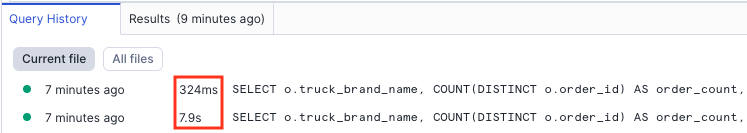

> **Query Result Cache**: Results are retained for any query for 24 hours. Hitting the result cache requires almost no compute resources, making it ideal for frequently run reports or dashboards. The cache resides in the Cloud Services Layer, making it globally accessible to all users and warehouses in the account. For more information, please visit the [documentation on using persisted query results](https://docs.snowflake.com/en/user-guide/querying-persisted-results).

#### Step 2 - Scaling Down

We will now be working with smaller datasets, so we can scale our warehouse back down to an X-Small to conserve credits.

```sql
ALTER WAREHOUSE my_wh SET warehouse_size = 'XSmall';
```

### Basic Transformation Techniques


#### Overview

In this section, we will see some basic transformation techniques to clean our data and use Zero-Copy Cloning to create development environments. Our goal is to analyze the manufacturers of our food trucks, but this data is currently nested inside a `VARIANT` column.

#### Step 1 - Creating a Development Table with Zero-Copy Clone

First, let's take a look at the `truck_build` column. 
```sql
SELECT truck_build FROM raw_pos.truck_details;
```
This table contains data about the make, model and year of each truck, but it is nested, or embedded in a special data type called a VARIANT. We can perform operations on this column to extract these values, but first we'll create a development copy of the table.

Let's create a development copy of our `truck_details` table. Snowflake's Zero-Copy Cloning lets us create an identical, fully independent copy of the table instantly, without using additional storage.

```sql
CREATE OR REPLACE TABLE raw_pos.truck_dev CLONE raw_pos.truck_details;
```

> **[Zero-Copy Cloning](https://docs.snowflake.com/en/user-guide/object-clone)**: Cloning creates a copy of a database object without duplicating the storage. Changes made to either the original or the clone are stored as new micro-partitions, leaving the other object untouched.

#### Step 2 - Adding New Columns and Transforming Data

Now that we have a safe development table, let's add columns for `year`, `make`, and `model`. Then, we will extract the data from the `truck_build` `VARIANT` column and populate our new columns.

```sql
-- Add new columns
ALTER TABLE raw_pos.truck_dev ADD COLUMN IF NOT EXISTS year NUMBER;
ALTER TABLE raw_pos.truck_dev ADD COLUMN IF NOT EXISTS make VARCHAR(255);
ALTER TABLE raw_pos.truck_dev ADD COLUMN IF NOT EXISTS model VARCHAR(255);

-- Extract and update data
UPDATE raw_pos.truck_dev
SET 
    year = truck_build:year::NUMBER,
    make = truck_build:make::VARCHAR,
    model = truck_build:model::VARCHAR;
```

#### Step 3 - Cleaning the Data

Let's run a query to see the distribution of truck makes.

```sql
SELECT 
    make,
    COUNT(*) AS count
FROM raw_pos.truck_dev
GROUP BY make
ORDER BY make ASC;
```

Did you notice anything odd about the results from the last query? We can see a data quality issue: 'Ford' and 'Ford_' are being treated as separate manufacturers. Let's easily fix this with a simple `UPDATE` statement.

```sql
UPDATE raw_pos.truck_dev
    SET make = 'Ford'
    WHERE make = 'Ford_';
```
Here we're saying we want to set the row's make value to `Ford` wherever it is `Ford_`. This will ensure none of the Ford makes have the underscore, giving us a unified make count.

#### Step 4 - Promoting to Production with SWAP

Our development table is now cleaned and correctly formatted. We can instantly promote it to be the new production table using the `SWAP WITH` command. This atomically swaps the two tables.

```sql
ALTER TABLE raw_pos.truck_details SWAP WITH raw_pos.truck_dev;
```

#### Step 5 - Cleanup

Now that the swap is complete, we can drop the unnecessary `truck_build` column from our new production table. We also need to drop the old production table, which is now named `truck_dev`. But for the sake of the next lesson, we will "accidentally" drop the main table.

```sql
ALTER TABLE raw_pos.truck_details DROP COLUMN truck_build;

-- Accidentally drop the production table!
DROP TABLE raw_pos.truck_details;
```

#### Step 6 - Data Recovery with UNDROP

Oh no! We accidentally dropped the production `truck_details` table. Luckily, Snowflake's Time Travel feature allows us to recover it instantly. The `UNDROP` command restores dropped objects.

#### Step 7 - Verify the Drop

If you run a `DESCRIBE` command on the table, you will get an error stating it does not exist.

```sql
DESCRIBE TABLE raw_pos.truck_details;
```

#### Step 8 - Restore the Table with UNDROP

Let's restore the `truck_details` table to the exact state it was in before being dropped.

```sql
UNDROP TABLE raw_pos.truck_details;
```

> **[Time Travel & UNDROP](https://docs.snowflake.com/en/user-guide/data-time-travel)**: Snowflake Time Travel enables accessing historical data at any point within a defined period. This allows for restoring data that has been modified or deleted. `UNDROP` is a feature of Time Travel that makes recovery from accidental drops trivial.

#### Step 9 - Verify Restoration and Clean Up

Verify the table was successfully restored by selecting from it. Then, we can safely drop the actual development table, `truck_dev`.

```sql
-- Verify the table was restored
SELECT * from raw_pos.truck_details;

-- Now drop the real truck_dev table
DROP TABLE raw_pos.truck_dev;
```

### Resource Monitors


#### Overview

Monitoring compute usage is critical. Snowflake provides Resource Monitors to track warehouse credit usage. You can define credit quotas and trigger actions (like notifications or suspension) when thresholds are reached.

#### Step 1 - Creating a Resource Monitor

Let's create a resource monitor for `my_wh`. This monitor has a monthly quota of 100 credits and will send notifications at 75% and suspend the warehouse at 90% and 100% of the quota. First, ensure your role is `accountadmin`.

```sql
USE ROLE accountadmin;

CREATE OR REPLACE RESOURCE MONITOR my_resource_monitor
    WITH CREDIT_QUOTA = 100
    FREQUENCY = MONTHLY
    START_TIMESTAMP = IMMEDIATELY
    TRIGGERS ON 75 PERCENT DO NOTIFY
             ON 90 PERCENT DO SUSPEND
             ON 100 PERCENT DO SUSPEND_IMMEDIATE;
```

<!--  -->

#### Step 2 - Applying the Resource Monitor

With the monitor created, apply it to `my_wh`.

```sql
ALTER WAREHOUSE my_wh 
    SET RESOURCE_MONITOR = my_resource_monitor;
```

> For more information on what each configuration handles, please visit the documentation for [Working with Resource Monitors](https://docs.snowflake.com/en/user-guide/resource-monitors).

### Create a Budget


#### Overview

While Resource Monitors track warehouse usage, Budgets provide a more flexible approach to managing all Snowflake costs. Budgets can track spend on any Snowflake object and notify users when a dollar amount threshold is reached.

#### Step 1 - Creating a Budget via SQL

Let's first create the budget object in SQL.

```sql
CREATE OR REPLACE SNOWFLAKE.CORE.BUDGET my_budget()
    COMMENT = 'My Tasty Bytes Budget';
```

#### Step 2 - Budget Page in Snowsight
Let's take a look at the Budget Page on Snowsight.

Navigate to **Admin** » **Cost Management** » **Budgets**.

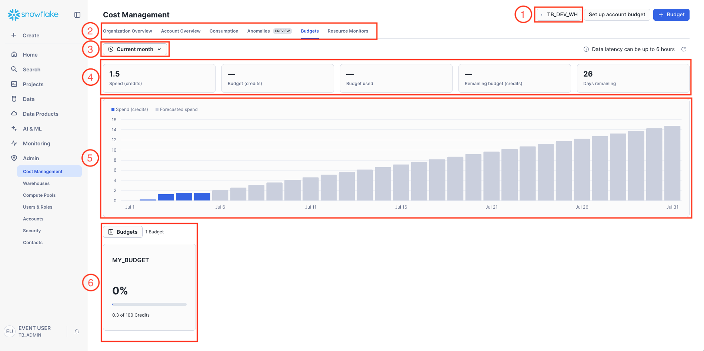

**Key:**
1. Warehouse Context
2. Cost Management Navigation
3. Time Period Filter
4. Key Metrics Summary
5. Spend and Forecast Trend Chart
6. Budget Details

#### Step 3 - Configuring the Budget in Snowsight

Configuring a budget is done through the Snowsight UI.

1.  Make sure your account role is set to `ACCOUNTADMIN`. You can change this in the bottom left corner.
2.  Click on the **MY_BUDGET** budget we created.
3.  Click **Budget Details** to open the Budget details panel, then click **Edit** in the Budget Details panel on the right.
4.  Set the **Spending Limit** to `100`.
5.  Enter a verified notification email address.
6.  Click **+ Tags & Resources** and add the **TB_101.ANALYTICS** schema and the **TB_DE_WH** warehouse to be monitored.
7.  Click **Save Changes**.
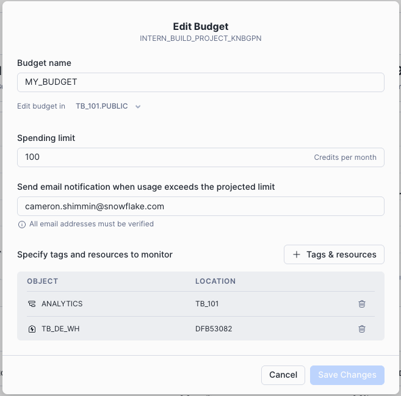

> For a detailed guide on Budgets, please see the [Snowflake Budgets Documentation](https://docs.snowflake.com/en/user-guide/budgets).

### Universal Search


#### Overview

Universal Search allows you to easily find any object in your account, plus explore data products in the Marketplace, relevant Snowflake Documentation, and Community Knowledge Base articles.

#### Step 1 - Searching for an Object

Let's try it now.

1.  Click **Search** in the Navigation Menu on the left.
2.  Enter `truck` into the search bar.
3.  Observe the results. You will see categories of objects on your account, such as tables and views, as well as relevant documentation.

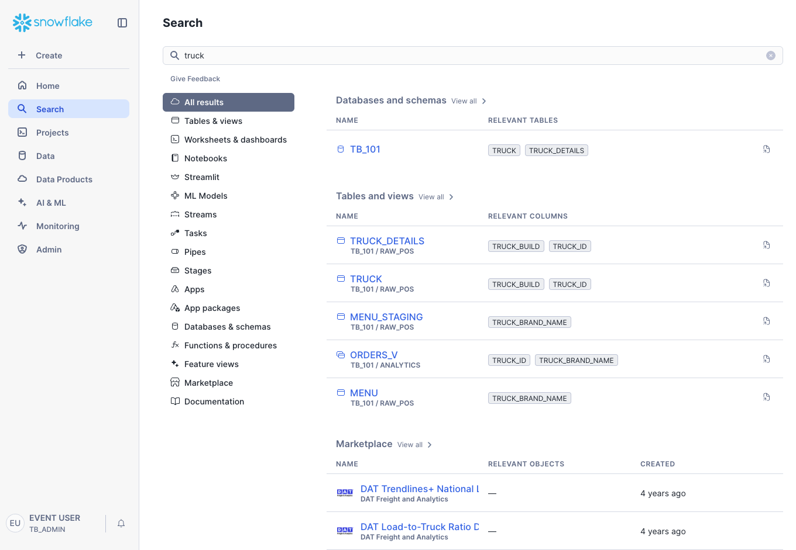

#### Step 2 - Using Natural Language Search

You can also use natural language. For example, search for: `Which truck franchise has the most loyal customer base?`
Universal search will return relevant tables and views, even highlighting columns that might help answer your question, providing an excellent starting point for analysis.

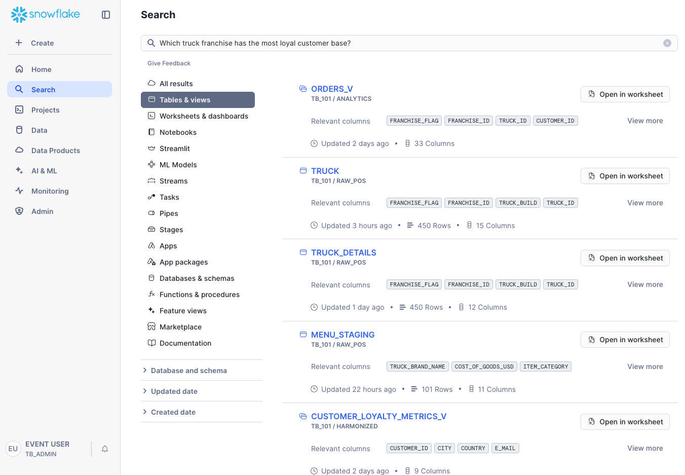

## Simple Data Pipeline


### Overview

Within this vignette, we will learn how to build a simple, automated data pipeline in Snowflake. We will start by ingesting raw, semi-structured data from an external stage, and then use the power of Snowflake's Dynamic Tables to transform and enrich that data, creating a pipeline that automatically stays up-to-date as new data arrives.

### What You Will Learn
- How to ingest data from an external S3 stage.
- How to query and transform semi-structured VARIANT data.
- How to use the FLATTEN function to parse arrays.
- How to create and chain Dynamic Tables.
- How an ELT pipeline automatically processes new data.
- How to visualize a pipeline using the Directed Acyclic Graph (DAG).

### What You Will Build
- An external Stage for data ingestion.
- A staging table for raw data.
- A multi-step data pipeline using three chained Dynamic Tables.

### Get the SQL and paste it into your SQL File.

**Copy and paste the SQL from this [file](https://github.com/Snowflake-Labs/sfguide-getting-started-from-zero-to-snowflake/blob/main/scripts/vignette-2.sql) in a new SQL File to follow along in Snowflake. Note that once you've reached the end of the SQL File you can skip to Step 16 - Snowflake Cortex AI.**

### External Stage Ingestion


#### Overview

Our raw menu data currently sits in an Amazon S3 bucket as CSV files. To begin our pipeline, we first need to ingest this data into Snowflake. We will do this by creating a Stage to point to the S3 bucket and then using the `COPY` command to load the data into a staging table.

#### Step 1 - Set Context

First, let's set our session context to use the correct database, role, and warehouse. Execute the first few queries in your SQL file.

```sql
ALTER SESSION SET query_tag = '{"origin":"sf_sit-is","name":"tb_zts","version":{"major":1, "minor":1},"attributes":{"is_quickstart":1, "source":"tastybytes", "vignette": "data_pipeline"}}';

USE DATABASE tb_101;
USE ROLE tb_data_engineer;
USE WAREHOUSE tb_de_wh;
```

#### Step 2 - Create Stage and Staging Table

A Stage is a Snowflake object that specifies an external location where data files are stored. We'll create a stage that points to our public S3 bucket. Then, we'll create the table that will hold this raw data.

```sql
-- Create the menu stage
CREATE OR REPLACE STAGE raw_pos.menu_stage
COMMENT = 'Stage for menu data'
URL = 's3://sfquickstarts/frostbyte_tastybytes/raw_pos/menu/'
FILE_FORMAT = public.csv_ff;

CREATE OR REPLACE TABLE raw_pos.menu_staging
(
    menu_id NUMBER(19,0),
    menu_type_id NUMBER(38,0),
    menu_type VARCHAR(16777216),
    truck_brand_name VARCHAR(16777216),
    menu_item_id NUMBER(38,0),
    menu_item_name VARCHAR(16777216),
    item_category VARCHAR(16777216),
    item_subcategory VARCHAR(16777216),
    cost_of_goods_usd NUMBER(38,4),
    sale_price_usd NUMBER(38,4),
    menu_item_health_metrics_obj VARIANT
);
```

#### Step 3 - Copy Data into Staging Table

With the stage and table in place, let's load the data from the stage into our `menu_staging` table using the `COPY INTO` command.

```sql
COPY INTO raw_pos.menu_staging
FROM @raw_pos.menu_stage;
```

> 
> **[COPY INTO TABLE](https://docs.snowflake.com/en/sql-reference/sql/copy-into-table)**: This powerful command loads data from a staged file into a Snowflake table. It is the primary method for bulk data ingestion.

### Semi-Structured Data


#### Overview

Snowflake excels at handling semi-structured data like JSON using its native `VARIANT` data type. One of the columns we ingested, `menu_item_health_metrics_obj`, contains JSON. Let's explore how to query it.

#### Step 1 - Querying VARIANT Data

Let's look at the raw JSON. Notice it contains nested objects and arrays.

```sql
SELECT menu_item_health_metrics_obj FROM raw_pos.menu_staging;
```

We can use special syntax to navigate the JSON structure. The colon (`:`) accesses keys by name, and square brackets (`[]`) access array elements by index. We can also cast results to explicit data types using the `CAST` function or the double-colon shorthand (`::`).

```sql
SELECT
    menu_item_name,
    CAST(menu_item_health_metrics_obj:menu_item_id AS INTEGER) AS menu_item_id, -- Casting using 'AS'
    menu_item_health_metrics_obj:menu_item_health_metrics[0]:ingredients::ARRAY AS ingredients -- Casting using double colon (::) syntax
FROM raw_pos.menu_staging;
```

#### Step 2 - Parsing Arrays with FLATTEN

The `FLATTEN` function is a powerful tool for un-nesting arrays. It produces a new row for each element in an array. Let's use it to create a list of every ingredient for every menu item.

```sql
SELECT
    i.value::STRING AS ingredient_name,
    m.menu_item_health_metrics_obj:menu_item_id::INTEGER AS menu_item_id
FROM
    raw_pos.menu_staging m,
    LATERAL FLATTEN(INPUT => m.menu_item_health_metrics_obj:menu_item_health_metrics[0]:ingredients::ARRAY) i;
```

> 
> **[Semi-Structured Data Types](https://docs.snowflake.com/en/sql-reference/data-types-semistructured)**: Snowflake's VARIANT, OBJECT, and ARRAY types allow you to store and query semi-structured data directly, without needing to define a rigid schema upfront.

### Dynamic Tables


#### Overview

Our franchises are constantly adding new menu items. We need a way to process this new data automatically. For this, we can use Dynamic Tables, a powerful tool designed to simplify data transformation pipelines by declaratively defining the result of a query and letting Snowflake handle the refreshes.

#### Step 1 - Creating the First Dynamic Table

We'll start by creating a dynamic table that extracts all unique ingredients from our staging table. We set a `LAG` of '1 minute', which tells Snowflake the maximum amount of time this table's data can be behind the source data.

```sql
CREATE OR REPLACE DYNAMIC TABLE harmonized.ingredient
    LAG = '1 minute'
    WAREHOUSE = 'TB_DE_WH'
AS
    SELECT
    ingredient_name,
    menu_ids
FROM (
    SELECT DISTINCT
        i.value::STRING AS ingredient_name, 
        ARRAY_AGG(m.menu_item_id) AS menu_ids
    FROM
        raw_pos.menu_staging m,
        LATERAL FLATTEN(INPUT => menu_item_health_metrics_obj:menu_item_health_metrics[0]:ingredients::ARRAY) i
    GROUP BY i.value::STRING
);
```

> 
> **[Dynamic Tables](https://docs.snowflake.com/en/user-guide/dynamic-tables-about)**: Dynamic Tables automatically refresh as their underlying source data changes, simplifying ELT pipelines and ensuring data freshness without manual intervention or complex scheduling.

#### Step 2 - Testing the Automatic Refresh

Let's see the automation in action. One of our trucks has added a Banh Mi sandwich, which contains new ingredients for French Baguette and Pickled Daikon. Let's insert this new menu item into our staging table.

```sql
INSERT INTO raw_pos.menu_staging 
SELECT 
    10101, 15, 'Sandwiches', 'Better Off Bread', 157, 'Banh Mi', 'Main', 'Cold Option', 9.0, 12.0,
    PARSE_JSON('{"menu_item_health_metrics": [{"ingredients": ["French Baguette","Mayonnaise","Pickled Daikon","Cucumber","Pork Belly"],"is_dairy_free_flag": "N","is_gluten_free_flag": "N","is_healthy_flag": "Y","is_nut_free_flag": "Y"}],"menu_item_id": 157}');
```

Now, query the `harmonized.ingredient` table. Within a minute, you should see the new ingredients appear automatically.

```sql
-- You may need to wait up to 1 minute and re-run this query
SELECT * FROM harmonized.ingredient 
WHERE ingredient_name IN ('French Baguette', 'Pickled Daikon');
```

### Build Out the Pipeline


#### Overview

Now we can build a multi-step pipeline by creating more dynamic tables that read from other dynamic tables. This creates a chain, or a Directed Acyclic Graph (DAG), where updates automatically flow from the source to the final output.

#### Step 1 - Creating a Lookup Table

Let's create a lookup table that maps ingredients to the menu items they are used in. This dynamic table reads from our `harmonized.ingredient` dynamic table.

```sql
CREATE OR REPLACE DYNAMIC TABLE harmonized.ingredient_to_menu_lookup
    LAG = '1 minute'
    WAREHOUSE = 'TB_DE_WH'   
AS
SELECT
    i.ingredient_name,
    m.menu_item_health_metrics_obj:menu_item_id::INTEGER AS menu_item_id
FROM
    raw_pos.menu_staging m,
    LATERAL FLATTEN(INPUT => m.menu_item_health_metrics_obj:menu_item_health_metrics[0]:ingredients) f
JOIN harmonized.ingredient i ON f.value::STRING = i.ingredient_name;
```

#### Step 2 - Adding Transactional Data

Let's simulate an order of two Banh Mi sandwiches by inserting records into our order tables.

```sql
INSERT INTO raw_pos.order_header
SELECT 
    459520441, 15, 1030, 101565, null, 200322900,
    TO_TIMESTAMP_NTZ('08:00:00', 'hh:mi:ss'),
    TO_TIMESTAMP_NTZ('14:00:00', 'hh:mi:ss'),
    null, TO_TIMESTAMP_NTZ('2022-01-27 08:21:08.000'),
    null, 'USD', 14.00, null, null, 14.00;
    
INSERT INTO raw_pos.order_detail
SELECT
    904745311, 459520441, 157, null, 0, 2, 14.00, 28.00, null;
```

#### Step 3 - Creating the Final Pipeline Table

Finally, let's create our final dynamic table. This one joins our order data with our ingredient lookup tables to create a summary of monthly ingredient usage per truck. This table depends on the other dynamic tables, completing our pipeline.

```sql
CREATE OR REPLACE DYNAMIC TABLE harmonized.ingredient_usage_by_truck 
    LAG = '2 minute'
    WAREHOUSE = 'TB_DE_WH'  
    AS 
    SELECT
        oh.truck_id,
        EXTRACT(YEAR FROM oh.order_ts) AS order_year,
        MONTH(oh.order_ts) AS order_month,
        i.ingredient_name,
        SUM(od.quantity) AS total_ingredients_used
    FROM
        raw_pos.order_detail od
        JOIN raw_pos.order_header oh ON od.order_id = oh.order_id
        JOIN harmonized.ingredient_to_menu_lookup iml ON od.menu_item_id = iml.menu_item_id
        JOIN harmonized.ingredient i ON iml.ingredient_name = i.ingredient_name
        JOIN raw_pos.location l ON l.location_id = oh.location_id
    WHERE l.country = 'United States'
    GROUP BY
        oh.truck_id,
        order_year,
        order_month,
        i.ingredient_name
    ORDER BY
        oh.truck_id,
        total_ingredients_used DESC;
```

#### Step 4 - Querying the Final Output

Now, let's query the final table in our pipeline. After a few minutes for the refreshes to complete, you will see the ingredient usage for two Banh Mis from the order we inserted in a previous step. The entire pipeline updated automatically.

```sql
-- You may need to wait up to 2 minutes and re-run this query
SELECT
    truck_id,
    ingredient_name,
    SUM(total_ingredients_used) AS total_ingredients_used
FROM
    harmonized.ingredient_usage_by_truck
WHERE
    order_month = 1
    AND truck_id = 15
GROUP BY truck_id, ingredient_name
ORDER BY total_ingredients_used DESC;
```

### Visualize the Pipeline


#### Overview

Finally, let's visualize our pipeline's Directed Acyclic Graph, or DAG. The DAG shows how our data flows through the tables, and it can be used to monitor the health and lag of our pipeline.

#### Step 1 - Accessing the Graph View

To access the DAG in Snowsight:

1.  Navigate to **Data** » **Database**.
2.  In the database object explorer, expand your database **TB_101** and the schema **HARMONIZED**.
3.  Click on **Dynamic Tables**.
4.  Select any of the dynamic tables you created (e.g., `INGREDIENT_USAGE_BY_TRUCK`).
5.  Click on the **Graph** tab in the main window.

You will now see a visualization of your pipeline, showing how the base tables flow into your dynamic tables.

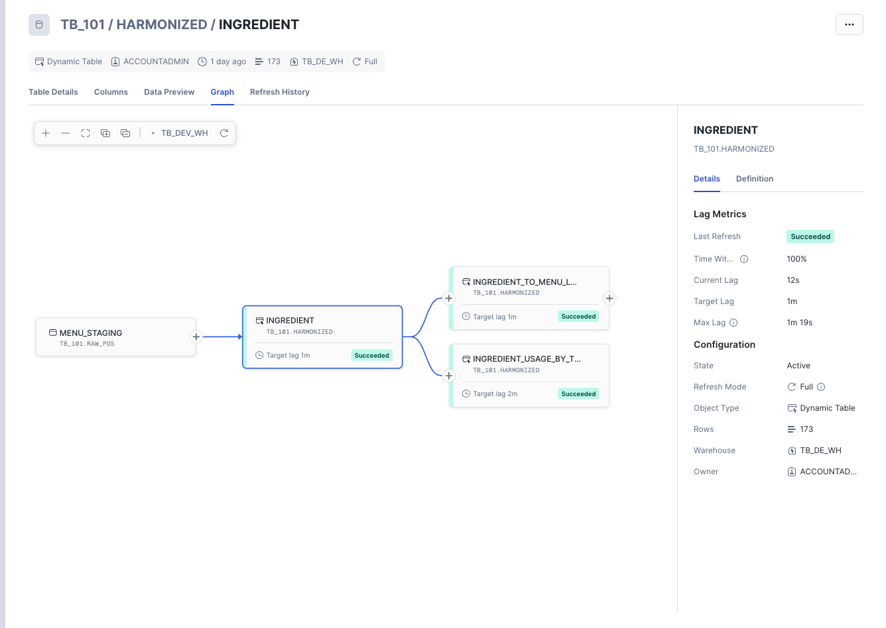

## Snowflake Cortex AI


### Overview

Welcome to the Zero to Snowflake guide focused on Snowflake Cortex AI!

Within this guide, we will explore Snowflake's complete AI platform through a progressive journey from experimentation into unified business intelligence. We'll learn AI capabilities by building a comprehensive customer intelligence system using Cortex Playground for AI experimentation, Cortex AI Functions for production-scale analysis, <!-- Snowflake Copilot for AI-assisted SQL development, --> Cortex Search for semantic text searching, and Cortex Analyst for natural language analytics.

- For more detail on Snowflake Cortex AI, please visit the [Snowflake AI and ML Overview documentation](https://docs.snowflake.com/en/guides-overview-ai-features).

### What You Will Learn

* How to Experiment with AI Using AI Cortex Playground for model testing and prompt optimization.
* How to Scale AI Analysis with Cortex AI Functions for production-scale customer review processing.
<!-- * How to optimize development with Snowflake’s Copilot for AI-assisted SQL query generation. -->
* How to enable semantic discovery with Cortex Search for intelligent text and review finding.
* How to create conversational analytics with Cortex Analyst for natural language business intelligence.

### What You Will Build

Through this journey, you’ll construct a complete intelligence customer analytics platform:

**Phase 1: AI Foundation**
* AI Experimentation Environment using Cortex Playground for model testing and optimization.
* Production-scale Review Analysis pipeline using Cortex AI Functions for systematic customer feedback processing.

**Phase 2: Intelligent Development & Discovery**
<!-- * AI-Assisted SQL Development Workflow using Copilot for complex query generation. -->
* Semantic Search Engine using Cortex Search for instant customer feedback discovery and operational intelligence.

**Phase 3: Conversational Intelligence**
* Natural Language Business Analytics Interface using Cortex Analyst for conversational data exploration.
* Unified AI Business Intelligence Platform using Snowflake Intelligence that connects customer voice with business performance

### Cortex Playground


#### Overview

As a data analyst at Tasty Bytes, you need to rapidly explore customer feedback using AI models to identify service improvement opportunities. Traditionally, AI experimentation is complex and time-consuming. **[Snowflake Cortex Playground](https://docs.snowflake.com/en/user-guide/snowflake-cortex/cortex-playground)** solves this by offering a quick, secure environment directly within Snowflake's UI to experiment with diverse AI models, compare their performance on real business data, and export successful approaches as production-ready SQL. This module guides you through using Cortex Playground for rapid prototyping and seamless integration of AI into your data workflows.


#### Step 1 - Connect Data & Filter

Let's begin by connecting directly to customer review data within Cortex Playground. This keeps your data secure within Snowflake while allowing you to analyze feedback using AI models.

**Navigation steps:**

1.  Navigate to **AI & ML → Studio → Cortex Playground**.
2.  Select **Role: TB_DEV** and **Warehouse: TB_DEV_WH**.
3.  Click "**+Connect your data**" in the prompt box.
4.  Select data source:
      * **Database: TB_101**
      * **Schema: HARMONIZED**
      * **Table: TRUCK_REVIEWS_V**
5.  Click **Let's go**
6.  Select text column: **REVIEW**.
7.  Select filter column: **TRUCK_BRAND_NAME**.
8.  Click **Done**.
9.  In the system prompt box, apply a filter using the **TRUCK_BRAND_NAME** dropdown. There are multiple reviews available for each truck brand. For instance, you can select "**Better Of Bread**" to narrow down the reviews. If "**Better Of Bread**" isn't available, please choose any other truck brand from the dropdown and proceed with one of its reviews.


> **What you've accomplished:** You now have direct access to customer review data within the AI interface. The filter allows you to focus your analysis on specific truck brands, making your experiment more targeted and relevant.
#### Step 2 - Compare AI Models for Insights

Now, let's analyze customer reviews to extract specific operational insights and compare how different AI models perform on this business task.

**Setup Model Comparison:**

1.  Click "**Compare**" to enable side-by-side model comparison.
2.  Set the left panel to "**claude-3-5-sonnet**" and the right panel to "**snowflake-llama-3.3-70b**".

> **Note:** Snowflake Cortex provides access to leading AI models from multiple providers, including Anthropic, OpenAI, Meta, and others, giving you choice and flexibility without vendor lock-in.

**Enter this strategic prompt:**

 `Analyze this customer review across multiple dimensions: sentiment score with confidence level, key theme extraction, competitive positioning insights, operational impact assessment, and priority ranking for management action`

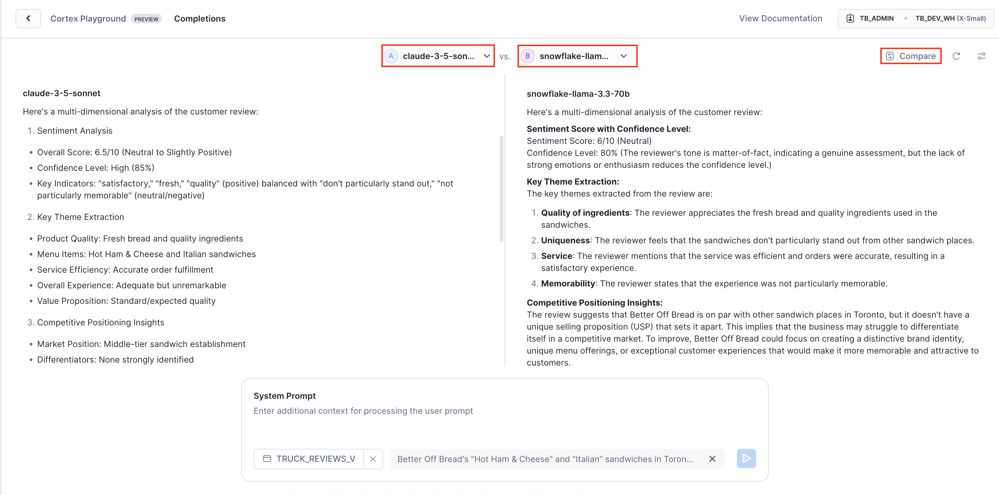

> **Key Insight:** Notice the distinct strengths: Claude provides structured, executive-ready analysis with clear confidence. In contrast, Snowflake’s Llama model, optimized specifically for robust business intelligence, delivers comprehensive operational intelligence enriched with strategic context and detailed competitive analysis. This highlights the power of leveraging multiple AI providers, empowering you to choose the ideal approach for your specific business needs.

With our optimal model identified, we now need to fine-tune its behavior for different business scenarios. The same model can produce vastly different results depending on its settings—let’s optimize this for our specific analytical requirements.

#### Step 3 - Fine-Tune Model Behavior 

We want to observe how adjusting parameters, especially "**temperature**," affects the AI model's responses. Does it lead to more consistent or more creative answers?

**How to Set Up This Temperature Test:**

1.  First, make sure both panels are set to "**claude-3-5-sonnet**." We're comparing the same model, just with different settings.
2.  Next, click "**Change Settings**" right next to where it says "**Compare**."
3.  Now, let's adjust those parameters for each side:
      * **Left Panel:**
          * Set **Temperature** to **0.1**. This will generally make the model give you really consistent, predictable answers.
          * Set **Max-tokens** to **200**. This just keeps the responses from getting too long.
      * **Right Panel:**
          * Set **Temperature** to **0.8**. This should make the model's answers a bit more creative and varied.
          * Set **top_p** to **0.8**. This is another setting that helps encourage a wider range of words in the response.
          * Set **Max-tokens** to **200**. Again, keeping the length in check.
4.  Finally, use the exact same strategic prompt you used in Step 2.

Give that a try and see how the responses differ! It's pretty cool to see how these small tweaks can change the AI's "personality."

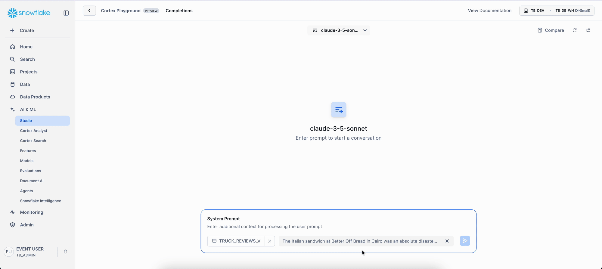

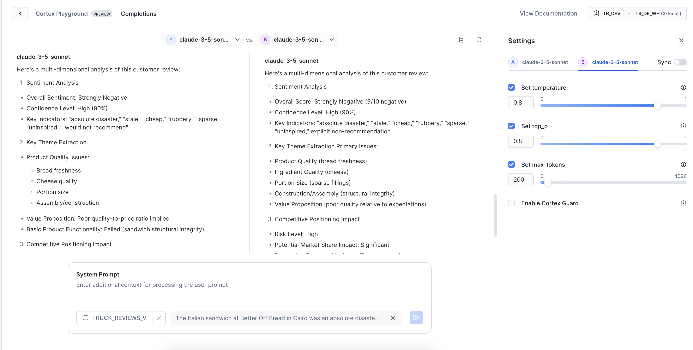

**Observe the Impact:**

Notice how adjusting the temperature parameter fundamentally changes the analytical output, even with the same AI model and data.

  * **Temperature 0.1:** Produces deterministic, focused output. Ideal for structured, consistent analysis and standardized reporting.
  * **Temperature 0.8:** Results in diverse, varied output. Perfect for generating explanatory insights or exploring less obvious connections.

While temperature influences token choice, **top_p** (set to 0.8 on the right) restricts possible tokens. **max_tokens** simply sets the maximum response length; be mindful small values can truncate results. This gives you precise control over AI creativity versus consistency, letting you match the AI’s behavior to your analytical objectives.

Now that we’ve mastered model selection and parameter optimization, let's examine the technology foundation that makes this experimentation possible. Understanding this will help us transition from playground testing to production deployment.

#### Step 4 - Understanding the Underlying Technology

In this section, let's explore the core technology that takes your AI insights from the playground to production.

#### The Foundation: SQL at Its Core

Every AI insight you generate in Cortex Playground isn't just magic; it's backed by SQL. Click "**View Code**" after any model response, and you'll see the exact SQL query, complete with your specified settings like temperature. This isn't just for show—this code is ready for action! You can run it directly in a Workspace SQL file, automate it with streams and tasks, or integrate it with a dynamic table for live data processing. It's also worth noting that the functionalities of this Cortex Complete can be accessed programmatically via Python or a REST API, offering flexible integration options.

#### The AI_COMPLETE Function

Behind every prompt you've run, the **[AI_COMPLETE](https://docs.snowflake.com/en/sql-reference/functions/ai_complete)** function is hard at work. This is Snowflake Cortex AI's powerful function providing direct access to industry-leading large language models for text completion. The Cortex Playground simply offers an intuitive interface to test and compare these models before you embed them directly into your SQL. (Heads up: AI_COMPLETE is the updated version of SNOWFLAKE.CORTEX.COMPLETE)

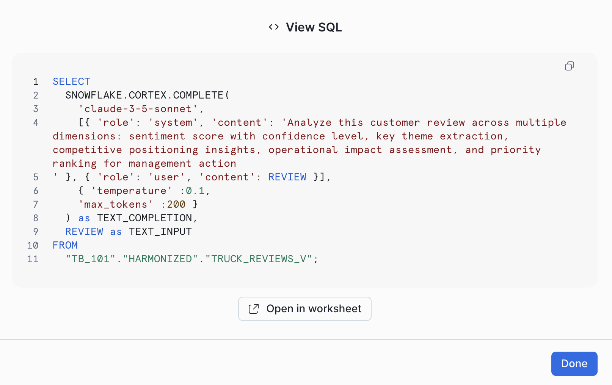

This seamless integration means your AI experimentation directly translates into production-ready workflows within Snowflake.

#### Conclusion

The Cortex Playground is an invaluable tool for experimenting with individual reviews, but true large-scale customer feedback analysis demands specialized AI functions. The prompt patterns and model selections you've refined here lay the groundwork for building scalable solutions. Our next step involves processing thousands of reviews using purpose-built AI Functions like **SENTIMENT()**, **CLASSIFY()**, **EXTRACT_ANSWER()**, and **AI_SUMMARIZE_AGG()**. This systematic approach ensures that AI-driven insights seamlessly become a core part of our operational strategy.

### AI Functions


#### Overview

You've successfully experimented with AI models in Cortex Playground to analyze individual customer reviews. Now, it's time to scale! This guide shows you how to use **[AI Functions](https://docs.snowflake.com/en/user-guide/snowflake-cortex/aisql)** to process thousands of reviews, turning experimental insights into production-ready intelligence. You'll learn to:

1.  **USE SENTIMENT()** to score and label truck customer reviews.
2.  **Use AI_CLASSIFY()** to categorize reviews by themes.
3.  **Use EXTRACT_ANSWER()** to pull specific complaints or praise.
4.  **Use AI_SUMMARIZE_AGG()** to generate quick summaries per truck brand.

### Get the SQL code and paste it into your SQL File.

Copy and paste the SQL from this [file](https://github.com/Snowflake-Labs/sfguide-getting-started-from-zero-to-snowflake/blob/main/scripts/vignette-3-aisql.sql) in a new SQL File to follow along in Snowflake.
<!-- Uncomment when Copilot is added back -->
<!-- **Note that once you've reached the end of the SQL File you can skip to [Step 19 - Snowflake Copilot](/en/developers/guides/zero-to-snowflake/).** -->

<!-- Remove when Copilot is added back -->

<!-- End remove -->

### Step 1 - Setting Context

First, let's set our session context. We will assume the role of a TastyBytes data analyst with the intention of leveraging AISQL functions to gain insights from customer reviews.

```sql
ALTER SESSION SET query_tag = '{"origin":"sf_sit-is","name":"tb_zts","version":{"major":1, "minor":1},"attributes":{"is_quickstart":1, "source":"tastybytes", "vignette": "aisql_functions"}}';

USE ROLE tb_analyst;
USE DATABASE tb_101;
USE WAREHOUSE tb_de_wh;
```

#### Step 2 - Sentiment Analysis at Scale

Analyze customer sentiment across all food truck brands to identify which trucks are performing best and create fleet-wide customer satisfaction metrics. In Cortex Playground, we analyzed individual reviews manually. Now we’ll use the `SENTIMENT()` function to automatically score customer reviews from -1 (negative) to +1 (positive), following Snowflake's official sentiment ranges.

**Business Question:** “How do customers feel about each of our truck brands overall?”

Please execute this query to analyze customer sentiment across our food truck network and categorize feedback.

```sql
SELECT
    truck_brand_name,
    COUNT(*) AS total_reviews,
    AVG(CASE WHEN sentiment >= 0.5 THEN sentiment END) AS avg_positive_score,
    AVG(CASE WHEN sentiment BETWEEN -0.5 AND 0.5 THEN sentiment END) AS avg_neutral_score,
    AVG(CASE WHEN sentiment <= -0.5 THEN sentiment END) AS avg_negative_score
FROM (
    SELECT
        truck_brand_name,
        SNOWFLAKE.CORTEX.SENTIMENT (review) AS sentiment
    FROM harmonized.truck_reviews_v
    WHERE
        language ILIKE '%en%'
        AND review IS NOT NULL
    LIMIT 10000
)
GROUP BY
    truck_brand_name
ORDER BY total_reviews DESC;
```

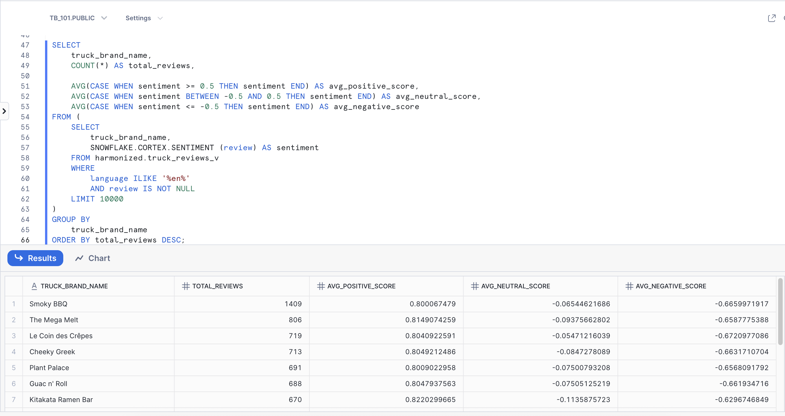


> **Key Insight**: Notice how we transitioned from analyzing reviews one at a time in Cortex Playground to systematically processing thousands. The `SENTIMENT()` function automatically scored every review and categorized them into Positive, Negative, and Neutral - giving us instant fleet-wide customer satisfaction metrics.
>
> **Sentiment Score Ranges**:
>
>   * Positive: 0.5 to 1
>   * Neutral: -0.5 to 0.5
>   * Negative: -0.5 to -1

#### Step 3 - Categorize Customer Feedback

Now, let's categorize all reviews to understand what aspects of our service customers are talking about most. We'll use the `AI_CLASSIFY()` function, which automatically categorizes reviews into user-defined categories based on AI understanding, rather than simple keyword matching. In this step, we will categorize customer feedback into business-relevant operational areas and analyze their distribution patterns.

**Business Question:** “What are customers primarily commenting on - food quality, service, or delivery experience?"

Execute the Classification Query:

```sql
WITH classified_reviews AS (
  SELECT
    truck_brand_name,
    AI_CLASSIFY(
      review,
      ['Food Quality', 'Pricing', 'Service Experience', 'Staff Behavior']
    ):labels[0] AS feedback_category
  FROM
    harmonized.truck_reviews_v
  WHERE
    language ILIKE '%en%'
    AND review IS NOT NULL
    AND LENGTH(review) > 30
  LIMIT
    10000
)
SELECT
  truck_brand_name,
  feedback_category,
  COUNT(*) AS number_of_reviews
FROM
  classified_reviews
GROUP BY
  truck_brand_name,
  feedback_category
ORDER BY
  truck_brand_name,
  number_of_reviews DESC;
```


> **Key Insight**: Observe how `AI_CLASSIFY()` automatically categorized thousands of reviews into business-relevant themes such as Food Quality, Service Experience, and more. We can instantly see that Food Quality is the most discussed topic across our truck brands, providing the operations team with clear, actionable insight into customer priorities.

#### Step 4 - Extract Specific Insights

Next, to gain precise answers from unstructured text, we'll utilize the `EXTRACT_ANSWER()` function. This powerful function enables us to ask specific business questions about customer feedback and receive direct answers. In this step, our goal is to identify precise operational issues mentioned in customer reviews, highlighting specific problems that require immediate attention.

**Business question:** “What specific improvement or complaint is mentioned in this review?"

Let's execute the next query:

```sql
  SELECT
    truck_brand_name,
    primary_city,
    LEFT(review, 100) || '...' AS review_preview,
    SNOWFLAKE.CORTEX.EXTRACT_ANSWER(
        review,
        'What specific improvement or complaint is mentioned in this review?'
    ) AS specific_feedback
FROM
    harmonized.truck_reviews_v
WHERE
    language = 'en'
    AND review IS NOT NULL
    AND LENGTH(review) > 50
ORDER BY truck_brand_name, primary_city ASC
LIMIT 10000;
```

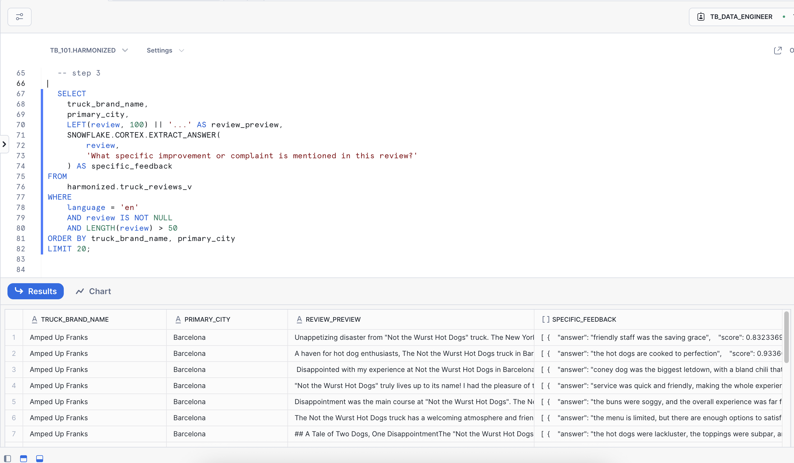


> **Key Insight**: Notice how `EXTRACT_ANSWER()` distills specific, actionable insights from long customer reviews. Rather than manual review, this function automatically identifies concrete feedback like "friendly staff was saving grace" and "hot dogs are cooked to perfection." The result is a transformation of dense text into specific, quotable feedback that the operations team can leverage instantly.

#### Step 5 - Generate Executive Summaries

Finally, to create concise summaries of customer feedback, we'll use the `AI_SUMMARIZE_AGG()` function. This powerful function generates short, coherent summaries from lengthy unstructured text. In this step, our goal is to distill the essence of customer reviews for each truck brand into digestible summaries, providing quick overviews of overall sentiment and key points.

**Business Question:** “What are the key themes and overall sentiment for each truck brand?”

Execute the Summarization Query:

```sql
SELECT
  truck_brand_name,
  AI_SUMMARIZE_AGG (review) AS review_summary
FROM
  (
    SELECT
      truck_brand_name,
      review
    FROM
      harmonized.truck_reviews_v
    LIMIT
      100
  )
GROUP BY
  truck_brand_name;
```

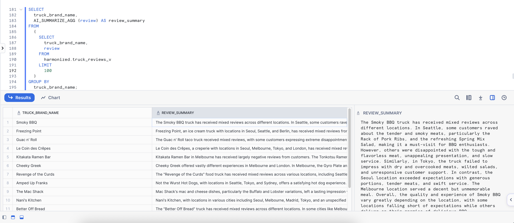

> **Key Insight**: The `AI_SUMMARIZE_AGG()` function condenses lengthy reviews into clear, brand-level summaries. These summaries highlight recurring themes and sentiment trends, providing decision-makers with quick overviews of each food truck's performance and enabling faster understanding of customer perception without reading individual reviews.

#### Conclusion

We've successfully demonstrated the transformative power of AI Functions, shifting customer feedback analysis from individual review processing to systemic, production-scale intelligence. Our journey through these four core functions clearly illustrates how each serves a distinct analytical purpose, transforming raw customer voices into comprehensive business intelligence—systematic, scalable, and immediately actionable. What once required individual review analysis now processes thousands of reviews in seconds, providing both the emotional context and specific details crucial for data-driven operational improvements.

<!-- Uncomment when Copilot is added back -->
<!-- As our analysis grows in sophistication, combining multiple AI functions in complex queries can become challenging. This is precisely where Snowflake Copilot offers powerful assistance. Let's explore how Copilot can help us create complex queries using natural language and significantly accelerate our work, empowering us to build even more intricate analytical workflows with ease. -->

<!-- Uncomment when Copilot is added back -->
<!-- ## Snowflake Copilot -->

<!-- 


### Overview

You've successfully built powerful AI SQL queries to analyze customer reviews. Now, the challenge is to connect these insights to real business impact: Do negative reviews affect loyalty? Do positive reviews boost orders? This requires **complex queries** joining multiple data sources and correlating AI results.

This lab introduces **Snowflake Copilot**, an LLM-powered assistant designed to simplify this challenge. Running securely within Snowflake Cortex, Copilot helps you construct sophisticated analytical workflows, translating complex business questions into powerful SQL.

### Get the SQL and paste it into your SQL File

**Copy and paste the SQL from this [file](https://github.com/Snowflake-Labs/sfguide-getting-started-from-zero-to-snowflake/blob/main/scripts/vignette-3-copilot.sql) into a new SQL File in Snowflake to follow along.**

**Snowflake Copilot is designed to be used directly within the SQL File environment.** Please ensure you are executing the SQL in a SQL File.

**Note: Once you've reached the end of the SQL File, you can skip to Step 20 - Cortex Search.**

### Step 1 - Setting Context

First, let's set our session context. We will assume the role of a TastyBytes data analyst with the intention of leveraging Snowflake Copilot to build sophisticated queries and gain deeper business insights.

```sql
ALTER SESSION SET query_tag = '{"origin":"sf_sit-is","name":"tb_zts","version":{"major":1, "minor":1},"attributes":{"is_quickstart":1, "source":"tastybytes", "vignette": "snowflake_copilot"}}';

USE ROLE tb_analyst;
USE WAREHOUSE tb_de_wh;
USE DATABASE tb_101;
USE SCHEMA harmonized;
```


### Step 2 - Translate Requirements with Copilot

To begin, let’s explore what types of analysis questions we can ask about our Tasty Bytes dataset using Copilot’s natural language understanding capabilities.

Type the following question in the Copilot message box and click RUN to see the result of the query:

**Prompt 1:** `How do I structure a query that correlates customer review sentiment with customer loyalty metrics and order behavior? I have a review sentiment data and customer loyalty metrics tables with order information. I need to understand the relationship between what customers say and their actual purchasing pattern.`

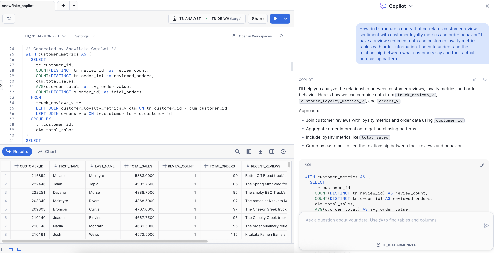


> **Key Insight**: Copilot provides schema-aware business intelligence, directly analyzing your specific Tasty Bytes tables and suggesting strategic analysis using your actual column names. This isn't generic AI; it's purpose-built intelligence that profoundly understands your data structure.

### Step 3 - Build Complex Queries 

Now let’s use Copilot to generate complex SQL with multiple table joins from a simple business question.

In the same Copilot panel, paste the following business question and click RUN to see the result:

**Prompt 2:** `Show me high-value customers who have been leaving negative reviews. I want to understand which customers spend a lot of money with us but seem unhappy based on their feedback`

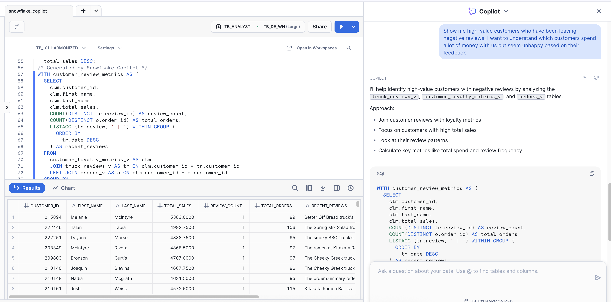

> **Key Insight**: Notice how Copilot transforms a simple business question into production-ready customer intelligence with complex analytical logic and actionable results—all without requiring SQL expertise. This showcases Copilot's core value: you can ask strategic questions in plain English and instantly receive the enterprise-grade analytics that typically demand data engineering skills.

### Conclusion

Snowflake Copilot profoundly transforms business intelligence by enabling users to effortlessly translate complex business questions into sophisticated SQL queries. As demonstrated with Tasty Bytes, it empowers both technical and non-technical users to derive actionable insights from their data without deep SQL expertise. This LLM-powered assistant delivers schema-aware, purpose-built intelligence, ensuring robust data governance and keeping all enterprise data securely within Snowflake. Copilot isn't just generic AI; it's a strategic tool that bridges operational insights with business intelligence. -->

### Optional: Cortex Search


#### Overview
<!-- Uncomment when Copilot is added back -->
<!-- While Copilot excels at generating complex analytical queries, a common daily challenge for customer service teams is quickly finding specific customer reviews for complaints or compliments. Traditional keyword search often falls short, missing the nuances of natural language. -->

<!-- Remove when Copilot is added back -->
While AI-powered tools excel at generating complex analytical queries, a common daily challenge for customer service teams is quickly finding specific customer reviews for complaints or compliments. Traditional keyword search often falls short, missing the nuances of natural language.
<!-- End Remove -->

**[Snowflake Cortex Search](https://docs.snowflake.com/en/user-guide/snowflake-cortex/cortex-search/cortex-search-overview)** solves this by providing low-latency, high-quality "fuzzy" search over your Snowflake text data. It quickly sets up hybrid (vector and keyword) search engines, handling embeddings, infrastructure, and tuning for you. Under the hood, Cortex Search combines semantic (meaning-based) and lexical (keyword-based) retrieval with intelligent re-ranking to deliver the most relevant results. In this lab, you will configure a search service, connect it to customer review data, and run semantic queries to proactively identify key customer feedback.

#### Step 1 - Access Cortex Search 

1.  Open Snowsight and navigate to the AI & ML Studio, then select **Cortex Search**.
2.  Click **Create** to begin setup.

This opens the search service configuration interface, where you’ll define how Snowflake indexes and interprets your text data.

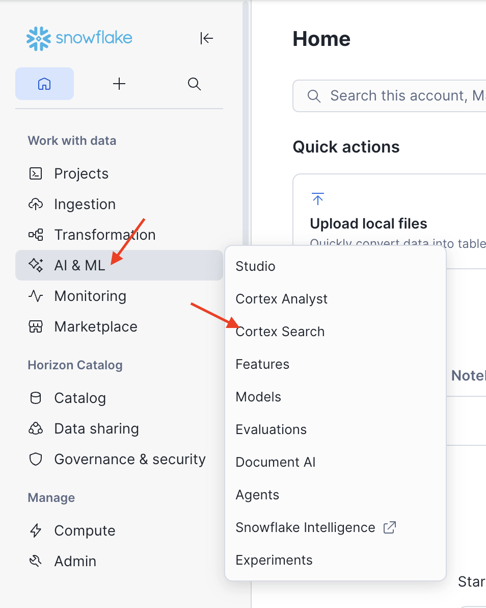

#### Step 2 - Configure the Search Service

In the **New service** configuration screen:

1. Select **Database** and **Schema**:
   * Choose **TB_101** from the Databases dropdown
   * Choose **HARMONIZED** from the Schemas dropdown
2. Enter the **Service name**: `customer_feedback_intelligence`
3. Click the **Next** button at the bottom right to proceed.

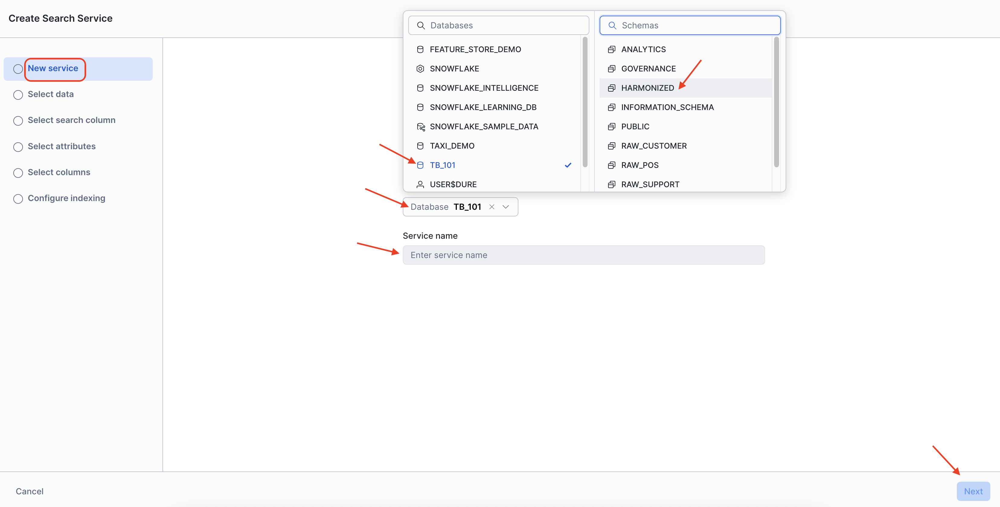


#### Step 3 - Connect to Review Data

The wizard will now guide you through several configuration screens. Follow these steps:

1. **Select data screen:**
   * From the Views dropdown, select `TRUCK_REVIEWS_V`
   * Click **Next**

2. **Select search column screen:**
   * Choose `REVIEW` (this is the text column that will be semantically searched)
   * Click **Next**

3. **Select attributes screen:**
   * Select columns for filtering results: `TRUCK_BRAND_NAME`, `PRIMARY_CITY`, `REVIEW_ID`
   * Click **Next**

4. **Select columns screen:**
   * Choose other columns to include in search results such as `DATE`, `LANGUAGE`, etc.
   * Click **Next**

5. **Configure indexing screen:**
   * **Warehouse**: Select `COMPUTE_WH` from the dropdown
   * Accept the other default settings
   * Click **Create** to build the search service

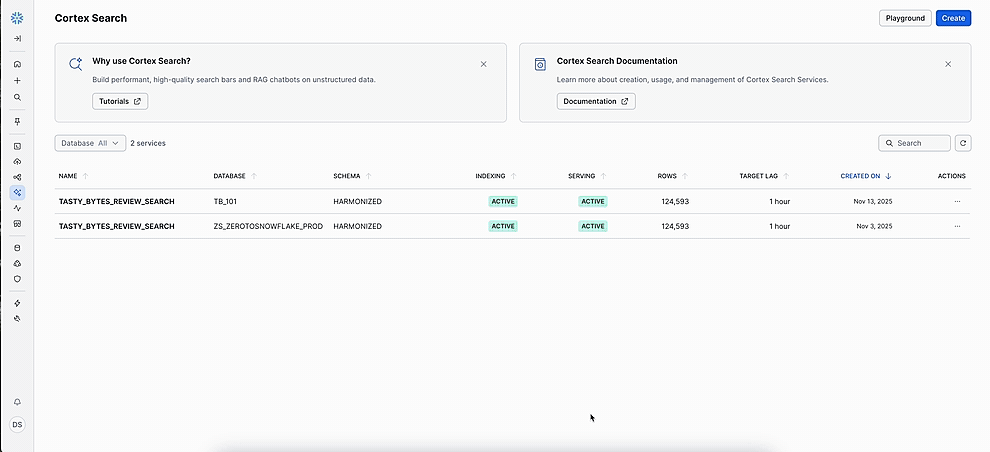

> **Note**: Creating the search service includes building the index, so the initial setup may take a little longer. If the creation process is taking an extended period, you can seamlessly continue the lab by using a pre-configured search service:
>

1.  From the left-hand menu in Snowsight, navigate to **AI & ML**, then click on **Cortex Search**.
2.  In the Cortex Search view, locate the dropdown filter (as highlighted in the image below, showing `TB_101 / HARMONIZED`). Select or ensure this filter is set to `TB_101 / HARMONIZED`.
3.  In the list of "Search services" that appears, click on the pre-built service named **`TASTY_BYTES_REVIEW_SEARCH`**.
4.  Once inside the service's details page, click on **Playground** in the top right corner to begin using the search service for the lab.

- **Once any search service is active (either your new one or the pre-configured one), queries will run with low latency and scale seamlessly.**

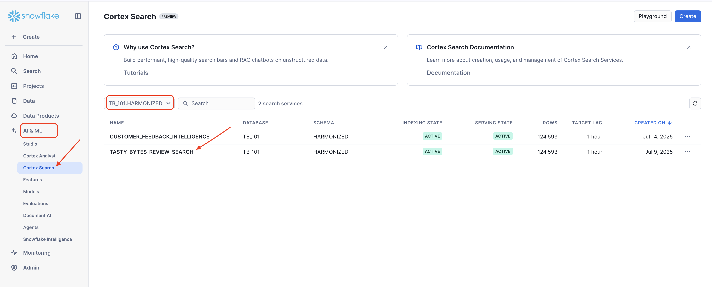

> Behind this simple UI, Cortex Search is performing a complex task. It analyzes the text in your "REVIEW" column, using an AI model to generate semantic embeddings, which are numerical representations of the text's meaning. These embeddings are then indexed, allowing for high-speed conceptual searches later on. In just a few clicks, you have taught Snowflake to understand the intent behind your reviews.

#### Step 4 - Run Semantic Query

When the service shows as "Active", click on **Playground** and enter the natural language prompt in the search bar:

**Prompt - 1:** `Customers getting sick`

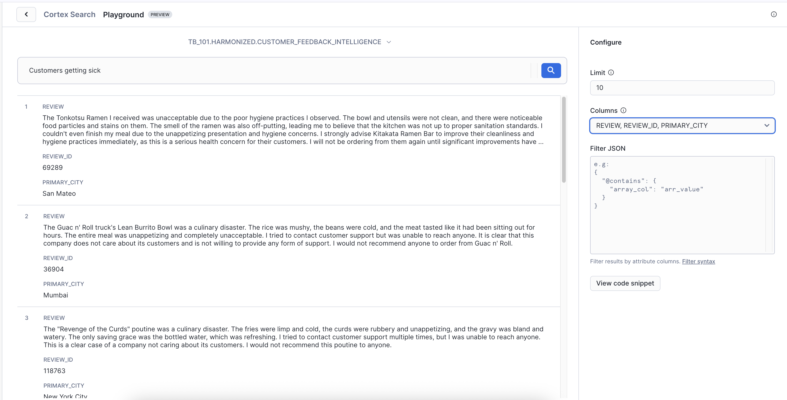

> **Key Insight**: Notice Cortex Search isn’t just finding customers - it’s finding CONDITIONS that could MAKE customers sick. That is the difference between reactive keyword search and proactive semantic understanding.

Now try another query:

**Prompt - 2:** `Angry customers`

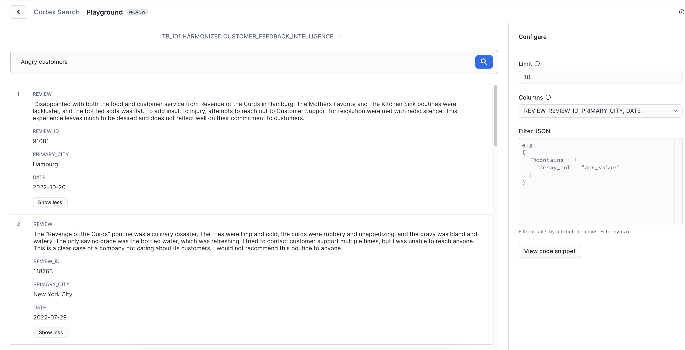

> **Key Insight**: These customers are about to churn, but they never said “I’m angry.” They expressed frustration in their own words. Cortex Search understands the emotion behind the language, helping you identify and save at-risk customers before they leave.

#### Conclusion

Ultimately, Cortex Search transforms how Tasty Bytes analyzes customer feedback. It empowers the customer service manager to move beyond simply sifting through reviews, to truly understand and proactively act upon the voice of the customer at scale, driving better operational decisions and enhancing customer loyalty.

In the next module - Cortex Analyst - you'll use natural language to query structured data. 

### Optional: Cortex Analyst


#### Overview

A business analyst at Tasty Bytes needs to enable self-service analytics, allowing the business team to ask complex questions in natural language and get instant insights without relying on data analysts to write SQL. While previous AI tools helped with finding reviews and complex query generation, the demand now is for **conversational analytics** that directly transforms structured business data into immediate insights.

**[Snowflake Cortex Analyst](https://docs.snowflake.com/en/user-guide/snowflake-cortex/cortex-analyst)** empowers business users to ask sophisticated questions directly, seamlessly extracting value from their analytics data through natural language interaction. This lab will guide you through designing a semantic model, connecting it to your business data, configuring relationships and synonyms, and then executing advanced business intelligence queries using natural language.

#### Step 1 -  Design Semantic Model

Let's begin by navigating to Cortex Analyst in Snowsight and configuring our semantic model foundations.

1. Navigate to **Cortex Analyst** under **AI & ML Studio** in Snowsight.

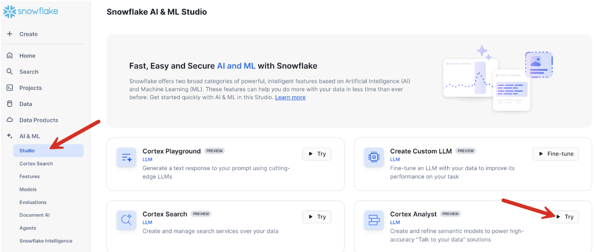

2. **Set Role and Warehouse:**

    * Change role to `TB_DEV`.
    * Set Warehouse to `TB_CORTEX_WH`.
    * Click **Create new model**.

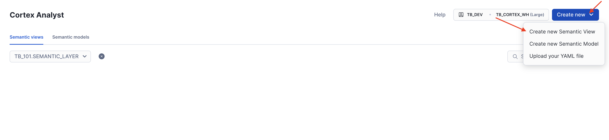


3.  On the **Getting Started** page, configure the following:

      * **DATABASE**: `TB_101`
      * **SCHEMA**: `SEMANTIC_LAYER`
      * **Name**: `tasty_bytes_business_analytics`
      * **Description**: `Semantic model for Tasty Bytes executive analytics, covering customer loyalty and order performance data for natural language querying`
      * Click **Next**.

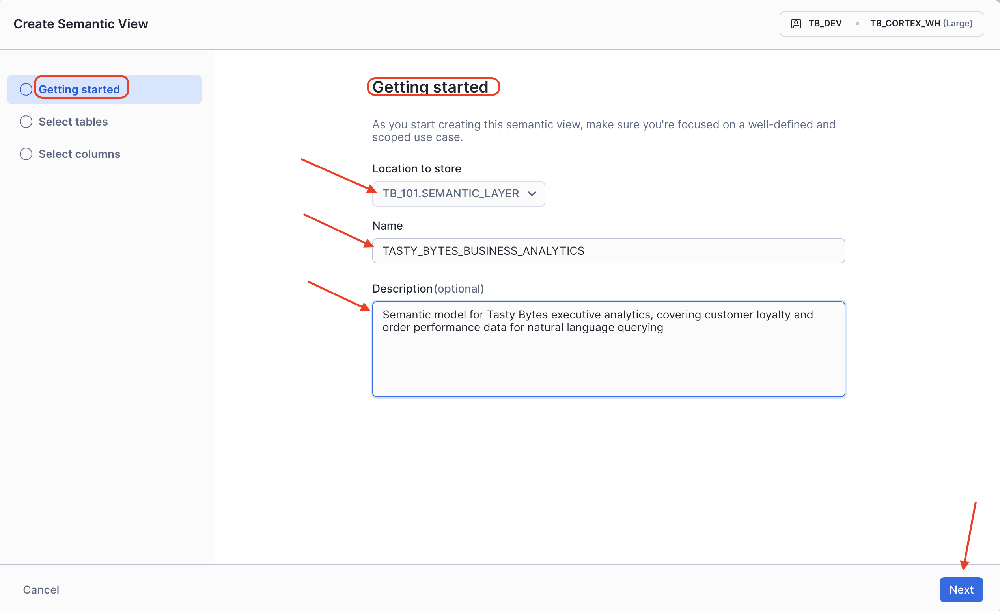

#### Step 2 - Select & Configure Tables and Columns

In the **Select tables** step, let's choose our analytics views.

1.  Select the core business tables:

      * **DATABASE**: `TB_101`
      * **SCHEMA**: `SEMANTIC_LAYER`
      * **VIEWS**: Select `Customer_Loyalty_Metrics_v` and `Orders_v`.
      * Click **Next**.

2.  On the **Select columns** page, ensure both selected tables are active, then click **Create and Save**.

#### Step 3 - Edit Logical Table & Add Synonyms

Now, let's add table synonyms and a primary key for better natural language understanding.

1.  In the `customer_loyalty_metrics_v` table, copy and paste the following synonyms into the `Synonyms` box:

    ```
    Customers, customer_data, loyalty, customer_metrics, customer_info
    ```

2.  Set the **Primary Key** to `customer_id` from the dropdown.

3.  For the `orders_v` table, copy and paste the following synonyms:

    ```
    Orders, transactions, sales, purchases, order_data
    ```

4.  After making these changes, click **Save** in the top right corner.

#### Step 4 - Configure Table Relationships

After creating the semantic model, let's establish the relationship between our logical tables.

1.  Click **Relationships** in the left-hand navigation.

2.  Click **Add relationship**.

3.  Configure the relationship as follows:

      * **Relationship name**: `orders_to_customer_loyalty_metrics`
      * **Left table**: `ORDERS_V`
      * **Right table**: `CUSTOMER_LOYALTY_METRICS_V`
      * **Join columns**: Set `CUSTOMER_ID` = `CUSTOMER_ID`.

4.  Click **Add relationship**


**Upon completion**, simply use the **Save** option at the top of the UI. This will finalize your semantic view, making your semantic model ready for sophisticated natural language queries. 

To access the **Cortex Analyst chat interface** in fullscreen mode, you would:

1.  Click the **three-dot menu (ellipsis)** next to the "Share" button at the top right.
2.  From the dropdown menu, select **"Enter fullscreen mode."**

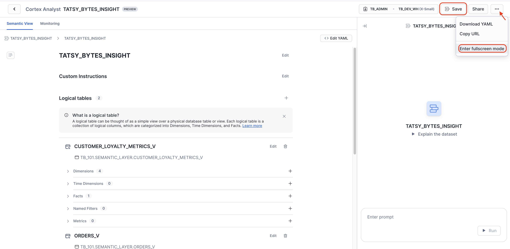

#### Step 5 - Execute Customer Segmentation Intelligence

With our semantic model and relationships active, let's demonstrate sophisticated natural language analysis by running our first complex business query.

1.  Navigate to the Cortex Analyst query interface.

2.  Enter the following prompt:

    ```
    Show customer groups by marital status and gender, with their total spending per customer and average order value. Break this down by city and region, and also include the year of the orders so I can see when the spending occurred. In addition to the yearly breakdown, calculate each group’s total lifetime spending and their average order value across all years. Rank the groups to highlight which demographics spend the most per year and which spend the most overall.
    ```
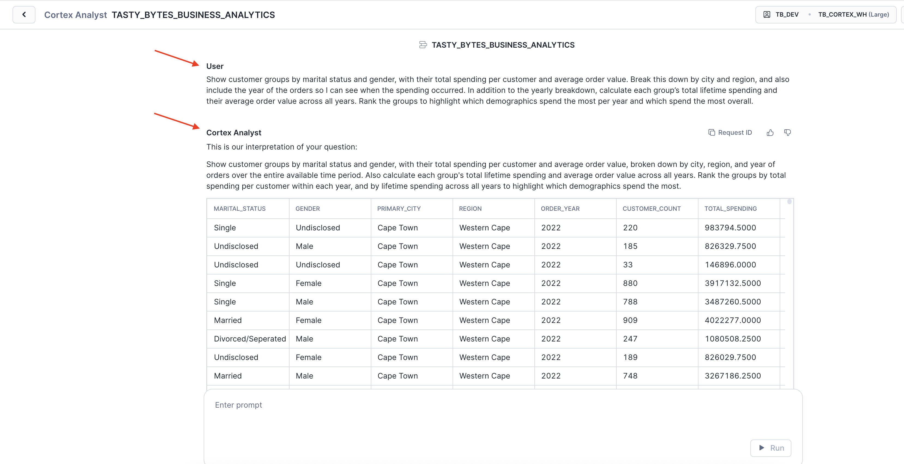

> **Key Insight**: Instantly delivers comprehensive intelligence by combining multi-table joins, demographic segmentation, geographic insights, and lifetime value analysis - insights that would require 40+ lines of SQL and hours of analyst effort.

#### Step 6 - Generate Advanced Business Intelligence

Having seen basic segmentation, let's now demonstrate enterprise-grade SQL that showcases the full power of conversational business intelligence.

1.  Clear the context by clicking the refresh icon.

2.  Enter the following prompt:

    ```
    I want to understand our customer base better. Can you group customers by their total spending (high, medium, low spenders), then show me their ordering patterns differ? Also compare how our franchise locations perform versus company-owned stores for each spending group.
    ```
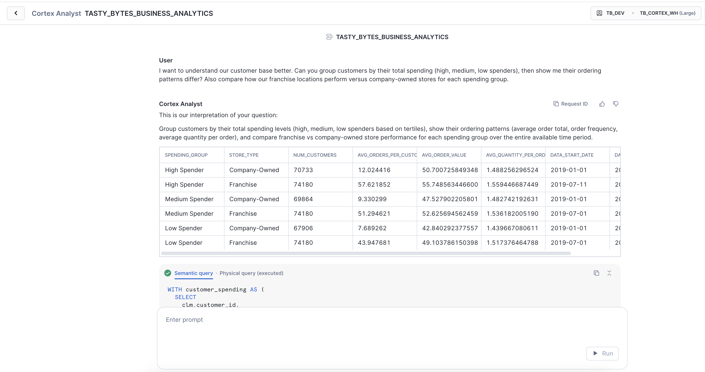


> **Key Insight**: Notice how Cortex Analyst seamlessly bridges the gap between a business user's simple, natural language question and the sophisticated, multi-faceted SQL query required to answer it. It automatically constructs the complex logic, including CTEs, window functions, and detailed aggregations, that would typically demand a skilled data analyst.

#### Conclusion

Through these rigorous steps, we've forged a robust Cortex Analyst semantic model. This isn't just an improvement; it's a transformative tool designed to liberate users across various industries from the constraints of SQL, enabling them to surface profound business intelligence through intuitive natural language queries. Our multi-layered analyses, while showcased through the Tasty Bytes use case, powerfully illustrate how this model drastically cuts down on the time and effort traditionally needed for deep insights, thereby democratizing access to data and fueling a culture of informed, agile decision-making on a broad scale.

### Snowflake Intelligence


#### Overview

The Chief Operating Officer at Tasty Bytes receives dozens of fragmented reports each week: customer satisfaction dashboards, revenue analytics, operational performance metrics, and market analysis. Critical business insights remain buried across separate systems: customer sentiment lives in review platforms, sales data sits in financial dashboards, and operational metrics exist in isolated performance tools.

When the COO needs to understand why Q3 revenue dropped, connecting customer feedback sentiment with actual financial performance requires hours of manual analysis, SQL expertise, and cross-referencing multiple data sources. This is a significant hurdle for executives and other non-technical roles.

In this section, we'll demonstrate how **[Snowflake Intelligence](https://docs.snowflake.com/en/user-guide/snowflake-cortex/snowflake-intelligence)** tackles this challenge by combining the capabilities of Cortex Search and Cortex Analyst, which are made available through the setup. This integration allows for a single conversational AI agent. You'll see how executives and other non-technical roles can ask natural language questions and receive immediate answers with visualizations. This kind of insight would normally take weeks of analyst work across multiple teams.

**Prerequisites:**

Before starting this module, your environment includes pre-configured AI services that power Snowflake Intelligence:

* **Cortex Search Service:** `tasty_bytes_review_search` - analyzing customer reviews and feedback
    * *Note for Advanced Users:* If you want to build your own Cortex Search from scratch, an optional setup module is available. For a detailed guide, click the link to the: [Cortex Search Module](/en/developers/guides/zero-to-snowflake/)

* **Cortex Analyst Service:** `TASTY_BYTES_BUSINESS_ANALYTICS` - for translating natural language questions into SQL and providing insights from structured data, enabling self-service analytics.
    * *Note for Advanced Users:* If you prefer to build your own Cortex Analyst semantic model from scratch, you can access the detailed setup module for guidance. Access the detailed setup by clicking on the: [Cortex Analyst Module](/en/developers/guides/zero-to-snowflake/)

---

#### Step 1 - Upload Semantic Model

To enable business analytics capabilities in Snowflake Intelligence, you need to upload the pre-built semantic model file to your Snowflake stage. You can **download the necessary YAML file directly by clicking this link:** [Cortex Analyst Semantic Model](https://github.com/Snowflake-Labs/sfguide-getting-started-from-zero-to-snowflake/blob/main/semantic_models/TASTY_BYTES_BUSINESS_ANALYTICS.yaml)

**Important:** If clicking the link opens the file in your browser instead of downloading it, please right-click on the link and select **"Save Link As"** to download the YAML file to your local machine.

Here's how to upload the semantic model:

1.  **Navigate to Cortex Analyst**: In Snowsight, go to **AI & ML Studio** and then select **Cortex Analyst**.

2.  **Set Role and Warehouse**:

      * Change your role to `TB_DEV`.
      * Set the warehouse to `TB_CORTEX_WH`.

3.  **Upload your YAML file**: Click the **Upload your yaml file** button.

4.  **Configure Upload Details**: In the upload file screen, set the following:

      * **Database**: `Tb_101`
      * **Schema**: `semantic_layer`
      * **Stage**: `semantic_model_stage`

5.  **Click Upload**: This YAML file contains the pre-configured semantic model that defines the business analytics layer, including customer loyalty metrics and order data.

6.  **Save the YAML file**: After clicking upload, save the YAML file. The semantic model will then appear in the Cortex Analyst panel, in the semantic models section.

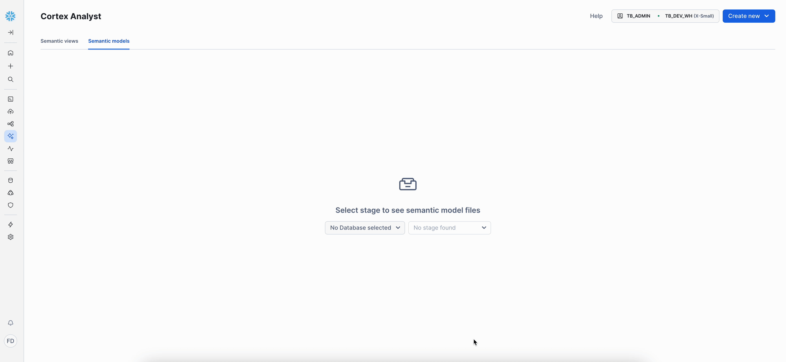

-----

#### Step 2: Create a Unified Agent

With your AI services pre-configured, you can now create a Cortex Agent that combines these capabilities into a single, unified intelligence interface.

### Create the Agent

1.  In **Snowsight**, navigate to the **AI & ML Studio**, then select **Agents**.
2.  Click **Create Agent**.
3.  In the "Create New Agent" window, click **Create agent**.
4.  **Initial Configuration**:
      * **Platform integration**: Ensure "Create this agent for Snowflake Intelligence" is checked.
      * **Database and schema**: This will default to `SNOWFLAKE_INTELLIGENCE.AGENTS`.
      * **Agent object name**: Enter `tasty_bytes_intelligence_agent`.
      * **Display name**: Enter `Tasty Bytes Business Intelligence Agent`.
5.  Click **Create agent**.

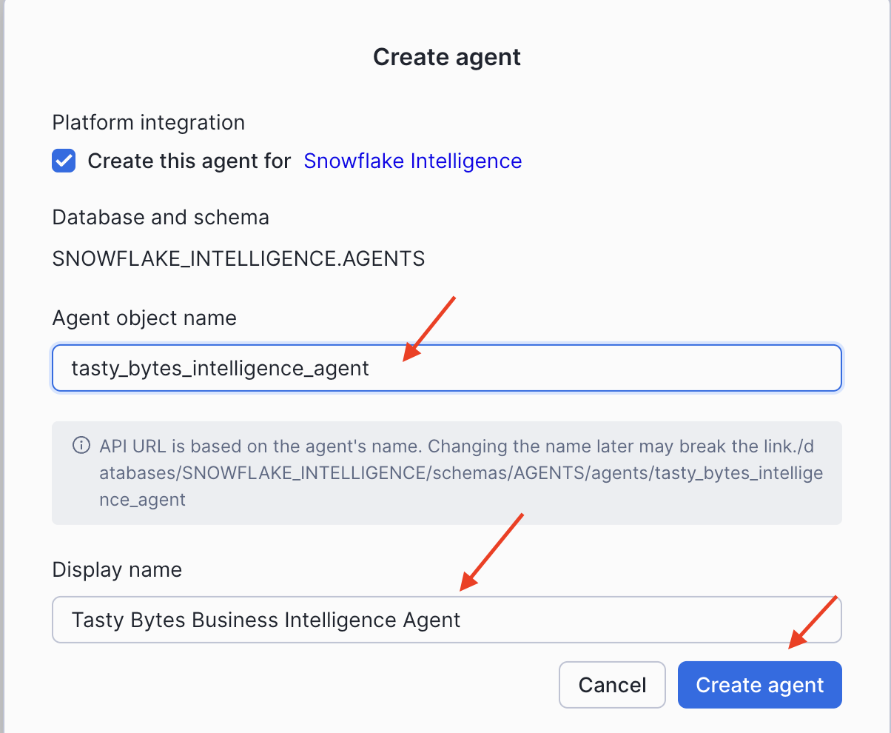

-----

### Configure the Agent

After creating the agent, click on its name from the agent list to open the details page, then click **Edit** to begin configuring it.


#### **1. About Tab**

  * **Display name**: `Tasty Bytes Business Intelligence Agent`
  * **Description**:
```
This agent analyzes customer feedback and business performance data for Tasty Bytes food trucks. It identifies operational issues, competitive threats, and growth opportunities by connecting customer reviews with revenue and loyalty metrics to provide actionable business insights.
```

#### **2. Tools Tab**

> **Note**: This lab primarily uses a pre-built **semantic model** uploaded in Step 1. However, if you built your Cortex Analyst semantic view from scratch using the [Cortex Analyst Module](vignette-3-cortex-analyst.md), you will select your **semantic view** here instead of a semantic model. After setting the **Database** to `TB_101` and **Schema** to `semantic_layer`, your semantic view will be listed and selectable under that schema.

Now, let's add the semantic model we uploaded in Step 1:

**Add the Cortex Analyst Tool:**

1.  Click **Add** next to "Cortex Analyst."
2.  Select the **Semantic model file** radio button.
3.  **Configure the semantic model location**:
      * **Schema**: Choose `TB_101.SEMANTIC_LAYER`.
      * **Stage**: Choose `SEMANTIC_MODEL_STAGE`.
      * **File Selection**: Pick your uploaded YAML file from the list.
4.  **Configure tool details**:
      * **Name**: Enter `tasty_bytes_business_analytics`.
      * **Description**:
```
Searches customer reviews and feedback to identify sentiment, operational issues, and customer satisfaction insights
```
5.  **Configure execution settings**:
      * **Warehouse**: Select **Custom** and choose `TB_CORTEX_WH`.
      * **Query timeout**: Enter `300`.
6.  Click **Add**.


-----

**Add the Cortex Search Services Tool:**

1.  Click **Add** next to "Cortex Search Services."
2.  **Configure tool details**:
      * **Name**: `tasty_bytes_review_search`.
      * **Description**: 
``` 
Searches customer reviews and feedback to identify sentiment, operational issues, and customer satisfaction insights
``` 
3.  **Configure data source location**:
      * **Schema**: Choose `TB_101.HARMONIZED`.
      * **Search service**: Choose `TB_101.HARMONIZED.TASTY_BYTES_REVIEW_SEARCH`.
4.  **Configure search result columns**:
      * **ID column**: Select **Review**
      * **Title column**: Select **TRUCK_BRAND_NAME**
5.  **Configure search filters (optional)**:
      * Click **Add filter** to add up to 5 optional filters.
6.  Click **Add**.

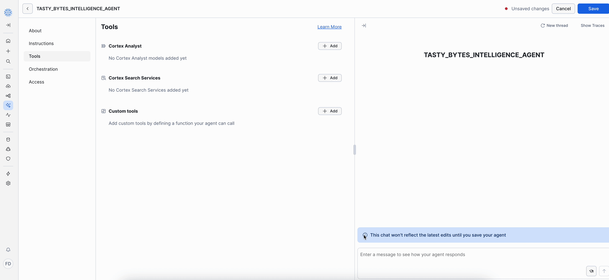

#### **3. Orchestration Tab**

* **Orchestration Instruction**:

```
Use both Cortex Search and Cortex Analyst to provide unified business intelligence.
Analyze customer feedback sentiment and operational issues from reviews, then correlate findings with revenue performance, customer loyalty metrics, and market data.
Present insights with revenue quantification and strategic recommendations.
```

* **Response Instruction**:
```
You are a business intelligence analyst for Tasty Bytes food trucks. When analyzing data:
1. Combine customer review insights with specific revenue and loyalty data to provide comprehensive business intelligence
2. Quantify business impact with specific revenue amounts and market sizes
3. Identify operational risks, competitive threats, and growth opportunities
4. Provide clear, actionable recommendations for executive decision-making
5. Use visualizations when helpful to illustrate business insights
6. Explain the correlation between customer feedback and business performance
7. Focus on strategic insights that drive business outcomes
```

#### **4. Access Tab**

> To control who can use your agent in this lab, you'll simply keep the default ACCOUNTADMIN access, which is sufficient for testing, with no extra configuration needed; however, you have the option to add more roles, such as TB_ADMIN, by clicking Add role.

#### **5. Save Configuration**

  * Click **Save** in the top right corner to finalize your agent's configuration.

Your unified intelligence agent is now ready to provide conversational business intelligence through the Snowflake Intelligence interface.

-----

#### Step 3 - Access Snowflake Intelligence Interface

With your intelligence agent created, we can now access the Snowflake Intelligence interface that provides unified natural language business intelligence.

**Access the interface:**

1.  Open Snowsight and navigate to the AI & ML Studio, then select **Snowflake Intelligence**
2.  Select our created agent: `tasty_bytes_intelligence_agent`
3.  Select the sources: select `tasty_bytes_review_search` and `tasty_bytes_business_analytics`

You are now ready to demonstrate unified business intelligence through natural language.


-----

#### Step 4 - Correlate Revenue & Customer Themes

Let's deep dive into our highest-earning markets by mapping their financial success to the voice of their customers.

**Prompt:**

```
Generate a bar chart displaying the top 5 cities by total revenue. For each of these top-performing cities, analyze their customer reviews to identify the 3 most frequently discussed topics or common themes (e.g., related to service, product, or facilities). Provide these topics alongside the chart
```
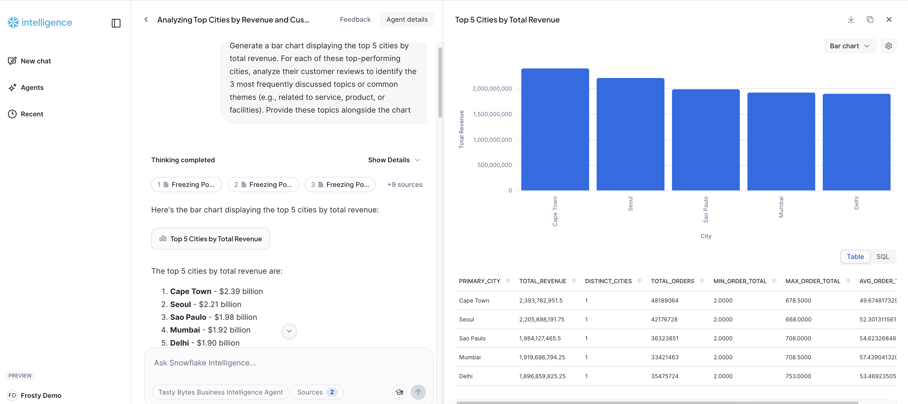

**Key insight:** This analysis really shows off what Snowflake Intelligence can do! It helps us connect the dots between how much money our top cities are making and what our customers in those cities are actually saying. We can quickly see our best-performing markets by revenue, and right alongside, get a clear picture of the most common things people are talking about in their reviews. This gives us a much richer, more human understanding of what's truly driving success – or perhaps what subtle issues might be brewing – even in our strongest areas. It's all about making smarter, more informed decisions, and we get these powerful insights just by asking a simple question.

#### Step 5 - Analyze Underperforming Markets

Now let's explore strategies to address these key customer pain points and develop targeted action plans to improve performance in these cities.

**Prompt:**

```
Identify the 5 cities with the lowest total revenue. For each of these cities, analyze their customer reviews to identify the 3 most frequently mentioned pain points or areas of dissatisfaction. Please present this as a table, showing the city, its total revenue, and the identified customer pain points.
```
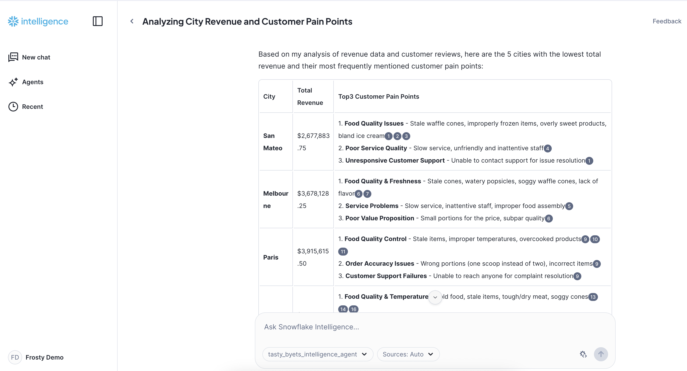

**Key insight:** This analysis from Snowflake Intelligence gives us a clear picture of our lowest-earning cities and, crucially, shines a light on the exact customer pain points that are holding them back. By directly connecting raw revenue numbers with specific feedback from customer reviews, we can pinpoint where we need to focus our efforts to improve service, product, or support. This provides actionable intelligence to drive targeted growth and customer satisfaction in these challenged markets, all by simply asking a natural language question.

-----

#### Conclusion

What we've just experienced with Tasty Bytes showcases a fundamental shift in how businesses can truly understand their data. By seamlessly integrating Snowflake Cortex Search for deep dives into unstructured customer feedback and Cortex Analyst for conversational insights from structured business metrics, we've brought a truly unified business intelligence to life.

You saw firsthand the power of this integration: users of all technical levels can now simply ask natural language questions and immediately receive visually rich, actionable answers. This direct and intuitive access to insights fundamentally transforms how organizations can swiftly identify operational risks, precisely quantify financial impact, and pinpoint new growth opportunities. It's clear that Snowflake Intelligence empowers rapid, data-driven decision-making, converting what was once fragmented data into clear, compelling business advantage for everyone.

## Governance with Horizon


### Overview

Within this vignette, we will explore some of the powerful governance features within Snowflake Horizon. We will begin with a look at Role-Based Access Control (RBAC), before diving into features like automated data classification, tag-based masking policies for column-level security, row-access policies, data quality monitoring, and finally, account-wide security monitoring with the Trust Center.

### What You Will Learn
- The fundamentals of Role-Based Access Control (RBAC) in Snowflake.
- How to automatically classify and tag sensitive data.
- How to implement column-level security with Dynamic Data Masking.
- How to implement row-level security with Row Access Policies.
- How to monitor data quality with Data Metric Functions.
- How to monitor account security with the Trust Center.

### What You Will Build
- A custom, privileged role.
- A data classification profile for auto-tagging PII.
- Tag-based masking policies for string and date columns.
- A row access policy to restrict data visibility by country.
- A custom Data Metric Function to check data integrity.

### Get the SQL code and paste it into your SQL File.

**Copy and paste the SQL from this [file](https://github.com/Snowflake-Labs/sfguide-getting-started-from-zero-to-snowflake/blob/main/scripts/vignette-4.sql) in a new SQL File to follow along in Snowflake.**

**Note that once you've reached the end of the SQL File you can skip to [Step 29 - Apps & Collaboration](/en/developers/guides/zero-to-snowflake/).** 

### Roles and Access Control


#### Overview

Snowflake's security model is built on a framework of Role-based Access Control (RBAC) and Discretionary Access Control (DAC). Access privileges are assigned to roles, which are then assigned to users. This creates a powerful and flexible hierarchy for securing objects.

> 
> **[Access Control Overview](https://docs.snowflake.com/en/user-guide/security-access-control-overview)**: To learn more about the key concepts of access control in Snowflake, including securable objects, roles, privileges, and users.

#### Step 1 - Set Context and View Existing Roles

First, let's set our context for this exercise and view the roles that already exist in the account.

```sql
USE ROLE useradmin;
USE DATABASE tb_101;
USE WAREHOUSE tb_dev_wh;

SHOW ROLES;
```

#### Step 2 - Create a Custom Role

We will now create a custom `tb_data_steward` role. This role will be responsible for managing and protecting our customer data.

```sql
CREATE OR REPLACE ROLE tb_data_steward
    COMMENT = 'Custom Role';
```

The typical hierarchy of system and custom roles might look something like this:

```
                                +---------------+
                                | ACCOUNTADMIN  |
                                +---------------+
                                  ^    ^     ^
                                  |    |     |
                    +-------------+-+  |    ++-------------+
                    | SECURITYADMIN |  |    |   SYSADMIN   |<------------+
                    +---------------+  |    +--------------+             |
                            ^          |     ^        ^                  |
                            |          |     |        |                  |
                    +-------+-------+  |     |  +-----+-------+  +-------+-----+
                    |   USERADMIN   |  |     |  | CUSTOM ROLE |  | CUSTOM ROLE |
                    +---------------+  |     |  +-------------+  +-------------+
                            ^          |     |      ^              ^      ^
                            |          |     |      |              |      |
                            |          |     |      |              |    +-+-----------+
                            |          |     |      |              |    | CUSTOM ROLE |
                            |          |     |      |              |    +-------------+
                            |          |     |      |              |           ^
                            |          |     |      |              |           |
                            +----------+-----+---+--+--------------+-----------+
                                                 |
                                            +----+-----+
                                            |  PUBLIC  |
                                            +----------+
```
Snowflake System Defined Role Definitions:

- **ORGADMIN**: Role that manages operations at the organization level.
- **ACCOUNTADMIN**: This is the top-level role in the system and should be granted only to a limited/controlled number of users in your account.
- **SECURITYADMIN**: Role that can manage any object grant globally, as well as create, monitor, and manage users and roles.
- **USERADMIN**: Role that is dedicated to user and role management only.
- **SYSADMIN**: Role that has privileges to create warehouses and databases in an account.
- **PUBLIC**: PUBLIC is a pseudo-role automatically granted to all users and roles. It can own securable objects, and anything it owns becomes available to every other user and role in the account.

#### Step 3 - Grant Privileges to the Custom Role

We can't do much with our role without granting privileges to it. Let's switch to the `securityadmin` role to grant our new `tb_data_steward` role the necessary permissions to use a warehouse and access our database schemas and tables.

```sql
USE ROLE securityadmin;

-- Grant warehouse usage
GRANT OPERATE, USAGE ON WAREHOUSE tb_dev_wh TO ROLE tb_data_steward;

-- Grant database and schema usage
GRANT USAGE ON DATABASE tb_101 TO ROLE tb_data_steward;
GRANT USAGE ON ALL SCHEMAS IN DATABASE tb_101 TO ROLE tb_data_steward;

-- Grant table-level privileges
GRANT SELECT ON ALL TABLES IN SCHEMA raw_customer TO ROLE tb_data_steward;
GRANT ALL ON SCHEMA governance TO ROLE tb_data_steward;
GRANT ALL ON ALL TABLES IN SCHEMA governance TO ROLE tb_data_steward;
```

#### Step 4 - Grant and Use the New Role

Finally, we grant the new role to our own user. Then we can switch to the `tb_data_steward` role and run a query to see what data we can access.

```sql
-- Grant role to your user
SET my_user = CURRENT_USER();
GRANT ROLE tb_data_steward TO USER IDENTIFIER($my_user);

-- Switch to the new role
USE ROLE tb_data_steward;

-- Run a test query
SELECT TOP 100 * FROM raw_customer.customer_loyalty;
```

Looking at the query results, it's clear this table contains a lot of Personally Identifiable Information (PII). In the next sections, we'll learn how to protect it.

### Classification and Auto Tagging


#### Overview

A key first step in data governance is identifying and classifying sensitive data. Snowflake Horizon's auto-tagging capability can automatically discover sensitive information by monitoring columns in your schemas. We can then use these tags to apply security policies.

> 
> **[Automatic Classification](https://docs.snowflake.com/en/user-guide/classify-auto)**: Learn how Snowflake can automatically classify sensitive data based on a schedule, simplifying governance at scale.

#### Step 1 - Create PII Tag and Grant Privileges

Using the `accountadmin` role, we'll create a `pii` tag in our `governance` schema. We will also grant the necessary privileges to our `tb_data_steward` role to perform classification.

```sql
USE ROLE accountadmin;

CREATE OR REPLACE TAG governance.pii;
GRANT APPLY TAG ON ACCOUNT TO ROLE tb_data_steward;

GRANT EXECUTE AUTO CLASSIFICATION ON SCHEMA raw_customer TO ROLE tb_data_steward;
GRANT DATABASE ROLE SNOWFLAKE.CLASSIFICATION_ADMIN TO ROLE tb_data_steward;
GRANT CREATE SNOWFLAKE.DATA_PRIVACY.CLASSIFICATION_PROFILE ON SCHEMA governance TO ROLE tb_data_steward;
```

#### Step 2 - Create a Classification Profile

Now, as the `tb_data_steward`, we'll create a classification profile. This profile defines how auto-tagging will behave.

```sql
USE ROLE tb_data_steward;

CREATE OR REPLACE SNOWFLAKE.DATA_PRIVACY.CLASSIFICATION_PROFILE
  governance.tb_classification_profile(
    {
      'minimum_object_age_for_classification_days': 0,
      'maximum_classification_validity_days': 30,
      'auto_tag': true
    });
```

#### Step 3 - Map Semantic Categories to the PII Tag

Next, we'll define a mapping that tells the classification profile to apply our `governance.pii` tag to any column whose `SEMANTIC_CATEGORY` matches common PII types like `NAME`, `PHONE_NUMBER`, `EMAIL`, etc.

```sql
CALL governance.tb_classification_profile!SET_TAG_MAP(
  {'column_tag_map':[
    {
      'tag_name':'tb_101.governance.pii',
      'tag_value':'pii',
      'semantic_categories':['NAME', 'PHONE_NUMBER', 'POSTAL_CODE', 'DATE_OF_BIRTH', 'CITY', 'EMAIL']
    }]});
```

#### Step 4 - Run Classification and View Results

Let's manually trigger the classification process on our `customer_loyalty` table. Then, we can query the `INFORMATION_SCHEMA` to see the tags that were automatically applied.

```sql
-- Trigger classification
CALL SYSTEM$CLASSIFY('tb_101.raw_customer.customer_loyalty', 'tb_101.governance.tb_classification_profile');

-- View applied tags
SELECT 
    column_name,
    tag_database,
    tag_schema,
    tag_name,
    tag_value,
    apply_method
FROM TABLE(INFORMATION_SCHEMA.TAG_REFERENCES_ALL_COLUMNS('raw_customer.customer_loyalty', 'table'));
```

Notice that columns identified as PII now have our custom `governance.pii` tag applied.

### Masking Policies


#### Overview

Now that our sensitive columns are tagged, we can use Dynamic Data Masking to protect them. A masking policy is a schema-level object that determines whether a user sees the original data or a masked version at query time. We can apply these policies directly to our `pii` tag.

> 
> **[Column-level Security](https://docs.snowflake.com/en/user-guide/security-column-intro)**: Column-level Security includes Dynamic Data Masking and External Tokenization to protect sensitive data.

#### Step 1 - Create Masking Policies

We'll create two policies: one to mask string data and one to mask date data. The logic is simple: if the user's role is not privileged (i.e., not `ACCOUNTADMIN` or `TB_ADMIN`), return a masked value. Otherwise, return the original value.

```sql
-- Create the masking policy for sensitive string data
CREATE OR REPLACE MASKING POLICY governance.mask_string_pii AS (original_value STRING)
RETURNS STRING ->
  CASE WHEN
    CURRENT_ROLE() NOT IN ('ACCOUNTADMIN', 'TB_ADMIN')
    THEN '****MASKED****'
    ELSE original_value
  END;

-- Now create the masking policy for sensitive DATE data
CREATE OR REPLACE MASKING POLICY governance.mask_date_pii AS (original_value DATE)
RETURNS DATE ->
  CASE WHEN
    CURRENT_ROLE() NOT IN ('ACCOUNTADMIN', 'TB_ADMIN')
    THEN DATE_TRUNC('year', original_value)
    ELSE original_value
  END;
```

#### Step 2 - Apply Masking Policies to the Tag

The power of tag-based governance comes from applying the policy once to the tag. This action automatically protects all columns that have that tag, now and in the future.

```sql
ALTER TAG governance.pii SET
    MASKING POLICY governance.mask_string_pii,
    MASKING POLICY governance.mask_date_pii;
```

#### Step 3 - Test the Policies

Let's test our work. First, switch to the unprivileged `public` role and query the table. The PII columns should be masked.

```sql
USE ROLE public;
SELECT TOP 100 * FROM raw_customer.customer_loyalty;
```

Now, switch to a privileged role, `tb_admin`. The data should now be fully visible.

```sql
USE ROLE tb_admin;
SELECT TOP 100 * FROM raw_customer.customer_loyalty;
```

### Row Access Policies


#### Overview

In addition to masking columns, Snowflake allows you to filter which rows are visible to a user with Row Access Policies. The policy evaluates each row against rules you define, often based on the user's role or other session attributes.

> 
> **[Row-level Security](https://docs.snowflake.com/en/user-guide/security-row-intro)**: Row Access Policies determine which rows are visible in a query result, enabling fine-grained access control.

#### Step 1 - Create a Policy Mapping Table

A common pattern for row access policies is to use a mapping table that defines which roles can see which data. We'll create a table that maps roles to the `country` values they are permitted to see.

```sql
USE ROLE tb_data_steward;

CREATE OR REPLACE TABLE governance.row_policy_map
    (role STRING, country_permission STRING);

-- Map the tb_data_engineer role to only see 'United States' data
INSERT INTO governance.row_policy_map
    VALUES('tb_data_engineer', 'United States');
```

#### Step 2 - Create the Row Access Policy

Now we create the policy itself. This policy returns `TRUE` (allowing the row to be seen) if the user's role is an admin role OR if the user's role exists in our mapping table and matches the `country` value of the current row.

```sql
CREATE OR REPLACE ROW ACCESS POLICY governance.customer_loyalty_policy
    AS (country STRING) RETURNS BOOLEAN ->
        CURRENT_ROLE() IN ('ACCOUNTADMIN', 'SYSADMIN') 
        OR EXISTS 
            (
            SELECT 1 FROM governance.row_policy_map rp
            WHERE
                UPPER(rp.role) = CURRENT_ROLE()
                AND rp.country_permission = country
            );
```

#### Step 3 - Apply and Test the Policy

Apply the policy to the `country` column of our `customer_loyalty` table. Then, switch to the `tb_data_engineer` role and query the table.

```sql
-- Apply the policy
ALTER TABLE raw_customer.customer_loyalty
    ADD ROW ACCESS POLICY governance.customer_loyalty_policy ON (country);

-- Switch role to test the policy
USE ROLE tb_data_engineer;

-- Query the table
SELECT TOP 100 * FROM raw_customer.customer_loyalty;
```

The result set should now only contain rows where the `country` is 'United States'.

### Data Metric Functions


#### Overview

Data governance isn't just about security; it's also about trust and reliability. Snowflake helps maintain data integrity with Data Metric Functions (DMFs). You can use system-defined DMFs or create your own to run automated quality checks on your tables.

> 
> **[Data Quality Monitoring](https://docs.snowflake.com/en/user-guide/data-quality-intro)**: Learn how to ensure data consistency and reliability using built-in and custom Data Metric Functions.

#### Step 1 - Use System DMFs

Let's use a few of Snowflake's built-in DMFs to check the quality of our `order_header` table.

```sql
USE ROLE tb_data_steward;

-- This will return the percentage of null customer IDs.
SELECT SNOWFLAKE.CORE.NULL_PERCENT(SELECT customer_id FROM raw_pos.order_header);

-- We can use DUPLICATE_COUNT to check for duplicate order IDs.
SELECT SNOWFLAKE.CORE.DUPLICATE_COUNT(SELECT order_id FROM raw_pos.order_header); 

-- Average order total amount for all orders.
SELECT SNOWFLAKE.CORE.AVG(SELECT order_total FROM raw_pos.order_header);
```

#### Step 2 - Create a Custom DMF

We can also create custom DMFs for our specific business logic. Let's create one that checks for orders where the `order_total` does not equal `unit_price * quantity`.

```sql
CREATE OR REPLACE DATA METRIC FUNCTION governance.invalid_order_total_count(
    order_prices_t table(
        order_total NUMBER,
        unit_price NUMBER,
        quantity INTEGER
    )
)
RETURNS NUMBER
AS
'SELECT COUNT(*)
 FROM order_prices_t
 WHERE order_total != unit_price * quantity';
```

#### Step 3 - Test and Schedule the DMF

Let's insert a bad record to test our DMF. Then, we'll call the function to see if it catches the error. The record we will be inserting is ordering 2 items with a unit price of $5, and a total price of $5 instead of the correct total $10.

```sql
-- Insert a record with an incorrect total price
INSERT INTO raw_pos.order_detail
SELECT 904745311, 459520442, 52, null, 0, 2, 5.0, 5.0, null;

-- Call the custom DMF on the order detail table.
SELECT governance.invalid_order_total_count(
    SELECT price, unit_price, quantity FROM raw_pos.order_detail
) AS num_orders_with_incorrect_price;
```

To automate this check, we can associate the DMF with the table and set a schedule to have it run automatically whenever the data changes, then add it to the `order_detail` table.

```sql
ALTER TABLE raw_pos.order_detail
    SET DATA_METRIC_SCHEDULE = 'TRIGGER_ON_CHANGES';

ALTER TABLE raw_pos.order_detail
    ADD DATA METRIC FUNCTION governance.invalid_order_total_count
    ON (price, unit_price, quantity);
```

### Trust Center


#### Overview

The Trust Center provides a centralized dashboard for monitoring security risks across your entire Snowflake account. It uses scheduled scanners to check for issues like missing Multi-Factor Authentication (MFA), over-privileged roles, or inactive users, and then provides recommended actions.

> 
> **[Trust Center Overview](https://docs.snowflake.com/en/user-guide/trust-center/overview)**: The Trust Center enables automatic checks to evaluate and monitor security risks on your account.

#### Step 1 - Grant Privileges and Navigate to the Trust Center

First, an `ACCOUNTADMIN` needs to grant the `TRUST_CENTER_ADMIN` application role to a user or role. We'll grant it to our `tb_admin` role.

```sql
USE ROLE accountadmin;
GRANT APPLICATION ROLE SNOWFLAKE.TRUST_CENTER_ADMIN TO ROLE tb_admin;
USE ROLE tb_admin; 
```

Now, navigate to the Trust Center in the Snowsight UI:

1.  Click the **Monitoring** tab in the left navigation bar.
2.  Click on **Trust Center**.

#### Step 2 - Enable Scanner Packages

By default, most scanner packages are disabled. Let's enable them to get a comprehensive view of our account's security posture.

1.  In the Trust Center, click the **Scanner Packages** tab.
2.  Click on **CIS Benchmarks**.

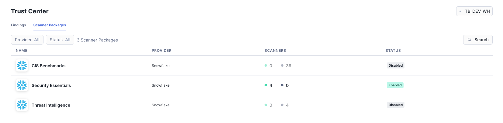

3.  Click the **Enable Package** button.

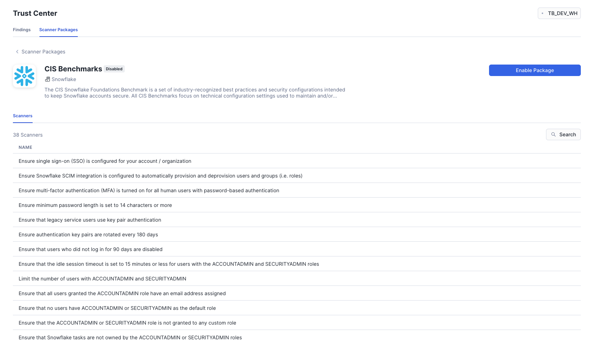

4.  In the modal, set the **Frequency** to `Monthly` and click **Continue**.

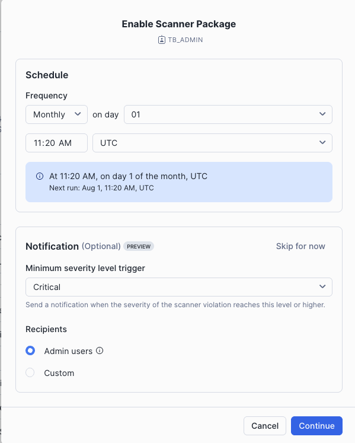

5.  Repeat this process for the **Threat Intelligence** scanner package.

#### Step 3 - Review Findings

After the scanners have had a moment to run, navigate back to the **Findings** tab.

  - You will see a dashboard summarizing violations by severity.
  - The list below details each violation, its severity, and the scanner that found it.
  - Clicking on any violation will open a details pane with a summary and recommended remediation steps.
  - You can filter the list by severity, status, or scanner package to focus on the most critical issues.

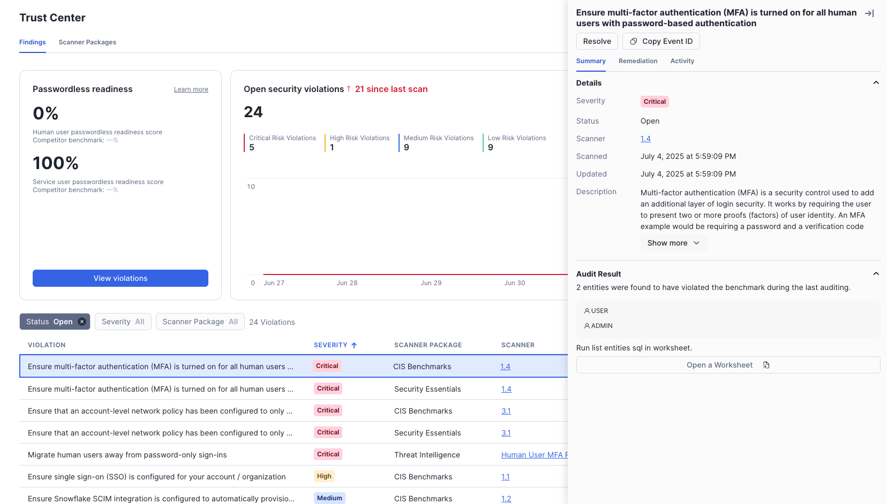

This powerful tool gives you a continuous, actionable overview of your Snowflake account's security health.

## Apps & Collaboration


### Overview

In this vignette, we will explore how Snowflake facilitates seamless data collaboration through the Snowflake Marketplace. We will see how easy it is to acquire live, ready-to-query third-party datasets and immediately join them with our own internal data to unlock new insights—all without the need for traditional ETL pipelines.

### What You Will Learn
- How to discover and acquire data from the Snowflake Marketplace.
- How to instantly query live, shared data.
- How to join Marketplace data with your own account data to create enriched views.
- How to leverage third-party Point-of-Interest (POI) data for deeper analysis.
- How to use Common Table Expressions (CTEs) to structure complex queries.

### What You Will Build
- Enriched analytical Views that combine internal sales data with external weather and POI data.

### Get the SQL code and paste it into your SQL File.

**Copy and paste the SQL code from this [file](https://github.com/Snowflake-Labs/sfguide-getting-started-from-zero-to-snowflake/blob/main/scripts/vignette-5.sql) in a new SQL File to follow along in Snowflake.**

### Acquire Data from Snowflake Marketplace


#### Overview

One of our analysts wants to see how weather impacts food truck sales. To do this, they'll use the Snowflake Marketplace to get live weather data from Weather Source, which can then be joined directly with our own sales data. The Marketplace allows us to access live, ready-to-query data from third-party providers without any data duplication or ETL.

> 
> **[Introduction to the Snowflake Marketplace](https://docs.snowflake.com/en/user-guide/data-sharing-intro)**: The Marketplace provides a centralized hub to discover and access a wide variety of third-party data, applications, and AI products.

#### Step 1 - Set Initial Context

First, let's set our context to use the `accountadmin` role, which is required to acquire data from the Marketplace.

```sql
USE DATABASE tb_101;
USE ROLE accountadmin;
USE WAREHOUSE tb_de_wh;
```

#### Step 2 - Acquire Weather Source Data

Follow these steps in the Snowsight UI to get the Weather Source data:

1.  Make sure you are using the `ACCOUNTADMIN` role.
2.  Navigate to **Data Products** » **Marketplace** from the left-hand navigation menu.
3.  In the search bar, enter: `Weather Source frostbyte`.
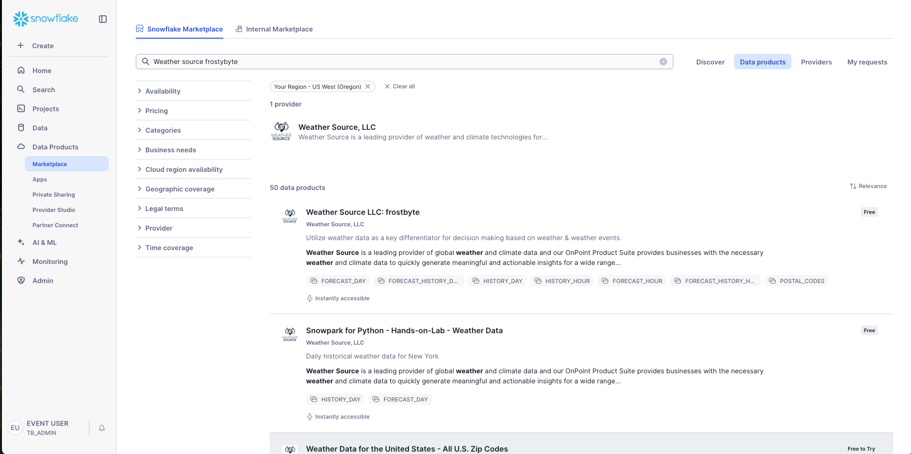

4.  Click on the **Weather Source LLC: frostbyte** listing.
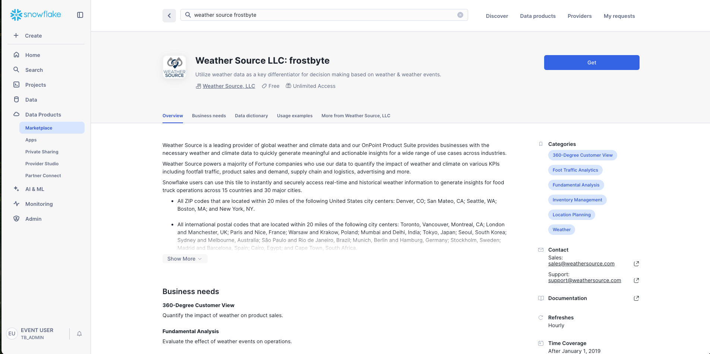

5.  Click the **Get** button.
6.  Click to expand the Options, then change the **Database name** to `ZTS_WEATHERSOURCE`.
7.  Grant access to the **PUBLIC** role.
8.  Click **Get**.
<!-- TODO add picture with settings -->

This process makes the Weather Source data instantly available in our account as a new database, ready to be queried.

### Integrate Account Data with Shared Data


#### Overview

With the Weather Source data now in our account, our analyst can immediately begin joining it with our existing Tasty Bytes data. There's no need to wait for an ETL job to run.

#### Step 1 - Explore the Shared Data

Let's switch to the `tb_analyst` role and begin exploring the new weather data. We'll start by getting a list of all distinct US cities available in the share, along with some average weather metrics.

```sql
USE ROLE tb_analyst;

SELECT 
    DISTINCT city_name,
    AVG(max_wind_speed_100m_mph) AS avg_wind_speed_mph,
    AVG(avg_temperature_air_2m_f) AS avg_temp_f,
    AVG(tot_precipitation_in) AS avg_precipitation_in,
    MAX(tot_snowfall_in) AS max_snowfall_in
FROM zts_weathersource.onpoint_id.history_day
WHERE country = 'US'
GROUP BY city_name;
```

#### Step 2 - Create an Enriched View

Now, let's create a view that joins our raw `country` data with the historical daily weather data from the Weather Source share. This gives us a unified view of weather metrics for the cities where Tasty Bytes operates.

```sql
CREATE OR REPLACE VIEW harmonized.daily_weather_v
COMMENT = 'Weather Source Daily History filtered to Tasty Bytes supported Cities'
    AS
SELECT
    hd.*,
    TO_VARCHAR(hd.date_valid_std, 'YYYY-MM') AS yyyy_mm,
    pc.city_name AS city,
    c.country AS country_desc
FROM zts_weathersource.onpoint_id.history_day hd
JOIN zts_weathersource.onpoint_id.postal_codes pc
    ON pc.postal_code = hd.postal_code
    AND pc.country = hd.country
JOIN raw_pos.country c
    ON c.iso_country = hd.country
    AND c.city = hd.city_name;
```

#### Step 3 - Analyze and Visualize Enriched Data

Using our new view, the analyst can query for the average daily temperature in Hamburg, Germany for February 2022. Run the query below, then we'll visualize this as a line chart directly in Snowsight.

```sql
SELECT
    dw.country_desc,
    dw.city_name,
    dw.date_valid_std,
    AVG(dw.avg_temperature_air_2m_f) AS average_temp_f
FROM harmonized.daily_weather_v dw
WHERE dw.country_desc = 'Germany'
    AND dw.city_name = 'Hamburg'
    AND YEAR(date_valid_std) = 2022
    AND MONTH(date_valid_std) = 2
GROUP BY dw.country_desc, dw.city_name, dw.date_valid_std
ORDER BY dw.date_valid_std DESC;
```

1.  Run the query above.
2.  In the **Results** pane, click **Chart**.
3.  Set the **Chart Type** to `Line`.
4.  Set the **X-Axis** to `DATE_VALID_STD`.
5.  Set the **Y-Axis** to `AVERAGE_TEMP_F`.

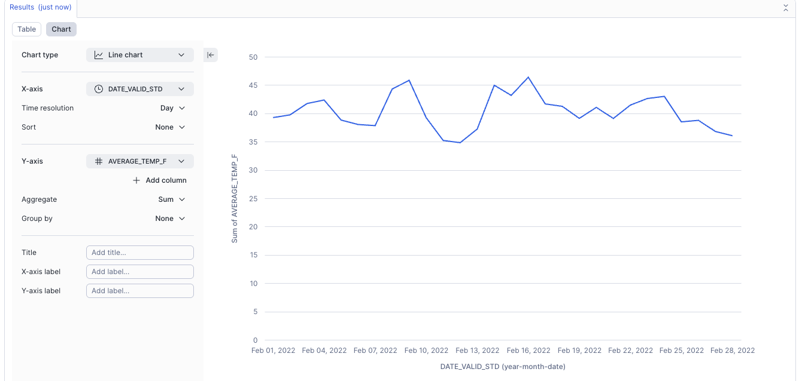

#### Step 4 - Create a Sales and Weather View

Let's take it a step further and combine our `orders_v` view with our new `daily_weather_v` to see how sales correlate with weather conditions.

```sql
CREATE OR REPLACE VIEW analytics.daily_sales_by_weather_v
COMMENT = 'Daily Weather Metrics and Orders Data'
AS
WITH daily_orders_aggregated AS (
    SELECT DATE(o.order_ts) AS order_date, o.primary_city, o.country,
        o.menu_item_name, SUM(o.price) AS total_sales
    FROM harmonized.orders_v o
    GROUP BY ALL
)
SELECT
    dw.date_valid_std AS date, dw.city_name, dw.country_desc,
    ZEROIFNULL(doa.total_sales) AS daily_sales, doa.menu_item_name,
    ROUND(dw.avg_temperature_air_2m_f, 2) AS avg_temp_fahrenheit,
    ROUND(dw.tot_precipitation_in, 2) AS avg_precipitation_inches,
    ROUND(dw.tot_snowdepth_in, 2) AS avg_snowdepth_inches,
    dw.max_wind_speed_100m_mph AS max_wind_speed_mph
FROM harmonized.daily_weather_v dw
LEFT JOIN daily_orders_aggregated doa
    ON dw.date_valid_std = doa.order_date
    AND dw.city_name = doa.primary_city
    AND dw.country_desc = doa.country
ORDER BY date ASC;
```

#### Step 5 - Answer a Business Question

Our analyst can now answer complex business questions, such as: "How does significant precipitation impact our sales figures in the Seattle market?" 

```sql
SELECT * EXCLUDE (city_name, country_desc, avg_snowdepth_inches, max_wind_speed_mph)
FROM analytics.daily_sales_by_weather_v
WHERE 
    country_desc = 'United States'
    AND city_name = 'Seattle'
    AND avg_precipitation_inches >= 1.0
ORDER BY date ASC;
```

Let's also visualize the results again in Snowsight, but as a bar chart this time.

1.  Run the query above.
2.  In the **Results** pane, click **Chart**.
3.  Set the **Chart Type** to `Bar`.
4.  Set the **X-Axis** to `MENU_ITEM_NAME`.
5.  Set the **Y-Axis** to `DAILY_SALES`.

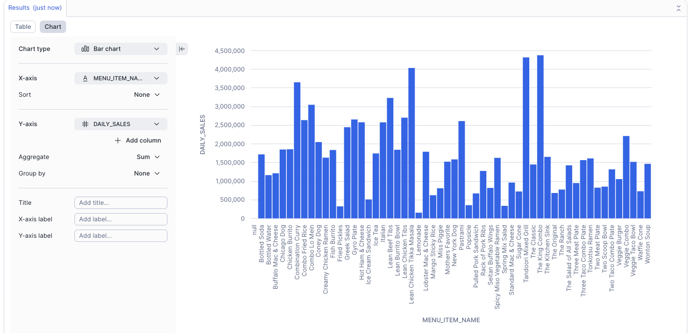

### Explore Point-of-Interest Data


#### Overview

Our analyst now wants more insight into the specific locations of our food trucks. We can get Point-of-Interest (POI) data from Safegraph, another provider on the Snowflake Marketplace, to enrich our analysis even further.

#### Step 1 - Acquire Safegraph POI Data

Follow the same procedure as before to acquire the Safegraph data from the Marketplace.

1.  Ensure you are using the `ACCOUNTADMIN` role.
2.  Navigate to **Data Products** » **Marketplace**.
3.  In the search bar, enter: `safegraph frostbyte`.
4.  Select the **Safegraph: frostbyte** listing and click **Get**.
5.  Click to expand the Options, then set the **Database name** to `ZTS_SAFEGRAPH`.
6.  Grant access to the **PUBLIC** role.
7.  Click **Get**.

#### Step 2 - Create a POI View

Let's create a view that joins our internal `location` data with the Safegraph POI data.

```sql
CREATE OR REPLACE VIEW harmonized.tastybytes_poi_v
AS 
SELECT 
    l.location_id, sg.postal_code, sg.country, sg.city, sg.iso_country_code,
    sg.location_name, sg.top_category, sg.category_tags,
    sg.includes_parking_lot, sg.open_hours
FROM raw_pos.location l
JOIN zts_safegraph.public.frostbyte_tb_safegraph_s sg 
    ON l.location_id = sg.location_id
    AND l.iso_country_code = sg.iso_country_code;
```

#### Step 3 - Combine POI and Weather Data

Now we can combine all three datasets: our internal data, the weather data, and the POI data. Let's find our top 3 windiest truck locations in the US in 2022.

```sql
SELECT TOP 3
    p.location_id, p.city, p.postal_code,
    AVG(hd.max_wind_speed_100m_mph) AS average_wind_speed
FROM harmonized.tastybytes_poi_v AS p
JOIN zts_weathersource.onpoint_id.history_day AS hd
    ON p.postal_code = hd.postal_code
WHERE
    p.country = 'United States'
    AND YEAR(hd.date_valid_std) = 2022
GROUP BY p.location_id, p.city, p.postal_code
ORDER BY average_wind_speed DESC;
```

#### Step 4 - Analyze Brand Resilience to Weather

Finally, let's conduct a more complex analysis to determine brand resilience. We'll use a Common Table Expression (CTE) to first find the windiest locations, and then compare sales on "calm" vs. "windy" days for each truck brand at those locations. This can help inform operational decisions, like offering "Windy Day" promotions for brands that are less resilient.

```sql
WITH TopWindiestLocations AS (
    SELECT TOP 3
        p.location_id
    FROM harmonized.tastybytes_poi_v AS p
    JOIN zts_weathersource.onpoint_id.history_day AS hd ON p.postal_code = hd.postal_code
    WHERE p.country = 'United States' AND YEAR(hd.date_valid_std) = 2022
    GROUP BY p.location_id, p.city, p.postal_code
    ORDER BY AVG(hd.max_wind_speed_100m_mph) DESC
)
SELECT
    o.truck_brand_name,
    ROUND(AVG(CASE WHEN hd.max_wind_speed_100m_mph <= 20 THEN o.order_total END), 2) AS avg_sales_calm_days,
    ZEROIFNULL(ROUND(AVG(CASE WHEN hd.max_wind_speed_100m_mph > 20 THEN o.order_total END), 2)) AS avg_sales_windy_days
FROM analytics.orders_v AS o
JOIN zts_weathersource.onpoint_id.history_day AS hd
    ON o.primary_city = hd.city_name AND DATE(o.order_ts) = hd.date_valid_std
WHERE o.location_id IN (SELECT location_id FROM TopWindiestLocations)
GROUP BY o.truck_brand_name
ORDER BY o.truck_brand_name;
```

### Introduction to Streamlit in Snowflake


Streamlit is an open-source Python library designed for easily creating and sharing web applications for machine learning and data science. It allows for the rapid development and deployment of data-driven apps.

Streamlit in Snowflake empowers developers to securely build, deploy, and share applications directly within Snowflake. This integration allows you to build apps that process and utilize data stored in Snowflake without the need of moving the data or application code to an external system.
***
#### Step 1 - Create Streamlit App
**Let's create our first Streamlit app, an app that will display and chart sales data for each menu item in Japan for February 2022.**

1. First, navigate to **Projects** » **Streamlit**, then click on the blue '+ Streamlit App' button in the top right to create a new app.

2. Enter these values in the 'Create Streamlit App' pop-up:
    - App title: Menu Item Sales
    - App location:
        - Database: tb_101
        - Schema: Analytics
    - App warehouse: tb_dev_wh
3. Now click 'Create'.
When the app first loads, you'll see a sample app on the right pane and the app's code in the editor pane to the left.

4. Select all of the code and remove it.
5. **Next copy + paste this [code](https://github.com/Snowflake-Labs/sfguide-getting-started-from-zero-to-snowflake/blob/main/streamlit/streamlit_app.py) in the blank editor window, then click 'Run' in the top right.**


## Conclusion and Resources

#### Overview

Congratulations! You have successfully completed the entire Tasty Bytes - Zero to Snowflake journey.

You have now built and configured warehouses, cloned and transformed data, recovered a dropped table with Time Travel, and built an automated data pipeline for semi-structured data. You've also unlocked insights using AI by generating analysis with simple AISQL functions and accelerating your workflow with Snowflake Copilot. Furthermore, you have implemented a robust governance framework with roles and policies and seamlessly enriched your own data with live datasets from the Snowflake Marketplace.

If you would like to re-run this Quickstart, please run the complete `RESET` script located at the bottom of your SQL file.

#### What You Learned
- **Warehousing and Performance:** How to create, manage, and scale virtual warehouses, and leverage Snowflake's results cache.
- **Data Transformation:** How to use Zero-Copy Cloning for safe development, transform data, and instantly recover from errors using Time Travel and `UNDROP`.
- **Data Pipelines:** How to ingest data from external stages, process semi-structured `VARIANT` data, and build automated ELT pipelines with Dynamic Tables.
- **Snowflake Cortex AI** How to leverage Snowflake Cortex AI to build a customer analytics platform.
- **Data Governance:** How to implement a security framework using Role-Based Access Control, automated PII classification, tag-based Data Masking, and Row Access Policies.
- **Data Collaboration:** How to discover and acquire live, third-party datasets from the Snowflake Marketplace and seamlessly join them with your own data to generate new insights.

#### Resources
- [Virtual Warehouses & Settings](https://docs.snowflake.com/en/user-guide/warehouses-overview)
- [Resource Monitors](https://docs.snowflake.com/en/user-guide/resource-monitors)
- [Budgets](https://docs.snowflake.com/en/user-guide/budgets)
- [Universal Search](https://docs.snowflake.com/en/user-guide/ui-snowsight-universal-search)
- [Ingestion from External Stage](https://docs.snowflake.com/en/sql-reference/sql/copy-into-table)
- [Semi-Structured Data](https://docs.snowflake.com/en/sql-reference/data-types-semistructured)
- [Dynamic Tables](https://docs.snowflake.com/en/user-guide/dynamic-tables-about)
- [Roles & Access Control](https://docs.snowflake.com/en/user-guide/security-access-control-overview)
- [Tag-Based Classification](https://docs.snowflake.com/en/user-guide/classify-auto)
- [Column Level Security with Masking Policies](https://docs.snowflake.com/en/user-guide/security-column-intro)
- [Row Level Security with Row Access Policies](https://docs.snowflake.com/en/user-guide/security-row-intro)
- [Data Metric Functions](https://docs.snowflake.com/en/user-guide/data-quality-intro)
- [Trust Center](https://docs.snowflake.com/en/user-guide/trust-center/overview)
- [Data Sharing](https://docs.snowflake.com/en/user-guide/data-sharing-intro)
- [Snowflake Cortex Playground](https://docs.snowflake.com/en/user-guide/snowflake-cortex/cortex-playground)
- [AI SQL Functions in Snowflake Cortex](https://docs.snowflake.com/en/user-guide/snowflake-cortex/aisql)
<!-- - [Snowflake Copilot](https://docs.snowflake.com/en/user-guide/snowflake-copilot) -->
- [Snowflake Cortex Search Overview](https://docs.snowflake.com/en/user-guide/snowflake-cortex/cortex-search/cortex-search-overview)
- [Snowflake Cortex Analyst](https://docs.snowflake.com/en/user-guide/snowflake-cortex/cortex-analyst)
